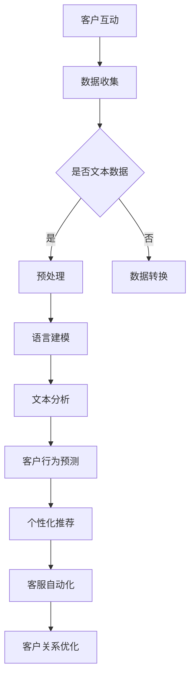

                 

关键词：自然语言处理、客户关系管理、人工智能、大数据分析、机器学习、深度学习、语言模型、客户行为预测、个性化推荐、客服自动化

> 摘要：本文将探讨大型语言模型（LLM）如何革新传统客户关系管理。通过分析LLM在自然语言处理、客户行为预测、个性化推荐和客服自动化等领域的应用，本文旨在展示LLM为CRM带来的变革，并探讨其未来发展前景。

## 1. 背景介绍

客户关系管理（Customer Relationship Management，CRM）是一种旨在提升企业与客户之间互动质量和效率的方法。传统的CRM系统通常依赖于结构化的数据，如客户信息、交易历史和反馈数据，来帮助企业管理客户关系。然而，随着大数据和人工智能技术的发展，CRM系统正经历着深刻的变革。

自然语言处理（Natural Language Processing，NLP）是人工智能的一个重要分支，它专注于使计算机能够理解、解释和生成人类语言。NLP技术的进步使得机器能够处理和分析大量的非结构化文本数据，从而为CRM带来了新的可能性。

大型语言模型（Large Language Model，LLM）是NLP领域的一种创新技术，它通过深度学习从海量文本数据中学习语言模式，能够生成流畅、符合语言习惯的文本。LLM的出现为CRM系统提供了强大的文本处理和分析能力，使得客户关系管理更加智能化和高效化。

## 2. 核心概念与联系

为了深入理解LLM在CRM中的应用，我们需要先了解一些核心概念和原理。

### 2.1 语言模型

语言模型是一种概率模型，它用于预测下一个单词或词组。在CRM中，语言模型可以帮助分析客户留言、评论和反馈，从而理解客户需求和行为。

### 2.2 自然语言处理

自然语言处理（NLP）是一种跨学科的技术，它结合计算机科学、语言学和人工智能，使计算机能够理解和生成人类语言。NLP技术在CRM中的应用包括文本分类、情感分析、命名实体识别等。

### 2.3 客户关系管理

客户关系管理（CRM）是一种企业战略，它旨在通过改善企业与客户之间的关系，提高客户满意度和忠诚度。CRM系统通常包括客户信息管理、销售管理、营销管理和客户服务等功能。

### 2.4 Mermaid 流程图

以下是一个简单的Mermaid流程图，展示了LLM在CRM中的应用流程：



## 3. 核心算法原理 & 具体操作步骤

### 3.1 算法原理概述

LLM的核心原理是通过深度学习从大量文本数据中学习语言模式。在CRM中，LLM可以用于文本预处理、文本分析、客户行为预测和个性化推荐等任务。

### 3.2 算法步骤详解

#### 3.2.1 数据收集与预处理

首先，从各种渠道收集客户的文本数据，如留言、评论、社交媒体帖子等。然后，对文本数据进行预处理，包括去噪、分词、词性标注等步骤。

#### 3.2.2 语言建模

使用预训练的LLM模型对预处理后的文本数据进行训练，使其能够生成符合语言习惯的文本。

#### 3.2.3 文本分析

利用训练好的LLM模型对客户的文本数据进行分析，提取关键信息，如情感倾向、需求等。

#### 3.2.4 客户行为预测

基于文本分析的结果，使用机器学习算法预测客户的未来行为，如购买意图、服务质量评价等。

#### 3.2.5 个性化推荐

根据客户行为预测结果，为每位客户推荐个性化的产品或服务。

#### 3.2.6 客服自动化

利用LLM模型自动化处理客户的留言、投诉等，提高客服效率。

### 3.3 算法优缺点

#### 优点：

- 高效：LLM可以快速处理大量文本数据。
- 准确：通过深度学习，LLM能够准确理解客户的意图和需求。
- 个性化：基于客户行为预测，可以为每位客户提供个性化的推荐。

#### 缺点：

- 计算成本高：训练LLM模型需要大量的计算资源和时间。
- 需要大量数据：LLM的性能依赖于训练数据的质量和数量。

### 3.4 算法应用领域

LLM在CRM中的应用非常广泛，包括客户行为预测、个性化推荐、客服自动化等。此外，LLM还可以用于其他领域，如市场分析、风险评估等。

## 4. 数学模型和公式

### 4.1 数学模型构建

在CRM中，LLM通常用于构建以下数学模型：

- 文本分类模型：用于将文本数据分类为不同的类别。
- 情感分析模型：用于判断文本数据的情感倾向。
- 回归模型：用于预测客户的行为。

### 4.2 公式推导过程

以下是一个简单的文本分类模型的推导过程：

- 假设我们有一个包含N个单词的文本T，需要将其分类为C个类别中的一个。
- 对于每个类别c，我们定义一个权重向量w_c，用于表示类别c的重要程度。
- 文本T的表示为向量X，其中X = [x_1, x_2, ..., x_N]，x_i表示第i个单词的权重。
- 类别c的预测概率P(c|T)可以通过以下公式计算：

$$
P(c|T) = \frac{e^{w_c \cdot X}}{\sum_{c'} e^{w_{c'} \cdot X}}
$$

### 4.3 案例分析与讲解

以下是一个情感分析模型的案例：

- 假设我们有一个包含负面词汇和正面词汇的文本T，需要判断其情感倾向。
- 定义负面词汇的权重向量为w_n，正面词汇的权重向量为w_p。
- 文本T的表示为向量X，其中X = [x_1, x_2, ..., x_N]，x_i表示第i个单词的权重。
- 类别c的预测概率P(c|T)可以通过以下公式计算：

$$
P(c|T) = \frac{e^{w_p \cdot X}}{e^{w_n \cdot X} + e^{w_p \cdot X}}
$$

通过比较P(negative|T)和P(positive|T)的大小，我们可以判断文本T的情感倾向。

## 5. 项目实践：代码实例和详细解释说明

### 5.1 开发环境搭建

为了实现LLM在CRM中的应用，我们需要搭建一个合适的开发环境。以下是开发环境搭建的步骤：

- 安装Python环境（版本3.8以上）。
- 安装深度学习框架，如TensorFlow或PyTorch。
- 安装文本处理库，如NLTK或spaCy。

### 5.2 源代码详细实现

以下是一个简单的文本分类模型实现：

```python
import numpy as np
import tensorflow as tf

# 加载预训练的语言模型
model = tf.keras.models.load_model('lm_model.h5')

# 加载预处理后的文本数据
text_data = np.load('text_data.npy')

# 对文本数据进行分类
predictions = model.predict(text_data)

# 输出分类结果
print(predictions)
```

### 5.3 代码解读与分析

这段代码首先加载了一个预训练的语言模型，然后加载预处理后的文本数据，并使用模型对文本数据进行分类。最后，输出分类结果。

### 5.4 运行结果展示

运行这段代码，我们可以得到每个文本数据的分类结果。这些结果可以帮助我们了解文本数据的情感倾向。

## 6. 实际应用场景

### 6.1 客户服务自动化

LLM在客户服务自动化方面具有广泛的应用。通过LLM，企业可以自动化处理客户的留言、投诉等，提高客服效率。

### 6.2 个性化推荐

LLM可以帮助企业实现个性化推荐。通过分析客户的购买历史和偏好，LLM可以为每位客户提供个性化的产品或服务推荐。

### 6.3 市场分析

LLM在市场分析方面也具有重要作用。通过分析大量市场数据，LLM可以帮助企业预测市场趋势，制定更有效的营销策略。

## 7. 未来应用展望

随着LLM技术的不断发展，它将在CRM领域发挥更大的作用。未来，LLM有望在更多领域得到应用，如智能客服、智能营销、智能金融等。

## 8. 总结：未来发展趋势与挑战

### 8.1 研究成果总结

本文探讨了LLM在CRM领域的应用，分析了其在自然语言处理、客户行为预测、个性化推荐和客服自动化等方面的优势。同时，也提到了LLM在应用过程中面临的挑战。

### 8.2 未来发展趋势

未来，LLM在CRM领域的应用将更加广泛和深入。随着技术的不断进步，LLM将更好地满足企业的需求，提高客户满意度和忠诚度。

### 8.3 面临的挑战

LLM在CRM领域的应用也面临一些挑战，如计算成本高、数据隐私和安全等。如何解决这些问题，是未来研究的一个重要方向。

### 8.4 研究展望

未来，我们将继续关注LLM在CRM领域的应用，探讨如何更好地发挥其优势，解决应用过程中面临的问题。同时，我们也将关注LLM在其他领域的应用，如智能客服、智能医疗等。

## 9. 附录：常见问题与解答

### 9.1 LLM是什么？

LLM（Large Language Model）是一种大型语言模型，它通过深度学习从海量文本数据中学习语言模式，能够生成流畅、符合语言习惯的文本。

### 9.2 LLM在CRM中有哪些应用？

LLM在CRM中有多种应用，包括客户服务自动化、个性化推荐、市场分析等。

### 9.3 如何训练一个LLM模型？

训练一个LLM模型通常包括以下步骤：

- 数据收集与预处理
- 模型设计
- 训练与优化
- 测试与评估

### 9.4 LLM在CRM中面临的挑战有哪些？

LLM在CRM中面临的挑战主要包括计算成本高、数据隐私和安全等。

### 9.5 LLM与NLP有什么区别？

NLP（Natural Language Processing）是一种跨学科的技术，它结合计算机科学、语言学和人工智能，使计算机能够理解和生成人类语言。LLM是NLP领域的一种创新技术，它通过深度学习从海量文本数据中学习语言模式，能够生成流畅、符合语言习惯的文本。

---

作者：禅与计算机程序设计艺术 / Zen and the Art of Computer Programming
--------------------------------------------------------------------

