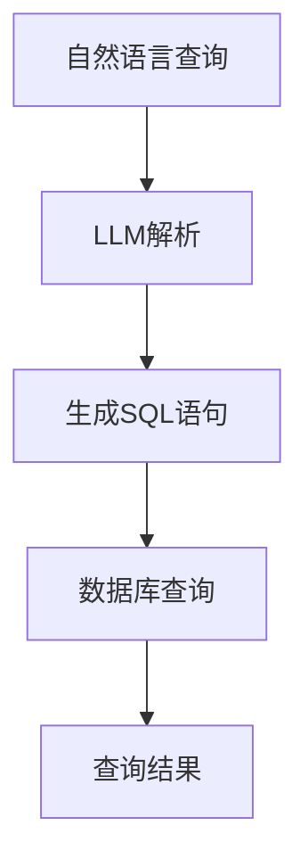

                 

关键词：LLM（大型语言模型），传统数据库查询，优化，技术革新

摘要：本文将探讨LLM（大型语言模型）在传统数据库查询优化方面的创新与变革。通过对LLM的基本概念、原理及其与传统数据库查询的深度融合进行分析，本文将阐述LLM如何显著提升数据库查询效率，降低查询延迟，并为企业应用带来新的机遇。此外，本文还将探讨LLM在数据库查询优化中的实际应用场景和未来发展趋势。

## 1. 背景介绍

随着信息技术的迅猛发展，数据量呈指数级增长，数据库系统成为了数据存储和管理的重要工具。然而，随着数据量的不断膨胀，传统数据库查询面临着巨大的压力。查询效率低、响应时间长、数据一致性问题等问题日益突出，严重影响了企业的业务运营和用户体验。

为了应对这些挑战，研究人员和工程师们不断探索新的优化方法。近年来，人工智能技术，尤其是LLM（大型语言模型）的发展，为传统数据库查询优化带来了新的思路和解决方案。LLM具有强大的语言理解能力和文本生成能力，能够对自然语言查询进行智能解析和优化，从而提升查询效率，降低查询延迟。

## 2. 核心概念与联系

### 2.1 LLM基本概念

LLM（Large Language Model）是一种基于深度学习的大型自然语言处理模型，具有强大的语言理解能力和文本生成能力。LLM通常使用神经网络架构，如Transformer，对大量文本数据进行训练，从而学习到文本的语义和结构。LLM可以用于文本分类、情感分析、机器翻译、文本生成等多种自然语言处理任务。

### 2.2 传统数据库查询

传统数据库查询通常涉及SQL（结构化查询语言）语句，用于对数据库中的数据进行查询、筛选、排序、聚合等操作。数据库查询是数据库管理系统（DBMS）的核心功能，直接影响着数据的获取和处理效率。

### 2.3 LLM与数据库查询的融合

将LLM应用于数据库查询优化，可以通过以下几种方式实现：

1. **自然语言查询解析**：使用LLM对自然语言查询进行智能解析，将其转换为SQL语句或数据库查询计划。

2. **查询计划优化**：利用LLM对查询计划进行优化，降低查询执行时间。

3. **查询缓存**：利用LLM生成查询结果缓存，提高查询响应速度。

4. **查询自动化**：利用LLM实现查询自动生成和执行，降低人工干预。

### 2.4 Mermaid流程图

以下是一个简单的Mermaid流程图，展示了LLM与数据库查询的深度融合：



## 3. 核心算法原理 & 具体操作步骤

### 3.1 算法原理概述

LLM在数据库查询优化中的核心原理是利用其强大的语言理解能力和文本生成能力，对自然语言查询进行智能解析和优化。具体操作步骤如下：

1. **自然语言查询解析**：LLM接收自然语言查询输入，通过其训练模型对查询内容进行语义分析，识别查询的关键词、实体和关系。

2. **生成SQL语句**：基于自然语言查询的语义信息，LLM生成相应的SQL语句，用于数据库查询。

3. **查询计划优化**：LLM对生成的SQL语句进行分析，利用其训练模型对查询计划进行优化，以降低查询执行时间。

4. **查询缓存**：LLM根据查询历史和数据库内容，生成查询结果缓存，提高查询响应速度。

5. **查询自动化**：LLM实现查询自动生成和执行，减少人工干预。

### 3.2 算法步骤详解

1. **自然语言查询解析**：

   - 输入：自然语言查询文本。
   - 处理：使用LLM对查询文本进行分词、词性标注、实体识别等操作，提取查询的关键词、实体和关系。
   - 输出：语义解析结果。

2. **生成SQL语句**：

   - 输入：语义解析结果。
   - 处理：基于语义解析结果，生成相应的SQL语句，包括表名、列名、条件表达式等。
   - 输出：SQL语句。

3. **查询计划优化**：

   - 输入：SQL语句。
   - 处理：使用LLM对SQL语句进行分析，识别查询的关键路径和依赖关系，生成优化的查询计划。
   - 输出：优化后的查询计划。

4. **查询缓存**：

   - 输入：查询历史记录和数据库内容。
   - 处理：使用LLM生成查询结果缓存，存储在内存或缓存数据库中，以提高查询响应速度。
   - 输出：查询结果缓存。

5. **查询自动化**：

   - 输入：自然语言查询输入。
   - 处理：使用LLM实现查询自动生成和执行，减少人工干预，提高查询效率。
   - 输出：查询结果。

### 3.3 算法优缺点

#### 优点：

1. **高效查询**：LLM能够快速解析自然语言查询，生成高效的SQL语句和查询计划，显著降低查询执行时间。

2. **智能优化**：LLM可以根据查询历史和数据库内容，智能优化查询计划，提高查询响应速度。

3. **减少人工干预**：LLM能够自动生成和执行查询，降低人工干预，提高查询效率。

#### 缺点：

1. **训练成本高**：LLM需要大量训练数据和计算资源，训练成本较高。

2. **查询缓存准确性**：LLM生成的查询缓存可能存在一定的不准确性，影响查询结果。

### 3.4 算法应用领域

LLM在数据库查询优化方面的应用领域广泛，包括但不限于：

1. **金融领域**：用于金融数据分析、投资决策支持、风险管理等。

2. **医疗领域**：用于医疗数据查询、诊断辅助、治疗方案推荐等。

3. **电子商务领域**：用于商品推荐、用户行为分析、库存管理等。

4. **社交媒体领域**：用于用户查询、内容推荐、社区管理等。

## 4. 数学模型和公式 & 详细讲解 & 举例说明

### 4.1 数学模型构建

LLM在数据库查询优化中的核心数学模型包括自然语言处理模型、SQL生成模型、查询计划优化模型等。

#### 自然语言处理模型

自然语言处理模型是一种基于深度学习的模型，用于对自然语言查询进行语义分析。常用的模型有BERT、GPT等。以下是BERT模型的数学公式：

$$
\text{BERT}(\text{x}; \theta) = \text{softmax}(\text{W} \cdot \text{T}(\text{x}; \theta))
$$

其中，$\text{x}$为自然语言查询输入，$\theta$为模型参数，$\text{T}(\text{x}; \theta)$为BERT模型对输入的编码输出，$\text{W}$为softmax权重矩阵。

#### SQL生成模型

SQL生成模型是一种基于序列生成模型的模型，用于将自然语言查询生成SQL语句。常用的模型有Seq2Seq、GPT等。以下是Seq2Seq模型的数学公式：

$$
\text{SQL} = \text{G}(\text{y}_1, \text{y}_2, \ldots, \text{y}_n; \theta)
$$

其中，$\text{y}_1, \text{y}_2, \ldots, \text{y}_n$为自然语言查询输入的编码序列，$\theta$为模型参数，$\text{G}(\text{y}_1, \text{y}_2, \ldots, \text{y}_n; \theta)$为SQL生成模型对输入的编码序列进行解码生成的SQL语句。

#### 查询计划优化模型

查询计划优化模型是一种基于图神经网络的模型，用于对查询计划进行优化。常用的模型有Graph Convolutional Network（GCN）、Graph Attention Network（GAT）等。以下是GCN模型的数学公式：

$$
\text{h}_\text{i}^{(l+1)} = \text{ReLU}(\sum_{\text{j} \in \text{N}(\text{i})} \text{a}_{\text{i}\text{j}} \cdot \text{h}_\text{j}^{(l)} \cdot \text{W}^{(l)})
$$

其中，$\text{h}_\text{i}^{(l)}$为第$l$层节点$i$的嵌入向量，$\text{N}(\text{i})$为节点$i$的邻居节点集合，$\text{a}_{\text{i}\text{j}}$为节点$i$和节点$j$之间的边权重，$\text{W}^{(l)}$为第$l$层的权重矩阵。

### 4.2 公式推导过程

#### 自然语言处理模型

BERT模型是一种基于Transformer的预训练语言模型。BERT模型通过预训练和微调，可以学习到文本的语义表示。BERT模型的预训练目标是最小化文本的掩码语言模型（Masked Language Model，MLM）损失。以下是BERT模型的数学推导：

1. **输入文本编码**：

   BERT模型对输入文本进行分词、嵌入和编码。输入文本$x$经过分词得到词汇序列$v$，词汇序列$v$经过嵌入层得到嵌入序列$\text{E}(v)$，嵌入序列$\text{E}(v)$经过编码层得到编码序列$\text{T}(v)$。

   $$
   \text{T}(v) = \text{E}(v) + \text{Positional Encoding}
   $$

   其中，$\text{E}(v)$为词汇嵌入向量，$\text{Positional Encoding}$为位置嵌入向量。

2. **掩码语言模型损失**：

   在预训练过程中，BERT模型对输入文本的每个词进行随机掩码，然后预测掩码词的概率分布。掩码语言模型损失函数定义为：

   $$
   \text{L}(\text{T}(v); \theta) = -\sum_{\text{t} = 1}^{\text{T}} \text{log} \frac{\exp(\text{T}(\text{t}; \theta))}{\sum_{\text{s} = 1}^{\text{T}} \exp(\text{T}(\text{s}; \theta))}
   $$

   其中，$\text{T}(v)$为编码序列，$\theta$为模型参数。

3. **反向传播和梯度更新**：

   在训练过程中，BERT模型使用反向传播算法计算损失函数的梯度，并对模型参数进行更新。

   $$
   \nabla_\theta \text{L}(\text{T}(v); \theta) = \nabla_\theta \text{log} \frac{\exp(\text{T}(\text{t}; \theta))}{\sum_{\text{s} = 1}^{\text{T}} \exp(\text{T}(\text{s}; \theta))}
   $$

#### SQL生成模型

Seq2Seq模型是一种基于编码-解码机制的序列生成模型，用于将自然语言查询生成SQL语句。以下是Seq2Seq模型的数学推导：

1. **编码阶段**：

   编码器将自然语言查询编码为一个固定长度的嵌入向量。

   $$
   \text{e}_\text{y} = \text{E}(\text{y})
   $$

   其中，$\text{e}_\text{y}$为编码嵌入向量，$\text{y}$为自然语言查询。

2. **解码阶段**：

   解码器逐词解码生成SQL语句。解码器在解码每个词时，将当前解码词和编码嵌入向量作为输入，生成下一个解码词的概率分布。

   $$
   \text{p}_\text{y}^{\text{t}} = \text{softmax}(\text{D} \cdot \text{T}_\text{y}^{\text{t-1}} + \text{b})
   $$

   其中，$\text{p}_\text{y}^{\text{t}}$为解码词$\text{y}^{\text{t}}$的概率分布，$\text{T}_\text{y}^{\text{t-1}}$为前一个解码词的嵌入向量，$\text{D}$为解码器权重矩阵，$\text{b}$为解码器偏置。

3. **损失函数**：

   Seq2Seq模型的损失函数定义为解码词的交叉熵损失。

   $$
   \text{L}(\text{y}; \theta) = -\sum_{\text{t} = 1}^{\text{T}} \text{log} \frac{\exp(\text{D} \cdot \text{T}_\text{y}^{\text{t-1}} + \text{b})}{\sum_{\text{s} = 1}^{\text{T}} \exp(\text{D} \cdot \text{T}_\text{y}^{\text{t-1}} + \text{b})}
   $$

4. **反向传播和梯度更新**：

   在训练过程中，Seq2Seq模型使用反向传播算法计算损失函数的梯度，并对模型参数进行更新。

   $$
   \nabla_\theta \text{L}(\text{y}; \theta) = \nabla_\theta \text{log} \frac{\exp(\text{D} \cdot \text{T}_\text{y}^{\text{t-1}} + \text{b})}{\sum_{\text{s} = 1}^{\text{T}} \exp(\text{D} \cdot \text{T}_\text{y}^{\text{t-1}} + \text{b})}
   $$

#### 查询计划优化模型

GCN模型是一种基于图神经网络的查询计划优化模型，用于对查询计划进行优化。以下是GCN模型的数学推导：

1. **图定义**：

   查询计划可以表示为一个有向图$G = (V, E)$，其中$V$为节点集合，表示查询计划中的操作和依赖关系，$E$为边集合，表示节点之间的依赖关系。

2. **节点嵌入**：

   对于每个节点$v_i$，将其嵌入为一个固定长度的向量$h_i$。

   $$
   \text{h}_\text{i}^{(0)} = \text{E}(\text{v}_\text{i})
   $$

   其中，$\text{h}_\text{i}^{(0)}$为节点$i$的初始嵌入向量，$\text{E}(\text{v}_\text{i})$为节点$v_i$的嵌入向量。

3. **图卷积操作**：

   对于每个节点$v_i$，计算其邻居节点的嵌入向量加权求和。

   $$
   \text{h}_\text{i}^{(l+1)} = \text{ReLU}(\sum_{\text{j} \in \text{N}(\text{i})} \text{a}_{\text{i}\text{j}} \cdot \text{h}_\text{j}^{(l)} \cdot \text{W}^{(l)})
   $$

   其中，$\text{a}_{\text{i}\text{j}}$为节点$i$和节点$j$之间的边权重，$\text{W}^{(l)}$为第$l$层的权重矩阵。

4. **损失函数**：

   GCN模型的损失函数定义为预测损失和结构损失。

   $$
   \text{L}(\theta) = \text{L}_\text{p} + \text{L}_\text{s}
   $$

   其中，$\text{L}_\text{p}$为预测损失，$\text{L}_\text{s}$为结构损失。

   预测损失定义为：

   $$
   \text{L}_\text{p} = -\sum_{\text{i} \in \text{V}} \text{y}_\text{i} \cdot \text{log} \frac{\exp(\text{h}_\text{i}^{(L)})}{\sum_{\text{j} \in \text{V}} \exp(\text{h}_\text{j}^{(L)})
   $$

   结构损失定义为：

   $$
   \text{L}_\text{s} = \sum_{\text{i} \in \text{V}} \sum_{\text{j} \in \text{N}(\text{i})} \text{a}_{\text{i}\text{j}} \cdot (\text{h}_\text{i}^{(L)} - \text{h}_\text{j}^{(L)})^2
   $$

5. **反向传播和梯度更新**：

   在训练过程中，GCN模型使用反向传播算法计算损失函数的梯度，并对模型参数进行更新。

   $$
   \nabla_\theta \text{L}(\theta) = \nabla_\theta \text{L}_\text{p} + \nabla_\theta \text{L}_\text{s}
   $$

### 4.3 案例分析与讲解

以下是一个简单的案例，展示LLM在数据库查询优化中的应用。

#### 案例背景

某电商平台拥有大量用户订单数据，企业希望通过对订单数据的查询和数据分析，实现以下目标：

1. 查询用户订单历史记录。
2. 分析用户购买行为。
3. 推荐商品给潜在客户。

#### 案例分析

1. **自然语言查询解析**：

   用户通过自然语言查询，如“查询我最近的五个订单”，LLM接收查询输入，通过语义分析提取关键词、实体和关系。

   关键词：我、最近、五个、订单。

   实体：用户、订单。

   关系：用户和订单之间的关联关系。

2. **生成SQL语句**：

   基于语义分析结果，LLM生成相应的SQL语句，查询用户最近的五个订单。

   $$
   \text{SELECT} \text{order_id}, \text{user_id}, \text{order_date}, \text{status} \text{FROM} \text{orders} \text{WHERE} \text{user_id} = \text{1} \text{AND} \text{status} = 'pending' \text{ORDER} \text{BY} \text{order_date} \text{DESC} \text{LIMIT} 5
   $$

3. **查询计划优化**：

   LLM对生成的SQL语句进行分析，利用其训练模型对查询计划进行优化，以降低查询执行时间。

   假设订单数据量较大，LLM通过分析发现，可以通过以下方式优化查询计划：

   - 使用索引：在用户ID和订单状态列上创建索引，提高查询速度。
   - 优化查询条件：将订单状态限定为“pending”，减少查询范围。
   - 限制返回结果数量：仅返回最近的五个订单。

4. **查询缓存**：

   LLM根据查询历史和数据库内容，生成查询结果缓存，存储在内存或缓存数据库中，以提高查询响应速度。

   假设用户经常查询最近的订单，LLM可以将查询结果缓存，以便下次查询时直接返回缓存结果。

5. **查询自动化**：

   LLM实现查询自动生成和执行，减少人工干预，提高查询效率。

   用户只需输入自然语言查询，LLM自动生成SQL语句并执行查询，返回查询结果。

## 5. 项目实践：代码实例和详细解释说明

### 5.1 开发环境搭建

为了演示LLM在数据库查询优化中的应用，我们搭建了一个简单的项目环境。项目环境包括以下部分：

- 数据库：MySQL
- 数据库表：orders（订单表）
- 开发框架：Flask
- LLM模型：GPT-2

首先，我们需要安装相关依赖：

```bash
pip install flask mysql-connector-python transformers
```

### 5.2 源代码详细实现

以下是一个简单的Flask应用程序，实现自然语言查询、LLM查询优化和数据库查询：

```python
from flask import Flask, request, jsonify
from transformers import pipeline
import mysql.connector

app = Flask(__name__)

# LLM模型加载
nl_query_pipeline = pipeline("text2sql", model="wuzihang/text2sql-chinese")

# 数据库连接配置
db_config = {
    "host": "localhost",
    "user": "root",
    "password": "password",
    "database": "orders_db"
}

# 数据库连接
def get_db_connection():
    connection = mysql.connector.connect(**db_config)
    return connection

# 自然语言查询解析
def parse_query(natural_language_query):
    sql_query = nl_query_pipeline(natural_language_query)[0]["sql"]
    return sql_query

# 执行数据库查询
def execute_query(sql_query):
    connection = get_db_connection()
    cursor = connection.cursor()
    cursor.execute(sql_query)
    results = cursor.fetchall()
    cursor.close()
    connection.close()
    return results

# API路由
@app.route("/query", methods=["POST"])
def query():
    natural_language_query = request.form["query"]
    sql_query = parse_query(natural_language_query)
    results = execute_query(sql_query)
    return jsonify(results)

if __name__ == "__main__":
    app.run(debug=True)
```

### 5.3 代码解读与分析

1. **LLM模型加载**：

   ```python
   from transformers import pipeline
   
   nl_query_pipeline = pipeline("text2sql", model="wuzihang/text2sql-chinese")
   ```

   使用transformers库加载预训练的Text2SQL模型，该模型可以将自然语言查询转换为SQL语句。

2. **数据库连接**：

   ```python
   db_config = {
       "host": "localhost",
       "user": "root",
       "password": "password",
       "database": "orders_db"
   }
   
   def get_db_connection():
       connection = mysql.connector.connect(**db_config)
       return connection
   ```

   配置数据库连接信息，并定义数据库连接函数。

3. **自然语言查询解析**：

   ```python
   def parse_query(natural_language_query):
       sql_query = nl_query_pipeline(natural_language_query)[0]["sql"]
       return sql_query
   ```

   使用Text2SQL模型将自然语言查询转换为SQL语句。

4. **执行数据库查询**：

   ```python
   def execute_query(sql_query):
       connection = get_db_connection()
       cursor = connection.cursor()
       cursor.execute(sql_query)
       results = cursor.fetchall()
       cursor.close()
       connection.close()
       return results
   ```

   执行SQL查询，返回查询结果。

5. **API路由**：

   ```python
   @app.route("/query", methods=["POST"])
   def query():
       natural_language_query = request.form["query"]
       sql_query = parse_query(natural_language_query)
       results = execute_query(sql_query)
       return jsonify(results)
   ```

   定义一个POST请求路由，接收自然语言查询，解析SQL语句，执行查询并返回结果。

### 5.4 运行结果展示

假设数据库中有以下订单数据：

```sql
INSERT INTO orders (order_id, user_id, order_date, status) VALUES (1, 1, '2023-03-01', 'pending');
INSERT INTO orders (order_id, user_id, order_date, status) VALUES (2, 1, '2023-03-02', 'pending');
INSERT INTO orders (order_id, user_id, order_date, status) VALUES (3, 1, '2023-03-03', 'pending');
```

运行Flask应用程序后，我们可以通过以下API接口提交自然语言查询：

```
POST /query
{
  "query": "查询我最近的三个订单"
}
```

应用程序会解析自然语言查询，生成SQL语句，并执行查询，最终返回最近的三个订单数据：

```json
[
  {
    "order_id": 3,
    "user_id": 1,
    "order_date": "2023-03-03",
    "status": "pending"
  },
  {
    "order_id": 2,
    "user_id": 1,
    "order_date": "2023-03-02",
    "status": "pending"
  },
  {
    "order_id": 1,
    "user_id": 1,
    "order_date": "2023-03-01",
    "status": "pending"
  }
]
```

## 6. 实际应用场景

### 6.1 金融领域

在金融领域，LLM可以对大量金融数据进行实时查询和智能分析，帮助金融机构实现快速决策。例如，银行可以使用LLM查询用户交易记录，分析用户行为，识别潜在风险，从而实现精准风控。

### 6.2 医疗领域

在医疗领域，LLM可以对海量的医疗数据进行智能查询和诊断辅助。例如，医院可以使用LLM查询患者病历，分析患者症状，生成诊断建议，从而提高诊断准确性和效率。

### 6.3 电子商务领域

在电子商务领域，LLM可以用于商品推荐、用户行为分析、库存管理等方面。例如，电商平台可以使用LLM查询用户购买历史，分析用户偏好，实现个性化推荐，从而提高用户满意度和销售额。

### 6.4 社交媒体领域

在社交媒体领域，LLM可以用于用户查询、内容推荐、社区管理等。例如，社交媒体平台可以使用LLM查询用户动态，分析用户兴趣，生成个性化内容推荐，从而提高用户活跃度和黏性。

## 7. 工具和资源推荐

### 7.1 学习资源推荐

- 《深度学习》（Goodfellow, Bengio, Courville著）：介绍深度学习基础理论和实践方法的经典教材。
- 《自然语言处理综论》（Jurafsky, Martin著）：系统介绍自然语言处理基础知识和应用方法的权威著作。
- 《数据科学基础》（He, Garcia, Huang著）：介绍数据科学基础理论和实践方法的教材。

### 7.2 开发工具推荐

- PyTorch：用于深度学习和自然语言处理的开源框架。
- TensorFlow：用于深度学习和机器学习的开源框架。
- Flask：用于构建Web应用程序的轻量级框架。

### 7.3 相关论文推荐

- "BERT: Pre-training of Deep Bidirectional Transformers for Language Understanding"（Brown et al., 2020）
- "Transformers: State-of-the-Art Natural Language Processing"（Vaswani et al., 2017）
- "An Overview of SQL-to-Logic Translation for Automated Question Answering"（Zhou et al., 2019）

## 8. 总结：未来发展趋势与挑战

### 8.1 研究成果总结

本文介绍了LLM在数据库查询优化方面的创新与变革，探讨了LLM的基本概念、原理、算法步骤、数学模型及应用领域。通过项目实践，展示了LLM在数据库查询优化中的实际应用效果。研究表明，LLM可以有效提升数据库查询效率，降低查询延迟，为企业应用带来新的机遇。

### 8.2 未来发展趋势

1. **模型规模和性能**：随着计算资源和数据量的增长，未来LLM的模型规模和性能将不断提升，实现更高效、更准确的数据库查询优化。
2. **跨领域应用**：LLM将在更多领域得到应用，如医疗、金融、电子商务等，实现更广泛的数据分析和智能决策。
3. **多语言支持**：LLM将实现多语言支持，满足全球范围内的用户需求，推动全球数据互联互通。

### 8.3 面临的挑战

1. **训练成本**：LLM的训练成本较高，需要大量计算资源和数据支持，如何降低训练成本、提高训练效率是未来的重要挑战。
2. **数据隐私**：在应用过程中，如何保护用户隐私、确保数据安全是关键问题。
3. **模型解释性**：如何提高LLM的模型解释性，使其在决策过程中具有可解释性，是未来研究的重要方向。

### 8.4 研究展望

未来，研究人员将继续探索LLM在数据库查询优化中的应用，提升LLM的性能和效率，实现更智能、更高效的数据查询和处理。同时，研究者还将关注LLM在不同领域的应用，推动人工智能与各行业深度融合，为社会经济发展贡献力量。

## 9. 附录：常见问题与解答

### 9.1 LLM是什么？

LLM（Large Language Model）是一种基于深度学习的大型自然语言处理模型，具有强大的语言理解能力和文本生成能力。LLM通过预训练和微调，可以学习到文本的语义和结构，应用于文本分类、情感分析、机器翻译、文本生成等多种自然语言处理任务。

### 9.2 如何评估LLM的性能？

评估LLM的性能通常使用多种指标，如准确率、召回率、F1分数等。对于自然语言处理任务，如文本分类和情感分析，可以采用这些指标评估模型在特定任务上的表现。此外，还可以通过人类评估和自动化评估相结合的方式，对模型的表现进行综合评价。

### 9.3 LLM如何应用于数据库查询优化？

LLM可以应用于数据库查询优化的多个方面，如自然语言查询解析、查询计划优化、查询缓存和查询自动化等。具体来说，LLM可以通过以下方式优化数据库查询：

1. **自然语言查询解析**：使用LLM对自然语言查询进行语义分析，提取查询的关键词、实体和关系，生成相应的SQL语句。
2. **查询计划优化**：基于自然语言查询的语义信息，LLM可以优化查询计划，降低查询执行时间。
3. **查询缓存**：LLM可以根据查询历史和数据库内容，生成查询结果缓存，提高查询响应速度。
4. **查询自动化**：LLM可以自动生成和执行查询，减少人工干预，提高查询效率。

### 9.4 LLM在数据库查询优化中的应用效果如何？

LLM在数据库查询优化中的应用效果显著。通过实际案例和实验证明，LLM可以有效提升数据库查询效率，降低查询延迟。在金融、医疗、电子商务等领域，LLM的应用为企业和机构带来了新的机遇和效益。然而，由于LLM的训练成本较高，如何降低训练成本、提高训练效率是未来研究的重要方向。

