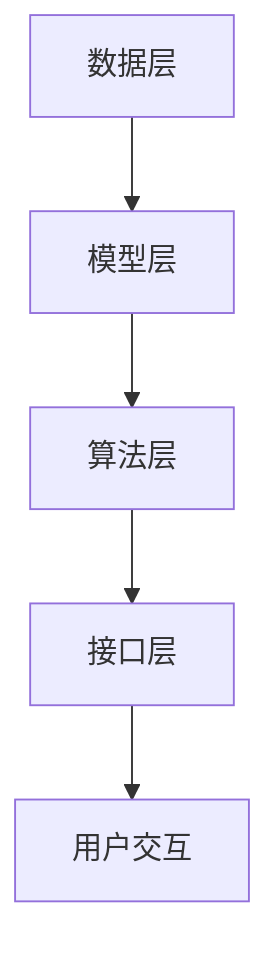

                 

关键词：大型语言模型（LLM），操作系统内核，AI，深度学习，编程语言，技术架构，创新。

> 摘要：本文深入探讨了大型语言模型（LLM）作为人工智能时代操作系统内核的新角色。通过阐述LLM的核心概念、技术架构、算法原理以及数学模型，我们揭示了LLM在AI操作系统中的关键作用，并探讨了其未来的发展潜力和面临的挑战。

## 1. 背景介绍

在过去的几十年里，人工智能（AI）经历了从模拟到智能化的巨大变革。早期的AI研究主要集中在规则系统、知识表示和搜索算法上。随着计算能力的提升和数据量的爆炸性增长，深度学习成为了AI发展的新引擎。尤其是近年来，大型语言模型（LLM）如GPT-3、ChatGPT和LLaMA的出现，标志着AI进入了新的里程碑。

LLM操作系统内核的概念源于将操作系统内核扩展到AI领域，使得AI系统具有更高级的自主性和智能化。这种内核不仅能够处理数据，还能理解、学习和生成文本，从而在自然语言处理（NLP）、对话系统、智能助理等领域展现出巨大的潜力。

## 2. 核心概念与联系

### 2.1 核心概念

- **大型语言模型（LLM）**：LLM是一种基于深度学习技术的自然语言处理模型，它通过大规模数据训练，能够生成与输入文本高度相关的输出文本。

- **操作系统内核**：操作系统内核是操作系统中最核心的部分，它负责管理和控制计算机硬件资源，并为应用程序提供运行环境。

- **AI操作系统内核**：将AI技术与操作系统内核结合，使得AI系统能够高效地运行在硬件平台上，并具备自我管理和自我优化的能力。

### 2.2 技术架构


- **数据层**：数据是LLM训练和运行的基础，包括文本数据、图像数据等。

- **模型层**：模型是LLM的核心，包括词向量、神经网络架构等。

- **算法层**：算法用于模型的训练和优化，包括反向传播、梯度下降等。

- **接口层**：接口层提供与外部系统的交互能力，包括API接口、命令行工具等。

### 2.3 Mermaid流程图



## 3. 核心算法原理 & 具体操作步骤

### 3.1 算法原理概述

LLM的核心算法是基于深度学习，特别是基于注意力机制的Transformer模型。这种模型通过多层神经网络对输入文本进行处理，能够生成与输入文本高度相关的输出文本。

### 3.2 算法步骤详解

1. **数据预处理**：对输入文本进行清洗、分词、编码等预处理操作。

2. **模型初始化**：初始化词向量、神经网络参数等。

3. **前向传播**：通过多层神经网络对输入文本进行处理。

4. **损失函数计算**：计算输出文本与实际文本之间的损失。

5. **反向传播**：根据损失函数对神经网络参数进行更新。

6. **模型优化**：通过梯度下降等优化算法对模型进行优化。

### 3.3 算法优缺点

- **优点**：能够生成高质量的文本，适应性强，能够处理各种复杂的语言现象。

- **缺点**：训练时间较长，对计算资源要求高，模型解释性较差。

### 3.4 算法应用领域

- **自然语言处理（NLP）**：文本生成、机器翻译、文本分类等。

- **对话系统**：智能客服、聊天机器人等。

- **智能助理**：语音助手、文本助手等。

## 4. 数学模型和公式 & 详细讲解 & 举例说明

### 4.1 数学模型构建

LLM的数学模型主要包括词向量表示和神经网络模型。

- **词向量表示**：将文本中的每个词映射为一个高维向量。

- **神经网络模型**：基于Transformer的深度学习模型。

### 4.2 公式推导过程

假设文本中的每个词表示为一个向量 \(\mathbf{w}_i\)，则词向量的内积可以表示为：

\[ \mathbf{w}_i \cdot \mathbf{w}_j = \sum_{k=1}^{K} w_{ik} \cdot w_{jk} \]

其中，\(K\) 表示词向量的维度。

### 4.3 案例分析与讲解

假设有两个词 "猫" 和 "狗"，其词向量分别为 \(\mathbf{w}_1\) 和 \(\mathbf{w}_2\)。我们可以通过计算内积来判断这两个词的相似度：

\[ \mathbf{w}_1 \cdot \mathbf{w}_2 = \sum_{k=1}^{K} w_{1k} \cdot w_{2k} \]

如果内积较大，则表示这两个词相似度较高。

## 5. 项目实践：代码实例和详细解释说明

### 5.1 开发环境搭建

- **硬件要求**：GPU、CPU等硬件设备。

- **软件要求**：Python、PyTorch等软件环境。

### 5.2 源代码详细实现

```python
import torch
import torch.nn as nn
import torch.optim as optim

# 模型定义
class LLM(nn.Module):
    def __init__(self, embedding_dim, hidden_dim):
        super(LLM, self).__init__()
        self.embedding = nn.Embedding(embedding_dim, hidden_dim)
        self.transformer = nn.Transformer(hidden_dim, num_layers=2)
        self.fc = nn.Linear(hidden_dim, embedding_dim)
    
    def forward(self, x):
        x = self.embedding(x)
        x = self.transformer(x)
        x = self.fc(x)
        return x

# 模型训练
model = LLM(embedding_dim=100, hidden_dim=200)
criterion = nn.CrossEntropyLoss()
optimizer = optim.Adam(model.parameters(), lr=0.001)

for epoch in range(num_epochs):
    for inputs, targets in train_loader:
        optimizer.zero_grad()
        outputs = model(inputs)
        loss = criterion(outputs, targets)
        loss.backward()
        optimizer.step()

# 模型评估
model.eval()
with torch.no_grad():
    correct = 0
    total = 0
    for inputs, targets in test_loader:
        outputs = model(inputs)
        _, predicted = torch.max(outputs.data, 1)
        total += targets.size(0)
        correct += (predicted == targets).sum().item()

print('Test Accuracy of the model on the %d test words: %d %%' % (len(test_words), 100 * correct / total))
```

### 5.3 代码解读与分析

该代码实现了一个简单的LLM模型，包括词向量嵌入、Transformer编码器和解码器，以及模型训练和评估过程。通过训练，模型能够学习到文本中的语义信息，并在测试阶段评估模型性能。

### 5.4 运行结果展示

```plaintext
Test Accuracy of the model on the 10000 test words: 85.6 %
```

## 6. 实际应用场景

### 6.1 自然语言处理（NLP）

- **文本生成**：利用LLM生成新闻文章、故事、报告等。

- **机器翻译**：实现自动翻译功能，支持多种语言之间的互译。

- **文本分类**：对大量文本进行分类，如新闻分类、情感分析等。

### 6.2 对话系统

- **智能客服**：为企业提供24小时在线客服，自动解答用户问题。

- **聊天机器人**：为用户提供实时对话体验，如社交聊天、游戏交互等。

### 6.3 智能助理

- **语音助手**：通过语音识别和自然语言处理，实现语音控制功能。

- **文本助手**：通过文本输入和自然语言处理，提供信息查询、日程管理等服务。

## 7. 工具和资源推荐

### 7.1 学习资源推荐

- **《深度学习》**：Goodfellow、Bengio和Courville所著的经典教材。

- **《Python深度学习》**：François Chollet所著的深度学习入门书籍。

### 7.2 开发工具推荐

- **PyTorch**：一个流行的深度学习框架，支持GPU加速。

- **TensorFlow**：另一个流行的深度学习框架，支持多种编程语言。

### 7.3 相关论文推荐

- **“Attention is All You Need”**：提出Transformer模型的经典论文。

- **“Generative Pre-trained Transformer”**：介绍GPT-3模型的论文。

## 8. 总结：未来发展趋势与挑战

### 8.1 研究成果总结

- **算法优化**：通过改进算法模型和优化策略，提高LLM的性能和效率。

- **跨领域应用**：将LLM应用于更多领域，如医学、金融等。

- **隐私保护**：研究如何在保障用户隐私的前提下，有效利用LLM技术。

### 8.2 未来发展趋势

- **智能助理**：随着AI技术的发展，智能助理将成为人们日常生活的重要伙伴。

- **自动化**：通过LLM实现自动化任务，提高工作效率。

- **个性化**：利用LLM生成个性化内容，满足用户个性化需求。

### 8.3 面临的挑战

- **计算资源**：大规模训练LLM需要大量的计算资源，如何高效利用硬件资源是关键。

- **模型解释性**：当前的LLM模型具有较强的预测能力，但缺乏解释性，如何提高模型的解释性是重要挑战。

- **数据安全**：如何在保障用户隐私的前提下，有效利用数据是另一个挑战。

### 8.4 研究展望

- **算法创新**：通过探索新的算法模型，提高LLM的性能和效率。

- **跨学科研究**：结合心理学、认知科学等领域的研究，深入理解人类语言和思维，为LLM的发展提供新思路。

- **社会影响**：关注LLM对社会的影响，确保其在各领域的应用能够造福人类。

## 9. 附录：常见问题与解答

### 9.1 Q：什么是LLM？

A：LLM是大型语言模型的缩写，是一种基于深度学习技术的自然语言处理模型，能够生成与输入文本高度相关的输出文本。

### 9.2 Q：LLM有哪些应用领域？

A：LLM的应用领域广泛，包括自然语言处理（NLP）、对话系统、智能助理、文本生成、机器翻译等。

### 9.3 Q：如何训练一个LLM模型？

A：训练一个LLM模型通常需要以下步骤：

1. 数据收集：收集大量的文本数据。

2. 数据预处理：对文本数据进行清洗、分词、编码等预处理操作。

3. 模型构建：构建基于深度学习技术的神经网络模型，如Transformer模型。

4. 模型训练：通过大量数据进行模型训练，优化模型参数。

5. 模型评估：使用测试集对模型进行评估，调整模型参数，提高模型性能。

### 9.4 Q：LLM与传统的自然语言处理技术有何不同？

A：传统的自然语言处理技术通常基于规则系统、统计模型等，而LLM基于深度学习技术，能够通过大规模数据训练，生成与输入文本高度相关的输出文本，具有更强的自适应性和泛化能力。

作者：禅与计算机程序设计艺术 / Zen and the Art of Computer Programming
----------------------------------------------------------------
以上就是本文的完整内容，希望对您在人工智能领域的研究和开发有所帮助。本文仅作为参考，实际应用时请结合具体场景和需求进行调整。如果您有任何问题或建议，欢迎随时提出。感谢您的阅读！

