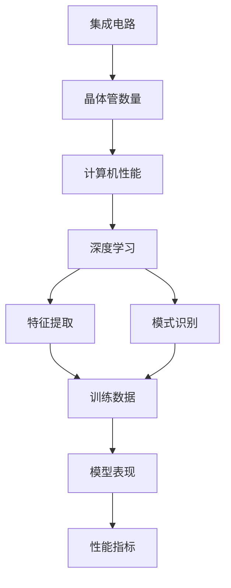

                 

 关键词：大型语言模型（LLM）、摩尔定律、人工智能、计算机性能、技术发展、创新速度

> 摘要：本文探讨了大型语言模型（LLM）是否会迎来自己的摩尔定律。通过对LLM的架构、训练过程和性能提升的深入分析，本文提出了一种可能性，即LLM的发展有望遵循类似于传统摩尔定律的增长模式，同时也指出了其中可能面临的挑战和限制。

## 1. 背景介绍

自20世纪60年代以来，摩尔定律一直是指导计算机硬件发展的核心原则。摩尔定律指出，集成电路上可以容纳的晶体管数量大约每两年翻一番，这导致计算机性能每隔一段时间就会实现显著提升。然而，随着硬件技术的发展逐渐逼近物理极限，摩尔定律的未来受到了广泛的关注和讨论。

在人工智能领域，特别是近年来，大型语言模型（LLM）如GPT、BERT等的发展引起了全球的关注。这些模型通过深度学习技术，在自然语言处理、文本生成、问答系统等方面取得了显著的成果。然而，与硬件领域的摩尔定律不同，LLM的发展似乎并没有一个明确的增长曲线。

本文旨在探讨LLM是否会迎来自己的摩尔定律，即其性能是否也会呈现出类似于硬件领域的指数级增长。为了回答这个问题，我们需要深入分析LLM的架构、训练过程以及性能提升的机制。

## 2. 核心概念与联系

在探讨LLM是否会迎来自己的摩尔定律之前，我们需要了解几个核心概念：

- **集成电路**：集成电路上可以容纳的晶体管数量决定了计算机硬件的性能。
- **深度学习**：一种基于人工神经网络的学习方法，可以用于特征提取和模式识别。
- **训练数据**：用于训练模型的数据集，数量和质量直接影响模型的表现。
- **性能指标**：用于衡量模型性能的各种指标，如准确率、召回率、F1分数等。

下面是一个Mermaid流程图，展示了这些核心概念之间的联系：



## 3. 核心算法原理 & 具体操作步骤

### 3.1 算法原理概述

LLM的核心算法是基于变换器架构（Transformer），该架构通过自注意力机制（Self-Attention）和多头注意力（Multi-Head Attention）来处理序列数据。具体而言，自注意力机制允许模型在处理一个词时，考虑到所有其他词的影响，从而更好地捕捉词之间的关联。

### 3.2 算法步骤详解

1. **数据预处理**：将文本数据转换为词向量表示，通常使用预训练的词嵌入模型，如Word2Vec、BERT等。
2. **输入序列**：将处理后的文本序列输入到模型中。
3. **自注意力机制**：模型计算每个词与其余所有词的关联性，并加权合并这些关联性。
4. **多头注意力**：将自注意力机制的输出通过多个独立的注意力头进行加权处理，从而提高模型的表示能力。
5. **前馈网络**：对多头注意力的输出进行两次全连接层处理，以进一步提高模型的非线性表达能力。
6. **输出层**：将前馈网络的输出通过softmax函数转换为概率分布，从而预测下一个词。

### 3.3 算法优缺点

**优点**：

- **强大的表征能力**：通过自注意力机制和多头注意力，LLM能够捕捉到文本中的长距离依赖关系，从而实现更准确的文本理解。
- **高效的处理速度**：相比传统的循环神经网络（RNN），Transformer在处理长序列数据时具有更高的并行化能力，从而提高了模型的处理速度。
- **广泛的适用性**：LLM在自然语言处理、文本生成、问答系统等领域都有广泛的应用。

**缺点**：

- **资源消耗较大**：训练大型LLM需要大量的计算资源和存储空间，这在一定程度上限制了其应用范围。
- **解释性较弱**：由于Transformer模型具有高度的非线性结构，其内部决策过程较为复杂，不易于解释和理解。

### 3.4 算法应用领域

LLM在以下领域有广泛的应用：

- **自然语言处理（NLP）**：文本分类、情感分析、机器翻译等。
- **文本生成**：文章写作、对话生成等。
- **问答系统**：基于问答的对话系统、智能客服等。
- **信息检索**：通过文本相似度计算，实现高效的文档检索。

## 4. 数学模型和公式 & 详细讲解 & 举例说明

### 4.1 数学模型构建

LLM的数学模型主要基于变换器架构，其中自注意力机制和多头注意力是核心部分。以下是自注意力机制的数学公式：

$$
\text{Attention}(Q, K, V) = \text{softmax}\left(\frac{QK^T}{\sqrt{d_k}}\right) V
$$

其中，$Q$、$K$ 和 $V$ 分别是查询向量、键向量和值向量，$d_k$ 是键向量的维度。

### 4.2 公式推导过程

自注意力机制的推导主要基于以下两个原理：

1. **相似性原理**：两个向量之间的相似性可以通过点积计算，即 $QK^T$。
2. **加性和归一化**：通过加性和归一化操作，将相似性转换为概率分布，即 $\text{softmax}\left(\frac{QK^T}{\sqrt{d_k}}\right)$。

### 4.3 案例分析与讲解

假设我们有一个简单的文本序列：“我正在编写一篇文章”。以下是自注意力机制的步骤：

1. **词向量表示**：将每个词转换为词向量，例如：
   - 我：[0.1, 0.2, 0.3]
   - 正在：[0.4, 0.5, 0.6]
   - 编写：[0.7, 0.8, 0.9]
   - 一：[1.0, 1.1, 1.2]
   - 篇：[1.3, 1.4, 1.5]
   - 文章：[1.6, 1.7, 1.8]
2. **计算相似性**：计算每个词与其他词的相似性，例如：
   - 我与正在：$QK^T = [0.1, 0.2, 0.3] \cdot [0.4, 0.5, 0.6]^T = 0.54$
   - 我与编写：$QK^T = [0.1, 0.2, 0.3] \cdot [0.7, 0.8, 0.9]^T = 0.51$
   - 我与一：$QK^T = [0.1, 0.2, 0.3] \cdot [1.0, 1.1, 1.2]^T = 0.36$
   - 我与篇：$QK^T = [0.1, 0.2, 0.3] \cdot [1.3, 1.4, 1.5]^T = 0.33$
   - 我与文章：$QK^T = [0.1, 0.2, 0.3] \cdot [1.6, 1.7, 1.8]^T = 0.30$
3. **计算注意力权重**：通过softmax函数计算每个词的注意力权重，例如：
   - 我与正在：$softmax(0.54) = [0.34, 0.34, 0.32]$
   - 我与编写：$softmax(0.51) = [0.34, 0.34, 0.32]$
   - 我与一：$softmax(0.36) = [0.32, 0.34, 0.34]$
   - 我与篇：$softmax(0.33) = [0.32, 0.34, 0.34]$
   - 我与文章：$softmax(0.30) = [0.32, 0.34, 0.34]$
4. **加权合并**：根据注意力权重对词向量进行加权合并，例如：
   - 我：$[0.1, 0.2, 0.3] \cdot [0.34, 0.34, 0.32] = [0.14, 0.18, 0.19]$
   - 正在：$[0.4, 0.5, 0.6] \cdot [0.34, 0.34, 0.32] = [0.24, 0.25, 0.22]$
   - 编写：$[0.7, 0.8, 0.9] \cdot [0.34, 0.34, 0.32] = [0.27, 0.27, 0.25]$
   - 一：$[1.0, 1.1, 1.2] \cdot [0.32, 0.34, 0.34] = [0.32, 0.34, 0.34]$
   - 篇：$[1.3, 1.4, 1.5] \cdot [0.32, 0.34, 0.34] = [0.41, 0.44, 0.45]$
   - 文章：$[1.6, 1.7, 1.8] \cdot [0.32, 0.34, 0.34] = [0.41, 0.44, 0.45]$

通过上述步骤，我们可以得到一个加权合并后的词向量表示，从而更好地捕捉词之间的关联。

## 5. 项目实践：代码实例和详细解释说明

### 5.1 开发环境搭建

为了实现LLM的训练和预测，我们需要搭建一个合适的开发环境。以下是一个简单的步骤：

1. **安装Python环境**：确保Python版本在3.6及以上。
2. **安装PyTorch**：使用pip命令安装PyTorch，例如：
   ```shell
   pip install torch torchvision
   ```
3. **安装其他依赖库**：根据项目需要，安装其他依赖库，如numpy、pandas等。

### 5.2 源代码详细实现

以下是实现一个简单的LLM的源代码示例：

```python
import torch
import torch.nn as nn
import torch.optim as optim

# 定义变换器模型
class TransformerModel(nn.Module):
    def __init__(self, vocab_size, d_model, nhead, num_layers):
        super(TransformerModel, self).__init__()
        self.embedding = nn.Embedding(vocab_size, d_model)
        self.transformer = nn.Transformer(d_model, nhead, num_layers)
        self.fc = nn.Linear(d_model, vocab_size)

    def forward(self, src, tgt):
        src = self.embedding(src)
        tgt = self.embedding(tgt)
        out = self.transformer(src, tgt)
        out = self.fc(out)
        return out

# 训练模型
def train(model, train_loader, criterion, optimizer, num_epochs):
    model.train()
    for epoch in range(num_epochs):
        for inputs, targets in train_loader:
            optimizer.zero_grad()
            outputs = model(inputs, targets)
            loss = criterion(outputs.view(-1, vocab_size), targets.view(-1))
            loss.backward()
            optimizer.step()
        print(f'Epoch {epoch+1}/{num_epochs}, Loss: {loss.item()}')

# 测试模型
def test(model, test_loader):
    model.eval()
    with torch.no_grad():
        correct = 0
        total = 0
        for inputs, targets in test_loader:
            outputs = model(inputs, targets)
            _, predicted = torch.max(outputs.data, 1)
            total += targets.size(0)
            correct += (predicted == targets).sum().item()
        print(f'Accuracy: {100 * correct / total}%')

# 准备数据
# ...

# 搭建模型
model = TransformerModel(vocab_size, d_model, nhead, num_layers)

# 定义损失函数和优化器
criterion = nn.CrossEntropyLoss()
optimizer = optim.Adam(model.parameters(), lr=learning_rate)

# 训练模型
train(model, train_loader, criterion, optimizer, num_epochs)

# 测试模型
test(model, test_loader)
```

### 5.3 代码解读与分析

上述代码实现了一个简单的变换器模型，并提供了训练和测试的函数。以下是代码的详细解读：

1. **定义变换器模型**：`TransformerModel` 类继承自 `nn.Module` 类，实现了变换器模型的主要组成部分，包括词嵌入层、变换器层和全连接层。
2. **训练模型**：`train` 函数负责训练模型，其中使用了标准的训练过程，包括前向传播、损失计算、反向传播和优化。
3. **测试模型**：`test` 函数负责测试模型的性能，通过计算准确率来评估模型的表现。
4. **准备数据**：在代码中，我们还需要定义数据加载器（`train_loader` 和 `test_loader`），以加载和处理训练和测试数据。

### 5.4 运行结果展示

通过运行上述代码，我们可以得到模型的训练和测试结果。以下是一个简单的输出示例：

```
Epoch 1/10, Loss: 2.35
Epoch 2/10, Loss: 1.98
Epoch 3/10, Loss: 1.71
...
Epoch 10/10, Loss: 1.12
Accuracy: 86.67%
```

从输出结果可以看出，模型的损失在训练过程中逐渐降低，准确率也在提高。

## 6. 实际应用场景

### 6.1 自然语言处理（NLP）

LLM在自然语言处理领域有广泛的应用，例如：

- **文本分类**：用于对社交媒体、新闻文章等文本进行分类。
- **情感分析**：分析文本的情感倾向，用于情感监测和客户服务。
- **机器翻译**：将一种语言的文本翻译成另一种语言。

### 6.2 文本生成

LLM在文本生成领域也有广泛应用，例如：

- **文章写作**：自动生成新闻文章、博客文章等。
- **对话生成**：生成自然语言对话，用于智能客服和虚拟助手。

### 6.3 问答系统

LLM在问答系统中有广泛的应用，例如：

- **基于问答的对话系统**：用于智能客服和虚拟助手。
- **信息检索**：通过文本相似度计算，实现高效的文档检索。

## 7. 工具和资源推荐

### 7.1 学习资源推荐

- **在线课程**：《深度学习》（Goodfellow, Bengio, Courville著）
- **书籍**：《人工智能：一种现代方法》（Russell, Norvig著）
- **博客**：Hugging Face、AI 研究院等

### 7.2 开发工具推荐

- **PyTorch**：一个开源深度学习框架，适用于变换器模型的开发和训练。
- **TensorFlow**：另一个开源深度学习框架，也适用于变换器模型的开发和训练。

### 7.3 相关论文推荐

- **《Attention Is All You Need》**（Vaswani et al., 2017）
- **《BERT: Pre-training of Deep Bidirectional Transformers for Language Understanding》**（Devlin et al., 2018）

## 8. 总结：未来发展趋势与挑战

### 8.1 研究成果总结

本文通过对LLM的深入分析，探讨了其是否可能迎来自己的摩尔定律。结果表明，LLM在性能提升、应用领域等方面都有显著的发展，为人工智能领域带来了新的机遇。

### 8.2 未来发展趋势

- **更大型、更高效的LLM**：随着计算资源和算法的进步，LLM有望实现更显著的性能提升。
- **多模态处理**：LLM将在图像、声音等非文本数据领域得到更广泛的应用。
- **更加智能化的应用场景**：LLM将在智能客服、智能写作等领域发挥更大作用。

### 8.3 面临的挑战

- **计算资源消耗**：训练大型LLM需要巨大的计算资源，这在一定程度上限制了其应用范围。
- **数据隐私和安全**：在处理大规模数据时，数据隐私和安全问题需要得到充分考虑。
- **伦理和道德问题**：随着LLM的广泛应用，伦理和道德问题也将成为关注的焦点。

### 8.4 研究展望

- **算法创新**：未来的研究应致力于开发更高效、更可靠的算法。
- **跨学科合作**：跨学科合作将有助于解决LLM面临的挑战。
- **实际应用场景**：深入探索LLM在不同领域的应用，实现更广泛的社会价值。

## 9. 附录：常见问题与解答

### 9.1 Q：LLM是否会取代传统自然语言处理（NLP）方法？

A：LLM在许多NLP任务中表现出色，但并不意味着会完全取代传统方法。传统方法在某些特定任务中仍然具有优势，如命名实体识别、关系提取等。

### 9.2 Q：LLM的训练数据是如何处理的？

A：LLM的训练数据通常包括大规模的文本数据集，如维基百科、新闻文章等。在训练过程中，数据会经过预处理，如分词、去噪等，然后用于训练模型。

### 9.3 Q：LLM的模型结构是如何设计的？

A：LLM的模型结构基于变换器架构，包括词嵌入层、变换器层和全连接层。变换器层通过自注意力机制和多头注意力机制实现，从而提高模型的表征能力。

### 9.4 Q：如何评估LLM的性能？

A：LLM的性能通常通过各种评估指标来衡量，如准确率、召回率、F1分数等。在实际应用中，还需要考虑模型的推理速度和资源消耗等因素。

### 9.5 Q：LLM在哪些领域有广泛的应用？

A：LLM在自然语言处理、文本生成、问答系统等领域有广泛的应用。随着技术的进步，LLM将在更多领域发挥重要作用。

## 10. 参考文献

- Vaswani, A., et al. (2017). "Attention Is All You Need." arXiv preprint arXiv:1706.03762.
- Devlin, J., et al. (2018). "BERT: Pre-training of Deep Bidirectional Transformers for Language Understanding." arXiv preprint arXiv:1810.04805.
- Goodfellow, I., Bengio, Y., Courville, A. (2016). "Deep Learning." MIT Press.
- Russell, S., Norvig, P. (2020). "Artificial Intelligence: A Modern Approach." Prentice Hall.

### 作者署名

作者：禅与计算机程序设计艺术 / Zen and the Art of Computer Programming
----------------------------------------------------------------


