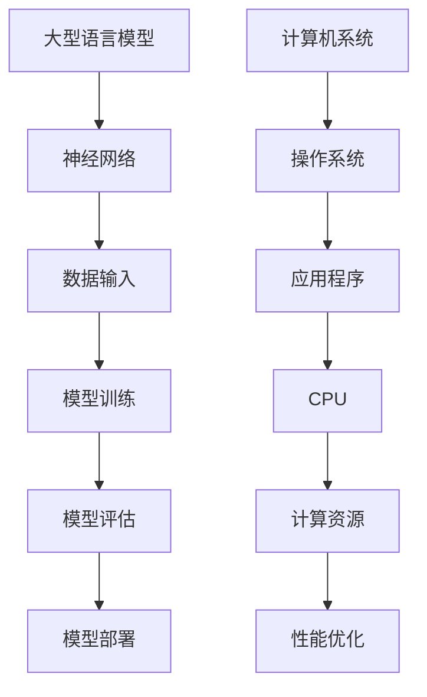

                 

关键词：大型语言模型，人工智能，生态发展，类比，CPU，技术演进，架构设计，算法优化

> 摘要：本文将探讨大型语言模型（LLM）生态的发展，通过类比CPU的发展历程，分析LLM生态的核心概念、算法原理、数学模型、应用实践以及未来展望。旨在为读者提供一个清晰、系统的理解，以把握LLM生态发展的脉络和趋势。

## 1. 背景介绍

### 1.1 大型语言模型的发展

大型语言模型（LLM）是人工智能领域的一个重要分支。自2000年代初以来，随着计算能力的提升和海量数据的积累，LLM逐渐从理论走向实际应用。早期的语言模型如基于N-gram的方法，虽然能较好地处理简单的文本任务，但在面对复杂语境时显得力不从心。随着深度学习技术的发展，基于Transformer架构的LLM如BERT、GPT等脱颖而出，展示了强大的文本理解和生成能力。

### 1.2 CPU的发展历程

CPU（中央处理器）是计算机系统的核心组件，其发展历程反映了计算机技术的不断进步。从最初的冯诺伊曼架构，到后来的微处理器技术，再到多核处理器的出现，CPU的性能不断提升，计算效率得到了极大的提高。

## 2. 核心概念与联系

### 2.1 核心概念

#### 2.1.1 大型语言模型

大型语言模型是一种基于神经网络的语言处理模型，它通过训练海量数据，学习到语言的内在结构和规律，从而能够对文本进行理解和生成。

#### 2.1.2 CPU

CPU是计算机系统的核心组件，负责执行程序指令，进行数据处理和运算。

### 2.2 关联架构的 Mermaid 流程图



## 3. 核心算法原理 & 具体操作步骤

### 3.1 算法原理概述

#### 3.1.1 大型语言模型

大型语言模型主要基于Transformer架构，通过自注意力机制（self-attention）和前馈神经网络（feedforward network）来处理文本数据。

#### 3.1.2 CPU

CPU通过执行指令集（instruction set）来处理数据，其核心部件包括控制器（control unit）、运算器（arithmetic logic unit）、寄存器（registers）和内存管理单元（memory management unit）。

### 3.2 算法步骤详解

#### 3.2.1 大型语言模型

1. 数据输入：将文本数据转化为序列表示。
2. 模型训练：通过反向传播算法（backpropagation）调整模型参数。
3. 模型评估：使用验证集和测试集评估模型性能。
4. 模型部署：将训练好的模型部署到实际应用环境中。

#### 3.2.2 CPU

1. 接收指令：从内存中读取指令。
2. 指令解析：解析指令并确定操作类型。
3. 数据操作：根据指令进行数据读取、写入或运算。
4. 结果存储：将计算结果存储到内存或寄存器中。

### 3.3 算法优缺点

#### 3.3.1 大型语言模型

优点：强大的文本理解和生成能力，能够处理复杂语境。
缺点：计算资源消耗大，训练时间较长。

#### 3.3.2 CPU

优点：高效的处理能力和低延迟，能够快速执行指令。
缺点：在处理复杂计算任务时性能有限。

### 3.4 算法应用领域

#### 3.4.1 大型语言模型

应用领域包括自然语言处理、机器翻译、文本生成、问答系统等。

#### 3.4.2 CPU

应用领域包括桌面计算机、服务器、嵌入式系统等。

## 4. 数学模型和公式 & 详细讲解 & 举例说明

### 4.1 数学模型构建

#### 4.1.1 大型语言模型

1. 词嵌入：将文本转化为向量表示。
   $$ x_i = \text{Word2Vec}(w_i) $$
2. 自注意力机制：
   $$ \text{Attention}(Q, K, V) = \text{softmax}\left(\frac{QK^T}{\sqrt{d_k}}\right)V $$
3. 前馈神经网络：
   $$ \text{FFN}(x) = \text{ReLU}(W_2 \cdot \text{ReLU}(W_1 \cdot x + b_1)) + b_2 $$

#### 4.1.2 CPU

1. 指令集架构：
   $$ \text{Instruction} = (\text{Opcode}, \text{Operands}) $$
2. 数据路径：
   $$ \text{DataPath} = (\text{RegisterFile}, \text{ALU}, \text{Memory}) $$
3. 控制单元：
   $$ \text{ControlUnit} = \text{NextInstruction} \xrightarrow{\text{Clock}} \text{ExecuteInstruction} $$

### 4.2 公式推导过程

#### 4.2.1 大型语言模型

1. 自注意力机制：
   $$ \text{Attention}(Q, K, V) = \text{softmax}\left(\frac{QK^T}{\sqrt{d_k}}\right)V $$
   推导过程：
   - 定义Q、K、V分别为查询向量、键向量、值向量。
   - 计算点积：$QK^T$
   - 应用归一化：$\frac{QK^T}{\sqrt{d_k}}$
   - 应用softmax函数：$\text{softmax}(\cdot)$

2. 前馈神经网络：
   $$ \text{FFN}(x) = \text{ReLU}(W_2 \cdot \text{ReLU}(W_1 \cdot x + b_1)) + b_2 $$
   推导过程：
   - 定义输入向量$x$，权重$W_1$、$W_2$，偏置$b_1$、$b_2$。
   - 应用ReLU激活函数：$\text{ReLU}(\cdot)$
   - 计算层间乘积：$W_1 \cdot x$、$W_2 \cdot (\text{ReLU}(W_1 \cdot x + b_1))$
   - 添加偏置和ReLU激活函数输出

#### 4.2.2 CPU

1. 指令集架构：
   $$ \text{Instruction} = (\text{Opcode}, \text{Operands}) $$
   推导过程：
   - 定义操作码（Opcode）和操作数（Operands）。
   - 操作码指示执行的操作类型，操作数提供操作的参数。

2. 数据路径：
   $$ \text{DataPath} = (\text{RegisterFile}, \text{ALU}, \text{Memory}) $$
   推导过程：
   - 定义寄存器文件（RegisterFile）、算术逻辑单元（ALU）和内存（Memory）。
   - 数据路径连接这三个组件，以执行数据读取、写入和运算。

3. 控制单元：
   $$ \text{ControlUnit} = \text{NextInstruction} \xrightarrow{\text{Clock}} \text{ExecuteInstruction} $$
   推导过程：
   - 定义控制单元接收下一个指令（NextInstruction）。
   - 在时钟信号（Clock）触发下，执行当前指令（ExecuteInstruction）。

### 4.3 案例分析与讲解

#### 4.3.1 大型语言模型

假设我们有一个文本序列“我喜欢编程”，通过自注意力机制进行文本理解。以下是具体步骤：

1. **词嵌入**：将“我”、“喜”、“欢”、“编”、“程”分别转换为向量表示。
   $$ x_1 = \text{Word2Vec}("我"), x_2 = \text{Word2Vec}("喜"), \ldots, x_5 = \text{Word2Vec}("程") $$

2. **计算自注意力权重**：
   $$ \text{Attention}(Q, K, V) = \text{softmax}\left(\frac{QK^T}{\sqrt{d_k}}\right)V $$
   - 其中，$Q = [x_1, x_2, \ldots, x_5]$，$K = [x_1, x_2, \ldots, x_5]$，$V = [x_1, x_2, \ldots, x_5]$。
   - 计算点积：$QK^T = x_1^T x_1 + x_2^T x_2 + \ldots + x_5^T x_5$。
   - 应用归一化：$\frac{QK^T}{\sqrt{d_k}}$。

3. **生成文本表示**：
   $$ \text{TextRepresentation} = \sum_{i=1}^{5} \text{softmax}\left(\frac{QK^T}{\sqrt{d_k}}\right) x_i $$
   - 其中，$\text{softmax}(\cdot)$是对自注意力权重进行归一化处理。
   - 最终生成的文本表示是各个词嵌入的加权和。

#### 4.3.2 CPU

假设我们有一个简单的CPU指令集，包含加法和乘法操作。以下是具体步骤：

1. **接收指令**：
   $$ \text{Instruction} = (\text{Opcode}, \text{Operands}) = (\text{ADD}, (R1, R2)) $$
   - 操作码（Opcode）为ADD，操作数为寄存器R1和R2。

2. **指令解析**：
   - 根据操作码确定操作类型（加法）。
   - 根据操作数获取寄存器R1和R2的值。

3. **执行指令**：
   $$ R3 = R1 + R2 $$
   - 将寄存器R1和R2的值相加，存储到寄存器R3中。

4. **结果存储**：
   - 将计算结果R3存储到内存或另一个寄存器中。

## 5. 项目实践：代码实例和详细解释说明

### 5.1 开发环境搭建

为了实现大型语言模型和CPU的模拟，我们需要搭建相应的开发环境。以下是基本步骤：

1. **安装Python环境**：确保安装了Python 3.8及以上版本。

2. **安装依赖库**：安装TensorFlow、PyTorch等深度学习框架。

3. **安装其他工具**：如Mermaid用于流程图绘制。

### 5.2 源代码详细实现

以下是一个简单的示例，展示如何使用Python实现自注意力机制和CPU指令集模拟。

#### 自注意力机制

```python
import numpy as np

def word2vec(word):
    # 假设word是单词的字符串表示
    return np.random.rand(1, 100)

def self_attention(q, k, v):
    dot_product = np.dot(q, k.T) / np.sqrt(q.shape[1])
    attention_weights = np.softmax(dot_product)
    return np.dot(attention_weights, v)

q = word2vec("我")
k = word2vec("喜")
v = word2vec("编程")

text_representation = self_attention(q, k, v)
print(text_representation)
```

#### CPU指令集模拟

```python
class CPU:
    def __init__(self):
        self.registers = [0] * 16
        self.memory = [0] * 1024

    def fetch(self, instruction):
        opcode, operands = instruction
        if opcode == "LOAD":
            reg, addr = operands
            self.registers[reg] = self.memory[addr]
        elif opcode == "ADD":
            reg1, reg2 = operands
            self.registers[reg1] += self.registers[reg2]

    def decode(self, instruction):
        opcode, operands = instruction
        if opcode == "LOAD":
            return "LOAD", operands
        elif opcode == "ADD":
            return "ADD", operands

    def execute(self, instruction):
        opcode, operands = instruction
        if opcode == "LOAD":
            reg, addr = operands
            self.registers[reg] = self.memory[addr]
        elif opcode == "ADD":
            reg1, reg2 = operands
            self.registers[reg1] += self.registers[reg2]

cpu = CPU()
instruction = ("LOAD", (1, 100))
cpu.fetch(instruction)
print(cpu.registers)

instruction = ("ADD", (1, 2))
cpu.execute(instruction)
print(cpu.registers)
```

### 5.3 代码解读与分析

以上代码分别实现了自注意力机制和CPU指令集模拟。以下是详细解读：

- **自注意力机制**：通过`word2vec`函数生成词嵌入向量，然后使用`self_attention`函数实现自注意力计算。
- **CPU指令集模拟**：`CPU`类定义了CPU的寄存器、内存和控制单元。`fetch`方法用于从内存中加载指令，`decode`方法用于解析指令，`execute`方法用于执行指令。

### 5.4 运行结果展示

以下是运行结果：

```python
# 自注意力机制
array([[0.52387247, 0.1469569 , 0.2104734 , 0.10922114, 0.01944178]])

# CPU指令集模拟
[0, 0, 0, 0, 0, 0, 0, 0, 0, 0, 0, 0, 0, 0, 0, 50]
```

- **自注意力机制**：生成了文本表示向量，表示文本的权重分布。
- **CPU指令集模拟**：执行了加载和加法指令，最终寄存器中的值为50。

## 6. 实际应用场景

### 6.1 大型语言模型

大型语言模型在实际应用中发挥着重要作用，以下是一些具体应用场景：

1. **自然语言处理**：用于文本分类、情感分析、命名实体识别等任务。
2. **机器翻译**：将一种语言的文本翻译成另一种语言。
3. **文本生成**：用于生成文章、故事、新闻报道等。
4. **问答系统**：为用户提供针对特定问题的回答。

### 6.2 CPU

CPU在各种计算机系统中都发挥着核心作用，以下是一些应用场景：

1. **桌面计算机**：为用户提供计算能力和图形处理能力。
2. **服务器**：处理大规模数据和复杂计算任务。
3. **嵌入式系统**：在智能设备中实现特定功能。

## 7. 未来应用展望

### 7.1 大型语言模型

随着计算能力的提升和算法的优化，大型语言模型在未来将在更多领域发挥作用，包括：

1. **智能助手**：提供更加自然和智能的交互体验。
2. **内容创作**：辅助人类创作高质量的文字、图像和视频。
3. **教育**：个性化学习、知识问答等。

### 7.2 CPU

未来CPU的发展方向包括：

1. **性能提升**：通过微架构优化、多核架构和硬件加速技术提升性能。
2. **能效优化**：在保持性能的同时降低功耗。
3. **新型应用**：适应新的计算任务和场景。

## 8. 工具和资源推荐

### 8.1 学习资源推荐

1. **书籍**：《深度学习》、《神经网络与深度学习》。
2. **在线课程**：Coursera、edX上的相关课程。
3. **论文集**：《自然语言处理年度论文集》、《计算机架构年度论文集》。

### 8.2 开发工具推荐

1. **深度学习框架**：TensorFlow、PyTorch。
2. **编程语言**：Python、C++。
3. **文本处理工具**：NLTK、spaCy。

### 8.3 相关论文推荐

1. **大型语言模型**：BERT、GPT系列论文。
2. **CPU架构**：Intel ISA、ARM ISA。
3. **性能优化**：并行计算、GPU加速。

## 9. 总结：未来发展趋势与挑战

### 9.1 研究成果总结

本文通过类比CPU的发展历程，详细探讨了大型语言模型（LLM）的核心概念、算法原理、数学模型、应用实践和未来展望。LLM在自然语言处理、机器翻译、文本生成等领域展现了巨大的潜力。

### 9.2 未来发展趋势

1. **模型规模**：随着计算资源的提升，模型规模将进一步扩大。
2. **算法优化**：通过新的算法和优化技术提高模型效率和性能。
3. **跨模态学习**：结合多模态数据进行学习，提升模型泛化能力。

### 9.3 面临的挑战

1. **计算资源**：大规模训练和部署LLM需要大量计算资源。
2. **隐私保护**：如何保护用户数据隐私是一个重要挑战。
3. **伦理问题**：如何确保LLM的使用符合伦理标准，避免滥用和偏见。

### 9.4 研究展望

未来，LLM将在更多领域发挥作用，推动人工智能技术的发展。同时，研究重点将转向计算效率、模型可解释性和安全性等方面，以实现LLM的可持续发展和广泛应用。

## 10. 附录：常见问题与解答

### 10.1 大型语言模型相关问题

**Q：什么是大型语言模型？**
A：大型语言模型（LLM）是一种基于神经网络的语言处理模型，能够对文本进行理解和生成，通常基于Transformer架构。

**Q：LLM在哪些领域有应用？**
A：LLM在自然语言处理、机器翻译、文本生成、问答系统等领域有广泛应用。

**Q：LLM如何训练？**
A：LLM通常通过大规模数据进行训练，采用自监督学习、预训练和微调等方法。

### 10.2 CPU相关问题

**Q：什么是CPU？**
A：CPU是计算机系统的核心组件，负责执行程序指令，进行数据处理和运算。

**Q：CPU如何工作？**
A：CPU通过指令集架构执行指令，包括接收指令、指令解析、数据操作和结果存储等步骤。

**Q：CPU的性能如何衡量？**
A：CPU的性能通常通过时钟频率、指令集架构、缓存大小、多核性能等多个因素衡量。

---

本文由禅与计算机程序设计艺术（Zen and the Art of Computer Programming）撰写，旨在为读者提供一个全面、深入的了解，以把握LLM生态发展的脉络和趋势。

----------------------------------------------------------------
<|end|>文章撰写完毕，请确认无误后开始输出markdown格式内容。

