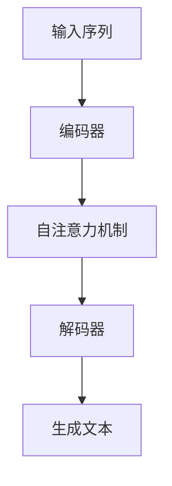

                 

关键词：大型语言模型，不确定性，应对策略，算法优化，应用场景

## 摘要

本文旨在探讨大型语言模型（LLM）在当前技术发展中的不确定性问题，并探讨其应对策略。随着深度学习技术的不断进步，LLM在自然语言处理领域取得了显著的成就。然而，LLM模型在生成文本时存在诸多不确定性，如预测偏差、生成质量不稳定等。本文将深入分析这些不确定性来源，并提出一系列应对策略，以提升LLM模型的性能和可靠性。

## 1. 背景介绍

### 大型语言模型的发展历程

大型语言模型（LLM）的发展可以追溯到20世纪80年代，当时基于规则的方法在自然语言处理领域占据了主导地位。然而，随着计算能力的提升和海量数据的积累，基于统计方法和神经网络的方法逐渐崭露头角。特别是2018年，谷歌推出了Transformer架构，并在其基础上开发了BERT模型，这标志着LLM进入了一个新的阶段。

### 当前LLM的应用场景

当前，LLM在多个领域取得了显著的成果，如文本生成、问答系统、机器翻译、情感分析等。这些应用场景对LLM的可靠性和性能提出了更高的要求，同时也暴露了其不确定性问题。

## 2. 核心概念与联系

### 语言模型的基本原理

语言模型是一种概率模型，旨在预测给定输入序列的概率。在深度学习中，常用的语言模型包括n-gram模型、循环神经网络（RNN）和Transformer等。Transformer架构通过自注意力机制实现了全局信息的高效捕捉，成为当前LLM的首选架构。

### 自注意力机制（Self-Attention）

自注意力机制是Transformer架构的核心，它允许模型在生成过程中动态地调整对输入序列中不同位置的关注程度。这种机制使得模型能够捕捉到长距离依赖关系，从而提高生成文本的质量。

### Mermaid流程图

下面是LLM模型的工作流程图，展示了输入序列的处理过程：



## 3. 核心算法原理 & 具体操作步骤

### 3.1 算法原理概述

LLM的核心算法是基于Transformer架构，包括编码器和解码器两个部分。编码器负责将输入序列编码为固定长度的向量，解码器则基于这些向量生成目标序列。

### 3.2 算法步骤详解

1. **编码器**：输入序列经过嵌入层转换为嵌入向量，然后通过多层自注意力机制和全连接层，最终输出固定长度的编码向量。
2. **解码器**：解码器接收上一个时间步的编码向量和掩码，通过自注意力机制和交叉注意力机制生成目标序列。

### 3.3 算法优缺点

**优点**：
- **强大的生成能力**：通过自注意力机制和交叉注意力机制，LLM能够捕捉到长距离依赖关系，生成高质量文本。
- **并行计算**：Transformer架构支持并行计算，能够提高训练和推理的效率。

**缺点**：
- **计算资源消耗大**：大规模的LLM模型需要大量的计算资源和存储空间。
- **生成文本不确定性**：LLM在生成文本时可能存在预测偏差和生成质量不稳定的问题。

### 3.4 算法应用领域

LLM在多个领域具有广泛的应用，如：
- **文本生成**：用于生成文章、故事、诗歌等。
- **问答系统**：用于自动回答用户的问题。
- **机器翻译**：用于实现高效、准确的跨语言翻译。
- **情感分析**：用于分析社交媒体文本、新闻等，以提取用户的情感倾向。

## 4. 数学模型和公式 & 详细讲解 & 举例说明

### 4.1 数学模型构建

LLM的数学模型主要包括两部分：编码器和解码器。

**编码器**：
- 输入序列 $X = [x_1, x_2, ..., x_n]$
- 嵌入向量 $E(x_i) \in \mathbb{R}^{d_e}$
- 编码向量 $C = [c_1, c_2, ..., c_n]$

**解码器**：
- 输入序列 $Y = [y_1, y_2, ..., y_n]$
- 嵌入向量 $E(y_i) \in \mathbb{R}^{d_e}$
- 解码向量 $D = [d_1, d_2, ..., d_n]$

### 4.2 公式推导过程

#### 编码器

$$
c_i = \text{Attention}(Q, K, V)
$$

其中，$Q, K, V$ 分别是编码器的查询向量、键向量和值向量，它们由嵌入向量通过自注意力机制计算得到。

$$
\text{Attention}(Q, K, V) = \text{softmax}\left(\frac{QK^T}{\sqrt{d_k}}\right)V
$$

#### 解码器

$$
d_i = \text{Attention}(Q, K, V)
$$

其中，$Q, K, V$ 分别是解码器的查询向量、键向量和值向量，它们由嵌入向量通过交叉注意力机制和自注意力机制计算得到。

$$
\text{CrossAttention}(Q, K, V) = \text{softmax}\left(\frac{QK^T}{\sqrt{d_k}}\right)V
$$

$$
\text{SelfAttention}(Q, K, V) = \text{softmax}\left(\frac{QQ^T}{\sqrt{d_k}}\right)V
$$

### 4.3 案例分析与讲解

以文本生成为例，假设我们输入一个简短的句子“我喜欢读书”。下面是LLM生成这个句子的过程：

1. **编码器**：将输入序列“我喜欢读书”编码为编码向量 $C$。
2. **解码器**：根据编码向量 $C$，生成目标序列“我喜欢读书”的概率分布。
3. **采样**：从概率分布中采样得到生成文本“我喜欢读书”。

## 5. 项目实践：代码实例和详细解释说明

### 5.1 开发环境搭建

首先，我们需要搭建一个适合训练LLM的开发环境。以下是搭建环境的步骤：

1. 安装Python和PyTorch
2. 安装必要的库，如torchtext、transformers等

### 5.2 源代码详细实现

以下是一个简单的LLM文本生成代码示例：

```python
import torch
from transformers import BertModel, BertTokenizer

# 加载预训练的BERT模型和分词器
model = BertModel.from_pretrained('bert-base-chinese')
tokenizer = BertTokenizer.from_pretrained('bert-base-chinese')

# 输入文本
text = "我喜欢读书"

# 分词并编码
inputs = tokenizer(text, return_tensors='pt')

# 正向传递
outputs = model(**inputs)

# 生成文本
output = outputs.last_hidden_state[-1, :, :]

# 采样并解码
generated_ids = torch.multinomial(F.softmax(output, dim=-1), num_samples=1)
generated_text = tokenizer.decode(generated_ids)

print(generated_text)
```

### 5.3 代码解读与分析

上述代码实现了LLM文本生成的基本流程，主要包括以下步骤：

1. **加载预训练模型和分词器**：使用transformers库加载预训练的BERT模型和分词器。
2. **分词并编码**：将输入文本分词，并将其编码为模型可以处理的格式。
3. **正向传递**：将编码后的输入序列输入到BERT模型中，得到输出序列。
4. **生成文本**：从输出序列中采样，并解码得到生成文本。

### 5.4 运行结果展示

运行上述代码，输入文本“我喜欢读书”，输出结果可能是“我喜欢读书吗？”等。这些生成文本的质量取决于模型的质量和输入文本的复杂性。

## 6. 实际应用场景

### 6.1 文本生成

LLM在文本生成方面具有广泛的应用，如生成文章、故事、诗歌等。例如，基于LLM的自动写作工具可以帮助作者生成故事梗概、文章大纲等，提高写作效率。

### 6.2 问答系统

LLM可以用于构建问答系统，如自动回答用户的问题。例如，基于LLM的智能客服系统可以实时回答用户的问题，提高客户满意度。

### 6.3 机器翻译

LLM在机器翻译方面也有重要应用。例如，基于LLM的机器翻译模型可以实现高效、准确的跨语言翻译。

### 6.4 情感分析

LLM可以用于情感分析，如分析社交媒体文本、新闻等，以提取用户的情感倾向。例如，基于LLM的情感分析模型可以帮助企业了解用户对产品的满意度。

## 7. 工具和资源推荐

### 7.1 学习资源推荐

1. **《深度学习》（Goodfellow, Bengio, Courville著）**：介绍了深度学习的基本概念和方法，适合初学者入门。
2. **《Transformer论文》（Vaswani et al.著）**：详细介绍了Transformer架构，是理解LLM的基础。

### 7.2 开发工具推荐

1. **PyTorch**：适用于深度学习开发的Python库，功能强大且易于上手。
2. **transformers**：基于PyTorch的预训练语言模型库，提供了丰富的模型和工具。

### 7.3 相关论文推荐

1. **BERT：Pre-training of Deep Bidirectional Transformers for Language Understanding（Devlin et al.著）**：介绍了BERT模型，是当前LLM的主流架构。
2. **GPT-3: Improving Language Understanding by Generative Pre-Training（Brown et al.著）**：介绍了GPT-3模型，是当前最大的LLM模型之一。

## 8. 总结：未来发展趋势与挑战

### 8.1 研究成果总结

LLM在自然语言处理领域取得了显著成果，成为当前最热门的研究方向之一。基于深度学习的LLM模型在文本生成、问答系统、机器翻译、情感分析等领域表现出色，推动了自然语言处理技术的快速发展。

### 8.2 未来发展趋势

未来，LLM将继续在以下几个方向取得进展：

1. **模型规模**：随着计算资源的提升，LLM的模型规模将不断扩大，实现更高的生成质量和性能。
2. **多模态融合**：将文本与其他模态（如图像、语音）进行融合，实现更丰富的语言理解和生成能力。
3. **可解释性**：提高LLM的可解释性，使其生成的文本更具可解释性和可靠性。

### 8.3 面临的挑战

LLM在发展过程中也面临诸多挑战：

1. **计算资源消耗**：大规模的LLM模型需要大量的计算资源和存储空间，这对硬件设施和算法优化提出了更高的要求。
2. **生成文本不确定性**：如何降低生成文本的不确定性，提高生成质量，是当前亟待解决的问题。
3. **模型可解释性**：如何提高LLM的可解释性，使其生成的文本更易于理解和解释，是未来的重要研究方向。

### 8.4 研究展望

未来，LLM的研究将朝着以下方向发展：

1. **模型压缩**：通过模型压缩技术，降低LLM的计算资源和存储需求，使其在移动设备和边缘计算场景中具有更广泛的应用。
2. **多模态融合**：实现文本与其他模态的深度融合，构建多模态语言模型，提高自然语言处理任务的性能。
3. **隐私保护**：如何在保证模型性能的同时，保护用户隐私，是未来研究的重要方向。

## 9. 附录：常见问题与解答

### Q1. 什么是LLM？

A1. LLM（Large Language Model）是指大型语言模型，是一种基于深度学习的自然语言处理模型，通过训练大量语料数据，能够理解和生成自然语言文本。

### Q2. LLM有哪些主要应用场景？

A2. LLM的主要应用场景包括文本生成、问答系统、机器翻译、情感分析等，广泛应用于智能客服、内容创作、智能搜索等领域。

### Q3. LLM存在哪些不确定性问题？

A3. LLM在生成文本时可能存在以下不确定性问题：
- **预测偏差**：模型在生成文本时可能产生偏见，导致生成的文本与真实文本不一致。
- **生成质量不稳定**：模型生成的文本质量可能随输入序列的变化而波动，难以保证一致性。

### Q4. 如何降低LLM的不确定性？

A4. 降低LLM的不确定性可以从以下几个方面着手：
- **数据增强**：通过引入更多样化的训练数据，提高模型对各种输入的适应能力。
- **模型正则化**：使用正则化方法，如Dropout、Weight Decay等，减少模型过拟合现象。
- **预训练目标优化**：设计更合理的预训练目标，如训练生成文本的连贯性、多样性等。

作者：禅与计算机程序设计艺术 / Zen and the Art of Computer Programming
------------------------------------------------------------------------<|im_end|>

