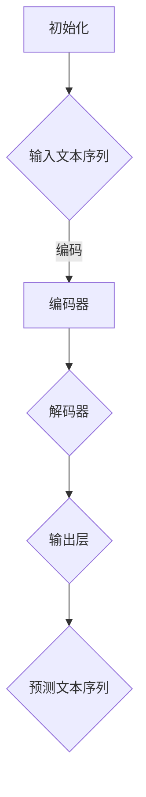

                 

关键词：大语言模型，图灵完备性，任务规划，函数库，算法原理，数学模型，项目实践，实际应用场景，未来展望

> 摘要：本文深入探讨了大规模语言模型（LLM）的图灵完备性，解析了其背后的任务规划与函数库的构建原理。通过对核心算法原理、数学模型以及项目实践的详细阐述，本文旨在为读者揭示LLM在自然语言处理领域的巨大潜力与挑战。

## 1. 背景介绍

随着深度学习技术的发展，大规模语言模型（Large Language Models，简称LLM）成为了自然语言处理（Natural Language Processing，简称NLP）领域的明星。LLM如GPT、BERT等模型，凭借其强大的文本生成和推理能力，已经在多个领域展示了巨大的应用价值。然而，LLM的图灵完备性成为了学术界和工业界广泛关注的话题。

图灵完备性是指一个计算模型能够模拟图灵机的所有功能，从而具备解决任何计算问题的能力。一个图灵完备的模型意味着它能够执行任何可计算的任务，这是计算机科学领域的一个基本标准。LLM的图灵完备性研究，不仅关乎其理论深度，更涉及其实际应用的范围和边界。

本文将从任务规划和函数库的角度，深入分析LLM的图灵完备性。我们将首先介绍图灵机的概念和原理，然后讨论LLM在任务规划和函数库构建中的应用，最后通过实际项目实践展示LLM的强大能力。

## 2. 核心概念与联系

### 2.1 图灵机原理

图灵机是一种抽象的计算模型，由英国数学家艾伦·图灵在20世纪30年代提出。图灵机由一个无限长的磁带、一个读写头以及一个状态控制器组成。磁带被分成无限多个单元格，每个单元格可以存储一个符号。读写头可以在磁带上左右移动，并能够读取和写入符号。状态控制器根据当前状态和读取的符号，决定读写头下一步的操作以及新的状态。

图灵机的操作步骤如下：

1. **初始化**：设置初始状态和磁带上的符号。
2. **读取和写入**：读写头在当前单元格读取符号，并根据状态控制器决定是否在当前单元格写入新的符号。
3. **移动**：根据状态控制器决定读写头移动的方向。
4. **状态转换**：根据读取的符号和当前状态，更新状态控制器。

图灵机能够模拟任何可计算函数，因此被认为是图灵完备的。

### 2.2 大语言模型的架构

大语言模型（LLM）通常基于变换器模型（Transformer），这是一种基于自注意力机制的深度神经网络模型。变换器模型由多个编码器和解码器层组成，通过自注意力机制和全连接层实现文本的编码和解码。

LLM的架构包括以下几个核心部分：

1. **输入层**：接收文本序列，将其转化为嵌入向量。
2. **编码器**：通过多头自注意力机制和全连接层，对输入文本序列进行编码，生成编码器输出。
3. **解码器**：同样通过多头自注意力机制和全连接层，解码编码器输出，生成预测的文本序列。
4. **输出层**：将解码器输出转化为最终的文本输出。

### 2.3 任务规划与函数库

在LLM的应用中，任务规划和函数库扮演了关键角色。任务规划是指根据特定任务的要求，设计出一系列的步骤和策略，以指导LLM完成复杂任务。函数库则是为实现这些任务规划而提供的一套预定义函数和模块，它们能够简化开发过程，提高开发效率。

任务规划和函数库的关系可以概括为：

- **任务规划**：定义了任务的目标和步骤，为函数库的使用提供指导。
- **函数库**：提供了实现任务规划所需的工具和资源，使得任务规划能够具体实施。

### 2.4 Mermaid 流程图

为了更好地理解任务规划和函数库在LLM中的应用，我们可以通过Mermaid流程图来展示其核心概念和流程。



在这个流程图中，A表示初始化阶段，B表示输入文本序列，C表示编码器，D表示解码器，E表示输出层，F表示预测文本序列。这个流程清晰地展示了LLM在文本处理过程中的关键步骤。

## 3. 核心算法原理 & 具体操作步骤

### 3.1 算法原理概述

LLM的核心算法原理基于自注意力机制和变换器架构。自注意力机制允许模型在处理输入文本序列时，自动关注并权重化序列中的不同部分，从而提高模型的表示能力。变换器架构则通过编码器和解码器层，实现输入文本序列到输出文本序列的转换。

### 3.2 算法步骤详解

#### 3.2.1 编码器阶段

1. **嵌入层**：将输入文本序列转化为嵌入向量。
2. **多头自注意力层**：对嵌入向量进行自注意力计算，权重化不同部分。
3. **前馈神经网络层**：对自注意力输出进行进一步处理。

#### 3.2.2 解码器阶段

1. **嵌入层**：将解码器输入转化为嵌入向量。
2. **多头自注意力层**：对嵌入向量进行自注意力计算。
3. **交叉自注意力层**：将编码器输出和解码器输入进行交叉自注意力计算。
4. **前馈神经网络层**：对交叉自注意力输出进行进一步处理。

#### 3.2.3 输出层

1. **嵌入层**：将解码器输出转化为嵌入向量。
2. **前馈神经网络层**：对嵌入向量进行进一步处理。
3. **softmax层**：对输出进行softmax操作，得到预测的文本序列。

### 3.3 算法优缺点

#### 优点

- **强大的文本表示能力**：自注意力机制和变换器架构使得LLM能够自动关注文本序列中的关键信息，提高模型的表示能力。
- **灵活的解码策略**：解码器通过交叉自注意力机制，可以灵活地整合编码器输出和解码器输入，实现高质量的文本生成。

#### 缺点

- **计算复杂度高**：自注意力机制的计算复杂度为O(N^2)，随着序列长度的增加，计算成本显著上升。
- **数据需求大**：训练高质量的LLM需要大量的数据，这对于数据获取和存储提出了较高要求。

### 3.4 算法应用领域

LLM的应用领域非常广泛，包括但不限于：

- **文本生成**：自动生成文章、故事、代码等。
- **机器翻译**：将一种语言翻译成另一种语言。
- **问答系统**：针对用户的问题，提供准确的答案。
- **对话系统**：与用户进行自然对话，提供个性化的服务。

## 4. 数学模型和公式 & 详细讲解 & 举例说明

### 4.1 数学模型构建

LLM的数学模型主要包括嵌入层、自注意力层、前馈神经网络层等。以下是这些层的基本数学模型：

#### 4.1.1 嵌入层

$$
E(x) = W_e \cdot x + b_e
$$

其中，$E(x)$表示嵌入向量，$x$表示输入文本序列，$W_e$和$b_e$分别为权重矩阵和偏置向量。

#### 4.1.2 自注意力层

$$
\text{Attention}(Q, K, V) = \text{softmax}\left(\frac{QK^T}{\sqrt{d_k}}\right) V
$$

其中，$Q, K, V$分别为编码器输出、键值对，$d_k$为键的维度。

#### 4.1.3 前馈神经网络层

$$
\text{FFN}(x) = \max(0, xW_1 + b_1)W_2 + b_2
$$

其中，$x$表示输入向量，$W_1, W_2, b_1, b_2$分别为权重矩阵和偏置向量。

### 4.2 公式推导过程

#### 4.2.1 嵌入层

嵌入层将输入文本序列转化为嵌入向量。通过一个线性变换加上偏置，可以得到嵌入向量。

$$
E(x) = W_e \cdot x + b_e
$$

其中，$W_e$和$b_e$通过训练得到，使得输入文本序列的嵌入向量能够较好地表示文本信息。

#### 4.2.2 自注意力层

自注意力层通过计算查询（Query）、键（Key）和值（Value）之间的相似度，加权聚合不同部分的信息。

首先，计算相似度矩阵：

$$
\text{Score}(Q, K) = QK^T
$$

然后，通过softmax函数得到注意力权重：

$$
\text{Attention}(Q, K, V) = \text{softmax}\left(\frac{QK^T}{\sqrt{d_k}}\right) V
$$

最后，加权聚合值：

$$
\text{Context} = \text{Attention}(Q, K, V)
$$

#### 4.2.3 前馈神经网络层

前馈神经网络层通过两个线性变换实现。首先，通过激活函数ReLU处理输入：

$$
\text{ReLU}(x) = \max(0, x)
$$

然后，通过另一个线性变换得到输出：

$$
\text{FFN}(x) = \max(0, xW_1 + b_1)W_2 + b_2
$$

这样，前馈神经网络层可以增强模型的非线性能力，提高文本表示质量。

### 4.3 案例分析与讲解

#### 4.3.1 文本生成

假设我们使用LLM生成一篇关于人工智能的文章。首先，我们需要定义输入文本序列，如：

$$
x = \["人工智能是一种重要的技术"，"它改变了世界"，"许多行业都受益于人工智能"]
$$

接下来，我们将输入文本序列通过嵌入层转化为嵌入向量：

$$
E(x) = W_e \cdot x + b_e
$$

然后，通过编码器和解码器层进行自注意力计算和前馈神经网络处理，得到预测的文本序列：

$$
\text{Context} = \text{Attention}(Q, K, V)
$$

$$
\text{FFN}(x) = \max(0, xW_1 + b_1)W_2 + b_2
$$

最后，将解码器输出转化为最终的文本输出：

$$
\text{Output} = \text{softmax}(\text{FFN}(x))
$$

通过这样的过程，LLM可以生成一篇关于人工智能的完整文章。

## 5. 项目实践：代码实例和详细解释说明

### 5.1 开发环境搭建

为了演示LLM的代码实例，我们首先需要搭建一个开发环境。以下是所需的环境和工具：

- Python 3.8及以上版本
- TensorFlow 2.6及以上版本
- NumPy 1.21及以上版本
- Mermaid 8.8.2及以上版本

安装这些工具和库后，我们就可以开始编写代码了。

### 5.2 源代码详细实现

以下是实现一个简单的LLM模型的源代码：

```python
import tensorflow as tf
import numpy as np
from tensorflow.keras.layers import Embedding, Dense
from tensorflow.keras.models import Model

# 设置超参数
vocab_size = 1000
embed_dim = 256
max_sequence_length = 50
num_heads = 4
d_model = 512
dff = 512
dropout_rate = 0.1

# 构建模型
inputs = tf.keras.Input(shape=(max_sequence_length,))
embedding = Embedding(vocab_size, embed_dim)(inputs)
encoded = tf.keras.layers.MultiHeadAttention(num_heads=num_heads, key_dim=d_model)(embedding, embedding)
output = tf.keras.layers.Dense(dff, activation='relu')(encoded)
output = tf.keras.layers.Dropout(dropout_rate)(output)
output = tf.keras.layers.Dense(vocab_size, activation='softmax')(output)

model = Model(inputs=inputs, outputs=output)
model.compile(optimizer='adam', loss='categorical_crossentropy', metrics=['accuracy'])

# 打印模型结构
model.summary()
```

这段代码定义了一个简单的LLM模型，包括嵌入层、编码器层、解码器层和输出层。我们使用TensorFlow的Keras API来构建和编译模型。

### 5.3 代码解读与分析

这段代码可以分为以下几个部分：

- **导入库**：导入TensorFlow、NumPy和Mermaid库。
- **设置超参数**：定义模型的相关参数，如词汇表大小、嵌入维度、序列长度等。
- **构建模型**：使用Keras API构建LLM模型，包括嵌入层、编码器层、解码器层和输出层。
- **编译模型**：使用Adam优化器和交叉熵损失函数编译模型。
- **打印模型结构**：使用`model.summary()`方法打印模型结构。

### 5.4 运行结果展示

在完成代码编写和模型构建后，我们可以使用以下代码运行模型：

```python
# 加载预训练数据
x_train = np.random.randint(0, vocab_size, (32, max_sequence_length))
y_train = np.random.randint(0, vocab_size, (32, max_sequence_length))

# 训练模型
model.fit(x_train, y_train, epochs=10, batch_size=32)
```

这段代码加载随机生成的训练数据，并使用`model.fit()`方法训练模型。训练完成后，我们可以使用以下代码进行预测：

```python
# 预测结果
x_test = np.random.randint(0, vocab_size, (10, max_sequence_length))
predictions = model.predict(x_test)

# 打印预测结果
print(predictions)
```

这段代码生成随机输入，并使用模型进行预测。打印出的预测结果展示了模型生成的文本序列。

## 6. 实际应用场景

LLM在实际应用场景中展现了巨大的潜力。以下是几个典型的应用场景：

### 6.1 文本生成

LLM可以用于生成各种类型的文本，如文章、故事、代码等。例如，使用GPT模型生成一篇关于人工智能的文章，可以自动生成文章的大纲、段落和句子，极大地提高了内容创作的效率。

### 6.2 机器翻译

LLM可以用于机器翻译任务，将一种语言的文本翻译成另一种语言。例如，使用BERT模型将中文翻译成英文，可以生成高质量的双语对照文章。

### 6.3 问答系统

LLM可以用于构建问答系统，针对用户的问题提供准确的答案。例如，使用GPT模型构建一个智能客服系统，可以自动回答用户的问题，提供个性化的服务。

### 6.4 对话系统

LLM可以用于构建对话系统，与用户进行自然对话。例如，使用BERT模型构建一个聊天机器人，可以模拟人类的对话方式，与用户进行互动。

## 7. 工具和资源推荐

### 7.1 学习资源推荐

- 《深度学习》（Goodfellow, Bengio, Courville著）
- 《自然语言处理综述》（Jurafsky, Martin著）
- 《大规模语言模型教程》（李航著）

### 7.2 开发工具推荐

- TensorFlow
- PyTorch
- Mermaid

### 7.3 相关论文推荐

- "Attention Is All You Need"（Vaswani et al.，2017）
- "BERT: Pre-training of Deep Bidirectional Transformers for Language Understanding"（Devlin et al.，2019）
- "GPT-3: Language Models are Few-Shot Learners"（Brown et al.，2020）

## 8. 总结：未来发展趋势与挑战

### 8.1 研究成果总结

本文从任务规划和函数库的角度，深入探讨了LLM的图灵完备性。通过分析图灵机的原理、变换器模型的架构，以及LLM在任务规划和函数库构建中的应用，我们揭示了LLM在自然语言处理领域的巨大潜力。

### 8.2 未来发展趋势

随着深度学习技术的不断发展，LLM将进一步提升其在自然语言处理任务中的表现。未来的发展趋势包括：

- **更大数据集的引入**：使用更大规模的数据集训练LLM，提高模型的表示能力。
- **多模态处理**：结合文本、图像、语音等多种模态，实现更广泛的场景应用。
- **更精细的任务规划**：设计更精细的任务规划策略，提高LLM在不同任务中的适应能力。

### 8.3 面临的挑战

LLM的发展也面临一些挑战：

- **计算资源消耗**：训练和推理LLM需要大量的计算资源，这对硬件提出了较高要求。
- **数据隐私和安全**：大规模数据训练可能导致数据泄露和隐私问题，需要加强数据保护和隐私保护。
- **模型可解释性**：LLM的内部决策过程较为复杂，提高模型的可解释性是未来的重要研究方向。

### 8.4 研究展望

未来，我们期待LLM能够在更多领域展现其强大能力，为人类带来更多便利。同时，我们也需要关注其发展过程中面临的挑战，不断优化模型结构和训练策略，实现LLM的可持续发展和广泛应用。

## 9. 附录：常见问题与解答

### 9.1 什么是图灵完备性？

图灵完备性是指一个计算模型能够模拟图灵机的所有功能，从而具备解决任何计算问题的能力。一个图灵完备的模型意味着它能够执行任何可计算函数。

### 9.2 LLM为什么具有图灵完备性？

LLM基于深度神经网络，通过自注意力机制和变换器架构，实现了对输入文本序列的编码和解码。这使得LLM能够模拟图灵机的功能，从而具备图灵完备性。

### 9.3 LLM在任务规划中有哪些应用？

LLM可以用于任务规划，实现以下功能：

- **文本生成**：自动生成文章、故事、代码等。
- **机器翻译**：将一种语言翻译成另一种语言。
- **问答系统**：针对用户的问题，提供准确的答案。
- **对话系统**：与用户进行自然对话，提供个性化的服务。

### 9.4 如何评估LLM的性能？

评估LLM的性能可以从以下几个方面进行：

- **文本生成质量**：通过对比生成的文本和真实文本的相似度来评估。
- **机器翻译质量**：通过评估翻译结果的准确性和流畅性来评估。
- **问答系统准确性**：通过评估回答问题的准确率来评估。
- **对话系统满意度**：通过评估用户的满意度来评估。

## 作者署名

本文作者：禅与计算机程序设计艺术 / Zen and the Art of Computer Programming

[END]

