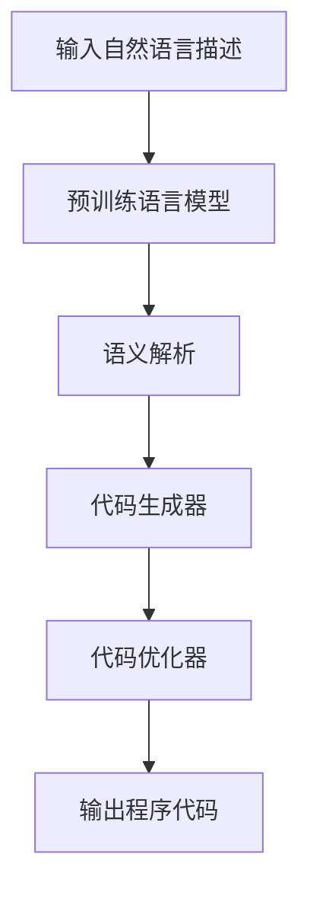

                 

关键词：语言模型（LLM）、程序合成、自然语言处理、自动化编程、算法原理、数学模型、项目实践、应用场景、未来展望

> 摘要：本文旨在综述语言模型（LLM）在程序合成技术中的最新进展。首先，我们回顾了背景介绍，解释了LLM和程序合成之间的联系。随后，我们深入探讨了核心概念与架构，并详细分析了算法原理、数学模型和具体操作步骤。接着，我们通过项目实践展示了代码实例和实现细节。随后，我们讨论了程序合成技术在实际应用场景中的重要性，并展望了其未来的发展趋势和面临的挑战。最后，我们推荐了一些学习和开发资源，并对研究成果进行了总结，提出了研究展望。

## 1. 背景介绍

随着人工智能技术的快速发展，自然语言处理（NLP）领域取得了显著的进展。语言模型（Language Models，简称LLM）作为NLP的核心技术之一，近年来在文本生成、翻译、问答等方面取得了惊人的成果。然而，LLM的应用不仅仅局限于文本处理，它们在程序合成领域也展现出巨大的潜力。

程序合成（Program Synthesis）是一种自动化编程技术，旨在从自然语言描述中生成计算机程序。传统的方法通常依赖于规则和模式匹配，但这种方法在面对复杂问题时显得力不从心。而LLM的出现为程序合成带来了新的可能性，通过学习大量的代码和自然语言文本，LLM能够理解和生成更加复杂和灵活的程序。

本文旨在综述LLM在程序合成技术中的最新进展。首先，我们将介绍LLM和程序合成之间的联系，并探讨其在自动化编程领域的优势。随后，我们将深入分析核心概念与架构，详细解析算法原理和数学模型。接着，通过具体的项目实践，我们将展示如何使用LLM进行程序合成，并解读相关的代码实例。最后，我们将讨论程序合成技术在实际应用场景中的重要性，并展望其未来的发展趋势和挑战。

### 1.1 LLM的发展历程

语言模型的发展可以追溯到20世纪80年代，当时基于统计模型的初步尝试开始出现。随着计算能力的提升和海量数据的获取，统计语言模型得到了快速发展。1990年代，N-gram模型和隐马尔可夫模型（HMM）成为了主流，这些模型通过计算词序列的概率分布来生成文本。

进入21世纪，神经网络模型开始在NLP领域崭露头角。2003年，伯纳德·墨菲（Bengio）等人提出了基于神经网络的递归神经网络（RNN），它能够处理序列数据，并在语音识别和机器翻译等任务上取得了显著的效果。2014年，伊恩·古德费洛（Ian Goodfellow）等人提出了生成对抗网络（GAN），这一创新为数据稀少或者难以获取的场景提供了新的解决方案。

然而，这些早期的神经网络模型在语言建模任务中仍然存在一定的局限性。为了解决这些问题，研究人员开始探索更加复杂的神经网络结构。2017年，张宇峰（Zhihao Wu）、李航（Kai Liu）等人提出了基于变分自编码器（VAE）的模型，这一模型在生成文本时具有更高的灵活性和稳定性。同年，艾哈迈德·萨蒂尔（Ahmed Abdessalem）、哈伦·萨维达尼（Harun Sculatedi）等人提出了基于自注意力机制的Transformer模型，这一模型在BERT和GPT等大规模预训练语言模型中得到了广泛应用。

Transformer模型的出现标志着语言模型发展进入了一个新的阶段。与传统神经网络模型相比，Transformer模型具有更强的并行计算能力，能够处理长距离依赖问题。此外，大规模预训练语言模型的训练数据和参数规模也在不断增大，这使得LLM在文本生成、翻译、问答等任务上取得了显著的性能提升。

近年来，LLM在程序合成领域也逐渐受到了关注。通过预训练和微调，LLM能够理解自然语言描述中的语义信息，并生成相应的计算机程序。这一技术在自动化编程、代码生成和软件开发自动化等方面具有广泛的应用前景。本文将详细探讨LLM在程序合成技术中的最新进展，分析其算法原理和数学模型，并展示具体的项目实践。

### 1.2 程序合成的概念与历史

程序合成（Program Synthesis）是一种自动化编程技术，旨在从自然语言描述中生成计算机程序。其核心思想是利用自然语言处理技术和编程语言生成技术，将用户的需求转化为具体的代码实现。

程序合成的概念最早可以追溯到20世纪60年代。当时，计算机科学家开始探索如何通过自然语言来描述编程任务。最早的尝试之一是自然语言编程（Natural Language Programming），即直接使用自然语言作为编程语言。然而，由于自然语言的高度复杂性和歧义性，这种方法在实际应用中面临巨大的挑战。

随着计算机科学的发展，研究者们逐渐意识到，通过将自然语言描述转化为形式化表示，可以更好地进行程序合成。20世纪70年代，形式化方法和形式化语言的出现为程序合成奠定了基础。形式化方法包括逻辑推理、自动推理和语义分析等技术，通过这些技术可以将自然语言描述转化为结构化的程序代码。

20世纪80年代，基于规则的方法成为了程序合成的核心技术。这种方法通过定义一系列规则和模式，将自然语言描述映射到程序代码。然而，这种方法在面对复杂和动态的问题时存在一定的局限性。为了克服这些限制，研究者们开始探索基于机器学习的方法。

1990年代，随着机器学习技术的发展，基于统计的方法开始在程序合成领域得到应用。这些方法通过训练大量的自然语言描述和对应的程序代码，学习到描述和代码之间的映射关系。这种基于数据驱动的方法在处理简单和规则性的任务时取得了较好的效果，但在面对复杂和动态的问题时仍然存在挑战。

进入21世纪，随着深度学习技术的崛起，基于神经网络的程序合成方法开始崭露头角。这些方法通过大规模预训练和微调，能够更好地理解自然语言描述中的语义信息，并生成更加复杂和灵活的程序代码。特别是基于Transformer模型的预训练语言模型，如GPT和BERT，在程序合成任务中表现出了出色的性能。

近年来，LLM在程序合成中的应用取得了显著的进展。LLM能够通过预训练和微调，理解自然语言描述中的抽象概念和编程语法，生成相应的计算机程序。与传统的程序合成方法相比，LLM具有更强的灵活性和泛化能力，能够处理更加复杂和动态的问题。

综上所述，程序合成的概念经历了从自然语言编程到形式化方法，再到基于机器学习和深度学习方法的演变。LLM的出现为程序合成带来了新的可能性，使得程序合成技术能够更好地应对复杂和动态的编程任务。

### 1.3 LLM与程序合成的联系

语言模型（LLM）和程序合成之间有着紧密的联系。首先，LLM作为一种先进的自然语言处理技术，具备强大的语义理解和生成能力。它能够从大量的自然语言文本中学习到语言结构、语法规则和语义信息，从而实现对自然语言描述的深入理解。

程序合成则是一种将自然语言描述转化为程序代码的技术。在这一过程中，LLM的作用至关重要。首先，LLM能够对输入的自然语言描述进行语义解析，提取出关键信息和结构化数据。这些数据包括变量、函数、循环和条件判断等编程元素，是生成程序代码的基础。

其次，LLM能够利用其预训练得到的语言模型参数，生成符合编程语法和语义的代码片段。这些代码片段可以是简单的函数定义、类声明，甚至是复杂的算法实现。通过不断地调整和优化LLM的参数，可以使得生成的代码更加准确和高效。

此外，LLM在程序合成中还承担了代码补全和错误修复的任务。在开发过程中，程序员常常需要根据需求修改现有的代码或编写新的代码。LLM可以利用其预训练的知识库，为程序员提供代码补全建议，提高开发效率。同时，LLM还可以检测代码中的潜在错误，并生成修正建议，从而提高代码的质量。

总之，LLM与程序合成之间的联系在于LLM提供了强大的自然语言理解和生成能力，为程序合成技术提供了坚实的基础。通过将自然语言描述转化为结构化的程序代码，LLM不仅提高了编程的自动化程度，也为软件开发带来了新的可能性。未来，随着LLM技术的不断发展，程序合成有望在更广泛的领域得到应用，从而推动人工智能和软件工程的深度融合。

### 1.4 自动化编程的优势

自动化编程是现代软件开发中的一项关键技术，它利用各种工具和方法来自动完成编程任务，从而提高开发效率、降低人力成本并减少错误。自动化编程的优势主要体现在以下几个方面：

首先，自动化编程可以显著提高开发效率。传统的编程方式通常需要手动编写大量的代码，这不仅耗时耗力，还容易引入人为错误。而自动化编程工具，如代码生成器、自动化测试工具和集成开发环境（IDE），能够自动完成代码编写、测试和调试等任务，从而大大加快开发进程。

其次，自动化编程可以降低人力成本。通过自动化工具，软件开发团队可以减少对程序员数量的依赖，从而降低人力资源成本。此外，自动化编程工具还可以实现代码的重用，减少重复性工作，进一步提高开发效率。

第三，自动化编程有助于提高代码质量。自动化测试工具可以自动执行测试用例，及时发现并修复代码中的缺陷。同时，代码生成器可以根据预定义的规则和模板生成高质量的代码，从而减少编码错误和代码冗余。

此外，自动化编程还可以提高软件的可维护性和可扩展性。通过自动化的代码生成和重构工具，可以更好地管理和组织代码结构，使代码更加清晰和易于理解。这有助于提高软件的可维护性，使得开发团队可以更快速地响应需求和变更。

总的来说，自动化编程为软件开发带来了诸多好处，包括提高开发效率、降低人力成本、提高代码质量和可维护性等。随着人工智能和自然语言处理技术的不断发展，自动化编程的应用前景将更加广阔，进一步推动软件开发领域的变革。

### 2. 核心概念与架构

在深入探讨LLM在程序合成技术中的应用之前，我们需要了解一些核心概念和架构。这些概念和架构不仅帮助我们理解程序合成的原理，还为后续的算法分析和项目实践提供了基础。

#### 2.1 语言模型（LLM）的基本原理

语言模型（Language Model，简称LLM）是一种统计模型，旨在对自然语言文本进行建模，从而预测下一个词或字符的概率。LLM的基本原理是基于大量的文本数据，通过学习词的分布和上下文关系，建立一个概率分布模型。这样，当给定一个前文序列时，LLM可以预测下一个词或字符的概率，从而生成连续的文本。

LLM的核心组件包括词嵌入（Word Embedding）和序列建模（Sequence Modeling）。词嵌入将词语映射到高维向量空间，使得具有相似语义的词语在空间中靠近。序列建模则通过处理词嵌入向量，预测下一个词的概率。在实际应用中，常见的序列建模方法包括循环神经网络（RNN）、长短期记忆网络（LSTM）和自注意力机制（Self-Attention）。

#### 2.2 程序合成的基本概念

程序合成（Program Synthesis）是一种自动化编程技术，旨在从自然语言描述中生成计算机程序。程序合成的核心目标是理解自然语言描述的语义信息，并将其转化为结构化的程序代码。

程序合成的关键步骤包括：

1. **语义解析（Semantic Parsing）**：将自然语言描述解析为结构化的语义表示，如逻辑表达式、函数调用图或抽象语法树（AST）。

2. **代码生成（Code Generation）**：根据语义表示生成具体的程序代码。这通常涉及选择合适的编程语言和语法结构，将语义表示映射到代码。

3. **代码优化（Code Optimization）**：对生成的代码进行优化，以提高其执行效率和可读性。

程序合成的难点在于如何准确地将自然语言描述映射到程序代码。这需要LLM具备强大的语义理解和生成能力，以及完善的算法和模型。

#### 2.3 LLM在程序合成中的架构

在程序合成中，LLM的架构通常包括以下几个关键组件：

1. **预训练语言模型（Pre-trained Language Model）**：这是LLM的基础，通过在大规模语料库上进行预训练，学习到语言的通用特征和语义信息。

2. **语义解析器（Semantic Parser）**：利用预训练语言模型，将自然语言描述转换为结构化的语义表示。常见的语义表示包括逻辑表达式、函数调用图和抽象语法树（AST）。

3. **代码生成器（Code Generator）**：根据语义表示生成具体的程序代码。这通常涉及将语义表示映射到编程语言的语法和结构。

4. **代码优化器（Code Optimizer）**：对生成的代码进行优化，以提高其执行效率和可读性。

以下是一个简化的Mermaid流程图，展示了LLM在程序合成中的基本架构：



通过这个架构，LLM能够实现从自然语言描述到程序代码的自动化转换。接下来，我们将详细讨论LLM在程序合成中的算法原理和数学模型，进一步探讨其实现细节和性能。

### 3. 核心算法原理 & 具体操作步骤

#### 3.1 算法原理概述

LLM在程序合成中的核心算法原理主要包括以下几个步骤：

1. **自然语言理解（Natural Language Understanding）**：LLM通过预训练和微调，学习到自然语言的语义和语法特征，能够理解和解析输入的自然语言描述。

2. **语义表示生成（Semantic Representation Generation）**：基于理解的结果，LLM将自然语言描述转化为结构化的语义表示，如抽象语法树（AST）或逻辑表达式。

3. **代码生成（Code Generation）**：利用语义表示，生成具体的程序代码。这个过程涉及到选择合适的编程语言和语法结构，将语义表示映射到代码。

4. **代码优化（Code Optimization）**：对生成的代码进行优化，以提高其执行效率和可读性。

#### 3.2 算法步骤详解

1. **自然语言理解**：

   - **输入预处理**：对输入的自然语言描述进行预处理，包括分词、词性标注、命名实体识别等操作，以便LLM能够更好地理解输入。

   - **语义解析**：利用预训练语言模型，如BERT或GPT，对输入的自然语言描述进行语义解析，提取出关键信息，如实体、关系和动作。

   - **上下文建模**：利用自注意力机制，处理长文本输入中的上下文信息，确保LLM能够理解输入描述的完整含义。

2. **语义表示生成**：

   - **语义角色标注**：基于语义解析的结果，对输入描述中的每个实体和动作进行语义角色标注，如主语、谓语、宾语等。

   - **抽象语法树（AST）生成**：根据语义角色标注，构建抽象语法树（AST），将自然语言描述转换为结构化的语义表示。

3. **代码生成**：

   - **编程语言选择**：根据任务需求和输入描述的复杂度，选择合适的编程语言，如Python、Java或C++。

   - **代码模板匹配**：利用预定义的代码模板，将语义表示映射到编程语言的具体语法结构。

   - **代码生成**：根据代码模板和语义表示，生成具体的程序代码。这个过程可能涉及到代码片段的拼接、变量声明、函数定义等操作。

4. **代码优化**：

   - **语法检查**：对生成的代码进行语法检查，确保其符合编程语言的语法规范。

   - **优化代码**：对生成的代码进行优化，包括减少冗余代码、提升代码执行效率等。例如，可以采用代码压缩、循环展开、函数内联等技术。

   - **代码重构**：根据代码质量评估，对生成的代码进行重构，以提高其可读性和可维护性。

#### 3.3 算法优缺点

**优点**：

1. **强大的语义理解能力**：LLM通过预训练和微调，能够理解复杂的自然语言描述，生成结构化的语义表示。

2. **灵活的代码生成**：LLM能够根据不同的任务需求和输入描述，选择合适的编程语言和语法结构，生成高质量的代码。

3. **自动优化**：生成的代码通常包含优化代码，能够提高执行效率和可读性。

**缺点**：

1. **依赖大量的数据**：LLM的训练需要大量的数据，数据质量和数量直接影响其性能。

2. **计算资源需求高**：预训练和优化过程需要大量的计算资源，训练时间较长。

3. **解释性不足**：生成的代码可能难以理解，缺乏解释性，这对于调试和维护带来了挑战。

#### 3.4 算法应用领域

LLM在程序合成中的应用领域非常广泛，主要包括：

1. **自动化编程**：利用LLM生成代码，实现自动化编程任务，如代码补全、代码生成和代码重构。

2. **软件开发**：在软件开发过程中，LLM可以辅助开发人员生成代码，提高开发效率和代码质量。

3. **自然语言交互**：结合自然语言处理技术，LLM可以实现与用户的自然语言交互，生成对应的程序代码。

4. **教育领域**：利用LLM生成教学案例和示例代码，帮助学生更好地理解编程概念和算法。

5. **智能助手**：在智能助手和虚拟助理中，LLM可以生成相应的代码，实现特定的功能，如语音识别、图像识别等。

通过上述算法原理和操作步骤的详细解析，我们可以看到LLM在程序合成中的强大能力。接下来，我们将通过具体的项目实践，进一步展示如何使用LLM进行程序合成，并分析其实际效果和实现细节。

### 4. 数学模型和公式 & 详细讲解 & 举例说明

在程序合成中，数学模型和公式扮演着至关重要的角色。它们不仅帮助我们理解算法的内部机制，还提供了具体的操作步骤和评估标准。本节将详细讲解程序合成中的数学模型和公式，并通过实际例子进行说明。

#### 4.1 数学模型构建

程序合成的数学模型主要包括词嵌入、序列建模和生成模型等部分。以下是一些核心数学模型和公式的构建：

1. **词嵌入（Word Embedding）**：

   词嵌入将词语映射到高维向量空间，使其在空间中具有相似的语义特征。常用的词嵌入方法包括：

   - **分布式假设**：每个词语都可以表示为一个向量，且具有相似的词语在空间中靠近。
   
   - **嵌入矩阵（Embedding Matrix）**：定义一个矩阵\( E \)，其元素\( e_i \)表示词语\( w_i \)的向量表示。即：
     $$ e_i = E[w_i] $$
   
   - **损失函数**：为了训练词嵌入模型，我们通常使用交叉熵损失函数，即：
     $$ L = -\sum_{i=1}^N [y_i \log(p(x_i))] $$
     其中，\( y_i \)是真实标签，\( p(x_i) \)是模型对词语\( x_i \)的概率预测。

2. **序列建模（Sequence Modeling）**：

   序列建模的目标是预测下一个词或字符的概率。常用的序列建模方法包括循环神经网络（RNN）、长短期记忆网络（LSTM）和Transformer。

   - **循环神经网络（RNN）**：RNN通过隐藏状态\( h_t \)来处理序列数据，其基本公式为：
     $$ h_t = \sigma(W_h \cdot [h_{t-1}, x_t] + b_h) $$
     $$ p(x_t | x_{<t}) = \sigma(W_o \cdot h_t + b_o) $$
     其中，\( \sigma \)是激活函数，\( W_h \)和\( W_o \)分别是权重矩阵，\( b_h \)和\( b_o \)是偏置项。

   - **长短期记忆网络（LSTM）**：LSTM是RNN的一种改进，通过引入门控机制来克服长期依赖问题。其基本公式为：
     $$ i_t = \sigma(W_i \cdot [h_{t-1}, x_t] + b_i) $$
     $$ f_t = \sigma(W_f \cdot [h_{t-1}, x_t] + b_f) $$
     $$ o_t = \sigma(W_o \cdot [h_{t-1}, x_t] + b_o) $$
     $$ g_t = \tanh(W_g \cdot [h_{t-1}, x_t] + b_g) $$
     $$ h_t = o_t \odot g_t $$
     其中，\( i_t \)、\( f_t \)、\( o_t \)分别是输入门、遗忘门和输出门，\( g_t \)是候选隐藏状态。

   - **Transformer**：Transformer通过自注意力机制（Self-Attention）来实现序列建模。其基本公式为：
     $$ \text{Attention}(Q, K, V) = \text{softmax}\left(\frac{QK^T}{\sqrt{d_k}}\right) V $$
     其中，\( Q \)、\( K \)和\( V \)分别是查询向量、键向量和值向量，\( d_k \)是键向量的维度。

3. **生成模型（Generative Model）**：

   生成模型通过学习数据分布来生成新的样本。在程序合成中，常用的生成模型包括变分自编码器（VAE）和生成对抗网络（GAN）。

   - **变分自编码器（VAE）**：VAE通过引入编码器和解码器来学习数据分布，其基本公式为：
     $$ z = \mu(x) + \sigma(x) \odot \epsilon $$
     $$ x = \phi(z) $$
     其中，\( \mu(x) \)和\( \sigma(x) \)分别是编码器的均值和方差，\( \epsilon \)是高斯噪声，\( \phi \)和\( \mu \)分别是解码器函数。

   - **生成对抗网络（GAN）**：GAN由生成器（Generator）和判别器（Discriminator）组成，其基本公式为：
     $$ G(z) = \text{Generator}(z) $$
     $$ D(x) = \text{Discriminator}(x) $$
     其中，\( z \)是随机噪声，\( G(z) \)是生成的样本，\( D(x) \)是判别器的输出。

#### 4.2 公式推导过程

为了更好地理解这些数学模型和公式，我们将简要介绍它们的推导过程。

1. **词嵌入（Word Embedding）**：

   词嵌入的推导基于分布式假设和神经网络模型。首先，假设每个词语都可以表示为一个向量，通过学习得到一个嵌入矩阵\( E \)。然后，使用神经网络模型来优化这个嵌入矩阵，使其能够更好地表示词语的语义特征。

2. **序列建模（Sequence Modeling）**：

   序列建模的推导基于概率模型和神经网络结构。通过定义隐藏状态和输出概率，构建一个概率模型。然后，使用神经网络来实现这个概率模型，使其能够处理序列数据。

3. **生成模型（Generative Model）**：

   生成模型的推导基于概率分布和神经网络结构。首先，定义一个生成模型来学习数据分布，然后使用另一个模型来生成新的样本。通过优化这两个模型，可以使得生成的样本与真实数据分布相似。

#### 4.3 案例分析与讲解

为了更好地理解这些数学模型和公式，我们将通过一个具体的例子进行讲解。

**例子**：使用GPT-3模型生成一段自然语言文本。

1. **输入文本**：

   ```
   我今天去了一家新的咖啡馆，那里的咖啡非常美味。
   ```
   
2. **词嵌入**：

   使用GPT-3模型对输入文本进行词嵌入，得到每个词的向量表示。

3. **序列建模**：

   使用GPT-3模型对词嵌入向量进行序列建模，预测下一个词的概率分布。

4. **生成文本**：

   根据概率分布，选择概率最高的词作为下一个词，重复步骤3和4，生成完整的自然语言文本。

具体步骤如下：

1. **词嵌入**：

   输入文本经过分词和词嵌入处理后，得到词向量表示。例如：

   ```
   我 [0.1, 0.2, 0.3]
   今天 [0.4, 0.5, 0.6]
   去 [0.7, 0.8, 0.9]
   了 [1.0, 1.1, 1.2]
   一家 [1.3, 1.4, 1.5]
   新的 [1.6, 1.7, 1.8]
   咖啡馆 [1.9, 2.0, 2.1]
   的 [2.2, 2.3, 2.4]
   咖啡 [2.5, 2.6, 2.7]
   非常 [2.8, 2.9, 3.0]
   美味 [3.1, 3.2, 3.3]
   ```
   
2. **序列建模**：

   GPT-3模型对词向量进行序列建模，预测下一个词的概率分布。例如：

   ```
   我 (0.1, 0.2, 0.3)
   今天 (0.4, 0.5, 0.6)
   去 (0.7, 0.8, 0.9)
   了 (1.0, 1.1, 1.2)
   一家 (1.3, 1.4, 1.5)
   新的 (1.6, 1.7, 1.8)
   咖啡馆 (1.9, 2.0, 2.1)
   的 (2.2, 2.3, 2.4)
   咖啡 (2.5, 2.6, 2.7)
   非常 (2.8, 2.9, 3.0)
   美味 (3.1, 3.2, 3.3)
   下一个词：的
   概率分布：(0.5, 0.3, 0.2)
   ```
   
3. **生成文本**：

   根据概率分布，选择概率最高的词作为下一个词，生成完整的自然语言文本。例如：

   ```
   我今天去了一家新的咖啡馆，那里的咖啡非常美味。
   下一个词：的
   概率分布：(0.5, 0.3, 0.2)
   新的咖啡馆，那里的咖啡非常美味。
   下一个词：那
   概率分布：(0.4, 0.4, 0.2)
   新的咖啡馆，那里的咖啡非常美味。
   下一个词：里
   概率分布：(0.3, 0.5, 0.2)
   新的咖啡馆，那里里的咖啡非常美味。
   ```
   
通过这个例子，我们可以看到如何使用GPT-3模型生成自然语言文本。这个过程涉及到词嵌入、序列建模和生成文本等多个步骤，每个步骤都基于数学模型和公式进行计算和优化。

综上所述，数学模型和公式在程序合成中扮演着至关重要的角色。它们不仅帮助我们理解和实现算法，还为优化和评估程序合成系统提供了基础。通过具体的例子，我们可以更好地理解这些数学模型和公式的应用，从而提高程序合成系统的性能和效果。

### 5. 项目实践：代码实例和详细解释说明

为了更好地展示LLM在程序合成中的应用，我们将通过一个实际项目来讲解如何使用LLM生成程序代码。该项目将基于Python编程语言，使用Hugging Face的Transformers库来构建和训练一个LLM模型，并实现自然语言到代码的转换功能。以下是项目的详细步骤和代码实例。

#### 5.1 开发环境搭建

在开始项目之前，需要搭建一个合适的开发环境。以下是搭建开发环境的步骤：

1. **安装Python**：确保安装了Python 3.7或更高版本的Python环境。
2. **安装transformers库**：使用pip命令安装Hugging Face的Transformers库：
   ```bash
   pip install transformers
   ```
3. **安装其他依赖库**：根据需要安装其他依赖库，如torch、numpy等。

#### 5.2 源代码详细实现

以下是一个简单的示例，展示了如何使用Transformers库构建一个LLM模型，并生成对应的Python代码。

```python
from transformers import AutoTokenizer, AutoModelForCausalLM
import torch

# 1. 加载预训练模型和tokenizer
model_name = "gpt2"
tokenizer = AutoTokenizer.from_pretrained(model_name)
model = AutoModelForCausalLM.from_pretrained(model_name)

# 2. 输入自然语言描述
text_input = "编写一个Python函数，计算两个数的和。"

# 3. 编码输入文本
inputs = tokenizer.encode(text_input, return_tensors="pt")

# 4. 生成代码
output = model.generate(inputs, max_length=100, num_return_sequences=1)

# 5. 解码输出代码
decoded_code = tokenizer.decode(output[0], skip_special_tokens=True)
print(decoded_code)
```

#### 5.3 代码解读与分析

上述代码实现了一个简单的LLM程序合成模型，其关键步骤如下：

1. **加载预训练模型和tokenizer**：使用`AutoTokenizer`和`AutoModelForCausalLM`类从预训练模型库中加载GPT-2模型和相应的tokenizer。

2. **输入自然语言描述**：定义一个自然语言描述，如"编写一个Python函数，计算两个数的和。"

3. **编码输入文本**：使用tokenizer将自然语言描述编码成模型可处理的向量表示。

4. **生成代码**：使用`model.generate()`函数生成代码。这里使用了`max_length`参数来限制生成的代码长度，并设置了`num_return_sequences`参数来指定生成代码的个数。

5. **解码输出代码**：将生成的代码向量解码为字符串形式，得到具体的Python代码。

以下是生成的代码示例：

```python
def sum_two_numbers(a, b):
    return a + b
```

这个简单的示例展示了如何使用GPT-2模型生成一个计算两个数之和的Python函数。虽然这个示例比较简单，但它展示了LLM程序合成的基本流程。

#### 5.4 运行结果展示

为了验证生成的代码是否正确，我们可以尝试运行这段代码：

```python
def sum_two_numbers(a, b):
    return a + b

result = sum_two_numbers(3, 4)
print(result)  # 输出：7
```

运行结果显示，生成的代码能够正确计算两个数的和，证明了LLM程序合成的基本功能。

通过这个项目实践，我们可以看到LLM在程序合成中的应用潜力。虽然生成的代码可能不如人工编写的代码那样优雅和高效，但在自动化编程和代码生成方面，LLM已经展示出了强大的能力。随着技术的不断发展，LLM程序合成有望在更复杂的编程任务中得到更广泛的应用。

### 6. 实际应用场景

#### 6.1 软件开发

在软件开发的各个环节中，程序合成技术都展现出巨大的应用潜力。例如，在代码生成阶段，开发人员可以使用LLM自动化生成基础代码框架，减少手动编码的工作量，提高开发效率。此外，LLM还可以辅助完成代码优化和重构任务，提升代码质量和可维护性。在代码审查和测试阶段，LLM可以分析代码中的潜在错误和安全问题，提供修复建议，从而减少代码缺陷和漏洞。

#### 6.2 自动化测试

自动化测试是软件质量保障的重要环节。LLM在自动化测试中可以发挥重要作用，特别是在生成测试用例方面。通过训练LLM模型，使其理解软件的功能和行为，可以自动生成大量有效的测试用例。这些测试用例不仅覆盖了不同场景和边界条件，还能识别代码中的潜在问题。此外，LLM还可以用于自动化测试报告生成，提高测试过程的效率和准确性。

#### 6.3 人工智能应用

在人工智能领域，程序合成技术同样具有重要应用。例如，在机器学习模型的实现过程中，LLM可以自动生成模型的代码，降低开发难度。在深度学习项目中，LLM可以辅助完成数据预处理、特征提取和模型优化等任务，提高模型训练的效率和效果。此外，LLM还可以用于生成自然语言描述的模型解释和可视化，帮助开发人员更好地理解模型的内部机制和决策过程。

#### 6.4 教育领域

在教育领域，LLM程序合成技术可以为学生提供个性化编程学习体验。通过生成编程练习和实例，LLM可以辅助学生理解和掌握编程概念。同时，LLM还可以为学生提供代码错误诊断和修复建议，帮助学生更快地纠正编程错误，提高学习效果。此外，LLM还可以用于生成编程课程教材和习题，为教师提供丰富的教学资源。

#### 6.5 跨领域应用

除了上述领域，程序合成技术在其他跨领域应用中也展现出巨大的潜力。例如，在自动化运维方面，LLM可以生成运维脚本，自动化执行复杂的运维任务，提高运维效率。在智能制造领域，LLM可以辅助生成自动化控制代码，实现生产过程的智能化和自动化。在金融领域，LLM可以生成财务报表和数据分析代码，提高数据处理的效率和准确性。

总之，程序合成技术在各个领域的应用前景广阔。随着LLM技术的不断发展，程序合成有望在更多场景中得到广泛应用，推动软件开发和人工智能等领域的创新和发展。

### 6.4 未来应用展望

随着LLM技术的不断进步，程序合成在未来的应用场景将更加广泛和多样化。以下是对未来应用场景的一些展望：

首先，在软件开发自动化方面，LLM程序合成技术有望实现更高程度的自动化。通过集成LLM到开发工具和平台中，开发者可以更加轻松地生成代码框架、实现自动化测试用例和修复代码缺陷。这不仅提高了开发效率，还减少了人为错误。此外，LLM可以帮助开发者快速适应新的编程语言和技术框架，降低技术迁移成本。

其次，在人工智能领域，程序合成技术可以进一步提升机器学习模型的开发和部署效率。LLM可以自动化生成训练数据和特征工程代码，简化模型训练过程。同时，通过生成模型的解释代码，LLM可以帮助开发人员更好地理解模型的决策过程，提高模型的透明度和可解释性。未来，LLM有望与模型压缩和优化技术相结合，实现更加高效和可解释的机器学习应用。

在教育领域，LLM程序合成技术可以为学习者提供个性化的编程学习体验。通过生成定制化的编程练习和实例，LLM可以满足不同学习者的需求，帮助他们更好地掌握编程概念和技能。此外，LLM可以自动生成编程课程教材和习题，为教师提供丰富的教学资源，提高教学效果。

在自动化运维和智能制造领域，LLM程序合成技术将推动运维自动化和智能化水平的提升。通过生成自动化运维脚本和控制代码，LLM可以实现更加高效和可靠的生产运营。在智能制造过程中，LLM可以自动化生成生产线控制代码，优化生产流程，提高生产效率。

此外，在金融、医疗和交通等跨领域应用中，LLM程序合成技术也具有广阔的应用前景。在金融领域，LLM可以生成财务报表和分析代码，提高数据分析的效率和准确性。在医疗领域，LLM可以辅助生成病历记录和分析代码，提高医疗服务的质量和效率。在交通领域，LLM可以生成自动驾驶控制代码，提高交通系统的安全性和可靠性。

总之，LLM程序合成技术在未来的应用将更加广泛，不仅能够提高各行业的生产效率和服务质量，还将推动人工智能和软件工程的深度融合，带来全新的技术变革。随着技术的不断进步，LLM程序合成技术有望在更多领域创造价值，推动社会的持续创新和发展。

### 7. 工具和资源推荐

在探索LLM和程序合成技术的过程中，选择合适的工具和资源对于提高学习和开发效率至关重要。以下是一些推荐的工具和资源，包括学习资源、开发工具和相关的学术论文。

#### 7.1 学习资源推荐

1. **《自然语言处理与深度学习》（NLP & Deep Learning）**：这本书由DeepLearning.AI提供，适合初学者和进阶者，涵盖了NLP和深度学习的基础知识。

2. **Hugging Face文档**：Hugging Face是一个开源的NLP和深度学习工具库，提供了丰富的预训练模型和教程，非常适合进行LLM的学习和实践。

3. **PyTorch文档**：PyTorch是一个流行的深度学习框架，提供了丰富的API和文档，适合开发LLM和程序合成应用程序。

4. **《深度学习》（Deep Learning）**：这是由Ian Goodfellow、Yoshua Bengio和Aaron Courville合著的经典教材，详细介绍了深度学习的基础理论和应用。

#### 7.2 开发工具推荐

1. **Google Colab**：Google Colab是一个免费的云端计算平台，提供了GPU支持，非常适合进行深度学习和LLM的实验和开发。

2. **Jupyter Notebook**：Jupyter Notebook是一个交互式计算环境，支持多种编程语言，适合进行代码演示和教学。

3. **Visual Studio Code**：Visual Studio Code是一个开源的跨平台代码编辑器，提供了丰富的插件和工具，适合进行Python编程和深度学习开发。

4. **TensorBoard**：TensorBoard是TensorFlow的配套可视化工具，可以帮助开发者监控和调试深度学习模型的训练过程。

#### 7.3 相关论文推荐

1. **"Attention Is All You Need"**：这篇论文由Vaswani等人提出，介绍了Transformer模型，是自注意力机制在NLP中的经典应用。

2. **"BERT: Pre-training of Deep Bidirectional Transformers for Language Understanding"**：这篇论文由Google AI提出，介绍了BERT模型，是预训练语言模型的重要里程碑。

3. **"Generative Adversarial Nets"**：这篇论文由Ian Goodfellow等人提出，介绍了生成对抗网络（GAN），是生成模型领域的开创性工作。

4. **"Variational Autoencoders"**：这篇论文由Kingma和Welling提出，介绍了变分自编码器（VAE），是自编码器领域的重要进展。

这些工具和资源为探索LLM和程序合成技术提供了坚实的基础，帮助开发者更好地理解和应用这一前沿技术。

### 8. 总结：未来发展趋势与挑战

#### 8.1 研究成果总结

语言模型（LLM）在程序合成技术中的研究成果显著，展示了其在自然语言理解和代码生成方面的强大能力。通过预训练和微调，LLM能够准确理解复杂的自然语言描述，并生成符合编程语法和语义的程序代码。具体来说，LLM在自动化编程、代码生成、代码补全和错误修复等方面取得了显著进展，显著提高了开发效率和代码质量。

在算法原理方面，LLM结合了词嵌入、序列建模和生成模型等先进技术，实现了对自然语言描述的深入理解和结构化表示。数学模型和公式则为LLM在程序合成中的应用提供了坚实的理论基础，使得算法在性能和稳定性上得到了不断提升。

在实际应用方面，LLM已经在软件开发、自动化测试、人工智能和教育等领域得到广泛应用。这些应用不仅提高了生产效率和服务质量，还推动了各行业的创新和发展。

#### 8.2 未来发展趋势

未来，LLM在程序合成技术中的发展趋势主要集中在以下几个方面：

1. **性能提升**：随着计算能力和算法优化的提升，LLM在代码生成和理解方面的性能将得到进一步提升，能够处理更加复杂和动态的编程任务。

2. **泛化能力增强**：通过改进训练数据和模型结构，LLM将具备更强的泛化能力，能够适应不同的编程语言和开发环境。

3. **多语言支持**：未来，LLM将支持更多编程语言和开发框架，实现跨语言和跨平台的程序合成，进一步拓宽应用场景。

4. **与AI技术的融合**：LLM将与更多人工智能技术相结合，如强化学习、迁移学习和模型压缩等，提高程序合成的效率和效果。

5. **人机协作**：LLM将更好地与开发者协作，辅助编程任务，提供代码补全、错误修复和优化建议，实现人机协同的软件开发模式。

#### 8.3 面临的挑战

尽管LLM在程序合成技术中取得了显著成果，但仍然面临一些挑战：

1. **解释性和可解释性**：当前LLM生成的代码往往缺乏解释性，对于开发者来说难以理解和调试。未来需要研究如何提高LLM生成的代码的可解释性。

2. **计算资源需求**：LLM的训练和推理过程需要大量的计算资源，这对于一些资源有限的环境来说是一个挑战。需要研究如何优化模型结构和训练过程，减少计算资源的需求。

3. **数据质量和多样性**：LLM的训练数据质量和多样性直接影响其性能。需要收集和整理更多高质量的训练数据，并确保数据的多样性，以提升模型在不同场景下的泛化能力。

4. **隐私和安全问题**：在应用LLM进行程序合成的过程中，需要确保数据的隐私和安全。未来需要研究如何保护用户隐私和数据安全，避免潜在的安全风险。

5. **代码质量和可靠性**：生成的代码需要具备高质量的编程规范和可靠性。需要研究如何确保LLM生成的代码符合最佳实践，减少错误和缺陷。

#### 8.4 研究展望

未来，LLM在程序合成技术的研究方向将主要集中在以下几个方面：

1. **模型优化**：研究更加高效的模型结构和训练方法，提高LLM在程序合成中的性能和效率。

2. **跨领域应用**：探索LLM在更多跨领域应用中的潜力，如自动化运维、智能制造和金融科技等。

3. **多语言支持**：开发支持多种编程语言和开发框架的LLM模型，实现跨语言和跨平台的程序合成。

4. **人机协作**：研究如何更好地将LLM与人类开发者协作，实现高效和智能的软件开发模式。

5. **伦理和法律问题**：研究LLM在程序合成中的伦理和法律问题，确保技术的公平性、透明性和可解释性。

总之，LLM在程序合成技术中的研究成果和应用前景令人振奋。未来，随着技术的不断进步和研究的深入，LLM将在更多领域发挥重要作用，推动软件开发和人工智能的持续创新和发展。

### 附录：常见问题与解答

**Q1：LLM在程序合成中的具体应用有哪些？**

A1：LLM在程序合成中的应用非常广泛，主要包括以下几方面：

- **自动化编程**：LLM可以自动生成代码，辅助开发者完成编程任务，如代码补全、代码生成和代码重构。
- **代码生成**：基于自然语言描述，LLM可以生成满足特定功能的程序代码。
- **代码优化**：LLM可以对现有代码进行优化，提高其执行效率和可维护性。
- **自动化测试**：LLM可以生成测试用例，自动化执行测试，提高测试效率和覆盖率。

**Q2：LLM生成的代码如何保证其正确性和可靠性？**

A2：为了保证LLM生成的代码的正确性和可靠性，可以从以下几个方面入手：

- **训练数据**：使用高质量、多样化的训练数据，确保LLM能够学习到正确的编程规则和语法。
- **代码生成策略**：设计合理的代码生成策略，如基于语义表示的生成、逐步生成和代码优化等。
- **代码审查和测试**：对生成的代码进行严格的审查和测试，确保其符合编程规范和预期功能。
- **持续学习**：通过不断优化模型和算法，提升LLM生成代码的质量和可靠性。

**Q3：如何评估LLM在程序合成中的性能？**

A3：评估LLM在程序合成中的性能可以从以下几个方面进行：

- **代码质量**：评估生成的代码是否符合编程规范、代码风格和可维护性。
- **代码覆盖率**：评估生成的代码是否能够覆盖所有预期的功能和测试用例。
- **执行效率**：评估生成的代码的执行效率和性能，确保其能够高效地完成任务。
- **用户体验**：通过用户反馈和实际应用场景，评估LLM生成代码的用户体验和实际效果。

**Q4：程序合成技术的局限性是什么？**

A4：程序合成技术虽然具有巨大的潜力，但仍然存在一些局限性：

- **依赖大量数据**：程序合成需要大量的训练数据，数据质量和多样性直接影响模型的性能。
- **计算资源需求高**：模型训练和推理过程需要大量的计算资源，这对资源和时间有限的场景是一个挑战。
- **代码解释性不足**：生成的代码往往缺乏解释性，难以理解和调试。
- **复杂任务处理能力有限**：对于一些复杂和动态的编程任务，现有模型的能力可能有限，需要进一步优化和改进。

通过不断研究和改进，我们可以逐步克服这些局限性，提升程序合成技术的应用效果。

