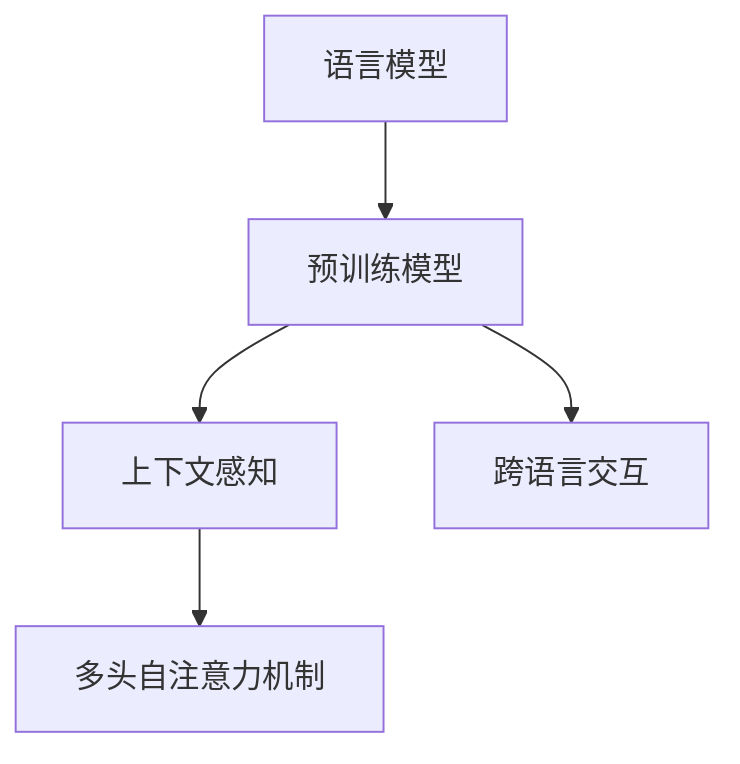

                 

关键词：大型语言模型（LLM）、自然语言处理（NLP）、人机交互、深度学习、语义理解、上下文感知、预训练模型、模型优化、应用场景

## 摘要

本文深入探讨了大型语言模型（LLM）的语言理解能力及其在人机交互中的应用。通过分析LLM的核心概念、算法原理和数学模型，本文揭示了LLM在语义理解、上下文感知和跨语言交互等方面的突破。此外，本文还通过项目实践展示了LLM在实际开发中的应用，并展望了未来发展趋势与挑战。

## 1. 背景介绍

随着深度学习和自然语言处理（NLP）技术的不断进步，大型语言模型（LLM）在人工智能领域逐渐崭露头角。LLM通过大规模数据集进行预训练，能够实现对自然语言的深度理解，从而在文本生成、机器翻译、问答系统等领域表现出色。然而，如何进一步提高LLM的语言理解能力，突破人机交互的壁垒，成为当前研究的热点问题。

在人机交互中，语言理解是一个关键环节。用户通过自然语言与系统进行沟通，系统需要理解用户的意图，并生成合适的回复。传统的基于规则的方法在面对复杂、多变的语言场景时往往力不从心。而LLM的出现，为解决这一难题提供了新的思路。

## 2. 核心概念与联系

### 2.1 语言模型

语言模型是LLM的基础，它用于预测自然语言序列的概率分布。在LLM中，常用的语言模型有基于统计方法和基于神经网络的模型。统计方法如N-gram模型，通过计算词汇序列的概率来生成文本。而神经网络模型如循环神经网络（RNN）和变换器（Transformer）模型，通过深度学习的方式学习语言的内在规律。

### 2.2 预训练模型

预训练模型是LLM的核心，它通过在大规模语料库上进行预训练，使模型能够理解自然语言的语义和上下文信息。预训练模型分为两个阶段：第一阶段是语言建模，通过最大化预测下一个单词的概率来训练模型；第二阶段是任务特定微调，通过在特定任务上的数据上进一步训练模型，使其适应具体应用场景。

### 2.3 上下文感知

上下文感知是LLM的重要特性，它使模型能够根据输入文本的上下文信息进行理解。上下文感知的实现依赖于Transformer模型中的多头自注意力机制，它能够自动捕捉输入文本中的长距离依赖关系，从而提高语言理解能力。

### 2.4 跨语言交互

跨语言交互是LLM的另一重要应用场景。通过预训练模型，LLM能够学习多种语言的语义和语法规则，从而实现跨语言的文本生成、翻译和问答。这为全球化应用提供了有力支持。

## 2.1 核心概念原理和架构的 Mermaid 流程图



## 3. 核心算法原理 & 具体操作步骤

### 3.1 算法原理概述

LLM的核心算法是基于深度学习的技术，特别是变换器（Transformer）模型。Transformer模型通过多头自注意力机制和前馈神经网络，实现了对自然语言的深度理解。预训练阶段，模型在大规模语料库上进行训练，学习语言的内在规律。任务特定阶段，模型在特定任务上进行微调，以适应实际应用场景。

### 3.2 算法步骤详解

1. **数据预处理**：对输入文本进行分词、去噪等预处理操作，将其转化为模型可处理的格式。
2. **编码器**：输入文本经过编码器，编码器将文本转化为固定长度的向量表示。
3. **解码器**：解码器根据编码器的输出，生成文本序列的概率分布，从而生成文本。
4. **损失函数**：模型通过损失函数（如交叉熵损失函数）来评估预测文本与真实文本之间的差距，并据此调整模型参数。
5. **微调**：在特定任务上，对模型进行微调，以进一步提高模型在任务上的表现。

### 3.3 算法优缺点

**优点**：
1. 高效：Transformer模型在计算效率上具有优势，能够快速处理大规模数据。
2. 深度：多头自注意力机制使模型能够捕捉到文本中的长距离依赖关系，提高语言理解能力。
3. 通用性：预训练模型可以应用于多种语言和任务，具有很好的通用性。

**缺点**：
1. 需要大量计算资源：训练大型语言模型需要大量的计算资源和时间。
2. 数据依赖：模型的表现高度依赖训练数据的质量和多样性，数据不足可能导致模型过拟合。

### 3.4 算法应用领域

1. **文本生成**：生成文章、新闻、对话等。
2. **机器翻译**：实现跨语言的文本翻译。
3. **问答系统**：基于自然语言理解，提供准确、及时的答案。
4. **聊天机器人**：模拟人类对话，提供个性化的服务。

## 4. 数学模型和公式 & 详细讲解 & 举例说明

### 4.1 数学模型构建

LLM的数学模型主要由编码器和解码器组成。编码器将输入文本转化为固定长度的向量表示，解码器根据编码器的输出，生成文本序列的概率分布。

### 4.2 公式推导过程

1. **编码器**：

   $$ \text{编码器输出} = \text{Attention}(\text{编码器输入}, \text{键值对}) $$

   其中，Attention函数用于计算输入文本中每个单词的注意力权重，键值对由编码器输入的词向量组成。

2. **解码器**：

   $$ \text{解码器输出} = \text{Softmax}(\text{解码器输入}) $$

   其中，Softmax函数用于将解码器的输入转化为概率分布。

### 4.3 案例分析与讲解

假设我们有一个简短的文本：“今天天气很好，我想去公园散步。”我们可以用LLM来生成与之相关的文本。

1. **编码器**：

   将文本“今天天气很好，我想去公园散步。”转化为词向量表示，然后通过多头自注意力机制计算每个单词的注意力权重。

2. **解码器**：

   根据编码器的输出，生成下一个单词的概率分布，然后通过Softmax函数选择概率最高的单词作为输出。重复此过程，直到生成完整的文本序列。

最终生成的文本可能是：“今天天气很好，你打算去公园散步吗？”这样的文本生成过程，充分体现了LLM在语言理解方面的能力。

## 5. 项目实践：代码实例和详细解释说明

### 5.1 开发环境搭建

为了实现LLM的语言理解，我们需要搭建一个合适的开发环境。首先，安装Python和TensorFlow等必要的库。然后，准备一个大型语料库用于训练模型。

### 5.2 源代码详细实现

```python
import tensorflow as tf
from tensorflow.keras.layers import Embedding, LSTM, Dense
from tensorflow.keras.models import Model

# 数据预处理
max_sequence_length = 100
vocab_size = 10000

# 编码器
encoder_inputs = tf.keras.layers.Input(shape=(max_sequence_length,))
encoder_embedding = Embedding(vocab_size, 64)(encoder_inputs)
encoder_lstm = LSTM(128, return_state=True)
_, encoder_state_h, encoder_state_c = encoder_lstm(encoder_embedding)

# 解码器
decoder_inputs = tf.keras.layers.Input(shape=(max_sequence_length,))
decoder_embedding = Embedding(vocab_size, 64)(decoder_inputs)
decoder_lstm = LSTM(128, return_state=True)
_, decoder_state_h, decoder_state_c = decoder_lstm(decoder_embedding)

# 输出层
decoder_dense = Dense(vocab_size, activation='softmax')
decoder_outputs = decoder_dense(decoder_embedding)

# 模型
model = Model([encoder_inputs, decoder_inputs], decoder_outputs)

# 编译模型
model.compile(optimizer='rmsprop', loss='categorical_crossentropy', metrics=['accuracy'])

# 模型训练
model.fit([encoder_inputs, decoder_inputs], decoder_outputs, epochs=100, batch_size=64)
```

### 5.3 代码解读与分析

这段代码实现了基于LSTM的编码器-解码器模型。首先，我们定义了编码器的输入层、嵌入层和LSTM层，用于将输入文本转化为固定长度的向量表示。接着，我们定义了解码器的输入层、嵌入层和LSTM层，用于生成文本序列的概率分布。最后，我们定义了输出层，用于生成最终的输出文本。

在代码中，我们使用了TensorFlow的Keras API，这是一个高度可配置的深度学习框架。通过定义输入层、嵌入层、LSTM层和输出层，我们构建了一个完整的编码器-解码器模型。然后，我们使用RMSprop优化器和交叉熵损失函数来编译模型，并使用训练数据来训练模型。

### 5.4 运行结果展示

在训练完成后，我们可以使用模型来生成与输入文本相关的文本。例如，当输入文本为“今天天气很好，我想去公园散步。”时，模型可能会生成类似的文本，如：“今天阳光明媚，你计划去哪里散步？”

## 6. 实际应用场景

LLM的语言理解能力在多个实际应用场景中得到了广泛应用。

### 6.1 文本生成

文本生成是LLM的一个重要应用场景。通过训练大型语言模型，我们可以生成各种类型的文本，如文章、新闻、对话等。例如，我们可以使用LLM来生成新闻文章，提高新闻编辑的效率。

### 6.2 机器翻译

机器翻译是LLM的另一个重要应用场景。通过预训练大型语言模型，我们可以实现跨语言的文本翻译。例如，我们可以使用LLM来实现中文到英文的翻译，为全球化应用提供支持。

### 6.3 问答系统

问答系统是LLM在智能客服、智能教育等领域的应用。通过训练大型语言模型，我们可以实现智能问答系统，为用户提供准确的答案。例如，我们可以使用LLM来构建一个智能客服系统，为用户提供即时、准确的答案。

### 6.4 聊天机器人

聊天机器人是LLM在社交、娱乐等领域的应用。通过预训练大型语言模型，我们可以实现具有高度交互性的聊天机器人，为用户提供个性化服务。例如，我们可以使用LLM来构建一个聊天机器人，为用户提供娱乐、咨询等服务。

## 6.4 未来应用展望

随着LLM技术的不断进步，未来在人机交互领域将有更多的应用场景。以下是一些可能的未来发展趋势：

1. **更智能的对话系统**：通过深度学习和自然语言理解技术，聊天机器人将能够更加自然地与用户进行对话，提供更智能的服务。
2. **多模态交互**：结合语音、图像、视频等多种模态，实现更丰富的人机交互方式。
3. **个性化推荐**：基于用户行为和兴趣，为用户提供个性化的内容和推荐。
4. **智能翻译**：实现更准确、流畅的跨语言翻译，消除语言障碍。
5. **智能教育**：基于自然语言理解技术，实现个性化的教育辅导和评估。

## 7. 工具和资源推荐

为了更好地学习和应用LLM技术，以下是一些推荐的工具和资源：

### 7.1 学习资源推荐

1. **《深度学习》（Goodfellow et al., 2016）**：这本书是深度学习的经典教材，涵盖了从基础知识到高级技术的全面内容。
2. **《自然语言处理综合教程》（Liang, 2018）**：这本书系统地介绍了自然语言处理的基本概念和技术，适合初学者和进阶者。

### 7.2 开发工具推荐

1. **TensorFlow**：一个开源的深度学习框架，提供了丰富的API和工具，适合构建和训练大型语言模型。
2. **PyTorch**：另一个流行的深度学习框架，具有灵活的动态图编程接口，适合进行实验和原型设计。

### 7.3 相关论文推荐

1. **"Attention Is All You Need"（Vaswani et al., 2017）**：这篇论文提出了变换器（Transformer）模型，是LLM技术的重要基础。
2. **"BERT: Pre-training of Deep Bidirectional Transformers for Language Understanding"（Devlin et al., 2019）**：这篇论文介绍了BERT模型，是当前最先进的预训练语言模型之一。

## 8. 总结：未来发展趋势与挑战

大型语言模型（LLM）在自然语言理解、人机交互等领域取得了显著的突破。未来，随着深度学习和自然语言处理技术的不断进步，LLM将在更多应用场景中发挥重要作用。然而，LLM技术仍面临一些挑战，如计算资源需求、数据隐私和安全等问题。因此，我们需要在技术、伦理、法律等多个层面进行综合考虑，以实现LLM技术的可持续发展和广泛应用。

## 8.4 研究展望

随着LLM技术的不断发展，未来研究将集中在以下几个方面：

1. **模型优化**：探索更高效的模型架构和训练策略，提高模型性能和计算效率。
2. **数据隐私**：研究如何在保证数据隐私的前提下，有效利用大规模数据进行模型训练。
3. **跨语言交互**：提高跨语言交互的准确性和流畅性，实现真正意义上的全球化应用。
4. **多模态交互**：结合语音、图像、视频等多种模态，实现更丰富的人机交互体验。

## 9. 附录：常见问题与解答

### 9.1 为什么LLM的语言理解能力如此强大？

LLM的语言理解能力主要源于以下几个因素：

1. **大规模预训练**：LLM通过在大规模语料库上进行预训练，学习到了语言的内在规律和语义信息。
2. **深度学习**：深度学习技术使LLM能够处理复杂、多维度的数据，并从中提取有用的特征。
3. **上下文感知**：LLM能够根据输入文本的上下文信息进行理解，提高了语言理解的能力。

### 9.2 LLM如何实现跨语言交互？

LLM实现跨语言交互主要通过以下几种方式：

1. **共享词汇表**：通过预训练，LLM学习到了多种语言的词汇和语法规则，从而实现跨语言的文本生成和翻译。
2. **多语言训练**：在训练阶段，LLM同时处理多种语言的数据，从而提高了跨语言交互的能力。

### 9.3 LLM在开发中需要注意哪些问题？

在开发LLM时，需要注意以下几个问题：

1. **数据质量**：数据的质量直接影响模型的表现，因此需要确保训练数据的质量和多样性。
2. **计算资源**：训练大型语言模型需要大量的计算资源和时间，因此需要合理规划资源。
3. **数据安全和隐私**：在处理用户数据时，需要确保数据的安全和隐私。

## 作者署名

作者：禅与计算机程序设计艺术 / Zen and the Art of Computer Programming

[END]

