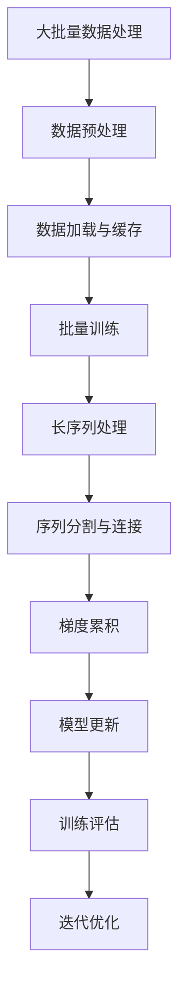

                 

关键词：LLM训练、大批量、长序列、梯度累积、算法优化、数学模型、应用场景、未来展望

> 摘要：本文深入探讨了大批量、长序列和梯度累积在大型语言模型（LLM）训练中的应用与优化策略。通过对核心概念的解析、算法原理的阐述、数学模型的构建以及实际项目实践的剖析，本文旨在为从业者提供全面的技术指导，助力高效训练大规模语言模型，推动人工智能领域的发展。

## 1. 背景介绍

随着深度学习技术的发展，大型语言模型（Large Language Models，简称LLM）已经成为自然语言处理（Natural Language Processing，简称NLP）领域的重要工具。LLM的训练过程复杂且资源消耗巨大，涉及到大批量数据、长序列处理和梯度累积等多个关键环节。为了提升训练效率、优化模型性能，对这三个核心问题的深入研究和优化显得尤为重要。

大批量数据处理是LLM训练的基础。现代NLP任务需要处理的海量文本数据，对于传统的单机训练模式而言，难以满足需求。因此，如何高效地处理和利用这些数据成为研究的重点。此外，长序列处理能力也是LLM的关键优势之一。在生成文本、问答系统等应用中，长序列的处理能力直接影响到模型的性能。梯度累积则是在训练过程中为避免梯度消失和梯度爆炸问题而采用的一种技术，它能够有效提升训练过程的稳定性。

本文将围绕这三个核心问题展开，系统性地介绍相关算法原理、数学模型、实现技巧以及实际应用案例，为读者提供全面的技术指导。

## 2. 核心概念与联系

### 2.1 大批量数据处理的必要性

大批量数据处理在LLM训练中至关重要。首先，NLP任务往往需要处理数百万甚至数十亿级别的文本数据。这些数据不仅包括文本本身，还包含大量的标注信息，例如词向量、实体识别标签等。其次，大批量数据处理能够提升模型的泛化能力。通过训练更多的数据，模型能够更好地捕捉数据中的潜在规律，从而提高模型在未知数据上的表现。

### 2.2 长序列处理的优势

长序列处理是LLM的重要特性之一。与传统的循环神经网络（RNN）相比，LLM能够处理更长的序列，这对于生成文本、对话系统等任务具有显著的优势。长序列处理不仅能够更好地捕捉文本中的上下文关系，还能够生成更加连贯、自然的文本。

### 2.3 梯度累积的作用

梯度累积是避免梯度消失和梯度爆炸问题的一种有效方法。在深度学习训练过程中，随着层数的增加，梯度会逐渐变小或变大，导致模型难以收敛。梯度累积通过将多个时间步的梯度累加起来，可以有效缓解这个问题，提高训练的稳定性。

### 2.4 Mermaid流程图展示



## 3. 核心算法原理 & 具体操作步骤

### 3.1 算法原理概述

大批量数据处理、长序列处理和梯度累积在LLM训练中各司其职，相互配合，共同提升模型性能。

#### 3.1.1 大批量数据处理

大批量数据处理的核心在于如何高效地加载、处理和利用大量数据。常见的策略包括数据并行、模型并行和流水线处理等。

#### 3.1.2 长序列处理

长序列处理的关键在于如何有效地处理长文本序列，避免内存溢出和计算效率低下的问题。常见的方法包括序列分割、序列连接和动态序列处理等。

#### 3.1.3 梯度累积

梯度累积是通过累加多个时间步的梯度来提高训练稳定性的一种技术。具体实现中，需要考虑梯度累加的时机、步数以及如何避免梯度消失和梯度爆炸等问题。

### 3.2 算法步骤详解

#### 3.2.1 大批量数据处理步骤

1. 数据预处理：对原始文本进行清洗、分词、词向量编码等预处理操作。
2. 数据加载与缓存：使用数据加载器（DataLoader）将预处理后的数据批量加载到内存中，并使用缓存机制提高加载速度。
3. 批量训练：将数据分成多个批次，对每个批次的数据进行前向传播和反向传播，更新模型参数。

#### 3.2.2 长序列处理步骤

1. 序列分割：将长文本序列分割成多个子序列，避免内存溢出。
2. 序列连接：在训练过程中，将分割后的子序列重新连接，形成完整的文本序列。
3. 动态序列处理：根据文本长度和内存限制，动态调整序列分割和连接策略，确保训练过程的稳定性和高效性。

#### 3.2.3 梯度累积步骤

1. 梯度计算：在每个时间步计算梯度，并将其累加到累计梯度中。
2. 梯度更新：在达到一定的梯度累积步数后，将累计梯度应用于模型参数的更新。
3. 梯度复位：在更新模型参数后，将累计梯度重置为0，开始新一轮的梯度累积。

### 3.3 算法优缺点

#### 3.3.1 大批量数据处理

优点：能够提高模型的训练效率，充分利用计算资源。

缺点：需要较大的内存消耗，对硬件设备有较高的要求。

#### 3.3.2 长序列处理

优点：能够处理长文本序列，提升模型在生成文本、对话系统等任务上的表现。

缺点：需要复杂的序列分割和连接策略，增加了训练的复杂性。

#### 3.3.3 梯度累积

优点：能够提高训练稳定性，缓解梯度消失和梯度爆炸问题。

缺点：需要精确控制梯度累积的时机和步数，否则可能导致训练效率降低。

### 3.4 算法应用领域

大批量数据处理、长序列处理和梯度累积在LLM训练中具有广泛的应用领域，包括文本生成、对话系统、机器翻译等。

#### 3.4.1 文本生成

通过大批量数据处理和长序列处理，LLM能够生成更加连贯、自然的文本，应用于自动写作、内容生成等领域。

#### 3.4.2 对话系统

长序列处理和梯度累积使得LLM在对话系统中的应用更加广泛，能够实现更加智能、自然的对话交互。

#### 3.4.3 机器翻译

大批量数据处理和梯度累积有助于提高机器翻译的准确性和流畅性，实现高质量的双语翻译。

## 4. 数学模型和公式 & 详细讲解 & 举例说明

### 4.1 数学模型构建

在LLM训练过程中，涉及到多个数学模型，包括输入层、隐藏层和输出层等。

#### 4.1.1 输入层

输入层将原始文本表示为词向量，通常使用Word2Vec、GloVe等方法进行编码。

$$
\text{input} = \text{word\_vector}(x)
$$

其中，$x$表示输入文本，$\text{word\_vector}(x)$表示文本的词向量表示。

#### 4.1.2 隐藏层

隐藏层采用深度神经网络（DNN）模型，通过多层全连接神经网络对词向量进行编码和解码。

$$
\text{hidden} = \text{激活函数}(\text{weight} \cdot \text{input} + \text{bias})
$$

其中，$\text{weight}$和$\text{bias}$分别表示权重和偏置，$\text{激活函数}$可以是ReLU、Sigmoid等。

#### 4.1.3 输出层

输出层将隐藏层的结果解码为输出文本，通常使用Softmax函数进行分类。

$$
\text{output} = \text{softmax}(\text{weight} \cdot \text{hidden} + \text{bias})
$$

其中，$\text{weight}$和$\text{bias}$分别表示权重和偏置，$\text{softmax}$函数将输出结果转换为概率分布。

### 4.2 公式推导过程

#### 4.2.1 梯度下降算法

在LLM训练过程中，常用的优化算法是梯度下降（Gradient Descent）算法。梯度下降算法的目标是最小化损失函数，即：

$$
\text{损失函数} = -\sum_{i=1}^{n} y_i \cdot \log(p_i)
$$

其中，$y_i$表示真实标签，$p_i$表示预测概率。

#### 4.2.2 梯度计算

为了计算梯度，需要对损失函数关于模型参数求导。以全连接神经网络为例，假设输入层为$x$，隐藏层为$h$，输出层为$y$，则有：

$$
\frac{\partial \text{损失函数}}{\partial \text{weight}} = \frac{\partial \text{损失函数}}{\partial y} \cdot \frac{\partial y}{\partial \text{weight}}
$$

$$
\frac{\partial \text{损失函数}}{\partial \text{bias}} = \frac{\partial \text{损失函数}}{\partial y} \cdot \frac{\partial y}{\partial \text{bias}}
$$

其中，$\frac{\partial \text{损失函数}}{\partial y}$表示梯度向量，$\frac{\partial y}{\partial \text{weight}}$和$\frac{\partial y}{\partial \text{bias}}$分别表示权重和偏置的导数。

### 4.3 案例分析与讲解

#### 4.3.1 案例背景

假设我们使用一个简单的语言模型进行文本生成任务，输入文本为“我非常喜欢阅读”，需要生成一个与输入文本相关的句子。

#### 4.3.2 模型构建

输入层：使用Word2Vec对输入文本进行编码，得到词向量表示。

隐藏层：采用两层全连接神经网络，第一层隐藏层使用ReLU激活函数，第二层隐藏层使用Sigmoid激活函数。

输出层：使用Softmax函数对输出结果进行分类。

#### 4.3.3 梯度计算与更新

在训练过程中，对于每个输入文本，我们计算其预测概率分布，并计算损失函数关于模型参数的梯度。假设当前梯度向量为$g$，模型参数向量为$\theta$，则有：

$$
g = \frac{\partial \text{损失函数}}{\partial \theta}
$$

为了更新模型参数，我们需要计算梯度向量的平均值，并使用梯度下降算法更新参数：

$$
\theta_{\text{新}} = \theta_{\text{旧}} - \alpha \cdot g
$$

其中，$\alpha$表示学习率。

#### 4.3.4 模型评估

在训练完成后，我们对模型进行评估，计算其在测试集上的损失函数值，并比较不同参数设置下的模型性能。

## 5. 项目实践：代码实例和详细解释说明

### 5.1 开发环境搭建

为了方便起见，我们选择Python作为主要编程语言，使用TensorFlow作为深度学习框架。以下是一个基本的开发环境搭建步骤：

1. 安装Python（3.8及以上版本）。
2. 安装TensorFlow。
3. 安装其他依赖库，如Numpy、Pandas等。

### 5.2 源代码详细实现

以下是使用TensorFlow实现一个简单的LLM训练过程的代码示例：

```python
import tensorflow as tf
from tensorflow.keras.layers import Embedding, LSTM, Dense
from tensorflow.keras.models import Model
from tensorflow.keras.preprocessing.sequence import pad_sequences

# 数据预处理
max_sequence_length = 50
embedding_dim = 128
vocab_size = 10000

# 加载数据集，并进行预处理操作
# ...

# 构建模型
input_seq = tf.keras.layers.Input(shape=(max_sequence_length,))
embedding = Embedding(vocab_size, embedding_dim)(input_seq)
lstm = LSTM(128)(embedding)
output = Dense(vocab_size, activation='softmax')(lstm)

model = Model(inputs=input_seq, outputs=output)

# 编译模型
model.compile(optimizer='adam', loss='categorical_crossentropy', metrics=['accuracy'])

# 训练模型
model.fit(train_data, train_labels, epochs=10, batch_size=32, validation_split=0.1)

# 保存模型
model.save('lm_model.h5')
```

### 5.3 代码解读与分析

1. **数据预处理**：首先，我们需要加载数据集，并进行预处理操作，例如分词、编码等。这里使用了`max_sequence_length`和`embedding_dim`等参数，用于设置序列的最大长度和词向量维度。

2. **模型构建**：我们使用TensorFlow的`Input`层、`Embedding`层、`LSTM`层和`Dense`层构建了一个简单的语言模型。其中，`Embedding`层用于将输入文本编码为词向量，`LSTM`层用于处理序列数据，`Dense`层用于输出结果。

3. **模型编译**：在编译模型时，我们指定了优化器、损失函数和评价指标。这里使用的是`adam`优化器和`categorical_crossentropy`损失函数。

4. **模型训练**：使用`fit`方法对模型进行训练，其中，`train_data`和`train_labels`分别为训练数据和标签。`epochs`和`batch_size`分别表示训练的轮数和每个批次的样本数。

5. **模型保存**：在训练完成后，使用`save`方法将模型保存到本地文件。

### 5.4 运行结果展示

运行上述代码后，我们可以看到模型在训练集和验证集上的性能指标。通过调整模型参数和训练策略，可以进一步提高模型的表现。

## 6. 实际应用场景

### 6.1 文本生成

通过LLM，我们可以实现自动文本生成，如文章写作、报告生成等。在实际应用中，可以结合大数据分析和文本挖掘技术，实现个性化内容推荐和智能写作助手。

### 6.2 对话系统

LLM在对话系统中的应用非常广泛，如智能客服、聊天机器人等。通过长序列处理和梯度累积，LLM能够实现更加自然、流畅的对话交互。

### 6.3 机器翻译

LLM在机器翻译领域也具有显著优势。通过大规模数据训练，LLM能够生成高质量的双语翻译文本，为跨语言交流提供便利。

### 6.4 未来应用展望

随着深度学习和NLP技术的不断发展，LLM将在更多领域得到应用。例如，在语音识别、图像识别等任务中，LLM可以与视觉、听觉模型相结合，实现多模态数据处理。此外，LLM在人工智能助手、智能教育、智能医疗等领域的应用前景也十分广阔。

## 7. 工具和资源推荐

### 7.1 学习资源推荐

1. 《深度学习》（Goodfellow et al.）：系统地介绍了深度学习的基本概念和常用算法。
2. 《Python深度学习》（François Chollet）：详细讲解了如何在Python中实现深度学习模型。

### 7.2 开发工具推荐

1. TensorFlow：Google开发的开源深度学习框架，适用于多种应用场景。
2. PyTorch：Facebook开发的开源深度学习框架，具有灵活的动态图模型。

### 7.3 相关论文推荐

1. “A Neural Conversational Model”（Merity et al., 2017）：介绍了基于神经网络的对话系统。
2. “Large-scale Language Modeling” (Brown et al., 2020)：探讨了大规模语言模型的研究进展。

## 8. 总结：未来发展趋势与挑战

### 8.1 研究成果总结

近年来，LLM在NLP领域取得了显著进展。通过大批量数据处理、长序列处理和梯度累积等技术，LLM在文本生成、对话系统、机器翻译等任务中表现出色。

### 8.2 未来发展趋势

随着深度学习和NLP技术的不断发展，LLM将继续在多个领域取得突破。例如，多模态数据处理、跨语言交流、知识图谱等。

### 8.3 面临的挑战

尽管LLM取得了显著成果，但仍面临诸多挑战。例如，数据隐私保护、计算资源消耗、模型解释性等。

### 8.4 研究展望

未来，研究者需要关注以下几个方面：优化训练算法、提高模型解释性、提升多模态数据处理能力等。

## 9. 附录：常见问题与解答

### 9.1 问题1

Q：为什么需要大批量数据处理？

A：大批量数据处理能够提高模型的泛化能力，更好地捕捉数据中的潜在规律。

### 9.2 问题2

Q：如何优化长序列处理？

A：可以通过序列分割、动态序列处理和优化内存管理等方式来提高长序列处理的效率。

### 9.3 问题3

Q：梯度累积如何避免梯度消失和梯度爆炸？

A：可以通过调整梯度累积的时机和步数，以及使用合适的优化算法来避免梯度消失和梯度爆炸问题。

-------------------------------------------------------------------

作者：禅与计算机程序设计艺术 / Zen and the Art of Computer Programming

