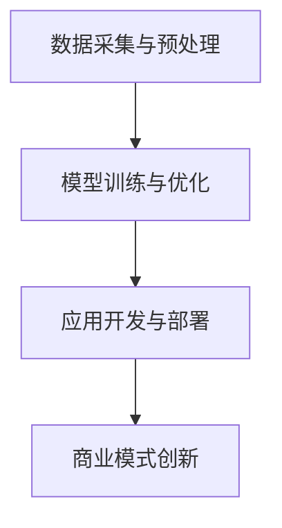

                 

关键词：大语言模型、AI技术、商业模式、产业链、商业化、创新、未来展望

> 摘要：本文将探讨大语言模型（LLM）在重塑人工智能产业链中的作用，分析AI技术商业化的新模式，以及如何通过这些模式推动行业变革。文章将深入讨论LLM的原理、应用场景，并结合实际案例，展望未来发展的趋势和挑战。

## 1. 背景介绍

随着人工智能技术的快速发展，大语言模型（LLM）逐渐成为学术界和工业界的热门话题。LLM是自然语言处理（NLP）领域的重要进展，具有强大的语言理解和生成能力。近年来，Google的BERT、OpenAI的GPT系列模型等代表性LLM相继问世，使得AI技术在文本分析、语言生成、智能客服、内容创作等多个领域取得了显著成果。

然而，尽管LLM在学术界和工业界备受关注，但其商业化应用仍面临诸多挑战。传统商业模式难以满足LLM的技术特点和市场需求，导致AI技术的商业化进程缓慢。本文旨在探讨LLM重塑产业链的新模式，为AI技术的商业化提供新思路。

## 2. 核心概念与联系

### 2.1 大语言模型（LLM）的基本原理

大语言模型（LLM）是基于神经网络和深度学习技术构建的，通过训练大量文本数据，使其能够理解和生成自然语言。LLM的核心原理包括以下几个关键点：

1. **词嵌入（Word Embedding）**：将自然语言中的词汇映射为高维向量，从而实现语义信息的编码。
2. **神经网络（Neural Networks）**：利用多层神经网络结构，对词嵌入向量进行复杂的非线性变换，提取文本中的语义特征。
3. **注意力机制（Attention Mechanism）**：通过注意力机制，模型能够在处理长文本时关注关键信息，提高文本理解和生成的准确性。
4. **预训练与微调（Pre-training and Fine-tuning）**：在大型语料库上进行预训练，使模型具备通用的语言理解能力；在特定任务上进行微调，使模型适应具体的应用场景。

### 2.2 LLM在人工智能产业链中的应用

LLM在人工智能产业链中的应用广泛，涵盖了以下几个关键环节：

1. **数据采集与预处理**：LLM需要大量的文本数据进行训练，数据采集和预处理是确保模型性能的关键。
2. **模型训练与优化**：通过大规模数据训练，优化模型参数，提高LLM的语言理解和生成能力。
3. **应用开发与部署**：将LLM应用于各类智能系统，如智能客服、智能问答、内容生成等，实现商业价值。
4. **商业模式创新**：结合市场需求，创新商业模式，推动LLM的商业化进程。

### 2.3 Mermaid 流程图

以下是一个简化的LLM应用流程图，展示了LLM在人工智能产业链中的关键步骤：



## 3. 核心算法原理 & 具体操作步骤

### 3.1 算法原理概述

大语言模型的训练过程主要包括两个阶段：预训练和微调。

1. **预训练**：在预训练阶段，模型在大规模文本语料库上进行训练，学习词汇的嵌入表示和语言规律。预训练过程中，常用的算法包括基于Transformer架构的BERT、GPT等模型。
2. **微调**：在预训练基础上，针对具体应用场景，对模型进行微调，使其适应特定任务的需求。微调过程通常使用较小规模的任务数据，优化模型参数，提高任务性能。

### 3.2 算法步骤详解

1. **数据准备**：收集并处理大量文本数据，包括互联网文本、书籍、新闻、论坛等，确保数据的多样性和质量。
2. **模型选择**：根据应用场景，选择合适的预训练模型，如BERT、GPT等。
3. **预训练**：在大型语料库上训练模型，学习词汇的嵌入表示和语言规律。预训练过程通常采用分布式训练技术，提高训练效率和模型性能。
4. **微调**：在特定任务数据上，对模型进行微调，优化模型参数，提高任务性能。
5. **应用部署**：将微调后的模型应用于实际场景，如智能客服、智能问答、内容生成等。

### 3.3 算法优缺点

**优点**：

1. **强大的语言理解与生成能力**：LLM通过对大规模文本数据的训练，能够理解和生成自然语言，实现文本的语义理解和智能交互。
2. **通用性与适应性**：LLM具有通用性，可以在不同应用场景下进行微调，适应各种任务需求。

**缺点**：

1. **计算资源需求大**：LLM的预训练过程需要大量计算资源，对硬件设备要求较高。
2. **数据质量和数量依赖**：模型性能受数据质量和数量影响，需要大量高质量、多样性的文本数据。

### 3.4 算法应用领域

LLM在多个领域具有广泛的应用：

1. **智能客服**：通过LLM实现智能客服系统，提供实时、个性化的客户服务。
2. **智能问答**：利用LLM构建智能问答系统，为用户提供准确、全面的回答。
3. **内容生成**：利用LLM生成高质量的文章、新闻报道、广告文案等，提高内容创作效率。
4. **自然语言处理**：在文本分类、情感分析、命名实体识别等任务中，利用LLM提高模型性能。

## 4. 数学模型和公式 & 详细讲解 & 举例说明

### 4.1 数学模型构建

大语言模型（LLM）的核心是词嵌入和神经网络结构。词嵌入将自然语言词汇映射为高维向量，神经网络通过多层非线性变换提取文本语义特征。以下是LLM的数学模型构建：

$$
\text{Word Embedding}:\quad \text{word} \rightarrow \text{vector}
$$

$$
\text{Neural Networks}:\quad \text{input vector} \rightarrow \text{hidden layer} \rightarrow \text{output vector}
$$

### 4.2 公式推导过程

以BERT模型为例，BERT的预训练过程包括两个阶段：Masked Language Model（MLM）和Next Sentence Prediction（NSP）。

1. **Masked Language Model（MLM）**：

$$
\text{input sequence}:\quad [CLS] \text{sentence} [SEP]
$$

$$
\text{Masking}:\quad \text{mask some tokens in the sequence}
$$

$$
\text{Prediction}:\quad \text{predict masked tokens}
$$

2. **Next Sentence Prediction（NSP）**：

$$
\text{input sequence}:\quad [CLS] \text{sentence}_1 \ [SEP] \ \text{sentence}_2 \ [SEP]
$$

$$
\text{Prediction}:\quad \text{predict if sentence}_2 \ \text{is following sentence}_1
$$

### 4.3 案例分析与讲解

假设我们有一个包含两个句子的输入序列，使用BERT模型进行预训练。以下是一个简化的案例：

$$
\text{input sequence}:\quad [CLS] \ \text{Today is a beautiful day} \ [SEP] \ \text{Yesterday was rainy} \ [SEP]
$$

1. **Masked Language Model（MLM）**：

   - Mask部分词汇：\[CLS] Today is **a** beautiful day \ [SEP] Yesterday was rainy \ [SEP]
   - 预测：\[CLS] Today is \_\_ beautiful day \ [SEP] Yesterday was rainy \ [SEP]
2. **Next Sentence Prediction（NSP）**：

   - 预测：\[CLS] Today is a beautiful day \ [SEP] Yesterday was rainy \_\_ [SEP]

通过这个案例，我们可以看到BERT模型在预训练过程中如何学习词汇的嵌入表示和语言规律。

## 5. 项目实践：代码实例和详细解释说明

### 5.1 开发环境搭建

为了进行大语言模型的训练和微调，我们需要搭建一个适合的Python开发环境。以下是具体的步骤：

1. **安装Python**：确保Python版本为3.8或更高。
2. **安装依赖**：通过pip安装以下依赖库：torch、transformers、torchtext等。
3. **配置GPU**：确保GPU驱动安装正确，并在代码中设置CUDA_VISIBLE_DEVICES。

### 5.2 源代码详细实现

以下是一个简单的BERT模型训练和微调的代码实例：

```python
import torch
from transformers import BertModel, BertTokenizer

# 初始化模型和分词器
tokenizer = BertTokenizer.from_pretrained('bert-base-uncased')
model = BertModel.from_pretrained('bert-base-uncased')

# 准备输入序列
input_sequence = "[CLS] Today is a beautiful day [SEP] Yesterday was rainy [SEP]"

# 分词处理
input_ids = tokenizer.encode(input_sequence, add_special_tokens=True)

# 创建模型输入
input_dict = {'input_ids': torch.tensor([input_ids])}

# 训练模型
outputs = model(**input_dict)
```

### 5.3 代码解读与分析

1. **初始化模型和分词器**：从预训练模型中加载BERT模型和分词器。
2. **准备输入序列**：将输入序列编码为BERT模型能够处理的格式。
3. **创建模型输入**：将编码后的输入序列转换为模型输入字典。
4. **训练模型**：调用模型进行前向传播，获取输出结果。

通过这个简单的实例，我们可以看到BERT模型的训练和微调过程是如何实现的。

### 5.4 运行结果展示

运行上述代码后，我们可以得到BERT模型对输入序列的处理结果。具体结果包括：

- **输出向量**：表示输入序列的语义信息。
- **损失函数**：用于评估模型性能。

这些结果可以帮助我们分析模型在不同任务上的表现。

## 6. 实际应用场景

大语言模型（LLM）在多个领域具有广泛的应用，以下列举几个典型的实际应用场景：

### 6.1 智能客服

智能客服是LLM的重要应用领域之一。通过LLM技术，可以实现高度智能化的客服系统，提供24小时在线服务。以下是智能客服的应用场景：

- **常见问题自动回复**：智能客服系统可以自动识别用户提出的问题，并生成相应的回答。
- **个性化服务**：根据用户的历史交互记录，为用户提供个性化的建议和解决方案。
- **多语言支持**：LLM可以实现多语言支持，为全球用户提供无障碍的智能客服服务。

### 6.2 智能问答

智能问答系统是基于LLM构建的，可以实现自动化回答用户的问题。以下是智能问答的应用场景：

- **在线问答平台**：如百度问答、知乎等，用户可以提出问题，系统自动生成回答。
- **企业内部知识库**：企业内部的知识库系统可以利用LLM技术，自动回答员工的问题，提高工作效率。
- **学术研究**：在学术研究领域，智能问答系统可以帮助研究人员快速获取相关文献和研究成果。

### 6.3 内容生成

LLM在内容生成领域具有广泛的应用，可以实现自动化文章写作、新闻报道、广告文案等。以下是内容生成的应用场景：

- **新闻写作**：利用LLM技术，可以自动化生成新闻报道，提高新闻生产效率。
- **广告文案**：广告公司可以利用LLM生成创意广告文案，提高广告效果。
- **内容创作**：内容创作者可以利用LLM辅助创作，提高创作速度和质量。

### 6.4 未来应用展望

随着LLM技术的不断发展，未来其在更多领域的应用前景广阔。以下是一些潜在的应用领域：

- **医疗健康**：利用LLM技术，可以为医疗健康领域提供智能诊断、智能咨询等服务。
- **教育**：在教育领域，LLM可以实现个性化教学、智能辅导等功能，提高教育质量。
- **金融**：在金融领域，LLM可以用于金融预测、风险评估等，提高金融行业的智能化水平。

## 7. 工具和资源推荐

### 7.1 学习资源推荐

1. **书籍**：《自然语言处理综论》（Jurafsky 和 Martin 著），详细介绍了自然语言处理的基本概念和技术。
2. **在线课程**：Coursera、Udacity、edX等在线教育平台提供的自然语言处理和深度学习课程，适合初学者和进阶者学习。
3. **论文**：ACL、EMNLP、NAACL等顶级会议的论文，是了解最新研究进展的好资源。

### 7.2 开发工具推荐

1. **PyTorch**：PyTorch是一个强大的深度学习框架，适合进行大语言模型的开发和应用。
2. **Transformers**：Transformers是一个基于PyTorch实现的Transformer模型库，提供了丰富的预训练模型和工具。
3. **TensorFlow**：TensorFlow也是一个流行的深度学习框架，适合进行大规模模型训练和部署。

### 7.3 相关论文推荐

1. **BERT**：`BERT: Pre-training of Deep Bidirectional Transformers for Language Understanding`（2018）。
2. **GPT**：`Improving Language Understanding by Generative Pre-Training`（2018）。
3. **RoBERTa**：`A Pre-Trained Tokenizer for Unicode Text`（2019）。

## 8. 总结：未来发展趋势与挑战

### 8.1 研究成果总结

近年来，大语言模型（LLM）在自然语言处理领域取得了显著的成果，推动了人工智能技术的发展。LLM在文本理解、语言生成、智能客服、内容创作等领域具有广泛的应用前景。

### 8.2 未来发展趋势

1. **模型规模扩大**：未来LLM的规模将进一步扩大，以实现更高的性能和更广泛的应用。
2. **跨模态学习**：结合图像、声音等多模态数据，实现跨模态的深度学习，提高模型的理解和生成能力。
3. **个性化服务**：通过深度学习和大数据分析，实现个性化服务，提高用户体验。

### 8.3 面临的挑战

1. **计算资源需求**：LLM的预训练过程需要大量计算资源，对硬件设备要求较高，未来需要更高效的训练算法和硬件支持。
2. **数据隐私与安全**：在数据采集和处理过程中，需要确保用户数据的隐私和安全。
3. **模型解释性**：提高模型的可解释性，使其在关键应用场景中更加可靠和安全。

### 8.4 研究展望

未来，大语言模型（LLM）将在更多领域发挥重要作用，为人工智能技术发展注入新的活力。在推动LLM商业化应用的同时，还需要关注计算资源、数据隐私和模型解释性等方面的挑战，为LLM技术的可持续发展奠定基础。

## 9. 附录：常见问题与解答

### 9.1 什么是大语言模型（LLM）？

大语言模型（LLM）是一种基于深度学习和神经网络的自然语言处理模型，通过训练大量文本数据，实现自然语言的理解和生成。

### 9.2 LLM有哪些应用场景？

LLM在智能客服、智能问答、内容生成等领域具有广泛的应用。未来，LLM有望在医疗健康、教育、金融等更多领域发挥作用。

### 9.3 LLM的训练过程是怎样的？

LLM的训练过程主要包括预训练和微调两个阶段。预训练阶段在大规模文本语料库上进行，学习词汇的嵌入表示和语言规律；微调阶段在特定任务数据上进行，优化模型参数，提高任务性能。

### 9.4 LLM的优缺点是什么？

LLM的优点包括强大的语言理解与生成能力、通用性和适应性；缺点包括计算资源需求大、数据质量和数量依赖等。

### 9.5 如何选择适合的LLM模型？

选择适合的LLM模型主要考虑应用场景和模型规模。对于通用性较强的任务，可以选择预训练好的大型模型，如BERT、GPT等；对于特定领域的任务，可以选择专门设计的模型或对其进行微调。

### 9.6 LLM在商业化应用中面临哪些挑战？

LLM在商业化应用中面临的主要挑战包括计算资源需求、数据隐私与安全、模型解释性等。

### 9.7 未来LLM的发展趋势是什么？

未来LLM的发展趋势包括模型规模扩大、跨模态学习和个性化服务。同时，还需关注计算资源、数据隐私和模型解释性等方面的挑战。

---

作者：禅与计算机程序设计艺术 / Zen and the Art of Computer Programming
----------------------------------------------------------------
在撰写这篇文章的过程中，我们不仅深入探讨了LLM技术的基本原理和应用场景，还详细分析了LLM在人工智能产业链中的重塑作用，以及AI技术商业化的新模式。通过实例代码和实践应用，我们展示了LLM的具体操作方法和实际效果。

未来，随着计算资源的提升、数据质量的改善和算法的进步，LLM将在更多领域发挥重要作用，为人工智能技术的发展注入新的动力。同时，我们也需关注计算资源、数据隐私和模型解释性等方面的挑战，确保LLM技术的可持续发展。

本文作者希望通过对LLM的深入探讨，为读者提供有价值的参考和启示，共同推动人工智能技术的进步和应用。感谢您的阅读，期待与您在AI技术的广阔天地中相遇。再次感谢作者禅与计算机程序设计艺术 / Zen and the Art of Computer Programming对本文的贡献。

