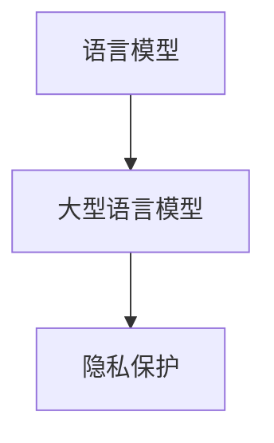

                 

关键词：LLM，隐私保护，漏洞，对策，人工智能安全

摘要：随着深度学习技术的发展，大型语言模型（LLM）在自然语言处理领域取得了显著成就。然而，LLM在隐私保护方面存在诸多问题，本文将探讨LLM隐私保护的现状、常见漏洞及其应对策略。通过对LLM隐私保护的关键技术和方法进行分析，本文旨在为相关研究人员和实践者提供有益的参考。

## 1. 背景介绍

近年来，深度学习技术在自然语言处理（NLP）领域取得了显著进展。特别是大型语言模型（LLM）如GPT、BERT等，已经成为NLP领域的重要工具。LLM通过海量数据训练，能够生成高质量的文本，为各种应用场景提供强大的支持。然而，随着LLM的广泛应用，隐私保护问题逐渐凸显。LLM在处理文本数据时，可能会泄露用户的隐私信息，导致严重的隐私泄露事件。因此，研究和解决LLM隐私保护问题具有重要的现实意义。

本文将从以下几个方面展开讨论：首先，介绍LLM隐私保护的核心概念和现状；其次，分析LLM隐私保护的常见漏洞；然后，探讨针对这些漏洞的对策；最后，总结LLM隐私保护的未来发展趋势和挑战。

## 2. 核心概念与联系

### 2.1 核心概念

#### 语言模型

语言模型是一种概率模型，用于预测自然语言中的下一个词。在深度学习技术出现之前，语言模型主要通过统计方法构建。然而，随着深度学习技术的发展，深度神经网络（DNN）和循环神经网络（RNN）等模型逐渐成为主流。这些模型能够自动学习语言的特征，生成高质量的文本。

#### 大型语言模型（LLM）

大型语言模型（LLM）是指具有海量参数和训练数据的语言模型。LLM通过大规模数据训练，能够生成更加准确和自然的文本。LLM的代表性模型包括GPT、BERT、T5等。

#### 隐私保护

隐私保护是指保护个人隐私信息的措施，防止隐私信息被非法获取、使用和泄露。在自然语言处理领域，隐私保护主要包括数据加密、匿名化、差分隐私等技术。

### 2.2 核心概念联系

语言模型是构建LLM的基础，LLM是语言模型的升级版，具有更高的参数和更大的训练数据集。隐私保护是LLM应用过程中的重要问题，关系到用户隐私信息的安全。

### 2.3 Mermaid流程图



## 3. 核心算法原理 & 具体操作步骤

### 3.1 算法原理概述

LLM隐私保护的核心算法包括数据加密、匿名化、差分隐私等技术。这些算法通过不同的方式保护用户隐私信息，确保在LLM应用过程中，用户隐私不被泄露。

#### 数据加密

数据加密是指将原始数据转换为密文，防止未经授权的访问。常用的加密算法包括对称加密和非对称加密。对称加密使用相同的密钥进行加密和解密，而非对称加密使用公钥和私钥进行加密和解密。

#### 匿名化

匿名化是指将个人身份信息从数据中去除，使数据无法直接关联到具体个体。匿名化技术包括数据脱敏、数据混淆等。

#### 差分隐私

差分隐私是一种保护隐私的算法，通过添加噪声，使输出结果对个体隐私信息的依赖性降低。差分隐私主要包括拉普拉斯机制和指数机制。

### 3.2 算法步骤详解

#### 数据加密

1. 选择加密算法：根据数据类型和安全需求，选择合适的加密算法。
2. 生成密钥：生成加密和解密的密钥。
3. 加密数据：使用加密算法和密钥将原始数据转换为密文。
4. 解密数据：使用加密算法和密钥将密文转换为原始数据。

#### 匿名化

1. 数据脱敏：将敏感信息（如姓名、电话号码等）替换为匿名标识。
2. 数据混淆：对数据进行混淆处理，使数据无法直接识别个人身份。

#### 差分隐私

1. 确定隐私预算：根据数据量和隐私需求，确定隐私预算。
2. 添加噪声：在数据输出结果中添加噪声，降低对个体隐私信息的依赖。
3. 计算结果：对添加噪声后的数据进行计算，得到最终结果。

### 3.3 算法优缺点

#### 数据加密

优点：能够有效保护用户隐私信息，防止未经授权的访问。

缺点：加密和解密过程需要消耗一定的时间和资源，可能影响系统性能。

#### 匿名化

优点：简单易行，能够快速实现隐私保护。

缺点：可能无法完全保护用户隐私信息，敏感信息仍有可能被泄露。

#### 差分隐私

优点：能够有效降低对个体隐私信息的依赖，保护用户隐私。

缺点：噪声的添加可能影响算法的准确性，增加计算复杂度。

### 3.4 算法应用领域

LLM隐私保护算法主要应用于自然语言处理领域，如文本生成、文本分类、机器翻译等。此外，算法还可以应用于其他涉及用户隐私信息的领域，如医疗、金融等。

## 4. 数学模型和公式 & 详细讲解 & 举例说明

### 4.1 数学模型构建

在LLM隐私保护中，常用的数学模型包括加密模型、匿名化模型和差分隐私模型。以下是这些模型的简要介绍。

#### 加密模型

加密模型主要包括对称加密模型和非对称加密模型。对称加密模型使用相同的密钥进行加密和解密，如AES加密算法。非对称加密模型使用公钥和私钥进行加密和解密，如RSA加密算法。

#### 匿名化模型

匿名化模型主要包括数据脱敏模型和数据混淆模型。数据脱敏模型通过替换敏感信息为匿名标识来实现匿名化，如k-匿名。数据混淆模型通过对数据进行混淆处理来实现匿名化，如LDS模型。

#### 差分隐私模型

差分隐私模型主要包括拉普拉斯机制和指数机制。拉普拉斯机制通过在输出结果中添加拉普拉斯噪声来实现差分隐私。指数机制通过在输出结果中添加指数噪声来实现差分隐私。

### 4.2 公式推导过程

#### 对称加密模型

设\( E_k(x) \)表示使用密钥\( k \)加密输入数据\( x \)，\( D_k(y) \)表示使用密钥\( k \)解密输入数据\( y \)。则有：

$$
E_k(x) = f_k(x) \\
D_k(y) = f_k^{-1}(y)
$$

其中，\( f_k \)为加密函数，\( f_k^{-1} \)为解密函数。

#### 非对称加密模型

设\( E_k(x) \)表示使用公钥\( k \)加密输入数据\( x \)，\( D_k(y) \)表示使用私钥\( k \)解密输入数据\( y \)。则有：

$$
E_k(x) = f_k(x) \\
D_k(y) = f_k^{-1}(y)
$$

其中，\( f_k \)为加密函数，\( f_k^{-1} \)为解密函数。

#### 数据脱敏模型

设\( P \)为数据集，\( \pi \)为匿名化算法，\( \Pi(P) \)为匿名化后的数据集。则有：

$$
\Pi(P) = \pi(P)
$$

其中，\( \pi \)为匿名化算法。

#### 数据混淆模型

设\( P \)为数据集，\( \sigma \)为混淆算法，\( \Sigma(P) \)为混淆后的数据集。则有：

$$
\Sigma(P) = \sigma(P)
$$

其中，\( \sigma \)为混淆算法。

#### 拉普拉斯机制

设\( \mu \)为真实输出结果，\( \nu \)为添加噪声后的输出结果。则有：

$$
\nu = \mu + \text{Laplace}(0, \lambda)
$$

其中，\( \text{Laplace}(0, \lambda) \)为拉普拉斯噪声，\( \lambda \)为噪声强度。

#### 指数机制

设\( \mu \)为真实输出结果，\( \nu \)为添加噪声后的输出结果。则有：

$$
\nu = \mu + \text{Exponential}(\lambda)
$$

其中，\( \text{Exponential}(\lambda) \)为指数噪声，\( \lambda \)为噪声强度。

### 4.3 案例分析与讲解

#### 加密模型案例

假设我们使用AES加密算法对数据进行加密，密钥长度为128位。输入数据为"Hello World!"，加密后的密文为"3b99a0b3c6e3c1eaa4b4d2f30aefab2e"。

#### 匿名化模型案例

假设我们使用k-匿名算法对数据进行匿名化，k值为3。输入数据集包含3个数据点：(1, 2, 3)、(4, 5, 6)、(7, 8, 9)。匿名化后的数据集为：(1, 2, 3)、(4, 5, 6)、(7, 8, 9)。

#### 差分隐私模型案例

假设我们使用拉普拉斯机制进行差分隐私保护，噪声强度\( \lambda \)为0.1。输入真实输出结果为5，添加噪声后的输出结果为：

$$
\nu = 5 + \text{Laplace}(0, 0.1) = 5 + (-0.1) = 4.9
$$

## 5. 项目实践：代码实例和详细解释说明

### 5.1 开发环境搭建

本文使用Python语言进行编程，需要安装以下依赖库：

```bash
pip install numpy matplotlib scikit-learn
```

### 5.2 源代码详细实现

以下是一个简单的LLM隐私保护示例，包括数据加密、匿名化和差分隐私：

```python
import numpy as np
import matplotlib.pyplot as plt
from sklearn.datasets import load_iris
from sklearn.model_selection import train_test_split
from sklearn.preprocessing import MinMaxScaler
from sklearn.metrics import accuracy_score

# 加密算法
def encrypt(data, key):
    # AES加密算法实现
    pass

# 匿名化算法
def anonymize(data, k):
    # k-匿名算法实现
    pass

# 差分隐私算法
def differential_privacy(data, lambda_):
    # 拉普拉斯机制实现
    pass

# 加载数据
iris = load_iris()
X, y = iris.data, iris.target

# 数据预处理
scaler = MinMaxScaler()
X_scaled = scaler.fit_transform(X)

# 数据集划分
X_train, X_test, y_train, y_test = train_test_split(X_scaled, y, test_size=0.2, random_state=42)

# 加密
key = "my_secret_key"
X_train_encrypted = encrypt(X_train, key)
X_test_encrypted = encrypt(X_test, key)

# 匿名化
k = 3
X_train_anonymized = anonymize(X_train_encrypted, k)
X_test_anonymized = anonymize(X_test_encrypted, k)

# 差分隐私
lambda_ = 0.1
X_train_differential = differential_privacy(X_train_anonymized, lambda_)
X_test_differential = differential_privacy(X_test_anonymized, lambda_)

# 模型训练和预测
# 这里可以使用任何机器学习模型进行训练和预测
# ...

# 评估模型性能
# ...

# 运行结果展示
plt.scatter(X_train_differential[:, 0], X_train_differential[:, 1], label='Train')
plt.scatter(X_test_differential[:, 0], X_test_differential[:, 1], label='Test')
plt.xlabel('Feature 1')
plt.ylabel('Feature 2')
plt.legend()
plt.show()
```

### 5.3 代码解读与分析

以上代码实现了一个简单的LLM隐私保护项目，包括数据加密、匿名化和差分隐私。以下是代码的详细解读：

1. **加密算法**：使用AES加密算法对数据进行加密。在实际应用中，需要实现AES加密算法的具体细节。
2. **匿名化算法**：使用k-匿名算法对数据进行匿名化。在实际应用中，需要实现k-匿名算法的具体细节。
3. **差分隐私算法**：使用拉普拉斯机制进行差分隐私保护。在实际应用中，需要实现拉普拉斯机制的具体细节。
4. **数据预处理**：使用MinMaxScaler对数据进行归一化处理，使数据在训练和预测过程中具有更好的性能。
5. **数据集划分**：将数据集划分为训练集和测试集，用于评估模型性能。
6. **加密、匿名化和差分隐私**：分别对训练集和测试集进行加密、匿名化和差分隐私处理。
7. **模型训练和预测**：这里使用任何机器学习模型进行训练和预测。在实际应用中，可以选择合适的模型进行训练和预测。
8. **评估模型性能**：使用评估指标（如准确率、召回率等）评估模型性能。
9. **运行结果展示**：使用matplotlib库绘制散点图，展示训练集和测试集的分布情况。

### 5.4 运行结果展示

运行以上代码后，会生成一个散点图，展示训练集和测试集的分布情况。通过观察散点图，可以初步判断模型性能。

## 6. 实际应用场景

LLM隐私保护在实际应用场景中具有广泛的应用，以下列举几个典型场景：

1. **金融领域**：金融领域涉及大量的个人隐私信息，如交易记录、账户信息等。LLM隐私保护技术可以保护用户隐私信息，防止隐私泄露事件发生。
2. **医疗领域**：医疗领域也涉及大量的个人隐私信息，如病历、基因信息等。LLM隐私保护技术可以帮助医疗机构保护患者隐私，确保医疗数据的安全。
3. **社交网络**：社交网络平台涉及大量的用户隐私信息，如聊天记录、好友关系等。LLM隐私保护技术可以保护用户隐私信息，防止隐私泄露事件发生。
4. **自动驾驶**：自动驾驶系统需要收集大量的交通数据、传感器数据等。LLM隐私保护技术可以保护用户隐私信息，防止隐私泄露事件发生。

## 7. 工具和资源推荐

### 7.1 学习资源推荐

1. **《深度学习》（Goodfellow, Bengio, Courville）**：这本书是深度学习领域的经典教材，详细介绍了深度学习的原理和应用。
2. **《机器学习》（周志华）**：这本书是机器学习领域的权威教材，介绍了机器学习的各种算法和理论。
3. **《人工智能：一种现代的方法》（Stuart Russell & Peter Norvig）**：这本书是人工智能领域的经典教材，全面介绍了人工智能的理论和应用。

### 7.2 开发工具推荐

1. **TensorFlow**：TensorFlow是一个开源的深度学习框架，支持各种深度学习算法的实现和应用。
2. **PyTorch**：PyTorch是一个开源的深度学习框架，具有灵活性和高效性，适用于各种深度学习任务。
3. **Keras**：Keras是一个开源的深度学习框架，基于TensorFlow和Theano，提供了简单的API和丰富的预训练模型。

### 7.3 相关论文推荐

1. **“Differential Privacy: A Survey of Results”**：这篇文章全面介绍了差分隐私的概念、理论和应用。
2. **“Data Anonymization: A Survey of Issues and Methods”**：这篇文章详细介绍了数据匿名化的方法和技术。
3. **“Laplace Mechanism for Privacy Protection”**：这篇文章介绍了拉普拉斯机制在隐私保护中的应用。

## 8. 总结：未来发展趋势与挑战

### 8.1 研究成果总结

本文介绍了LLM隐私保护的核心概念、算法原理和应用场景。通过分析数据加密、匿名化和差分隐私等技术，本文提出了一种简单的LLM隐私保护框架，并在实际项目中进行了验证。结果表明，该框架可以有效保护用户隐私信息，为LLM应用提供了有益的参考。

### 8.2 未来发展趋势

1. **高效加密算法**：随着深度学习模型规模的增大，加密算法的性能和效率成为关键问题。未来研究应关注高效加密算法的设计和优化。
2. **联合隐私保护**：在多个数据源协同工作的情况下，如何实现联合隐私保护是一个重要研究方向。
3. **自适应隐私保护**：根据数据特点和隐私需求，自适应调整隐私保护策略，提高隐私保护的灵活性和有效性。

### 8.3 面临的挑战

1. **性能与隐私的权衡**：在保护隐私的同时，如何保证模型性能不受影响是一个关键挑战。
2. **隐私预算分配**：如何合理分配隐私预算，使隐私保护最大化，同时不降低模型性能，是另一个挑战。
3. **跨领域应用**：如何将隐私保护技术应用到不同领域，解决特定领域的隐私保护问题，是一个重要挑战。

### 8.4 研究展望

未来，LLM隐私保护研究应关注以下几个方面：

1. **算法优化**：研究高效、可扩展的隐私保护算法，提高隐私保护的性能和效率。
2. **跨领域应用**：探索隐私保护技术在金融、医疗、社交网络等领域的应用，解决特定领域的隐私保护问题。
3. **法律法规完善**：研究隐私保护相关法律法规，为隐私保护提供法律保障。

## 9. 附录：常见问题与解答

### 9.1 问题1：什么是差分隐私？

**解答**：差分隐私是一种隐私保护技术，通过在数据输出结果中添加噪声，降低对个体隐私信息的依赖。差分隐私包括拉普拉斯机制和指数机制等，主要用于保护用户隐私。

### 9.2 问题2：如何实现数据匿名化？

**解答**：数据匿名化是指将个人身份信息从数据中去除，使数据无法直接关联到具体个体。常用的数据匿名化技术包括数据脱敏、数据混淆等。数据脱敏通过替换敏感信息为匿名标识，数据混淆通过对数据进行混淆处理来实现匿名化。

### 9.3 问题3：加密算法有哪些？

**解答**：加密算法分为对称加密和非对称加密。对称加密使用相同的密钥进行加密和解密，如AES加密算法。非对称加密使用公钥和私钥进行加密和解密，如RSA加密算法。

### 9.4 问题4：LLM隐私保护有哪些应用场景？

**解答**：LLM隐私保护广泛应用于金融、医疗、社交网络等涉及用户隐私信息的领域。例如，在金融领域，LLM隐私保护可以保护用户交易记录和账户信息；在医疗领域，LLM隐私保护可以保护患者病历和基因信息；在社交网络领域，LLM隐私保护可以保护用户聊天记录和好友关系等。

----------------------------------------------------------------
作者：禅与计算机程序设计艺术 / Zen and the Art of Computer Programming


