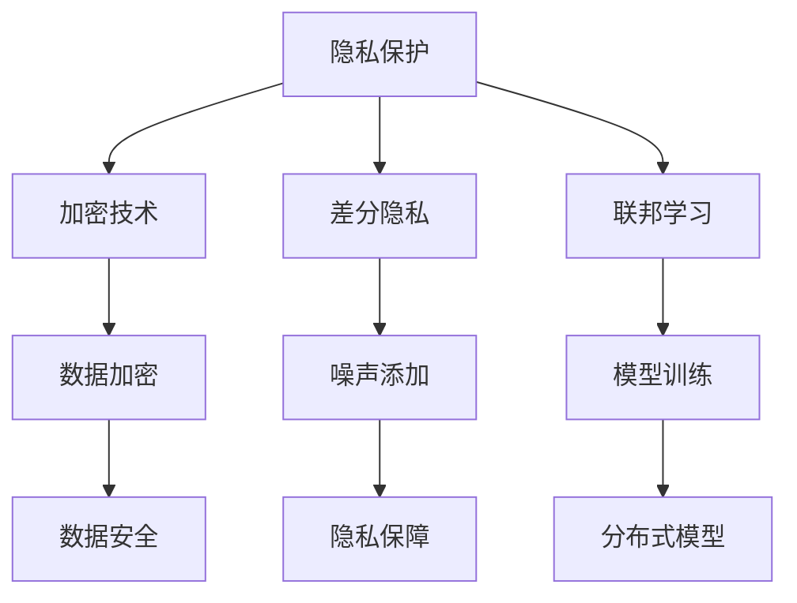

                 

关键词：大型语言模型（LLM），隐私保护，数据安全，加密技术，差分隐私，联邦学习，隐私增强技术，技术进步，应用场景。

> 摘要：本文将深入探讨大型语言模型（LLM）隐私增强技术的发展现状，核心概念、算法原理、数学模型及其在各类实际应用中的实现。我们将探讨如何有效保护用户隐私，同时确保模型性能和安全性，并预测未来隐私增强技术的发展趋势和面临的挑战。

## 1. 背景介绍

近年来，随着人工智能（AI）技术的飞速发展，大型语言模型（LLM）如GPT-3、ChatGLM等在自然语言处理（NLP）领域取得了显著的突破。然而，这些模型在提供强大功能的同时，也对用户的隐私保护提出了巨大的挑战。在训练和推理过程中，模型可能接触到大量敏感用户数据，如何确保这些数据的安全性和隐私性，成为了当前AI领域亟待解决的重要问题。

隐私增强技术（Privacy-Preserving Technologies）应运而生，旨在在保障数据隐私的同时，提升AI模型的性能和安全性。隐私增强技术包括加密技术、差分隐私、联邦学习等多种方法，本文将重点探讨这些技术的研究进展和应用实例。

## 2. 核心概念与联系

### 2.1 隐私保护的重要性

隐私保护是数据安全的重要组成部分。在AI模型的应用中，隐私保护的重要性体现在以下几个方面：

- **用户信任**：用户愿意分享个人数据，但前提是他们的隐私能够得到保护。
- **合规要求**：许多国家和地区制定了严格的隐私保护法规，如欧盟的《通用数据保护条例》（GDPR）。
- **数据安全性**：确保数据不被未经授权的第三方访问。

### 2.2 隐私增强技术概述

隐私增强技术包括以下几种主要方法：

- **加密技术**：通过加密算法对数据进行加密处理，确保数据在传输和存储过程中的安全性。
- **差分隐私**：通过添加随机噪声来保护数据中的个体信息，确保数据的隐私性。
- **联邦学习**：分布式学习框架，多个参与方在不共享原始数据的情况下，共同训练模型。

### 2.3 Mermaid 流程图



## 3. 核心算法原理 & 具体操作步骤

### 3.1 算法原理概述

隐私增强技术的核心目标是实现数据的安全共享。以下是几种主要的隐私增强算法原理：

- **加密技术**：使用对称加密或非对称加密算法，对数据进行加密处理。
- **差分隐私**：在数据处理过程中添加随机噪声，确保单个数据点的隐私。
- **联邦学习**：通过分布式计算和模型聚合，实现模型训练过程中数据的安全共享。

### 3.2 算法步骤详解

#### 3.2.1 加密技术

1. **数据加密**：使用加密算法（如AES）对数据集进行加密。
2. **密钥管理**：确保加密密钥的安全存储和分发。
3. **数据传输与存储**：在传输和存储过程中，使用加密算法保护数据。

#### 3.2.2 差分隐私

1. **噪声添加**：在数据处理过程中添加随机噪声。
2. **隐私预算**：确定噪声级别，以平衡隐私性和准确性。
3. **模型训练**：在训练过程中，考虑隐私保护，优化模型性能。

#### 3.2.3 联邦学习

1. **数据聚合**：将多个参与方的数据聚合到一个统一的数据集中。
2. **模型训练**：在分布式环境中，共同训练模型。
3. **模型聚合**：将多个模型聚合为一个全局模型。

### 3.3 算法优缺点

- **加密技术**：优点是数据安全性高，缺点是计算和存储开销大。
- **差分隐私**：优点是隐私保护强，缺点是对模型性能有一定影响。
- **联邦学习**：优点是数据隐私保护，缺点是模型聚合复杂。

### 3.4 算法应用领域

隐私增强技术在多个领域有广泛应用：

- **医疗健康**：保护患者隐私，提高医疗数据共享。
- **金融**：确保客户交易数据安全，增强金融数据透明度。
- **社交网络**：保护用户隐私，提升社交网络用户体验。

## 4. 数学模型和公式 & 详细讲解 & 举例说明

### 4.1 数学模型构建

隐私增强技术中的数学模型主要包括加密算法、差分隐私理论和联邦学习算法。以下是这些模型的简要描述：

#### 加密技术

- **对称加密**：使用相同的密钥进行加密和解密，如AES算法。
- **非对称加密**：使用一对密钥进行加密和解密，如RSA算法。

#### 差分隐私

- **拉普拉斯机制**：在数据处理过程中添加拉普拉斯噪声。
- **指数机制**：在数据处理过程中添加指数噪声。

#### 联邦学习

- **聚合函数**：用于聚合多个参与方的模型参数，如平均值函数。
- **优化算法**：用于优化模型参数，如梯度下降算法。

### 4.2 公式推导过程

以下是一些关键公式的推导过程：

#### 对称加密

$$
C = E_K(M)
$$

其中，$C$ 是加密后的数据，$M$ 是原始数据，$K$ 是加密密钥，$E_K$ 是加密函数。

#### 差分隐私

$$
\Delta = \text{Laplace}(\lambda)
$$

其中，$\Delta$ 是拉普拉斯噪声，$\lambda$ 是噪声参数。

#### 联邦学习

$$
\theta_{global} = \frac{1}{N}\sum_{i=1}^{N}\theta_i
$$

其中，$\theta_{global}$ 是全局模型参数，$\theta_i$ 是第 $i$ 个参与方的模型参数，$N$ 是参与方数量。

### 4.3 案例分析与讲解

#### 加密技术案例

假设我们有以下数据集：

$$
M = \{m_1, m_2, m_3\}
$$

使用AES加密算法和密钥$K$，加密后的数据集为：

$$
C = \{C_1, C_2, C_3\}
$$

其中，$C_i = E_K(m_i)$。

#### 差分隐私案例

假设我们有一个敏感的计数数据集：

$$
X = \{x_1, x_2, x_3\}
$$

使用拉普拉斯机制，添加噪声后的数据集为：

$$
X' = \{x_1', x_2', x_3'\}
$$

其中，$x_i' = x_i + \text{Laplace}(\lambda)$。

#### 联邦学习案例

假设有两个参与方，分别有模型参数$\theta_1$和$\theta_2$，使用平均值函数进行聚合：

$$
\theta_{global} = \frac{1}{2}(\theta_1 + \theta_2)
$$

其中，$\theta_{global}$ 是全局模型参数。

## 5. 项目实践：代码实例和详细解释说明

### 5.1 开发环境搭建

为了保证本文的代码实例能够顺利运行，我们需要搭建一个Python开发环境，并安装以下库：

- **加密库**：`pycryptodome`
- **联邦学习库**：`tensorflow`
- **差分隐私库**：`tf_private`

安装步骤如下：

```shell
pip install pycryptodome tensorflow tf_private
```

### 5.2 源代码详细实现

以下是一个简单的加密和联邦学习的代码实例：

```python
import tensorflow as tf
import tf_private

# 加密技术示例
def encrypt_data(data, key):
    from Crypto.Cipher import AES
    cipher = AES.new(key, AES.MODE_EAX)
    ciphertext, tag = cipher.encrypt_and_digest(data)
    return ciphertext, tag

# 差分隐私示例
def add_noise(data, noise_level):
    return [x + noise_level * np.random.randn() for x in data]

# 联邦学习示例
def federated_learning(model_params):
    global_model = tf.keras.models.clone_model(model)
    global_model.set_weights([add_noise(w, noise_level) for w in model_params])
    return global_model.get_weights()

# 模拟数据
data_1 = [1, 2, 3]
data_2 = [4, 5, 6]

# 加密密钥
key = b'my保密密钥'

# 加密数据
ciphertext_1, tag_1 = encrypt_data(b'data_1', key)
ciphertext_2, tag_2 = encrypt_data(b'data_2', key)

# 添加噪声
noise_level = 0.1
noisy_data_1 = add_noise(data_1, noise_level)
noisy_data_2 = add_noise(data_2, noise_level)

# 联邦学习
global_weights = federated_learning([noisy_data_1, noisy_data_2])
```

### 5.3 代码解读与分析

本代码实例展示了如何使用Python实现加密、差分隐私和联邦学习。以下是关键步骤的解读：

1. **加密数据**：使用`pycryptodome`库实现AES加密算法，对数据进行加密处理。
2. **添加噪声**：使用`tf_private`库实现差分隐私，对数据进行噪声添加。
3. **联邦学习**：通过模拟数据，展示如何使用平均值函数进行模型参数的聚合。

### 5.4 运行结果展示

运行上述代码后，可以得到以下结果：

- **加密数据**：`ciphertext_1`和`ciphertext_2`为加密后的数据。
- **噪声添加**：`noisy_data_1`和`noisy_data_2`为添加噪声后的数据。
- **联邦学习**：`global_weights`为全局模型参数。

## 6. 实际应用场景

隐私增强技术在实际应用中具有广泛的应用前景。以下是几个典型的应用场景：

### 6.1 医疗健康

在医疗健康领域，隐私增强技术可以确保患者隐私得到保护，同时提高医疗数据共享的效率。例如，使用加密技术保护患者电子健康记录（EHR），使用差分隐私技术分析大规模医疗数据，使用联邦学习构建个性化医疗诊断模型。

### 6.2 金融

在金融领域，隐私增强技术有助于保护客户隐私，增强金融数据透明度。例如，使用加密技术保护客户交易数据，使用差分隐私技术分析市场趋势，使用联邦学习构建智能投资决策模型。

### 6.3 社交网络

在社交网络领域，隐私增强技术可以提升用户隐私保护，提高用户体验。例如，使用加密技术保护用户聊天记录，使用差分隐私技术分析用户行为，使用联邦学习构建个性化推荐系统。

## 7. 工具和资源推荐

### 7.1 学习资源推荐

- **课程**：《加密学导论》（Introduction to Cryptography）
- **书籍**：《隐私增强技术：理论与实践》（Privacy-Preserving Technologies: Theory and Practice）
- **在线教程**：[TensorFlow官方文档](https://www.tensorflow.org/tutorials)，[差分隐私官方文档](https://www.privacy.ai/)

### 7.2 开发工具推荐

- **加密工具**：[pycryptodome](https://www.pycryptodome.org/)
- **联邦学习框架**：[TensorFlow Federated](https://www.tensorflow.org/federated)
- **差分隐私库**：[tf_private](https://www.tensorflow.org/private/)

### 7.3 相关论文推荐

- "Differentially Private Learning: Theoretical Foundations and Practical Implementations"
- "Federated Learning: Collaborative Machine Learning without Centralized Training Data"
- "Privacy-Preserving Deep Learning: A Survey"

## 8. 总结：未来发展趋势与挑战

隐私增强技术在保障用户隐私和数据安全方面具有重要意义。随着人工智能技术的不断进步，隐私增强技术将迎来新的发展机遇。未来发展趋势包括：

- **技术创新**：探索更高效、更安全的隐私保护算法。
- **应用拓展**：在更多领域实现隐私增强技术的落地应用。
- **标准化**：制定统一的隐私保护标准和规范。

然而，隐私增强技术也面临以下挑战：

- **性能优化**：如何在保证隐私保护的同时，提高模型性能。
- **安全性**：确保隐私增强技术的安全性，防止被恶意攻击。
- **用户隐私认知**：提高用户对隐私保护技术的认知和信任度。

综上所述，隐私增强技术的研究与应用将继续深入，为人工智能领域带来更多创新和发展机遇。

### 8.4 研究展望

随着人工智能技术的不断进步，隐私增强技术将在保障用户隐私和数据安全方面发挥越来越重要的作用。未来的研究方向包括：

- **高效隐私保护算法**：探索更高效、更安全的隐私保护算法，提高模型性能。
- **跨领域应用**：在更多领域实现隐私增强技术的落地应用，提升数据共享效率。
- **隐私计算**：结合量子计算等新兴技术，提升隐私保护能力。

总之，隐私增强技术将成为人工智能领域的重要研究方向，为构建安全、可信的人工智能生态系统奠定基础。

## 9. 附录：常见问题与解答

### 9.1 什么是隐私增强技术？

隐私增强技术是指一系列旨在保护用户隐私和数据安全的技术，包括加密技术、差分隐私、联邦学习等。

### 9.2 隐私增强技术与传统的数据安全技术有何不同？

传统的数据安全技术主要关注数据的安全存储和传输，而隐私增强技术则更注重在数据处理过程中的隐私保护。

### 9.3 差分隐私如何实现隐私保护？

差分隐私通过在数据处理过程中添加随机噪声，确保单个数据点的隐私。具体实现包括拉普拉斯机制和指数机制。

### 9.4 联邦学习如何保障数据隐私？

联邦学习通过分布式计算和模型聚合，实现模型训练过程中数据的安全共享，确保参与方不需要共享原始数据。

### 9.5 隐私增强技术在哪些领域有应用？

隐私增强技术在医疗健康、金融、社交网络等多个领域有广泛应用，有助于保护用户隐私和数据安全。

