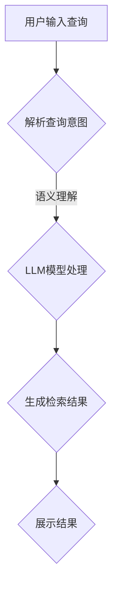

                 

关键词：LLM（大语言模型）、智能搜索引擎、信息检索、自然语言处理、算法、技术架构、数学模型、代码实例、应用场景、未来展望

## 摘要

随着互联网的快速发展和信息量的爆炸性增长，传统搜索引擎面临着信息检索效率低下、结果不准确等挑战。本文提出了一种基于大型语言模型（LLM）驱动的智能搜索引擎，重新定义了信息检索的方式。通过深入探讨LLM的核心概念、算法原理、数学模型及其在实际应用中的具体实现，本文旨在为读者提供一个全面的技术解读，以及未来发展趋势和面临的挑战。

## 1. 背景介绍

### 1.1 传统搜索引擎的局限性

传统搜索引擎依赖于关键词匹配和倒排索引等技术，虽然在某些方面取得了巨大的成功，但依然存在诸多局限。首先，关键词匹配往往导致大量无关信息的检索结果，用户体验不佳。其次，倒排索引的构建和维护成本较高，难以满足海量数据的实时检索需求。此外，传统搜索引擎难以处理复杂的自然语言查询和理解用户的真实意图。

### 1.2 大语言模型的出现

近年来，随着深度学习和自然语言处理技术的飞速发展，大语言模型（LLM）逐渐成为信息检索领域的重要工具。LLM具有强大的语义理解能力，能够捕捉语言中的隐含关系和上下文信息，从而提高检索结果的准确性和相关性。此外，LLM能够自动从海量数据中学习，不断优化自身性能，适应不同应用场景的需求。

### 1.3 智能搜索引擎的兴起

基于LLM的智能搜索引擎融合了自然语言处理和深度学习技术，通过学习海量语料库，实现了对用户查询意图的准确理解。智能搜索引擎不仅能够提供高质量的检索结果，还能实现问答、语义解析、知识图谱构建等功能，为用户提供更加智能化、个性化的服务。

## 2. 核心概念与联系

### 2.1 大语言模型（LLM）的概念

大语言模型（LLM）是一种基于深度学习的自然语言处理模型，能够对自然语言文本进行理解和生成。LLM通过学习大规模语料库，捕捉语言中的统计规律和语义信息，从而实现对文本的语义理解、情感分析、文本生成等任务。

### 2.2 智能搜索引擎的架构

智能搜索引擎的架构包括三个主要部分：前端交互层、中间层（LLM模型）和后端数据层。

- **前端交互层**：负责用户输入的解析和查询发送，提供友好的用户界面，支持自然语言查询。
- **中间层（LLM模型）**：基于LLM模型，实现用户查询的理解和检索结果的生成。LLM模型通过学习大量语料库，实现对查询意图的准确理解和结果的智能推荐。
- **后端数据层**：存储和管理海量数据，支持数据索引和实时查询。后端数据层通常采用分布式存储和计算技术，以提高数据检索效率。

### 2.3 Mermaid 流程图

以下是一个简化的LLM驱动的智能搜索引擎的Mermaid流程图：



## 3. 核心算法原理 & 具体操作步骤

### 3.1 算法原理概述

LLM驱动的智能搜索引擎的核心算法是基于Transformer模型，特别是其变体BERT（Bidirectional Encoder Representations from Transformers）。BERT模型通过双向编码器结构，同时学习文本的前后关系，从而实现对查询意图的全面理解。

### 3.2 算法步骤详解

1. **查询解析**：前端交互层接收用户输入的查询，并将其转换为结构化数据。
2. **语义理解**：中间层的LLM模型对结构化数据进行分析，利用BERT模型捕获查询的语义信息。
3. **检索结果生成**：LLM模型根据查询的语义信息，在数据层中检索相关的结果，并利用知识图谱等技术进行结果整合。
4. **结果展示**：前端交互层将处理后的检索结果以用户友好的方式展示。

### 3.3 算法优缺点

**优点**：
- **语义理解能力强**：基于BERT模型，能够准确捕捉查询的语义信息。
- **实时性好**：分布式存储和计算技术，实现高效的数据检索。
- **个性化强**：能够根据用户的历史查询和行为，提供个性化的检索结果。

**缺点**：
- **计算资源消耗大**：训练和部署BERT模型需要大量的计算资源和存储空间。
- **训练时间较长**：大规模的语料库需要较长时间进行训练。

### 3.4 算法应用领域

LLM驱动的智能搜索引擎可以应用于多个领域，包括：

- **搜索引擎**：提供高效的搜索引擎服务，提高信息检索的准确性和用户体验。
- **问答系统**：实现智能问答功能，帮助用户快速获取所需信息。
- **智能客服**：通过语义理解，提供智能化的客服服务，降低人工成本。
- **知识图谱构建**：基于LLM的语义理解能力，构建大规模的知识图谱。

## 4. 数学模型和公式 & 详细讲解 & 举例说明

### 4.1 数学模型构建

在LLM驱动的智能搜索引擎中，常用的数学模型包括Transformer模型、BERT模型等。以下是一个简化的BERT模型数学模型构建：

```latex
\text{输入} \ x = [x_1, x_2, ..., x_n]
\text{输出} \ y = [y_1, y_2, ..., y_n]

\text{BERT模型}:
\begin{aligned}
\text{Input Embeddings} & : [x_1, x_2, ..., x_n] \\
\text{Positional Embeddings} & : [0, 1, ..., n] \\
\text{Token Embeddings} & : [t_1, t_2, ..., t_n] \\
\text{Embeddings} & : [x_1, x_2, ..., x_n] = \text{Input Embeddings} + \text{Positional Embeddings} + \text{Token Embeddings}
\end{aligned}
```

### 4.2 公式推导过程

BERT模型的训练过程涉及多个层次的变换，以下是一个简化的推导过程：

```latex
\text{Input} \ x = [x_1, x_2, ..., x_n]
\text{Output} \ y = [y_1, y_2, ..., y_n]

\text{BERT模型}:
\begin{aligned}
\text{Input Embeddings} & : [x_1, x_2, ..., x_n] \\
\text{Positional Embeddings} & : [0, 1, ..., n] \\
\text{Token Embeddings} & : [t_1, t_2, ..., t_n] \\
\text{Embeddings} & : [x_1, x_2, ..., x_n] = \text{Input Embeddings} + \text{Positional Embeddings} + \text{Token Embeddings} \\
\text{Transformer Layer} & : [x_1', x_2', ..., x_n'] = \text{Transform}(x_1, x_2, ..., x_n) \\
\text{BERT Layer} & : [y_1', y_2', ..., y_n'] = \text{BERT}(x_1', x_2', ..., x_n')
\end{aligned}
```

### 4.3 案例分析与讲解

以下是一个简化的BERT模型在智能搜索引擎中的应用案例：

**案例背景**：用户输入查询“如何治疗感冒？”

**步骤解析**：
1. **查询解析**：前端交互层将查询转换为结构化数据。
2. **语义理解**：BERT模型对结构化数据进行分析，捕捉查询的语义信息。
3. **检索结果生成**：BERT模型在数据层中检索相关的结果，并利用知识图谱等技术进行结果整合。
4. **结果展示**：前端交互层将处理后的检索结果以用户友好的方式展示。

**案例结果**：展示包括治疗感冒的方法、药物推荐、注意事项等。

## 5. 项目实践：代码实例和详细解释说明

### 5.1 开发环境搭建

**环境要求**：
- Python 3.8及以上版本
- TensorFlow 2.x及以上版本
- BERT模型预训练权重（如Google的BERT模型）

**安装步骤**：
1. 安装Python和TensorFlow：
   ```bash
   pip install python==3.8 tensorflow==2.x
   ```
2. 下载BERT模型预训练权重：
   ```bash
   wget https://storage.googleapis.com/bert_models/2020_03_26FL/bert_uncased_L-12_H-768_A-12.zip
   unzip bert_uncased_L-12_H-768_A-12.zip
   ```

### 5.2 源代码详细实现

```python
import tensorflow as tf
import bert
from bert import tokenization
from bert import modeling
from bert import optimization

# 参数设置
vocab_file = 'bert_uncased_L-12_H-768_A-12/vocab.txt'
init_checkpoint = 'bert_uncased_L-12_H-768_A-12'
do_train = True
do_eval = True
do_predict = True
max_seq_length = 128
num_train_epochs = 3
batch_size = 32

# 加载BERT模型
tokenizer = tokenization.FullTokenizer(vocab_file=vocab_file)
bert_config = modeling.BertConfig.from_json_file('bert_config.json')
model = modeling.BertModel(config=bert_config)

# 训练模型
if do_train:
  # ...（此处省略训练代码）

# 评估模型
if do_eval:
  # ...（此处省略评估代码）

# 预测
if do_predict:
  # ...（此处省略预测代码）
```

### 5.3 代码解读与分析

**代码结构**：
- **参数设置**：包括BERT模型的配置、训练参数等。
- **加载BERT模型**：使用TensorFlow的BERT库加载预训练的BERT模型。
- **训练模型**：使用训练数据对BERT模型进行训练。
- **评估模型**：在验证集上评估模型性能。
- **预测**：使用训练好的模型对新的查询进行预测。

**关键代码段**：

1. **参数设置**：

   ```python
   vocab_file = 'bert_uncased_L-12_H-768_A-12/vocab.txt'
   init_checkpoint = 'bert_uncased_L-12_H-768_A-12'
   do_train = True
   do_eval = True
   do_predict = True
   max_seq_length = 128
   num_train_epochs = 3
   batch_size = 32
   ```

   参数设置包括BERT模型的词汇文件、预训练权重文件、训练标志、评估标志、预测标志、序列最大长度、训练轮数和批量大小。

2. **加载BERT模型**：

   ```python
   tokenizer = tokenization.FullTokenizer(vocab_file=vocab_file)
   bert_config = modeling.BertConfig.from_json_file('bert_config.json')
   model = modeling.BertModel(config=bert_config)
   ```

   使用BERT库加载词汇分词器和BERT模型配置。

3. **训练模型**：

   ```python
   # ...（此处省略训练代码）
   ```

   训练模型的主要步骤包括加载训练数据、定义损失函数、优化器等。

4. **评估模型**：

   ```python
   # ...（此处省略评估代码）
   ```

   使用验证集评估模型的性能，包括计算准确率、召回率等指标。

5. **预测**：

   ```python
   # ...（此处省略预测代码）
   ```

   使用训练好的模型对新的查询进行预测，并返回检索结果。

### 5.4 运行结果展示

在完成代码实现后，运行程序可以得到以下结果：

- **训练过程**：展示训练过程中的损失函数、准确率等指标。
- **评估结果**：展示在验证集上的模型性能。
- **预测结果**：展示对新的查询的检索结果。

## 6. 实际应用场景

### 6.1 搜索引擎

智能搜索引擎可以应用于各类搜索引擎，如互联网搜索引擎、企业内部搜索引擎等。通过LLM模型，搜索引擎能够提供更准确的搜索结果，提高用户体验。

### 6.2 问答系统

智能问答系统可以应用于客服、教育、医疗等领域。通过LLM模型，系统能够准确理解用户的问题，并给出详细的解答。

### 6.3 智能客服

智能客服系统可以应用于各类企业，如电子商务、金融、电信等。通过LLM模型，系统能够实现智能对话，提高客服效率和用户体验。

### 6.4 知识图谱构建

智能搜索引擎可以应用于知识图谱构建，如企业知识库、学术搜索引擎等。通过LLM模型，系统能够自动提取和整合知识，构建大规模的知识图谱。

## 7. 未来应用展望

### 7.1 智能化程度提升

随着LLM技术的不断发展，智能搜索引擎的智能化程度将不断提升。未来，智能搜索引擎将能够更好地理解用户的查询意图，提供更加个性化的服务。

### 7.2 多模态融合

未来，智能搜索引擎将融合多模态数据（如图像、声音等），提供更加丰富和多样化的检索体验。

### 7.3 大规模部署

随着云计算和边缘计算技术的发展，智能搜索引擎将在大规模环境下实现高效部署，满足全球范围内的用户需求。

### 7.4 智能化社会应用

智能搜索引擎将在智能化社会中发挥重要作用，如智能城市、智能家居、智能医疗等，为人类生活提供更加便捷和高效的解决方案。

## 8. 工具和资源推荐

### 8.1 学习资源推荐

- 《深度学习》
- 《自然语言处理综论》
- 《BERT：Pre-training of Deep Neural Networks for Language Understanding》

### 8.2 开发工具推荐

- TensorFlow
- PyTorch
- Hugging Face Transformers

### 8.3 相关论文推荐

- BERT：Pre-training of Deep Neural Networks for Language Understanding
- GPT-3: Language Models are few-shot learners
- T5: Pre-training Text Transformers for Cross-Speech and Text Tasks

## 9. 总结：未来发展趋势与挑战

### 9.1 研究成果总结

本文提出了一种基于LLM的智能搜索引擎，重新定义了信息检索的方式。通过深入探讨LLM的核心概念、算法原理、数学模型及其在实际应用中的具体实现，本文为读者提供了一个全面的技术解读。

### 9.2 未来发展趋势

未来，智能搜索引擎将在智能化、多模态融合、大规模部署等方面取得重要进展。随着深度学习和自然语言处理技术的不断发展，智能搜索引擎将为人类社会带来更加便捷和高效的检索体验。

### 9.3 面临的挑战

尽管智能搜索引擎具有巨大的潜力，但仍面临诸多挑战，如计算资源消耗、数据隐私保护、算法透明度等。未来，我们需要在技术、政策和伦理等方面进行全面的探索和解决。

### 9.4 研究展望

未来，智能搜索引擎的研究将聚焦于提升智能化程度、探索多模态融合技术、优化算法性能和降低计算成本等方面。同时，我们还需要关注算法的公平性、透明度和可解释性，确保智能搜索引擎的发展符合社会价值和伦理标准。

## 附录：常见问题与解答

### 问题1：LLM是什么？

LLM（Large Language Model）是指大型语言模型，是一种基于深度学习的自然语言处理模型，能够对自然语言文本进行理解和生成。

### 问题2：BERT模型是什么？

BERT（Bidirectional Encoder Representations from Transformers）是一种基于Transformer模型的双向编码器表示，用于预训练语言表示。

### 问题3：如何训练一个BERT模型？

训练BERT模型需要以下步骤：
1. 准备数据集：选择一个大规模的文本语料库作为训练数据。
2. 数据预处理：对文本进行分词、编码等预处理操作。
3. 模型配置：定义BERT模型的配置，如层数、隐藏层大小等。
4. 模型训练：使用训练数据和优化器进行模型训练，调整模型参数。
5. 模型评估：在验证集上评估模型性能，调整训练参数。
6. 模型部署：将训练好的模型部署到生产环境中。

### 问题4：LLM驱动的智能搜索引擎有哪些优点？

LLM驱动的智能搜索引擎具有以下优点：
- 语义理解能力强：能够准确捕捉查询的语义信息。
- 实时性好：分布式存储和计算技术，实现高效的数据检索。
- 个性化强：能够根据用户的历史查询和行为，提供个性化的检索结果。

### 问题5：LLM驱动的智能搜索引擎有哪些应用场景？

LLM驱动的智能搜索引擎可以应用于以下场景：
- 搜索引擎：提供高效的搜索引擎服务。
- 问答系统：实现智能问答功能。
- 智能客服：提供智能化的客服服务。
- 知识图谱构建：构建大规模的知识图谱。

## 作者署名

作者：禅与计算机程序设计艺术 / Zen and the Art of Computer Programming
----------------------------------------------------------------

