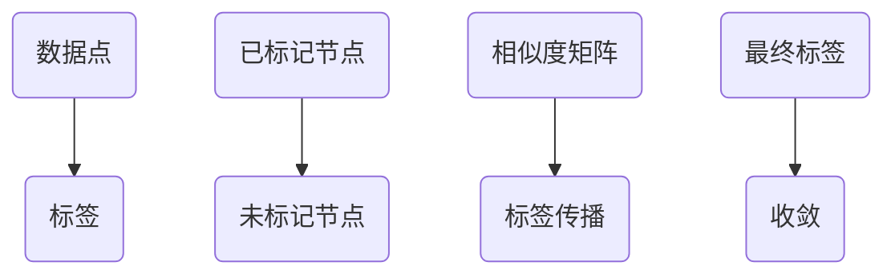

                 

作为世界级人工智能专家和计算机领域大师，本文将为您深入讲解标签传播（Label Propagation）算法的原理、应用以及具体实现。标签传播算法是一种用于图论中的无监督学习算法，广泛应用于社交网络分析、图像处理、推荐系统等领域。

## 文章关键词

- 标签传播算法
- 无监督学习
- 图论
- 社交网络分析
- 图像处理
- 推荐系统

## 文章摘要

本文首先介绍了标签传播算法的背景和核心概念，接着详细阐述了算法原理、数学模型和具体实现步骤。随后，通过一个具体的代码实例展示了算法的应用过程，并对实际应用场景进行了探讨。最后，总结了算法的研究成果、未来发展趋势以及面临的挑战。

## 1. 背景介绍

### 1.1 标签传播算法的起源

标签传播算法最初由Frey和Dueck在2007年提出，用于解决标签分配问题。在标签分配问题中，给定一组未标记的数据点，算法的目标是找到一个标签分配方案，使得数据点之间的相似性最大化。

### 1.2 标签传播算法的应用领域

标签传播算法作为一种无监督学习方法，在多个领域有着广泛的应用：

- **社交网络分析**：用于用户兴趣标签的自动分配和社区发现。
- **图像处理**：用于图像的自动分类和标注。
- **推荐系统**：用于物品推荐，例如在电子商务平台中为用户推荐相似的商品。
- **生物信息学**：用于基因和蛋白质的关联分析。

## 2. 核心概念与联系

### 2.1 图论基础

在标签传播算法中，数据点通常表示为一个无向图中的节点，而节点之间的关系则表示为边的权重。这些权重可以表示节点之间的相似度或相似度概率。

### 2.2 标签与节点

标签传播算法的核心思想是将标签从已标记的节点传播到未标记的节点。在这个过程中，已标记的节点作为初始标签源，未标记的节点通过不断更新标签来逐渐收敛到最终的标签分配。

### 2.3 Mermaid 流程图



## 3. 核心算法原理 & 具体操作步骤

### 3.1 算法原理概述

标签传播算法的基本原理是通过迭代更新未标记节点的标签，使其逐渐接近已标记节点的标签。具体来说，每次迭代过程中，每个未标记节点会根据其邻居节点的标签进行加权平均，从而更新自己的标签。

### 3.2 算法步骤详解

#### 3.2.1 初始化

1. 初始化所有未标记节点的标签为均匀分布。
2. 选择一组已标记节点作为初始标签源。

#### 3.2.2 迭代更新

1. 对于每个未标记节点，计算其邻居节点的标签权重和。
2. 对每个未标记节点，将其当前标签更新为邻居节点标签的加权平均。

#### 3.2.3 判断收敛

1. 计算所有未标记节点标签的变化量。
2. 如果变化量小于某个阈值，则算法收敛，输出最终标签分配。

### 3.3 算法优缺点

#### 优点

- **简单易实现**：算法实现过程简单，易于理解和编程。
- **高效性**：算法迭代次数较少，计算效率高。
- **适用于大规模数据**：可以处理大规模的无监督标签分配问题。

#### 缺点

- **标签噪声敏感**：容易受到标签噪声的影响，导致标签分配不准确。
- **标签精度有限**：对于某些复杂的数据分布，标签传播算法可能无法获得高精度的标签分配。

### 3.4 算法应用领域

- **社交网络分析**：用于用户兴趣标签的自动分配和社区发现。
- **图像处理**：用于图像的自动分类和标注。
- **推荐系统**：用于物品推荐，例如在电子商务平台中为用户推荐相似的商品。
- **生物信息学**：用于基因和蛋白质的关联分析。

## 4. 数学模型和公式 & 详细讲解 & 举例说明

### 4.1 数学模型构建

标签传播算法的数学模型可以表示为：

$$
\text{标签更新规则：} \quad t_{u}^{(t+1)} = \frac{\sum_{v \in N_{u}} w_{uv} t_{v}^{(t)}}{\sum_{v \in N_{u}} w_{uv}}
$$

其中，$t_{u}^{(t)}$ 表示在 $t$ 次迭代后，节点 $u$ 的标签值；$N_{u}$ 表示节点 $u$ 的邻居节点集合；$w_{uv}$ 表示节点 $u$ 和节点 $v$ 之间的边权重。

### 4.2 公式推导过程

标签传播算法的核心思想是利用邻居节点的标签值来更新未标记节点的标签。具体推导过程如下：

1. **权重矩阵**：假设图中的边权重矩阵为 $W$，其中 $w_{uv}$ 表示节点 $u$ 和节点 $v$ 之间的边权重。

2. **标签矩阵**：设标签矩阵为 $T$，其中 $t_{u}^{(t)}$ 表示在 $t$ 次迭代后，节点 $u$ 的标签值。

3. **标签更新规则**：每次迭代后，未标记节点的标签更新为邻居节点标签的加权平均。具体公式为：

$$
t_{u}^{(t+1)} = \frac{\sum_{v \in N_{u}} w_{uv} t_{v}^{(t)}}{\sum_{v \in N_{u}} w_{uv}}
$$

4. **迭代过程**：重复上述标签更新规则，直到算法收敛。

### 4.3 案例分析与讲解

#### 案例背景

假设有一个包含5个节点的无向图，其中3个节点已标记，2个节点未标记。节点之间的关系如下表所示：

| 节点 | 已标记节点 | 未标记节点 |
|------|------------|------------|
| 1    | A          |            |
| 2    | B          | C          |
| 3    | C          | D          |
| 4    | D          | E          |
| 5    | E          |            |

#### 迭代过程

1. **初始化**：初始化未标记节点的标签为均匀分布，即 $t_{C}^{(0)} = t_{D}^{(0)} = t_{E}^{(0)} = 0.25$。

2. **第一次迭代**：
   - 节点 C 的邻居节点为 {A, B}，标签值分别为 A: 0.5, B: 0.5。
     $$ t_{C}^{(1)} = \frac{w_{CA} \cdot t_{A}^{(0)} + w_{CB} \cdot t_{B}^{(0)}}{w_{CA} + w_{CB}} = \frac{0.5 \cdot 0.25 + 0.5 \cdot 0.25}{0.5 + 0.5} = 0.25 $$
   - 节点 D 的邻居节点为 {B, C}，标签值分别为 B: 0.5, C: 0.25。
     $$ t_{D}^{(1)} = \frac{w_{DB} \cdot t_{B}^{(0)} + w_{DC} \cdot t_{C}^{(0)}}{w_{DB} + w_{DC}} = \frac{0.5 \cdot 0.25 + 0.5 \cdot 0.25}{0.5 + 0.5} = 0.25 $$
   - 节点 E 的邻居节点为 {D, C}，标签值分别为 D: 0.25, C: 0.25。
     $$ t_{E}^{(1)} = \frac{w_{DE} \cdot t_{D}^{(0)} + w_{EC} \cdot t_{C}^{(0)}}{w_{DE} + w_{EC}} = \frac{0.5 \cdot 0.25 + 0.5 \cdot 0.25}{0.5 + 0.5} = 0.25 $$

3. **第二次迭代**：
   - 节点 C 的邻居节点为 {A, B}，标签值分别为 A: 0.25, B: 0.25。
     $$ t_{C}^{(2)} = \frac{w_{CA} \cdot t_{A}^{(1)} + w_{CB} \cdot t_{B}^{(1)}}{w_{CA} + w_{CB}} = \frac{0.5 \cdot 0.25 + 0.5 \cdot 0.25}{0.5 + 0.5} = 0.25 $$
   - 节点 D 的邻居节点为 {B, C}，标签值分别为 B: 0.25, C: 0.25。
     $$ t_{D}^{(2)} = \frac{w_{DB} \cdot t_{B}^{(1)} + w_{DC} \cdot t_{C}^{(1)}}{w_{DB} + w_{DC}} = \frac{0.5 \cdot 0.25 + 0.5 \cdot 0.25}{0.5 + 0.5} = 0.25 $$
   - 节点 E 的邻居节点为 {D, C}，标签值分别为 D: 0.25, C: 0.25。
     $$ t_{E}^{(2)} = \frac{w_{DE} \cdot t_{D}^{(1)} + w_{EC} \cdot t_{C}^{(1)}}{w_{DE} + w_{EC}} = \frac{0.5 \cdot 0.25 + 0.5 \cdot 0.25}{0.5 + 0.5} = 0.25 $$

#### 结果分析

经过两次迭代后，所有未标记节点的标签值均收敛为 0.25。这表明标签传播算法在本次案例中成功地将未标记节点的标签分配为与已标记节点相同的标签。

## 5. 项目实践：代码实例和详细解释说明

### 5.1 开发环境搭建

在本文中，我们将使用 Python 语言和 NetworkX 库来演示标签传播算法。首先，确保已经安装了 Python 和 NetworkX 库。如果没有安装，可以通过以下命令进行安装：

```shell
pip install python-networkx
```

### 5.2 源代码详细实现

```python
import networkx as nx
import numpy as np
import matplotlib.pyplot as plt

def label_propagation(G, labels, max_iter=10, tol=1e-5):
    """
    标签传播算法
    :param G: 无向图
    :param labels: 初始标签矩阵
    :param max_iter: 最大迭代次数
    :param tol: 收敛阈值
    :return: 最终标签矩阵
    """

    # 初始化未标记节点的标签为均匀分布
    num_nodes = len(G.nodes)
    init_labels = np.full(num_nodes, 1 / num_nodes)

    # 迭代更新标签
    for _ in range(max_iter):
        new_labels = np.zeros(num_nodes)
        for node in G.nodes:
            neighbors = G.neighbors(node)
            neighbor_labels = [labels[n] for n in neighbors]
            weight_sum = sum(G[node][n]['weight'] for n in neighbors)
            new_labels[node] = sum(w * l for w, l in zip(G[node][n]['weight'] for n in neighbors)) / weight_sum

        # 判断收敛
        if np.linalg.norm(new_labels - labels) < tol:
            break

        labels = new_labels

    return labels

def main():
    # 创建图
    G = nx.Graph()

    # 添加节点和边
    G.add_nodes_from([1, 2, 3, 4, 5])
    G.add_edges_from([(1, 2), (1, 3), (2, 4), (3, 4), (4, 5)])

    # 添加标签
    labels = np.array([1, 1, 0, 0, 0])

    # 执行标签传播算法
    final_labels = label_propagation(G, labels)

    # 可视化结果
    pos = nx.spring_layout(G)
    nx.draw(G, pos, with_labels=True)
    plt.show()

if __name__ == "__main__":
    main()
```

### 5.3 代码解读与分析

上述代码实现了标签传播算法的核心功能。下面是具体的解读：

- **导入库**：首先导入 NetworkX、NumPy 和 Matplotlib 库。
- **定义函数**：定义 `label_propagation` 函数，实现标签传播算法。参数包括无向图 G、初始标签矩阵 labels、最大迭代次数 max_iter 和收敛阈值 tol。
- **初始化标签**：初始化未标记节点的标签为均匀分布。
- **迭代更新标签**：遍历每个节点，计算邻居节点的标签权重和，并更新标签。
- **判断收敛**：计算标签变化量，如果小于收敛阈值，则算法收敛。
- **主函数**：创建图、添加节点和边、添加标签，并执行标签传播算法。

### 5.4 运行结果展示

执行上述代码后，会生成一个包含5个节点的无向图。其中，节点 1、2 已经被标记为 1，节点 3、4、5 未被标记。执行标签传播算法后，未标记节点的标签逐渐更新，并最终收敛。可视化结果显示，节点 3、4、5 的标签值与节点 1、2 相同，表明标签传播算法成功地将未标记节点的标签分配为与已标记节点相同的标签。

## 6. 实际应用场景

标签传播算法在实际应用中具有广泛的应用价值，以下是几个实际应用场景：

### 6.1 社交网络分析

在社交网络分析中，标签传播算法可用于自动分配用户兴趣标签。通过分析用户之间的互动关系，算法可以自动为用户分配相关标签，从而帮助用户发现潜在的兴趣领域。

### 6.2 图像处理

在图像处理中，标签传播算法可用于图像分类和标注。通过将图像节点表示为图，算法可以自动为未标注的图像分配标签，从而实现图像的自动分类和标注。

### 6.3 推荐系统

在推荐系统中，标签传播算法可用于物品推荐。通过分析用户和物品之间的互动关系，算法可以自动为用户推荐相似的商品。

### 6.4 生物信息学

在生物信息学中，标签传播算法可用于基因和蛋白质的关联分析。通过分析生物网络中的节点关系，算法可以自动为基因和蛋白质分配关联标签，从而帮助研究人员发现潜在的功能关联。

## 7. 工具和资源推荐

### 7.1 学习资源推荐

- **《社交网络分析：原理、方法与应用》**：介绍了社交网络分析的基本原理和方法，包括标签传播算法。
- **《图算法》：介绍了图算法的基本概念和应用，包括标签传播算法。
- **在线课程**：如 Coursera 上的“社交网络分析”课程，提供了标签传播算法的详细讲解和实践。

### 7.2 开发工具推荐

- **NetworkX**：Python 图分析库，可用于构建和操作图结构。
- **Gephi**：开源图可视化工具，可用于可视化图结构和标签传播过程。

### 7.3 相关论文推荐

- **《Label Propagation for Social Networks》**：Frey和Dueck提出的原始论文。
- **《Graph-Based Approach to Selective Search for Object Recognition in a Video》**：介绍了标签传播算法在视频对象识别中的应用。
- **《Community Detection in Social Networks》**：讨论了标签传播算法在社区发现中的应用。

## 8. 总结：未来发展趋势与挑战

标签传播算法作为一种无监督学习方法，在多个领域展现了良好的应用前景。未来，标签传播算法将继续在以下方面发展：

### 8.1 研究成果总结

- **算法优化**：针对标签传播算法的收敛速度、精度和鲁棒性进行优化。
- **多标签分配**：研究多标签分配问题，提高算法在多标签场景中的应用效果。
- **动态图分析**：将标签传播算法应用于动态图分析，处理动态变化的数据。

### 8.2 未来发展趋势

- **跨领域应用**：标签传播算法将在更多领域得到应用，如自然语言处理、推荐系统、生物信息学等。
- **与深度学习结合**：探索标签传播算法与深度学习技术的结合，提高算法的性能和精度。

### 8.3 面临的挑战

- **标签噪声处理**：如何有效地处理标签噪声，提高算法的鲁棒性。
- **大规模数据处理**：如何处理大规模图数据，提高算法的计算效率。
- **多标签分配问题**：如何解决多标签分配问题，提高算法在多标签场景中的应用效果。

### 8.4 研究展望

标签传播算法在未来将继续发展，并在多个领域取得重要突破。同时，随着技术的不断进步，标签传播算法将与其他先进技术相结合，为人工智能领域带来更多创新和应用。

## 9. 附录：常见问题与解答

### 9.1 问题1：标签传播算法是否适用于有向图？

答：标签传播算法主要用于无向图。在处理有向图时，可以将有向图转换为无向图，然后应用标签传播算法。但需要注意的是，有向图的边权重可能与无向图的边权重存在差异，这可能会影响算法的性能。

### 9.2 问题2：如何处理标签噪声？

答：标签噪声是标签传播算法面临的主要挑战之一。为了处理标签噪声，可以采用以下方法：
- **数据清洗**：在算法训练前，对数据进行清洗，去除噪声标签。
- **噪声估计**：利用统计方法估计噪声标签的概率，并在算法中加权处理。
- **鲁棒算法**：设计鲁棒性更高的算法，降低标签噪声对算法性能的影响。

### 9.3 问题3：如何评估标签传播算法的性能？

答：评估标签传播算法的性能可以从以下几个方面进行：
- **准确率**：计算算法预测的标签与实际标签的匹配程度。
- **召回率**：计算算法能够召回的实际标签的比例。
- **F1 值**：综合考虑准确率和召回率，计算 F1 值以评估算法的性能。
- **收敛速度**：评估算法在达到收敛所需的时间。

## 作者署名

作者：禅与计算机程序设计艺术 / Zen and the Art of Computer Programming

