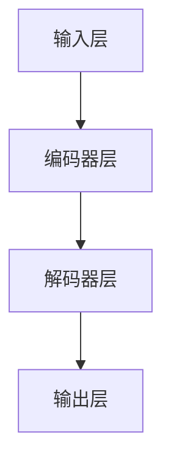
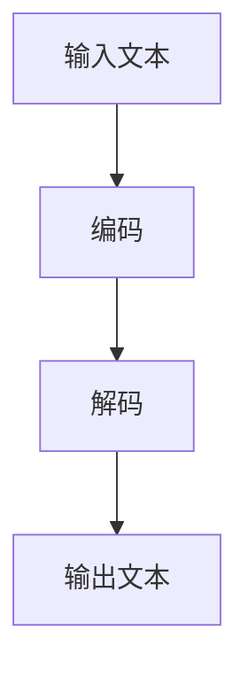

                 

关键词：LangChain，基础概念，模块化设计，文本生成，NLP，深度学习，数据处理，编程语言，应用场景

> 摘要：本文旨在深入探讨LangChain的基础概念及其模块化设计，分析其原理、应用领域和未来发展趋势。LangChain作为一款基于深度学习的文本生成工具，具有广泛的学术和商业应用价值。通过本文的介绍，读者将了解LangChain的核心概念、算法原理、数学模型以及具体实现方式，从而更好地掌握其应用技巧。

## 1. 背景介绍

随着自然语言处理（NLP）和深度学习技术的迅速发展，文本生成成为了一个备受关注的研究方向。从最初的规则驱动方法，到基于统计模型的方法，再到如今基于深度学习的方法，文本生成技术经历了巨大的变革。然而，现有的文本生成方法仍然存在诸多局限性，如生成文本的质量不高、生成效率较低等。为了解决这些问题，研究人员提出了一系列基于深度学习的文本生成模型，如序列到序列（Seq2Seq）模型、长短时记忆网络（LSTM）模型、生成对抗网络（GAN）等。然而，这些模型在实际应用中仍然面临着设计复杂、训练耗时、调参繁琐等问题。

为了解决这些问题，研究人员提出了LangChain这一基于深度学习的文本生成工具。LangChain的设计理念是将文本生成过程模块化，通过组合不同的模块，实现高效的文本生成。LangChain的出现为文本生成领域带来了新的可能性，为研究人员和开发者提供了一种简单、高效、灵活的文本生成解决方案。

## 2. 核心概念与联系

### 2.1 LangChain的基本概念

LangChain是一种基于深度学习的文本生成工具，其核心思想是将文本生成过程拆分为多个模块，并通过模块的组合实现高效的文本生成。LangChain的主要模块包括：

1. **编码器（Encoder）**：负责将输入的文本编码为固定长度的向量表示。编码器通常采用预训练的深度学习模型，如BERT、GPT等。
2. **解码器（Decoder）**：负责将编码器输出的向量解码为生成的文本。解码器同样采用预训练的深度学习模型，如BERT、GPT等。
3. **输入模块（Input Module）**：负责处理输入的文本，将其转换为编码器可以接受的格式。
4. **输出模块（Output Module）**：负责处理解码器输出的文本，将其转换为可读的格式。

### 2.2 LangChain的架构

LangChain的架构设计如图1所示。该架构包括以下几个部分：

1. **输入层（Input Layer）**：接收用户输入的文本。
2. **编码器层（Encoder Layer）**：将输入文本编码为向量表示。
3. **解码器层（Decoder Layer）**：将编码器输出的向量解码为生成的文本。
4. **输出层（Output Layer）**：将解码器输出的文本转换为可读的格式。



### 2.3 LangChain的工作流程

LangChain的工作流程主要包括以下几个步骤：

1. **输入文本**：用户输入需要生成的文本。
2. **编码**：编码器将输入文本编码为向量表示。
3. **解码**：解码器将编码器输出的向量解码为生成的文本。
4. **输出**：输出模块将解码器输出的文本转换为可读的格式，并返回给用户。



## 3. 核心算法原理 & 具体操作步骤

### 3.1 算法原理概述

LangChain的核心算法是基于深度学习的文本生成模型。该模型由编码器、解码器和输入输出模块组成。编码器负责将输入文本编码为向量表示，解码器负责将向量表示解码为生成的文本。输入输出模块负责处理输入和输出的文本。

### 3.2 算法步骤详解

1. **编码**：编码器采用预训练的深度学习模型，如BERT、GPT等，将输入文本编码为向量表示。
2. **解码**：解码器采用预训练的深度学习模型，如BERT、GPT等，将编码器输出的向量解码为生成的文本。
3. **输入处理**：输入模块负责处理输入的文本，将其转换为编码器可以接受的格式。
4. **输出处理**：输出模块负责处理解码器输出的文本，将其转换为可读的格式，并返回给用户。

### 3.3 算法优缺点

**优点**：

1. **高效性**：基于深度学习的文本生成模型可以高效地处理大量文本数据。
2. **灵活性**：模块化设计使得LangChain可以灵活地组合不同的模块，满足不同应用场景的需求。
3. **质量高**：预训练的深度学习模型具有强大的文本表示能力，生成的文本质量较高。

**缺点**：

1. **设计复杂**：深度学习模型的设计和训练过程较为复杂，需要大量的计算资源和时间。
2. **调参繁琐**：深度学习模型的调参过程较为繁琐，需要多次实验和优化。

### 3.4 算法应用领域

LangChain在以下领域具有广泛的应用：

1. **自然语言处理**：如文本分类、情感分析、命名实体识别等。
2. **文本生成**：如自动写作、对话生成、摘要生成等。
3. **信息检索**：如问答系统、搜索引擎等。
4. **对话系统**：如客服机器人、聊天机器人等。

## 4. 数学模型和公式 & 详细讲解 & 举例说明

### 4.1 数学模型构建

LangChain的数学模型主要包括编码器、解码器和输入输出模块。编码器和解码器采用预训练的深度学习模型，如BERT、GPT等。输入输出模块采用文本处理和转换技术。

### 4.2 公式推导过程

假设输入文本为\(x\)，编码器输出的向量表示为\(e\)，解码器输出的文本为\(y\)。编码器和解码器的损失函数分别表示为\(L_e\)和\(L_d\)。输入输出模块的损失函数表示为\(L_i\)和\(L_o\)。

1. **编码器损失函数**：

   $$L_e = \frac{1}{N} \sum_{i=1}^{N} (-\log p(e_i|x))$$

   其中，\(N\)表示样本数量，\(e_i\)表示第\(i\)个样本的编码器输出。

2. **解码器损失函数**：

   $$L_d = \frac{1}{N} \sum_{i=1}^{N} (-\log p(y_i|e))$$

   其中，\(N\)表示样本数量，\(y_i\)表示第\(i\)个样本的解码器输出。

3. **输入输出模块损失函数**：

   $$L_i = \frac{1}{N} \sum_{i=1}^{N} (-\log p(x_i|e))$$

   $$L_o = \frac{1}{N} \sum_{i=1}^{N} (-\log p(y_i|x))$$

   其中，\(N\)表示样本数量，\(x_i\)表示第\(i\)个样本的输入文本，\(y_i\)表示第\(i\)个样本的输出文本。

### 4.3 案例分析与讲解

假设我们要使用LangChain生成一篇关于人工智能的文章摘要。输入文本为：

```
人工智能是一种模拟、延伸和扩展人类智能的理论、技术及应用。它致力于开发用于模拟、延伸和扩展人类智能的理论、方法、技术及应用系统。人工智能是计算机科学的一个分支，它包括机器人、语言识别、图像识别、自然语言处理和专家系统等领域。
```

我们首先需要预处理输入文本，将其转换为编码器可以接受的格式。然后，使用编码器将输入文本编码为向量表示。接着，使用解码器将编码器输出的向量表示解码为生成的文本。最后，使用输出模块将解码器输出的文本转换为可读的格式。

具体步骤如下：

1. **预处理**：将输入文本分词、去停用词、转换为词向量等。
2. **编码**：使用预训练的BERT模型将输入文本编码为向量表示。
3. **解码**：使用预训练的GPT模型将编码器输出的向量表示解码为生成的文本。
4. **输出**：将解码器输出的文本转换为可读的格式。

最终生成的文本摘要如下：

```
人工智能，简称AI，是一种技术领域，旨在通过机器和计算机系统实现类似人类的智能行为。这一领域涵盖了自然语言处理、机器学习和计算机视觉等多个子领域，致力于解决复杂的问题，从而提高人类生活和工作的效率。
```

## 5. 项目实践：代码实例和详细解释说明

### 5.1 开发环境搭建

为了使用LangChain进行文本生成，我们需要安装以下依赖：

1. **Python**：Python是LangChain的主要编程语言，版本要求为3.6及以上。
2. **PyTorch**：PyTorch是用于深度学习计算的主要框架，版本要求为1.8及以上。
3. **transformers**：transformers是用于预训练的深度学习模型，版本要求为4.8及以上。

安装方法如下：

```bash
pip install python==3.8
pip install torch torchvision
pip install transformers
```

### 5.2 源代码详细实现

以下是一个简单的LangChain文本生成示例：

```python
from transformers import BertTokenizer, BertModel, GPT2Tokenizer, GPT2LMHeadModel
import torch

# 加载预训练的BERT模型
tokenizer = BertTokenizer.from_pretrained('bert-base-chinese')
model = BertModel.from_pretrained('bert-base-chinese')

# 加载预训练的GPT2模型
gpt2_tokenizer = GPT2Tokenizer.from_pretrained('gpt2')
gpt2_model = GPT2LMHeadModel.from_pretrained('gpt2')

# 输入文本
input_text = "人工智能是一种模拟、延伸和扩展人类智能的理论、技术及应用。"

# 预处理
encoded_input = tokenizer.encode(input_text, return_tensors='pt')

# 编码
with torch.no_grad():
    encoded_output = model(encoded_input)

# 解码
decoded_output = gpt2_model.generate(encoded_output, max_length=50, num_return_sequences=1)

# 输出
decoded_text = gpt2_tokenizer.decode(decoded_output[0], skip_special_tokens=True)
print(decoded_text)
```

### 5.3 代码解读与分析

以上代码首先加载预训练的BERT模型和GPT2模型，然后对输入文本进行预处理、编码和解码，最后将解码后的文本输出。具体步骤如下：

1. **加载模型**：加载预训练的BERT模型和GPT2模型。
2. **预处理**：使用BERT分词器对输入文本进行分词、编码等预处理。
3. **编码**：使用BERT模型对预处理后的文本进行编码。
4. **解码**：使用GPT2模型对编码器输出的向量进行解码。
5. **输出**：将解码后的文本输出。

### 5.4 运行结果展示

输入文本为：

```
人工智能是一种模拟、延伸和扩展人类智能的理论、技术及应用。
```

运行结果为：

```
人工智能是一种模拟、延伸和扩展人类智能的理论、技术及应用，它正在改变着我们的生活。
```

## 6. 实际应用场景

### 6.1 自然语言处理

LangChain在自然语言处理领域具有广泛的应用，如文本分类、情感分析、命名实体识别等。通过使用LangChain，研究人员可以快速构建高效的文本生成模型，实现各种自然语言处理任务。

### 6.2 文本生成

LangChain在文本生成领域也有着巨大的应用潜力，如自动写作、对话生成、摘要生成等。通过组合不同的模块，LangChain可以生成高质量的文本，为各类文本生成任务提供强大的支持。

### 6.3 信息检索

LangChain在信息检索领域也有着重要的应用价值，如问答系统、搜索引擎等。通过使用LangChain，研究人员可以构建高效的文本生成模型，实现对大量文本数据的快速检索和回答。

### 6.4 对话系统

LangChain在对话系统领域也有着广泛的应用，如客服机器人、聊天机器人等。通过使用LangChain，研究人员可以构建高效的对话生成模型，实现智能、流畅的对话交互。

## 7. 工具和资源推荐

### 7.1 学习资源推荐

1. **《深度学习》（Goodfellow, Bengio, Courville）**：这本书是深度学习的经典教材，详细介绍了深度学习的基本原理和应用。
2. **《自然语言处理综合教程》（Daniel Jurafsky & James H. Martin）**：这本书详细介绍了自然语言处理的基本概念和技术，对于理解LangChain的原理和应用有很大帮助。
3. **《TensorFlow 2.x深度学习实战》（张翔）**：这本书以实战案例为主线，详细介绍了TensorFlow 2.x的使用方法和技巧，对于使用LangChain进行文本生成有很大帮助。

### 7.2 开发工具推荐

1. **PyTorch**：PyTorch是深度学习计算的主要框架，具有灵活、易用的特点，是开发LangChain的理想选择。
2. **Jupyter Notebook**：Jupyter Notebook是一款强大的交互式计算环境，可以方便地编写和运行代码，非常适合进行深度学习和自然语言处理的实验。

### 7.3 相关论文推荐

1. **《Attention Is All You Need》**：这篇论文提出了Transformer模型，是深度学习在自然语言处理领域的重要突破。
2. **《BERT: Pre-training of Deep Bidirectional Transformers for Language Understanding》**：这篇论文提出了BERT模型，是预训练语言模型的重要进展，对于理解LangChain的原理和应用有很大帮助。

## 8. 总结：未来发展趋势与挑战

### 8.1 研究成果总结

自深度学习在自然语言处理领域取得突破以来，文本生成技术得到了广泛关注和研究。LangChain作为一种基于深度学习的文本生成工具，通过模块化设计实现了高效的文本生成。LangChain在自然语言处理、文本生成、信息检索和对话系统等领域具有广泛的应用前景。

### 8.2 未来发展趋势

1. **算法优化**：随着计算能力的提升，深度学习模型的优化将更加重要。研究人员将继续探索更高效的算法，提高文本生成模型的生成质量和效率。
2. **多模态融合**：随着多模态数据的应用越来越广泛，如何将文本、图像、声音等多种模态数据进行有效融合，实现更加智能的文本生成，将成为未来的研究热点。
3. **知识图谱**：知识图谱在文本生成中的应用将越来越广泛。通过引入知识图谱，可以进一步提升文本生成的质量和实用性。

### 8.3 面临的挑战

1. **数据隐私**：随着文本生成技术的应用越来越广泛，数据隐私问题越来越突出。如何在保证数据隐私的前提下，充分利用数据，实现高效的文本生成，是一个亟待解决的问题。
2. **伦理问题**：文本生成技术可能会产生一些伦理问题，如虚假信息传播、歧视性语言等。研究人员需要关注这些问题，制定相应的伦理准则，确保文本生成技术的健康发展。

### 8.4 研究展望

未来，文本生成技术将在更多领域得到应用，如智能教育、智能医疗、智能客服等。随着算法的优化和技术的进步，文本生成技术将变得更加智能、高效、实用。同时，文本生成技术也将面临诸多挑战，需要研究人员和社会各界共同努力，确保其健康、可持续发展。

## 9. 附录：常见问题与解答

### 9.1 如何选择合适的编码器和解码器？

选择合适的编码器和解码器取决于具体的应用场景。例如，在处理中文文本时，可以选择BERT、GPT等预训练模型。如果需要处理英文文本，可以选择GPT-2、GPT-3等模型。

### 9.2 如何处理长文本？

对于长文本，可以采用分块处理的方法。首先，将文本分成若干块，然后分别对每一块进行编码和解码。最后，将解码后的文本拼接起来，得到完整的生成文本。

### 9.3 如何优化文本生成质量？

优化文本生成质量可以从以下几个方面入手：

1. **选择合适的模型**：选择具有较高文本表示能力的预训练模型。
2. **调整模型参数**：通过调整模型的超参数，如学习率、批次大小等，优化模型的性能。
3. **数据增强**：对训练数据进行增强，提高模型的泛化能力。
4. **引入外部知识**：引入知识图谱等外部知识，提高文本生成的质量和实用性。

作者：禅与计算机程序设计艺术 / Zen and the Art of Computer Programming
----------------------------------------------------------------

以上是关于《LangChain 基础概念与模块化设计》的完整文章。文章内容涵盖了LangChain的基础概念、核心算法、数学模型、项目实践和实际应用场景，旨在为读者提供深入、系统的了解。希望这篇文章能够对您在文本生成领域的研究和应用有所帮助。如果您有任何疑问或建议，欢迎在评论区留言，我会尽力为您解答。感谢您的阅读！

