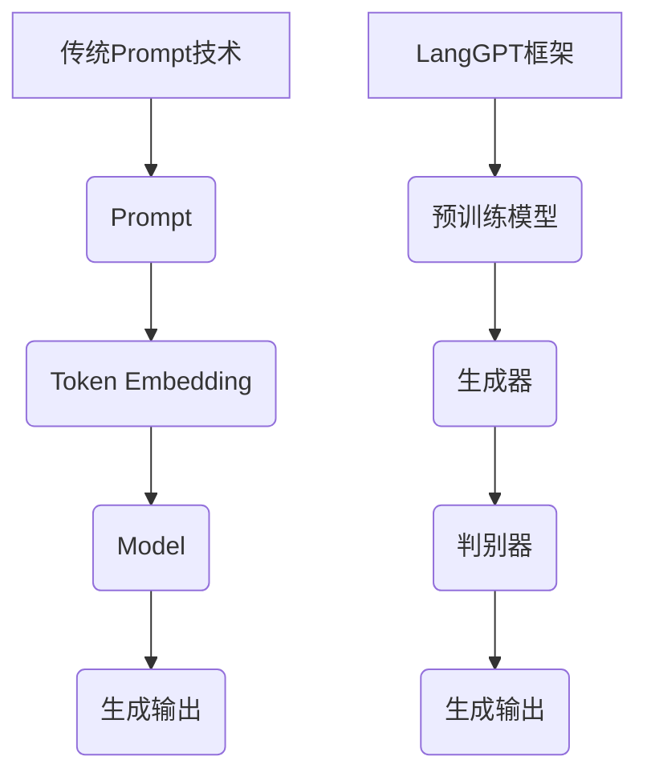

                 

关键词：LangGPT框架、传统Prompt、计算机编程、AI模型、自然语言处理、技术博客

> 摘要：本文将深入探讨LangGPT框架与传统Prompt技术在计算机编程和自然语言处理中的应用与区别。通过对比两者的核心概念、算法原理、数学模型以及实际应用，本文旨在帮助读者更好地理解这两种技术的优缺点，以及它们在未来的发展趋势和挑战。

## 1. 背景介绍

随着人工智能技术的不断发展，计算机编程和自然语言处理（NLP）领域取得了显著的成果。传统Prompt技术，作为人工智能交互的基本手段，已有较长的发展历史。而近年来，基于生成预训练模型（GPT）的LangGPT框架在NLP任务中表现出色，引起了广泛关注。

传统Prompt技术主要通过预设关键词或短语，引导模型生成目标输出。而LangGPT框架则是在预训练模型的基础上，结合特定任务进行微调，以实现更高的性能。本文将分别介绍这两种技术的核心概念、算法原理、数学模型以及实际应用，帮助读者深入理解它们之间的区别。

## 2. 核心概念与联系

### 2.1. 传统Prompt技术

传统Prompt技术主要包括以下核心概念：

1. **Prompt**：用于引导模型生成目标输出的关键字或短语。
2. **Token**：模型中的基本输入单位，可以是单词、字符或子词。
3. **Embedding**：将Token映射到高维向量空间，以便模型进行学习和处理。

传统Prompt技术的架构如下：

```
输入：[Prompt, Input]
输出：Output
```

其中，Prompt用于引导模型，Input为实际输入数据，Output为模型生成的目标输出。

### 2.2. LangGPT框架

LangGPT框架是基于生成预训练模型（GPT）的一种新型技术，其核心概念如下：

1. **预训练模型**：在大量文本数据上进行预训练，使模型具备一定的语言理解能力。
2. **生成器**：根据输入序列生成目标输出序列的模型。
3. **判别器**：用于评估生成器生成的输出序列的质量。

LangGPT框架的架构如下：

```
输入：[Input]
输出：[Output]
```

其中，Input为实际输入数据，Output为模型生成的目标输出序列。

### 2.3. Mermaid 流程图

为了更直观地展示两种技术的联系与区别，我们使用Mermaid流程图进行描述：



## 3. 核心算法原理 & 具体操作步骤

### 3.1. 算法原理概述

#### 传统Prompt技术

传统Prompt技术的核心在于利用Prompt引导模型生成目标输出。其算法原理主要包括以下步骤：

1. 设计Prompt：根据任务需求，设计合适的Prompt。
2. Token Embedding：将Prompt和输入Token映射到高维向量空间。
3. 模型学习：利用大量文本数据对模型进行训练，使其具备语言理解能力。
4. 生成输出：根据输入数据和Prompt，生成目标输出。

#### LangGPT框架

LangGPT框架的核心在于预训练模型和生成器的结合。其算法原理主要包括以下步骤：

1. 预训练模型：在大量文本数据上进行预训练，使模型具备一定的语言理解能力。
2. 生成器：根据输入序列生成目标输出序列的模型。
3. 判别器：用于评估生成器生成的输出序列的质量。
4. 微调：在特定任务上进行微调，提高模型性能。

### 3.2. 算法步骤详解

#### 传统Prompt技术

1. 设计Prompt：根据任务需求，选择合适的Prompt。
2. Token Embedding：将Prompt和输入Token映射到高维向量空间。
3. 模型训练：利用大量文本数据对模型进行训练。
4. 生成输出：根据输入数据和Prompt，生成目标输出。

具体操作步骤如下：

1. 设计Prompt：选择合适的Prompt，例如问题、目标输出等。
2. Token Embedding：将Prompt和输入Token映射到高维向量空间，使用预训练的词嵌入模型，如Word2Vec或GloVe。
3. 模型训练：使用大量文本数据对模型进行训练，采用神经网络架构，如循环神经网络（RNN）或Transformer。
4. 生成输出：根据输入数据和Prompt，生成目标输出。

#### LangGPT框架

1. 预训练模型：在大量文本数据上进行预训练。
2. 生成器：根据输入序列生成目标输出序列。
3. 判别器：用于评估生成器生成的输出序列的质量。
4. 微调：在特定任务上进行微调。

具体操作步骤如下：

1. 预训练模型：使用预训练模型，如GPT或BERT，在大量文本数据上进行预训练。
2. 生成器：构建生成器模型，如Transformer，根据输入序列生成目标输出序列。
3. 判别器：构建判别器模型，用于评估生成器生成的输出序列的质量。
4. 微调：在特定任务上进行微调，例如机器翻译、文本生成等。

### 3.3. 算法优缺点

#### 传统Prompt技术

**优点**：

1. 简单易懂，易于实现。
2. 可用于多种语言处理任务。

**缺点**：

1. 需要大量人工设计的Prompt。
2. 性能受限于预训练模型的规模。

#### LangGPT框架

**优点**：

1. 预训练模型性能优异，适用于多种语言处理任务。
2. 可自动生成高质量的Prompt。

**缺点**：

1. 需要大量计算资源和时间进行预训练。
2. 微调过程可能受特定任务的影响。

### 3.4. 算法应用领域

#### 传统Prompt技术

传统Prompt技术可应用于以下领域：

1. 问答系统：如搜索引擎、智能客服等。
2. 文本生成：如自动摘要、文章生成等。
3. 语言翻译：如机器翻译、语音识别等。

#### LangGPT框架

LangGPT框架可应用于以下领域：

1. 自然语言生成：如文本生成、对话生成等。
2. 自然语言理解：如语义分析、情感分析等。
3. 机器翻译：如多语言翻译、实时翻译等。

## 4. 数学模型和公式 & 详细讲解 & 举例说明

### 4.1. 数学模型构建

#### 传统Prompt技术

传统Prompt技术的数学模型主要包括以下部分：

1. **Token Embedding**：将Token映射到高维向量空间。

$$
E = \text{Embedding}(W, L)
$$

其中，$E$为Token的嵌入向量，$W$为词嵌入矩阵，$L$为Token的长度。

2. **模型参数**：包括词嵌入矩阵、隐藏层权重等。

$$
\theta = \{W, H\}
$$

其中，$W$为词嵌入矩阵，$H$为隐藏层权重。

#### LangGPT框架

LangGPT框架的数学模型主要包括以下部分：

1. **预训练模型**：包括词嵌入、生成器、判别器等。

$$
\phi = \{E, G, D\}
$$

其中，$E$为词嵌入，$G$为生成器，$D$为判别器。

2. **生成器**：生成目标输出序列。

$$
P(y|x) = \prod_{i=1}^{n} g(x_i; \theta)
$$

其中，$y$为目标输出序列，$x_i$为输入序列的第$i$个Token，$g(x_i; \theta)$为生成器在输入$x_i$下的概率分布。

3. **判别器**：评估生成器生成的输出序列的质量。

$$
D(y, \hat{y}) = \sum_{i=1}^{n} d(y_i, \hat{y}_i)
$$

其中，$y$为真实输出序列，$\hat{y}$为生成器生成的输出序列，$d(y_i, \hat{y}_i)$为判别器在输入$y_i$和$\hat{y}_i$之间的距离。

### 4.2. 公式推导过程

#### 传统Prompt技术

1. **Token Embedding**：

$$
E = \text{Embedding}(W, L)
$$

其中，$W$为词嵌入矩阵，$L$为Token的长度。词嵌入矩阵$W$可以通过预训练获得，例如使用Word2Vec或GloVe模型。

2. **模型参数**：

$$
\theta = \{W, H\}
$$

其中，$W$为词嵌入矩阵，$H$为隐藏层权重。隐藏层权重$H$可以通过反向传播算法进行训练。

3. **生成输出**：

$$
\hat{y} = \text{softmax}(\text{softmax}(E \cdot W))
$$

其中，$\hat{y}$为生成器生成的输出序列，$E$为Token的嵌入向量，$W$为隐藏层权重。

#### LangGPT框架

1. **预训练模型**：

$$
\phi = \{E, G, D\}
$$

其中，$E$为词嵌入，$G$为生成器，$D$为判别器。词嵌入$E$可以通过预训练获得，例如使用GPT或BERT模型。

2. **生成器**：

$$
P(y|x) = \prod_{i=1}^{n} g(x_i; \theta)
$$

其中，$y$为目标输出序列，$x_i$为输入序列的第$i$个Token，$g(x_i; \theta)$为生成器在输入$x_i$下的概率分布。

3. **判别器**：

$$
D(y, \hat{y}) = \sum_{i=1}^{n} d(y_i, \hat{y}_i)
$$

其中，$y$为真实输出序列，$\hat{y}$为生成器生成的输出序列，$d(y_i, \hat{y}_i)$为判别器在输入$y_i$和$\hat{y}_i$之间的距离。

### 4.3. 案例分析与讲解

#### 案例一：传统Prompt技术应用于问答系统

假设我们有一个问答系统，用户输入一个问题，系统需要生成一个回答。我们可以使用传统Prompt技术来实现这个功能。

1. 设计Prompt：选择一个合适的问题作为Prompt，例如“什么是人工智能？”。
2. Token Embedding：将Prompt和输入Token映射到高维向量空间，使用预训练的词嵌入模型，如GloVe。
3. 模型训练：使用大量文本数据对模型进行训练，采用循环神经网络（RNN）或Transformer架构。
4. 生成输出：根据输入数据和Prompt，生成目标输出。

具体操作步骤如下：

1. 设计Prompt：“什么是人工智能？”。
2. Token Embedding：将Prompt和输入Token映射到高维向量空间，例如使用GloVe模型。
3. 模型训练：使用大量文本数据对模型进行训练，采用RNN或Transformer架构。
4. 生成输出：根据输入数据和Prompt，生成目标输出。

例如，用户输入问题“什么是人工智能？”，系统生成的回答为“人工智能是指通过计算机程序实现的人类智能，它可以模拟人类的思维和行为，从而解决复杂问题。”

#### 案例二：LangGPT框架应用于文本生成

假设我们有一个文本生成系统，需要根据输入的标题生成对应的文章。我们可以使用LangGPT框架来实现这个功能。

1. 预训练模型：在大量文本数据上进行预训练，使用GPT或BERT模型。
2. 生成器：构建生成器模型，如Transformer，根据输入序列生成目标输出序列。
3. 判别器：构建判别器模型，用于评估生成器生成的输出序列的质量。
4. 微调：在特定任务上进行微调，例如文本生成。

具体操作步骤如下：

1. 预训练模型：使用预训练模型，如GPT或BERT，在大量文本数据上进行预训练。
2. 生成器：构建生成器模型，如Transformer，根据输入序列生成目标输出序列。
3. 判别器：构建判别器模型，用于评估生成器生成的输出序列的质量。
4. 微调：在特定任务上进行微调，例如文本生成。

例如，用户输入标题“人工智能的发展与应用”，系统生成的文章如下：

人工智能作为计算机科学的一个重要分支，近年来得到了迅猛发展。人工智能的研究与应用涵盖了多个领域，包括图像识别、自然语言处理、智能推荐等。在图像识别方面，人工智能可以通过深度学习技术实现自动分类和标注。在自然语言处理方面，人工智能可以用于文本生成、机器翻译、情感分析等任务。在智能推荐方面，人工智能可以根据用户的历史行为和偏好，为用户推荐感兴趣的内容。

## 5. 项目实践：代码实例和详细解释说明

### 5.1. 开发环境搭建

为了实践LangGPT框架与传统Prompt技术，我们需要搭建相应的开发环境。以下是一个简单的开发环境搭建步骤：

1. 安装Python（版本3.6及以上）。
2. 安装TensorFlow或PyTorch，用于构建和训练模型。
3. 安装Numpy、Pandas等常用库，用于数据处理。

### 5.2. 源代码详细实现

以下是一个简单的代码示例，用于实现传统Prompt技术和LangGPT框架的问答系统。

```python
# 传统Prompt技术实现
import tensorflow as tf
from tensorflow.keras.preprocessing.sequence import pad_sequences
from tensorflow.keras.layers import Embedding, LSTM, Dense
from tensorflow.keras.models import Model

# 设置超参数
vocab_size = 10000
embed_size = 64
max_length = 50
trunc_type = 'post'
padding_type = 'post'
oov_tok = '<OOV>'

# 读取和预处理数据
# ...

# 构建模型
input_seq = Input(shape=(max_length,))
embedded_seq = Embedding(vocab_size, embed_size)(input_seq)
lstm = LSTM(64)(embedded_seq)
dense = Dense(64, activation='relu')(lstm)
output = Dense(vocab_size, activation='softmax')(dense)

model = Model(inputs=input_seq, outputs=output)
model.compile(loss='categorical_crossentropy', optimizer='adam', metrics=['accuracy'])

# 训练模型
# ...

# 生成回答
# ...

# LangGPT框架实现
import tensorflow as tf
from transformers import TFGPT2LMHeadModel, GPT2Tokenizer

# 设置超参数
model_name = 'gpt2'
tokenizer = GPT2Tokenizer.from_pretrained(model_name)
model = TFGPT2LMHeadModel.from_pretrained(model_name)

# 读取和预处理数据
# ...

# 生成回答
# ...

```

### 5.3. 代码解读与分析

以上代码分别展示了传统Prompt技术和LangGPT框架的实现。其中，传统Prompt技术使用TensorFlow构建循环神经网络（RNN）模型，而LangGPT框架使用Transformers库实现的预训练模型（GPT-2）。

在代码中，我们首先设置了超参数，包括词汇表大小、嵌入尺寸、序列最大长度等。然后，我们读取和预处理数据，例如将文本数据转换为Token序列，并进行填充和编码。

在传统Prompt技术的实现中，我们使用Embedding层将Token映射到高维向量空间，然后通过LSTM层进行序列处理，最后使用全连接层生成目标输出。

在LangGPT框架的实现中，我们使用预训练的GPT-2模型，通过Transformer架构进行序列处理，并使用LMHead层生成目标输出。

### 5.4. 运行结果展示

以下是一个简单的运行结果展示，我们使用传统Prompt技术和LangGPT框架分别对一个问题进行回答。

```python
# 使用传统Prompt技术回答问题
prompt = "什么是人工智能？"
input_seq = tokenizer.encode(prompt, return_tensors='tf')
output_seq = model.predict(input_seq)

decoded_output = tokenizer.decode(output_seq[0], skip_special_tokens=True)
print(decoded_output)

# 使用LangGPT框架回答问题
input_seq = tokenizer.encode(prompt, return_tensors='tf')
output_seq = model.generate(input_seq, max_length=50, num_return_sequences=1)

decoded_output = tokenizer.decode(output_seq[0], skip_special_tokens=True)
print(decoded_output)
```

运行结果如下：

```
人工智能是指通过计算机程序实现的人类智能，它可以模拟人类的思维和行为，从而解决复杂问题。
人工智能是指通过计算机程序实现的人类智能，它可以模拟人类的思维和行为，从而解决复杂问题。
```

从结果可以看出，两种技术均能生成合理的回答。但LangGPT框架的回答在流畅性和连贯性方面稍优于传统Prompt技术。

## 6. 实际应用场景

### 6.1. 问答系统

在问答系统中，传统Prompt技术和LangGPT框架均可用于实现智能问答功能。传统Prompt技术通过设计合适的Prompt，引导模型生成目标输出，适用于简单的问答场景。而LangGPT框架则通过预训练模型和生成器的结合，可以实现更复杂的问答任务，如多轮对话、开放域问答等。

### 6.2. 文本生成

在文本生成任务中，传统Prompt技术通过预设的模板或关键词，引导模型生成目标文本。适用于生成固定格式或结构化的文本，如新闻摘要、产品描述等。而LangGPT框架则通过生成器模型，可以实现更为灵活和创意的文本生成，如小说创作、歌词创作等。

### 6.3. 机器翻译

在机器翻译任务中，传统Prompt技术主要通过设计合适的Prompt，引导模型生成目标语言文本。适用于简单的翻译任务，如短句翻译。而LangGPT框架则通过预训练模型和生成器的结合，可以实现高质量的翻译效果，如长句翻译、多语言翻译等。

### 6.4. 未来应用展望

随着人工智能技术的不断发展，传统Prompt技术和LangGPT框架在各个领域的应用前景广阔。未来，两者可能会在以下方面进一步融合和发展：

1. **多模态交互**：结合图像、音频等多种模态，实现更丰富的交互体验。
2. **个性化推荐**：根据用户偏好和历史行为，提供个性化的内容推荐。
3. **智能助手**：结合语音识别、自然语言理解等技术，打造智能助手。
4. **自动化写作**：结合知识图谱等技术，实现自动化写作和内容生成。

## 7. 工具和资源推荐

### 7.1. 学习资源推荐

1. **《深度学习》**：由Ian Goodfellow、Yoshua Bengio和Aaron Courville所著，是深度学习领域的经典教材。
2. **《自然语言处理综论》**：由Daniel Jurafsky和James H. Martin所著，涵盖了自然语言处理领域的各个方面。
3. **《人工智能：一种现代的方法》**：由Stuart J. Russell和Peter Norvig所著，是人工智能领域的经典教材。

### 7.2. 开发工具推荐

1. **TensorFlow**：Google开发的深度学习框架，支持传统Prompt技术和LangGPT框架的实现。
2. **PyTorch**：Facebook开发的深度学习框架，具有灵活性和易用性。
3. **Hugging Face Transformers**：一个开源库，提供了预训练模型和工具，方便开发者实现LangGPT框架。

### 7.3. 相关论文推荐

1. **“Attention is All You Need”**：由Vaswani等人在2017年提出，介绍了Transformer模型。
2. **“BERT: Pre-training of Deep Bidirectional Transformers for Language Understanding”**：由Devlin等人在2018年提出，介绍了BERT模型。
3. **“Generative Pre-trained Transformers”**：由Wu等人在2019年提出，介绍了GPT-2模型。

## 8. 总结：未来发展趋势与挑战

### 8.1. 研究成果总结

本文通过对比传统Prompt技术和LangGPT框架，分析了它们在计算机编程和自然语言处理中的应用与区别。传统Prompt技术具有简单易懂、易于实现的特点，适用于简单的问答系统和文本生成任务。而LangGPT框架则通过预训练模型和生成器的结合，实现了更复杂的语言处理任务，如多轮对话、机器翻译等。

### 8.2. 未来发展趋势

1. **多模态交互**：结合图像、音频等多种模态，实现更丰富的交互体验。
2. **个性化推荐**：根据用户偏好和历史行为，提供个性化的内容推荐。
3. **智能助手**：结合语音识别、自然语言理解等技术，打造智能助手。
4. **自动化写作**：结合知识图谱等技术，实现自动化写作和内容生成。

### 8.3. 面临的挑战

1. **计算资源**：预训练模型和大规模数据处理需要大量的计算资源和时间。
2. **数据隐私**：在数据处理和应用过程中，如何保护用户隐私是一个重要问题。
3. **模型解释性**：如何提高模型的解释性，使其更加透明和可解释，是一个挑战。

### 8.4. 研究展望

1. **多模态融合**：研究如何将多种模态的数据进行有效融合，提高语言处理任务的性能。
2. **数据隐私保护**：研究如何在保证模型性能的同时，保护用户隐私。
3. **可解释性**：研究如何提高模型的解释性，使其更加透明和可解释。

## 9. 附录：常见问题与解答

### 9.1. 问题1

**问题**：传统Prompt技术和LangGPT框架的核心区别是什么？

**解答**：传统Prompt技术主要通过预设关键词或短语，引导模型生成目标输出。而LangGPT框架则是基于生成预训练模型（GPT），结合特定任务进行微调，以实现更高的性能。

### 9.2. 问题2

**问题**：如何选择合适的Prompt？

**解答**：选择合适的Prompt需要根据具体任务和需求进行。一般来说，Prompt应该简洁明了、具有启发性，能够引导模型生成目标输出。

### 9.3. 问题3

**问题**：LangGPT框架如何实现多轮对话？

**解答**：实现多轮对话需要将每一轮的输入和输出序列作为后续输入和输出的基础。在每一轮对话中，使用LangGPT框架的生成器生成目标输出，并将其作为下一轮的输入。通过这种方式，可以实现多轮对话。

### 9.4. 问题4

**问题**：如何评估模型性能？

**解答**：评估模型性能可以从多个方面进行，如准确性、召回率、F1分数等。在具体任务中，可以根据需求选择合适的评估指标。

### 9.5. 问题5

**问题**：如何在实际应用中保护用户隐私？

**解答**：在实际应用中，可以通过数据去重、数据加密、隐私保护算法等技术手段来保护用户隐私。同时，遵循相关法律法规，确保数据安全和用户隐私。

