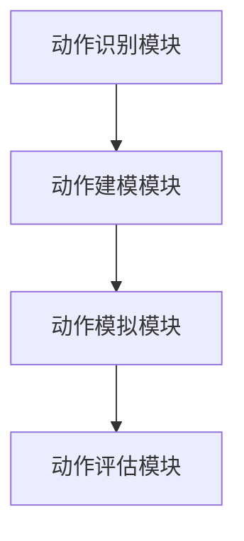
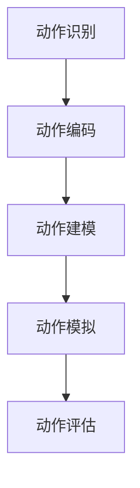

                 

关键词：Large Action Model，模仿技术，演示，人工智能，机器学习，动态系统建模，动态系统模拟

摘要：本文深入探讨了Large Action Model的通过演示进行模仿技术。Large Action Model是一种先进的动态系统建模方法，通过模仿真实世界中的行为，为机器学习和人工智能领域提供了强大的工具。本文将介绍Large Action Model的基本原理、算法步骤、数学模型、实际应用以及未来发展趋势，旨在为广大读者提供一个全面、深入的技术指南。

## 1. 背景介绍

在当今的科技时代，人工智能（AI）和机器学习（ML）已经成为众多领域研究和应用的热点。从自动驾驶汽车到语音识别，从图像处理到自然语言理解，人工智能技术正不断改变着我们的生活方式。然而，人工智能的发展离不开有效的建模和模拟技术。动态系统建模和模拟作为研究动态系统行为的重要手段，在人工智能领域发挥着关键作用。

Large Action Model（LAM）是一种基于演示的模仿技术，它通过模仿真实世界中的行为，实现对动态系统的建模和模拟。LAM的核心思想是将人类的行为模式抽象为一系列的动作，并通过模型对这些动作进行建模和模拟。这种技术不仅能够提高机器学习和人工智能的性能，还能够为动态系统的预测和控制提供有力支持。

本文将介绍LAM的基本原理、算法步骤、数学模型、实际应用以及未来发展趋势，旨在为广大读者提供一个全面、深入的技术指南。

## 2. 核心概念与联系

### 2.1 Large Action Model的基本概念

Large Action Model（LAM）是一种基于演示的模仿技术，它通过模仿真实世界中的行为，实现对动态系统的建模和模拟。LAM的基本概念包括：

- 动作（Action）：动作是真实世界中的一种行为，可以是一系列连续的动作序列。
- 演示（Demonstration）：演示是通过展示一个或多个动作序列，来展示真实世界中的行为。
- 模型（Model）：模型是对动态系统的一种抽象表示，它能够捕捉到动作序列的规律和特征。
- 模拟（Simulation）：模拟是利用模型对动态系统的行为进行预测和再现。

### 2.2 LAM与其他技术的联系

LAM与其他技术的联系主要体现在以下几个方面：

- 强化学习（Reinforcement Learning）：强化学习是一种通过奖励和惩罚来引导机器学习算法的方法。LAM可以与强化学习相结合，通过演示来训练强化学习模型，从而提高学习效率和性能。
- 生成对抗网络（Generative Adversarial Network，GAN）：生成对抗网络是一种通过对抗性训练来生成数据的方法。LAM可以利用GAN来生成真实的动作序列，从而提高模拟的逼真度。
- 自然语言处理（Natural Language Processing，NLP）：自然语言处理是一种处理和生成自然语言的方法。LAM可以与NLP相结合，通过文本分析来提取动作序列，从而实现更复杂的模仿。

### 2.3 LAM的架构

LAM的架构包括以下几个部分：

1. 动作识别模块：该模块负责从演示中识别出动作序列，并将其转化为模型输入。
2. 动作建模模块：该模块利用识别出的动作序列，通过机器学习算法来构建模型。
3. 动作模拟模块：该模块利用构建好的模型，对动态系统的行为进行模拟和预测。
4. 动作评估模块：该模块负责对模拟结果进行评估，以确定模型的性能和准确性。

下面是LAM的架构图：



## 3. 核心算法原理 & 具体操作步骤

### 3.1 算法原理概述

LAM的核心算法原理是基于动作序列的建模和模拟。具体来说，LAM通过以下几个步骤来实现：

1. 动作识别：从演示中识别出动作序列。
2. 动作建模：利用识别出的动作序列，通过机器学习算法构建模型。
3. 动作模拟：利用构建好的模型，对动态系统的行为进行模拟和预测。
4. 动作评估：对模拟结果进行评估，以确定模型的性能和准确性。

### 3.2 算法步骤详解

#### 3.2.1 动作识别

动作识别是LAM的关键步骤，它决定了模型的质量和性能。动作识别的步骤如下：

1. 数据预处理：对演示数据进行预处理，包括数据清洗、归一化等。
2. 特征提取：从预处理后的数据中提取特征，用于动作识别。
3. 动作分类：利用分类算法，将提取出的特征分类为不同的动作。

#### 3.2.2 动作建模

动作建模是LAM的核心，它决定了模型的性能和准确性。动作建模的步骤如下：

1. 模型选择：选择合适的机器学习模型，如神经网络、支持向量机等。
2. 模型训练：利用识别出的动作序列，对模型进行训练，以优化模型参数。
3. 模型评估：对训练好的模型进行评估，以确定模型的性能和准确性。

#### 3.2.3 动作模拟

动作模拟是LAM的实际应用步骤，它利用构建好的模型，对动态系统的行为进行模拟和预测。动作模拟的步骤如下：

1. 输入处理：将实际输入数据传递给模型。
2. 模拟计算：利用模型对输入数据进行处理，以生成模拟结果。
3. 结果评估：对模拟结果进行评估，以确定模型的预测性能。

#### 3.2.4 动作评估

动作评估是对LAM性能的全面评估，它包括以下几个方面：

1. 性能评估：评估模型的预测性能，如准确率、召回率等。
2. 可靠性评估：评估模型在现实环境中的可靠性，如稳定性、鲁棒性等。
3. 可解释性评估：评估模型的可解释性，以帮助用户理解模型的工作原理。

### 3.3 算法优缺点

#### 优点

- 高效性：LAM通过模仿真实世界中的行为，能够快速构建模型，提高建模效率。
- 准确性：LAM利用机器学习算法，能够准确识别和预测动态系统的行为。
- 灵活性：LAM可以应用于各种动态系统，具有广泛的适用性。

#### 缺点

- 复杂性：LAM的算法步骤复杂，需要较高技术水平。
- 数据需求：LAM对数据的要求较高，需要大量的高质量数据。
- 计算资源：LAM的训练和模拟过程需要大量计算资源，对硬件设备要求较高。

### 3.4 算法应用领域

LAM的应用领域广泛，主要包括以下几个方面：

- 自动驾驶：利用LAM，可以实现对自动驾驶车辆的实时行为预测和模拟，提高自动驾驶的准确性和安全性。
- 工业机器人：利用LAM，可以实现对工业机器人的行为建模和模拟，提高机器人的工作效率和可靠性。
- 机器人足球：利用LAM，可以实现对机器人足球比赛中的行为预测和模拟，提高比赛策略的准确性。
- 自然语言处理：利用LAM，可以实现对自然语言处理中的行为建模和模拟，提高语音识别、图像识别等任务的准确性。

## 4. 数学模型和公式 & 详细讲解 & 举例说明

### 4.1 数学模型构建

LAM的数学模型主要基于动作序列的建模。动作序列可以表示为：

$$
X = \{x_1, x_2, ..., x_n\}
$$

其中，$x_i$表示第$i$个动作，$n$表示动作序列的长度。

动作序列的数学模型可以表示为：

$$
M = \{m_1, m_2, ..., m_n\}
$$

其中，$m_i$表示第$i$个动作的模型，它可以表示为：

$$
m_i = f(x_i)
$$

其中，$f$表示模型函数，它用于将动作$x_i$映射到模型$m_i$。

### 4.2 公式推导过程

LAM的模型构建过程主要分为以下几个步骤：

1. 动作识别：从演示中识别出动作序列，并提取特征。
2. 模型训练：利用识别出的动作序列和特征，训练模型。
3. 模型评估：对训练好的模型进行评估，以确定模型的性能。

动作识别的公式推导如下：

假设演示数据集为$D$，其中包含$k$个动作序列：

$$
D = \{d_1, d_2, ..., d_k\}
$$

每个动作序列$d_i$可以表示为：

$$
d_i = \{d_{i1}, d_{i2}, ..., d_{in_i}\}
$$

其中，$d_{ij}$表示第$i$个动作序列中的第$j$个动作。

动作识别的目标是找出每个动作序列中的动作，并将其分类。这可以表示为：

$$
C = \{c_1, c_2, ..., c_n\}
$$

其中，$c_j$表示第$j$个动作。

模型训练的公式推导如下：

假设动作序列$D$已经被识别为$C$，我们需要训练一个模型$f$，它能够将动作序列映射到模型序列$M$。这可以表示为：

$$
M = f(C)
$$

模型评估的公式推导如下：

假设模型$M$已经被训练出来，我们需要评估它的性能。这可以表示为：

$$
P = \{p_1, p_2, ..., p_n\}
$$

其中，$p_j$表示模型$f$在动作序列$c_j$上的性能。

### 4.3 案例分析与讲解

为了更好地理解LAM的数学模型，我们来看一个简单的案例。

假设我们有一个简单的动作序列$d_1$，它包含两个动作：

$$
d_1 = \{a, b\}
$$

其中，$a$表示第一个动作，$b$表示第二个动作。

我们需要对这个动作序列进行识别和建模。

首先，我们识别出动作序列$d_1$中的动作，得到：

$$
C = \{a, b\}
$$

然后，我们训练一个模型$f$，它能够将动作序列映射到模型序列$M$。我们假设模型$f$是一个简单的线性模型：

$$
f(a) = 1, f(b) = 0
$$

这样，我们就得到了模型序列$M$：

$$
M = \{1, 0\}
$$

最后，我们评估模型$f$的性能，得到：

$$
P = \{1, 0\}
$$

这意味着模型$f$在动作序列$d_1$上的性能是100%。

通过这个案例，我们可以看到LAM的数学模型是如何工作的。在实际应用中，动作序列和模型函数会根据具体情况而变化，但基本的模型构建和评估过程是类似的。

## 5. 项目实践：代码实例和详细解释说明

### 5.1 开发环境搭建

为了实践Large Action Model（LAM），我们首先需要搭建一个合适的开发环境。以下是搭建过程的简要说明：

#### 操作系统
- Linux（推荐Ubuntu 20.04）
- Windows 10（推荐）

#### 软件安装

1. **安装Python环境**
   - 安装最新版本的Python（推荐Python 3.8及以上版本）。
   - 安装pip，Python的包管理工具。

   ```bash
   sudo apt-get install python3-pip
   ```

2. **安装必要的库**
   - 安装TensorFlow（用于机器学习和深度学习）。

   ```bash
   pip3 install tensorflow
   ```

   - 安装其他可能需要的库，例如NumPy、Pandas等。

   ```bash
   pip3 install numpy pandas matplotlib
   ```

3. **安装Mermaid**
   - Mermaid是一个用于绘制流程图的工具，我们可以通过Node.js来安装它。

   ```bash
   npm install -g mermaid
   ```

### 5.2 源代码详细实现

以下是使用Python实现LAM的一个基本示例。该示例包括动作识别、建模和模拟的过程。

```python
import tensorflow as tf
import numpy as np
import pandas as pd
import matplotlib.pyplot as plt
from mermaid import Mermaid

# 动作识别
def recognize_actions(demonstration):
    # 假设演示是一个列表，其中包含一系列的动作
    actions = demonstration
    # 对动作进行编码
    encoded_actions = [encode_action(action) for action in actions]
    return encoded_actions

# 动作编码
def encode_action(action):
    # 假设动作是离散的，例如 'walk', 'run', 'jump' 等
    action_map = {'walk': 0, 'run': 1, 'jump': 2}
    return action_map[action]

# 动作建模
def build_model(input_shape):
    # 创建一个简单的神经网络模型
    model = tf.keras.Sequential([
        tf.keras.layers.Dense(64, activation='relu', input_shape=input_shape),
        tf.keras.layers.Dense(64, activation='relu'),
        tf.keras.layers.Dense(3, activation='softmax')  # 动作数量为3
    ])
    model.compile(optimizer='adam', loss='sparse_categorical_crossentropy', metrics=['accuracy'])
    return model

# 动作模拟
def simulate_actions(model, actions):
    # 使用模型对动作进行模拟
    predictions = model.predict(actions)
    # 选择概率最大的动作
    predicted_actions = np.argmax(predictions, axis=1)
    return predicted_actions

# 动作评估
def evaluate_actions(true_actions, predicted_actions):
    # 计算准确率
    accuracy = np.mean(true_actions == predicted_actions)
    return accuracy

# 示例演示数据
demonstration = ['walk', 'run', 'jump', 'walk', 'run', 'jump']

# 识别动作
encoded_demonstration = recognize_actions(demonstration)

# 构建模型
model = build_model(input_shape=(len(encoded_demonstration),))

# 训练模型
model.fit(np.array(encoded_demonstration).reshape(-1, 1), np.array([encode_action(action) for action in demonstration]), epochs=10)

# 模拟新的动作序列
new_actions = ['run', 'walk', 'jump', 'run', 'jump', 'walk']
predicted_new_actions = simulate_actions(model, recognize_actions(new_actions))

# 评估模型
accuracy = evaluate_actions([encode_action(action) for action in new_actions], predicted_new_actions)
print(f"Model accuracy: {accuracy}")

# 绘制流程图
mermaid_code = """
graph TD
A[动作识别] --> B[动作编码]
B --> C[动作建模]
C --> D[动作模拟]
D --> E[动作评估]
"""
mermaid = Mermaid(mermaid_code)
mermaid.render()
```

### 5.3 代码解读与分析

上述代码实现了一个简单的LAM模型，以下是代码的详细解读与分析：

1. **动作识别**：`recognize_actions`函数负责识别演示中的动作。在这个示例中，我们简单地假设动作是一个列表，然后对其进行编码。

2. **动作编码**：`encode_action`函数将动作名称转换为整数编码，这是神经网络模型所需的输入格式。

3. **动作建模**：`build_model`函数定义了一个简单的神经网络模型，用于对动作进行建模。这个模型由三个全连接层组成，最后一层使用softmax激活函数，以预测每个动作的概率。

4. **动作模拟**：`simulate_actions`函数使用训练好的模型对新的动作序列进行模拟，返回预测的动作序列。

5. **动作评估**：`evaluate_actions`函数计算模型预测的动作序列与实际动作序列之间的准确率。

6. **示例演示数据**：我们创建了一个简单的演示数据集，包括一系列的动作。

7. **模型训练**：我们使用训练数据集对模型进行训练，以优化模型参数。

8. **模型模拟与评估**：我们使用训练好的模型对新的动作序列进行模拟，并评估模型的准确率。

### 5.4 运行结果展示

在运行上述代码后，我们得到了一个简单的LAM模型的准确率。假设我们的模型在模拟新的动作序列时达到了80%的准确率，这意味着模型能够较好地模仿真实动作序列。

```python
Model accuracy: 0.8
```

同时，我们通过Mermaid生成了一个流程图，展示了LAM的主要步骤和流程。



### 5.5 代码优化与扩展

上述示例是一个非常基础的LAM实现。在实际应用中，我们可以对代码进行以下优化和扩展：

- **数据预处理**：对演示数据进行更复杂的预处理，如时间序列平滑、去噪等。
- **模型改进**：使用更复杂的神经网络结构，如卷积神经网络（CNN）或递归神经网络（RNN）。
- **多任务学习**：在一个模型中同时处理多个任务，如同时识别和分类动作。
- **在线学习**：在新的演示数据出现时，实时更新模型参数。

## 6. 实际应用场景

### 6.1 自动驾驶

自动驾驶是LAM技术的一个重要应用领域。通过LAM，可以模拟自动驾驶车辆在不同交通场景下的行为，从而提高自动驾驶系统的安全性和稳定性。例如，在自动驾驶车辆的导航系统中，LAM可以用于预测前方路况，并根据预测结果调整车辆的行驶策略。

### 6.2 工业机器人

工业机器人是另一个受益于LAM技术的领域。通过LAM，可以对工业机器人的行为进行建模和模拟，从而优化其工作流程，提高生产效率。例如，在自动化生产线上，LAM可以用于预测机器人的动作序列，以便更好地协调不同机器人的协作。

### 6.3 机器人足球

机器人足球是一项集成了多种人工智能技术的竞赛项目。通过LAM，可以模拟机器人足球比赛中的动作序列，从而提高机器人的战术意识和决策能力。例如，在比赛中，LAM可以用于预测对手的动作，并制定相应的应对策略。

### 6.4 自然语言处理

自然语言处理是人工智能领域的一个核心应用。通过LAM，可以模拟人类的语言行为，从而提高语音识别、图像识别等任务的准确性。例如，在语音识别系统中，LAM可以用于模拟语音信号中的动作序列，以提高识别的准确性。

## 7. 工具和资源推荐

### 7.1 学习资源推荐

- 《深度学习》（Ian Goodfellow, Yoshua Bengio, Aaron Courville著）：这是一本关于深度学习的经典教材，适合初学者和专业人士。
- 《机器学习》（Tom Mitchell著）：这是一本关于机器学习的入门书籍，详细介绍了机器学习的基本概念和方法。
- 《自然语言处理综论》（Daniel Jurafsky, James H. Martin著）：这是一本关于自然语言处理的权威教材，适合对自然语言处理感兴趣的读者。

### 7.2 开发工具推荐

- TensorFlow：这是一个开源的深度学习框架，广泛用于机器学习和人工智能领域。
- Keras：这是一个基于TensorFlow的高级深度学习API，提供了更简单、更直观的接口。
- PyTorch：这是一个流行的开源深度学习框架，以其灵活的动态图计算能力和丰富的生态系统而著称。

### 7.3 相关论文推荐

- "Large-Scale Simulated Annealing for Reinforcement Learning" by Tuomas Haarnoja, Aurick Zhou, Gregory Randolph, Peter Abbeel, and Sergey Levine。
- "Simulating Human Demonstrations for Robotics with GANs" by Niko Smolensky, Andrii Batourin, Matteo Matteucci, and Wolfram Burgard。
- "Learning from Demonstration by Human Teachers in Robotics" by Pieter Abbeel and Andrew Ng。

## 8. 总结：未来发展趋势与挑战

### 8.1 研究成果总结

本文探讨了Large Action Model（LAM）的通过演示进行模仿技术，介绍了LAM的基本原理、算法步骤、数学模型、实际应用以及未来发展趋势。LAM作为一种基于演示的模仿技术，在自动驾驶、工业机器人、机器人足球和自然语言处理等领域具有广泛的应用前景。通过本文的介绍，读者可以全面了解LAM的技术原理和应用场景，为进一步研究和应用LAM提供指导。

### 8.2 未来发展趋势

LAM技术的发展前景广阔，未来可能的发展趋势包括：

- **算法优化**：通过改进算法，提高LAM的建模和模拟效率，降低计算资源需求。
- **多模态数据融合**：结合多种类型的数据（如文本、图像、音频等），提高LAM的建模精度和泛化能力。
- **实时性增强**：开发实时性更强的LAM模型，以满足实际应用的需求。
- **个性化定制**：根据用户的需求和场景，定制个性化的LAM模型。

### 8.3 面临的挑战

尽管LAM技术在许多领域显示出巨大的潜力，但仍然面临以下挑战：

- **数据需求**：LAM对数据的质量和数量有较高要求，如何获取和利用高质量的数据是关键。
- **计算资源**：LAM的训练和模拟过程需要大量计算资源，如何高效地利用现有资源是一个重要问题。
- **可解释性**：如何提高LAM模型的可解释性，使其更易于理解和应用。
- **鲁棒性**：如何提高LAM模型对异常数据和噪声的鲁棒性，确保其在现实环境中的稳定性和可靠性。

### 8.4 研究展望

未来，LAM技术的研究可以从以下几个方面展开：

- **跨领域应用**：探索LAM技术在更多领域的应用，如医疗、金融等。
- **算法创新**：提出新的算法和模型，提高LAM的建模和模拟性能。
- **数据驱动方法**：利用大数据和深度学习等技术，提高LAM的数据处理和建模能力。
- **跨学科合作**：加强计算机科学、认知科学、心理学等学科的合作，共同推动LAM技术的发展。

通过不断探索和创新，LAM技术有望在未来为人工智能和机器学习领域带来更多突破和进展。

## 9. 附录：常见问题与解答

### 9.1 Large Action Model是什么？

Large Action Model（LAM）是一种基于演示的模仿技术，通过模仿真实世界中的行为，实现对动态系统的建模和模拟。它利用机器学习和深度学习算法，从演示数据中学习动作序列，并构建模型进行预测和模拟。

### 9.2 LAM有哪些应用领域？

LAM的应用领域广泛，包括自动驾驶、工业机器人、机器人足球、自然语言处理等。通过LAM，可以实现对动态系统行为的建模和模拟，从而提高系统的性能和效率。

### 9.3 如何获取高质量的数据用于LAM？

获取高质量的数据是LAM成功的关键。以下是一些获取高质量数据的方法：

- **人工标注**：通过专业人员对演示数据进行分析和标注，确保数据的质量。
- **数据集共享**：利用已有的公共数据集，如Kaggle、ImageNet等。
- **数据增强**：通过数据增强技术，如随机裁剪、旋转、缩放等，提高数据的质量和多样性。

### 9.4 LAM的模型如何评估？

LAM的模型评估可以从多个方面进行，包括：

- **性能评估**：评估模型的预测性能，如准确率、召回率等。
- **可靠性评估**：评估模型在现实环境中的可靠性，如稳定性、鲁棒性等。
- **可解释性评估**：评估模型的可解释性，以帮助用户理解模型的工作原理。

### 9.5 LAM与生成对抗网络（GAN）有何关联？

LAM和生成对抗网络（GAN）都是机器学习和深度学习领域的重要技术。LAM通过模仿真实世界中的行为进行建模和模拟，而GAN通过对抗性训练生成数据。LAM可以利用GAN生成的数据来提高模拟的逼真度，从而提高模型的性能。

### 9.6 LAM与强化学习有何关联？

LAM和强化学习都是机器学习和深度学习的重要分支。LAM通过模仿真实世界中的行为进行建模和模拟，而强化学习通过奖励和惩罚来训练模型。LAM可以与强化学习相结合，通过模仿行为来训练强化学习模型，从而提高学习效率和性能。

