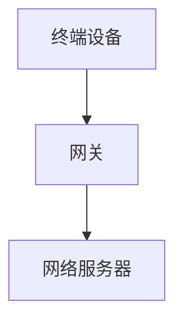

                 

关键词：LoRaWAN、物联网（IoT）、低功耗广域网络、无线通信、传感器网络、设备管理、数据传输、通信协议、网络架构

> 摘要：LoRaWAN作为一种新兴的低功耗广域网络技术，在物联网（IoT）领域展现出了巨大的应用潜力。本文将从背景介绍、核心概念、算法原理、数学模型、项目实践和实际应用等多个方面，详细探讨LoRaWAN在物联网中的应用及其发展前景。

## 1. 背景介绍

### 物联网（IoT）的发展

物联网（Internet of Things，简称IoT）是指将各种设备通过网络连接起来，实现信息的交换和共享。随着物联网技术的不断发展，越来越多的设备和系统开始通过网络进行连接，从而形成了一个庞大的物联网生态系统。根据市场研究机构的预测，到2025年，全球物联网设备的连接数将达到数百亿级别。

### 低功耗广域网络（LPWAN）的需求

在物联网中，许多设备需要长时间运行，并且可能处于远程或难以接入传统网络的环境中。这就需要一种能够支持长距离、低功耗通信的网络技术。低功耗广域网络（LPWAN）应运而生，它能够实现低功耗、低速率、长距离的通信，非常适合物联网应用场景。

### LoRaWAN的诞生

LoRaWAN（Long Range Wide Area Network）是一种基于LoRa（Long Range）技术的LPWAN通信协议。它是由LoRa联盟（LoRa Alliance）制定的，旨在为物联网提供一种低功耗、长距离、高覆盖的通信解决方案。LoRaWAN具有以下特点：

- **低功耗**：LoRaWAN采用了先进的调制和解调技术，使得设备能够在低功耗的情况下实现长距离通信。
- **长距离**：LoRaWAN的传输距离可以达到数公里，甚至更远，适用于广阔的物联网应用场景。
- **高覆盖**：LoRaWAN采用了多跳中继技术，能够实现大范围的覆盖，提高网络的可靠性。

## 2. 核心概念与联系

### LoRaWAN网络架构

LoRaWAN网络架构包括终端设备、网关和网络服务器三个主要部分。下面是一个简单的Mermaid流程图，用于展示LoRaWAN的网络架构：



### 核心概念

- **终端设备**：LoRaWAN的终端设备负责数据采集和发送，它通过LoRa模块实现无线通信。
- **网关**：网关是连接终端设备和网络服务器的桥梁，它接收来自终端设备的数据，并通过有线或无线网络传输到网络服务器。
- **网络服务器**：网络服务器负责数据处理、存储和转发，它能够对来自终端设备的数据进行分析和处理。

### 通信协议

LoRaWAN采用了一种叫做“双向通信”的通信协议。在双向通信中，终端设备可以发送数据到网关，也可以接收来自网关的指令。这种通信方式可以提高网络的效率和可靠性。

## 3. 核心算法原理 & 具体操作步骤

### 3.1 算法原理概述

LoRaWAN的核心算法包括以下几个部分：

- **多跳传输**：终端设备无法直接与网络服务器通信，需要通过网关进行多跳传输。
- **帧结构**：LoRaWAN的数据帧结构包括同步头、地址段、负载段和校验段。
- **加密**：LoRaWAN采用了AES-128加密算法，确保数据传输的安全性。

### 3.2 算法步骤详解

- **终端设备发送数据**：终端设备首先发送一个同步头，用于网关同步接收数据。然后发送地址段和负载段，最后添加校验段。
- **网关接收数据**：网关接收终端设备发送的数据，并根据地址段确定数据的目的地。如果目的地是网关本身，则直接处理数据；如果目的地是网络服务器，则通过有线或无线网络传输到网络服务器。
- **网络服务器处理数据**：网络服务器接收网关传输的数据，进行解密、数据处理和存储。

### 3.3 算法优缺点

- **优点**：LoRaWAN具有低功耗、长距离、高覆盖等特点，非常适合物联网应用。
- **缺点**：LoRaWAN的带宽较低，不适合高速数据传输。

### 3.4 算法应用领域

LoRaWAN可以应用于许多物联网领域，包括但不限于：

- **智能城市**：用于环境监测、交通管理、公共安全等。
- **智能农业**：用于土壤监测、水质监测、作物生长监测等。
- **智能工业**：用于设备状态监测、能源管理、生产线监控等。

## 4. 数学模型和公式 & 详细讲解 & 举例说明

### 4.1 数学模型构建

LoRaWAN的传输距离可以通过以下公式计算：

$$
d = \sqrt{\frac{E_{TX}}{2\pi G_{RX} B_{RX}}}
$$

其中，$d$ 是传输距离（单位：米），$E_{TX}$ 是发射功率（单位：dBm），$G_{RX}$ 是接收天线增益（单位：dBi），$B_{RX}$ 是接收带宽（单位：MHz）。

### 4.2 公式推导过程

LoRaWAN的传输距离可以通过以下步骤推导：

1. 发射功率 $E_{TX}$ 转换为功率密度 $P_{density}$：

$$
P_{density} = \frac{E_{TX}}{4\pi d^2}
$$

2. 接收功率 $P_{RX}$ 计算为：

$$
P_{RX} = P_{density} G_{RX} A_{RX}
$$

其中，$A_{RX}$ 是接收天线面积（单位：m²）。

3. 接收信号功率 $S_{RX}$ 为：

$$
S_{RX} = P_{RX} - G_{RX} \cdot L_{RX}
$$

其中，$L_{RX}$ 是接收机噪声系数（单位：dB）。

4. 传输距离 $d$ 计算为：

$$
d = \sqrt{\frac{E_{TX}}{2\pi G_{RX} B_{RX}}}
$$

### 4.3 案例分析与讲解

假设一个LoRaWAN网络的发射功率为20 dBm，接收天线增益为8 dBi，接收带宽为1 MHz。根据上述公式，可以计算出传输距离大约为：

$$
d = \sqrt{\frac{20}{2\pi \times 8 \times 1}} \approx 1.96 \text{公里}
$$

## 5. 项目实践：代码实例和详细解释说明

### 5.1 开发环境搭建

为了实践LoRaWAN，我们需要搭建一个开发环境。以下是一个简单的步骤：

1. 安装Python环境。
2. 安装LoRaWAN库，可以使用以下命令：

```bash
pip install pythlonarawan
```

3. 准备LoRaWAN网关和终端设备。

### 5.2 源代码详细实现

以下是一个简单的LoRaWAN终端设备发送数据的示例代码：

```python
from pythlonarawan import LoRaWAN

# 初始化LoRaWAN终端设备
lora = LoRaWAN()

# 配置终端设备的密钥和地址
lora.set_keys(app_eui='11111111', app_key='22222222', dev_eui='33333333', nwk_s_key='44444444')

# 设置数据发送间隔
lora.set_frame_interval(60)

# 发送数据
lora.send_data(b'Hello, LoRaWAN!')

# 关闭LoRaWAN终端设备
lora.close()
```

### 5.3 代码解读与分析

上述代码首先导入了LoRaWAN库，并初始化了一个LoRaWAN终端设备。然后，配置了终端设备的密钥和地址，并设置了数据发送间隔。最后，使用`send_data`方法发送了一段文本数据。

### 5.4 运行结果展示

在运行上述代码后，LoRaWAN终端设备会通过网关将数据发送到网络服务器。在服务器端，我们可以接收到来自终端设备的数据。

## 6. 实际应用场景

### 6.1 智能农业

在智能农业中，LoRaWAN可以用于监测土壤湿度、温度、光照等环境参数，从而帮助农民更好地管理农作物。

### 6.2 智能城市

在智能城市中，LoRaWAN可以用于环境监测、交通管理、公共安全等领域，提高城市的智能化水平。

### 6.3 智能工业

在智能工业中，LoRaWAN可以用于设备状态监测、能源管理、生产线监控等，提高生产效率和安全性。

## 7. 未来应用展望

### 7.1 物联网设备的连接数量持续增长

随着物联网技术的不断进步，越来越多的设备将接入物联网，LoRaWAN作为一种低功耗、长距离、高覆盖的网络技术，将在未来得到更广泛的应用。

### 7.2 技术性能的提升

未来，LoRaWAN的技术性能将不断提升，包括传输速度、传输距离、数据加密等，以满足更复杂的物联网应用需求。

### 7.3 跨行业应用

LoRaWAN不仅将在传统的物联网领域得到应用，还将在更多跨行业领域得到探索，如智能家居、智能医疗、智能交通等。

## 8. 工具和资源推荐

### 8.1 学习资源推荐

- 《LoRaWAN：从入门到精通》
- 《物联网通信技术》
- 《无线传感器网络：理论、算法与应用》

### 8.2 开发工具推荐

- Pythlonarawan：Python LoRaWAN库
- LoRaWAN Gateway：LoRaWAN网关开发工具

### 8.3 相关论文推荐

- "LoRaWAN: The Next Generation LPWAN Protocol"
- "Energy-Efficient Data Collection in Wireless Sensor Networks with LoRaWAN"
- "LoRaWAN for IoT: A Comprehensive Survey"

## 9. 总结：未来发展趋势与挑战

### 9.1 研究成果总结

本文对LoRaWAN在物联网中的应用进行了详细探讨，包括其网络架构、核心算法、数学模型、项目实践和实际应用场景。通过分析，我们得出LoRaWAN在物联网领域具有广泛的应用前景。

### 9.2 未来发展趋势

随着物联网技术的不断发展，LoRaWAN将在更多的领域得到应用，其技术性能也将不断提升。

### 9.3 面临的挑战

LoRaWAN在物联网应用中也面临一些挑战，如数据安全、网络覆盖、设备能耗等。需要通过技术创新和优化来克服这些挑战。

### 9.4 研究展望

未来，LoRaWAN的研究将主要集中在提高网络性能、拓展应用领域和加强数据安全等方面。

## 附录：常见问题与解答

### 问题1：什么是LoRaWAN？

LoRaWAN是一种低功耗广域网络（LPWAN）通信协议，用于物联网（IoT）设备之间的无线通信。它具有低功耗、长距离、高覆盖等特点。

### 问题2：LoRaWAN的网络架构是怎样的？

LoRaWAN的网络架构包括终端设备、网关和网络服务器三个部分。终端设备负责数据采集和发送，网关负责数据传输，网络服务器负责数据处理和存储。

### 问题3：LoRaWAN的核心算法是什么？

LoRaWAN的核心算法包括多跳传输、帧结构和加密等技术。它通过多跳传输实现长距离通信，采用帧结构提高数据传输的可靠性，通过加密确保数据传输的安全性。

### 问题4：LoRaWAN可以应用于哪些领域？

LoRaWAN可以应用于智能农业、智能城市、智能工业等多个领域，用于设备状态监测、环境监测、数据传输等。

### 问题5：如何搭建LoRaWAN开发环境？

搭建LoRaWAN开发环境需要安装Python环境和LoRaWAN库，并准备LoRaWAN网关和终端设备。

---

作者：禅与计算机程序设计艺术 / Zen and the Art of Computer Programming

