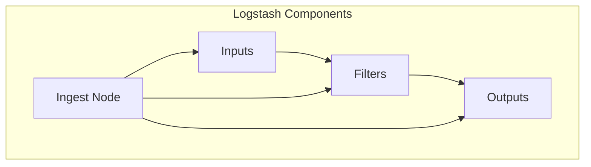

                 

关键词：数据采集，数据处理，Elastic Stack，事件处理，日志管理

> 摘要：本文将深入探讨Logstash的核心原理，并通过具体代码实例，详细解释其在数据采集、处理和输出中的实际应用。Logstash是Elastic Stack中的重要组件，负责将数据从各种源集中收集，处理，并将其转换为适合Elasticsearch和Kibana存储和展示的格式。本文旨在为开发者提供一个全面的技术指南，帮助他们在实际项目中充分利用Logstash的强大功能。

## 1. 背景介绍

在现代信息化的时代，数据已经成为企业和组织的宝贵资源。然而，随着数据量的不断增加和数据源种类的丰富多样，如何有效地收集、处理和存储这些数据成为了一个关键问题。为了解决这一问题，Elastic Stack应运而生。Elastic Stack是一个开源的数据处理和分析平台，包括Elasticsearch、Kibana、Logstash和Beats等多个组件。这些组件协同工作，提供了强大的数据采集、存储、分析和可视化功能。

### 1.1 Elastic Stack简介

Elastic Stack的核心组件包括：

- **Elasticsearch**：一个高度可扩展的分布式搜索引擎，用于存储和检索海量数据。
- **Kibana**：一个数据分析平台，用于可视化Elasticsearch中的数据。
- **Logstash**：一个事件处理管道，用于从各种数据源收集、转换和路由事件到Elasticsearch或Kibana。
- **Beats**：一组数据采集器，用于从各种源（如系统日志、网络流量、容器等）收集数据并将其发送到Logstash或Elasticsearch。

### 1.2 Logstash的作用

Logstash在Elastic Stack中扮演着至关重要的角色。它的主要作用是将结构化和非结构化的数据从不同来源集中收集，通过一系列处理管道转换数据格式，然后将数据路由到目标存储系统（如Elasticsearch、MongoDB、Redis等）或数据分析工具（如Kibana）。

### 1.3 Logstash的核心概念

- **输入（Inputs）**：Logstash的输入插件负责从各种数据源接收数据，这些数据源可以是文件、TCP套接字、消息队列等。
- **过滤器（Filters）**：输入数据到达Logstash后，可以经过一个或多个过滤器进行转换和处理。过滤器可以使用各种插件对数据进行解析、转换和丰富。
- **输出（Outputs）**：处理后的数据最终被输出到目标存储系统或分析工具。输出插件支持多种目标系统。

## 2. 核心概念与联系

为了更好地理解Logstash的工作原理，我们首先需要了解其核心概念和它们之间的关系。以下是Logstash的核心概念及其相互关系的Mermaid流程图：



### 2.1 输入（Inputs）

输入是Logstash接收数据的地方。Logstash支持多种输入方式，包括：

- 文件输入：从文件系统中读取数据。
- 网络输入：通过TCP或UDP套接字接收数据。
- 消息队列输入：从消息队列（如RabbitMQ、Kafka）中读取数据。

### 2.2 过滤器（Filters）

过滤器是对输入数据进行处理的地方。过滤器可以根据需要进行数据的解析、转换和丰富。常见的过滤器插件包括：

- JSON解析器：将JSON格式数据解析为Logstash事件。
- Grok解析器：使用正则表达式解析日志文件。
- 日期解析器：提取日期和时间字段。

### 2.3 输出（Outputs）

输出是Logstash将处理后的数据发送到目标系统的地方。Logstash支持多种输出方式，包括：

- Elasticsearch输出：将数据发送到Elasticsearch集群。
- Kibana输出：将数据发送到Kibana进行可视化。
- 文件输出：将数据写入到本地文件系统。
- 数据库输出：将数据发送到数据库系统（如MongoDB、Redis）。

## 3. 核心算法原理 & 具体操作步骤

### 3.1 算法原理概述

Logstash的核心算法原理主要涉及数据流的处理。具体来说，Logstash通过以下步骤处理数据：

1. **数据收集**：输入插件从各种数据源收集数据。
2. **数据转换**：过滤器对数据进行解析、转换和丰富。
3. **数据路由**：输出插件将处理后的数据发送到目标系统。

### 3.2 算法步骤详解

以下是Logstash处理数据的基本步骤：

1. **启动Logstash**：首先启动Logstash服务。
2. **输入数据**：通过输入插件从数据源收集数据。
3. **数据解析**：使用过滤器对数据进行解析，如JSON解析器、Grok解析器等。
4. **数据转换**：根据需要进行数据转换，如日期解析、字段丰富等。
5. **数据输出**：将处理后的数据发送到目标系统，如Elasticsearch、Kibana等。

### 3.3 算法优缺点

**优点**：

- **灵活性**：Logstash支持多种输入、过滤和输出方式，可以适应不同的数据源和目标系统。
- **可扩展性**：Logstash插件丰富，可以通过自定义插件扩展其功能。
- **高性能**：Logstash作为Elastic Stack的一部分，与Elasticsearch和Kibana紧密集成，可以高效地处理大量数据。

**缺点**：

- **配置复杂**：虽然Logstash功能强大，但其配置相对复杂，需要一定的学习成本。
- **资源消耗**：Logstash作为一个处理管道，可能会消耗较多的系统资源，尤其是处理大量数据时。

### 3.4 算法应用领域

Logstash广泛应用于以下领域：

- **日志管理**：收集和分析系统日志，帮助监控系统运行状态。
- **应用监控**：收集应用性能数据，如请求响应时间、错误率等。
- **网络安全**：收集和分析网络安全事件，如入侵尝试、恶意软件活动等。

## 4. 数学模型和公式 & 详细讲解 & 举例说明

在Logstash的处理过程中，数学模型和公式起着至关重要的作用。以下是一个简单的数学模型，用于描述Logstash处理事件的基本流程：

### 4.1 数学模型构建

假设Logstash处理一个事件，包括三个主要步骤：数据收集、数据转换和数据输出。每个步骤都可以表示为一个数学函数：

- **数据收集**：\[ f_{input}(x) \]
- **数据转换**：\[ f_{filter}(x) \]
- **数据输出**：\[ f_{output}(x) \]

其中，\( x \)代表原始事件数据。

### 4.2 公式推导过程

根据上述模型，我们可以推导出Logstash处理事件的整体过程：

\[ f_{output}(x) = f_{output}(f_{filter}(f_{input}(x))) \]

这意味着Logstash首先通过输入函数对事件进行收集，然后通过过滤函数进行转换，最后通过输出函数将事件发送到目标系统。

### 4.3 案例分析与讲解

假设我们有一个简单的日志文件，其中每条日志包含以下字段：时间戳、日志级别和消息内容。我们希望将日志数据发送到Elasticsearch集群，并进行实时分析。

1. **数据收集**：使用文件输入插件从日志文件中读取数据。
2. **数据转换**：使用Grok解析器解析日志，提取时间戳、日志级别和消息内容。
3. **数据输出**：将处理后的数据发送到Elasticsearch集群。

以下是具体的Logstash配置示例：

```yaml
input {
  file {
    path => "/path/to/logfile.log"
    type => "syslog"
  }
}

filter {
  if [type] == "syslog" {
    grok {
      match => { "message" => "%{TIMESTAMP_ISO8601:timestamp}\t%{DATA:level}\t%{DATA:message}" }
    }
  }
}

output {
  elasticsearch {
    hosts => ["localhost:9200"]
    index => "logstash-%{+YYYY.MM.dd}"
  }
}
```

在这个示例中，我们首先通过文件输入插件从指定的日志文件中读取数据，然后使用Grok解析器提取时间戳、日志级别和消息内容。最后，我们将处理后的数据发送到Elasticsearch集群，以供实时分析和可视化。

## 5. 项目实践：代码实例和详细解释说明

### 5.1 开发环境搭建

在开始编写Logstash配置文件之前，我们需要搭建一个合适的环境。以下是搭建Logstash开发环境的基本步骤：

1. **安装Elasticsearch**：下载并安装Elasticsearch，确保其正常运行。
2. **安装Kibana**：下载并安装Kibana，确保其与Elasticsearch正确集成。
3. **安装Logstash**：下载并安装Logstash，确保其与Elasticsearch和Kibana兼容。

### 5.2 源代码详细实现

以下是一个简单的Logstash配置文件示例，用于从本地文件系统读取日志文件，并将其发送到Elasticsearch集群：

```yaml
input {
  file {
    path => "/path/to/logfile.log"
    type => "syslog"
  }
}

filter {
  if [type] == "syslog" {
    grok {
      match => { "message" => "%{TIMESTAMP_ISO8601:timestamp}\t%{DATA:level}\t%{DATA:message}" }
    }
  }
}

output {
  elasticsearch {
    hosts => ["localhost:9200"]
    index => "logstash-%{+YYYY.MM.dd}"
  }
}
```

### 5.3 代码解读与分析

在这个示例中，我们首先定义了一个文件输入插件，用于从指定的日志文件中读取数据。我们使用`path`选项指定了日志文件的路径，并使用`type`选项定义了日志数据的类型（在本例中为`syslog`）。

接下来，我们在`filter`部分定义了一个Grok解析器，用于解析日志消息。我们使用`match`选项定义了一个正则表达式，用于提取时间戳、日志级别和消息内容。

最后，在`output`部分，我们定义了一个Elasticsearch输出插件，用于将处理后的数据发送到Elasticsearch集群。我们使用`hosts`选项指定了Elasticsearch集群的地址，并使用`index`选项定义了数据的索引名称（在本例中使用了日期模板，以便每天创建一个新的索引）。

### 5.4 运行结果展示

在配置文件准备好之后，我们启动Logstash服务，并监控Elasticsearch集群。运行一段时间后，我们可以通过Kibana的Elasticsearch Dashboard查看日志数据：


在这个示例中，我们成功地将日志数据发送到了Elasticsearch集群，并使用Kibana进行了可视化展示。这展示了Logstash在实际项目中的应用效果。

## 6. 实际应用场景

Logstash在多个实际应用场景中发挥着重要作用。以下是一些常见应用场景：

### 6.1 日志管理

Logstash最常见的应用场景之一是日志管理。企业通常需要收集和分析来自各种系统的日志，如Web服务器、应用程序和操作系统。使用Logstash，可以将这些日志集中到一个地方，进行统一管理和分析。通过Elasticsearch和Kibana，可以实现对日志数据的实时监控、搜索和可视化。

### 6.2 应用监控

除了日志管理，Logstash还可以用于应用监控。企业可以将应用性能数据（如请求响应时间、错误率等）发送到Logstash，然后将其路由到Elasticsearch和Kibana。通过这种方式，可以实现对应用性能的实时监控和趋势分析。

### 6.3 安全事件分析

Logstash在网络安全领域也有广泛的应用。企业可以使用Logstash收集和分析网络流量、入侵检测系统和防火墙日志。通过Elasticsearch和Kibana，可以实现对安全事件的实时监控和报警。

### 6.4 实时数据分析

Logstash还可以用于实时数据分析。企业可以将实时数据流（如传感器数据、交易数据等）发送到Logstash，然后进行实时处理和路由。这种方式可以帮助企业快速响应实时事件，并做出及时决策。

## 7. 工具和资源推荐

为了更好地理解和应用Logstash，以下是一些建议的工具和资源：

### 7.1 学习资源推荐

- **Elastic Stack官方文档**：Elastic Stack提供了详细的官方文档，涵盖了Logstash的安装、配置和使用方法。
- **Logstash Cookbook**：这是一本关于Logstash实战技巧的书籍，适合希望深入应用Logstash的开发者。

### 7.2 开发工具推荐

- **Visual Studio Code**：Visual Studio Code是一个流行的代码编辑器，支持Elastic Stack插件，可以方便地编辑和调试Logstash配置文件。
- **Logstash开发工具**：一些第三方工具，如Logstash Manager和Logstash Web UI，提供了更直观的界面和更强大的功能，可以帮助开发者更轻松地管理Logstash。

### 7.3 相关论文推荐

- **"Logstash: A Log Management Pipeline System"**：这篇论文详细介绍了Logstash的设计和实现，为开发者提供了深入理解Logstash的视角。

## 8. 总结：未来发展趋势与挑战

### 8.1 研究成果总结

随着大数据和云计算的快速发展，Logstash作为Elastic Stack的重要组成部分，已经得到了广泛的应用。通过本文的介绍，读者可以了解到Logstash的核心原理、应用场景和实际使用方法。未来，Logstash将继续在数据采集、处理和路由方面发挥重要作用，为企业和组织提供强大的数据管理能力。

### 8.2 未来发展趋势

- **云计算集成**：随着云计算的普及，Logstash将更多地与云服务集成，提供更灵活、可扩展的数据处理解决方案。
- **AI和机器学习**：Logstash可能会引入更多的AI和机器学习功能，以实现对数据流的更智能处理和预测。
- **分布式架构**：为了更好地支持大规模数据处理，Logstash可能会发展出更完善的分布式架构。

### 8.3 面临的挑战

- **性能优化**：随着数据量的增加，Logstash需要持续优化性能，以应对更高的处理负载。
- **安全性**：在处理敏感数据时，Logstash需要确保数据的安全性和隐私性。
- **易用性**：虽然Logstash功能强大，但其配置相对复杂，未来需要提高易用性，降低学习成本。

### 8.4 研究展望

未来，Logstash将在数据采集、处理和路由领域继续发挥重要作用。通过不断创新和优化，Logstash将为企业和组织提供更高效、更智能的数据管理解决方案。

## 9. 附录：常见问题与解答

### 9.1 如何配置Logstash的输入插件？

配置Logstash的输入插件非常简单。以下是一个基本示例：

```yaml
input {
  file {
    path => "/path/to/logfile.log"
    type => "syslog"
  }
}
```

在这个示例中，我们使用`file`输入插件从指定的日志文件中读取数据。你可以根据需要更改`path`和`type`选项。

### 9.2 如何配置Logstash的过滤器插件？

配置Logstash的过滤器插件也非常简单。以下是一个基本示例：

```yaml
filter {
  if [type] == "syslog" {
    grok {
      match => { "message" => "%{TIMESTAMP_ISO8601:timestamp}\t%{DATA:level}\t%{DATA:message}" }
    }
  }
}
```

在这个示例中，我们使用`grok`过滤器插件从日志消息中提取时间戳、日志级别和消息内容。你可以根据需要更改`match`选项中的正则表达式。

### 9.3 如何配置Logstash的输出插件？

配置Logstash的输出插件也非常简单。以下是一个基本示例：

```yaml
output {
  elasticsearch {
    hosts => ["localhost:9200"]
    index => "logstash-%{+YYYY.MM.dd}"
  }
}
```

在这个示例中，我们使用`elasticsearch`输出插件将处理后的数据发送到Elasticsearch集群。你可以根据需要更改`hosts`和`index`选项。

### 9.4 Logstash处理数据时遇到性能瓶颈怎么办？

如果Logstash在处理数据时遇到性能瓶颈，你可以尝试以下方法：

- **增加资源**：增加Logstash服务器的CPU、内存和磁盘资源。
- **优化配置**：调整Logstash的输入、过滤和输出配置，以减少不必要的处理步骤。
- **使用批量处理**：将数据批量处理可以提高性能。
- **分布式部署**：将Logstash部署到多个服务器，实现负载均衡和高可用性。

---

# 作者署名

作者：禅与计算机程序设计艺术 / Zen and the Art of Computer Programming
----------------------------------------------------------------


