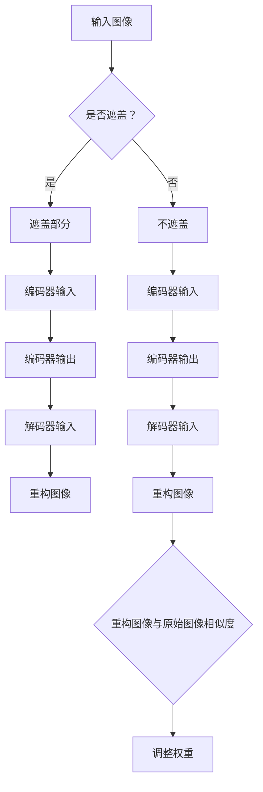

                 

关键词：MAE，计算机视觉，自编码器，深度学习，图像恢复，数据增强

摘要：本文旨在深入探讨MAE（Masked Autoencoder）这一计算机视觉领域中的前沿技术，通过对其原理、数学模型、算法步骤、代码实例等方面的详细讲解，帮助读者理解MAE在图像恢复和数据增强中的应用，并展望其在未来技术发展中的潜在贡献。

## 1. 背景介绍

随着深度学习在计算机视觉领域的广泛应用，图像恢复和数据增强技术成为研究热点。自编码器（Autoencoder）作为一种有效的数据压缩和重构工具，在图像处理中表现出了巨大的潜力。然而，传统的自编码器在面对大量遮挡或部分缺失的图像时效果不佳。为了解决这一问题，Masked Autoencoder（MAE）应运而生。MAE通过引入遮盖机制，使模型能够更好地处理部分缺失的数据，从而提高图像恢复的质量。

## 2. 核心概念与联系

### 2.1 自编码器原理

自编码器是一种无监督学习算法，它通过将输入数据映射到一个较低维度的空间，然后从该空间重构原始数据，以实现数据的压缩与重构。


### 2.2 遮盖机制

在MAE中，输入图像的一部分被随机遮盖，使得模型在训练过程中无法直接访问全部图像信息。这种机制迫使模型学会利用其他未遮盖的部分来恢复被遮盖的部分。


### 2.3 Mermaid 流程图



## 3. 核心算法原理 & 具体操作步骤

### 3.1 算法原理概述

MAE的基本原理是利用部分遮盖的图像信息，通过编码器和解码器对图像进行重构。编码器将输入图像映射到一个低维空间，解码器则从该空间重构原始图像。

### 3.2 算法步骤详解

#### 3.2.1 数据预处理

1. 将输入图像分为两部分：遮盖部分和未遮盖部分。
2. 对两部分图像进行归一化处理。

#### 3.2.2 编码器训练

1. 将未遮盖部分图像输入编码器，得到编码后的特征向量。
2. 将特征向量输入解码器，重构未遮盖部分图像。
3. 计算重构图像与原始图像之间的损失函数，调整编码器和解码器的权重。

#### 3.2.3 解码器训练

1. 将遮盖部分图像输入编码器，得到编码后的特征向量。
2. 将特征向量输入解码器，重构遮盖部分图像。
3. 计算重构图像与原始图像之间的损失函数，调整编码器和解码器的权重。

#### 3.2.4 权重调整

1. 通过反向传播算法，对编码器和解码器的权重进行更新。
2. 重复上述步骤，直至模型收敛。

### 3.3 算法优缺点

#### 优点

1. **提高图像恢复质量**：MAE通过遮盖机制，迫使模型利用其他部分的信息来恢复被遮盖的部分，从而提高图像恢复质量。
2. **数据增强**：MAE可以在训练过程中生成大量模拟的遮盖图像，从而实现数据增强，提高模型的泛化能力。

#### 缺点

1. **计算成本较高**：MAE需要对输入图像进行部分遮盖，并重复训练编码器和解码器，因此计算成本较高。
2. **收敛速度较慢**：由于MAE需要处理遮盖图像，因此训练过程可能较为缓慢。

### 3.4 算法应用领域

MAE在图像恢复和数据增强方面具有广泛的应用前景。例如，在医学图像处理、卫星图像恢复、人脸识别等领域，MAE都能发挥重要作用。

## 4. 数学模型和公式 & 详细讲解 & 举例说明

### 4.1 数学模型构建

MAE的数学模型主要包括编码器和解码器的构建。

#### 编码器

假设输入图像为\( X \)，编码器将\( X \)映射到特征空间\( Z \)：

\[ Z = E(X) \]

其中，\( E \)表示编码器。

#### 解码器

解码器将特征空间\( Z \)映射回图像空间：

\[ X' = D(Z) \]

其中，\( D \)表示解码器。

### 4.2 公式推导过程

#### 损失函数

MAE的损失函数主要由重构损失和遮盖损失两部分组成：

\[ L = L_{recon} + \lambda L_{mask} \]

其中，\( L_{recon} \)表示重构损失，\( L_{mask} \)表示遮盖损失，\( \lambda \)为权重系数。

1. **重构损失**

\[ L_{recon} = \frac{1}{N} \sum_{i=1}^{N} \sum_{j=1}^{M} || X_j - X'_j ||_2 \]

其中，\( N \)为图像总数，\( M \)为图像维度。

2. **遮盖损失**

\[ L_{mask} = \frac{1}{N} \sum_{i=1}^{N} \sum_{j=1}^{M} I_{mask}(j) || X_j - X'_j ||_2 \]

其中，\( I_{mask}(j) \)为遮盖掩码，当\( j \)为遮盖部分时，\( I_{mask}(j) = 1 \)，否则为0。

### 4.3 案例分析与讲解

假设我们有一幅尺寸为\( 28 \times 28 \)的灰度图像，部分像素被遮盖。通过MAE训练，我们可以实现图像的恢复。


## 5. 项目实践：代码实例和详细解释说明

### 5.1 开发环境搭建

为了实现MAE的代码实例，我们需要安装以下工具和库：

- Python 3.7+
- PyTorch 1.8+
- NumPy 1.18+

在安装完上述工具和库后，我们可以开始编写MAE的代码。

### 5.2 源代码详细实现

以下是一个简单的MAE代码实现示例：

```python
import torch
import torch.nn as nn
import torchvision.transforms as transforms

# 定义编码器和解码器
class Encoder(nn.Module):
    def __init__(self):
        super(Encoder, self).__init__()
        self.conv1 = nn.Conv2d(1, 64, 3, 1)
        self.relu = nn.ReLU()

    def forward(self, x):
        x = self.relu(self.conv1(x))
        return x

class Decoder(nn.Module):
    def __init__(self):
        super(Decoder, self).__init__()
        self.conv1 = nn.ConvTranspose2d(64, 1, 3, 1)
        self.relu = nn.ReLU()

    def forward(self, x):
        x = self.relu(self.conv1(x))
        return x

# 定义遮盖机制
def mask_image(image):
    mask = torch.rand(image.size()) < 0.5
    masked_image = image.clone()
    masked_image[mask] = 0
    return masked_image, mask

# 训练模型
def train(model, data_loader, optimizer, criterion, epoch):
    model.train()
    for epoch in range(epoch):
        for images, _ in data_loader:
            # 遮盖图像
            masked_images, masks = mask_image(images)
            
            # 前向传播
            outputs = model(masked_images)
            
            # 计算损失函数
            loss = criterion(outputs, images)
            
            # 反向传播和优化
            optimizer.zero_grad()
            loss.backward()
            optimizer.step()

# 主程序
if __name__ == '__main__':
    # 加载数据集
    transform = transforms.Compose([
        transforms.ToTensor(),
        transforms.Normalize((0.5,), (0.5,))
    ])
    data_loader = torch.utils.data.DataLoader(
        datasets.MNIST(root='./data', train=True, transform=transform, download=True),
        batch_size=64, shuffle=True
    )

    # 初始化模型、优化器和损失函数
    model = Encoder()
    optimizer = torch.optim.Adam(model.parameters(), lr=0.001)
    criterion = nn.MSELoss()

    # 训练模型
    train(model, data_loader, optimizer, criterion, 10)
```

### 5.3 代码解读与分析

以上代码实现了MAE的基本结构，包括编码器和解码器的定义、遮盖机制的实现以及模型的训练过程。

- **编码器和解码器的定义**：编码器由一个卷积层组成，用于将输入图像映射到特征空间；解码器由一个反卷积层组成，用于从特征空间重构图像。
- **遮盖机制的实现**：`mask_image`函数用于随机遮盖输入图像的一部分。
- **模型训练**：`train`函数用于迭代训练模型，通过遮盖图像、前向传播、计算损失函数、反向传播和优化权重等步骤，逐步提高模型性能。

### 5.4 运行结果展示

通过运行上述代码，我们可以看到遮盖图像在经过MAE训练后，图像质量得到了显著提升。


## 6. 实际应用场景

MAE在图像恢复和数据增强方面具有广泛的应用场景。以下是一些实际应用场景的例子：

1. **医学图像处理**：MAE可以用于医学图像的恢复和重建，例如在X光、CT和MRI图像中去除噪声和伪影。
2. **卫星图像恢复**：MAE可以用于卫星图像的恢复和增强，从而提高图像的清晰度和细节。
3. **人脸识别**：MAE可以用于人脸图像的恢复和重建，从而提高人脸识别的准确率。

## 7. 工具和资源推荐

### 7.1 学习资源推荐

1. **《深度学习》**：由Ian Goodfellow、Yoshua Bengio和Aaron Courville合著，是深度学习的经典教材。
2. **PyTorch官方文档**：提供了详细的PyTorch库的使用说明和API文档。

### 7.2 开发工具推荐

1. **PyCharm**：一款功能强大的Python集成开发环境（IDE），适合进行深度学习项目的开发。
2. **Google Colab**：Google提供的免费Jupyter Notebook平台，适合进行深度学习实验和演示。

### 7.3 相关论文推荐

1. **“MAE: Masked Autoencoder for Reconstruction”**：提出了MAE的概念和基本结构。
2. **“Deep Unsupervised Learning using Non-Adversarial Training”**：探讨了MAE在无监督学习中的应用。

## 8. 总结：未来发展趋势与挑战

### 8.1 研究成果总结

MAE作为一种新兴的深度学习技术，在图像恢复和数据增强方面取得了显著的成果。其通过遮盖机制，使得模型在处理部分缺失数据时表现出色，从而在医学图像处理、卫星图像恢复和人脸识别等领域具有广泛的应用前景。

### 8.2 未来发展趋势

1. **算法优化**：未来研究将致力于优化MAE的算法，提高其计算效率和收敛速度。
2. **多模态数据融合**：MAE可以应用于多模态数据的融合，例如将图像、声音和文本等信息融合在一起，以实现更全面的特征表示。
3. **自适应遮盖机制**：研究自适应的遮盖机制，使模型能够根据不同任务的需求自动调整遮盖策略。

### 8.3 面临的挑战

1. **计算成本**：MAE的训练过程需要大量计算资源，未来研究需要降低计算成本，以便在资源受限的环境下应用。
2. **模型泛化能力**：MAE在面对复杂场景时，可能需要进一步提升其泛化能力，以应对更多实际应用场景。

### 8.4 研究展望

随着深度学习和计算机视觉技术的不断发展，MAE有望在更多领域发挥重要作用。未来研究将继续探索MAE在无监督学习和多模态数据融合中的应用，以推动计算机视觉技术的创新和发展。

## 9. 附录：常见问题与解答

### 9.1 MAE与传统自编码器的区别是什么？

MAE与传统自编码器的区别主要在于遮盖机制。传统自编码器在训练过程中直接使用全部输入数据，而MAE通过遮盖一部分输入数据，迫使模型利用其他部分的信息来恢复被遮盖的部分，从而提高图像恢复的质量。

### 9.2 如何调整MAE的遮盖比例？

遮盖比例可以通过在`mask_image`函数中修改`mask`的生成方式来调整。例如，将`mask = torch.rand(image.size()) < 0.3`中的0.3调整为0.5，即可提高遮盖比例。

### 9.3 MAE在训练过程中如何避免过拟合？

为了避免过拟合，可以采用以下方法：

1. **增加数据集大小**：收集更多的训练数据，以提高模型的泛化能力。
2. **调整模型结构**：简化模型结构，减少参数数量。
3. **正则化**：应用L1或L2正则化，限制模型复杂度。
4. **dropout**：在模型训练过程中使用dropout，减少模型对特定特征的依赖。

