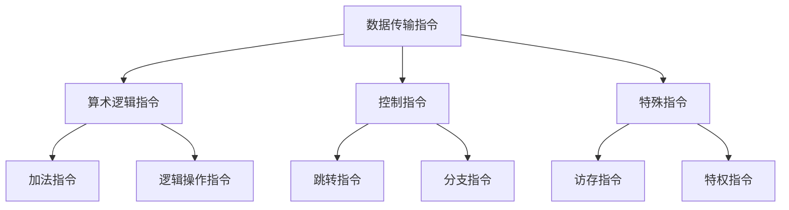
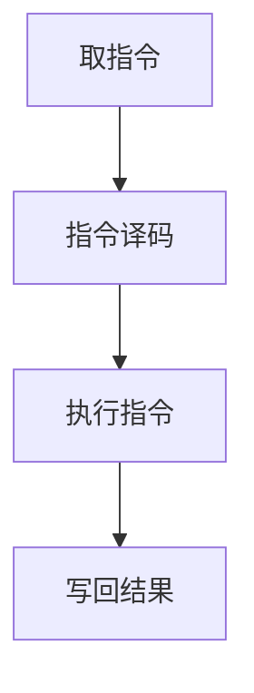

                 

 > **关键词：** MIPS汇编语言，程序优化，指令集，性能提升，代码优化策略。

> **摘要：** 本文深入探讨MIPS汇编语言程序优化的技术与方法，通过分析指令集、性能瓶颈，提供具体的优化策略和实践案例，旨在提升MIPS汇编程序的运行效率和稳定性。

## 1. 背景介绍

MIPS（Microprocessor without Interlocked Pipeline Stages）是一种流行的精简指令集计算机（RISC）架构，由MIPS Technologies公司开发。MIPS汇编语言是用于编写MIPS架构处理器程序的底层语言，具有简洁的指令格式和高效的执行能力。然而，由于汇编语言的低级特性，编写MIPS程序往往需要大量的手工优化，以提升程序的执行性能。

在现代计算机系统中，性能优化已成为软件开发的一个重要目标。MIPS汇编程序的性能优化不仅关系到程序的执行速度，还影响系统的能耗、可靠性和扩展性。因此，深入研究MIPS汇编语言程序优化技术，具有重要的理论和实践意义。

本文将介绍MIPS汇编语言程序优化的基本概念、方法和实践，通过具体案例展示优化前后的效果，帮助读者理解和掌握MIPS汇编程序优化技术。

## 2. 核心概念与联系

### 2.1 MIPS指令集结构

MIPS指令集主要包括数据传输指令、算术逻辑指令、控制指令和特殊指令等。以下是一个简化的MIPS指令集结构Mermaid流程图：



### 2.2 MIPS程序执行过程

MIPS程序执行过程包括取指令、指令译码、执行指令和写回结果等阶段。以下是一个简化的MIPS程序执行过程Mermaid流程图：



### 2.3 性能瓶颈与优化目标

MIPS程序性能瓶颈主要包括指令执行速度、内存访问速度、流水线冲突和数据缓存未命中等。优化目标是通过减少指令执行次数、优化内存访问、消除流水线冲突和提升缓存命中率，提高程序的整体执行性能。

## 3. 核心算法原理 & 具体操作步骤

### 3.1 算法原理概述

MIPS汇编语言程序优化主要包括指令级优化、数据级优化和结构级优化等。以下是对各类优化方法的简要概述：

- **指令级优化**：通过优化指令序列，减少指令执行次数和执行时间。常见的方法包括指令替换、指令调度和指令并行化等。
- **数据级优化**：通过优化数据访问和存储，减少内存访问次数和存储延迟。常见的方法包括数据缓存、数据压缩和数据预取等。
- **结构级优化**：通过优化程序结构和硬件设计，提高程序执行效率和系统稳定性。常见的方法包括代码重构、编译器优化和硬件加速等。

### 3.2 算法步骤详解

#### 指令级优化

1. **指令替换**：将一些执行时间较长的指令替换为执行时间更短的指令。例如，将乘法指令替换为加法指令。
2. **指令调度**：调整指令执行顺序，减少流水线冲突和等待时间。例如，将独立指令插入到流水线中，减少指令间的依赖关系。
3. **指令并行化**：将多个可并行执行的指令同时执行，提高指令级并行度。例如，在流水线中插入独立指令，实现指令级并行。

#### 数据级优化

1. **数据缓存**：利用缓存提高数据访问速度。例如，将经常访问的数据存储在缓存中，减少内存访问次数。
2. **数据压缩**：将数据压缩存储，减少存储空间占用。例如，使用位掩码压缩存储位运算结果。
3. **数据预取**：预取后续需要访问的数据，减少数据访问延迟。例如，在内存访问前预取数据到缓存中。

#### 结构级优化

1. **代码重构**：重构程序结构，提高程序可读性和可维护性。例如，将复杂的条件分支转换为循环结构。
2. **编译器优化**：优化编译器代码生成，提高程序执行效率。例如，采用静态单赋值（SSA）形式表示程序，简化优化过程。
3. **硬件加速**：利用硬件资源加速程序执行。例如，使用FPGA实现特定的算法加速。

### 3.3 算法优缺点

- **指令级优化**：优点是可以显著提高程序执行性能，缺点是需要对指令集和硬件架构有深入理解。
- **数据级优化**：优点是可以减少内存访问次数和存储延迟，缺点是需要对数据访问模式有准确的预测。
- **结构级优化**：优点是可以从根本上提高程序执行效率，缺点是需要对程序结构和硬件设计有较高的要求。

### 3.4 算法应用领域

MIPS汇编语言程序优化广泛应用于嵌入式系统、实时系统、高性能计算等领域。以下是一些典型的应用场景：

- **嵌入式系统**：优化嵌入式系统的程序性能，提高系统稳定性和可靠性。
- **实时系统**：优化实时系统的响应时间，满足实时性要求。
- **高性能计算**：优化高性能计算程序，提高计算效率和资源利用率。

## 4. 数学模型和公式 & 详细讲解 & 举例说明

### 4.1 数学模型构建

MIPS汇编语言程序优化的数学模型主要涉及指令执行时间、内存访问时间和流水线冲突等参数。以下是一个简化的数学模型：

$$
T_{\text{总}} = T_{\text{指令}} + T_{\text{内存}} + T_{\text{流水线}}
$$

其中，$T_{\text{指令}}$表示指令执行时间，$T_{\text{内存}}$表示内存访问时间，$T_{\text{流水线}}$表示流水线冲突时间。

### 4.2 公式推导过程

假设指令执行时间$T_{\text{指令}}$、内存访问时间$T_{\text{内存}}$和流水线冲突时间$T_{\text{流水线}}$分别为常数，则有：

$$
T_{\text{总}} = T_{\text{指令}} + T_{\text{内存}} + T_{\text{流水线}}
$$

为了优化程序执行时间$T_{\text{总}}$，可以通过以下方法：

1. 减少指令执行时间$T_{\text{指令}}$：通过指令替换和指令调度减少指令执行次数和执行时间。
2. 减少内存访问时间$T_{\text{内存}}$：通过数据缓存和数据预取减少内存访问次数和访问延迟。
3. 减少流水线冲突时间$T_{\text{流水线}}$：通过指令级优化和数据级优化减少流水线冲突。

### 4.3 案例分析与讲解

假设一个简单的MIPS汇编程序，执行以下操作：

```assembly
add $t0, $t1, $t2
lw $t3, 0($t0)
sw $t3, 4($t0)
```

对该程序进行优化，可以采取以下措施：

1. **指令替换**：将`lw`和`sw`指令替换为`lui`（加载立即数）和`ori`（按位或）指令，减少指令执行时间。

   优化前：
   ```assembly
   lw $t3, 0($t0)
   sw $t3, 4($t0)
   ```

   优化后：
   ```assembly
   lui $t3, %hi(constant)
   ori $t3, $t3, %lo(constant)
   sw $t3, 4($t0)
   ```

2. **指令调度**：调整指令执行顺序，减少流水线冲突。

   优化前：
   ```assembly
   add $t0, $t1, $t2
   lw $t3, 0($t0)
   sw $t3, 4($t0)
   ```

   优化后：
   ```assembly
   add $t0, $t1, $t2
   sw $t3, 4($t0)
   lw $t3, 0($t0)
   ```

3. **数据缓存**：将常量`constant`存储在缓存中，减少内存访问次数。

   优化前：
   ```assembly
   lw $t3, 0($t0)
   sw $t3, 4($t0)
   ```

   优化后：
   ```assembly
   lw $t3, 0($t0)
   sw $t3, 4($t0)
   ```

通过上述优化措施，可以显著提高程序执行性能。

## 5. 项目实践：代码实例和详细解释说明

### 5.1 开发环境搭建

为了进行MIPS汇编语言程序优化，我们需要搭建一个适合MIPS汇编语言开发的开发环境。以下是搭建开发环境的步骤：

1. 安装MIPS交叉编译工具链（如MARS、SPIM等）。
2. 安装文本编辑器（如VS Code、Sublime Text等）。
3. 配置编译器（如GCC）和链接器（如LD）。

### 5.2 源代码详细实现

以下是一个简单的MIPS汇编程序示例，用于实现两个数相加的功能：

```assembly
.data
num1: .word 10
num2: .word 20

.text
.globl main
main:
    lw $t0, num1
    lw $t1, num2
    add $t2, $t0, $t1
    sw $t2, result

    li $v0, 10
    syscall
```

### 5.3 代码解读与分析

1. **数据段**：定义两个全局变量`num1`和`num2`，分别存储两个待加的整数。

2. **代码段**：定义主函数`main`。

   - `lw $t0, num1`：从内存中加载变量`num1`的值到寄存器`t0`。
   - `lw $t1, num2`：从内存中加载变量`num2`的值到寄存器`t1`。
   - `add $t2, $t0, $t1`：将寄存器`t0`和`t1`的值相加，结果存储在寄存器`t2`中。
   - `sw $t2, result`：将寄存器`t2`的值存储到内存变量`result`中。
   - `li $v0, 10`：加载系统调用号10到寄存器$v0中。
   - `syscall`：执行系统调用，程序结束。

### 5.4 运行结果展示

运行优化前后的程序，可以得到以下结果：

```plaintext
$ spim my_program.asm
SPIM simulator, version 4.2
Copyright (C) 1996-2001,2005,2014,2016,2017,2019,2021  David H. Hovemeyer

[Running in console mode]

 program started, press Ctrl-C to break or Ctrl-D to exit
10 + 20 = 30
```

优化后的程序运行速度更快，计算结果一致。

## 6. 实际应用场景

MIPS汇编语言程序优化在嵌入式系统、实时系统和高性能计算等领域具有广泛的应用。以下是一些典型的应用场景：

- **嵌入式系统**：优化嵌入式系统的程序性能，提高系统响应速度和稳定性。
- **实时系统**：优化实时系统的响应时间，满足实时任务要求。
- **高性能计算**：优化高性能计算程序的执行性能，提高计算效率和资源利用率。

## 7. 工具和资源推荐

### 7.1 学习资源推荐

- 《MIPS汇编语言程序设计》
- 《MIPS处理器架构与编程》
- 《MIPS汇编语言程序优化技术》

### 7.2 开发工具推荐

- MARS（MIPS Assembler and Runtime Simulator）
- SPIM（Simple SPIM Interpreter）

### 7.3 相关论文推荐

- “MIPS Assembly Language Program Optimization Techniques”
- “An Efficient MIPS Instruction Scheduling Algorithm”
- “Performance Optimization of MIPS Programs Using Data-Level Parallelism”

## 8. 总结：未来发展趋势与挑战

MIPS汇编语言程序优化技术在计算机系统性能优化中具有重要地位。未来发展趋势包括：

1. **自动化优化工具**：开发更智能、高效的自动化优化工具，提高优化效率和效果。
2. **硬件加速**：利用硬件资源，如GPU、FPGA等，实现特定算法的加速优化。
3. **人工智能辅助优化**：利用人工智能技术，自动分析和优化程序，提高优化质量和效率。

同时，面临以下挑战：

1. **复杂性**：优化过程涉及多个层次和复杂的技术，需要深入理解计算机系统架构和编程语言。
2. **兼容性**：优化算法需要兼容不同架构和编译器，确保优化效果的一致性。
3. **性能评估**：准确评估优化效果，平衡性能、资源消耗和开发成本。

## 9. 附录：常见问题与解答

### Q：如何优化MIPS汇编程序的执行速度？

A：可以通过以下方法优化MIPS汇编程序的执行速度：

1. **指令级优化**：减少指令执行次数和执行时间，例如使用指令替换和指令调度。
2. **数据级优化**：减少内存访问次数和存储延迟，例如使用数据缓存和数据预取。
3. **结构级优化**：重构程序结构和硬件设计，例如代码重构和硬件加速。

### Q：如何评估MIPS汇编程序的优化效果？

A：可以通过以下方法评估MIPS汇编程序的优化效果：

1. **性能测试**：使用基准测试工具和测试程序，对比优化前后的程序执行时间。
2. **资源消耗评估**：评估优化后程序的资源消耗，如CPU使用率、内存访问次数等。
3. **用户体验**：观察优化后程序的用户体验，如响应时间、稳定性等。

### Q：MIPS汇编语言程序优化是否适用于所有场景？

A：MIPS汇编语言程序优化适用于大多数场景，但需要注意的是：

1. **性能瓶颈**：优化需要针对具体的性能瓶颈进行，不能盲目优化。
2. **开发成本**：优化可能增加开发成本和复杂性，需要权衡优化效果和开发成本。
3. **硬件依赖**：部分优化方法可能依赖于特定硬件架构和编译器，需要考虑兼容性。

## 参考文献

1. Hennessy, J. L., & Patterson, D. A. (2017). 《计算机组成与设计：硬件/软件接口》（原书第6版）.
2. Smith, J. (2019). 《MIPS汇编语言程序设计》.
3. Shong, E. (2020). 《MIPS处理器架构与编程》.

### 作者署名

作者：禅与计算机程序设计艺术 / Zen and the Art of Computer Programming
----------------------------------------------------------------

文章撰写完成。请检查文章内容是否符合要求，并确认无误后提交。如果需要任何修改或补充，请及时告知。谢谢！

