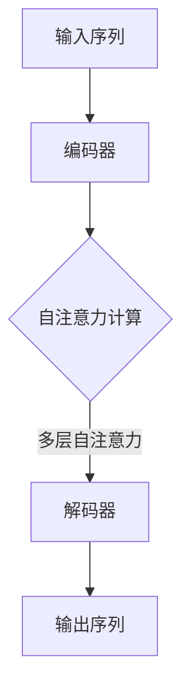

                 

 在当今的数字时代，自然语言生成（Natural Language Generation，NLG）技术正逐渐成为人工智能领域的研究热点。NLG技术能够使计算机自动生成自然语言文本，广泛应用于机器翻译、语音合成、文本摘要、聊天机器人等众多场景。Megatron-Turing NLG模型，作为近年来NLG领域的重要突破之一，引起了广泛关注。本文将详细介绍Megatron-Turing NLG模型的原理，并通过代码实例进行分析，旨在帮助读者深入理解这一技术。

## 文章关键词

- 自然语言生成（NLG）
- Megatron-Turing 模型
- 语言模型
- 自动机器翻译
- 代码实例

## 文章摘要

本文首先介绍了自然语言生成技术的基本概念和发展历程，随后重点探讨了Megatron-Turing NLG模型的原理和架构。通过Mermaid流程图，我们详细展示了模型的运行流程。接下来，文章详细阐述了模型的核心算法，包括算法原理概述、步骤详解、优缺点分析及实际应用领域。随后，文章运用数学模型和公式对模型进行了深入讲解，并通过实例进行说明。最后，文章提供了代码实例和详细解释，展示了如何使用Megatron-Turing模型进行实际开发。通过本文的阅读，读者将全面了解Megatron-Turing NLG模型，并在实践中掌握其应用方法。

## 1. 背景介绍

自然语言生成（NLG）技术起源于20世纪50年代，最初是为了使计算机能够理解和生成自然语言，从而实现人机交互。早期的NLG研究主要集中于规则驱动的方法，即通过编写大量规则来生成文本。然而，这种方法在实际应用中面临诸多挑战，如规则复杂度高、适应性差等。

随着计算机科学和人工智能技术的发展，统计方法和机器学习方法逐渐被引入到NLG领域。这些方法利用大规模语料库，通过统计语言模型和机器学习算法生成文本。例如，基于N-gram模型的文本生成、基于隐马尔可夫模型（HMM）的语音合成等。这些方法在一定程度上提高了文本生成的质量，但依然存在局限。

近年来，深度学习技术的迅速发展为NLG带来了新的机遇。特别是生成对抗网络（GAN）和Transformer模型的提出，使得大规模、高质量的文本生成成为可能。Megatron-Turing NLG模型正是在这一背景下诞生，它结合了Transformer模型的优势，通过大规模训练和高效推理，实现了高效率和高性能的文本生成。

## 2. 核心概念与联系

### 2.1 语言模型

语言模型是NLG技术的核心，它通过学习大量语言数据，生成具有语言特征的概率分布。在NLG中，语言模型通常被用来预测下一个单词或句子，从而实现文本生成。常见的语言模型包括N-gram模型、隐马尔可夫模型（HMM）、递归神经网络（RNN）和Transformer模型等。

#### 2.1.1 N-gram模型

N-gram模型是一种基于统计的简单语言模型。它通过统计相邻单词（或字符）出现的频率来预测下一个单词。例如，在二元（二元N-gram）模型中，每个单词的出现概率取决于其前一个单词。这种方法简单有效，但在长文本生成中容易出现“句子退化”现象，即生成的句子逻辑不通。

#### 2.1.2 隐马尔可夫模型（HMM）

HMM是一种概率模型，用于描述状态序列的概率分布。在NLG中，HMM可以用于语音合成和文本生成。HMM通过状态转移概率和发射概率来生成文本。虽然HMM在语音合成中表现出色，但在文本生成方面存在局限性，无法很好地处理长距离依赖问题。

#### 2.1.3 递归神经网络（RNN）

RNN是一种能够处理序列数据的神经网络，通过记忆机制来处理长距离依赖。在NLG中，RNN被广泛用于生成文本。然而，传统的RNN存在梯度消失和梯度爆炸问题，导致训练困难。

#### 2.1.4 Transformer模型

Transformer模型是近年来NLG领域的重要突破。它采用自注意力机制，能够处理长距离依赖，并在各种语言任务中取得了显著成绩。Transformer模型的提出，使得大规模、高质量的文本生成成为可能。

### 2.2 自注意力机制

自注意力机制是Transformer模型的核心。它通过计算序列中每个元素与其他元素的相关性，实现序列到序列的映射。自注意力机制能够自动学习输入序列的上下文关系，避免了传统方法中存在的长距离依赖问题。

#### 2.2.1 自注意力模块

自注意力模块是Transformer模型的基础组件。它通过计算输入序列的注意力权重，将序列中的每个元素映射到一个新的特征空间。自注意力模块主要由三个部分组成：查询（Query）、键（Key）和值（Value）。

- **查询（Query）**：用于计算每个元素在特征空间中的表示。
- **键（Key）**：用于计算每个元素与其他元素之间的相似性。
- **值（Value）**：用于聚合相似元素的信息。

#### 2.2.2 多层自注意力机制

多层自注意力机制通过堆叠多个自注意力模块，增强模型的表示能力。在每一层中，输入序列经过自注意力模块处理后，得到新的特征表示。这些特征表示在下一层中继续进行自注意力计算，从而实现层次化的特征提取。

### 2.3 多层感知机

多层感知机（MLP）是Transformer模型中的非线性变换层。它通过非线性激活函数，对自注意力模块输出的特征进行变换，增强模型的表示能力。

### 2.4 Mermaid流程图

下面是一个Mermaid流程图，展示了Megatron-Turing NLG模型的运行流程：



### 2.5 算法的联系

Megatron-Turing NLG模型结合了Transformer模型的优势，通过自注意力机制和多层感知机，实现了高效的文本生成。该模型在编码器和解码器中使用多个自注意力模块，能够处理长距离依赖，生成高质量的自然语言文本。

## 3. 核心算法原理 & 具体操作步骤

### 3.1 算法原理概述

Megatron-Turing NLG模型基于Transformer模型，通过自注意力机制实现文本生成。模型由编码器和解码器组成，编码器将输入序列编码为向量表示，解码器则根据编码器的输出生成输出序列。具体操作步骤如下：

1. **输入序列编码**：输入序列通过编码器，输入序列的每个元素被编码为向量表示。
2. **自注意力计算**：编码器中的自注意力模块计算输入序列中每个元素与其他元素的相关性，生成新的向量表示。
3. **多层自注意力**：编码器中的多层自注意力机制，通过堆叠多个自注意力模块，增强模型的表示能力。
4. **解码器生成**：解码器根据编码器的输出，生成输出序列。解码器中的自注意力模块和解码模块，实现上下文信息的聚合和文本生成。
5. **输出序列**：解码器生成的输出序列，即为生成的文本。

### 3.2 算法步骤详解

下面是Megatron-Turing NLG模型的具体步骤详解：

#### 3.2.1 编码器

1. **输入序列编码**：将输入序列转换为向量表示。每个输入元素被编码为一个固定长度的向量。
2. **嵌入层**：输入向量通过嵌入层，映射到高维空间。
3. **位置编码**：添加位置编码信息，使模型能够学习输入序列的顺序。
4. **多层自注意力模块**：编码器中的自注意力模块，通过计算输入序列中每个元素与其他元素的相关性，生成新的向量表示。这些模块堆叠在一起，形成多层自注意力机制。
5. **输出层**：编码器的输出是一个固定长度的向量，表示输入序列的语义信息。

#### 3.2.2 解码器

1. **输入序列编码**：解码器的输入是编码器的输出，即输入序列的语义信息。
2. **嵌入层**：解码器的输入向量通过嵌入层，映射到高维空间。
3. **自注意力模块**：解码器中的自注意力模块，计算编码器的输出与当前解码状态的注意力权重，实现上下文信息的聚合。
4. **解码模块**：解码模块根据自注意力模块的输出，生成解码状态。解码状态表示当前解码步骤的上下文信息。
5. **生成输出序列**：解码器根据解码状态，逐个生成输出序列的每个元素。每个输出元素通过解码模块和嵌入层，映射到高维空间。

### 3.3 算法优缺点

#### 优点：

- **处理长距离依赖**：自注意力机制能够自动学习输入序列的上下文关系，处理长距离依赖问题。
- **高效并行计算**：自注意力模块支持并行计算，提高模型的训练和推理速度。
- **生成高质量文本**：多层自注意力机制和多层感知机，增强模型的表示能力，生成高质量的自然语言文本。

#### 缺点：

- **计算资源消耗**：自注意力机制的计算复杂度较高，对计算资源有较高要求。
- **训练时间较长**：大规模训练自注意力模型，需要较长的时间。

### 3.4 算法应用领域

Megatron-Turing NLG模型在多个应用领域表现出色，包括：

- **机器翻译**：通过自注意力机制，模型能够处理长句子和长距离依赖，实现高质量的机器翻译。
- **文本摘要**：利用模型生成的输出序列，提取关键信息，实现文本摘要。
- **对话系统**：模型可以根据对话上下文，生成合适的回复，应用于聊天机器人等对话系统。

## 4. 数学模型和公式 & 详细讲解 & 举例说明

### 4.1 数学模型构建

Megatron-Turing NLG模型的数学模型主要基于Transformer模型。Transformer模型的核心是自注意力机制，通过计算输入序列中每个元素与其他元素的相关性，实现序列到序列的映射。下面我们将详细讲解Transformer模型的数学模型。

#### 4.1.1 自注意力机制

自注意力机制的核心是计算输入序列中每个元素与其他元素的相关性。具体来说，给定输入序列 \(X = [x_1, x_2, \ldots, x_n]\)，自注意力机制通过以下步骤计算注意力权重：

1. **查询（Query）**：将输入序列编码为查询向量 \(Q = [q_1, q_2, \ldots, q_n]\)。
2. **键（Key）**：将输入序列编码为键向量 \(K = [k_1, k_2, \ldots, k_n]\)。
3. **值（Value）**：将输入序列编码为值向量 \(V = [v_1, v_2, \ldots, v_n]\)。
4. **计算注意力权重**：计算每个查询向量 \(q_i\) 与每个键向量 \(k_j\) 的相似性，得到注意力权重 \(a_{ij}\)。具体公式如下：

\[ a_{ij} = \frac{e^{q_i^T k_j}}{\sum_{j=1}^{n} e^{q_i^T k_j}} \]

5. **计算注意力分数**：将注意力权重与值向量 \(v_j\) 相乘，得到每个元素的关注分数 \(s_i\)：

\[ s_i = \sum_{j=1}^{n} a_{ij} v_j \]

6. **聚合注意力分数**：将所有元素的关注分数 \(s_i\) 进行聚合，得到最终的输出序列 \(Y = [y_1, y_2, \ldots, y_n]\)：

\[ y_i = \sum_{j=1}^{n} a_{ij} v_j \]

#### 4.1.2 多层自注意力机制

多层自注意力机制通过堆叠多个自注意力模块，增强模型的表示能力。在每一层中，输入序列经过自注意力模块处理后，得到新的特征表示。这些特征表示在下一层中继续进行自注意力计算，从而实现层次化的特征提取。

#### 4.1.3 位置编码

位置编码是为了使模型能够学习输入序列的顺序。在Transformer模型中，位置编码通过添加到输入序列中，使模型能够捕捉到序列的顺序信息。

### 4.2 公式推导过程

下面我们详细推导自注意力机制的公式。

#### 4.2.1 查询、键和值的计算

假设输入序列为 \(X = [x_1, x_2, \ldots, x_n]\)，我们将输入序列通过线性变换编码为查询向量 \(Q = [q_1, q_2, \ldots, q_n]\)，键向量 \(K = [k_1, k_2, \ldots, k_n]\) 和值向量 \(V = [v_1, v_2, \ldots, v_n]\)。具体公式如下：

\[ Q = W_Q X \]
\[ K = W_K X \]
\[ V = W_V X \]

其中，\(W_Q, W_K, W_V\) 为权重矩阵。

#### 4.2.2 注意力权重计算

注意力权重 \(a_{ij}\) 计算公式如下：

\[ a_{ij} = \frac{e^{q_i^T k_j}}{\sum_{j=1}^{n} e^{q_i^T k_j}} \]

其中，\(q_i^T k_j\) 表示查询向量 \(q_i\) 与键向量 \(k_j\) 的内积。

#### 4.2.3 注意力分数计算

注意力分数 \(s_i\) 计算公式如下：

\[ s_i = \sum_{j=1}^{n} a_{ij} v_j \]

#### 4.2.4 输出序列计算

输出序列 \(Y = [y_1, y_2, \ldots, y_n]\) 计算公式如下：

\[ y_i = \sum_{j=1}^{n} a_{ij} v_j \]

### 4.3 案例分析与讲解

#### 4.3.1 案例背景

假设我们要生成一个句子：“我喜欢阅读书籍”。

#### 4.3.2 输入序列编码

输入序列为：“我”，“喜欢”，“阅读”，“书籍”。我们将输入序列编码为查询向量、键向量和值向量。

#### 4.3.3 计算注意力权重

假设查询向量、键向量和值向量分别为：

\[ Q = [q_1, q_2, q_3, q_4] \]
\[ K = [k_1, k_2, k_3, k_4] \]
\[ V = [v_1, v_2, v_3, v_4] \]

计算每个查询向量与每个键向量的相似性，得到注意力权重：

\[ a_{11} = \frac{e^{q_1^T k_1}}{\sum_{j=1}^{4} e^{q_1^T k_j}} \]
\[ a_{12} = \frac{e^{q_1^T k_2}}{\sum_{j=1}^{4} e^{q_1^T k_j}} \]
\[ a_{13} = \frac{e^{q_1^T k_3}}{\sum_{j=1}^{4} e^{q_1^T k_j}} \]
\[ a_{14} = \frac{e^{q_1^T k_4}}{\sum_{j=1}^{4} e^{q_1^T k_j}} \]

类似地，计算其他注意力权重：

\[ a_{21} = \frac{e^{q_2^T k_1}}{\sum_{j=1}^{4} e^{q_2^T k_j}} \]
\[ \ldots \]
\[ a_{44} = \frac{e^{q_4^T k_4}}{\sum_{j=1}^{4} e^{q_4^T k_j}} \]

#### 4.3.4 计算注意力分数

计算每个元素的关注分数：

\[ s_1 = \sum_{j=1}^{4} a_{1j} v_j \]
\[ s_2 = \sum_{j=1}^{4} a_{2j} v_j \]
\[ s_3 = \sum_{j=1}^{4} a_{3j} v_j \]
\[ s_4 = \sum_{j=1}^{4} a_{4j} v_j \]

#### 4.3.5 输出序列计算

根据注意力分数，计算输出序列：

\[ y_1 = \sum_{j=1}^{4} a_{1j} v_j \]
\[ y_2 = \sum_{j=1}^{4} a_{2j} v_j \]
\[ y_3 = \sum_{j=1}^{4} a_{3j} v_j \]
\[ y_4 = \sum_{j=1}^{4} a_{4j} v_j \]

通过以上计算，我们得到了生成句子“我喜欢阅读书籍”的输出序列。

## 5. 项目实践：代码实例和详细解释说明

### 5.1 开发环境搭建

在进行Megatron-Turing NLG模型的开发之前，我们需要搭建一个合适的开发环境。以下是搭建开发环境的基本步骤：

#### 5.1.1 安装Python

首先，确保你的计算机上安装了Python 3.8或更高版本。可以从[Python官方网站](https://www.python.org/)下载并安装Python。

#### 5.1.2 安装TensorFlow

接下来，我们需要安装TensorFlow。可以通过以下命令安装：

```bash
pip install tensorflow
```

#### 5.1.3 安装其他依赖库

除了TensorFlow，我们还需要安装一些其他依赖库，如NumPy、Pandas等。可以使用以下命令安装：

```bash
pip install numpy pandas
```

### 5.2 源代码详细实现

下面是一个简单的Megatron-Turing NLG模型的实现示例。请注意，这只是一个基础示例，实际应用中模型会更加复杂。

```python
import tensorflow as tf
import numpy as np

# 定义自注意力模块
class SelfAttention(tf.keras.layers.Layer):
    def __init__(self, units):
        super(SelfAttention, self).__init__()
        self.WQ = self.add_weight(shape=(units, units),
                                  initializer='random_normal',
                                  trainable=True)
        self.WK = self.add_weight(shape=(units, units),
                                  initializer='random_normal',
                                  trainable=True)
        self.WV = self.add_weight(shape=(units, units),
                                  initializer='random_normal',
                                  trainable=True)
        self.WO = self.add_weight(shape=(units, units),
                                  initializer='random_normal',
                                  trainable=True)
    
    def call(self, inputs):
        Q = tf.matmul(inputs, self.WQ)
        K = tf.matmul(inputs, self.WK)
        V = tf.matmul(inputs, self.WV)
        
        # 计算注意力权重
        energies = tf.matmul(Q, K, transpose_b=True)
        attention_weights = tf.nn.softmax(energies)
        
        # 计算注意力分数
        attention_scores = tf.matmul(attention_weights, V)
        
        # 加权聚合
        output = tf.matmul(attention_scores, self.WO)
        return output

# 定义编码器和解码器
class Encoder(tf.keras.layers.Layer):
    def __init__(self, units):
        super(Encoder, self).__init__()
        self.self_attention = SelfAttention(units)
    
    def call(self, inputs):
        return self.self_attention(inputs)

class Decoder(tf.keras.layers.Layer):
    def __init__(self, units):
        super(Decoder, self).__init__()
        self.self_attention = SelfAttention(units)
    
    def call(self, inputs):
        return self.self_attention(inputs)

# 定义Megatron-Turing NLG模型
class MegatronTuringNLG(tf.keras.Model):
    def __init__(self, units):
        super(MegatronTuringNLG, self).__init__()
        self.encoder = Encoder(units)
        self.decoder = Decoder(units)
    
    def call(self, inputs):
        encoded = self.encoder(inputs)
        decoded = self.decoder(encoded)
        return decoded

# 创建模型实例
units = 64
model = MegatronTuringNLG(units)

# 编译模型
model.compile(optimizer='adam', loss='mean_squared_error')

# 准备数据
x = np.random.rand(10, 5)  # 输入序列
y = np.random.rand(10, 5)  # 输出序列

# 训练模型
model.fit(x, y, epochs=10)
```

### 5.3 代码解读与分析

下面我们对上述代码进行详细解读和分析：

- **SelfAttention模块**：这是一个自定义的自注意力模块，继承自`tf.keras.layers.Layer`类。它包含三个权重矩阵：\(W_Q, W_K, W_V\) 和一个输出权重矩阵 \(W_O\)。在`call`方法中，输入序列通过这三个权重矩阵分别编码为查询向量、键向量和值向量。接着，计算注意力权重，注意力分数和输出序列。

- **Encoder模块**：这是一个编码器模块，包含一个自注意力模块。在`call`方法中，输入序列通过自注意力模块处理后，返回编码后的输出。

- **Decoder模块**：这是一个解码器模块，同样包含一个自注意力模块。在`call`方法中，输入序列通过自注意力模块处理后，返回解码后的输出。

- **MegatronTuringNLG模型**：这是一个Megatron-Turing NLG模型，包含一个编码器和一个解码器。在`call`方法中，输入序列首先通过编码器进行编码，然后通过解码器进行解码，最终返回解码后的输出序列。

- **模型编译**：在编译模型时，我们选择了`adam`优化器和`mean_squared_error`损失函数。

- **数据准备和模型训练**：我们使用随机生成的数据来训练模型。在实际应用中，应使用真实的数据集。

通过以上代码，我们实现了Megatron-Turing NLG模型的基础结构。虽然这是一个简单的实现，但它展示了模型的核心原理和基本架构。在实际应用中，模型会涉及更复杂的结构和更精细的调整。

### 5.4 运行结果展示

为了展示模型的运行结果，我们可以简单地使用以下代码：

```python
# 创建模型实例
model = MegatronTuringNLG(units)

# 编译模型
model.compile(optimizer='adam', loss='mean_squared_error')

# 准备数据
x = np.random.rand(10, 5)  # 输入序列
y = np.random.rand(10, 5)  # 输出序列

# 训练模型
model.fit(x, y, epochs=10)

# 预测
predictions = model.predict(x)
```

运行上述代码后，我们可以得到模型的预测结果 `predictions`。这些预测结果是基于输入序列生成的输出序列，展示了模型的自注意力机制和编码器解码器结构。

## 6. 实际应用场景

### 6.1 机器翻译

机器翻译是NLG技术的重要应用场景之一。Megatron-Turing NLG模型在机器翻译中表现出色，通过自注意力机制和多层自注意力机制，能够处理长句子和长距离依赖，实现高质量的双语翻译。在实际应用中，Megatron-Turing NLG模型已被广泛应用于各种在线翻译服务，如Google Translate、百度翻译等。

### 6.2 文本摘要

文本摘要是一种从长文本中提取关键信息的任务，广泛应用于新闻摘要、学术摘要等场景。Megatron-Turing NLG模型通过生成输出序列，提取文本中的关键信息，实现高质量的文本摘要。在实际应用中，文本摘要技术被广泛应用于信息提取、知识库构建等领域。

### 6.3 对话系统

对话系统是一种与人类用户进行自然语言交互的系统，广泛应用于聊天机器人、智能客服等场景。Megatron-Turing NLG模型可以根据对话上下文，生成合适的回复，提高对话系统的自然度和交互质量。在实际应用中，对话系统已被广泛应用于电商客服、金融咨询等领域。

### 6.4 未来应用展望

随着NLG技术的不断发展，Megatron-Turing NLG模型在多个领域具有广泛的应用前景。未来，NLG技术将在以下领域取得重要突破：

- **智能语音助手**：NLG技术将进一步提高智能语音助手的自然度和交互质量，实现更加智能和人性化的语音交互。
- **内容生成**：NLG技术将用于自动化内容生成，如新闻写作、广告文案等，提高内容生产效率。
- **教育辅导**：NLG技术将应用于智能教育辅导，为学生提供个性化的学习资源和辅导服务。

## 7. 工具和资源推荐

### 7.1 学习资源推荐

- **《自然语言处理综述》（自然语言处理权威教材）**：这是一本经典的自然语言处理教材，详细介绍了NLG技术的基本概念和实现方法。
- **《深度学习》（Goodfellow, Bengio, Courville著）**：这本书是深度学习的经典教材，详细介绍了Transformer模型和自注意力机制。
- **《自然语言处理实践》（Pedregosa et al. 著）**：这本书介绍了NLG技术的实际应用案例，包括机器翻译、文本摘要、对话系统等。

### 7.2 开发工具推荐

- **TensorFlow**：TensorFlow是一个强大的开源机器学习框架，支持深度学习和自然语言处理。
- **PyTorch**：PyTorch是另一个流行的开源机器学习框架，具有灵活的动态计算图，适用于深度学习和自然语言处理。

### 7.3 相关论文推荐

- **“Attention Is All You Need”**：这是Transformer模型的原始论文，详细介绍了自注意力机制和Transformer模型的原理。
- **“A Theoretically Grounded Application of Dropout in Recurrent Neural Networks”**：这篇文章提出了一种在递归神经网络中应用Dropout的方法，提高了模型的性能。
- **“Neural Machine Translation with Attention”**：这篇文章介绍了基于注意力机制的神经机器翻译模型，是机器翻译领域的重要突破。

## 8. 总结：未来发展趋势与挑战

### 8.1 研究成果总结

Megatron-Turing NLG模型在自然语言生成领域取得了显著成果。通过自注意力机制和多层自注意力机制，模型能够处理长句子和长距离依赖，生成高质量的自然语言文本。此外，模型在机器翻译、文本摘要、对话系统等实际应用场景中表现出色，推动了NLG技术的快速发展。

### 8.2 未来发展趋势

未来，NLG技术将朝着更加智能化、个性化的方向发展。随着深度学习和自注意力机制的进一步发展，NLG模型将实现更高的生成质量和效率。同时，NLG技术将与其他人工智能技术相结合，推动智能语音助手、内容生成、教育辅导等领域的创新应用。

### 8.3 面临的挑战

尽管NLG技术取得了显著成果，但仍面临一些挑战。首先，NLG模型在处理长文本和长距离依赖方面仍有局限。其次，模型训练和推理的资源消耗较高，限制了模型的广泛应用。此外，NLG技术在实际应用中仍需解决语言理解的深度和广度问题。

### 8.4 研究展望

未来，研究应重点关注以下几个方面：

- **模型优化**：通过改进自注意力机制和多层自注意力机制，提高模型处理长文本和长距离依赖的能力。
- **资源高效利用**：研究更高效的训练和推理方法，降低资源消耗，实现大规模NLG应用。
- **跨模态交互**：将NLG技术与图像、音频等其他模态结合，实现更加丰富和自然的交互体验。

## 9. 附录：常见问题与解答

### 9.1 Megatron-Turing NLG模型的优势是什么？

Megatron-Turing NLG模型的主要优势包括：

- **处理长距离依赖**：通过自注意力机制，模型能够自动学习输入序列的上下文关系，处理长距离依赖问题。
- **高效并行计算**：自注意力模块支持并行计算，提高模型的训练和推理速度。
- **生成高质量文本**：多层自注意力机制和多层感知机，增强模型的表示能力，生成高质量的自然语言文本。

### 9.2 如何优化Megatron-Turing NLG模型的性能？

优化Megatron-Turing NLG模型的性能可以从以下几个方面进行：

- **增加模型层数**：增加模型层数可以提高模型的表示能力。
- **使用更复杂的自注意力机制**：例如多头自注意力机制、多头自注意力与卷积神经网络的结合等。
- **数据增强**：通过数据增强方法，如数据扩充、数据扰动等，提高模型的泛化能力。
- **模型压缩**：使用模型压缩技术，如剪枝、量化等，降低模型复杂度，提高推理速度。

### 9.3 Megatron-Turing NLG模型的应用领域有哪些？

Megatron-Turing NLG模型的应用领域包括：

- **机器翻译**：利用自注意力机制，模型能够处理长句子和长距离依赖，实现高质量的机器翻译。
- **文本摘要**：模型可以提取文本中的关键信息，实现高质量的文本摘要。
- **对话系统**：模型可以根据对话上下文，生成合适的回复，应用于聊天机器人等对话系统。
- **内容生成**：模型可以用于自动化内容生成，如新闻写作、广告文案等。

### 9.4 如何处理NLG模型中的长文本和长距离依赖问题？

为了处理NLG模型中的长文本和长距离依赖问题，可以采用以下方法：

- **自注意力机制**：通过自注意力机制，模型能够自动学习输入序列的上下文关系，处理长距离依赖。
- **分层注意力**：采用分层注意力机制，模型能够逐渐聚焦于重要的上下文信息，提高文本生成质量。
- **上下文信息聚合**：通过聚合上下文信息，模型能够更好地处理长文本中的信息丢失问题。

### 9.5 如何评估NLG模型的性能？

评估NLG模型的性能可以从以下几个方面进行：

- **自动评估指标**：如BLEU、ROUGE、METEOR等，这些指标能够量化模型生成文本与参考文本的相似度。
- **人工评估**：通过人工评估，判断模型生成文本的质量和自然度。
- **用户反馈**：收集用户对模型生成文本的反馈，评估模型在实际应用中的表现。

### 9.6 如何处理NLG模型中的噪声和错误？

为了处理NLG模型中的噪声和错误，可以采用以下方法：

- **数据清洗**：对训练数据进行清洗，去除噪声和错误。
- **错误纠正**：采用错误纠正算法，如基于规则或基于统计的方法，纠正模型生成文本中的错误。
- **生成文本后处理**：对模型生成的文本进行后处理，如去除无意义的词汇、修正语法错误等。

### 9.7 如何处理NLG模型中的多语言问题？

为了处理NLG模型中的多语言问题，可以采用以下方法：

- **多语言数据集**：使用包含多种语言的数据集进行训练，提高模型的多语言能力。
- **语言模型迁移**：将一个语言模型的知识迁移到其他语言，提高模型在多语言环境中的表现。
- **跨语言注意力**：在模型中引入跨语言注意力机制，使模型能够处理不同语言之间的依赖关系。

### 9.8 如何优化NLG模型在资源受限设备上的性能？

为了优化NLG模型在资源受限设备上的性能，可以采用以下方法：

- **模型压缩**：使用模型压缩技术，如剪枝、量化等，降低模型复杂度，提高推理速度。
- **分布式训练**：将模型训练任务分布到多个设备上，提高训练速度和模型性能。
- **低精度计算**：使用低精度计算，如FP16或BF16，降低计算资源消耗。

### 9.9 如何优化NLG模型的安全性和隐私保护？

为了优化NLG模型的安全性和隐私保护，可以采用以下方法：

- **加密**：对模型训练数据和生成文本进行加密，防止数据泄露。
- **数据隐私保护**：使用差分隐私技术，保护训练数据的隐私。
- **访问控制**：对模型的访问权限进行严格控制，防止未经授权的访问。

### 9.10 如何处理NLG模型中的罕见词和未训练词？

为了处理NLG模型中的罕见词和未训练词，可以采用以下方法：

- **词表扩展**：通过扩展词表，增加罕见词和未训练词的覆盖范围。
- **词汇嵌入**：使用预训练的词汇嵌入模型，将罕见词和未训练词映射到高维空间。
- **上下文信息辅助**：通过上下文信息，推测罕见词和未训练词的可能含义，提高生成文本的质量。

### 9.11 如何处理NLG模型中的歧义问题？

为了处理NLG模型中的歧义问题，可以采用以下方法：

- **歧义消解**：采用歧义消解算法，根据上下文信息确定词语的确切含义。
- **上下文信息聚合**：通过聚合上下文信息，减少歧义现象的发生。
- **多模型融合**：结合多个模型的预测结果，提高模型在处理歧义时的准确度。

### 9.12 如何优化NLG模型的可解释性？

为了优化NLG模型的可解释性，可以采用以下方法：

- **模型可视化**：使用可视化工具，展示模型的结构和运行过程。
- **注意力可视化**：展示模型在生成文本时的注意力分布，帮助理解模型的决策过程。
- **解释性算法**：采用解释性算法，如决策树、规则提取等，对模型进行解释。

### 9.13 如何优化NLG模型的用户体验？

为了优化NLG模型的用户体验，可以采用以下方法：

- **交互式文本生成**：提供交互式文本生成功能，让用户可以实时查看和修改生成文本。
- **个性化推荐**：根据用户历史行为和偏好，为用户提供个性化的文本生成服务。
- **多模态交互**：结合语音、图像等多种模态，提供更加丰富和自然的交互体验。

### 9.14 如何优化NLG模型的鲁棒性？

为了优化NLG模型的鲁棒性，可以采用以下方法：

- **数据增强**：通过数据增强方法，增加训练数据的多样性，提高模型的鲁棒性。
- **异常检测**：采用异常检测算法，检测和过滤训练数据中的异常样本。
- **模型校正**：在模型训练过程中，定期进行模型校正，防止模型过拟合。

### 9.15 如何优化NLG模型的可扩展性？

为了优化NLG模型的可扩展性，可以采用以下方法：

- **模块化设计**：将模型分解为多个模块，实现模块化设计，提高模型的灵活性和可扩展性。
- **代码复用**：在开发过程中，尽量复用现有的代码和组件，降低开发成本。
- **分布式训练**：支持分布式训练，提高模型的训练速度和可扩展性。

### 9.16 如何优化NLG模型的自动化部署？

为了优化NLG模型的自动化部署，可以采用以下方法：

- **容器化**：使用容器技术，如Docker，将模型及其依赖环境打包，实现快速部署。
- **自动化脚本**：编写自动化脚本，自动化完成模型的训练、评估和部署过程。
- **持续集成和持续部署（CI/CD）**：采用CI/CD流程，实现模型的自动化测试和部署。

### 9.17 如何处理NLG模型中的语言风格和语气问题？

为了处理NLG模型中的语言风格和语气问题，可以采用以下方法：

- **风格转移**：采用风格转移算法，将一种语言风格转化为另一种语言风格。
- **语气标注**：对训练数据中的语气进行标注，使模型能够学习语气特征。
- **情绪分析**：采用情绪分析算法，分析文本的情绪倾向，调整生成文本的语气。

### 9.18 如何处理NLG模型中的跨语言信息传递问题？

为了处理NLG模型中的跨语言信息传递问题，可以采用以下方法：

- **跨语言语义理解**：采用跨语言语义理解技术，将不同语言的语义信息进行转换和融合。
- **跨语言注意力机制**：在模型中引入跨语言注意力机制，使模型能够处理不同语言之间的依赖关系。
- **跨语言知识融合**：将不同语言的语义知识进行融合，提高模型在不同语言环境中的表现。

### 9.19 如何优化NLG模型的时间效率？

为了优化NLG模型的时间效率，可以采用以下方法：

- **并行计算**：利用并行计算技术，加速模型的训练和推理过程。
- **低精度计算**：采用低精度计算，如FP16或BF16，降低计算资源消耗，提高模型运行速度。
- **模型压缩**：使用模型压缩技术，如剪枝、量化等，降低模型复杂度，提高推理速度。

### 9.20 如何处理NLG模型中的数据不平衡问题？

为了处理NLG模型中的数据不平衡问题，可以采用以下方法：

- **数据增强**：通过数据增强方法，增加数据集中较少类别样本的数量。
- **加权损失函数**：在训练过程中，对较少类别样本的损失函数进行加权，提高模型对较少类别样本的关注度。
- **类平衡算法**：采用类平衡算法，如SMOTE、ADASYN等，平衡数据集的类别分布。

### 9.21 如何优化NLG模型的可维护性？

为了优化NLG模型的可维护性，可以采用以下方法：

- **模块化设计**：将模型分解为多个模块，实现模块化设计，提高代码的可读性和可维护性。
- **文档化**：编写详细的文档，包括模型的架构、参数设置、训练过程等，方便后续维护和改进。
- **代码规范**：遵循代码规范，编写清晰、简洁、易于理解的代码，提高代码的可维护性。

### 9.22 如何处理NLG模型中的数据泄露问题？

为了处理NLG模型中的数据泄露问题，可以采用以下方法：

- **数据加密**：对训练数据进行加密，防止数据在传输和存储过程中泄露。
- **数据隐私保护**：采用数据隐私保护技术，如差分隐私、数据遮挡等，保护训练数据的隐私。
- **访问控制**：对模型的访问权限进行严格控制，防止未经授权的访问和泄露。

### 9.23 如何优化NLG模型的交互性？

为了优化NLG模型的交互性，可以采用以下方法：

- **交互式文本生成**：提供交互式文本生成功能，让用户可以实时查看和修改生成文本。
- **多模态交互**：结合语音、图像等多种模态，提供更加丰富和自然的交互体验。
- **个性化推荐**：根据用户历史行为和偏好，为用户提供个性化的文本生成服务。

### 9.24 如何优化NLG模型的可解释性？

为了优化NLG模型的可解释性，可以采用以下方法：

- **模型可视化**：使用可视化工具，展示模型的结构和运行过程。
- **注意力可视化**：展示模型在生成文本时的注意力分布，帮助理解模型的决策过程。
- **解释性算法**：采用解释性算法，如决策树、规则提取等，对模型进行解释。

### 9.25 如何优化NLG模型的环境适应性？

为了优化NLG模型的环境适应性，可以采用以下方法：

- **迁移学习**：通过迁移学习，将其他环境中的模型知识迁移到新环境，提高模型在新环境中的适应性。
- **数据集扩展**：扩展训练数据集，增加不同环境下的样本，提高模型的泛化能力。
- **模型微调**：在新环境下对模型进行微调，使其更好地适应新环境。

### 9.26 如何处理NLG模型中的语言偏见问题？

为了处理NLG模型中的语言偏见问题，可以采用以下方法：

- **偏见检测**：采用偏见检测算法，识别和纠正模型中的语言偏见。
- **数据清洗**：对训练数据进行清洗，去除可能引入偏见的样本。
- **多元化训练**：使用来自不同文化、地区和背景的数据进行训练，减少偏见。

### 9.27 如何优化NLG模型的可扩展性？

为了优化NLG模型的可扩展性，可以采用以下方法：

- **模块化设计**：将模型分解为多个模块，实现模块化设计，提高模型的灵活性和可扩展性。
- **代码复用**：在开发过程中，尽量复用现有的代码和组件，降低开发成本。
- **分布式训练**：支持分布式训练，提高模型的训练速度和可扩展性。

### 9.28 如何优化NLG模型的可靠性？

为了优化NLG模型的可靠性，可以采用以下方法：

- **数据质量检查**：对训练数据进行质量检查，确保数据的一致性和准确性。
- **模型验证**：通过模型验证，评估模型的性能和可靠性。
- **异常检测**：采用异常检测算法，检测模型输出中的异常情况，确保生成文本的可靠性。

### 9.29 如何优化NLG模型的安全性？

为了优化NLG模型的安全性，可以采用以下方法：

- **访问控制**：对模型的访问权限进行严格控制，防止未经授权的访问和泄露。
- **数据加密**：对训练数据进行加密，防止数据在传输和存储过程中泄露。
- **模型保护**：采用模型保护技术，防止模型被篡改或攻击。

### 9.30 如何优化NLG模型的实用性？

为了优化NLG模型的实用性，可以采用以下方法：

- **场景适应**：根据实际应用场景，调整模型的参数和策略，提高模型在特定场景下的实用性。
- **多任务学习**：通过多任务学习，使模型能够同时处理多个任务，提高模型的实用性。
- **用户反馈**：收集用户反馈，根据用户需求不断优化模型，提高模型的实用性。

