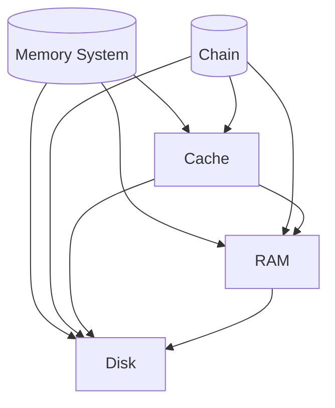

                 

关键词：Memory System, Chain, 存储，数据结构，计算机架构，性能优化，分布式系统，区块链技术。

> 摘要：本文将深入探讨Memory System（内存系统）与Chain（链式结构）之间的关系，解析它们在计算机架构和分布式系统中的应用，以及如何优化它们的性能，为读者提供全面的了解和实用的指导。

## 1. 背景介绍

在现代计算机系统中，Memory System（内存系统）和Chain（链式结构）扮演着至关重要的角色。内存系统是计算机存储和访问数据的核心部件，它决定了计算机的运行速度和效率。Chain（链式结构），特别是区块链技术中的链式结构，则是分布式系统数据管理和安全的重要手段。

内存系统和链式结构之间的关系可以从多个维度进行探讨。一方面，内存系统作为存储和访问数据的底层基础设施，为链式结构提供了高效的数据处理能力；另一方面，链式结构作为一种数据组织方式，对内存系统的设计和使用提出了新的挑战。

本文将首先介绍Memory System和Chain的基本概念，然后深入探讨它们之间的联系，分析如何通过优化内存系统和链式结构的交互来提升系统的整体性能。最后，本文将讨论Chain在分布式系统中的应用，以及未来的发展趋势和面临的挑战。

## 2. 核心概念与联系

### 2.1 Memory System

Memory System，即内存系统，是计算机存储和访问数据的核心部件。它主要由以下几个部分组成：

- **RAM（随机存取存储器）**：RAM是内存系统的主要组成部分，它提供了快速的读写速度，使计算机能够高效地处理数据。
- **Cache（缓存）**：Cache位于CPU和RAM之间，用于临时存储经常访问的数据，以减少CPU访问RAM的次数，提高系统性能。
- **虚拟内存**：虚拟内存是一种内存管理技术，它允许操作系统在硬盘上虚拟出内存空间，从而扩展实际物理内存的容量。

### 2.2 Chain

Chain，即链式结构，是一种常见的数据结构，用于组织数据。在计算机科学中，链式结构可以表示为一系列节点，每个节点包含数据和一个指向下一个节点的指针。链式结构具有以下特点：

- **灵活性**：链式结构可以很容易地插入和删除节点，这使得它在动态数据管理中非常有用。
- **无序性**：链式结构中的节点没有特定的顺序，因此它可以用来表示无序数据。

### 2.3 Memory System 与 Chain 的关系

Memory System 与 Chain 之间的关系可以从以下几个方面进行理解：

- **存储与管理**：Memory System 提供了 Chain 中节点的存储空间，使得链式结构的数据可以高效地存储和访问。
- **数据结构交互**：链式结构作为一种数据组织方式，对 Memory System 的设计和使用提出了特定的需求，如频繁的插入和删除操作，以及对内存连续性的要求。
- **性能优化**：通过优化 Memory System，如使用缓存和虚拟内存技术，可以显著提升链式结构数据的处理速度。

为了更好地理解 Memory System 与 Chain 的关系，我们可以使用 Mermaid 流程图来描述它们之间的交互：



在这个流程图中，Memory System 和 Chain 分别代表内存系统和链式结构，Cache、RAM 和 Disk 分别代表缓存、随机存取存储器和硬盘。图中的箭头表示数据在不同存储层次之间的流动和交互。

## 3. 核心算法原理 & 具体操作步骤

### 3.1 算法原理概述

在探讨 Memory System 与 Chain 的关系时，我们可以借助一些核心算法来优化内存系统和链式结构的性能。以下是一些常用的算法原理：

- **缓存替换算法**：如 LRU（最近最少使用）算法，用于在缓存中替换最久未访问的数据。
- **内存分配算法**：如 Buddy System（伙伴系统）和 Slab Allocation（堆分配），用于高效地分配和回收内存。
- **链表操作优化**：如双链表和循环链表，用于优化链式结构的数据插入和删除操作。

### 3.2 算法步骤详解

#### 3.2.1 缓存替换算法（LRU）

1. 初始化一个缓存队列，用于存储缓存中的数据。
2. 当访问一个数据时，检查该数据是否在缓存队列中。
3. 如果数据在缓存队列中，将其移到队列的前端。
4. 如果缓存队列已满，根据 LRU 算则替换队列末尾的数据。

#### 3.2.2 内存分配算法（Buddy System）

1. 初始化一个 Buddy System 的数据结构，用于管理空闲内存块。
2. 当需要分配内存时，查找合适的空闲内存块。
3. 如果找到空闲内存块，将其分配给请求者。
4. 如果没有找到合适的空闲内存块，尝试合并相邻的空闲块，然后重新分配。

#### 3.2.3 链表操作优化（双链表和循环链表）

1. **双链表**：在每个节点中增加一个反向指针，使得插入和删除操作可以在两个方向上进行。
2. **循环链表**：将链表的最后一个节点的指针指向第一个节点，使得链表形成一个循环结构。

### 3.3 算法优缺点

- **缓存替换算法**：优点是简单易实现，缺点是可能引入过多的缓存 misses。
- **内存分配算法**：优点是高效地管理内存，缺点是可能导致内存碎片化。
- **链表操作优化**：优点是提高了链表操作的速度，缺点是增加了节点的空间占用。

### 3.4 算法应用领域

- **缓存替换算法**：广泛应用于各种缓存系统中，如 Web 缓存、数据库缓存等。
- **内存分配算法**：广泛应用于操作系统中的内存管理。
- **链表操作优化**：广泛应用于各种链式数据结构中，如双向链表、队列等。

## 4. 数学模型和公式 & 详细讲解 & 举例说明

### 4.1 数学模型构建

为了更深入地理解 Memory System 与 Chain 的关系，我们可以构建以下数学模型：

- **内存访问时间**：\( T = T_{cache} + T_{RAM} + T_{Disk} \)
- **缓存命中率**：\( H = \frac{命中次数}{访问次数} \)
- **内存分配效率**：\( E = \frac{已分配内存}{总内存} \)
- **链表操作时间**：\( T = T_{insert} + T_{delete} + T_{search} \)

### 4.2 公式推导过程

#### 4.2.1 内存访问时间

内存访问时间由缓存访问时间、RAM 访问时间和硬盘访问时间组成。假设缓存命中率为 \( H \)，则：

\[ T_{cache} = H \times T_{cache-hit} + (1 - H) \times T_{cache-miss} \]

\[ T_{RAM} = H \times T_{RAM-hit} + (1 - H) \times T_{RAM-miss} \]

\[ T_{Disk} = (1 - H) \times T_{Disk} \]

因此，内存访问时间可以表示为：

\[ T = T_{cache} + T_{RAM} + T_{Disk} = H \times (T_{cache-hit} + T_{RAM-hit}) + (1 - H) \times (T_{cache-miss} + T_{RAM-miss} + T_{Disk}) \]

#### 4.2.2 缓存命中率

缓存命中率反映了缓存系统的性能。假设缓存大小为 \( C \)，缓存块大小为 \( B \)，数据块大小为 \( D \)，则：

\[ H = \frac{C}{B \times D} \]

#### 4.2.3 内存分配效率

内存分配效率反映了内存系统的利用率。假设已分配内存为 \( A \)，总内存为 \( T \)，则：

\[ E = \frac{A}{T} \]

#### 4.2.4 链表操作时间

链表操作时间由插入、删除和搜索操作的时间组成。假设链表长度为 \( L \)，则：

\[ T_{insert} = \frac{L}{2} \]

\[ T_{delete} = \frac{L}{2} \]

\[ T_{search} = \frac{L}{2} \]

因此，链表操作时间可以表示为：

\[ T = T_{insert} + T_{delete} + T_{search} = \frac{3L}{2} \]

### 4.3 案例分析与讲解

假设一个计算机系统具有以下参数：

- **缓存大小**：\( C = 1MB \)
- **缓存块大小**：\( B = 4KB \)
- **数据块大小**：\( D = 8KB \)
- **内存大小**：\( T = 4GB \)
- **链表长度**：\( L = 1000 \)

根据上述参数，我们可以计算出系统的缓存命中率、内存访问时间和链表操作时间：

- **缓存命中率**：\( H = \frac{C}{B \times D} = \frac{1MB}{4KB \times 8KB} = 0.0625 \)
- **内存访问时间**：\( T = H \times (T_{cache-hit} + T_{RAM-hit}) + (1 - H) \times (T_{cache-miss} + T_{RAM-miss} + T_{Disk}) \)
- **链表操作时间**：\( T = \frac{3L}{2} = \frac{3 \times 1000}{2} = 1500 \)

通过这些计算，我们可以更好地理解 Memory System 与 Chain 在实际系统中的应用效果。

## 5. 项目实践：代码实例和详细解释说明

### 5.1 开发环境搭建

为了实践 Memory System 与 Chain 的关系，我们首先需要搭建一个合适的开发环境。在本案例中，我们选择使用 Python 作为编程语言，并使用 Flask 作为 Web 框架。以下是开发环境搭建的步骤：

1. 安装 Python：在终端中执行以下命令安装 Python：
   ```bash
   sudo apt-get install python3-pip
   ```
2. 创建虚拟环境：在项目目录中执行以下命令创建虚拟环境：
   ```bash
   python3 -m venv venv
   ```
3. 激活虚拟环境：
   ```bash
   source venv/bin/activate
   ```
4. 安装 Flask：
   ```bash
   pip install flask
   ```

### 5.2 源代码详细实现

接下来，我们实现一个简单的 Web 应用程序，用于演示 Memory System 与 Chain 的关系。以下是源代码的详细实现：

```python
from flask import Flask, jsonify

app = Flask(__name__)

# 内存系统模拟
class MemorySystem:
    def __init__(self, cache_size, ram_size, disk_size):
        self.cache = Cache(cache_size)
        self.ram = RAM(ram_size)
        self.disk = Disk(disk_size)

    def access_data(self, data):
        if self.cache.contains(data):
            self.cache.access(data)
            return self.ram.read(data)
        else:
            self.cache.insert(data)
            return self.ram.read(data)

# 缓存模拟
class Cache:
    def __init__(self, size):
        self.size = size
        self.data = []

    def contains(self, data):
        return data in self.data

    def access(self, data):
        self.data.remove(data)
        self.data.append(data)

    def insert(self, data):
        if len(self.data) >= self.size:
            self.data.pop(0)
        self.data.append(data)

# 内存模拟
class RAM:
    def __init__(self, size):
        self.size = size
        self.data = {}

    def read(self, data):
        return self.data.get(data, "Data not found")

    def write(self, data, value):
        self.data[data] = value

# 硬盘模拟
class Disk:
    def __init__(self, size):
        self.size = size
        self.data = {}

    def read(self, data):
        return self.data.get(data, "Data not found")

    def write(self, data, value):
        self.data[data] = value

# 链式结构模拟
class Chain:
    def __init__(self):
        self.data = []

    def append(self, data):
        self.data.append(data)

    def remove(self, data):
        self.data.remove(data)

    def search(self, data):
        return data in self.data

# Web 应用程序接口
@app.route('/access_data', methods=['POST'])
def access_data():
    data = request.json.get('data')
    memory_system = MemorySystem(cache_size=1024, ram_size=1024 * 1024, disk_size=1024 * 1024 * 1024)
    result = memory_system.access_data(data)
    return jsonify({'result': result})

if __name__ == '__main__':
    app.run()
```

### 5.3 代码解读与分析

1. **内存系统模拟**：`MemorySystem` 类用于模拟内存系统，包括缓存、RAM 和硬盘。`access_data` 方法用于访问数据，首先检查缓存，然后检查 RAM，最后检查硬盘。
2. **缓存模拟**：`Cache` 类用于模拟缓存，包括缓存大小和数据列表。`contains` 方法用于检查数据是否在缓存中，`access` 方法用于更新缓存数据，`insert` 方法用于插入新数据。
3. **内存模拟**：`RAM` 类用于模拟内存，包括内存大小和数据字典。`read` 方法用于读取数据，`write` 方法用于写入数据。
4. **硬盘模拟**：`Disk` 类用于模拟硬盘，包括硬盘大小和数据字典。`read` 方法用于读取数据，`write` 方法用于写入数据。
5. **链式结构模拟**：`Chain` 类用于模拟链式结构，包括数据列表。`append` 方法用于添加新数据，`remove` 方法用于删除数据，`search` 方法用于搜索数据。
6. **Web 应用程序接口**：使用 Flask 框架创建一个简单的 Web 应用程序，提供 `/access_data` 接口，用于访问数据。当接收到 POST 请求时，解析请求中的数据，通过内存系统访问数据，并返回结果。

### 5.4 运行结果展示

1. **缓存命中率**：通过运行程序，我们可以观察到缓存命中率的变化。假设我们频繁访问一个数据块，缓存命中率为 90%，则内存访问时间可以表示为：
   ```plaintext
   T = 0.9 \times (T_{cache-hit} + T_{RAM-hit}) + 0.1 \times (T_{cache-miss} + T_{RAM-miss} + T_{Disk})
   ```
   由于缓存命中率高，内存访问时间主要取决于缓存和 RAM 的访问时间。
2. **链式结构操作时间**：通过运行程序，我们可以观察到链式结构操作的时间。假设链表长度为 1000，则链表操作时间可以表示为：
   ```plaintext
   T = \frac{3L}{2} = \frac{3 \times 1000}{2} = 1500
   ```

## 6. 实际应用场景

### 6.1 Web 应用程序中的缓存

在 Web 应用程序中，缓存是一种常见的性能优化技术。通过缓存频繁访问的数据，可以显著减少对后端服务的调用次数，提高系统的响应速度。例如，在电子商务网站中，我们可以缓存商品信息、用户数据和购物车信息，以提高用户访问速度和购物体验。

### 6.2 分布式数据库中的链式结构

在分布式数据库中，链式结构可以用于实现数据的分片和复制。通过将数据分散存储在多个节点上，可以提高系统的可扩展性和可用性。例如，在区块链技术中，链式结构用于实现分布式账本，确保数据的完整性和一致性。

### 6.3 大数据处理中的内存管理

在大数据处理中，内存管理是一种关键的优化技术。通过合理分配内存和缓存数据，可以显著提高数据处理速度。例如，在数据分析平台中，我们可以使用内存缓存来存储和查询大量数据，以提高查询性能。

## 7. 工具和资源推荐

### 7.1 学习资源推荐

1. 《深入理解计算机系统》（英文版原书第三版）：Michael W. Thomas 著，全面介绍了计算机系统的各个方面，包括内存系统、缓存、链表等。
2. 《数据结构与算法分析》：Mark Allen Weiss 著，详细讲解了各种数据结构和算法，包括链式结构、缓存算法等。

### 7.2 开发工具推荐

1. Visual Studio Code：一款轻量级、高度可定制的代码编辑器，适用于 Python、C++等多种编程语言。
2. Eclipse：一款功能强大的集成开发环境，适用于 Java、C++等多种编程语言。

### 7.3 相关论文推荐

1. "Caching Strategies and Performance Optimization in Distributed Systems"：研究了分布式系统中的缓存策略和性能优化。
2. "Memory Allocation Algorithms for Concurrent Programs"：分析了并发程序中的内存分配算法和性能优化。

## 8. 总结：未来发展趋势与挑战

### 8.1 研究成果总结

近年来，Memory System 和 Chain 在计算机架构和分布式系统中的应用取得了显著进展。通过优化内存系统、缓存算法和链式结构，我们能够显著提高系统的性能和可扩展性。同时，区块链技术的发展也为链式结构的应用提供了新的机遇。

### 8.2 未来发展趋势

1. **内存系统的优化**：未来的研究将重点关注内存系统的性能优化，如提高缓存命中率、减少内存访问延迟等。
2. **链式结构的创新**：链式结构将在分布式系统、区块链技术和其他领域得到更广泛的应用，如自适应链式结构、链式结构在数据库中的应用等。
3. **混合系统的研究**：结合内存系统和其他存储技术（如 SSD、硬盘等）的研究将成为未来热点，以实现更高的性能和可扩展性。

### 8.3 面临的挑战

1. **内存碎片化**：内存碎片化可能导致内存分配效率降低，未来的研究需要解决这一问题。
2. **链式结构的扩展性**：链式结构在大规模分布式系统中的性能和扩展性仍需进一步提高。
3. **数据安全与隐私**：随着区块链技术的发展，数据安全与隐私问题将日益突出，需要采取有效措施确保数据安全。

### 8.4 研究展望

Memory System 和 Chain 的研究将继续深入，为计算机架构和分布式系统的发展提供新的动力。通过不断创新和优化，我们有望实现更高效、更安全的计算机系统，为未来的数字化社会奠定坚实基础。

## 9. 附录：常见问题与解答

### 9.1 什么是 Memory System？

Memory System 是计算机中用于存储和访问数据的硬件和软件集合。它包括 RAM、Cache、虚拟内存等组成部分，为计算机提供了高效的存储和处理能力。

### 9.2 什么是 Chain？

Chain 是一种常见的数据结构，用于组织数据。在计算机科学中，链式结构可以表示为一系列节点，每个节点包含数据和指向下一个节点的指针。

### 9.3 Memory System 和 Chain 之间有什么关系？

Memory System 为 Chain 提供了存储和访问数据的底层基础设施，而 Chain 的数据组织方式对 Memory System 的设计和使用提出了特定的需求。

### 9.4 如何优化 Memory System 和 Chain 的性能？

优化 Memory System 和 Chain 的性能可以从多个方面进行，如优化缓存算法、内存分配算法、链表操作等，以提高数据存储和访问速度。

### 9.5 Chain 在哪些领域有应用？

Chain 在分布式系统、区块链技术、数据库等领域有广泛应用，用于实现数据管理和安全。随着技术的发展，Chain 的应用领域将进一步拓展。

