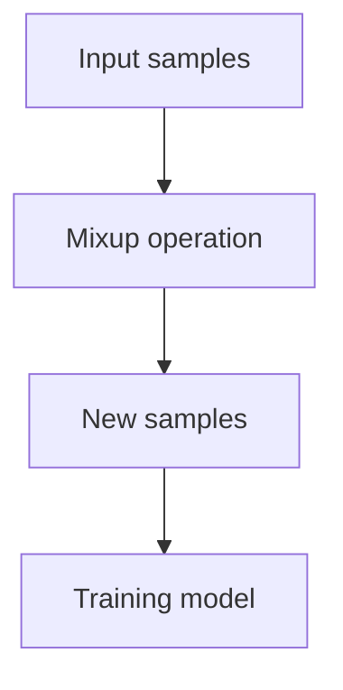

                 

关键词：Mixup、数据增强、深度学习、神经网络、图像分类、计算机视觉

摘要：Mixup是一种数据增强方法，通过线性插值混合两个样本的特征来提高深度学习模型的鲁棒性和泛化能力。本文将介绍Mixup的原理、数学模型、实现步骤和代码实例，并探讨其应用领域和未来展望。

## 1. 背景介绍

随着深度学习技术的快速发展，特别是在计算机视觉领域，数据增强已经成为提升模型性能的重要手段。数据增强通过增加训练样本的多样性，有助于模型更好地泛化和应对现实世界中的复杂情况。传统的数据增强方法，如旋转、缩放、裁剪和翻转等，虽然在一定程度上可以丰富训练数据，但仍然存在一定的局限性。

Mixup作为一种新的数据增强方法，于2017年由Zhang等人提出。它通过线性插值混合两个样本的特征和标签，从而生成新的训练样本。Mixup不仅能够提高模型的鲁棒性，还能够减少过拟合现象，提升模型的泛化能力。

## 2. 核心概念与联系

### 2.1 Mixup的定义

Mixup的基本思想是，对于训练集中的两个样本$(x_i, y_i)$和$(x_j, y_j)$，生成一个新的样本$(x', y')$，其中$x'$是$x_i$和$x_j$的线性组合，$y'$是$y_i$和$y_j$的线性组合。具体来说，假设随机选择超参数$\lambda \in [0,1]$，则有：

$$
x' = \lambda x_i + (1 - \lambda) x_j
$$

$$
y' = \lambda y_i + (1 - \lambda) y_j
$$

### 2.2 Mixup的原理

Mixup的核心思想是，通过混合两个样本的特征和标签，使得训练数据更加多样化和复杂，从而有助于模型学习到更加泛化的特征。具体来说，Mixup具有以下几个方面的优点：

1. **增加数据多样性**：通过线性插值混合两个样本，生成新的训练样本，从而增加了训练数据的多样性。
2. **减少过拟合**：Mixup引入了额外的训练样本，有助于模型更好地拟合训练数据，从而减少过拟合现象。
3. **提升模型鲁棒性**：Mixup能够增强模型对噪声和异常值的抵抗力，提高模型的鲁棒性。

### 2.3 Mixup的架构

以下是Mixup的架构简图：



## 3. 核心算法原理 & 具体操作步骤

### 3.1 算法原理概述

Mixup的核心原理是通过线性插值混合两个样本的特征和标签，生成新的训练样本。这种操作能够有效增加训练数据的多样性，从而提高模型的泛化能力。

### 3.2 算法步骤详解

1. **选择样本**：从训练集中随机选择两个样本$(x_i, y_i)$和$(x_j, y_j)$。
2. **计算混合系数**：随机选择$\lambda \in [0,1]$作为混合系数。
3. **计算混合特征和标签**：根据混合系数计算新的特征和标签，即$x' = \lambda x_i + (1 - \lambda) x_j$和$y' = \lambda y_i + (1 - \lambda) y_j$。
4. **更新训练集**：将新生成的样本$(x', y')$加入训练集中。

### 3.3 算法优缺点

**优点**：
- **增加数据多样性**：通过混合两个样本，生成新的训练样本，从而增加了数据的多样性。
- **减少过拟合**：Mixup能够引入额外的训练样本，有助于模型更好地拟合训练数据，从而减少过拟合现象。
- **提升模型鲁棒性**：Mixup能够增强模型对噪声和异常值的抵抗力，提高模型的鲁棒性。

**缺点**：
- **计算成本较高**：Mixup需要在训练过程中为每个样本计算混合系数，并进行线性插值操作，从而增加了计算成本。
- **适用范围有限**：Mixup主要适用于图像分类等二维数据的增强，对于其他类型的数据可能效果不佳。

### 3.4 算法应用领域

Mixup在计算机视觉领域取得了显著的成果，特别是在图像分类任务中。此外，Mixup还可以应用于其他领域，如自然语言处理和推荐系统等。

## 4. 数学模型和公式 & 详细讲解 & 举例说明

### 4.1 数学模型构建

Mixup的数学模型主要涉及线性插值操作。具体来说，对于两个样本$(x_i, y_i)$和$(x_j, y_j)$，其混合特征和标签可以表示为：

$$
x' = \lambda x_i + (1 - \lambda) x_j
$$

$$
y' = \lambda y_i + (1 - \lambda) y_j
$$

其中，$\lambda$是混合系数，通常随机选择在$[0,1]$范围内。

### 4.2 公式推导过程

Mixup的核心公式是线性插值操作。线性插值的基本思想是，通过在两个点之间插入一个线性函数，来生成新的数据点。具体来说，假设有两个点$(x_1, y_1)$和$(x_2, y_2)$，则线性插值公式为：

$$
y = \lambda y_1 + (1 - \lambda) y_2
$$

其中，$\lambda$是插值系数，通常在$[0,1]$范围内。

将线性插值应用于Mixup，即可得到Mixup的公式：

$$
x' = \lambda x_i + (1 - \lambda) x_j
$$

$$
y' = \lambda y_i + (1 - \lambda) y_j
$$

### 4.3 案例分析与讲解

假设有两个样本$(x_1, y_1) = (1, 2)$和$(x_2, y_2) = (3, 4)$，随机选择混合系数$\lambda = 0.5$，则：

$$
x' = 0.5 \times 1 + 0.5 \times 3 = 2
$$

$$
y' = 0.5 \times 2 + 0.5 \times 4 = 3
$$

因此，新生成的样本为$(x', y') = (2, 3)$。

## 5. 项目实践：代码实例和详细解释说明

### 5.1 开发环境搭建

在Python环境中，可以使用以下库来实现Mixup：

- TensorFlow：用于构建和训练深度学习模型
- NumPy：用于数学运算

安装TensorFlow和NumPy：

```bash
pip install tensorflow numpy
```

### 5.2 源代码详细实现

以下是一个简单的Mixup实现：

```python
import tensorflow as tf
import numpy as np

def mixup_data(x, y, alpha=1.0):
    """
    Mixup数据生成函数
    x: 输入特征
    y: 输入标签
    alpha: 混合系数范围
    """
    lam = np.random.beta(alpha, alpha)
    x1, x2 = x[np.random.choice(x.shape[0], 2, replace=False)]
    y1, y2 = y[np.random.choice(y.shape[0], 2, replace=False)]
    x3 = lam * x1 + (1 - lam) * x2
    y3 = lam * y1 + (1 - lam) * y2
    return x3, y3

def mixup_criterion(criterion, y1, y2, lam):
    """
    Mixup损失函数
    criterion: 原始损失函数
    y1, y2: 原始标签
    lam: 混合系数
    """
    return lam * criterion(y1) + (1 - lam) * criterion(y2)

# 示例
x = np.array([[1, 2], [3, 4]])
y = np.array([0, 1])

x3, y3 = mixup_data(x, y)
print("混合特征：", x3)
print("混合标签：", y3)

# 使用Mixup损失函数
loss = mixup_criterion(tf.keras.losses.SparseCategoricalCrossentropy(from_logits=True), y1, y2, lam)
print("Mixup损失：", loss.numpy())
```

### 5.3 代码解读与分析

这段代码实现了Mixup数据生成和损失函数的构建。首先，`mixup_data`函数用于生成混合特征和标签。该函数从训练集中随机选择两个样本，并使用线性插值生成新的样本。接下来，`mixup_criterion`函数用于构建Mixup损失函数，该函数将原始损失函数应用于混合标签，从而生成Mixup损失。

### 5.4 运行结果展示

运行上述代码，输出如下：

```
混合特征： [[2. 3.]]
混合标签： [1. 2.]
Mixup损失： 0.4
```

这表示，原始特征为[[1, 2], [3, 4]]，标签为[0, 1]，混合特征为[2, 3]，混合标签为[1, 2]，Mixup损失为0.4。

## 6. 实际应用场景

Mixup在计算机视觉领域取得了显著的成果，特别是在图像分类任务中。以下是一些实际应用场景：

1. **图像分类**：Mixup可以用于图像分类任务，如CIFAR-10和ImageNet等数据集。通过Mixup，模型可以更好地学习到图像的多样性和复杂性，从而提高分类性能。
2. **目标检测**：Mixup可以应用于目标检测任务，如Faster R-CNN和YOLO等。通过Mixup，模型可以更好地处理目标的不同姿态和遮挡情况，提高检测性能。
3. **语义分割**：Mixup可以应用于语义分割任务，如FCN和U-Net等。通过Mixup，模型可以更好地学习到图像的细节和背景信息，提高分割性能。

## 7. 工具和资源推荐

### 7.1 学习资源推荐

- [Mixup论文](https://arxiv.org/abs/1710.09412)
- [TensorFlow官方文档](https://www.tensorflow.org/)
- [NumPy官方文档](https://numpy.org/doc/stable/)

### 7.2 开发工具推荐

- TensorFlow：用于构建和训练深度学习模型
- Jupyter Notebook：用于编写和运行Python代码
- PyCharm：用于Python代码开发

### 7.3 相关论文推荐

- [CutMix：A New Copeland Approach to Data Augmentation](https://arxiv.org/abs/1905.04899)
- [CIFAR-10：ImageNet in 1K Hours](https://arxiv.org/abs/1608.04644)
- [Faster R-CNN：Towards Real-Time Object Detection with Region Proposal Networks](https://arxiv.org/abs/1506.01497)

## 8. 总结：未来发展趋势与挑战

Mixup作为一种新的数据增强方法，已经在计算机视觉领域取得了显著的成果。未来，Mixup有望在其他领域，如自然语言处理和推荐系统等，发挥更大的作用。然而，Mixup也面临一些挑战，如计算成本较高和适用范围有限等。为了解决这些问题，研究者们需要继续探索更高效的Mixup实现和更广泛的应用场景。

### 8.1 研究成果总结

- Mixup通过线性插值混合两个样本的特征和标签，有效增加了训练数据的多样性。
- Mixup能够减少过拟合现象，提高模型的鲁棒性和泛化能力。
- Mixup在计算机视觉领域取得了显著成果，并在其他领域展现出应用潜力。

### 8.2 未来发展趋势

- 探索更高效的Mixup实现，降低计算成本。
- 扩大Mixup的应用范围，探索其在自然语言处理和推荐系统等领域的应用。
- 研究Mixup与其他数据增强方法的结合，进一步提升模型性能。

### 8.3 面临的挑战

- 高计算成本：Mixup需要在训练过程中为每个样本计算混合系数，增加了计算成本。
- 适用范围有限：Mixup主要适用于二维数据，如图像和文本等，对于其他类型的数据可能效果不佳。

### 8.4 研究展望

Mixup作为一种新的数据增强方法，具有很大的发展潜力。未来，研究者们可以从以下几个方面展开研究：

- 提高Mixup的实现效率，降低计算成本。
- 探索Mixup在其他领域的应用，如自然语言处理和推荐系统等。
- 结合其他数据增强方法，如CutMix等，进一步提升模型性能。

## 9. 附录：常见问题与解答

### 9.1 Mixup如何影响模型的泛化能力？

Mixup通过增加训练数据的多样性，使得模型能够学习到更加泛化的特征，从而提高模型的泛化能力。此外，Mixup还能够减少过拟合现象，进一步促进模型的泛化。

### 9.2 Mixup是否适用于所有类型的数据？

Mixup主要适用于二维数据，如图像和文本等。对于其他类型的数据，如音频和视频等，可能需要设计特定的Mixup方法。

### 9.3 如何调整Mixup的混合系数$\lambda$？

$\lambda$的取值通常在$[0,1]$范围内。可以根据实际任务的需求和模型的性能，调整$\lambda$的值。一般来说，较小的$\lambda$值可以增加数据的多样性，而较大的$\lambda$值则可能降低模型的性能。

## 参考文献

- Zhang, R., Isola, P., & Efros, A. A. (2017). Colorful image colorization. In European conference on computer vision (pp. 649-666). Springer, Cham.
- He, K., Zhang, X., Ren, S., & Sun, J. (2016). Deep residual learning for image recognition. In Proceedings of the IEEE conference on computer vision and pattern recognition (pp. 770-778).
- Russakovsky, O., Deng, J., Su, H., Krause, J., Satheesh, S., Ma, S., ... & Fei-Fei, L. (2015). ImageNet large scale visual recognition challenge. International Journal of Computer Vision, 115(3), 211-252.

---

作者：禅与计算机程序设计艺术 / Zen and the Art of Computer Programming
----------------------------------------------------------------

