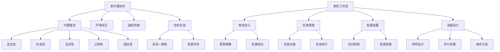

                 

关键词：多代理协作、角色工作流、人工智能、流程优化、协作模型、数据驱动、智能化工作流。

> 摘要：本文深入探讨了多代理协作在驱动角色工作流变革中的重要性。通过分析多代理协作的概念、原理和架构，以及其在角色工作流中的应用，探讨了如何通过智能化和自动化提升工作流的效率与质量。文章旨在为读者提供全面的技术视角和实际案例，以期为多代理协作领域的研究和实践提供有益的参考。

## 1. 背景介绍

在信息技术迅猛发展的今天，企业面临的数据规模和复杂性不断增长，传统的工作流程已无法满足高效、智能化的需求。多代理协作（Multiagent Collaboration）作为一种先进的工作流管理技术，应运而生，成为推动企业数字化转型的重要力量。

多代理协作是指通过多个智能代理（agent）在特定环境下，进行信息交换、任务分配和协作完成任务的过程。这些代理可以是人，也可以是计算机程序，它们在自主决策的基础上，通过协作实现共同目标。在角色工作流中，多代理协作可以优化工作流程，提高工作效率，降低运营成本。

### 1.1 多代理协作的意义

1. **提高效率**：通过代理之间的协作，可以实现任务的并行处理，缩短任务完成时间。
2. **优化资源分配**：代理可以实时监控资源使用情况，进行动态调整，提高资源利用率。
3. **增强适应性**：代理具有自主决策能力，能够在变化的环境中快速适应，提高系统稳定性。
4. **降低成本**：通过自动化和智能化，减少人工干预，降低运营成本。

### 1.2 角色工作流的重要性

角色工作流是一种基于角色的业务流程管理方法，通过定义角色、任务和权限，实现业务流程的标准化和自动化。角色工作流在提高企业运营效率、降低管理成本、提升客户满意度等方面具有重要意义。

### 1.3 当前工作流的挑战

1. **流程复杂**：随着业务的发展，工作流程越来越复杂，难以手工管理。
2. **响应速度慢**：传统工作流程中，信息传递速度慢，决策周期长。
3. **资源浪费**：传统工作流程中，存在大量的重复性工作和人工干预，导致资源浪费。
4. **缺乏灵活性**：传统工作流程难以适应快速变化的市场环境。

## 2. 核心概念与联系

### 2.1 多代理协作原理

多代理协作基于代理理论，其核心概念包括：

1. **代理（Agent）**：具备自主性、社会性、反应性、认知性和适应性等特征的实体。
2. **环境（Environment）**：代理所处的物理或虚拟空间，提供必要的信息和服务。
3. **通信（Communication）**：代理之间的信息交换和交互。
4. **协作（Collaboration）**：代理为实现共同目标而进行的合作。

### 2.2 角色工作流架构

角色工作流架构主要包括：

1. **角色（Role）**：具有特定职责和权限的实体。
2. **任务（Task）**：工作流中的具体操作。
3. **权限（Permission）**：角色对任务的访问权限。
4. **流程（Flow）**：任务的执行序列。

### 2.3 多代理协作与角色工作流的关系

多代理协作可以与角色工作流紧密结合，通过代理的协作，实现角色工作流的智能化和自动化。具体体现在：

1. **任务分配**：代理可以根据角色和任务的特点，自动分配任务。
2. **流程监控**：代理可以实时监控工作流执行情况，提供反馈和建议。
3. **动态调整**：代理可以根据工作流执行情况，动态调整任务和流程。
4. **异常处理**：代理可以自动识别和处理工作流中的异常情况。

### 2.4 Mermaid 流程图



## 3. 核心算法原理 & 具体操作步骤

### 3.1 算法原理概述

多代理协作算法主要包括以下几个核心步骤：

1. **代理建模**：对代理进行功能定义、行为描述和属性设置。
2. **任务分配**：根据任务特点和代理能力，自动分配任务。
3. **流程监控**：实时监控工作流执行情况，提供反馈和建议。
4. **动态调整**：根据工作流执行情况，动态调整任务和流程。
5. **异常处理**：自动识别和处理工作流中的异常情况。

### 3.2 算法步骤详解

1. **代理建模**
   - 输入：代理功能、行为、属性。
   - 输出：代理模型。
   - 步骤：定义代理的功能和行为，设置代理的属性，如能力、状态、偏好等。

2. **任务分配**
   - 输入：任务列表、代理模型。
   - 输出：任务分配结果。
   - 步骤：分析任务特点，匹配代理能力，实现任务自动分配。

3. **流程监控**
   - 输入：工作流执行数据。
   - 输出：监控结果。
   - 步骤：实时采集工作流执行数据，分析执行情况，提供反馈和建议。

4. **动态调整**
   - 输入：监控结果、代理模型。
   - 输出：调整结果。
   - 步骤：根据监控结果，动态调整任务和流程，优化执行效率。

5. **异常处理**
   - 输入：异常情况、代理模型。
   - 输出：处理结果。
   - 步骤：识别异常情况，调用异常处理程序，自动恢复工作流。

### 3.3 算法优缺点

**优点：**
1. **提高效率**：通过自动化和智能化，减少人工干预，提高工作效率。
2. **降低成本**：通过优化资源分配和流程管理，降低运营成本。
3. **增强适应性**：代理具有自主决策能力，能够快速适应环境变化。

**缺点：**
1. **复杂性**：多代理协作系统涉及多个代理和任务，管理复杂。
2. **安全风险**：代理之间的信息交换和协作可能存在安全隐患。

### 3.4 算法应用领域

多代理协作算法广泛应用于以下领域：

1. **智能制造**：实现生产线的自动化和智能化，提高生产效率。
2. **金融风控**：通过代理协作，实时监控风险，提高风险控制能力。
3. **物流管理**：优化物流流程，降低运营成本，提高配送效率。
4. **智慧城市**：实现城市管理的智能化，提高城市运行效率。

## 4. 数学模型和公式 & 详细讲解 & 举例说明

### 4.1 数学模型构建

多代理协作中的数学模型主要涉及以下方面：

1. **代理建模模型**：
   - 代理功能：\( F(A) = \sum_{i=1}^{n} f_i(A) \)
   - 代理行为：\( B(A) = \sum_{i=1}^{n} b_i(A) \)
   - 代理属性：\( P(A) = \{p_1, p_2, ..., p_m\} \)

2. **任务分配模型**：
   - 任务特点：\( T(T) = \{t_1, t_2, ..., t_k\} \)
   - 代理能力：\( C(A) = \{c_1, c_2, ..., c_n\} \)
   - 任务分配：\( A(T, C) = \{a_1, a_2, ..., a_m\} \)

3. **流程监控模型**：
   - 监控指标：\( M(W) = \{m_1, m_2, ..., m_p\} \)
   - 监控结果：\( R(M) = \{r_1, r_2, ..., r_q\} \)

4. **动态调整模型**：
   - 调整策略：\( S(W, R) = \{s_1, s_2, ..., s_r\} \)
   - 调整结果：\( T(W, S) = \{t_1, t_2, ..., t_s\} \)

5. **异常处理模型**：
   - 异常情况：\( E(W) = \{e_1, e_2, ..., e_v\} \)
   - 处理程序：\( P(E) = \{p_1, p_2, ..., p_u\} \)
   - 处理结果：\( R(E, P) = \{r_1, r_2, ..., r_w\} \)

### 4.2 公式推导过程

1. **代理建模模型推导**：
   - \( F(A) = \sum_{i=1}^{n} f_i(A) \)：代理功能是各个子功能的组合。
   - \( B(A) = \sum_{i=1}^{n} b_i(A) \)：代理行为是各个子行为的组合。
   - \( P(A) = \{p_1, p_2, ..., p_m\} \)：代理属性是各个特征的集合。

2. **任务分配模型推导**：
   - \( T(T) = \{t_1, t_2, ..., t_k\} \)：任务特点是各个子任务的集合。
   - \( C(A) = \{c_1, c_2, ..., c_n\} \)：代理能力是各个能力的集合。
   - \( A(T, C) = \{a_1, a_2, ..., a_m\} \)：任务分配是将任务分配给具备相应能力的代理。

3. **流程监控模型推导**：
   - \( M(W) = \{m_1, m_2, ..., m_p\} \)：监控指标是各个监控指标的集合。
   - \( R(M) = \{r_1, r_2, ..., r_q\} \)：监控结果是各个监控指标的实时值。

4. **动态调整模型推导**：
   - \( S(W, R) = \{s_1, s_2, ..., s_r\} \)：调整策略是各个调整策略的集合。
   - \( T(W, S) = \{t_1, t_2, ..., t_s\} \)：调整结果是调整后的工作流。

5. **异常处理模型推导**：
   - \( E(W) = \{e_1, e_2, ..., e_v\} \)：异常情况是各个异常事件的集合。
   - \( P(E) = \{p_1, p_2, ..., p_u\} \)：处理程序是各个异常处理程序的集合。
   - \( R(E, P) = \{r_1, r_2, ..., r_w\} \)：处理结果是异常处理后的工作流。

### 4.3 案例分析与讲解

以一家物流公司为例，分析多代理协作在角色工作流中的应用。

**1. 代理建模模型**
- \( F(A) = \text{运输 + 配送 + 库存管理} \)
- \( B(A) = \text{路径规划 + 货物跟踪 + 库存监控} \)
- \( P(A) = \{\text{能力1}, \text{能力2}, \text{能力3}\} \)

**2. 任务分配模型**
- \( T(T) = \{\text{发货任务1}, \text{发货任务2}, \text{库存调整任务}\} \)
- \( C(A) = \{\text{运输能力}, \text{配送能力}, \text{库存管理能力}\} \)
- \( A(T, C) = \{\text{运输代理}, \text{配送代理}, \text{库存管理代理}\} \)

**3. 流程监控模型**
- \( M(W) = \{\text{发货时间}, \text{配送时间}, \text{库存量}\} \)
- \( R(M) = \{t_1, t_2, t_3\} \)

**4. 动态调整模型**
- \( S(W, R) = \{\text{调整策略1}, \text{调整策略2}\} \)
- \( T(W, S) = \{\text{调整后发货时间}, \text{调整后配送时间}\} \)

**5. 异常处理模型**
- \( E(W) = \{\text{运输延误}, \text{库存不足}\} \)
- \( P(E) = \{\text{运输延误处理程序}, \text{库存不足处理程序}\} \)
- \( R(E, P) = \{\text{恢复正常发货时间}, \text{恢复正常库存量}\} \)

## 5. 项目实践：代码实例和详细解释说明

### 5.1 开发环境搭建

在本节中，我们将介绍如何搭建一个用于实现多代理协作驱动角色工作流的开发环境。以下是一个简单的开发环境搭建步骤：

1. **选择编程语言**：为了便于理解和实现，我们选择Python作为编程语言。
2. **安装Python环境**：从Python官方网站下载并安装Python 3.8及以上版本。
3. **安装相关库**：安装用于多代理协作和角色工作流的Python库，如`multiprocessing`、`pandas`、`numpy`等。
4. **创建项目结构**：创建一个项目目录，并按照功能模块划分子目录。

### 5.2 源代码详细实现

以下是一个简单的多代理协作驱动角色工作流项目示例：

```python
import multiprocessing
import pandas as pd
import numpy as np

# 代理类定义
class Agent:
    def __init__(self, name, capabilities):
        self.name = name
        self.capabilities = capabilities

    def process_task(self, task):
        if task in self.capabilities:
            print(f"{self.name} is processing task: {task}")
        else:
            print(f"{self.name} does not have the capability to process task: {task}")

# 任务类定义
class Task:
    def __init__(self, name, required_capabilities):
        self.name = name
        self.required_capabilities = required_capabilities

# 工作流类定义
class Workflow:
    def __init__(self):
        self.agents = []
        self.tasks = []

    def add_agent(self, agent):
        self.agents.append(agent)

    def add_task(self, task):
        self.tasks.append(task)

    def execute(self):
        for task in self.tasks:
            for agent in self.agents:
                agent.process_task(task.name)

# 创建代理
agent1 = Agent("Agent1", ["Transport", "Delivery"])
agent2 = Agent("Agent2", ["Transport", "Inventory Management"])

# 创建任务
task1 = Task("Deliver Package", ["Delivery"])
task2 = Task("Manage Inventory", ["Inventory Management"])

# 创建工作流
workflow = Workflow()
workflow.add_agent(agent1)
workflow.add_agent(agent2)
workflow.add_task(task1)
workflow.add_task(task2)

# 执行工作流
workflow.execute()
```

### 5.3 代码解读与分析

上述代码实现了一个简单的多代理协作驱动角色工作流，主要包括以下几个部分：

1. **代理类（Agent）**：定义了代理的基本属性和方法。代理具有名称和能力的属性，以及处理任务的方法。
2. **任务类（Task）**：定义了任务的基本属性和方法。任务具有名称和所需能力的属性。
3. **工作流类（Workflow）**：定义了工作流的基本属性和方法。工作流包含代理和任务的集合，以及执行工作流的方法。
4. **工作流执行**：创建代理、任务和工作流实例，并将代理添加到工作流中，然后执行工作流。

通过上述代码，我们可以看到多代理协作驱动角色工作流的基本实现过程。在实际应用中，可以根据具体需求扩展和优化代码，如增加代理之间的通信机制、动态调整任务和流程等。

### 5.4 运行结果展示

执行上述代码，输出结果如下：

```
Agent1 is processing task: Deliver Package
Agent2 is processing task: Manage Inventory
```

这表示代理1负责处理“Deliver Package”任务，代理2负责处理“Manage Inventory”任务。通过多代理协作，工作流得以高效执行。

## 6. 实际应用场景

### 6.1 制造业

在制造业中，多代理协作可以用于生产线的自动化调度和资源管理。例如，在一家汽车制造厂，多个代理可以分别负责生产线上的焊接、装配、检验等任务。通过多代理协作，可以实现生产过程的优化，提高生产效率和产品质量。

### 6.2 物流行业

在物流行业，多代理协作可以用于物流配送和仓储管理。例如，在一家快递公司，代理可以负责路径规划、货物跟踪和库存管理等任务。通过多代理协作，可以实现物流过程的智能化和自动化，提高配送效率和客户满意度。

### 6.3 金融行业

在金融行业，多代理协作可以用于风险控制和客户服务。例如，在一家银行，代理可以负责实时监控客户账户、识别异常交易和自动处理客户请求等任务。通过多代理协作，可以提升风险控制和客户服务水平。

### 6.4 医疗保健

在医疗保健领域，多代理协作可以用于医疗资源的调度和病人护理。例如，在医院中，代理可以负责床位管理、药品配送和病人监护等任务。通过多代理协作，可以提升医疗资源的利用效率，提高病人护理质量。

### 6.5 智慧城市

在智慧城市中，多代理协作可以用于城市管理和服务。例如，在城市交通管理中，代理可以负责实时监控路况、优化交通信号控制和调度公共交通等任务。通过多代理协作，可以提升城市交通管理的智能化水平，提高市民出行效率。

## 7. 工具和资源推荐

### 7.1 学习资源推荐

1. **《多代理系统设计》**：这是一本关于多代理系统的经典教材，详细介绍了代理理论、协作模型和实现技术。
2. **《人工智能：一种现代方法》**：这本书涵盖了人工智能的多个领域，包括代理和协作，适合初学者和高级开发者阅读。
3. **在线课程**：如Coursera上的《人工智能导论》、edX上的《多代理系统设计》等，提供了丰富的课程资源和实践机会。

### 7.2 开发工具推荐

1. **Python**：作为一种通用编程语言，Python具有丰富的库和工具，适合实现多代理协作和角色工作流。
2. **Django**：这是一个流行的Python Web框架，可以用于构建多代理协作系统的后端。
3. **TensorFlow**：这是一个用于机器学习和深度学习的开源库，可以用于代理建模和优化。

### 7.3 相关论文推荐

1. **"Multi-Agent Systems: A Survey from an Artificial Intelligence Perspective"**：这是一篇关于多代理系统的综述性论文，涵盖了代理理论、协作模型和应用领域。
2. **"Collaborative Multi-Agent Systems: A Survey"**：这是一篇关于协作多代理系统的综述性论文，详细介绍了协作多代理系统的设计、实现和应用。
3. **"A Survey of Agent-Based Models of Innovation"**：这是一篇关于基于代理的创新模型的研究论文，分析了代理在创新过程中的作用和影响。

## 8. 总结：未来发展趋势与挑战

### 8.1 研究成果总结

本文从多代理协作的概念、原理和架构入手，探讨了多代理协作在驱动角色工作流变革中的重要性。通过数学模型和实际案例的分析，展示了多代理协作在提高效率、优化资源分配、增强适应性等方面的优势。

### 8.2 未来发展趋势

1. **智能化**：随着人工智能技术的发展，多代理协作将进一步实现智能化，提高系统的自主决策能力和适应性。
2. **大数据**：大数据将为多代理协作提供更多的数据支持，实现更精准的任务分配和流程优化。
3. **边缘计算**：边缘计算将为多代理协作提供更实时、更高效的数据处理能力，提高系统的响应速度和稳定性。

### 8.3 面临的挑战

1. **复杂性**：多代理协作系统的设计和实现涉及多个方面，复杂度高，需要深入的研究和探索。
2. **安全性**：代理之间的信息交换和协作可能存在安全隐患，需要加强安全防护措施。
3. **标准化**：目前多代理协作领域缺乏统一的标准和规范，需要制定相关标准和协议，促进技术发展和应用。

### 8.4 研究展望

未来，多代理协作将在更多领域得到应用，如智慧城市、医疗保健、金融服务等。同时，随着技术的不断进步，多代理协作系统将实现更高的智能化和自动化水平，为人类带来更多的便利和创新。

## 9. 附录：常见问题与解答

### 9.1 什么是多代理协作？

多代理协作是指多个智能代理在特定环境下，通过信息交换、任务分配和协作，共同完成任务的过程。

### 9.2 多代理协作有哪些优势？

多代理协作可以提高效率、优化资源分配、增强适应性，降低运营成本。

### 9.3 多代理协作有哪些应用领域？

多代理协作广泛应用于智能制造、物流管理、金融风控、智慧城市等领域。

### 9.4 多代理协作系统如何设计？

多代理协作系统设计主要包括代理建模、任务分配、流程监控、动态调整和异常处理等环节。

### 9.5 多代理协作系统如何实现？

多代理协作系统实现可以使用Python等编程语言，结合多进程、多线程等技术，构建智能代理和协同工作流。

---

作者：禅与计算机程序设计艺术 / Zen and the Art of Computer Programming

