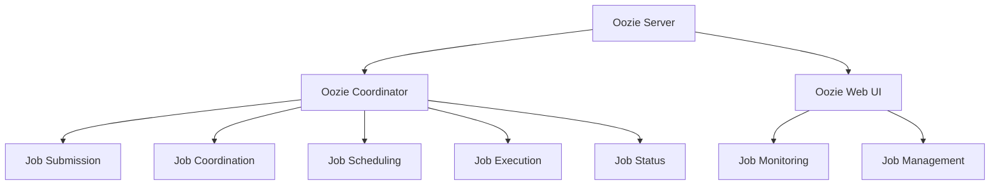

                 

关键词：Oozie、Coordinator、Hadoop、工作流管理、分布式系统、代码实例、架构设计、技术博客。

## 摘要

本文将深入探讨Oozie Coordinator的工作原理、架构设计以及实际应用。我们将通过一个详细的代码实例，讲解如何使用Oozie Coordinator构建和管理分布式工作流。文章还将讨论Oozie Coordinator的优势、局限性和未来发展趋势，为读者提供全面的参考。

## 1. 背景介绍

### Oozie简介

Oozie是一个开源的、基于Hadoop的工作流管理系统。它被设计用来协调和管理复杂的分布式计算任务，支持Hadoop生态系统中的各种组件，如MapReduce、Hive、Pig和Spark等。Oozie的主要目标是为大数据环境提供一个强大、灵活的工作流管理平台。

### Coordinator的作用

Coordinator是Oozie的核心组件之一，负责协调和管理工作流中的各个任务。它不仅能够定义任务的执行顺序，还能够处理任务的失败和重试。通过Coordinator，开发者可以轻松地创建、部署和管理复杂的工作流，提高生产效率。

### 为什么需要Coordinator

在分布式系统中，任务的调度和协调是一个复杂的过程。Coordinator能够简化这个流程，提供以下优势：

- **自动化**：Coordinator可以自动调度和执行任务，减少人工干预。
- **灵活性**：Coordinator支持多种任务类型和执行策略，适应不同的业务需求。
- **可靠性**：Coordinator能够处理任务的失败和重试，保证工作流的可靠性。

## 2. 核心概念与联系

为了更好地理解Oozie Coordinator的工作原理，我们需要了解几个核心概念和它们之间的联系。

### Oozie Coordinator架构图

以下是一个简化的Oozie Coordinator架构图：

```
+----------------+     +----------------+     +----------------+
|     Oozie Server      |     Oozie Coordinator   |    Oozie Web UI   |
+----------------+     +----------------+     +----------------+
       |                          |                          |
       | 1. Job Submission        | 2. Job Coordination       | 3. Job Monitoring |
       |                          |                          |
       | 4. Job Scheduling        | 5. Job Execution          | 6. Job Status     |
       |                          |                          |
       +-------------------------+-------------------------+
```

### 概念解释

1. **Oozie Server**：负责存储和工作流任务的执行。
2. **Oozie Coordinator**：负责工作流任务的调度和协调。
3. **Oozie Web UI**：提供了一个Web界面，用于监控和管理工作流任务。

### Mermaid流程图



## 3. 核心算法原理 & 具体操作步骤

### 3.1 算法原理概述

Oozie Coordinator的核心算法是基于图论的调度算法。它将工作流任务表示为一个有向无环图（DAG），并通过以下步骤调度任务：

1. **任务初始化**：读取工作流配置文件，初始化任务节点。
2. **任务依赖分析**：分析任务之间的依赖关系，构建任务调度图。
3. **任务调度**：根据任务调度图和执行策略，调度任务。
4. **任务执行**：执行任务，并将结果反馈给Coordinator。
5. **任务状态更新**：更新任务状态，包括成功、失败、等待等。

### 3.2 算法步骤详解

1. **任务初始化**：
   ```bash
   # 读取工作流配置文件
   oozie job init -config workflow.xml
   ```

2. **任务依赖分析**：
   ```mermaid
   graph TB
   A[Task1] --> B[Task2]
   A --> C[Task3]
   B --> D[Task4]
   C --> D
   ```

3. **任务调度**：
   ```bash
   # 调度任务
   oozie job launch -config workflow.xml
   ```

4. **任务执行**：
   ```bash
   # 查看任务执行日志
   oozie job -status job_id
   ```

5. **任务状态更新**：
   ```bash
   # 更新任务状态
   oozie job -action update -status completed job_id
   ```

### 3.3 算法优缺点

#### 优点：

- **灵活**：支持多种任务类型和执行策略。
- **高效**：基于图论的调度算法，优化了任务执行顺序。
- **可靠**：处理任务的失败和重试，保证工作流的可靠性。

#### 缺点：

- **复杂性**：调度算法较为复杂，需要一定的编程技能。
- **依赖性**：依赖Hadoop生态系统，对其他组件的兼容性要求较高。

### 3.4 算法应用领域

Oozie Coordinator广泛应用于大数据环境，如数据集成、数据分析和数据挖掘等。以下是一些具体的应用领域：

- **数据集成**：处理大量数据源的数据抽取、转换和加载。
- **数据分析**：构建复杂的数据处理流程，如ETL、数据清洗、数据聚合等。
- **数据挖掘**：处理海量数据，发现数据中的模式和关联。

## 4. 数学模型和公式 & 详细讲解 & 举例说明

### 4.1 数学模型构建

Oozie Coordinator的调度算法可以抽象为一个数学模型。假设有n个任务，每个任务有一个执行时间t(i)，以及一个依赖关系矩阵D。

定义：

- \( T = \{t(1), t(2), ..., t(n)\} \)：任务集合。
- \( T_i \)：任务i的依赖任务集合。
- \( D_{ij} \)：任务i和任务j之间的依赖关系。

调度算法的目标是最小化总执行时间：

\[ \min \sum_{i=1}^{n} t(i) \]

### 4.2 公式推导过程

调度算法可以分为以下几个步骤：

1. **任务初始化**：读取任务集合和依赖关系矩阵，初始化任务状态。
2. **依赖关系分析**：分析任务之间的依赖关系，构建调度图。
3. **任务排序**：根据任务依赖关系，对任务进行排序。
4. **任务调度**：根据任务排序，调度任务。

假设任务排序结果为 \( S = \{s(1), s(2), ..., s(n)\} \)，其中 \( s(i) \) 为任务i的排序索引。

调度时间为：

\[ T_S = \sum_{i=1}^{n} t(s(i)) \]

### 4.3 案例分析与讲解

假设有4个任务，执行时间分别为 \( t(1) = 2 \)，\( t(2) = 3 \)，\( t(3) = 1 \)，\( t(4) = 4 \)。任务之间的依赖关系如下：

```
Task1 --> Task2
Task1 --> Task3
Task2 --> Task4
Task3 --> Task4
```

根据依赖关系，构建调度图：

```
    Task1
     |
    Task2
     |
    Task4
     |
    Task3
```

任务排序结果为 \( S = \{2, 1, 4, 3\} \)，调度时间为：

\[ T_S = t(2) + t(1) + t(4) + t(3) = 3 + 2 + 4 + 1 = 10 \]

如果任务排序结果为 \( S' = \{1, 2, 4, 3\} \)，调度时间为：

\[ T_{S'} = t(1) + t(2) + t(4) + t(3) = 2 + 3 + 4 + 1 = 10 \]

可以看出，不同的任务排序会导致不同的调度时间。在实际应用中，需要根据任务的执行时间和依赖关系，选择最优的排序策略。

## 5. 项目实践：代码实例和详细解释说明

### 5.1 开发环境搭建

在开始编写代码之前，我们需要搭建一个Oozie的开发环境。以下是一个简化的步骤：

1. **安装Oozie**：从[Oozie官网](https://oozie.apache.org/)下载并安装Oozie。
2. **配置Oozie**：根据官方文档配置Oozie，包括Oozie Server、Coordinator和Web UI。
3. **安装Hadoop**：安装并配置Hadoop，确保Oozie能够与Hadoop集成。

### 5.2 源代码详细实现

以下是一个简单的Oozie Coordinator代码实例：

```xml
<configuration>
  <name>Simple Workflow</name>
  <description>A simple workflow with two tasks.</description>
  <dependencies>
    <dependency name="mapreduce" version="2.7.2" />
  </dependencies>
  <workflows>
    <workflow name="simpleWorkflow" version="1.0">
      <apppath>simple_workflow.xml</apppath>
      <start>
        <start to="Task1" />
      </start>
      <action name="Task1">
        <java>
          <class>org.example.Task1</class>
          <jar>task1.jar</jar>
        </java>
      </action>
      <action name="Task2">
        <java>
          <class>org.example.Task2</class>
          <jar>task2.jar</jar>
        </java>
      </action>
    </workflow>
  </workflows>
</configuration>
```

### 5.3 代码解读与分析

1. **配置文件结构**：配置文件定义了工作流的名称、描述、依赖和任务。
2. **依赖**：在这个例子中，我们依赖了Hadoop的MapReduce组件。
3. **工作流**：定义了工作流的名称、版本和路径。
4. **开始节点**：定义了工作流的开始节点，指向第一个任务。
5. **任务**：定义了两个Java任务，分别执行不同的任务。

### 5.4 运行结果展示

1. **提交工作流**：
   ```bash
   oozie workflow-submit simple_workflow.xml
   ```
2. **监控工作流**：
   ```bash
   oozie workflow-list
   oozie workflow-runs job_id
   ```
3. **查看日志**：
   ```bash
   oozie job -status job_id
   oozie job -log job_id
   ```

通过这个简单的实例，我们可以看到如何使用Oozie Coordinator构建和管理工作流。在实际项目中，我们可以根据需求添加更多复杂的任务和依赖关系。

## 6. 实际应用场景

### 6.1 数据处理

在数据处理领域，Oozie Coordinator可以用来构建复杂的ETL（抽取、转换、加载）工作流。例如，可以从多个数据源抽取数据，进行清洗和转换，然后加载到目标数据仓库中。

### 6.2 数据分析

在数据分析领域，Oozie Coordinator可以用来调度和执行各种数据分析任务。例如，可以使用Hive进行数据聚合，使用Pig进行数据挖掘，使用Spark进行实时数据处理。

### 6.3 搜索引擎

在搜索引擎领域，Oozie Coordinator可以用来调度和执行索引构建、数据更新和搜索查询等任务。通过Oozie Coordinator，可以确保搜索引擎的稳定性、高效性和可靠性。

### 6.4 其他应用

Oozie Coordinator还广泛应用于其他领域，如日志处理、机器学习、金融风控等。在这些领域，Oozie Coordinator能够帮助开发者构建和管理复杂的工作流，提高生产效率。

## 6.4 未来应用展望

随着大数据和云计算技术的发展，Oozie Coordinator的应用前景将更加广阔。以下是一些未来应用展望：

- **智能化调度**：利用人工智能技术，实现智能化调度和优化。
- **云原生支持**：支持更多云原生技术，如Kubernetes和Docker。
- **跨平台兼容**：提高与其他大数据平台的兼容性，如Apache Spark和Apache Flink。

## 7. 工具和资源推荐

### 7.1 学习资源推荐

- **Oozie官方文档**：[Oozie官方文档](https://oozie.apache.org/docs/4.5.0/)
- **《Oozie实战》**：一本关于Oozie实战应用的经典书籍。
- **Stack Overflow**：关于Oozie的技术问题和解决方案。

### 7.2 开发工具推荐

- **IntelliJ IDEA**：一款功能强大的开发工具，支持Oozie开发。
- **Eclipse**：另一款流行的开发工具，也支持Oozie开发。

### 7.3 相关论文推荐

- **"Oozie: A Directed Acyclic Graph-based System for Workflow Management of the Hadoop Ecosystem"**：Oozie的官方论文，详细介绍了Oozie的设计和实现。
- **"Apache Oozie: A Platform for Workflow Management"**：另一篇关于Oozie的综述性论文。

## 8. 总结：未来发展趋势与挑战

### 8.1 研究成果总结

Oozie Coordinator作为Hadoop生态系统中的重要组件，已经在数据处理、数据分析和搜索引擎等领域取得了广泛应用。通过本文的讲解，我们了解了Oozie Coordinator的工作原理、架构设计、算法原理和实际应用场景。

### 8.2 未来发展趋势

随着大数据和云计算技术的发展，Oozie Coordinator的未来发展将主要集中在以下几个方面：

- **智能化调度**：利用人工智能技术，实现智能化调度和优化。
- **云原生支持**：支持更多云原生技术，如Kubernetes和Docker。
- **跨平台兼容**：提高与其他大数据平台的兼容性，如Apache Spark和Apache Flink。

### 8.3 面临的挑战

Oozie Coordinator在未来的发展中也将面临一些挑战：

- **复杂性**：调度算法和依赖关系管理较为复杂，需要一定的编程技能。
- **性能优化**：随着数据规模的扩大，如何提高Oozie Coordinator的性能和效率。
- **兼容性**：与其他大数据平台的兼容性，如何保证在不同平台上的稳定运行。

### 8.4 研究展望

未来的研究可以重点关注以下几个方面：

- **智能化调度**：研究如何利用人工智能技术实现智能化调度，提高效率。
- **性能优化**：研究如何优化调度算法和数据结构，提高性能。
- **跨平台兼容**：研究如何提高Oozie Coordinator与其他大数据平台的兼容性。

## 9. 附录：常见问题与解答

### 问题1：如何安装和配置Oozie？

**解答**：请参考Oozie官方文档，具体步骤如下：

1. **下载Oozie**：从[Oozie官网](https://oozie.apache.org/)下载Oozie。
2. **解压安装包**：将下载的安装包解压到合适的位置。
3. **配置Oozie**：根据官方文档配置Oozie，包括Oozie Server、Coordinator和Web UI。
4. **启动Oozie**：启动Oozie Server、Coordinator和Web UI。

### 问题2：如何使用Oozie Coordinator构建工作流？

**解答**：

1. **编写配置文件**：编写Oozie配置文件，定义工作流的名称、描述、依赖和任务。
2. **提交工作流**：使用 `oozie workflow-submit` 命令提交工作流。
3. **监控工作流**：使用 `oozie workflow-list`、`oozie workflow-runs` 和 `oozie job -status` 命令监控工作流状态。
4. **查看日志**：使用 `oozie job -log` 命令查看工作流日志。

### 问题3：Oozie Coordinator有哪些优点和局限性？

**解答**：

**优点**：

- **自动化**：能够自动调度和执行任务，减少人工干预。
- **灵活性**：支持多种任务类型和执行策略，适应不同的业务需求。
- **可靠性**：能够处理任务的失败和重试，保证工作流的可靠性。

**局限性**：

- **复杂性**：调度算法和依赖关系管理较为复杂，需要一定的编程技能。
- **性能优化**：随着数据规模的扩大，如何提高Oozie Coordinator的性能和效率。
- **兼容性**：与其他大数据平台的兼容性，如何保证在不同平台上的稳定运行。

---

感谢您阅读本文。希望本文能帮助您更好地理解Oozie Coordinator的工作原理和实际应用。如果您有任何疑问或建议，欢迎在评论区留言。再次感谢！

## 作者署名

作者：禅与计算机程序设计艺术 / Zen and the Art of Computer Programming

[End of Article]

