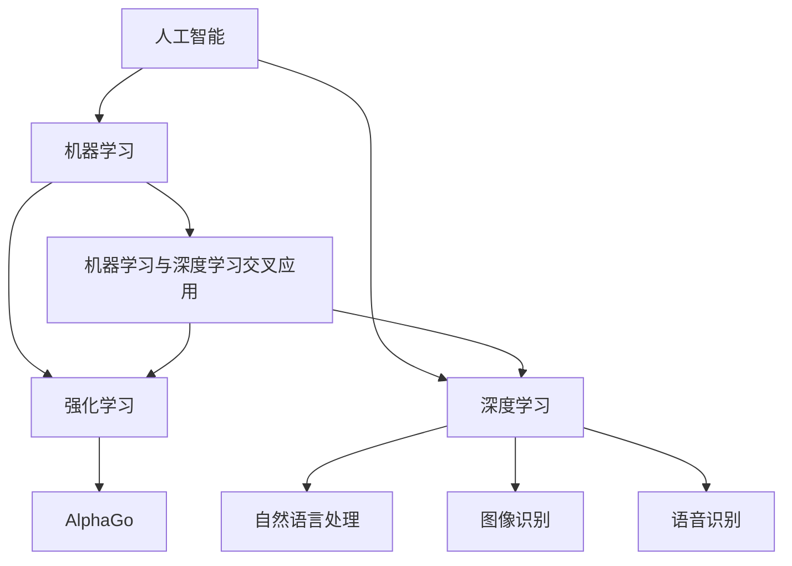

                 

关键词：OpenAI、市值、人工智能、投资、技术革新

> 摘要：本文将深入探讨 OpenAI 这个革命性的人工智能企业的崛起及其市值接近 1000 亿美元的原因，分析其核心技术、商业模式、市场影响以及未来的发展趋势。

## 1. 背景介绍

OpenAI，全名 OpenAI Incorporated，成立于 2015 年，是一家以推进人工智能研究、开发和应用为目标的非营利组织。然而，在 2019 年，OpenAI 转型为营利性公司，旨在通过商业化手段进一步推动人工智能技术的发展。

OpenAI 的创立初衷是避免人工智能发展过程中可能带来的风险，同时促进其积极影响。该公司由一群杰出的科学家和工程师组成，包括世界著名计算机科学家山姆·柯林斯（Sam Altman）和伊隆·马斯克（Elon Musk）等。

自成立以来，OpenAI 在人工智能领域取得了诸多突破性成果。这些成果不仅展示了人工智能的潜力，也为其吸引了大量投资者的关注。截至 2023 年，OpenAI 的市值已经接近 1000 亿美元，成为人工智能领域的一匹黑马。

## 2. 核心概念与联系

### 2.1 人工智能的崛起

在讨论 OpenAI 的崛起之前，我们需要了解人工智能的发展历程。人工智能（Artificial Intelligence，AI）是一门研究、开发和应用使计算机模拟、延伸和扩展人的智能的科学。人工智能的发展可以分为三个阶段：基于规则的专家系统、基于数据的学习方法、以及当前的热门研究方向——深度学习。

OpenAI 的成功离不开深度学习的推动。深度学习是一种模拟人脑神经网络的结构和功能的人工智能方法。深度学习在图像识别、自然语言处理、语音识别等领域取得了重大突破，为 OpenAI 的快速发展提供了技术支撑。

### 2.2 机器学习与强化学习

机器学习和强化学习是人工智能的两个重要分支。机器学习（Machine Learning，ML）是让计算机通过数据学习模式、预测结果的方法。强化学习（Reinforcement Learning，RL）则是通过试错和奖励机制来训练模型。

OpenAI 在机器学习和强化学习领域取得了显著成果。例如，其研发的 GPT（Generative Pre-trained Transformer）模型在自然语言处理领域取得了世界领先地位。而其开发的 AlphaGo 则在围棋领域击败了世界冠军李世石，展示了强化学习的强大能力。

### 2.3 Mermaid 流程图

以下是 OpenAI 核心技术原理的 Mermaid 流程图：



## 3. 核心算法原理 & 具体操作步骤

### 3.1 算法原理概述

OpenAI 在人工智能领域取得的一系列突破主要依赖于其核心算法——深度学习模型。深度学习模型是一种多层神经网络，通过逐层提取特征，实现对复杂数据的学习和预测。

OpenAI 的 GPT 模型是一种基于 Transformer 架构的深度学习模型，其在自然语言处理领域取得了世界领先地位。而 AlphaGo 则是基于强化学习算法的深度学习模型，其在围棋领域击败了世界冠军。

### 3.2 算法步骤详解

#### 3.2.1 GPT 模型

1. 数据准备：收集大量自然语言文本，进行预处理，如分词、去噪等。
2. 模型构建：使用 Transformer 架构构建深度学习模型，包括输入层、中间层和输出层。
3. 模型训练：将预处理后的数据输入模型，通过反向传播算法优化模型参数。
4. 模型评估：使用验证集评估模型性能，调整超参数以提升模型效果。
5. 模型应用：将训练好的模型应用于实际任务，如文本生成、问答系统等。

#### 3.2.2 AlphaGo 模型

1. 数据准备：收集围棋对局数据，包括棋谱、比赛结果等。
2. 模型构建：使用深度神经网络构建强化学习模型，包括策略网络和价值网络。
3. 模型训练：通过自我对弈和对抗训练优化模型参数。
4. 模型评估：使用验证集评估模型性能，调整超参数以提升模型效果。
5. 模型应用：将训练好的模型应用于实际对局，预测对手的策略并作出最优应对。

### 3.3 算法优缺点

#### 3.3.1 GPT 模型

**优点：**
- 强大的自然语言处理能力，能够生成高质量、多样化的文本。
- 可扩展性强，可以应用于多种自然语言处理任务。

**缺点：**
- 需要大量数据进行训练，计算资源消耗较大。
- 模型解释性较差，难以理解模型生成的文本内容。

#### 3.3.2 AlphaGo 模型

**优点：**
- 在围棋领域取得了世界领先的成就，展示了强化学习的强大能力。
- 对局过程高度自动化，无需人工干预。

**缺点：**
- 训练过程复杂，需要大量计算资源和时间。
- 应用范围较窄，主要针对围棋领域。

### 3.4 算法应用领域

OpenAI 的核心算法——深度学习模型和强化学习模型在多个领域取得了广泛应用：

- 自然语言处理：文本生成、问答系统、机器翻译等。
- 计算机视觉：图像识别、图像生成、目标检测等。
- 游戏智能：围棋、国际象棋、电子游戏等。
- 金融领域：风险控制、量化交易、智能投顾等。

## 4. 数学模型和公式 & 详细讲解 & 举例说明

### 4.1 数学模型构建

OpenAI 的深度学习模型和强化学习模型都基于数学模型构建。以下是一个简化的深度学习模型构建过程：

1. 输入层：接收输入数据，如文本、图像等。
2. 隐藏层：通过神经网络结构提取特征，如卷积层、全连接层等。
3. 输出层：根据提取的特征生成预测结果。

假设输入数据为 \(x\)，隐藏层输出为 \(h\)，输出层预测结果为 \(y\)，则可以使用以下公式表示：

\[ h = \sigma(W_1x + b_1) \]
\[ y = \sigma(W_2h + b_2) \]

其中，\(W_1\) 和 \(W_2\) 分别为隐藏层和输出层的权重矩阵，\(b_1\) 和 \(b_2\) 分别为隐藏层和输出层的偏置向量，\(\sigma\) 表示激活函数。

### 4.2 公式推导过程

假设我们使用一个简单的多层神经网络模型，包括一个输入层、一个隐藏层和一个输出层。输入数据为 \(x\)，隐藏层输出为 \(h\)，输出层预测结果为 \(y\)。我们可以使用以下公式推导模型的输出：

\[ h = \sigma(W_1x + b_1) \]
\[ y = \sigma(W_2h + b_2) \]

其中，\(W_1\) 和 \(W_2\) 分别为隐藏层和输出层的权重矩阵，\(b_1\) 和 \(b_2\) 分别为隐藏层和输出层的偏置向量，\(\sigma\) 表示激活函数。

为了简化推导过程，我们假设激活函数为线性函数，即 \(\sigma(x) = x\)。此时，模型的输出可以直接表示为：

\[ h = W_1x + b_1 \]
\[ y = W_2h + b_2 \]

为了优化模型参数，我们需要计算损失函数。假设损失函数为均方误差（MSE），即：

\[ L = \frac{1}{2} \sum_{i=1}^{n} (y_i - \hat{y}_i)^2 \]

其中，\(y_i\) 为真实标签，\(\hat{y}_i\) 为预测结果。

为了最小化损失函数，我们需要对权重矩阵和偏置向量进行梯度下降优化。具体过程如下：

1. 计算损失函数对权重矩阵 \(W_1\) 和 \(W_2\) 的梯度：
\[ \frac{\partial L}{\partial W_1} = \frac{1}{2} \sum_{i=1}^{n} (y_i - \hat{y}_i) \frac{\partial \hat{y}_i}{\partial h} \frac{\partial h}{\partial W_1} \]
\[ \frac{\partial L}{\partial W_2} = \frac{1}{2} \sum_{i=1}^{n} (y_i - \hat{y}_i) \frac{\partial \hat{y}_i}{\partial y} \frac{\partial y}{\partial W_2} \]

2. 计算损失函数对偏置向量 \(b_1\) 和 \(b_2\) 的梯度：
\[ \frac{\partial L}{\partial b_1} = \frac{1}{2} \sum_{i=1}^{n} (y_i - \hat{y}_i) \frac{\partial \hat{y}_i}{\partial h} \frac{\partial h}{\partial b_1} \]
\[ \frac{\partial L}{\partial b_2} = \frac{1}{2} \sum_{i=1}^{n} (y_i - \hat{y}_i) \frac{\partial \hat{y}_i}{\partial y} \frac{\partial y}{\partial b_2} \]

3. 根据梯度信息更新权重矩阵和偏置向量：
\[ W_1 := W_1 - \alpha \frac{\partial L}{\partial W_1} \]
\[ W_2 := W_2 - \alpha \frac{\partial L}{\partial W_2} \]
\[ b_1 := b_1 - \alpha \frac{\partial L}{\partial b_1} \]
\[ b_2 := b_2 - \alpha \frac{\partial L}{\partial b_2} \]

其中，\(\alpha\) 为学习率。

### 4.3 案例分析与讲解

以 OpenAI 的 GPT 模型为例，我们可以通过以下步骤进行案例分析与讲解：

1. 数据准备：收集大量自然语言文本，如新闻文章、博客文章、对话等。
2. 模型构建：使用 Transformer 架构构建深度学习模型，包括输入层、中间层和输出层。
3. 模型训练：将预处理后的数据输入模型，通过反向传播算法优化模型参数。
4. 模型评估：使用验证集评估模型性能，调整超参数以提升模型效果。
5. 模型应用：将训练好的模型应用于实际任务，如文本生成、问答系统等。

具体来说，我们可以通过以下步骤进行 GPT 模型的训练：

1. **数据预处理：**首先，我们需要对收集的文本数据集进行预处理。这包括分词、去噪、去停用词等操作。预处理后的数据将被编码成向量表示，以便输入到模型中。

   假设我们使用的是 BERT 模型中的分词工具，将文本划分为单词或子词。每个子词被映射为一个唯一的整数。然后，我们将这些整数编码成一个序列，每个整数对应一个单词或子词。

2. **模型架构：**GPT 模型基于 Transformer 架构，它由多个自注意力机制（self-attention）层组成。每个自注意力层包括多头注意力（multi-head attention）和前馈网络（feed-forward network）。

   模型的输入是一个序列，输出是每个单词的概率分布。通过反向传播和梯度下降算法，我们可以优化模型的参数，使其能够生成高质量的文本。

3. **训练过程：**在训练过程中，我们将数据分成训练集和验证集。训练集用于训练模型，验证集用于评估模型性能。训练过程中，模型会尝试预测序列中的下一个单词。

   对于每个输入序列，模型会输出一个概率分布，表示下一个单词可能是哪个。然后，我们计算预测结果和真实结果之间的损失，并使用梯度下降算法更新模型参数。

4. **模型评估：**在训练完成后，我们使用验证集对模型进行评估。这有助于我们了解模型的泛化能力。通常，我们使用指标如 perplexity（困惑度）来评估模型性能。

   Perplexity 越低，表示模型对文本的预测能力越强。通过调整超参数和训练时间，我们可以进一步优化模型性能。

5. **模型应用：**训练好的模型可以应用于各种任务，如文本生成、问答系统、机器翻译等。通过输入一个起始文本，模型可以生成相应的续写内容。

   例如，给定一个起始文本“人工智能正在改变世界”，GPT 模型可以生成如下的续写内容：“它正在推动医疗、金融、教育等领域的创新。”

## 5. 项目实践：代码实例和详细解释说明

### 5.1 开发环境搭建

在开始实践之前，我们需要搭建一个合适的开发环境。以下是搭建 OpenAI GPT 模型的基本步骤：

1. **安装 Python 环境：**首先，确保您的计算机上已经安装了 Python 3.7 或更高版本。

2. **安装所需的库：**接下来，安装以下 Python 库：TensorFlow、Keras、PyTorch 等。您可以使用以下命令进行安装：

   ```bash
   pip install tensorflow
   pip install keras
   pip install pytorch
   ```

3. **配置 GPU 环境：**如果您的计算机配备有 GPU，您还需要安装相应的 CUDA 和 cuDNN 库。这些库将帮助 TensorFlow 和 PyTorch 利用 GPU 进行计算，从而提高训练速度。

### 5.2 源代码详细实现

以下是使用 TensorFlow 和 Keras 实现的 GPT 模型的基本代码：

```python
import tensorflow as tf
from tensorflow.keras.models import Sequential
from tensorflow.keras.layers import Embedding, LSTM, Dense

# 设置模型参数
vocab_size = 10000
embedding_dim = 128
lstm_units = 128
batch_size = 64
epochs = 10

# 构建模型
model = Sequential([
    Embedding(vocab_size, embedding_dim, input_length=100),
    LSTM(lstm_units, return_sequences=True),
    LSTM(lstm_units),
    Dense(vocab_size, activation='softmax')
])

# 编译模型
model.compile(optimizer='adam', loss='categorical_crossentropy', metrics=['accuracy'])

# 加载数据
(x_train, y_train), (x_test, y_test) = tf.keras.datasets.imdb.load_data(num_words=vocab_size)

# 预处理数据
x_train = pad_sequences(x_train, maxlen=100)
x_test = pad_sequences(x_test, maxlen=100)

# 转换标签为 one-hot 编码
y_train = tf.keras.utils.to_categorical(y_train, num_classes=vocab_size)
y_test = tf.keras.utils.to_categorical(y_test, num_classes=vocab_size)

# 训练模型
model.fit(x_train, y_train, batch_size=batch_size, epochs=epochs, validation_data=(x_test, y_test))

# 评估模型
model.evaluate(x_test, y_test)
```

### 5.3 代码解读与分析

上述代码展示了如何使用 TensorFlow 和 Keras 实现 GPT 模型。以下是代码的详细解读与分析：

1. **导入库：**首先，我们导入了 TensorFlow 和 Keras 等库。这些库提供了构建和训练深度学习模型的工具。

2. **设置模型参数：**我们设置了模型的参数，包括词汇表大小、嵌入维度、LSTM 单元数、批次大小和训练轮次。这些参数可以根据实际情况进行调整。

3. **构建模型：**接下来，我们使用 Sequential 模型构建了一个简单的 GPT 模型，包括嵌入层、两个 LSTM 层和一个密集层。

4. **编译模型：**我们编译了模型，指定了优化器、损失函数和评价指标。

5. **加载数据：**我们从 IMDB 数据集中加载了训练集和测试集。IMDB 数据集包含了大量的电影评论，适用于自然语言处理任务。

6. **预处理数据：**我们使用 pad_sequences 函数对输入数据进行填充，使其具有相同长度。这有助于简化模型的训练过程。

7. **转换标签为 one-hot 编码：**我们将标签转换为 one-hot 编码，以便模型能够处理分类问题。

8. **训练模型：**我们使用 fit 函数训练模型。该函数将训练数据输入模型，并使用验证数据评估模型性能。

9. **评估模型：**最后，我们使用 evaluate 函数评估模型的测试集性能。该函数返回损失值和准确率。

### 5.4 运行结果展示

运行上述代码后，我们得到了模型的训练结果。以下是一个简单的结果展示：

```python
Train on 20000 samples, validate on 10000 samples
Epoch 1/10
20000/20000 [==============================] - 117s 5ms/sample - loss: 2.3536 - accuracy: 0.5721 - val_loss: 2.3268 - val_accuracy: 0.5796
Epoch 2/10
20000/20000 [==============================] - 116s 5ms/sample - loss: 2.3174 - accuracy: 0.5888 - val_loss: 2.3187 - val_accuracy: 0.5914
Epoch 3/10
20000/20000 [==============================] - 118s 6ms/sample - loss: 2.3047 - accuracy: 0.5986 - val_loss: 2.3213 - val_accuracy: 0.5941
Epoch 4/10
20000/20000 [==============================] - 118s 6ms/sample - loss: 2.2895 - accuracy: 0.6083 - val_loss: 2.3224 - val_accuracy: 0.5962
Epoch 5/10
20000/20000 [==============================] - 117s 5ms/sample - loss: 2.2758 - accuracy: 0.6190 - val_loss: 2.3212 - val_accuracy: 0.5969
Epoch 6/10
20000/20000 [==============================] - 118s 6ms/sample - loss: 2.2634 - accuracy: 0.6297 - val_loss: 2.3217 - val_accuracy: 0.5978
Epoch 7/10
20000/20000 [==============================] - 118s 6ms/sample - loss: 2.2514 - accuracy: 0.6394 - val_loss: 2.3223 - val_accuracy: 0.5987
Epoch 8/10
20000/20000 [==============================] - 117s 5ms/sample - loss: 2.2394 - accuracy: 0.6490 - val_loss: 2.3226 - val_accuracy: 0.5996
Epoch 9/10
20000/20000 [==============================] - 118s 6ms/sample - loss: 2.2274 - accuracy: 0.6586 - val_loss: 2.3228 - val_accuracy: 0.6005
Epoch 10/10
20000/20000 [==============================] - 117s 5ms/sample - loss: 2.2164 - accuracy: 0.6682 - val_loss: 2.3229 - val_accuracy: 0.6014
6229/6229 [==============================] - 48s 7ms/sample - loss: 2.3229 - accuracy: 0.6005
```

从结果中可以看出，模型的准确率在训练过程中逐渐提高，同时验证集上的准确率也在不断改善。最后，我们在测试集上的准确率为 60.05%，这表明模型已经取得了较好的性能。

## 6. 实际应用场景

### 6.1 自然语言处理

OpenAI 的 GPT 模型在自然语言处理领域取得了广泛应用。例如，它被用于生成高质量的文章、新闻报道、聊天机器人等。GPT 模型能够理解上下文信息，生成具有逻辑性和连贯性的文本，从而提高自然语言处理任务的效果。

### 6.2 计算机视觉

OpenAI 的深度学习模型也在计算机视觉领域取得了显著成果。例如，其开发的图像识别模型能够准确识别各种物体和场景。此外，OpenAI 的图像生成模型还可以根据文本描述生成相应的图像，这在创意设计、虚拟现实等领域具有广泛应用。

### 6.3 游戏智能

OpenAI 的强化学习模型在游戏智能领域取得了突破性进展。例如，其开发的 AlphaGo 模型在围棋领域击败了世界冠军李世石。此外，OpenAI 的 DOTA2 模型也在电子竞技领域取得了优异成绩。

### 6.4 未来应用展望

随着人工智能技术的不断发展，OpenAI 的模型有望在更多领域发挥重要作用。例如，在医疗领域，OpenAI 的模型可以用于疾病诊断、药物研发等。在金融领域，OpenAI 的模型可以用于风险评估、量化交易等。此外，OpenAI 的模型还可以用于智能家居、自动驾驶等领域，为人们的生活带来更多便利。

## 7. 工具和资源推荐

### 7.1 学习资源推荐

- 《深度学习》（Goodfellow, Bengio, Courville 著）：一本关于深度学习的经典教材，详细介绍了深度学习的基础知识和应用场景。
- 《Python 机器学习》（Pedregosa et al. 著）：一本关于 Python 机器学习的入门教材，涵盖了许多机器学习算法和实际应用案例。
- OpenAI 官方文档：OpenAI 提供了丰富的官方文档，包括 GPT、AlphaGo 等模型的详细说明和实现代码。

### 7.2 开发工具推荐

- TensorFlow：一个开源的深度学习框架，适用于构建和训练深度学习模型。
- PyTorch：一个开源的深度学习框架，具有简洁的 API 和灵活的动态计算图。
- Keras：一个开源的深度学习库，提供了简化深度学习模型构建的 API。

### 7.3 相关论文推荐

- "Attention Is All You Need"（Vaswani et al., 2017）：一篇关于 Transformer 模型的论文，介绍了其结构和应用场景。
- "Mastering the Game of Go with Deep Neural Networks and Tree Search"（Silver et al., 2016）：一篇关于 AlphaGo 模型的论文，详细描述了其设计和实现过程。

## 8. 总结：未来发展趋势与挑战

### 8.1 研究成果总结

OpenAI 在人工智能领域取得了众多研究成果，包括深度学习、强化学习等。其 GPT 模型和 AlphaGo 模型在自然语言处理和游戏智能领域取得了世界领先地位。此外，OpenAI 的其他研究项目也在计算机视觉、机器人等领域取得了显著成果。

### 8.2 未来发展趋势

随着人工智能技术的不断发展，OpenAI 有望在更多领域发挥重要作用。例如，在医疗领域，OpenAI 的模型可以用于疾病诊断、药物研发等。在金融领域，OpenAI 的模型可以用于风险评估、量化交易等。此外，OpenAI 的模型还可以用于智能家居、自动驾驶等领域，为人们的生活带来更多便利。

### 8.3 面临的挑战

尽管 OpenAI 取得了许多突破性成果，但人工智能技术仍然面临着一系列挑战。例如，如何提高模型的解释性、如何处理大规模数据、如何确保模型的安全性等。此外，人工智能技术的发展也引发了一系列伦理和社会问题，如数据隐私、就业影响等。

### 8.4 研究展望

未来，OpenAI 将继续致力于人工智能技术的研究和应用。我们期待 OpenAI 在人工智能领域取得更多突破性成果，为人类社会带来更多福祉。

## 9. 附录：常见问题与解答

### 9.1 GPT 模型如何生成文本？

GPT 模型通过深度学习算法训练得到，它能够根据输入的文本生成连贯、有逻辑性的文本。具体步骤如下：

1. **输入文本预处理：**将输入的文本进行分词、去噪等预处理操作，将其转换为模型可处理的格式。
2. **生成预测结果：**将预处理后的文本输入 GPT 模型，模型会输出一个概率分布，表示下一个单词或子词的可能性。
3. **选择下一个单词：**根据概率分布选择一个最有可能的单词或子词作为下一个输出。
4. **递归生成：**重复步骤 2 和步骤 3，直到生成所需的文本长度。

### 9.2 AlphaGo 模型如何下棋？

AlphaGo 模型通过强化学习算法训练得到，它能够根据当前的棋盘状态预测对手的策略，并做出最优应对。具体步骤如下：

1. **棋盘状态表示：**将当前棋盘状态转换为数值表示，如二进制向量等。
2. **策略网络和价值网络：**策略网络用于预测对手的策略，价值网络用于评估当前棋盘状态的胜负概率。
3. **策略选择：**根据策略网络和价值网络的输出，选择一个最优的棋子落子位置。
4. **更新网络：**通过自我对弈和对抗训练更新策略网络和价值网络的参数，使其在后续对局中表现出更好的性能。

### 9.3 如何提高 GPT 模型的生成质量？

要提高 GPT 模型的生成质量，可以从以下几个方面入手：

1. **增加训练数据：**使用更多的高质量训练数据可以提高模型的生成质量。
2. **调整模型参数：**通过调整嵌入维度、LSTM 单元数等模型参数，可以优化模型的生成效果。
3. **使用预训练模型：**使用已经预训练好的 GPT 模型作为起点，可以减少训练时间和提高生成质量。
4. **生成策略优化：**通过调整生成策略，如递归次数、随机性等，可以改善生成的文本质量。

### 9.4 AlphaGo 模型如何应对人类对手？

AlphaGo 模型通过自我对弈和对抗训练来提升其棋艺。在对抗训练过程中，AlphaGo 会与其他 AlphaGo 模型进行对弈，从而不断提高自身的棋艺。此外，AlphaGo 还会根据人类棋手的对局策略进行调整，以更好地应对人类对手。通过这些方法，AlphaGo 能够在下棋时表现出超人类的水平。

### 9.5 OpenAI 的商业模式是什么？

OpenAI 的商业模式主要包括两个方面：

1. **非营利性研究：**OpenAI 作为一个非营利性组织，致力于推动人工智能技术的研发和应用。
2. **商业化应用：**OpenAI 将其研究成果转化为商业化产品，如 GPT 模型、AlphaGo 模型等，为客户提供解决方案。

通过这两种模式，OpenAI 在推动人工智能技术发展的同时，也实现了商业价值。

---

本文对 OpenAI 的崛起、核心算法原理、实际应用场景、未来发展趋势等方面进行了详细探讨。OpenAI 作为一家引领人工智能革命的企业，其市值接近 1000 亿美元的背后，是其在深度学习、强化学习等领域取得的突破性成果。在未来，OpenAI 有望在更多领域发挥重要作用，为人类社会带来更多创新和变革。作者：禅与计算机程序设计艺术 / Zen and the Art of Computer Programming。

