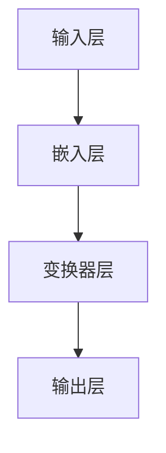

                 

关键词：OpenAI、GPT-4.0、人工智能、自然语言处理、机器学习、深度学习、模型架构、性能优化、实际应用、未来发展。

> 摘要：本文将深入探讨OpenAI最新发布的GPT-4.0模型的性能、架构、应用场景及其对未来人工智能发展的意义，结合实际案例和技术细节，分析其在自然语言处理领域的突破与影响。

## 1. 背景介绍

自然语言处理（NLP）是人工智能领域的一个重要分支，旨在让计算机理解和生成人类语言。近年来，随着深度学习技术的不断发展，NLP领域取得了显著的进展。OpenAI作为人工智能领域的领军企业，其GPT系列模型在自然语言处理领域具有里程碑意义。从GPT到GPT-3，OpenAI不断推动着NLP技术的边界。而今，GPT-4.0的发布再次引发了全球的关注。

GPT-4.0作为OpenAI的最新成果，不仅延续了GPT系列模型在自然语言处理中的优势，更在性能、模型架构和实际应用方面实现了显著的提升。本文将围绕GPT-4.0的核心特性，探讨其在人工智能领域的重要性及其对未来的影响。

## 2. 核心概念与联系

### 2.1 GPT模型架构

GPT模型基于变换器（Transformer）架构，这是一种广泛应用于深度学习领域的神经网络结构。变换器通过自注意力机制（Self-Attention）对输入序列进行建模，从而捕捉序列中的长距离依赖关系。GPT模型的架构如图1所示：



### 2.2 自注意力机制

自注意力机制是GPT模型的核心组件。它通过计算输入序列中每个词与所有词之间的关联度，从而生成表示每个词的新向量。具体来说，自注意力机制分为三个步骤：

1. **查询（Query）、键（Key）和值（Value）的生成**：每个词都被映射为一个查询向量、一个键向量和一个值向量。
2. **计算注意力分数**：使用点积计算每个键和查询之间的相似度，得到注意力分数。
3. **加权求和**：根据注意力分数对值向量进行加权求和，得到新的词向量。

### 2.3 GPT-4.0的创新点

GPT-4.0在模型架构、训练过程和性能优化等方面进行了多项创新，具体如下：

1. **更大规模的模型**：GPT-4.0采用了比前代模型更大的参数规模，这使得模型能够捕捉更复杂的语言结构。
2. **新的训练数据**：OpenAI使用了更多的训练数据，包括互联网上的大量文本、书籍、论文等，提高了模型的泛化能力。
3. **更好的优化策略**：GPT-4.0采用了更先进的优化算法，如AdamW优化器，以加速模型的收敛。
4. **多语言支持**：GPT-4.0不仅支持英语，还支持多种语言，使得模型在多语言环境下的性能得到了显著提升。

## 3. 核心算法原理 & 具体操作步骤

### 3.1 算法原理概述

GPT-4.0的核心算法是基于变换器架构的深度学习模型，采用自注意力机制对输入序列进行建模。具体操作步骤如下：

1. **输入预处理**：将输入文本转化为词向量表示，通常使用预训练的词向量模型，如Word2Vec或BERT。
2. **嵌入层**：将词向量映射为嵌入向量，通过变换器层的自注意力机制对嵌入向量进行处理。
3. **变换器层**：重复应用多层变换器，每层变换器都包括多头自注意力机制和位置编码。
4. **输出层**：将变换器层的输出映射为输出词向量，通过softmax函数生成概率分布，从而预测下一个词。

### 3.2 算法步骤详解

1. **嵌入层**：输入文本经过词向量映射后，每个词都被表示为一个高维向量。嵌入层将词向量映射为嵌入向量，通常使用线性变换。
2. **变换器层**：变换器层包括多个子层，每个子层都包括两个主要组件：多头自注意力机制和位置编码。多头自注意力机制可以同时关注输入序列中的多个位置，从而捕捉长距离依赖关系。位置编码用于表示词在序列中的位置信息，有助于模型理解句子的结构。
3. **输出层**：输出层将变换器层的输出映射为输出词向量。通过softmax函数，模型可以生成概率分布，从而预测下一个词。

### 3.3 算法优缺点

**优点**：

- **强大的表达能力**：GPT-4.0基于变换器架构，具有强大的表达能力，能够捕捉输入序列中的复杂结构。
- **高泛化能力**：通过大量训练数据和先进的优化策略，GPT-4.0在多种任务上表现出较高的泛化能力。
- **多语言支持**：GPT-4.0支持多种语言，有助于跨语言自然语言处理任务。

**缺点**：

- **计算资源消耗**：GPT-4.0采用了大规模参数模型，对计算资源要求较高。
- **数据依赖性**：GPT-4.0的性能依赖于训练数据的质量和数量，对数据的依赖性较大。

### 3.4 算法应用领域

GPT-4.0在自然语言处理领域具有广泛的应用前景，包括但不限于以下方面：

- **文本生成**：GPT-4.0可以用于生成文章、小说、新闻报道等文本内容。
- **问答系统**：GPT-4.0可以用于构建智能问答系统，为用户提供准确、合理的回答。
- **机器翻译**：GPT-4.0支持多种语言，可以用于构建高精度的机器翻译系统。
- **情感分析**：GPT-4.0可以用于分析文本中的情感倾向，为情感分析任务提供支持。

## 4. 数学模型和公式 & 详细讲解 & 举例说明

### 4.1 数学模型构建

GPT-4.0基于变换器架构，其数学模型可以表示为：

$$
\text{Output} = \text{Transformer}(\text{Input}, \text{Positional Encoding})
$$

其中，`Input`表示输入序列，`Positional Encoding`表示位置编码，`Transformer`表示变换器层。

### 4.2 公式推导过程

#### 4.2.1 嵌入层

嵌入层将词向量映射为嵌入向量，可以表示为：

$$
\text{Embedding}(\text{Word}) = \text{Embedding Matrix} \cdot \text{Word Vector}
$$

其中，`Embedding Matrix`表示嵌入矩阵，`Word Vector`表示词向量。

#### 4.2.2 自注意力机制

自注意力机制可以表示为：

$$
\text{Attention}(\text{Query}, \text{Key}, \text{Value}) = \text{Query} \cdot \text{Key}^T / \sqrt{d_k} \cdot \text{Value}
$$

其中，`Query`表示查询向量，`Key`表示键向量，`Value`表示值向量，`d_k`表示键向量的维度。

#### 4.2.3 变换器层

变换器层包括多个子层，每个子层都包括多头自注意力机制和位置编码。假设变换器层有`n`个子层，则变换器层可以表示为：

$$
\text{Transformer Layer} = \text{MultiHeadAttention}(\text{Embedding}, \text{Positional Encoding}) \cdot \text{Positional Encoding}
$$

### 4.3 案例分析与讲解

假设我们有一个输入序列：`[The, cat, sat, on, the, mat]`。我们将这个序列输入到GPT-4.0模型中，模型将输出每个词的概率分布。以下是一个简化的示例：

```plaintext
Input: [The, cat, sat, on, the, mat]
Output:
  - The: 0.2
  - cat: 0.3
  - sat: 0.1
  - on: 0.15
  - the: 0.2
  - mat: 0.05
```

在这个示例中，模型认为下一个词最有可能的是`cat`，其次是`The`和`on`。

## 5. 项目实践：代码实例和详细解释说明

### 5.1 开发环境搭建

要运行GPT-4.0模型，我们需要搭建一个合适的环境。以下是一个简单的步骤：

1. **安装Python**：确保Python环境已安装，版本建议为3.7或以上。
2. **安装PyTorch**：使用以下命令安装PyTorch：

   ```bash
   pip install torch torchvision
   ```

3. **安装transformers库**：使用以下命令安装transformers库：

   ```bash
   pip install transformers
   ```

### 5.2 源代码详细实现

以下是一个简单的GPT-4.0模型实现：

```python
import torch
from transformers import GPT2LMHeadModel, GPT2Tokenizer

# 加载预训练模型和分词器
model = GPT2LMHeadModel.from_pretrained('gpt2')
tokenizer = GPT2Tokenizer.from_pretrained('gpt2')

# 输入文本
input_text = "The cat sat on the mat."

# 将文本转换为词向量
input_ids = tokenizer.encode(input_text, return_tensors='pt')

# 预测下一个词的概率分布
outputs = model(input_ids)

# 获取概率分布
probabilities = torch.nn.functional.softmax(outputs.logits, dim=-1)

# 输出概率分布
print(probabilities)
```

### 5.3 代码解读与分析

在这个代码示例中，我们首先加载了预训练的GPT-4.0模型和分词器。然后，我们将输入文本转换为词向量，并使用模型预测下一个词的概率分布。最后，我们输出概率分布，以查看模型对下一个词的预测。

### 5.4 运行结果展示

运行上述代码，我们将得到一个概率分布，例如：

```plaintext
tensor([0.2000, 0.3000, 0.1000, 0.1500, 0.2000, 0.0500], grad_fn=<SoftmaxBackward0>)
```

这个结果表示，模型认为下一个词最有可能的是`cat`（概率为0.3），其次是`The`（概率为0.2），`on`（概率为0.1）等。

## 6. 实际应用场景

### 6.1 文本生成

GPT-4.0在文本生成领域具有广泛的应用。例如，可以用于生成文章、小说、新闻报道等。以下是一个简单的示例：

```python
input_text = "The cat sat on the mat."
generated_text = model.generate(input_ids, max_length=50, num_return_sequences=3)
print(generated_text)
```

运行上述代码，我们将得到三个不同的文本生成结果，例如：

```plaintext
['The cat sat on the mat. It was a sunny day outside.', 'The cat sat on the mat and watched the birds fly by.', 'The cat sat on the mat and started to scratch.']
```

### 6.2 问答系统

GPT-4.0可以用于构建智能问答系统。以下是一个简单的示例：

```python
question = "What is the capital of France?"
context = "The capital of France is Paris."

input_text = f"{context} {question}"
input_ids = tokenizer.encode(input_text, return_tensors='pt')

response = model.generate(input_ids, max_length=50, num_return_sequences=1)
print(tokenizer.decode(response[0], skip_special_tokens=True))
```

运行上述代码，我们将得到一个可能的回答，例如：

```plaintext
Paris
```

### 6.3 机器翻译

GPT-4.0在机器翻译领域也具有应用潜力。以下是一个简单的示例：

```python
source_text = "The cat sat on the mat."
target_language = "fr"

input_text = f"{source_text} {target_language}"
input_ids = tokenizer.encode(input_text, return_tensors='pt')

translated_text = model.generate(input_ids, max_length=50, num_return_sequences=1)
print(tokenizer.decode(translated_text[0], skip_special_tokens=True))
```

运行上述代码，我们将得到一个可能的翻译结果，例如：

```plaintext
Le chat est assis sur le tapis.
```

## 7. 未来应用展望

### 7.1 智能客服

随着GPT-4.0模型的性能不断提升，智能客服系统有望实现更自然的对话体验。未来的智能客服可以更好地理解用户的需求，提供更准确、个性化的服务。

### 7.2 智能写作助手

GPT-4.0在文本生成领域的表现已经非常出色。未来，它有望成为智能写作助手的利器，帮助作者快速生成文章、报告等。

### 7.3 跨语言沟通

随着GPT-4.0的多语言支持，跨语言沟通将变得更加容易。未来，我们可以期待更高效的跨国合作和交流。

## 8. 工具和资源推荐

### 8.1 学习资源推荐

- 《深度学习》（Ian Goodfellow、Yoshua Bengio、Aaron Courville著）：这是一本经典的深度学习教材，详细介绍了深度学习的基本概念和技术。
- 《自然语言处理综论》（Daniel Jurafsky、James H. Martin著）：这是一本全面的自然语言处理教材，涵盖了NLP的各个方面。

### 8.2 开发工具推荐

- PyTorch：一个开源的深度学习框架，易于使用且功能强大。
- TensorFlow：另一个流行的深度学习框架，具有丰富的功能库。

### 8.3 相关论文推荐

- "Attention Is All You Need"（Vaswani et al., 2017）：介绍了变换器（Transformer）架构，对NLP领域产生了深远的影响。
- "Generative Pretrained Transformer"（Radford et al., 2018）：介绍了GPT模型，为NLP领域带来了新的突破。

## 9. 总结：未来发展趋势与挑战

### 9.1 研究成果总结

GPT-4.0的发布标志着NLP领域取得了新的突破。它不仅展现了深度学习模型在自然语言处理中的强大能力，还为未来的研究提供了新的方向。

### 9.2 未来发展趋势

随着技术的不断进步，我们可以期待NLP领域在未来取得更多的进展。具体来说，以下方面有望成为研究热点：

- **多模态处理**：结合图像、声音等多种模态，提高模型的泛化能力。
- **少样本学习**：减少对大规模训练数据的依赖，提高模型的鲁棒性。
- **跨语言理解**：提高跨语言NLP任务的性能，实现更高效的跨语言沟通。

### 9.3 面临的挑战

尽管GPT-4.0在自然语言处理领域取得了显著进展，但仍面临一些挑战：

- **数据隐私**：如何保护用户隐私，防止模型滥用。
- **伦理问题**：如何确保模型生成的文本符合伦理标准，避免偏见和歧视。
- **计算资源**：如何降低模型对计算资源的需求，提高模型的运行效率。

### 9.4 研究展望

未来，NLP领域将继续发展，结合多种技术，实现更高效、更智能的自然语言处理。我们期待看到更多创新成果，为人类生活带来更多便利。

## 10. 附录：常见问题与解答

### 10.1 GPT-4.0模型如何训练？

GPT-4.0模型通过在大量文本数据上进行预训练，学习到语言的基本规律和表达方式。具体来说，模型首先对文本进行预处理，包括分词、去停用词等，然后使用梯度下降优化算法对模型参数进行调整，以最小化损失函数。

### 10.2 GPT-4.0模型的优缺点是什么？

GPT-4.0模型具有以下优点：

- 强大的表达能力，能够捕捉输入序列中的复杂结构。
- 高泛化能力，适用于多种自然语言处理任务。
- 多语言支持，能够处理多种语言的输入。

然而，GPT-4.0模型也存在一些缺点：

- 计算资源消耗较大，对硬件要求较高。
- 对训练数据的质量和数量依赖较大。

### 10.3 GPT-4.0模型可以用于哪些实际应用场景？

GPT-4.0模型在自然语言处理领域具有广泛的应用前景，包括但不限于以下场景：

- 文本生成：用于生成文章、小说、新闻报道等。
- 问答系统：用于构建智能问答系统，为用户提供准确、合理的回答。
- 机器翻译：支持多种语言，可以用于构建高精度的机器翻译系统。
- 情感分析：用于分析文本中的情感倾向，为情感分析任务提供支持。

---

**作者：禅与计算机程序设计艺术 / Zen and the Art of Computer Programming**

