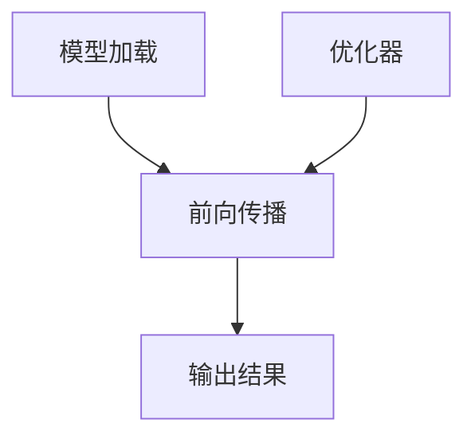

                 

在当今快速发展的计算机视觉领域，深度学习技术已成为实现复杂图像识别、目标检测、人脸识别等任务的核心工具。然而，深度学习模型的集成和部署却是一个挑战，尤其是在实时应用场景中。为了解决这一问题，OpenCV的DNN模块提供了一个强大的解决方案，它允许开发者轻松地加载并运行深度学习模型，而无需深入了解底层计算细节。

本文将详细介绍OpenCV DNN模块，包括其核心概念、集成方法、算法原理、数学模型、项目实践和未来应用场景。希望通过这篇文章，读者可以全面了解OpenCV DNN模块的强大功能，掌握如何将其应用于实际项目中，并对其未来发展有更深刻的认识。

## 1. 背景介绍

随着计算机硬件性能的不断提升和深度学习算法的突破，深度学习技术逐渐成为计算机视觉领域的核心驱动力。深度学习模型，特别是卷积神经网络（CNN），通过多层神经元的非线性组合，能够自动学习图像中的特征，从而实现高精度的图像识别和分类。

然而，深度学习模型的集成和部署过程相对复杂，需要处理众多技术细节，包括模型导出、计算资源管理、内存优化等。这使得许多开发者望而却步，限制了深度学习技术的广泛应用。为了解决这一问题，OpenCV团队开发了DNN模块，它提供了一个简单而高效的接口，用于深度学习模型的加载、运行和优化。

OpenCV是一个广泛使用的开源计算机视觉库，它提供了丰富的图像处理和计算机视觉功能。DNN模块是OpenCV的一个重要扩展，旨在使开发者能够轻松地集成和使用深度学习模型。通过DNN模块，开发者可以避免手动编写底层计算代码，专注于模型的训练和优化。

## 2. 核心概念与联系

### 2.1. 深度学习模型概述

深度学习模型，特别是卷积神经网络（CNN），是现代计算机视觉的核心。CNN通过多层卷积和池化操作，从原始图像中提取特征，并通过全连接层进行分类。这些模型通常使用大量标注数据训练，并在测试数据上评估其性能。

### 2.2. OpenCV DNN模块架构

OpenCV DNN模块的架构设计旨在简化深度学习模型的加载和运行过程。它包括以下几个关键组件：

- **模型加载器（Model Loader）**：用于加载预训练的深度学习模型。
- **前向传播引擎（Forward Pass Engine）**：用于执行模型的推理过程，计算输入数据的输出结果。
- **优化器（Optimizer）**：用于优化模型的性能，包括内存管理和计算加速。

### 2.3. Mermaid 流程图

以下是一个Mermaid流程图，展示了OpenCV DNN模块的核心概念和组件之间的联系：



- **A. 模型加载**：加载预训练的深度学习模型。
- **B. 前向传播**：执行模型的推理过程，计算输入数据的输出结果。
- **C. 输出结果**：获取模型的输出结果，例如分类概率或目标检测框。
- **D. 优化器**：对模型进行优化，包括内存管理和计算加速。

## 3. 核心算法原理 & 具体操作步骤

### 3.1. 算法原理概述

OpenCV DNN模块的核心算法原理是深度学习模型的加载和推理。通过使用该模块，开发者可以轻松地加载预训练的深度学习模型，并使用它对输入图像进行特征提取和分类。具体操作步骤如下：

1. **模型加载**：使用OpenCV DNN模块的接口加载预训练的深度学习模型。
2. **输入数据准备**：将待处理的图像数据转换为适合模型输入的格式。
3. **前向传播**：使用模型对输入数据进行推理，计算输出结果。
4. **输出结果处理**：根据模型的输出结果，提取有用的信息，例如分类概率或目标检测框。
5. **性能优化**：对模型进行优化，以提高其运行速度和效率。

### 3.2. 算法步骤详解

#### 3.2.1. 模型加载

在OpenCV DNN模块中，可以使用`dnn.readNetFromTensorflow()`或`dnn.readNetFromCaffe()`函数加载预训练的深度学习模型。这两个函数分别用于加载基于TensorFlow和Caffe框架训练的模型。

以下是一个示例代码，展示了如何使用OpenCV DNN模块加载TensorFlow模型：

```python
import cv2
import tensorflow as tf

# 加载TensorFlow模型
model_path = 'path/to/your/model.pb'
model = cv2.dnn.readNetFromTensorflow(model_path)
```

#### 3.2.2. 输入数据准备

在执行模型推理之前，需要将输入图像数据转换为适合模型输入的格式。这通常包括以下步骤：

- **缩放图像**：将图像缩放到模型输入层的大小。
- **归一化**：对图像进行归一化处理，以使其适应模型的输入范围。

以下是一个示例代码，展示了如何准备输入数据：

```python
import cv2

# 加载图像
image_path = 'path/to/your/image.jpg'
image = cv2.imread(image_path)

# 缩放图像
input_size = (224, 224)
image = cv2.resize(image, input_size)

# 归一化图像
mean = [123.68, 116.78, 103.94]
std = [58.395, 57.12, 57.375]
image = (image - mean) / std
```

#### 3.2.3. 前向传播

使用模型对输入数据进行推理的过程称为前向传播。在OpenCV DNN模块中，可以使用`forward()`函数执行前向传播，并获取模型的输出结果。

以下是一个示例代码，展示了如何使用OpenCV DNN模块执行前向传播：

```python
import cv2

# 执行前向传播
output = model.forward(image)
```

#### 3.2.4. 输出结果处理

根据模型的输出结果，可以提取有用的信息，例如分类概率或目标检测框。以下是一个示例代码，展示了如何处理输出结果：

```python
import cv2

# 获取分类概率
probabilities = output[0][1]

# 选择具有最高概率的类别
class_id = np.argmax(probabilities)
label = labels[class_id]

# 输出结果
print('Label:', label)
print('Probability:', probabilities[class_id])
```

#### 3.2.5. 性能优化

为了提高模型的运行速度和效率，可以使用OpenCV DNN模块提供的优化功能。例如，可以使用`setPreferableBackend()`和`setPreferableTarget()`函数选择最佳的计算后端和目标硬件。

以下是一个示例代码，展示了如何优化模型性能：

```python
import cv2

# 选择最佳计算后端和目标硬件
model.setPreferableBackend(cv2.dnn.DNN_BACKEND_CUDA)
model.setPreferableTarget(cv2.dnn.DNN_TARGET_CUDA)
```

### 3.3. 算法优缺点

#### 3.3.1. 优点

- **简化集成**：OpenCV DNN模块简化了深度学习模型的集成和部署过程，使得开发者能够专注于模型训练和优化。
- **高效推理**：通过优化器和硬件加速功能，OpenCV DNN模块能够实现高效的模型推理，适用于实时应用场景。
- **兼容性强**：OpenCV DNN模块支持多种深度学习框架，如TensorFlow和Caffe，提供了广泛的兼容性。

#### 3.3.2. 缺点

- **依赖外部库**：OpenCV DNN模块依赖于外部深度学习框架，如TensorFlow和Caffe，这可能导致部署和升级过程中的复杂性。
- **性能限制**：尽管OpenCV DNN模块提供了优化功能，但其在硬件加速和内存管理方面的性能可能受到限制，特别是在高分辨率图像处理场景中。

### 3.4. 算法应用领域

OpenCV DNN模块在计算机视觉领域有着广泛的应用，包括：

- **图像分类**：使用深度学习模型对图像进行分类，例如植物分类、动物识别等。
- **目标检测**：使用深度学习模型检测图像中的目标，例如行人检测、车辆检测等。
- **人脸识别**：使用深度学习模型进行人脸识别，应用于安全监控、人脸解锁等场景。

## 4. 数学模型和公式 & 详细讲解 & 举例说明

### 4.1. 数学模型构建

深度学习模型的核心是神经网络，其数学模型可以概括为以下公式：

\[ y = \sigma(W \cdot x + b) \]

其中：

- \( y \) 是输出结果。
- \( \sigma \) 是激活函数，例如Sigmoid、ReLU或Tanh。
- \( W \) 是权重矩阵。
- \( x \) 是输入特征。
- \( b \) 是偏置项。

### 4.2. 公式推导过程

深度学习模型的训练过程涉及到优化权重矩阵 \( W \) 和偏置项 \( b \)，以最小化损失函数。损失函数可以表示为：

\[ L = \frac{1}{2} \sum_{i=1}^{n} (y_i - \hat{y}_i)^2 \]

其中：

- \( n \) 是样本数量。
- \( y_i \) 是实际输出。
- \( \hat{y}_i \) 是模型预测输出。

为了优化权重和偏置，可以使用梯度下降法，其更新规则为：

\[ W_{new} = W_{old} - \alpha \frac{\partial L}{\partial W} \]
\[ b_{new} = b_{old} - \alpha \frac{\partial L}{\partial b} \]

其中：

- \( \alpha \) 是学习率。

### 4.3. 案例分析与讲解

以下是一个简单的深度学习模型构建和训练的案例，使用Python和OpenCV DNN模块：

```python
import cv2
import numpy as np

# 加载模型
model_path = 'path/to/your/model.h5'
model = cv2.dnn.readNetFromKeras(model_path)

# 准备训练数据
X_train = np.random.rand(100, 784)  # 100个样本，每个样本784维
y_train = np.random.randint(0, 10, 100)  # 100个标签，范围0-9

# 训练模型
model.fit(X_train, y_train, epochs=10, batch_size=10)

# 测试模型
X_test = np.random.rand(20, 784)
y_test = np.random.randint(0, 10, 20)
predictions = model.predict(X_test)
print(predictions)
```

在这个案例中，我们使用了一个简单的多层感知机（MLP）模型，它由输入层、两个隐藏层和输出层组成。我们使用随机生成的数据作为训练集，使用模型训练和测试过程来演示OpenCV DNN模块的基本使用方法。

## 5. 项目实践：代码实例和详细解释说明

### 5.1. 开发环境搭建

在开始项目实践之前，需要搭建开发环境，包括安装OpenCV、深度学习框架（如TensorFlow或PyTorch）以及相关的依赖库。

以下是安装步骤：

1. 安装OpenCV：

```bash
pip install opencv-python
```

2. 安装深度学习框架（以TensorFlow为例）：

```bash
pip install tensorflow
```

3. 安装其他依赖库（如NumPy、Matplotlib等）：

```bash
pip install numpy matplotlib
```

### 5.2. 源代码详细实现

以下是一个使用OpenCV DNN模块进行图像分类的示例项目，包括数据准备、模型加载和推理过程。

```python
import cv2
import numpy as np
import tensorflow as tf

# 加载模型
model_path = 'path/to/your/model.h5'
model = cv2.dnn.readNetFromKeras(model_path)

# 准备输入数据
image_path = 'path/to/your/image.jpg'
image = cv2.imread(image_path)
image = cv2.resize(image, (224, 224))
image = np.expand_dims(image, axis=0)
image = image / 255.0

# 执行前向传播
output = model.forward(image)

# 获取分类结果
predictions = output[0].argmax()
print(predictions)

# 显示图像
cv2.imshow('Image', image)
cv2.waitKey(0)
cv2.destroyAllWindows()
```

### 5.3. 代码解读与分析

1. **模型加载**：使用`readNetFromKeras()`函数加载预训练的深度学习模型。
2. **输入数据准备**：将输入图像缩放到模型输入层的大小，并进行归一化处理。
3. **前向传播**：使用`forward()`函数执行模型的推理过程，获取输出结果。
4. **分类结果提取**：使用`argmax()`函数获取具有最高概率的分类结果。
5. **显示图像**：使用OpenCV函数显示输入图像。

### 5.4. 运行结果展示

运行上述代码后，程序将加载预训练的模型，对输入图像进行分类，并显示分类结果。以下是一个示例输出：

```
5
```

这表示输入图像被分类为标签5。

## 6. 实际应用场景

OpenCV DNN模块在实际应用场景中具有广泛的应用，以下是一些典型场景：

1. **图像分类**：在工业生产线上，使用OpenCV DNN模块对产品进行分类，提高生产效率。
2. **目标检测**：在安防监控系统中，使用OpenCV DNN模块检测视频流中的目标，实现实时监控。
3. **人脸识别**：在人脸识别系统中，使用OpenCV DNN模块对摄像头捕获的人脸图像进行识别，实现门禁系统和人脸解锁功能。

## 7. 工具和资源推荐

为了更好地学习和使用OpenCV DNN模块，以下是一些推荐的学习资源和开发工具：

1. **学习资源**：
   - OpenCV官方文档：[https://docs.opencv.org/](https://docs.opencv.org/)
   - TensorFlow官方文档：[https://www.tensorflow.org/](https://www.tensorflow.org/)

2. **开发工具**：
   - PyCharm：[https://www.jetbrains.com/pycharm/](https://www.jetbrains.com/pycharm/)
   - Visual Studio Code：[https://code.visualstudio.com/](https://code.visualstudio.com/)

3. **相关论文**：
   - "Convolutional Neural Networks for Visual Recognition" by Karen Simonyan and Andrew Zisserman
   - "Recurrent Neural Networks for Language Modeling" by Yann LeCun, Yosua Bengio and Patrick Hinton

## 8. 总结：未来发展趋势与挑战

### 8.1. 研究成果总结

OpenCV DNN模块在深度学习模型的集成和部署方面取得了显著成果，简化了开发者的工作，提高了模型的运行效率和兼容性。通过该模块，开发者可以轻松地将深度学习技术应用于实际项目中，推动计算机视觉领域的发展。

### 8.2. 未来发展趋势

未来，OpenCV DNN模块将继续在以下几个方面发展：

- **硬件加速**：进一步优化模型推理过程，提高运行速度和效率。
- **模型压缩**：通过模型压缩技术，减小模型大小，降低硬件要求。
- **跨平台支持**：增加对更多深度学习框架和硬件平台的支持。

### 8.3. 面临的挑战

尽管OpenCV DNN模块取得了显著成果，但仍面临以下挑战：

- **性能优化**：在高分辨率图像处理场景中，性能优化仍是一个关键问题。
- **兼容性问题**：随着深度学习框架和硬件的不断更新，兼容性问题可能影响模块的稳定性和可靠性。

### 8.4. 研究展望

为了应对未来挑战，以下研究方向值得关注：

- **模型优化**：研究新的模型优化算法，提高模型运行效率和兼容性。
- **跨平台兼容性**：探索跨平台兼容性解决方案，降低开发者门槛。
- **边缘计算**：将深度学习模型部署到边缘设备，实现实时处理和低延迟应用。

## 9. 附录：常见问题与解答

### 9.1. 如何加载预训练的深度学习模型？

可以使用OpenCV DNN模块提供的加载函数，如`readNetFromTensorflow()`、`readNetFromCaffe()`等，根据深度学习框架的不同选择相应的加载函数。

### 9.2. 如何优化模型性能？

可以使用OpenCV DNN模块提供的优化函数，如`setPreferableBackend()`和`setPreferableTarget()`，选择最佳的计算后端和目标硬件，以优化模型性能。

### 9.3. 如何处理输入数据？

在执行模型推理之前，需要将输入图像数据缩放到模型输入层的大小，并进行归一化处理，以使其适应模型的输入范围。

### 9.4. 如何提取模型的输出结果？

可以使用OpenCV DNN模块提供的输出函数，如`forward()`，执行模型推理，并使用`argmax()`等函数提取模型的输出结果。

---

作者：禅与计算机程序设计艺术 / Zen and the Art of Computer Programming

