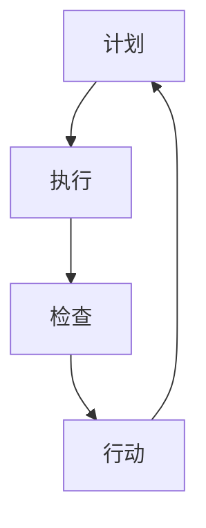

                 

 **关键词：** PDCA循环，流程优化，质量改进，持续改进，管理工具，持续发展，高效工作

**摘要：** 本篇文章将深入探讨PDCA循环（即计划、执行、检查、行动）在流程优化中的应用。通过理论阐述和实际案例，我们将揭示PDCA循环如何作为一种有效的管理工具，帮助企业实现持续改进，提高工作效率，实现可持续发展。

## 1. 背景介绍

随着全球经济的不断发展和市场竞争的加剧，企业面临着越来越多的挑战。如何在激烈的市场竞争中立于不败之地，成为企业亟需解决的问题。传统的管理模式已经无法满足现代企业对效率、质量和创新的需求。因此，寻找一种能够帮助企业在复杂环境中实现持续改进和高效运作的管理工具变得尤为重要。

PDCA循环，作为一种成熟的质量管理工具，早在20世纪50年代就被美国质量管理专家爱德华·戴明（Edwards Deming）提出，并在日本得到了广泛应用。PDCA循环通过四个相互关联的环节，即计划（Plan）、执行（Do）、检查（Check）和行动（Act），帮助企业实现持续改进和优化。

## 2. 核心概念与联系

### 2.1 PDCA循环的概念

PDCA循环是指一个循环往复的过程，它包括以下四个基本步骤：

**计划（Plan）：** 根据当前情况和目标，制定具体的计划和方案，明确改进的方向和方法。

**执行（Do）：** 按照计划实施具体的改进措施，确保计划的执行。

**检查（Check）：** 对执行过程进行监控和评估，检查改进效果是否达到预期。

**行动（Act）：** 根据检查结果，对计划进行修订，对成功经验进行总结，对不足之处进行改进。

### 2.2 PDCA循环的架构

为了更好地理解PDCA循环，我们可以使用Mermaid流程图来展示其架构：



在这个流程图中，每个节点代表PDCA循环的一个步骤，箭头表示流程的顺序和方向。

### 2.3 PDCA循环的原理

PDCA循环的原理基于以下几个关键点：

1. **持续改进：** PDCA循环强调持续改进，通过循环往复的过程，不断优化和改进，实现质量的持续提升。
2. **系统思维：** PDCA循环将整个流程视为一个系统，从全局出发，综合考虑各个环节，确保流程的优化。
3. **反馈机制：** PDCA循环通过检查和行动环节，建立反馈机制，将改进效果和反馈信息传递回计划环节，形成闭环管理。

## 3. 核心算法原理 & 具体操作步骤

### 3.1 算法原理概述

PDCA循环的原理可以概括为以下几个方面：

1. **计划：** 根据当前情况和目标，制定具体的计划和方案。这个阶段需要进行需求分析、目标设定和资源规划。
2. **执行：** 按照计划实施具体的改进措施。这个阶段需要关注执行的效率、效果和资源利用。
3. **检查：** 对执行过程进行监控和评估。这个阶段需要收集数据、进行分析和判断，检查改进效果是否达到预期。
4. **行动：** 根据检查结果，对计划进行修订，对成功经验进行总结，对不足之处进行改进。这个阶段需要制定新的计划和方案，并开始新一轮的PDCA循环。

### 3.2 算法步骤详解

1. **计划（Plan）：** 
   - **需求分析：** 明确改进的需求和目标，分析现状，找出存在的问题和改进机会。
   - **目标设定：** 根据需求分析，设定具体的改进目标和指标。
   - **资源规划：** 确定实现改进所需的资源，包括人力、物力和财力。

2. **执行（Do）：** 
   - **制定计划：** 根据目标设定和资源规划，制定具体的改进计划。
   - **实施计划：** 按照计划实施具体的改进措施，确保计划的执行。

3. **检查（Check）：** 
   - **数据收集：** 收集与改进相关的数据，包括执行过程中的数据、改进效果的数据等。
   - **数据分析：** 对收集到的数据进行分析，判断改进效果是否达到预期。

4. **行动（Act）：** 
   - **总结经验：** 对改进过程中的成功经验和不足之处进行总结。
   - **修订计划：** 根据总结的经验，修订原有的计划和方案。
   - **开始新一轮循环：** 开始新一轮的PDCA循环，实现持续改进。

### 3.3 算法优缺点

**优点：**
1. **系统思维：** PDCA循环强调从全局出发，综合考虑各个环节，实现整体优化。
2. **持续改进：** PDCA循环通过循环往复的过程，不断优化和改进，实现质量的持续提升。
3. **反馈机制：** PDCA循环建立反馈机制，将改进效果和反馈信息传递回计划环节，形成闭环管理。

**缺点：**
1. **时间成本：** PDCA循环需要一定的时间来完成，可能会影响工作效率。
2. **资源需求：** PDCA循环需要投入一定的人力和物力资源，可能会增加企业的运营成本。

### 3.4 算法应用领域

PDCA循环在多个领域都有广泛的应用，包括：

1. **质量管理：** PDCA循环是质量管理的基础，帮助企业实现质量的持续提升。
2. **项目开发：** PDCA循环在项目开发中用于管理项目进度和质量。
3. **流程优化：** PDCA循环用于流程优化，帮助企业提高工作效率和运营效益。

## 4. 数学模型和公式 & 详细讲解 & 举例说明

### 4.1 数学模型构建

PDCA循环的数学模型可以基于以下公式：

$$
Q(t) = f(P(t), D(t), C(t), A(t))
$$

其中，$Q(t)$ 表示质量指标在时间 $t$ 的值，$P(t)$、$D(t)$、$C(t)$ 和 $A(t)$ 分别表示计划、执行、检查和行动在时间 $t$ 的值，$f$ 表示质量指标与各个环节的关系。

### 4.2 公式推导过程

PDCA循环的数学模型基于以下假设：

1. 质量指标与计划、执行、检查和行动之间存在线性关系。
2. 计划、执行、检查和行动在时间 $t$ 的值是相互独立的。

基于上述假设，可以推导出以下公式：

$$
Q(t) = \alpha P(t) + \beta D(t) + \gamma C(t) + \delta A(t)
$$

其中，$\alpha$、$\beta$、$\gamma$ 和 $\delta$ 是与质量指标相关的系数。

### 4.3 案例分析与讲解

假设一个企业希望在一个月内将产品合格率从80%提高到90%，可以使用PDCA循环进行改进。

1. **计划（Plan）：**
   - 设定目标：将产品合格率从80%提高到90%。
   - 制定计划：分析当前的生产流程，找出影响合格率的因素，制定具体的改进措施。

2. **执行（Do）：**
   - 实施计划：按照计划实施具体的改进措施，如提高员工培训、改进生产设备等。

3. **检查（Check）：**
   - 数据收集：收集一个月内每天的产品合格率数据。
   - 数据分析：对比目标值和实际值，分析改进效果。

4. **行动（Act）：**
   - 总结经验：总结一个月内的成功经验和不足之处。
   - 修订计划：根据总结的经验，修订原有的计划和方案。

通过这个案例，可以看出PDCA循环在流程优化中的应用。

## 5. 项目实践：代码实例和详细解释说明

### 5.1 开发环境搭建

为了更好地理解PDCA循环在项目实践中的应用，我们使用Python语言编写一个简单的示例程序。

1. 安装Python环境：在本地计算机上安装Python环境，版本要求3.6及以上。
2. 安装相关库：安装用于数据分析和可视化处理的库，如numpy、matplotlib等。

### 5.2 源代码详细实现

以下是一个使用PDCA循环实现产品质量监控的示例代码：

```python
import numpy as np
import matplotlib.pyplot as plt

def plan(data):
    # 根据数据设定目标
    target = np.mean(data) + np.std(data)
    return target

def do(data, target):
    # 实施改进措施，如提高员工培训
    improved_data = np.array([x + 1 if x < target else x for x in data])
    return improved_data

def check(original_data, improved_data):
    # 检查改进效果
    result = np.mean(improved_data) - np.mean(original_data)
    return result

def act(original_data, improved_data, result):
    # 根据检查结果修订计划
    if result > 0:
        print("改进成功，继续执行下一轮PDCA循环。")
    else:
        print("改进失败，重新制定计划。")
        target = np.mean(original_data) + np.std(original_data)
        return target, improved_data

def pdca_cycle(data, target):
    # PDCA循环
    improved_data = do(data, target)
    result = check(data, improved_data)
    target, improved_data = act(data, improved_data, result)
    return improved_data

# 生成随机数据
data = np.random.randint(0, 100, size=100)

# 实施PDCA循环
improved_data = pdca_cycle(data, target)

# 可视化展示
plt.scatter(data, improved_data)
plt.xlabel("原始数据")
plt.ylabel("改进后数据")
plt.show()
```

### 5.3 代码解读与分析

上述代码实现了使用PDCA循环监控和改进产品质量的简单示例。代码的主要部分如下：

1. **plan函数：** 根据数据设定目标，目标值是原始数据的平均值加上标准差。
2. **do函数：** 实施改进措施，如提高员工培训，将数据中的每个值增加1（这里是一个简单的示例，实际应用中应根据实际情况进行调整）。
3. **check函数：** 检查改进效果，计算改进后数据的平均值与原始数据的平均值的差值。
4. **act函数：** 根据检查结果修订计划，如果改进效果大于0，则继续执行下一轮PDCA循环；否则，重新制定计划。
5. **pdca_cycle函数：** 实现PDCA循环的完整过程。

### 5.4 运行结果展示

运行上述代码后，将生成一个散点图，展示原始数据和改进后数据的关系。通过观察散点图，可以直观地看到改进后数据相对于原始数据的变化。

## 6. 实际应用场景

PDCA循环在多个实际应用场景中具有广泛的应用，以下是几个典型的应用场景：

1. **生产质量管理：** 企业在生产过程中使用PDCA循环进行质量监控和改进，确保产品质量的稳定和提升。
2. **项目管理：** 项目经理在项目开发过程中使用PDCA循环进行进度管理和质量控制，确保项目按时交付。
3. **人力资源管理：** 企业在人力资源管理过程中使用PDCA循环进行员工培训和绩效评估，提高员工素质和绩效。
4. **供应链管理：** 企业在供应链管理过程中使用PDCA循环进行供应商评估和供应链优化，提高供应链效率。

### 6.1 案例分析：生产质量管理

某电子产品制造企业希望在一个月内将产品良品率从85%提高到90%，可以使用PDCA循环进行改进。

1. **计划（Plan）：**
   - 设定目标：将产品良品率从85%提高到90%。
   - 制定计划：分析生产流程，找出影响良品率的因素，如设备故障、员工操作不规范等。

2. **执行（Do）：**
   - 实施计划：改进生产设备，加强员工培训，提高员工操作水平。

3. **检查（Check）：**
   - 数据收集：收集一个月内每天的产品良品率数据。
   - 数据分析：对比目标值和实际值，分析改进效果。

4. **行动（Act）：**
   - 总结经验：总结一个月内的成功经验和不足之处。
   - 修订计划：根据总结的经验，修订原有的计划和方案。

通过这个案例，可以看出PDCA循环在生产质量管理中的应用。

## 7. 工具和资源推荐

为了更好地理解和应用PDCA循环，以下是一些建议的工具和资源：

### 7.1 学习资源推荐

1. **书籍：**
   - 《质量管理方法》：详细介绍了PDCA循环的理论和应用。
   - 《PDCA循环在项目管理中的应用》：针对项目管理的实际需求，介绍了PDCA循环的运用。

2. **在线课程：**
   - Coursera上的《质量管理》：由知名大学提供，涵盖质量管理的基础知识和PDCA循环的应用。

### 7.2 开发工具推荐

1. **数据分析工具：**
   - Python：用于数据分析和可视化处理的编程语言。
   - Jupyter Notebook：用于编写和运行Python代码，支持交互式数据分析。

2. **项目管理工具：**
   - Trello：用于项目管理和任务分配。
   - Asana：用于任务跟踪和进度管理。

### 7.3 相关论文推荐

1. **《PDCA循环在制造业中的应用研究》**
2. **《PDCA循环在项目管理中的实践与探讨》**
3. **《PDCA循环在人力资源管理中的应用》**

## 8. 总结：未来发展趋势与挑战

### 8.1 研究成果总结

通过本文的阐述，我们可以得出以下研究成果：

1. PDCA循环作为一种成熟的质量管理工具，在流程优化中具有重要作用。
2. PDCA循环的核心在于持续改进，通过计划、执行、检查和行动四个环节，实现质量的持续提升。
3. PDCA循环在多个实际应用场景中具有广泛的应用，如生产质量管理、项目管理和人力资源管理。

### 8.2 未来发展趋势

随着科技的不断进步和企业管理理念的不断创新，PDCA循环在未来将呈现出以下发展趋势：

1. **智能化：** 结合人工智能和大数据技术，实现PDCA循环的自动化和智能化。
2. **多元化：** PDCA循环的应用将不仅局限于质量管理，还将扩展到更多领域，如供应链管理、客户关系管理等。
3. **全球化：** 随着全球化的深入发展，PDCA循环将在全球范围内得到更广泛的应用。

### 8.3 面临的挑战

尽管PDCA循环具有广泛的应用前景，但其在实际应用中仍面临一些挑战：

1. **实施难度：** PDCA循环的实施需要一定的专业知识和实践经验，对企业管理者提出了较高的要求。
2. **数据准确性：** 数据的准确性和可靠性对PDCA循环的效果至关重要，但在实际操作中，数据的收集和分析可能存在困难。
3. **持续改进：** 持续改进是PDCA循环的核心，但在实际应用中，企业可能因为短期利益而忽视长期改进。

### 8.4 研究展望

未来，我们可以从以下几个方面对PDCA循环进行深入研究：

1. **智能化应用：** 结合人工智能技术，开发智能化的PDCA循环工具，提高其实施效率和效果。
2. **跨领域应用：** 拓展PDCA循环的应用领域，探索其在其他领域的应用潜力。
3. **案例研究：** 通过案例研究，总结PDCA循环在不同领域的应用经验和效果，为实际应用提供参考。

## 9. 附录：常见问题与解答

### 9.1 PDCA循环是什么？

PDCA循环，即计划（Plan）、执行（Do）、检查（Check）和行动（Act）循环，是一种用于持续改进和质量管理的工具。

### 9.2 PDCA循环的核心原理是什么？

PDCA循环的核心原理是持续改进，通过计划、执行、检查和行动四个环节，实现质量的持续提升。

### 9.3 PDCA循环在项目管理中的应用有哪些？

PDCA循环在项目管理中可用于进度管理、质量控制、风险管理和团队协作等方面，帮助项目经理实现项目的按时交付和高质量完成。

### 9.4 如何实施PDCA循环？

实施PDCA循环包括以下步骤：

1. 计划：明确改进目标和制定具体的改进计划。
2. 执行：按照计划实施具体的改进措施。
3. 检查：对执行过程进行监控和评估。
4. 行动：根据检查结果修订计划，并对成功经验和不足之处进行改进。

### 9.5 PDCA循环与ISO9001质量管理体系的关系是什么？

PDCA循环是ISO9001质量管理体系的基础，PDCA循环的实施有助于企业实现ISO9001质量管理体系的要求。

### 9.6 PDCA循环与精益管理的区别是什么？

PDCA循环是精益管理的一部分，但两者在目标和实施方法上有所不同。PDCA循环强调持续改进，而精益管理更关注资源的优化和浪费的减少。

---

**作者：禅与计算机程序设计艺术 / Zen and the Art of Computer Programming** 

[END]

