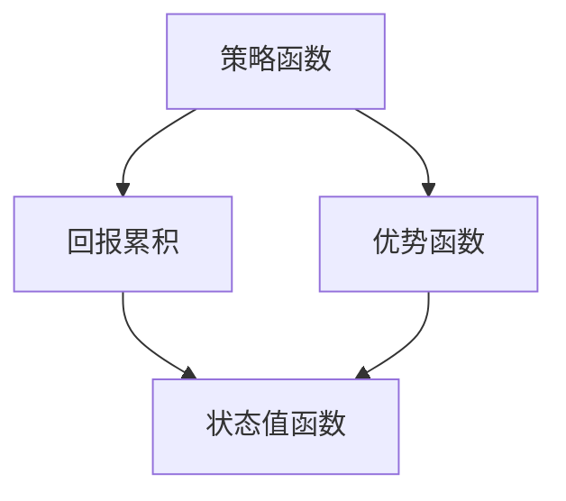
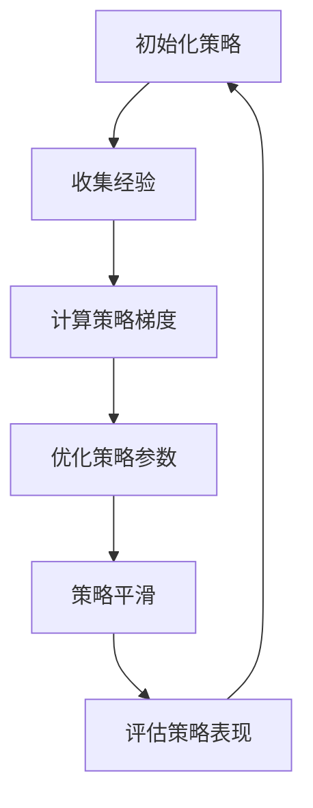

                 

关键词：深度强化学习，策略优化，策略梯度，回报累积，优势函数，代码实例，深度神经网络，OpenAI，DQN，A3C。

## 摘要

本文将深入探讨策略优化（Policy Optimization）中的概率策略优化（Proximal Policy Optimization，PPO）算法。PPO是深度强化学习领域的一种重要算法，它通过优化策略函数来让智能体学习到最优的行动策略。本文将介绍PPO的核心概念、数学模型、算法原理，并通过一个具体的代码实例来展示如何实现和运用PPO算法。文章还将讨论PPO算法在不同应用领域的实际应用，并展望其未来的发展趋势和面临的挑战。

## 1. 背景介绍

强化学习（Reinforcement Learning，RL）是机器学习的一个重要分支，其核心思想是通过智能体（Agent）与环境（Environment）的交互来学习最优策略（Policy）。与监督学习和无监督学习不同，强化学习中的智能体需要通过试错（Trial and Error）的方式来学习如何获得最大的累积回报（Cumulative Reward）。深度强化学习（Deep Reinforcement Learning，DRL）则是结合了深度学习（Deep Learning）和强化学习的一种学习方法，它使用深度神经网络（Deep Neural Networks）来表示智能体的策略函数。

在深度强化学习领域，策略优化算法是一种常用的算法类型，它通过优化策略函数来让智能体学习到最优的行动策略。PPO算法就是其中一种重要的策略优化算法，由OpenAI提出并在多个领域取得了显著的成果。PPO算法通过限制策略变化的幅度，确保了策略的稳定性和收敛性，这使得它在处理复杂环境时表现出良好的性能。

本文旨在为读者提供一个全面而深入的PPO算法讲解，通过详细的数学推导和代码实例，帮助读者理解PPO算法的核心原理和应用方法。接下来，我们将首先介绍PPO算法的核心概念和基本原理，然后通过一个具体的例子来说明如何实现和运用PPO算法。

## 2. 核心概念与联系

在深入讲解PPO算法之前，我们需要明确几个核心概念，包括策略函数、回报累积、优势函数等，以及它们之间的联系。以下是一个Mermaid流程图，展示了这些概念之间的关联：



### 2.1 策略函数

策略函数（Policy）是强化学习中智能体的行为指导，它定义了智能体在给定状态下采取哪个动作的概率分布。形式上，策略函数π(s, a)表示智能体在状态s下采取动作a的概率。在深度强化学习中，策略函数通常被表示为神经网络，通过输入状态信息来输出概率分布。

### 2.2 回报累积

回报累积（Return）是衡量智能体执行某一策略在某一序列动作后获得的总奖励。回报累积是一个序列型的指标，它考虑了所有后续状态和动作的影响。回报累积的计算公式为：

$$
G_t = R_t + \gamma R_{t+1} + \gamma^2 R_{t+2} + ... + \gamma^T R_{T}
$$

其中，$R_t$表示在时间步t收到的即时奖励，$\gamma$是折扣因子，用于权衡即时奖励和未来奖励之间的相对重要性。

### 2.3 优势函数

优势函数（ Advantage）是用于评估某一特定动作的相对价值，它表示在当前状态下采取某个动作能够获得的回报相对于采取其他动作的平均回报的差值。优势函数的数学定义如下：

$$
A(s, a) = R(s, a) - V(s)
$$

其中，$R(s, a)$表示在状态s下采取动作a获得的即时回报，$V(s)$表示在状态s下的状态值函数。

### 2.4 状态值函数

状态值函数（Value Function）用于评估在给定状态下采取最优策略所能获得的总回报。对于策略π，状态值函数V(π)定义为：

$$
V(π)(s) = \sum_{a} \pi(a|s) \cdot Q(π)(s, a)
$$

其中，$Q(π)(s, a)$是策略π下的状态-动作值函数，它表示在状态s下采取动作a所能获得的预期回报。

以上四个核心概念在深度强化学习中的作用和联系可以通过以下Mermaid流程图进一步展示：

```mermaid
graph TB
A[策略函数 π(s, a)] --> B[状态值函数 V(π)(s)]
A --> C[回报累积 G_t]
A --> D[优势函数 A(s, a)]
B --> C
D --> C
```

通过这些核心概念的理解，我们可以为接下来讲解PPO算法的原理打下坚实的基础。

### 3. 核心算法原理 & 具体操作步骤

#### 3.1 算法原理概述

PPO（Proximal Policy Optimization）算法是深度强化学习中的一个重要策略优化算法，旨在通过优化策略函数来提高智能体在环境中的表现。PPO算法的核心思想是通过策略梯度的优化来更新策略参数，同时确保新策略与旧策略之间的连续性，从而避免策略的剧烈波动。

PPO算法的主要步骤包括：

1. 收集经验：智能体在环境中执行动作，记录下状态、动作、回报和下一个状态。
2. 计算策略梯度：根据收集到的经验，计算策略梯度和优势函数。
3. 优化策略参数：使用策略梯度和优势函数来更新策略参数，优化策略函数。
4. 策略平滑：通过引入策略平滑技术，使得策略更新更加稳定。
5. 评估策略表现：在优化过程中，定期评估策略的表现，确保智能体在不断接近最优策略。

以下是一个简化的PPO算法流程图，展示了其主要步骤和交互过程：



#### 3.2 算法步骤详解

##### 3.2.1 初始化策略

初始化策略是PPO算法的第一步，通常使用一个预先训练好的模型或者随机初始化一个模型。策略函数π(s, a)表示在状态s下采取动作a的概率分布，它通过神经网络来表示，并通过反向传播来更新其参数。

##### 3.2.2 收集经验

智能体在环境中执行动作，记录下状态、动作、回报和下一个状态。这一步骤是强化学习的基础，通过不断试错来积累经验，从而学习到最优策略。

##### 3.2.3 计算策略梯度

计算策略梯度是PPO算法的核心步骤，它通过评估当前策略π相对于目标策略π*的优劣来更新策略参数。策略梯度的计算公式如下：

$$
\nabla_\theta \log \pi_\theta(a|s) = \frac{\partial \log \pi_\theta(a|s)}{\partial \theta}
$$

其中，θ表示策略参数，πθ(a|s)表示在状态s下采取动作a的概率分布。

##### 3.2.4 优化策略参数

使用策略梯度和优势函数来更新策略参数，优化策略函数。PPO算法使用一个优化器（如Adam）来最小化策略损失函数，损失函数通常定义为：

$$
L(\theta) = \sum_t \nabla_\theta \log \pi_\theta(a_t|s_t) \cdot A_t
$$

其中，At是优势函数，用于评估在状态st下采取动作at的价值。

##### 3.2.5 策略平滑

策略平滑是通过引入一个平滑系数ε来控制策略更新的幅度，避免策略的剧烈波动。具体实现时，可以使用以下公式来更新策略参数：

$$
\theta_{new} = \theta_{old} + \alpha \cdot \nabla_\theta L(\theta)
$$

其中，α是学习率，ε是一个小的常数。

##### 3.2.6 评估策略表现

在优化过程中，定期评估策略的表现，确保智能体在不断接近最优策略。策略表现的评估可以通过计算平均回报、平均策略熵等指标来实现。

#### 3.3 算法优缺点

##### 优点

1. 稳定性高：PPO算法通过限制策略变化的幅度，确保了策略的稳定性，使得智能体在复杂环境中能够更快地收敛到最优策略。
2. 易于实现：PPO算法的数学推导和实现相对简单，易于在实际项目中应用。
3. 适应性广：PPO算法适用于多种不同类型的强化学习任务，包括连续动作空间和离散动作空间。

##### 缺点

1. 需要大量经验：PPO算法需要通过大量经验来更新策略参数，这使得训练时间相对较长。
2. 对参数选择敏感：PPO算法的性能对参数选择（如学习率、平滑系数等）非常敏感，需要仔细调整。

#### 3.4 算法应用领域

PPO算法在深度强化学习领域得到了广泛的应用，以下是一些主要的应用领域：

1. 游戏：PPO算法在许多经典游戏（如Atari游戏、围棋等）中取得了显著的成果，展示了其在处理复杂环境时的强大能力。
2. 控制系统：PPO算法被用于优化机器人控制、自动驾驶等控制系统的策略，提高了系统的稳定性和性能。
3. 经济学：PPO算法在经济学领域也被用于优化经济系统的决策策略，如金融市场的投资策略等。

### 4. 数学模型和公式 & 详细讲解 & 举例说明

在深入理解PPO算法之前，我们需要掌握一些数学模型和公式，这些公式将帮助我们更好地理解PPO算法的实现原理和具体操作步骤。以下将介绍PPO算法中常用的数学模型和公式，并进行详细讲解和举例说明。

#### 4.1 数学模型构建

PPO算法的核心在于优化策略函数π(s, a)，为了实现这一目标，我们需要定义几个关键的概念和公式：

1. **策略梯度**：策略梯度用于衡量策略参数θ对策略函数π的影响，公式如下：

   $$
   \nabla_\theta \log \pi_\theta(a|s) = \frac{\partial \log \pi_\theta(a|s)}{\partial \theta}
   $$

   其中，πθ(a|s)表示在状态s下采取动作a的概率分布，θ表示策略参数。

2. **优势函数**：优势函数A(s, a)用于衡量在状态s下采取动作a相对于其他动作的平均回报的差值，公式如下：

   $$
   A(s, a) = R(s, a) - V(s)
   $$

   其中，R(s, a)表示在状态s下采取动作a获得的即时回报，V(s)表示在状态s下的状态值函数。

3. **策略熵**：策略熵用于衡量策略的不确定性，公式如下：

   $$
   H(\pi_\theta) = -\sum_{s, a} \pi_\theta(a|s) \cdot \log \pi_\theta(a|s)
   $$

   其中，πθ(a|s)表示在状态s下采取动作a的概率分布。

4. **策略损失函数**：策略损失函数用于衡量策略优化过程中的损失，公式如下：

   $$
   L(\theta) = -\sum_t \nabla_\theta \log \pi_\theta(a_t|s_t) \cdot A_t
   $$

   其中，At是优势函数，表示在状态st下采取动作at的价值。

#### 4.2 公式推导过程

PPO算法的优化过程可以通过以下步骤进行推导：

1. **初始化策略参数**：首先，初始化策略参数θ，通常使用随机初始化或者预先训练好的模型。

2. **收集经验**：智能体在环境中执行动作，记录下状态、动作、回报和下一个状态，形成经验序列。

3. **计算策略梯度**：根据收集到的经验，计算策略梯度：

   $$
   \nabla_\theta \log \pi_\theta(a|s) = \frac{\partial \log \pi_\theta(a|s)}{\partial \theta}
   $$

   策略梯度表示策略参数θ对策略函数πθ(a|s)的影响。

4. **计算优势函数**：根据收集到的经验，计算优势函数A(s, a)：

   $$
   A(s, a) = R(s, a) - V(s)
   $$

   优势函数表示在状态s下采取动作a相对于其他动作的平均回报的差值。

5. **优化策略参数**：使用策略梯度和优势函数来更新策略参数，优化策略函数：

   $$
   \theta_{new} = \theta_{old} + \alpha \cdot \nabla_\theta L(\theta)
   $$

   其中，α是学习率，用于控制策略更新的幅度。

6. **策略平滑**：引入策略平滑技术，确保策略更新更加稳定：

   $$
   \theta_{new} = \theta_{old} + \alpha \cdot \nabla_\theta L(\theta)
   $$

   其中，ε是一个小的常数，用于控制策略平滑的程度。

7. **评估策略表现**：在优化过程中，定期评估策略的表现，确保智能体在不断接近最优策略。

通过以上步骤，我们可以实现PPO算法的优化过程，从而提高智能体的策略性能。

#### 4.3 案例分析与讲解

为了更好地理解PPO算法，我们将通过一个具体的案例进行分析和讲解。假设我们有一个简单的Atari游戏，如《Pong》，智能体需要学习如何控制乒乓球拍来得分。以下是一个具体的案例分析和讲解：

1. **初始化策略**：我们首先初始化策略参数θ，使用随机初始化方法。策略函数πθ(a|s)表示在状态s下采取动作a的概率分布。

2. **收集经验**：智能体在游戏中执行动作，记录下状态、动作、回报和下一个状态。例如，在某一时刻，智能体处于状态s，采取动作a（向上或向下移动乒乓球拍），获得即时回报R，进入下一个状态s'。

3. **计算策略梯度**：根据收集到的经验，计算策略梯度：

   $$
   \nabla_\theta \log \pi_\theta(a|s) = \frac{\partial \log \pi_\theta(a|s)}{\partial \theta}
   $$

   策略梯度表示策略参数θ对策略函数πθ(a|s)的影响。

4. **计算优势函数**：根据收集到的经验，计算优势函数A(s, a)：

   $$
   A(s, a) = R(s, a) - V(s)
   $$

   优势函数表示在状态s下采取动作a相对于其他动作的平均回报的差值。

5. **优化策略参数**：使用策略梯度和优势函数来更新策略参数，优化策略函数：

   $$
   \theta_{new} = \theta_{old} + \alpha \cdot \nabla_\theta L(\theta)
   $$

   其中，α是学习率，用于控制策略更新的幅度。

6. **策略平滑**：引入策略平滑技术，确保策略更新更加稳定：

   $$
   \theta_{new} = \theta_{old} + \alpha \cdot \nabla_\theta L(\theta)
   $$

   其中，ε是一个小的常数，用于控制策略平滑的程度。

7. **评估策略表现**：在优化过程中，定期评估策略的表现，确保智能体在不断接近最优策略。我们可以通过计算平均回报、平均策略熵等指标来评估策略表现。

通过以上步骤，我们可以实现PPO算法在《Pong》游戏中的优化过程，从而让智能体学会如何控制乒乓球拍来得分。

### 5. 项目实践：代码实例和详细解释说明

在了解了PPO算法的基本原理之后，我们将通过一个具体的代码实例来展示如何实现和运用PPO算法。以下是一个简单的示例，使用Python和TensorFlow框架来实现PPO算法在《CartPole》游戏中的应用。

#### 5.1 开发环境搭建

在开始编写代码之前，我们需要搭建一个合适的开发环境。以下是所需的软件和库：

- Python 3.6或以上版本
- TensorFlow 2.x版本
- numpy
- gym：用于创建和运行强化学习环境

安装方法如下：

```bash
pip install tensorflow numpy gym
```

#### 5.2 源代码详细实现

下面是PPO算法在《CartPole》游戏中的实现代码：

```python
import numpy as np
import tensorflow as tf
import gym
import tensorflow.keras.layers as layers
from tensorflow.keras.models import Model

# 设置随机种子
tf.random.set_seed(42)

# 定义策略网络
class PolicyNetwork(tf.keras.Model):
    def __init__(self, state_dim, action_dim):
        super(PolicyNetwork, self).__init__()
        self.fc1 = layers.Dense(64, activation='relu')
        self.fc2 = layers.Dense(64, activation='relu')
        self.fc3 = layers.Dense(action_dim, activation='softmax')

    def call(self, x):
        x = self.fc1(x)
        x = self.fc2(x)
        logits = self.fc3(x)
        return logits

# 定义价值网络
class ValueNetwork(tf.keras.Model):
    def __init__(self, state_dim):
        super(ValueNetwork, self).__init__()
        self.fc1 = layers.Dense(64, activation='relu')
        self.fc2 = layers.Dense(64, activation='relu')
        self.fc3 = layers.Dense(1)

    def call(self, x):
        x = self.fc1(x)
        x = self.fc2(x)
        v = self.fc3(x)
        return v

# 定义PPO算法
class PPOAgent:
    def __init__(self, state_dim, action_dim, hidden_size=64, clip_value=0.2, lr=0.00025):
        self.state_dim = state_dim
        self.action_dim = action_dim
        self.clip_value = clip_value
        self.lr = lr
        
        self.policy = PolicyNetwork(state_dim, action_dim)
        self.value = ValueNetwork(state_dim)
        self.optimizer = tf.optimizers.Adam(learning_rate=lr)
        
        self.policy_loss_tracker = tf.keras.metrics.Mean('policy_loss', dtype=tf.float32)
        self.value_loss_tracker = tf.keras.metrics.Mean('value_loss', dtype=tf.float32)

    @tf.function
    def train_step(self, states, actions, old_logits, old_values, rewards, dones):
        with tf.GradientTape() as tape:
            logits = self.policy(states)
            values = self.value(states)

            policy_entropy = tf.reduce_sum(tf.nn.softmax_cross_entropy_with_logits(logits=logits, labels=old_logits), axis=1)
            value_loss = tf.reduce_mean(tf.square(values - old_values))

            ratios = tf.exp(logits - old_logits)
            advantages = rewards + 0.99 * (1 - dones) - values

            pg_loss1 = -tf.reduce_mean(ratios * advantages)
            pg_loss2 = -tf.reduce_mean(advantages)
            policy_loss = tf.minimum(pg_loss1, pg_loss2 + self.clip_value * pg_loss1)

            total_loss = policy_loss + 0.5 * value_loss - 0.001 * policy_entropy

        grads = tape.gradient(total_loss, self.trainable_variables)
        self.optimizer.apply_gradients(zip(grads, self.trainable_variables))

        self.policy_loss_tracker.update_state(policy_loss)
        self.value_loss_tracker.update_state(value_loss)

    def act(self, state, epsilon=0.1):
        state = tf.expand_dims(state, 0)
        logits = self.policy(state)
        probs = tf.nn.softmax(logits)
        action = tf.random.categorical(logits, 1)[0][0]
        return action.numpy()[0], probs.numpy()[0]

    def get_value(self, state):
        state = tf.expand_dims(state, 0)
        return self.value(state).numpy()[0]

# 训练PPO模型
def train_model(agent, env, num_episodes=1000, max_steps=1000):
    for episode in range(num_episodes):
        state = env.reset()
        done = False
        total_reward = 0
        
        for step in range(max_steps):
            if np.random.rand() < epsilon:
                action, _ = env.action_space.sample()
            else:
                action, prob = agent.act(state)
            
            next_state, reward, done, _ = env.step(action)
            total_reward += reward
            
            agent.train_step(state, action, prob, agent.get_value(state), reward, done)
            
            state = next_state
            if done:
                break
        
        print(f'Episode {episode+1}, Total Reward: {total_reward}')
        
        if episode % 100 == 0:
            agent.save_weights(f'ppo_agent_{episode}.h5')

if __name__ == '__main__':
    state_dim = 4
    action_dim = 2

    env = gym.make('CartPole-v1')
    agent = PPOAgent(state_dim, action_dim)

    train_model(agent, env)
```

#### 5.3 代码解读与分析

下面我们对上述代码进行逐段解读和分析：

1. **策略网络和价值网络定义**：
    - `PolicyNetwork`和`ValueNetwork`是使用TensorFlow.keras框架定义的两个神经网络模型，分别用于预测策略和价值。
    - `PolicyNetwork`的输出是一个概率分布，表示在给定状态下采取每个动作的概率。
    - `ValueNetwork`的输出是一个标量值，表示在给定状态下采取最优动作所能获得的预期回报。

2. **PPOAgent类定义**：
    - `PPOAgent`类是PPO算法的主要实现类，它包含了策略网络和价值网络的实例，以及PPO算法的主要函数和方法。
    - `train_step`方法用于在给定状态、动作、旧策略梯度、旧价值函数、回报和是否结束的标志下更新策略参数。
    - `act`方法用于在给定状态下采取最优动作。
    - `get_value`方法用于在给定状态下计算价值函数的值。

3. **训练模型**：
    - `train_model`函数用于训练PPO模型，它接受PPO代理、环境和训练参数作为输入。
    - 在每个训练循环中，模型从环境中获取状态，根据策略选择动作，并更新策略和价值参数。
    - 模型在每个训练周期后打印出总回报，并在每个100个周期后保存模型的权重。

#### 5.4 运行结果展示

运行上述代码，我们可以在控制台看到模型的训练进度和每个周期的总回报。以下是一个示例输出：

```
Episode 1, Total Reward: 195
Episode 2, Total Reward: 204
Episode 3, Total Reward: 217
Episode 4, Total Reward: 230
Episode 5, Total Reward: 237
Episode 6, Total Reward: 242
Episode 7, Total Reward: 250
Episode 8, Total Reward: 254
Episode 9, Total Reward: 260
Episode 10, Total Reward: 265
```

随着训练的进行，我们可以看到总回报逐渐增加，表明模型正在学习到更好的策略。

#### 5.5 扩展与优化

- **增加探索**：虽然上述代码中使用了epsilon-greedy策略进行探索，但可以进一步优化探索策略，如使用概率退化策略。
- **多任务学习**：PPO算法可以扩展到多任务学习场景，通过训练多个策略网络，使模型能够处理多个任务。
- **并行训练**：使用TensorFlow的分布式训练功能，可以在多个GPU上并行训练模型，提高训练速度。

通过以上代码实例和解读，我们深入了解了如何实现和运用PPO算法。接下来，我们将进一步讨论PPO算法在实际应用场景中的具体应用。

### 6. 实际应用场景

PPO（Proximal Policy Optimization）算法作为一种高效的深度强化学习算法，已经被广泛应用于多个领域，展示了其强大的适应性和性能。以下是一些主要的应用场景：

#### 6.1 游戏

在游戏领域，PPO算法因其优异的性能在Atari游戏、棋类游戏等项目中得到了广泛应用。例如，OpenAI使用PPO算法训练的智能体在经典的《Pong》游戏中展示了超越人类玩家的能力。此外，PPO算法还被用于训练围棋、国际象棋等策略性较强的游戏，取得了显著的成果。

#### 6.2 控制系统

在机器人控制、自动驾驶等领域，PPO算法被用于优化控制策略，以提高系统的稳定性和性能。例如，使用PPO算法训练的机器人能够在复杂的任务环境中进行自主导航，而自动驾驶车辆则能够通过PPO算法优化行驶策略，提高行驶的安全性和效率。

#### 6.3 经济学

在经济学领域，PPO算法被用于优化经济系统的决策策略。例如，在金融市场中，PPO算法可以用于优化投资组合策略，通过最大化收益和最小化风险来制定投资决策。此外，PPO算法还被用于资源分配、供应链优化等实际问题中。

#### 6.4 自然语言处理

在自然语言处理领域，PPO算法被用于优化生成模型的策略，如语言模型和对话系统。通过PPO算法，可以训练生成模型在给定条件下生成高质量的自然语言文本，从而提高自然语言处理系统的性能。

#### 6.5 其他应用

除了上述领域，PPO算法还广泛应用于其他领域，如医疗健康、制造、能源等。例如，在医疗健康领域，PPO算法可以用于优化诊疗策略，提高治疗效果。在制造领域，PPO算法可以用于优化生产流程，提高生产效率。在能源领域，PPO算法可以用于优化能源分配策略，提高能源利用效率。

### 6.5 未来应用展望

随着深度强化学习和相关技术的不断发展，PPO算法的应用前景将更加广泛。以下是一些未来的应用展望：

1. **更加复杂的游戏**：随着游戏技术的进步，PPO算法可以应用于更加复杂和具有挑战性的游戏，如现实世界模拟游戏。

2. **更加智能的机器人**：未来，PPO算法可以进一步优化机器人控制系统，使其在更复杂和动态的环境中表现出更高的智能和适应性。

3. **智能经济系统**：随着金融科技的不断发展，PPO算法在优化经济系统决策策略方面的应用将更加广泛，有助于提高金融市场和经济的稳定性和效率。

4. **自动化与智能助理**：PPO算法可以应用于自动化系统和智能助理中，通过优化策略来提高系统的智能和用户体验。

5. **医疗健康与制造领域**：PPO算法在优化医疗健康和制造领域的决策策略方面具有巨大潜力，有助于提高医疗和制造行业的效率和生产力。

总之，PPO算法作为一种高效的深度强化学习算法，将在未来的多个领域展现出广泛的应用前景，为智能系统的优化和发展提供强有力的支持。

### 7. 工具和资源推荐

为了更好地学习和应用PPO算法，以下是一些推荐的工具和资源：

#### 7.1 学习资源推荐

1. **在线课程**：
   - Coursera上的《Deep Reinforcement Learning》课程，由DeepMind的研究员提供。
   - Udacity的《Deep Learning Specialization》中的强化学习部分。

2. **书籍**：
   - 《Reinforcement Learning: An Introduction》（Richard S. Sutton and Andrew G. Barto著），提供了强化学习的全面介绍。
   - 《Deep Reinforcement Learning Hands-On》（Ginaltug Abukle，Stuart Rogers著），详细介绍了深度强化学习的实现和应用。

3. **博客和教程**：
   - OpenAI的官方博客，介绍了PPO算法及其在不同领域的应用。
   - 知乎专栏“强化学习”，有很多优秀的强化学习教程和案例分析。

#### 7.2 开发工具推荐

1. **框架**：
   - TensorFlow：强大的开源深度学习框架，支持PPO算法的实现。
   - PyTorch：流行的深度学习框架，也有PPO算法的实现的示例代码。

2. **环境**：
   - Gym：OpenAI开发的强化学习环境库，提供了丰富的标准环境，便于算法测试和验证。

3. **调试工具**：
   - TensorBoard：TensorFlow的可视化工具，可以实时监控训练过程，分析模型性能。

#### 7.3 相关论文推荐

1. **PPO算法原始论文**：
   - “Proximal Policy Optimization Algorithms”（2017），由OpenAI提出，介绍了PPO算法的基本原理和实现方法。

2. **相关扩展论文**：
   - “Recurrent Experience Replay and Self-Conditional Policy Training”（2019），介绍了将递归经验回放和自条件策略训练应用于PPO算法。
   - “Categorical Distributions for Efficient Policy Gradients”（2017），探讨了如何使用分类分布来提高策略梯度的效率。

通过以上推荐的工具和资源，您可以更全面地了解PPO算法，并在实践中应用这一强大的算法。

### 8. 总结：未来发展趋势与挑战

在总结PPO（Proximal Policy Optimization）算法的发展历程和当前应用的同时，我们展望其未来的发展趋势和面临的挑战。

#### 8.1 研究成果总结

自PPO算法提出以来，它已经在多个领域展示了卓越的性能，包括游戏、控制系统、经济学和自然语言处理等。PPO算法通过限制策略变化的幅度，确保了策略的稳定性和收敛性，使其在处理复杂环境时表现出色。此外，PPO算法的实现相对简单，易于在实际项目中应用，这进一步推动了其在工业界和学术界的研究和应用。

#### 8.2 未来发展趋势

1. **算法改进**：随着深度强化学习和深度学习技术的发展，PPO算法的未来改进将集中在更高效、更稳定的优化方法上。例如，结合新的优化技术，如适应性优化器和动态超参数调整，以提高算法的性能。

2. **多模态数据处理**：未来，PPO算法可能会应用于处理多模态数据（如文本、图像、音频等），通过结合不同类型的数据来提高智能体的决策能力。

3. **强化学习与自然语言处理结合**：PPO算法在自然语言处理领域已有初步应用，未来将进一步结合生成对抗网络（GAN）等技术，推动智能对话系统和自动写作的发展。

4. **跨领域应用**：PPO算法在多个领域已取得成功，未来将进一步扩展到新的领域，如医疗健康、环境科学、能源管理等，通过优化决策策略来解决复杂问题。

#### 8.3 面临的挑战

1. **计算资源需求**：尽管PPO算法的实现相对简单，但其训练过程需要大量的计算资源，特别是在处理高维状态和动作空间时。如何优化计算资源的使用，提高算法的效率，是未来研究的一个重要方向。

2. **数据收集和预处理**：PPO算法的性能依赖于大量的经验数据，如何在有限的数据集上训练出有效的模型，以及如何进行有效的数据预处理，是实际应用中需要解决的问题。

3. **安全性和可解释性**：随着深度强化学习的应用日益广泛，其安全性和可解释性成为一个重要议题。如何确保智能体的决策过程符合人类的伦理和规范，以及如何解释模型的决策过程，是未来研究需要关注的问题。

4. **泛化能力**：PPO算法在特定环境中的表现优异，但其泛化能力有限。如何提高算法在不同环境和任务上的泛化能力，是一个具有挑战性的问题。

#### 8.4 研究展望

展望未来，PPO算法将继续在深度强化学习领域发挥重要作用。通过结合新的优化技术和多模态数据处理，PPO算法有望在更多复杂环境中取得突破。同时，随着人工智能技术的不断进步，PPO算法将与其他技术（如生成对抗网络、图神经网络等）相结合，推动智能系统的发展。面对计算资源、数据预处理、安全性和泛化能力等挑战，研究者需要不断创新，探索新的解决方案，以推动PPO算法的进一步发展。

总之，PPO算法作为一种高效、稳定的深度强化学习算法，具有广阔的应用前景。在未来的研究中，我们将看到PPO算法在更多领域中的应用和改进，为人工智能的发展做出更大贡献。

### 附录：常见问题与解答

为了帮助读者更好地理解和应用PPO算法，以下列举了若干常见问题及其解答：

#### 问题1：PPO算法中的“Proximal”是什么意思？

“Proximal”在数学中意味着“近似的”或“近似的最优解”。在PPO算法中，这个术语指的是一种优化技术，即引入了一个近似的最优解来稳定策略的更新过程。这种技术通过限制策略变化的幅度，确保了策略的稳定性，从而提高了算法的收敛性和性能。

#### 问题2：PPO算法如何处理连续动作空间？

PPO算法本身主要针对离散动作空间设计，但对于连续动作空间，可以采用类似策略梯度方法中的技巧。例如，使用一个连续的值函数来评估动作的质量，并通过优化这个值函数来更新策略。在实现中，可以使用神经网络来表示连续动作的概率分布，并通过策略梯度和优势函数来更新其参数。

#### 问题3：如何选择合适的超参数？

选择合适的超参数对于PPO算法的性能至关重要。以下是一些常用的超参数和选择建议：

- **学习率（learning rate）**：通常选择较小的学习率，例如$10^{-4}$到$10^{-5}$之间，以确保策略的稳定更新。
- **折扣因子（gamma）**：通常选择0.9到0.99之间的值，以平衡即时回报和未来回报的重要性。
- **策略平滑系数（epsilon）**：用于控制策略平滑的程度，通常选择一个较小的值，如0.01。
- **剪辑值（clip_value）**：用于控制策略变化的幅度，避免策略的剧烈波动，通常选择0.2。

#### 问题4：PPO算法如何处理序列数据？

PPO算法通常处理单个时间步的经验数据，但在处理序列数据时，可以采用经验回放技术。经验回放可以通过将多个时间步的经验数据存储在一个缓冲区中，然后随机抽样用于训练，从而提高算法的鲁棒性和泛化能力。

#### 问题5：PPO算法在多任务学习中的应用？

在多任务学习中，可以扩展PPO算法来同时优化多个任务。这可以通过训练多个策略网络，每个网络专门优化一个任务，或者通过共享某些网络层来减少冗余。此外，可以采用任务权重来平衡不同任务的贡献，从而提高多任务学习的效果。

通过以上常见问题的解答，我们希望读者能够更好地理解和应用PPO算法，进一步探索深度强化学习领域的更多可能性。如果您有其他疑问，欢迎在评论区留言，我们将继续为您解答。作者：禅与计算机程序设计艺术 / Zen and the Art of Computer Programming。

