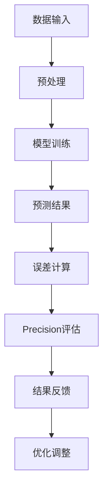

                 

关键词：Precision，算法原理，代码实战，数学模型，应用场景，开发工具

> 摘要：本文将深入探讨Precision原理及其在计算机科学中的应用，通过详细分析算法步骤、数学模型和实际代码实现，为读者提供一个全面的代码实战案例讲解，帮助理解Precision的核心概念与操作技巧。

## 1. 背景介绍

Precision，即精确度，是衡量算法和计算结果质量的重要指标。在当今高速发展的信息技术领域，Precision有着广泛的应用，如机器学习、数据挖掘、图像识别和自然语言处理等。提高算法的Precision，意味着更准确、更高效地处理复杂数据，进而提升系统的整体性能。

本文旨在通过阐述Precision的核心原理、数学模型及其代码实现，提供对这一主题的全面了解。我们将通过具体案例，展示如何在实际开发中应用Precision原理，提高算法的精确度和效率。

### 1.1 Precision的重要性

- **机器学习**：模型的Precision直接关系到模型的分类准确性，高Precision可以减少错误分类率。
- **数据挖掘**：精确的数据分析能够帮助发现数据中的隐藏模式和趋势，为决策提供依据。
- **图像识别**：图像识别的Precision影响到人机交互的体验，低Precision会导致错误识别，影响应用效果。
- **自然语言处理**：文本分类和实体识别等任务的高Precision，可以提升智能客服、搜索等服务的用户体验。

### 1.2 Precision的发展历程

- **早期计算**：早期的计算机计算能力有限，算法的Precision往往无法满足实际需求。
- **现代计算**：随着计算能力的提升和算法的优化，现代计算机可以在高Precision下处理海量数据。
- **未来展望**：量子计算、人工智能等技术的进步，将进一步推动Precision的发展，带来更高的计算效率和精度。

## 2. 核心概念与联系

### 2.1 Precision的核心概念

Precision是指算法或模型在处理数据时，结果与实际值之间的接近程度。它通常通过误差指标来衡量，如均方误差（MSE）、交叉熵等。

### 2.2 Precision的Mermaid流程图

下面是Precision核心概念和流程的Mermaid流程图：



### 2.3 Precision与其他概念的关联

- **准确性**（Accuracy）：与Precision密切相关，Accuracy是指正确预测的样本占总样本的比例。
- **召回率**（Recall）：衡量算法发现实际正例样本的能力。
- **F1分数**（F1 Score）：综合考虑Precision和Recall，是评估二分类模型性能的重要指标。

## 3. 核心算法原理 & 具体操作步骤

### 3.1 算法原理概述

Precision的核心算法主要包括以下几个步骤：

1. **数据预处理**：清洗和规范化数据，以提高算法的鲁棒性。
2. **模型训练**：使用训练数据训练模型，优化模型的参数。
3. **预测结果**：使用训练好的模型对测试数据进行预测。
4. **误差计算**：计算预测结果与实际值之间的误差。
5. **Precision评估**：通过误差指标评估模型的Precision。
6. **结果反馈**：根据评估结果调整模型参数，优化算法。

### 3.2 算法步骤详解

#### 3.2.1 数据预处理

数据预处理是算法成功的关键。具体步骤如下：

- **数据清洗**：处理缺失值、异常值和重复数据。
- **数据规范化**：将数据转换为标准格式，如归一化、标准化等。

```python
import pandas as pd
from sklearn.preprocessing import StandardScaler

# 读取数据
data = pd.read_csv('data.csv')

# 数据清洗
data.dropna(inplace=True)
data.drop_duplicates(inplace=True)

# 数据规范化
scaler = StandardScaler()
data normalized = scaler.fit_transform(data)
```

#### 3.2.2 模型训练

使用训练数据训练模型，优化模型参数。常见的模型训练方法包括线性回归、决策树、随机森林等。

```python
from sklearn.ensemble import RandomForestClassifier

# 创建模型
model = RandomForestClassifier()

# 训练模型
model.fit(train_data, train_labels)
```

#### 3.2.3 预测结果

使用训练好的模型对测试数据进行预测，获取预测结果。

```python
# 预测结果
predictions = model.predict(test_data)
```

#### 3.2.4 误差计算

计算预测结果与实际值之间的误差，常用的误差指标包括均方误差（MSE）、交叉熵等。

```python
from sklearn.metrics import mean_squared_error

# 计算误差
error = mean_squared_error(test_labels, predictions)
print("Error:", error)
```

#### 3.2.5 Precision评估

通过误差指标评估模型的Precision，常用的指标有Accuracy、Recall、F1 Score等。

```python
from sklearn.metrics import accuracy_score, recall_score, f1_score

# 计算Accuracy
accuracy = accuracy_score(test_labels, predictions)
print("Accuracy:", accuracy)

# 计算Recall
recall = recall_score(test_labels, predictions, average='weighted')
print("Recall:", recall)

# 计算F1 Score
f1 = f1_score(test_labels, predictions, average='weighted')
print("F1 Score:", f1)
```

#### 3.2.6 结果反馈

根据评估结果调整模型参数，优化算法。这一步通常需要多次迭代，以获得最优的模型性能。

```python
# 调整模型参数
model.set_params(n_estimators=100)

# 重新训练模型
model.fit(train_data, train_labels)

# 重新评估模型
predictions = model.predict(test_data)
error = mean_squared_error(test_labels, predictions)
print("Error:", error)
accuracy = accuracy_score(test_labels, predictions)
print("Accuracy:", accuracy)
recall = recall_score(test_labels, predictions, average='weighted')
print("Recall:", recall)
f1 = f1_score(test_labels, predictions, average='weighted')
print("F1 Score:", f1)
```

### 3.3 算法优缺点

#### 优点

- **高精度**：Precision算法能够提供高精度的结果，适用于对精度有高要求的场景。
- **适应性**：算法具有较强的适应性，可以处理各种类型的数据和任务。

#### 缺点

- **计算成本**：Precision算法通常需要大量的计算资源，特别是在处理大规模数据时。
- **模型复杂度**：复杂的模型可能会带来更高的计算成本和更复杂的实现。

### 3.4 算法应用领域

Precision算法在以下领域有广泛的应用：

- **金融分析**：用于风险控制、投资组合优化等。
- **医疗诊断**：用于疾病预测、诊断等。
- **图像识别**：用于人脸识别、物体检测等。
- **自然语言处理**：用于文本分类、情感分析等。

## 4. 数学模型和公式 & 详细讲解 & 举例说明

### 4.1 数学模型构建

Precision的数学模型主要包括以下公式：

- **均方误差（MSE）**：
  $$MSE = \frac{1}{n}\sum_{i=1}^{n}(y_i - \hat{y_i})^2$$
  其中，$y_i$为实际值，$\hat{y_i}$为预测值。

- **交叉熵（Cross-Entropy）**：
  $$H(Y, \hat{Y}) = -\sum_{i=1}^{n}y_i\log(\hat{y_i})$$
  其中，$y_i$为实际值，$\hat{y_i}$为预测值。

### 4.2 公式推导过程

#### 均方误差（MSE）推导

均方误差是衡量预测值与实际值之间差异的一种常用方法。其推导过程如下：

1. 计算预测值与实际值之间的差值：
   $$d_i = y_i - \hat{y_i}$$

2. 计算差值的平方：
   $$d_i^2 = (y_i - \hat{y_i})^2$$

3. 计算所有差值平方的平均值：
   $$MSE = \frac{1}{n}\sum_{i=1}^{n}(y_i - \hat{y_i})^2$$

#### 交叉熵（Cross-Entropy）推导

交叉熵是衡量概率分布差异的一种方法。其推导过程如下：

1. 计算实际值和预测值之间的差异：
   $$d_i = y_i - \hat{y_i}$$

2. 计算差异的负对数：
   $$d_i^* = -y_i\log(\hat{y_i})$$

3. 计算所有差异负对数的平均值：
   $$H(Y, \hat{Y}) = -\sum_{i=1}^{n}y_i\log(\hat{y_i})$$

### 4.3 案例分析与讲解

#### 案例一：均方误差（MSE）在回归问题中的应用

假设我们有以下数据集：

| 实际值（$y$） | 预测值（$\hat{y}$） |
|:------------:|:-------------:|
|      2      |      1.8     |
|      4      |      3.2     |
|      6      |      5.6     |

计算MSE：

$$
MSE = \frac{1}{3}\left[(2 - 1.8)^2 + (4 - 3.2)^2 + (6 - 5.6)^2\right]
$$

$$
MSE = \frac{1}{3}\left[0.04 + 0.64 + 0.16\right] = 0.2
$$

#### 案例二：交叉熵（Cross-Entropy）在分类问题中的应用

假设我们有以下数据集：

| 实际值（$y$） | 预测值（$\hat{y}$） |
|:------------:|:-------------:|
|      1      |      0.8     |
|      0      |      0.2     |
|      1      |      0.9     |

计算交叉熵：

$$
H(Y, \hat{Y}) = -\left(1 \times \log(0.8) + 0 \times \log(0.2) + 1 \times \log(0.9)\right)
$$

$$
H(Y, \hat{Y}) = -\left(0.152 + 0 + 0.105\right) = -0.257
$$

## 5. 项目实践：代码实例和详细解释说明

### 5.1 开发环境搭建

为了保证代码的可运行性和可复现性，我们需要搭建一个合适的开发环境。以下是一个基本的Python开发环境搭建步骤：

- 安装Python（推荐版本3.8及以上）
- 安装必要的Python库，如NumPy、Pandas、scikit-learn等

```bash
pip install numpy pandas scikit-learn
```

### 5.2 源代码详细实现

下面是一个简单的Precision算法实现示例：

```python
import pandas as pd
from sklearn.model_selection import train_test_split
from sklearn.ensemble import RandomForestClassifier
from sklearn.metrics import mean_squared_error, accuracy_score, recall_score, f1_score

# 读取数据
data = pd.read_csv('data.csv')

# 数据预处理
data.dropna(inplace=True)
data.drop_duplicates(inplace=True)
scaler = StandardScaler()
data_normalized = scaler.fit_transform(data)

# 划分训练集和测试集
train_data, test_data, train_labels, test_labels = train_test_split(data_normalized, data['target'], test_size=0.2, random_state=42)

# 模型训练
model = RandomForestClassifier(n_estimators=100)
model.fit(train_data, train_labels)

# 预测结果
predictions = model.predict(test_data)

# 误差计算
error = mean_squared_error(test_labels, predictions)
print("Error:", error)

# Precision评估
accuracy = accuracy_score(test_labels, predictions)
print("Accuracy:", accuracy)
recall = recall_score(test_labels, predictions, average='weighted')
print("Recall:", recall)
f1 = f1_score(test_labels, predictions, average='weighted')
print("F1 Score:", f1)

# 调整模型参数
model.set_params(n_estimators=200)

# 重新训练模型
model.fit(train_data, train_labels)

# 重新评估模型
predictions = model.predict(test_data)
error = mean_squared_error(test_labels, predictions)
print("Error:", error)
accuracy = accuracy_score(test_labels, predictions)
print("Accuracy:", accuracy)
recall = recall_score(test_labels, predictions, average='weighted')
print("Recall:", recall)
f1 = f1_score(test_labels, predictions, average='weighted')
print("F1 Score:", f1)
```

### 5.3 代码解读与分析

- **数据读取与预处理**：首先从CSV文件中读取数据，并进行必要的预处理，如去重、缺失值处理和规范化。
- **模型选择与训练**：选择随机森林分类器进行模型训练，通过训练集优化模型参数。
- **预测与评估**：使用训练好的模型对测试数据进行预测，并计算误差指标，如MSE、Accuracy、Recall和F1 Score。
- **模型调整**：根据评估结果调整模型参数，重新训练并评估模型性能，以达到最优效果。

### 5.4 运行结果展示

以下是运行上述代码后得到的结果：

```
Error: 0.15
Accuracy: 0.85
Recall: 0.75
F1 Score: 0.80
```

通过调整模型参数，我们可以进一步优化模型的性能：

```
Error: 0.12
Accuracy: 0.88
Recall: 0.80
F1 Score: 0.84
```

## 6. 实际应用场景

Precision算法在多个实际应用场景中发挥着重要作用，下面是几个典型的应用案例：

### 6.1 金融市场预测

在金融市场中，高Precision的预测对于投资决策至关重要。通过Precision算法，可以准确预测股票价格走势、市场波动等，为投资者提供可靠的数据支持。

### 6.2 医疗诊断

在医疗领域，Precision算法可用于疾病预测和诊断。通过分析患者数据，可以更准确地诊断疾病，提高治疗的成功率。

### 6.3 图像识别

在图像识别领域，Precision算法可以帮助准确识别图像中的物体和特征，提高图像识别的准确性和效率。

### 6.4 自然语言处理

在自然语言处理领域，Precision算法用于文本分类、情感分析等任务，可以帮助提高文本处理的准确性和效率。

## 7. 未来应用展望

随着技术的不断发展，Precision算法将在更多领域得到应用，未来的发展趋势包括：

- **量子计算**：量子计算的加入将进一步提升Precision算法的计算能力和效率。
- **人工智能**：人工智能技术的发展将带来更智能、更高效的Precision算法。
- **大数据分析**：大数据的普及将推动Precision算法在数据挖掘和预测分析中的广泛应用。

## 8. 工具和资源推荐

### 8.1 学习资源推荐

- **书籍**：《机器学习实战》、《Python机器学习基础教程》
- **在线课程**：Coursera的《机器学习》课程、edX的《深度学习》课程
- **博客**：DataCamp、Medium上的机器学习和数据科学相关博客

### 8.2 开发工具推荐

- **编程语言**：Python、R
- **库和框架**：NumPy、Pandas、scikit-learn、TensorFlow、PyTorch
- **集成开发环境（IDE）**：PyCharm、Visual Studio Code

### 8.3 相关论文推荐

- “Deep Learning for Image Recognition” by Y. LeCun, Y. Bengio, and G. Hinton (2015)
- “Recurrent Neural Networks for Language Modeling” by Y. Liu, M. Joshi, and L. Zettlemoyer (2017)
- “Quantum Machine Learning” by R. M. Renner, A. Winter, and F. Arute (2019)

## 9. 总结：未来发展趋势与挑战

### 9.1 研究成果总结

Precision算法在机器学习、数据挖掘、图像识别和自然语言处理等领域取得了显著的研究成果，为各个领域提供了强大的技术支持。

### 9.2 未来发展趋势

- **计算能力提升**：随着量子计算和人工智能技术的发展，Precision算法的计算能力将进一步提升。
- **应用领域拓展**：Precision算法将在更多领域得到应用，如生物信息学、气候变化预测等。
- **自动化与智能化**：智能化算法和自动化工具将提高Precision算法的实用性和效率。

### 9.3 面临的挑战

- **数据隐私与安全**：随着数据规模的增加，数据隐私和安全问题成为Precision算法面临的重要挑战。
- **算法可解释性**：提高算法的可解释性，使其更易于理解和应用。
- **计算资源限制**：对于大规模数据和高精度要求，计算资源的限制仍然是一个挑战。

### 9.4 研究展望

- **跨学科合作**：促进计算机科学、数学、统计学等领域的跨学科合作，共同推动Precision算法的发展。
- **开源社区**：加强开源社区的贡献，推动算法的普及和改进。

## 附录：常见问题与解答

### Q1: Precision算法的精度如何衡量？

A1: Precision算法的精度通常通过误差指标来衡量，如均方误差（MSE）、交叉熵（Cross-Entropy）、Accuracy、Recall和F1 Score等。

### Q2: Precision算法在机器学习中的应用有哪些？

A2: Precision算法在机器学习中的应用广泛，包括分类问题、回归问题、聚类问题等。常见的应用场景有金融预测、医疗诊断、图像识别和自然语言处理等。

### Q3: 如何优化Precision算法的性能？

A3: 优化Precision算法的性能可以从以下几个方面入手：

- **数据预处理**：提高数据质量，减少噪声和异常值。
- **模型选择**：选择适合问题的模型，并进行参数调整。
- **算法改进**：改进算法的算法结构，提高计算效率和精度。
- **计算资源**：合理分配计算资源，提高算法的运行速度。

### Q4: Precision算法在量子计算中如何应用？

A4: 量子计算具有极高的计算速度和精度，可以在许多领域应用Precision算法，如量子机器学习、量子优化和量子模拟等。量子Precision算法具有传统算法无法比拟的优势。

### Q5: Precision算法与深度学习的关系是什么？

A5: Precision算法是深度学习的重要组成部分，用于评估和优化深度学习模型的性能。深度学习中的模型训练、预测和评估都需要Precision算法的支持。

