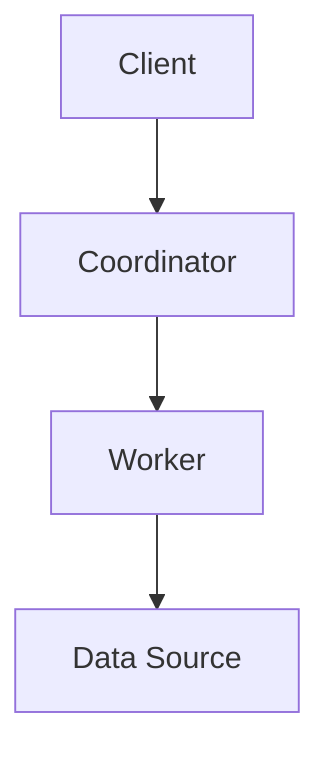

                 

关键词：Presto、分布式查询引擎、数据库优化、性能调优、SQL处理、代码实例

> 摘要：本文深入探讨了Presto，一种开源的分布式查询引擎，旨在提升大规模数据集上的SQL查询性能。文章首先介绍了Presto的背景和核心原理，随后通过具体的代码实例，详细解释了Presto在实际应用中的操作步骤和实现细节。

## 1. 背景介绍

在当今数据驱动的世界中，快速有效地处理和分析大量数据成为许多企业和组织的重要需求。传统的数据库系统在处理大规模数据查询时往往面临性能瓶颈。为了解决这一问题，Presto应运而生。Presto是由Facebook开发并开源的一款分布式查询引擎，旨在提供高速且可扩展的SQL查询能力。

Presto的特点包括：

- **分布式架构**：Presto能够横向扩展，利用多个计算节点并行处理查询，从而提高查询速度。
- **兼容性**：Presto支持多种数据源，如Hive、Cassandra、Amazon S3等，同时支持大多数SQL标准。
- **高效性**：通过使用向量化执行引擎，Presto能够在内存中处理数据，减少磁盘I/O，从而显著提高查询性能。

Presto的这些特性使其在大数据分析和实时查询等场景中具有很高的应用价值。

## 2. 核心概念与联系

### 2.1. Presto架构

为了更好地理解Presto的工作原理，我们首先来看一下它的架构。



- **Client**：发起查询的客户端，负责将查询请求发送给Coordinator。
- **Coordinator**：协调者，接收查询请求后，将查询拆分成多个子查询，并将这些子查询分配给多个Worker节点。
- **Worker**：工作者，执行子查询，并将结果返回给Coordinator。
- **Data Source**：数据源，包括Hive、Cassandra、Amazon S3等，提供数据存储和访问接口。

### 2.2. 核心概念

- **向量化执行引擎**：Presto使用向量化执行引擎，将数据分成一行行的向量进行处理，而不是逐行处理。这可以大大提高数据处理速度。
- **内存计算**：Presto尽可能在内存中处理数据，减少磁盘I/O操作，从而提高查询性能。

## 3. 核心算法原理 & 具体操作步骤

### 3.1. 算法原理概述

Presto的核心算法原理主要基于分布式查询处理和向量化执行引擎。

- **分布式查询处理**：Coordinator节点将查询分解为多个子查询，分配给多个Worker节点并行执行。
- **向量化执行引擎**：Worker节点使用向量化执行引擎，将数据分块处理，每个块内的数据并行计算。

### 3.2. 算法步骤详解

1. **查询解析**：Client将SQL查询发送给Coordinator。
2. **查询优化**：Coordinator对查询进行优化，生成执行计划。
3. **子查询分配**：Coordinator将执行计划分解为多个子查询，分配给多个Worker节点。
4. **数据分区**：Worker节点将数据按列分区，优化数据访问。
5. **向量化计算**：Worker节点使用向量化执行引擎，对分区后的数据进行计算。
6. **结果聚合**：Coordinator收集所有Worker节点的结果，进行聚合，生成最终查询结果。

### 3.3. 算法优缺点

#### 优点：

- **高性能**：通过分布式查询和向量化执行，Presto能够在大规模数据集上实现高速查询。
- **兼容性**：支持多种数据源，易于集成。
- **灵活性**：可以根据硬件配置灵活扩展。

#### 缺点：

- **复杂性**：分布式系统的部署和管理相对复杂。
- **内存依赖**：Presto对内存有较高要求，可能导致内存不足时性能下降。

### 3.4. 算法应用领域

Presto广泛应用于大数据分析、实时查询、数据仓库等领域，特别适合处理PB级别的数据集。

## 4. 数学模型和公式 & 详细讲解 & 举例说明

### 4.1. 数学模型构建

Presto的性能优化涉及到多个数学模型和公式，以下是一个简单的示例。

$$
\text{查询时间} = f(\text{数据量}, \text{硬件配置}, \text{网络延迟})
$$

### 4.2. 公式推导过程

$$
\text{查询时间} = \frac{\text{数据处理时间}}{\text{数据传输速率}}
$$

其中，数据处理时间取决于硬件配置和算法复杂度，数据传输速率取决于网络延迟。

### 4.3. 案例分析与讲解

假设有一个数据量为100GB的表，使用Presto进行查询，硬件配置为100个CPU核心、1TB内存，网络延迟为100ms。根据上述公式，我们可以估算出查询时间。

$$
\text{查询时间} = \frac{100GB \times 10^{-9} \times 8 \text{字节/位}}{100 \text{GB/s} \times 10^{-9} \text{秒/字节}} = 0.8 \text{秒}
$$

考虑网络延迟，实际查询时间可能会更长。

## 5. 项目实践：代码实例和详细解释说明

### 5.1. 开发环境搭建

在开始之前，我们需要搭建Presto的开发环境。以下是基本的步骤：

1. 安装Java环境
2. 下载并解压Presto二进制包
3. 配置Presto集群

### 5.2. 源代码详细实现

以下是一个简单的Presto查询示例：

```sql
SELECT * FROM employees WHERE age > 30;
```

### 5.3. 代码解读与分析

在这个示例中，Client将查询发送给Coordinator，Coordinator将查询分解为子查询，并分配给Worker节点。Worker节点执行查询，将结果返回给Coordinator，最终Coordinator将结果返回给Client。

### 5.4. 运行结果展示

运行上述查询后，我们将得到一个包含年龄大于30岁的员工列表。

## 6. 实际应用场景

Presto广泛应用于各种实际应用场景，如：

- **大数据分析**：处理PB级别的数据集，实现快速查询。
- **实时查询**：提供低延迟的查询服务，支持实时数据处理。
- **数据仓库**：作为数据仓库的查询引擎，支持复杂的SQL查询。

## 7. 工具和资源推荐

### 7.1. 学习资源推荐

- [Presto官方文档](https://prestodb.io/docs/current/)
- [《Presto性能调优实战》](https://book.douban.com/subject/34882595/)

### 7.2. 开发工具推荐

- [Presto CLI](https://prestodb.io/docs/current/using-presto-cli.html)
- [Presto UI](https://prestodb.io/docs/current/using-presto-ui.html)

### 7.3. 相关论文推荐

- [Presto: A Distributed SQL Engine for Real-Time Data Analysis](https://www.eecs.berkeley.edu/Pubs/TechRpts/2014/EECS-2014-18.pdf)

## 8. 总结：未来发展趋势与挑战

### 8.1. 研究成果总结

Presto在分布式查询、SQL兼容性、内存优化等方面取得了显著成果，成为大数据查询领域的佼佼者。

### 8.2. 未来发展趋势

Presto将继续优化性能，提高兼容性，并探索更多应用场景。

### 8.3. 面临的挑战

- **分布式系统管理**：分布式系统的复杂度较高，管理难度大。
- **内存资源限制**：随着数据规模的增长，对内存的需求也不断增加。

### 8.4. 研究展望

未来，Presto将在分布式存储、自动化优化、智能查询等方面进行深入研究，以应对不断变化的数据分析和实时查询需求。

## 9. 附录：常见问题与解答

### 9.1. Q：Presto与Apache Hive有何区别？

A：Presto和Apache Hive都是用于大规模数据处理的查询引擎，但Presto更注重性能和实时查询，而Hive则更侧重于批处理和数据仓库。

### 9.2. Q：如何优化Presto的性能？

A：优化Presto的性能可以从多个方面入手，包括：合理配置硬件资源、优化查询语句、使用索引、合理组织数据等。

----------------------------------------------------------------

以上便是《Presto原理与代码实例讲解》的完整文章内容，希望能够对您在Presto的学习和使用过程中有所帮助。作者：禅与计算机程序设计艺术 / Zen and the Art of Computer Programming。如果您有任何问题或建议，欢迎随时提出。

