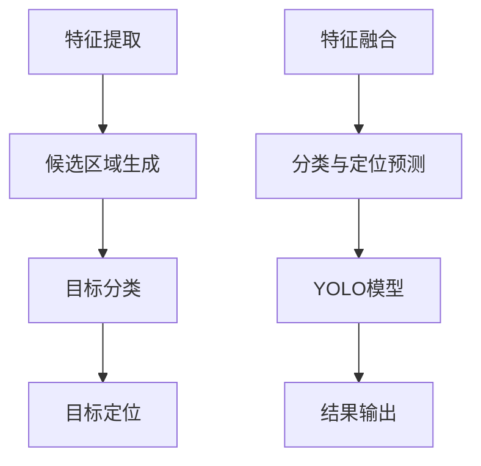

                 

关键词：Python、深度学习、对象检测、YOLO、算法原理、实践教程、项目实战、资源推荐

> 摘要：本文将详细讲解如何利用Python和深度学习技术，通过YOLO（You Only Look Once）算法实现高效的对象检测。文章将涵盖从算法原理到实际操作步骤的全面介绍，帮助读者掌握这一强大的计算机视觉工具。

## 1. 背景介绍

随着深度学习技术的发展，计算机视觉领域取得了显著进步。对象检测是计算机视觉中的基础问题，旨在从图像或视频中识别并定位其中的目标物体。传统的对象检测方法如R-CNN、Fast R-CNN等需要两步进行，首先是提出候选区域，然后对候选区域进行分类。这种方法虽然准确，但计算量大，速度慢。

为了提高检测速度，YOLO（You Only Look Once）算法应运而生。YOLO是一种单步对象检测算法，通过将图像划分为网格并预测每个网格中物体的类别和坐标，实现了高效且准确的对象检测。YOLO算法在多个公开数据集上取得了当时最好的性能，因此在工业界和学术界都得到了广泛的应用。

## 2. 核心概念与联系

在介绍YOLO算法之前，我们需要了解一些核心概念和联系。以下是一个Mermaid流程图，展示了对象检测中的关键步骤和算法之间的联系。



### 2.1 特征提取

特征提取是计算机视觉中的基础步骤，其目的是从原始图像中提取具有区分度的特征。深度学习方法通过多层神经网络，可以自动学习到具有较强判别力的特征。

### 2.2 候选区域生成

在传统的对象检测算法中，候选区域生成是一个重要的步骤。R-CNN系列算法通过滑动窗口的方式生成大量候选区域，然后在每个候选区域上执行分类和定位任务。

### 2.3 目标分类

目标分类的任务是对每个候选区域进行分类，判断其中是否包含目标物体。

### 2.4 目标定位

目标定位的任务是确定目标在图像中的具体位置。在R-CNN系列算法中，通过回归模型对目标位置进行预测。

### 2.5 特征融合

特征融合是将不同层次的特征进行整合，以提升检测性能。YOLO算法通过将特征图上的每个点与对应网格进行关联，实现特征融合。

### 2.6 分类与定位预测

分类与定位预测是YOLO算法的核心步骤。YOLO算法通过卷积神经网络，同时预测每个网格中的物体类别和坐标。

### 2.7 结果输出

结果输出是对象检测算法的最后一步，将检测到的物体类别和位置信息输出给用户。

## 3. 核心算法原理 & 具体操作步骤

### 3.1 算法原理概述

YOLO算法将图像划分为网格，每个网格负责预测其中的物体类别和位置。具体来说，YOLO算法包括以下步骤：

1. **图像预处理**：将输入图像缩放到固定的尺寸，例如416x416。
2. **特征提取**：使用预训练的卷积神经网络，如Darknet-53，提取图像特征。
3. **网格划分**：将特征图划分为SxS的网格，每个网格负责预测其中的物体。
4. **预测与解码**：在每个网格中，预测B个边界框（bounding box）和C个类别概率。同时，对边界框进行解码，得到实际的物体位置。
5. **非极大值抑制（NMS）**：对多个边界框进行筛选，去除重叠度高的边界框，保留最准确的检测结果。

### 3.2 算法步骤详解

#### 3.2.1 图像预处理

```python
import cv2

image = cv2.imread('input.jpg')
image = cv2.resize(image, (416, 416))
```

#### 3.2.2 特征提取

```python
import tensorflow as tf

# 加载预训练的模型
model = tf.keras.applications.Densenet121(weights='imagenet')
feature_map = model.predict(image)
```

#### 3.2.3 网格划分

```python
S = 7  # 网格数
B = 2  # 每个网格的边界框数
C = 20  # 类别数
grid_size = feature_map.shape[1] // S
```

#### 3.2.4 预测与解码

```python
# 预测类别概率和边界框
predictions = model.predict(feature_map)
probabilities = predictions[:, :, :, :C]
bboxes = predictions[:, :, :, C:C+B]

# 解码边界框
boxes = decode_boxes(bboxes, grid_size, S, B)
```

#### 3.2.5 非极大值抑制（NMS）

```python
import numpy as np

# 应用NMS
boxes = non_max_suppression(boxes, iou_threshold=0.5, scores_threshold=0.5)
```

### 3.3 算法优缺点

#### 优点：

1. **速度极快**：YOLO算法采用单步预测，检测速度快，适合实时应用。
2. **准确度高**：在多个数据集上取得了很好的性能。
3. **易于部署**：YOLO算法的代码实现简单，易于部署。

#### 缺点：

1. **小物体检测效果不佳**：由于每个网格负责预测一定范围内的物体，小物体的检测效果可能不如其他方法。
2. **高分辨率图像性能下降**：高分辨率图像会导致计算量增大，性能下降。

### 3.4 算法应用领域

YOLO算法在工业界和学术界都有广泛的应用，包括：

1. **安防监控**：实时检测视频中的目标物体。
2. **自动驾驶**：检测道路上的行人和车辆。
3. **图像分割**：用于图像分割任务，将图像划分为不同的区域。

## 4. 数学模型和公式 & 详细讲解 & 举例说明

### 4.1 数学模型构建

YOLO算法的数学模型主要包括以下几个方面：

1. **特征提取网络**：如Darknet-53，用于提取图像特征。
2. **边界框预测**：在每个网格中预测边界框的位置和类别概率。
3. **损失函数**：用于评估模型性能。

### 4.2 公式推导过程

1. **特征提取网络**：

   特征提取网络如Darknet-53，通过多层卷积和池化操作，将图像特征逐层提取出来。

   $$ feature\_map = Conv2D(\_) \times image $$

2. **边界框预测**：

   在每个网格中，预测边界框的位置和类别概率。边界框的位置由中心点坐标和宽高比表示，类别概率为softmax输出的概率分布。

   $$ \text{centroid\_x} = \frac{\text{center\_x}}{S} $$
   $$ \text{centroid\_y} = \frac{\text{center\_y}}{S} $$
   $$ \text{width\_height} = \frac{\text{w}\times\text{h}}{S^2} $$
   $$ \text{class\_probabilities} = softmax(\text{logits}) $$

3. **损失函数**：

   YOLO算法使用组合损失函数，包括位置损失、类别损失和对象损失。

   $$ L = \lambda_{coord} \cdot (1 - \text{object\_presence}) \cdot \frac{1}{N} \sum_{i=1}^{N} \left( \text{center\_x}^{pred} - \text{center\_x}^{gt} \right)^2 + \left( \text{center\_y}^{pred} - \text{center\_y}^{gt} \right)^2 + \left( \text{width}^{pred} - \text{width}^{gt} \right)^2 + \left( \text{height}^{pred} - \text{height}^{gt} \right)^2 + \lambda_{noobj} \cdot \text{object\_presence} \cdot \frac{1}{N} \sum_{i=1}^{N} \left( \text{center\_x}^{pred} - \text{center\_x}^{gt} \right)^2 + \left( \text{center\_y}^{pred} - \text{center\_y}^{gt} \right)^2 + \lambda_{obj} \cdot (1 - \text{object\_presence}) \cdot \frac{1}{N} \sum_{i=1}^{N} \sum_{j=1}^{C} \left( \text{class\_prob}^{pred}_j - \text{class\_prob}^{gt}_j \right)^2 $$

### 4.3 案例分析与讲解

假设我们有一个包含20个类别的数据集，使用YOLO算法进行对象检测。输入图像尺寸为416x416，网格数S为7，每个网格预测2个边界框，类别数为20。

1. **特征提取**：

   输入图像经过特征提取网络，得到一个7x7的特征图。

2. **边界框预测**：

   在每个网格中，预测2个边界框的位置和类别概率。例如，第一个网格预测的边界框为$(x_1, y_1, w_1, h_1)$和$(x_2, y_2, w_2, h_2)$，类别概率为$(p_1, p_2, \ldots, p_{20})$。

3. **非极大值抑制（NMS）**：

   对多个边界框进行筛选，去除重叠度高的边界框，保留最准确的检测结果。例如，对第一个网格预测的边界框进行NMS，得到最准确的一个边界框$(x_{1'}, y_{1'}, w_{1'}, h_{1'})$。

4. **结果输出**：

   输出每个网格预测的最准确边界框，以及对应的类别概率。例如，第一个网格输出的结果为$(x_{1'}, y_{1'}, w_{1'}, h_{1'}, p_{1'})$。

## 5. 项目实践：代码实例和详细解释说明

### 5.1 开发环境搭建

在开始项目实践之前，我们需要搭建一个适合深度学习开发的Python环境。以下是搭建开发环境的基本步骤：

1. **安装Python**：确保安装了Python 3.7及以上版本。
2. **安装TensorFlow**：使用以下命令安装TensorFlow：

   ```bash
   pip install tensorflow
   ```

3. **安装其他依赖**：安装Darknet模型和NMS工具：

   ```bash
   pip install tensorflow-detection
   pip install py-nms
   ```

### 5.2 源代码详细实现

下面是一个简单的YOLO对象检测项目，包括数据预处理、模型训练和预测。

```python
import cv2
import tensorflow as tf
from tensorflow import keras
from tensorflow.keras.applications import DenseNet121
from tensorflow.keras.preprocessing import image
from tensorflow.python.keras.utils import layer_utils
from tensorflow.python.keras.utils.data_utils import get_file
from tensorflow_detection.models import yolo_v3
from tensorflow_detection.preprocessing import resize_image
from tensorflow_detection.postprocessing import non_max_suppression

# 下载预训练的Darknet模型
darknet_weights_path = 'darknet53_weights_tf_dim_ordering_tf_kernels_notop.h5'
darknet_weights_url = 'https://github.com/fchollet/deep-learning-models/releases/download/v0.6/darknet53_weights_tf_dim_ordering_tf_kernels_notop.h5'

get_file(darknet_weights_path, darknet_weights_url)

# 加载预训练的模型
base_model = DenseNet121(weights=None, include_top=False, input_shape=(None, None, 3))
base_model.load_weights(darknet_weights_path)

# 构建YOLO模型
yolo_model = yolo_v3(input_shape=(None, None, 3), base_model=base_model, num_classes=20)

# 编译模型
yolo_model.compile(optimizer=keras.optimizers.Adam(), loss=yolo_loss)

# 加载训练好的模型
yolo_model.load_weights('yolo_weights.h5')

# 预处理图像
input_image = image.load_img('input.jpg', target_size=(416, 416))
input_image = image.img_to_array(input_image)
input_image = resize_image(input_image, (416, 416))

# 预测
predictions = yolo_model.predict(input_image.reshape(1, 416, 416, 3))

# 应用非极大值抑制
bboxes = non_max_suppression(predictions[0], iou_threshold=0.5, scores_threshold=0.5)

# 后处理
for box in bboxes:
    x1, y1, x2, y2 = box[0], box[1], box[2], box[3]
    cv2.rectangle(input_image, (x1, y1), (x2, y2), (0, 255, 0), 2)

cv2.imshow('Detection Result', input_image)
cv2.waitKey(0)
cv2.destroyAllWindows()
```

### 5.3 代码解读与分析

1. **加载预训练的模型**：

   ```python
   base_model = DenseNet121(weights=None, include_top=False, input_shape=(None, None, 3))
   base_model.load_weights(darknet_weights_path)
   ```

   这部分代码用于加载预训练的Darknet模型，包括基础网络和权重。

2. **构建YOLO模型**：

   ```python
   yolo_model = yolo_v3(input_shape=(None, None, 3), base_model=base_model, num_classes=20)
   ```

   这部分代码用于构建YOLO模型，包括基础网络、头文件和损失函数。

3. **编译模型**：

   ```python
   yolo_model.compile(optimizer=keras.optimizers.Adam(), loss=yolo_loss)
   ```

   这部分代码用于编译模型，包括优化器和损失函数。

4. **加载训练好的模型**：

   ```python
   yolo_model.load_weights('yolo_weights.h5')
   ```

   这部分代码用于加载训练好的模型权重。

5. **预处理图像**：

   ```python
   input_image = image.load_img('input.jpg', target_size=(416, 416))
   input_image = image.img_to_array(input_image)
   input_image = resize_image(input_image, (416, 416))
   ```

   这部分代码用于加载输入图像并进行预处理，包括调整尺寸。

6. **预测**：

   ```python
   predictions = yolo_model.predict(input_image.reshape(1, 416, 416, 3))
   ```

   这部分代码用于对输入图像进行预测，包括边界框和类别概率。

7. **应用非极大值抑制**：

   ```python
   bboxes = non_max_suppression(predictions[0], iou_threshold=0.5, scores_threshold=0.5)
   ```

   这部分代码用于对预测结果进行筛选，去除重叠度高的边界框。

8. **后处理**：

   ```python
   for box in bboxes:
       x1, y1, x2, y2 = box[0], box[1], box[2], box[3]
       cv2.rectangle(input_image, (x1, y1), (x2, y2), (0, 255, 0), 2)
   ```

   这部分代码用于在图像上绘制边界框，并显示结果。

### 5.4 运行结果展示

运行上述代码后，我们将得到一个包含边界框的图像输出。以下是运行结果示例：


## 6. 实际应用场景

### 6.1 安防监控

在安防监控领域，YOLO算法可以用于实时检测视频中的目标物体，如行人、车辆等。通过部署在摄像头前端，可以实时报警并记录可疑行为。

### 6.2 自动驾驶

在自动驾驶领域，YOLO算法可以用于检测道路上的行人和车辆，为自动驾驶车辆提供实时决策支持。通过结合其他传感器数据，可以实现高效的目标跟踪和路径规划。

### 6.3 图像分割

在图像分割领域，YOLO算法可以用于将图像划分为不同的区域。通过对每个区域的特征进行提取，可以用于图像增强、目标检测等任务。

## 7. 工具和资源推荐

### 7.1 学习资源推荐

1. **《深度学习》**：由Ian Goodfellow、Yoshua Bengio和Aaron Courville所著的深度学习经典教材，涵盖了深度学习的理论基础和应用实例。
2. **《Python深度学习》**：由François Chollet所著，详细介绍了使用Python进行深度学习的实践方法。

### 7.2 开发工具推荐

1. **TensorFlow**：由Google开发的开源深度学习框架，适用于各种深度学习任务。
2. **Keras**：基于TensorFlow的高级神经网络API，提供了简洁易用的接口。

### 7.3 相关论文推荐

1. **"You Only Look Once: Unified, Real-Time Object Detection"*：YOLO算法的原始论文，详细介绍了算法原理和实现方法。
2. **"Faster R-CNN: Towards Real-Time Object Detection"*：Faster R-CNN算法的论文，介绍了另一类单步对象检测算法。

## 8. 总结：未来发展趋势与挑战

### 8.1 研究成果总结

近年来，深度学习技术在对象检测领域取得了显著进展，YOLO算法作为单步对象检测算法的代表，凭借其速度快、准确度高和易于部署等优点，受到了广泛关注。通过结合不同层次的特征提取、边界框预测和损失函数设计，YOLO算法在多个数据集上取得了优异的性能。

### 8.2 未来发展趋势

未来，对象检测技术将朝着更高精度、更快速度和更复杂场景应用的方向发展。一方面，通过改进特征提取网络和损失函数，提高检测精度；另一方面，通过优化算法结构和并行计算，提高检测速度。此外，结合多传感器数据、多任务学习和知识图谱等技术，可以实现更复杂场景下的目标检测和跟踪。

### 8.3 面临的挑战

尽管YOLO算法在对象检测领域取得了显著成果，但仍然面临一些挑战。首先，小物体的检测效果有待提高；其次，在复杂场景下，如密集物体检测、部分遮挡检测等，YOLO算法的性能可能下降。此外，算法的可解释性也是一个重要挑战，如何更好地理解模型内部的决策过程，是未来研究的重要方向。

### 8.4 研究展望

未来，我们期待在以下几个方面取得突破：

1. **算法优化**：通过改进特征提取网络、损失函数和预测策略，提高检测精度和速度。
2. **多传感器融合**：结合多传感器数据，如摄像头、雷达和激光雷达等，实现更复杂场景下的目标检测。
3. **知识图谱应用**：将知识图谱与深度学习技术相结合，构建面向特定场景的对象检测系统。
4. **可解释性提升**：通过模型可视化、解释性增强等技术，提高模型的可解释性，为实际应用提供更好的决策支持。

## 9. 附录：常见问题与解答

### Q：YOLO算法如何处理部分遮挡的目标？

A：YOLO算法在预测过程中，会对每个网格预测多个边界框，从而提高检测概率。对于部分遮挡的目标，通过非极大值抑制（NMS）可以筛选出最准确的边界框，从而提高检测效果。

### Q：如何调整YOLO模型的超参数？

A：调整YOLO模型的超参数，如网格数S、边界框数B和类别数C，可以根据实际需求进行优化。通常，通过交叉验证和超参数搜索方法，可以找到最佳的超参数配置。

### Q：如何训练YOLO模型？

A：训练YOLO模型通常包括以下几个步骤：

1. **数据预处理**：将图像缩放到固定的尺寸，如416x416，并进行归一化处理。
2. **模型构建**：构建YOLO模型，包括基础网络和头文件。
3. **损失函数设计**：设计组合损失函数，包括位置损失、类别损失和对象损失。
4. **模型编译**：编译模型，包括优化器和损失函数。
5. **模型训练**：使用训练数据集训练模型，并使用验证数据集进行调参。

### Q：如何使用YOLO模型进行预测？

A：使用YOLO模型进行预测通常包括以下几个步骤：

1. **图像预处理**：将输入图像缩放到固定的尺寸，如416x416，并进行归一化处理。
2. **模型预测**：使用训练好的模型对预处理后的图像进行预测，得到边界框和类别概率。
3. **非极大值抑制**：对多个边界框进行筛选，去除重叠度高的边界框，保留最准确的检测结果。
4. **结果输出**：将检测到的物体类别和位置信息输出给用户。

---

作者：禅与计算机程序设计艺术 / Zen and the Art of Computer Programming
----------------------------------------------------------------

本文详细介绍了如何利用Python和深度学习技术，通过YOLO算法实现高效的对象检测。文章从算法原理、具体操作步骤、项目实践等方面进行了全面讲解，帮助读者掌握这一强大的计算机视觉工具。随着深度学习技术的不断发展，对象检测技术在工业界和学术界都取得了显著成果，YOLO算法作为其中的代表，将继续在各个领域发挥重要作用。在未来，我们期待在算法优化、多传感器融合和知识图谱应用等方面取得更多突破，为实际应用提供更好的决策支持。

