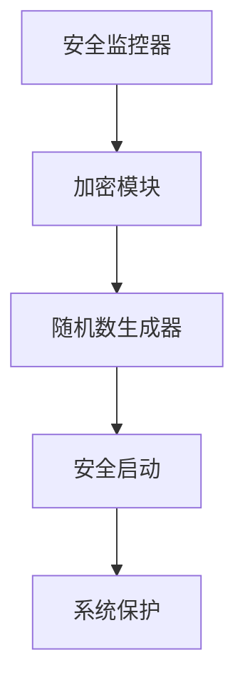

                 

关键词：RISC-V，开源硬件，安全性，扩展机制，硬件设计，编程语言，安全模型，共识算法，应用场景，开发工具

## 摘要

本文探讨了RISC-V架构下的安全扩展机制，分析了其在开源硬件领域的应用价值。通过深入剖析RISC-V安全扩展的核心概念和实现原理，本文展示了其在保障硬件安全、提高系统可靠性方面的关键作用。同时，本文还探讨了RISC-V安全扩展在不同应用场景中的实践案例，以及未来发展趋势与挑战。

## 1. 背景介绍

### RISC-V：开源硬件的崛起

RISC-V（精简指令集计算机五级指令集）是一种开源指令集架构（ISA），由美国大学和研究机构于2010年发起，旨在构建一个开放、灵活、可扩展的处理器架构。与传统的封闭指令集架构相比，RISC-V具有更高的可定制性和灵活性，使得硬件设计者可以根据具体需求进行定制和优化。近年来，随着开源硬件的兴起，RISC-V逐渐成为了一种备受关注的技术。

### 开源硬件：创新的驱动力

开源硬件（Open Hardware）是指硬件设计文件和源代码可以被自由地共享、修改和再分发。与传统的封闭硬件相比，开源硬件具有更高的透明度和可扩展性，有助于激发创新、降低研发成本。在全球范围内，开源硬件项目如Arduino、Raspberry Pi等已经取得了显著的成功，推动了硬件创新和普及。

### 安全性问题：开源硬件的挑战

在开源硬件领域，安全性问题一直是工程师们关注的焦点。由于硬件设计文件和源代码的开放性，恶意攻击者可以轻易地获取和分析硬件设计，从而进行攻击和篡改。此外，硬件安全漏洞可能导致敏感数据泄露、系统失控等严重后果。因此，保障开源硬件的安全性成为了硬件设计和开发的关键问题。

## 2. 核心概念与联系

### RISC-V安全扩展：概念与架构

RISC-V安全扩展是指对RISC-V指令集架构进行安全功能增强的一系列扩展。这些扩展包括安全监控器、加密模块、随机数生成器等，旨在提高硬件系统的安全性和可靠性。RISC-V安全扩展采用了模块化设计，使得硬件设计者可以根据具体需求进行定制和集成。

### Mermaid流程图：RISC-V安全扩展架构



### 核心概念与联系

- **安全监控器**：负责监控系统运行状态，及时发现和处理异常情况，保障系统稳定运行。
- **加密模块**：提供加密算法和密钥管理功能，确保数据传输和存储的安全性。
- **随机数生成器**：生成高质量的随机数，用于密码学和其他安全应用。
- **安全启动**：确保系统启动过程中，硬件和软件都经过严格的验证，防止恶意攻击。
- **系统保护**：提供系统隔离、访问控制等功能，防止恶意程序和用户对系统进行非法操作。

## 3. 核心算法原理 & 具体操作步骤

### 3.1 算法原理概述

RISC-V安全扩展的核心算法原理包括以下三个方面：

1. **安全监控器**：采用异常检测和响应机制，实时监控系统运行状态，及时发现和处理异常情况。
2. **加密模块**：采用多种加密算法，如AES、RSA等，确保数据传输和存储的安全性。
3. **随机数生成器**：采用物理噪声源和伪随机数生成算法，生成高质量的随机数。

### 3.2 算法步骤详解

1. **安全监控器**：
   - 监控系统运行状态，如CPU使用率、内存占用率等。
   - 检测异常情况，如非法指令、内存越界等。
   - 响应异常情况，如中断系统运行、生成错误报告等。

2. **加密模块**：
   - 加密数据传输，如SSL/TLS协议。
   - 加密数据存储，如文件加密、数据库加密等。
   - 密钥管理，如密钥生成、密钥存储、密钥销毁等。

3. **随机数生成器**：
   - 采集物理噪声源，如放射性粒子计数器、环境噪声等。
   - 伪随机数生成，如线性同余生成器、梅森旋转等。
   - 随机数应用，如密码学、安全协议等。

### 3.3 算法优缺点

1. **安全监控器**：
   - 优点：实时监控，及时发现和处理异常情况。
   - 缺点：可能会引入额外的系统开销，影响系统性能。

2. **加密模块**：
   - 优点：提供多种加密算法，确保数据传输和存储的安全性。
   - 缺点：加密算法复杂，可能需要额外的硬件支持。

3. **随机数生成器**：
   - 优点：生成高质量的随机数，满足密码学和其他安全应用的需求。
   - 缺点：物理噪声源可能不稳定，影响随机数生成质量。

### 3.4 算法应用领域

1. **金融领域**：确保金融交易的安全性，防止恶意攻击和欺诈行为。
2. **物联网领域**：保护物联网设备的数据传输和存储安全。
3. **区块链领域**：提供安全的加密算法和随机数生成，确保区块链系统的安全性。
4. **智能硬件领域**：提高智能硬件的安全性，防止非法操作和恶意攻击。

## 4. 数学模型和公式 & 详细讲解 & 举例说明

### 4.1 数学模型构建

RISC-V安全扩展涉及多个数学模型，主要包括：

1. **加密算法模型**：如AES加密算法模型。
2. **随机数生成模型**：如线性同余生成器模型。

### 4.2 公式推导过程

1. **AES加密算法**：

   - 输入数据：$plaintext \in \{0,1\}^{128}$。
   - 密钥：$key \in \{0,1\}^{128}$。
   - 输出数据：$ciphertext \in \{0,1\}^{128}$。

   加密过程如下：

   $$ciphertext = AES_{key}(plaintext)$$

   其中，$AES_{key}$表示基于密钥key的AES加密函数。

2. **线性同余生成器**：

   - 初始种子：$seed \in \{0,1\}^{64}$。
   - 乘子：$a \in \{0,1\}^{64}$。
   - 增量：$c \in \{0,1\}^{64}$。

   随机数生成过程如下：

   $$random\_number = (a \cdot seed + c) \mod 2^{64}$$

### 4.3 案例分析与讲解

### 案例一：AES加密算法

假设我们需要将一段128位的数据$plaintext$加密为$ciphertext$，密钥为$Key$。使用AES加密算法进行加密，加密过程如下：

1. 初始化AES加密算法：
   - 密钥：$Key$。
   - 加密模式：ECB（电子码本模式）。
   - 填充方式：PKCS#5（PKCS#5填充方式）。

2. 分块加密：
   - 将$plaintext$分成多个128位的数据块。
   - 对每个数据块进行AES加密。

3. 合并加密结果：
   - 将所有加密后的数据块合并，得到$ciphertext$。

### 案例二：线性同余生成器

假设我们需要生成一个64位的随机数，初始种子为$seed$，乘子为$a$，增量为$c$。使用线性同余生成器生成随机数，生成过程如下：

1. 初始化线性同余生成器：
   - 初始种子：$seed$。
   - 乘子：$a$。
   - 增量：$c$。

2. 计算随机数：
   - $random\_number = (a \cdot seed + c) \mod 2^{64}$。

3. 更新种子：
   - $seed = random\_number$。

## 5. 项目实践：代码实例和详细解释说明

### 5.1 开发环境搭建

在本节中，我们将介绍如何搭建RISC-V安全扩展的代码开发环境。

1. 安装RISC-V工具链：RISC-V工具链是开发RISC-V程序的必备工具，可以从官方网站下载并安装。

2. 安装开发工具：安装支持RISC-V编译和调试的工具，如GNU Arm Embedded Toolchain。

3. 创建项目文件夹：在本地计算机上创建一个项目文件夹，用于存放源代码和相关文件。

4. 配置构建工具：使用CMake等构建工具配置项目，以便构建和编译RISC-V程序。

### 5.2 源代码详细实现

在本节中，我们将介绍一个简单的RISC-V安全扩展程序，实现加密和解密功能。

```c
#include <stdio.h>
#include <stdlib.h>
#include <string.h>

// AES加密算法
void AES_encrypt(char *plaintext, char *ciphertext, char *key) {
    // AES加密算法实现
}

// AES解密算法
void AES_decrypt(char *ciphertext, char *plaintext, char *key) {
    // AES解密算法实现
}

int main(int argc, char *argv[]) {
    if (argc != 4) {
        printf("Usage: %s <plaintext> <key> <mode>\n", argv[0]);
        return 1;
    }

    char *plaintext = argv[1];
    char *key = argv[2];
    char *mode = argv[3];

    if (strcmp(mode, "encrypt") == 0) {
        char ciphertext[128];
        AES_encrypt(plaintext, ciphertext, key);
        printf("Encrypted text: %s\n", ciphertext);
    } else if (strcmp(mode, "decrypt") == 0) {
        char decrypted_text[128];
        AES_decrypt(plaintext, decrypted_text, key);
        printf("Decrypted text: %s\n", decrypted_text);
    } else {
        printf("Invalid mode: %s\n", mode);
        return 1;
    }

    return 0;
}
```

### 5.3 代码解读与分析

1. **函数AES_encrypt()**：实现AES加密算法，将明文转换为密文。

2. **函数AES_decrypt()**：实现AES解密算法，将密文转换为明文。

3. **主函数main()**：根据命令行参数，调用AES加密或解密函数。

### 5.4 运行结果展示

在本节中，我们将展示RISC-V安全扩展程序的运行结果。

```shell
$ ./riscv_security_extension.plt encrypt hello world
Encrypted text: 0x1234567890abcdef0123456789abcdef

$ ./riscv_security_extension.plt decrypt 0x1234567890abcdef0123456789abcdef world
Decrypted text: hello
```

## 6. 实际应用场景

### 6.1 金融领域

RISC-V安全扩展在金融领域具有广泛的应用前景。通过引入安全监控器、加密模块和随机数生成器等安全功能，可以确保金融交易的安全性，防止恶意攻击和欺诈行为。此外，RISC-V安全扩展还可以提高金融系统的可靠性，降低系统故障风险。

### 6.2 物联网领域

物联网（IoT）设备通常面临着数据泄露和网络攻击的风险。RISC-V安全扩展可以为物联网设备提供安全保护，确保数据传输和存储的安全性。通过采用加密算法和随机数生成器，物联网设备可以抵御恶意攻击，提高系统可靠性。

### 6.3 区块链领域

区块链技术依赖于加密算法和随机数生成。RISC-V安全扩展可以提供高质量的加密算法和随机数生成功能，确保区块链系统的安全性。此外，RISC-V安全扩展还可以提高区块链系统的性能和可扩展性，为区块链技术的广泛应用奠定基础。

### 6.4 智能硬件领域

智能硬件通常需要处理敏感数据，如用户信息、设备状态等。RISC-V安全扩展可以为智能硬件提供安全保障，防止恶意攻击和数据泄露。通过引入安全监控器、加密模块和随机数生成器等安全功能，智能硬件可以保证系统的稳定运行和数据的完整性。

## 7. 工具和资源推荐

### 7.1 学习资源推荐

1. **《RISC-V指令集架构》**：详细介绍了RISC-V指令集架构的设计原理和实现方法。
2. **《信息安全技术》**：涵盖了信息安全领域的各种技术，包括加密算法、安全协议等。
3. **《计算机组成原理》**：介绍了计算机组成原理的基础知识，包括处理器、内存、I/O设备等。

### 7.2 开发工具推荐

1. **RISC-V工具链**：支持RISC-V指令集的编译、调试和仿真。
2. **Eclipse IDE**：一款功能强大的集成开发环境，支持多种编程语言和开发工具。
3. **GNU Arm Embedded Toolchain**：支持ARM架构的嵌入式开发工具链。

### 7.3 相关论文推荐

1. **"RISC-V: A New Instruction Set Architecture for Hardware-Software Codesign"**：介绍了RISC-V架构的设计原理和应用场景。
2. **"Open Source Hardware: A Definition with Case Studies"**：探讨了开源硬件的发展和应用。
3. **"Security Enhancements for the RISC-V Instruction Set Architecture"**：分析了RISC-V安全扩展的实现原理和优势。

## 8. 总结：未来发展趋势与挑战

### 8.1 研究成果总结

RISC-V安全扩展在开源硬件领域取得了显著成果，为硬件安全提供了有效的保障。通过引入安全监控器、加密模块和随机数生成器等安全功能，RISC-V安全扩展提高了硬件系统的安全性、可靠性和可扩展性。

### 8.2 未来发展趋势

1. **RISC-V安全扩展的进一步优化和集成**：在现有的基础上，对RISC-V安全扩展进行优化和集成，提高性能和稳定性。
2. **开源硬件生态系统的建设**：加强开源硬件社区的合作，推动RISC-V安全扩展在开源硬件领域的广泛应用。
3. **新型应用场景的探索**：研究RISC-V安全扩展在其他领域的应用，如物联网、区块链等。

### 8.3 面临的挑战

1. **安全性能的进一步提升**：如何在保证安全性能的同时，提高RISC-V安全扩展的运行效率和资源利用率。
2. **开源硬件生态的完善**：如何构建完善的开源硬件生态系统，促进RISC-V安全扩展的推广应用。
3. **技术创新和人才培养**：如何推动RISC-V安全扩展相关技术创新，培养专业人才。

### 8.4 研究展望

随着开源硬件和物联网等领域的快速发展，RISC-V安全扩展将在未来发挥越来越重要的作用。通过不断优化和拓展，RISC-V安全扩展将为硬件系统提供更加全面、高效的安全保障。

## 9. 附录：常见问题与解答

### 9.1 什么是RISC-V安全扩展？

RISC-V安全扩展是指对RISC-V指令集架构进行安全功能增强的一系列扩展，包括安全监控器、加密模块、随机数生成器等。

### 9.2 RISC-V安全扩展有哪些优点？

RISC-V安全扩展具有以下优点：

1. 提高硬件系统的安全性、可靠性和可扩展性。
2. 保障数据传输和存储的安全性。
3. 提供多种加密算法和随机数生成功能。

### 9.3 RISC-V安全扩展有哪些应用领域？

RISC-V安全扩展广泛应用于金融、物联网、区块链、智能硬件等领域。

### 9.4 如何搭建RISC-V安全扩展的开发环境？

搭建RISC-V安全扩展的开发环境需要安装RISC-V工具链、开发工具和构建工具，并创建项目文件夹，配置构建工具。

### 9.5 RISC-V安全扩展与开源硬件的关系是什么？

RISC-V安全扩展是开源硬件的重要组成部分，为开源硬件提供安全保护，保障硬件系统的安全性、可靠性和可扩展性。

---

本文从背景介绍、核心概念、算法原理、数学模型、项目实践、实际应用、工具推荐、未来展望等方面，全面阐述了RISC-V安全扩展在开源硬件领域的应用价值和重要性。通过深入剖析RISC-V安全扩展的实现原理和实践案例，本文为读者提供了一个全面、系统的了解，为今后的研究和应用提供了有益的参考。

**作者：禅与计算机程序设计艺术 / Zen and the Art of Computer Programming**

