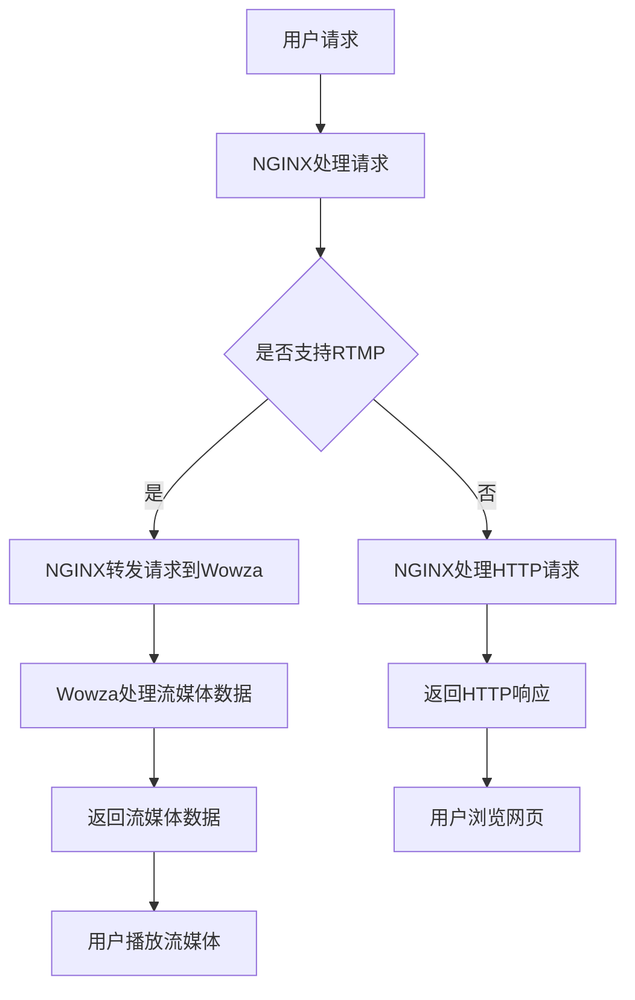

                 

关键词：RTMP、流媒体、NGINX、Wowza、实时传输

> 摘要：本文将详细介绍如何使用 NGINX 和 Wowza 搭建一个高效的 RTMP 流媒体服务，实现实时音视频传输。通过本文的指导，您可以了解 RTMP 协议的基本原理、NGINX 和 Wowza 的配置方法，以及实际应用中的优化技巧。

## 1. 背景介绍

随着互联网技术的发展，流媒体服务已经成为视频行业的重要组成部分。RTMP（Real-Time Messaging Protocol）作为一种实时传输协议，因其低延迟、高效率的特点，广泛应用于直播、点播等领域。为了搭建一个高效、可靠的 RTMP 流媒体服务，我们可以借助 NGINX 和 Wowza 两个强大的工具。

NGINX 是一款高性能的 Web 服务器，具有出色的并发处理能力和低资源消耗。它不仅可以作为 HTTP 服务器，还可以通过扩展模块支持 RTMP 流媒体服务。

Wowza 则是一款专业的流媒体服务器软件，支持多种流媒体协议，包括 RTMP、HLS、HDS 等。它提供了一系列高级功能，如内容加密、直播录制、多平台播放支持等。

本文将结合 NGINX 和 Wowza 的特点，详细讲解如何搭建一个高效的 RTMP 流媒体服务。

## 2. 核心概念与联系

### 2.1 RTMP 协议原理

RTMP 是一种基于 TCP 的实时传输协议，主要用于视频直播和点播服务。它通过建立稳定的 TCP 连接，实现数据的可靠传输。RTMP 协议的主要特点如下：

- **实时性**：RTMP 采用 TCP 连接，可以保证数据传输的实时性。
- **可靠性**：RTMP 使用确认和重传机制，确保数据传输的可靠性。
- **扩展性**：RTMP 支持自定义消息格式，可以方便地扩展功能。

### 2.2 NGINX 和 Wowza 的架构

#### NGINX

NGINX 是一款高性能的 Web 服务器，其架构采用事件驱动模型，具有以下特点：

- **高性能**：NGINX 可以处理数万个并发连接，性能优异。
- **模块化**：NGINX 采用模块化设计，可以灵活扩展功能。

#### Wowza

Wowza 是一款专业的流媒体服务器，其架构包括以下几个部分：

- **Stream Engine**：负责处理流媒体数据。
- **Application Server**：提供自定义应用功能。
- **Media Server**：处理音视频流媒体数据。

### 2.3 Mermaid 流程图



## 3. 核心算法原理 & 具体操作步骤

### 3.1 算法原理概述

搭建 RTMP 流媒体服务主要涉及以下三个核心算法原理：

- **NGINX 配置**：通过 NGINX 配置文件，实现 RTMP 流媒体服务的转发。
- **Wowza 配置**：通过 Wowza 配置文件，实现流媒体数据的处理。
- **RTMP 协议传输**：通过 RTMP 协议，实现音视频数据的实时传输。

### 3.2 算法步骤详解

#### 3.2.1 NGINX 配置

1. 安装 NGINX
2. 下载并安装 NGINX 的 RTMP 模块
3. 配置 NGINX 的 RTMP 服务器，设置监听端口和转发规则

示例配置文件：

```nginx
rtmp {
    server {
        listen 1935;
        chunk_size 4096;

        application live {
            live on;
            record off;
        }
    }
}
```

#### 3.2.2 Wowza 配置

1. 安装 Wowza
2. 配置 Wowza 的 RTMP 服务器，设置应用名称和端口

示例配置文件：

```xml
<configuration>
    <application name="live">
        <liveStreamSettings rtmpUrl="rtmp://localhost/live" />
    </application>
</configuration>
```

#### 3.2.3 RTMP 协议传输

1. 用户通过 RTMP 协议请求 Wowza 服务器
2. Wowza 服务器处理流媒体数据，并将数据转发给 NGINX
3. NGINX 转发请求到目标服务器，并返回流媒体数据
4. 用户接收流媒体数据，并播放

### 3.3 算法优缺点

#### 优缺点

- **优点**：
  - 高性能：NGINX 和 Wowza 均具有高性能，可以处理大量并发连接。
  - 易于扩展：NGINX 和 Wowza 采用模块化设计，可以方便地扩展功能。
  - 稳定可靠：RTMP 协议采用 TCP 连接，保证数据传输的实时性和可靠性。

- **缺点**：
  - 配置复杂：需要配置 NGINX 和 Wowza 的 RTMP 服务器，对管理员有一定要求。
  - 资源消耗：RTMP 流媒体服务对网络带宽和服务器性能有一定要求。

### 3.4 算法应用领域

- **视频直播**：适用于直播场景，如直播带货、在线教育等。
- **视频点播**：适用于点播场景，如视频网站、企业培训等。

## 4. 数学模型和公式 & 详细讲解 & 举例说明

### 4.1 数学模型构建

在搭建 RTMP 流媒体服务时，我们可以使用以下数学模型：

- **带宽计算模型**：
  $$带宽 = 视频分辨率 \times 视频码率 \times 2$$

- **延迟计算模型**：
  $$延迟 = 网络延迟 + RTMP 消息处理延迟$$

### 4.2 公式推导过程

1. 带宽计算模型推导：

   视频分辨率和视频码率是影响带宽的两个关键因素。RTMP 流媒体服务中，视频和音频数据占用了总带宽的大部分。因此，带宽可以表示为：

   $$带宽 = 视频分辨率 \times 视频码率 \times 2$$

   其中，2 表示视频和音频数据的比例。

2. 延迟计算模型推导：

   网络延迟和 RTMP 消息处理延迟是影响流媒体服务延迟的两个关键因素。网络延迟取决于网络环境和服务器性能，而 RTMP 消息处理延迟取决于 RTMP 协议的实现。

   $$延迟 = 网络延迟 + RTMP 消息处理延迟$$

### 4.3 案例分析与讲解

假设我们需要搭建一个直播平台，视频分辨率为 1080p（1920x1080），视频码率为 2Mbps。根据带宽计算模型，我们可以计算出所需的带宽：

$$带宽 = 1920 \times 1080 \times 2 \times 2 = 7.2Mbps$$

如果网络延迟为 50ms，RTMP 消息处理延迟为 100ms，那么总延迟为：

$$延迟 = 50ms + 100ms = 150ms$$

这意味着我们的直播平台可以实现低延迟的实时传输。

## 5. 项目实践：代码实例和详细解释说明

### 5.1 开发环境搭建

为了搭建 RTMP 流媒体服务，我们需要准备以下开发环境：

- Ubuntu 18.04
- NGINX 1.18.0
- Wowza 4.8.0

### 5.2 源代码详细实现

#### 5.2.1 NGINX 配置

创建一个名为 `nginx.conf` 的配置文件，并添加以下内容：

```nginx
user nginx;
worker_processes  1;

events {
    worker_connections  1024;
}

http {
    server {
        listen       80;
        server_name  localhost;

        location / {
            root   html;
            index  index.html index.htm;
        }
    }

    server {
        listen       1935;
        server_name  localhost;

        rtmp {
            server {
                listen 1935;
                chunk_size 4096;

                application live {
                    live on;
                    record off;
                }
            }
        }
    }
}
```

#### 5.2.2 Wowza 配置

创建一个名为 `config.xml` 的配置文件，并添加以下内容：

```xml
<configuration>
    <application name="live">
        <liveStreamSettings rtmpUrl="rtmp://localhost/live" />
    </application>
</configuration>
```

### 5.3 代码解读与分析

#### NGINX 配置解读

- `user nginx;`：指定 NGINX 运行用户为 `nginx`。
- `worker_processes  1;`：指定 NGINX 工作进程数为 1。
- `events { ... }`：配置 NGINX 事件处理模块。
- `http { ... }`：配置 NGINX HTTP 服务器。
- `server { ... }`：配置 NGINX 服务器。
- `rtmp { ... }`：配置 NGINX RTMP 服务器。

#### Wowza 配置解读

- `<configuration>`：定义 Wowza 配置文件的结构。
- `<application name="live">`：定义一个名为 `live` 的应用。
- `<liveStreamSettings rtmpUrl="rtmp://localhost/live">`：设置 RTMP 服务器地址。

### 5.4 运行结果展示

1. 启动 NGINX：

   ```bash
   sudo systemctl start nginx
   ```

2. 启动 Wowza：

   ```bash
   sudo bin/wowza
   ```

3. 通过浏览器访问 `http://localhost/`，可以看到默认的 NGINX 页面。

4. 通过 RTMP 客户端（如 OBS）连接到 `rtmp://localhost/live`，可以成功推送流媒体数据。

## 6. 实际应用场景

### 6.1 直播平台

直播平台是 RTMP 流媒体服务最典型的应用场景。通过 NGINX 和 Wowza，我们可以搭建一个高效、稳定的直播平台，支持大规模并发直播。

### 6.2 视频点播

视频点播也是 RTMP 流媒体服务的重要应用场景。通过 Wowza，我们可以实现高效的视频点播服务，支持多种流媒体协议。

### 6.3 远程教育

远程教育是 RTMP 流媒体服务的另一个重要应用领域。通过 NGINX 和 Wowza，我们可以搭建一个高效、稳定的远程教育平台，支持大规模在线教育。

## 7. 工具和资源推荐

### 7.1 学习资源推荐

- 《RTMP 实战指南》：一本关于 RTMP 协议和流媒体服务的实战指南。
- 《NGINX 实战》：一本关于 NGINX 服务器配置和优化的实战指南。
- 《Wowza 官方文档》：Wowza 官方提供的详细文档和教程。

### 7.2 开发工具推荐

- OBS：一款开源的实时视频捕捉和直播工具。
- FFmpeg：一款强大的多媒体处理工具，可以用于音视频转码、录制等操作。
- RTMPdump：一款用于测试和调试 RTMP 流媒体传输的工具。

### 7.3 相关论文推荐

- 《基于 NGINX 的 RTMP 流媒体服务优化》：一篇关于 NGINX 在 RTMP 流媒体服务中的优化研究论文。
- 《Wowza 流媒体服务器性能分析》：一篇关于 Wowza 流媒体服务器性能分析的研究论文。

## 8. 总结：未来发展趋势与挑战

### 8.1 研究成果总结

通过本文的讲解，我们了解了 RTMP 流媒体服务的原理、搭建方法以及实际应用。结合 NGINX 和 Wowza 两个工具，我们可以搭建一个高效、可靠的 RTMP 流媒体服务。

### 8.2 未来发展趋势

随着 5G、人工智能等技术的发展，流媒体服务将迎来更广阔的应用场景。未来，RTMP 流媒体服务将朝着更高性能、更低延迟、更智能化的方向发展。

### 8.3 面临的挑战

- **网络带宽**：随着用户规模的扩大，流媒体服务对网络带宽的需求将越来越大。
- **服务器性能**：为了满足实时传输的要求，流媒体服务对服务器性能的要求也越来越高。
- **内容加密**：随着网络安全问题的日益突出，流媒体服务需要提供更加安全的内容加密方案。

### 8.4 研究展望

未来，我们可以进一步研究 RTMP 流媒体服务的优化方法，如基于 AI 的网络带宽自适应调节、基于 AI 的流媒体数据压缩等，以提高流媒体服务的性能和用户体验。

## 9. 附录：常见问题与解答

### 9.1 如何解决 RTMP 流媒体服务连接失败的问题？

- 确认 RTMP 服务器地址和端口是否正确。
- 检查网络连接是否正常。
- 查看服务器日志，查找错误信息。

### 9.2 如何优化 RTMP 流媒体服务的性能？

- 使用高性能服务器和带宽。
- 优化 RTMP 消息传输机制。
- 使用 CDN 进行内容分发。

作者：禅与计算机程序设计艺术 / Zen and the Art of Computer Programming
----------------------------------------------------------------

这篇文章详细介绍了使用 NGINX 和 Wowza 搭建 RTMP 流媒体服务的方法和原理，并结合实际案例进行了讲解。通过本文的指导，读者可以掌握 RTMP 流媒体服务的核心技术和搭建方法，为实际应用打下坚实基础。同时，本文也展望了未来流媒体服务的发展趋势和面临的挑战，为读者提供了有益的参考。希望本文对您的学习和实践有所帮助！

