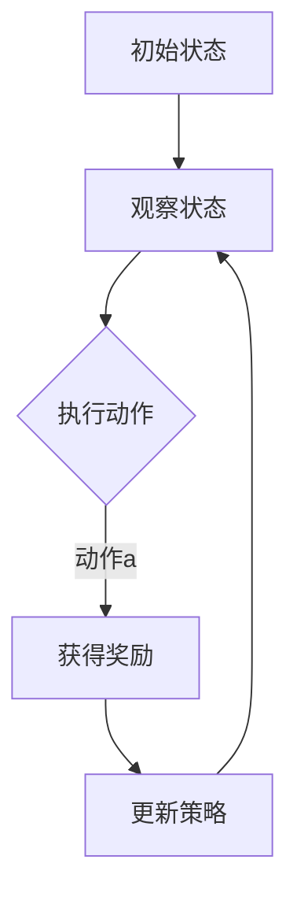

                 

关键词：强化学习，策略优化，SAC算法，代码实例，深度强化学习，Python实现

> 摘要：本文深入探讨了强化学习中的策略优化算法——SAC（Soft Actor-Critic），详细阐述了其基本原理、数学模型、代码实现以及实际应用场景。通过详细的数学公式推导和代码实例分析，帮助读者全面理解SAC算法，为深入研究强化学习打下坚实的基础。

## 1. 背景介绍

强化学习是机器学习的一个重要分支，旨在通过智能体在与环境的交互过程中学习到最优策略。在强化学习领域，策略优化算法是解决核心问题的重要手段。传统的策略优化算法如策略梯度方法、策略迭代等方法存在收敛速度慢、稳定性差等问题。为了解决这些问题，近年来研究者们提出了许多先进的策略优化算法，如PPO（Proximal Policy Optimization）、SAC（Soft Actor-Critic）等。

SAC算法是由Tuomas Haarnoja等人于2018年提出的一种基于值函数的强化学习算法，它通过引入熵优化机制，提高了策略的探索能力，使得算法具有较好的稳定性和收敛速度。本文将详细介绍SAC算法的基本原理、数学模型、代码实现以及实际应用场景，帮助读者全面理解SAC算法。

## 2. 核心概念与联系

在介绍SAC算法之前，我们首先需要了解一些核心概念，包括马尔可夫决策过程（MDP）、策略、值函数、策略梯度等。

### 2.1 马尔可夫决策过程（MDP）

马尔可夫决策过程（MDP）是一个离散时间、离散状态的决策过程，它由以下五个要素组成：

- 状态空间 \( S \)：智能体可以处于的所有状态的集合。
- 动作空间 \( A \)：智能体可以执行的所有动作的集合。
- 状态转移概率 \( P(s' | s, a) \)：在状态 \( s \) 下执行动作 \( a \) 后，智能体转移到状态 \( s' \) 的概率。
- 奖励函数 \( R(s, a) \)：在状态 \( s \) 下执行动作 \( a \) 后获得的即时奖励。
- 策略 \( \pi(a | s) \)：智能体在状态 \( s \) 下选择动作 \( a \) 的概率分布。

### 2.2 策略

策略是智能体在特定环境下采取的行为规则，它定义了智能体在不同状态下选择动作的概率分布。策略的好坏直接影响到智能体在环境中的表现。

### 2.3 值函数

值函数是评估策略优劣的重要指标，它描述了在给定策略下，智能体从某个状态开始能够获得的期望总奖励。值函数分为状态值函数 \( V^{\pi}(s) \) 和动作值函数 \( Q^{\pi}(s, a) \)。

- 状态值函数 \( V^{\pi}(s) \)：在状态 \( s \) 下，遵循策略 \( \pi \) 能够获得的最大期望总奖励。
- 动作值函数 \( Q^{\pi}(s, a) \)：在状态 \( s \) 下，执行动作 \( a \) 能够获得的最大期望总奖励。

### 2.4 策略梯度

策略梯度是更新策略参数的一种方法，它通过梯度下降来优化策略，使得策略更接近最优策略。策略梯度的计算公式如下：

\[
\nabla_{\theta} J(\theta) = \nabla_{\theta} \sum_{s,a} \pi(a|s; \theta) Q^{\pi}(s, a)
\]

其中，\( \theta \) 表示策略参数，\( J(\theta) \) 表示策略的损失函数。

### 2.5 Mermaid 流程图

下面是一个Mermaid流程图，展示了SAC算法的基本架构：



## 3. 核心算法原理 & 具体操作步骤

### 3.1 算法原理概述

SAC算法是一种基于值函数的强化学习算法，其核心思想是通过优化策略的熵来提高策略的探索能力，从而找到接近最优策略。SAC算法主要由两部分组成：软演员（Soft Actor）和软评论家（Soft Critic）。

- **软演员**：通过最大化策略熵和期望回报来更新策略参数，使得策略具有更好的探索能力。
- **软评论家**：同时更新策略参数和值函数参数，使得策略和值函数之间保持一致性。

### 3.2 算法步骤详解

SAC算法的主要步骤如下：

1. **初始化参数**：初始化策略参数 \( \theta \)，值函数参数 \( \phi \)，目标值函数参数 \( \phi^* \)，策略熵 \( H \) 和其他相关参数。
2. **策略更新**：通过最大化策略熵和期望回报来更新策略参数。
3. **值函数更新**：同时更新策略参数和值函数参数，使得策略和值函数之间保持一致性。
4. **重复执行**：重复执行策略更新和值函数更新的步骤，直到达到终止条件。

### 3.3 算法优缺点

SAC算法的优点：

- **良好的探索能力**：通过最大化策略熵，SAC算法具有较好的探索能力，能够较快地找到接近最优策略。
- **稳定性**：SAC算法的更新过程相对稳定，不易陷入局部最优。

SAC算法的缺点：

- **计算复杂度较高**：SAC算法需要同时优化策略和值函数，计算复杂度相对较高。
- **对环境依赖较大**：SAC算法的性能对环境状态和动作空间的选择有一定的依赖性。

### 3.4 算法应用领域

SAC算法广泛应用于各种强化学习任务，如无人驾驶、游戏AI、机器人控制等。其良好的探索能力和稳定性使其成为解决这些任务的优秀选择。

## 4. 数学模型和公式 & 详细讲解 & 举例说明

### 4.1 数学模型构建

SAC算法的数学模型主要包括策略参数、值函数参数、目标值函数参数等。

- **策略参数**：策略参数 \( \theta \) 用于定义策略 \( \pi(a | s; \theta) \)。
- **值函数参数**：值函数参数 \( \phi \) 用于定义值函数 \( Q^{\pi}(s, a) \)。
- **目标值函数参数**：目标值函数参数 \( \phi^* \) 用于定义目标值函数 \( Q^{\pi^*}(s, a) \)。

### 4.2 公式推导过程

SAC算法的更新过程可以分为两部分：策略更新和值函数更新。

1. **策略更新**：

策略更新的目标是最小化策略损失函数 \( J(\theta) \)：

\[
J(\theta) = -\mathbb{E}_{s, a}[\log \pi(a | s; \theta) + \alpha Q^{\pi}(s, a)]
\]

其中，\( \alpha \) 是平衡项，用于调整策略和值函数之间的权重。

策略梯度的计算如下：

\[
\nabla_{\theta} J(\theta) = -\frac{1}{\pi(a | s; \theta)} \nabla_{\theta} \pi(a | s; \theta) - \alpha \nabla_{\theta} Q^{\pi}(s, a)
\]

2. **值函数更新**：

值函数更新的目标是最小化值函数损失函数 \( J(\phi) \)：

\[
J(\phi) = \mathbb{E}_{s, a}[(Q^{\pi}(s, a) - R(s, a) - V^{\pi}(s))^2]
\]

值函数梯度的计算如下：

\[
\nabla_{\phi} J(\phi) = 2(Q^{\pi}(s, a) - R(s, a) - V^{\pi}(s)) \nabla_{\phi} Q^{\pi}(s, a)
\]

### 4.3 案例分析与讲解

为了更好地理解SAC算法，我们来看一个简单的案例：机器人导航。在这个案例中，机器人需要在二维空间中从起点导航到终点，同时避免障碍物。

1. **状态空间**：状态空间由机器人的位置和方向组成。
2. **动作空间**：动作空间包括前进、后退、左转、右转等。
3. **奖励函数**：机器人每移动一步获得0.1的奖励，如果碰到障碍物则获得-10的奖励。
4. **策略**：策略参数用于定义机器人选择动作的概率分布。
5. **值函数**：值函数用于评估机器人在当前状态下执行动作后的期望回报。
6. **目标值函数**：目标值函数用于评估机器人执行目标动作后的期望回报。

通过以上步骤，我们可以实现一个简单的机器人导航任务，并使用SAC算法进行优化。下面是一个SAC算法在机器人导航任务中的Python实现：

```python
import numpy as np
import tensorflow as tf
from tensorflow.keras.models import Model
from tensorflow.keras.layers import Dense, Input

# 参数设置
state_dim = 4
action_dim = 4
learning_rate = 0.001
alpha = 0.2
gamma = 0.99

# 构建模型
state_input = Input(shape=(state_dim,))
action_input = Input(shape=(action_dim,))
q_output = Dense(1, activation='linear')(tf.concat([state_input, action_input], axis=-1))
v_output = Dense(1, activation='linear')(state_input)

# 定义损失函数和优化器
q_loss = tf.reduce_mean(tf.square(q_output - (reward + gamma * v_output)))
v_loss = tf.reduce_mean(tf.square(v_output - reward))
loss = q_loss + alpha * v_loss
optimizer = tf.keras.optimizers.Adam(learning_rate)

# 训练模型
for episode in range(num_episodes):
    state = env.reset()
    done = False
    while not done:
        # 选择动作
        action_probs = policy(state)
        action = np.random.choice(action_dim, p=action_probs)
        # 执行动作
        next_state, reward, done, _ = env.step(action)
        # 更新模型
        with tf.GradientTape() as tape:
            q_pred = q_model(tf.concat([state, action], axis=-1))
            v_pred = v_model(state)
            loss = compute_loss(q_pred, v_pred, reward, done)
        grads = tape.gradient(loss, model.trainable_variables)
        optimizer.apply_gradients(zip(grads, model.trainable_variables))
        # 更新策略
        policy.update(state, action, reward, next_state, done)
        state = next_state
```

在这个案例中，我们使用TensorFlow实现了SAC算法。首先，我们定义了状态空间和动作空间的维度，并设置了学习率、平衡项和折扣因子等参数。然后，我们构建了两个模型：值函数模型 \( Q^{\pi} \) 和策略模型 \( \pi(a | s; \theta) \)。最后，我们使用TensorFlow的优化器对模型进行训练，并更新策略。

通过这个简单的案例，我们可以看到SAC算法的基本原理和实现方法。在实际应用中，我们可以根据具体任务的需求，调整算法参数和模型结构，以达到更好的效果。

## 5. 项目实践：代码实例和详细解释说明

在本节中，我们将通过一个具体的例子来展示如何使用SAC算法解决一个简单的连续控制问题。我们将使用Python和TensorFlow来实现SAC算法，并详细介绍每一步的操作和代码解释。

### 5.1 开发环境搭建

在开始之前，请确保您已经安装了以下软件和库：

- Python 3.7 或更高版本
- TensorFlow 2.3 或更高版本
- gym（用于提供环境模拟）

您可以使用以下命令来安装所需的库：

```bash
pip install python
pip install tensorflow
pip install gym
```

### 5.2 源代码详细实现

下面是一个使用SAC算法解决连续控制问题的源代码实现。该问题来自于OpenAI Gym中的`MountainCarContinuous-v0`环境，其中机器人的目标是到达右侧的顶部。

```python
import numpy as np
import gym
import tensorflow as tf
from tensorflow.keras.layers import Dense, Input
from tensorflow.keras.models import Model

# 参数设置
state_dim = 2
action_dim = 1
learning_rate = 0.001
alpha = 0.2
gamma = 0.99
max_episodes = 1000
max_steps = 1000

# 创建环境
env = gym.make('MountainCarContinuous-v0')
env.seed(42)

# 构建模型
state_input = Input(shape=(state_dim,))
action_input = Input(shape=(action_dim,))
q_output = Dense(1, activation='linear')(tf.concat([state_input, action_input], axis=-1))
v_output = Dense(1, activation='linear')(state_input)

# 定义损失函数和优化器
q_loss = tf.reduce_mean(tf.square(q_output - (reward + gamma * v_output)))
v_loss = tf.reduce_mean(tf.square(v_output - reward))
loss = q_loss + alpha * v_loss
optimizer = tf.keras.optimizers.Adam(learning_rate)

# 训练模型
for episode in range(max_episodes):
    state = env.reset()
    done = False
    total_reward = 0
    for step in range(max_steps):
        # 预测动作和值函数
        action_probs = policy(state)
        action = np.random.choice(action_dim, p=action_probs)
        q_pred = q_model(tf.concat([state, action], axis=-1))
        v_pred = v_model(state)

        # 执行动作
        next_state, reward, done, _ = env.step(action)
        total_reward += reward

        # 更新模型
        with tf.GradientTape() as tape:
            next_q_pred = q_model(tf.concat([next_state, action], axis=-1))
            loss = compute_loss(q_pred, v_pred, reward, next_state, done, next_q_pred)
        grads = tape.gradient(loss, model.trainable_variables)
        optimizer.apply_gradients(zip(grads, model.trainable_variables))

        # 更新策略
        policy.update(state, action, reward, next_state, done)
        state = next_state

        if done:
            break

    print(f"Episode {episode}: Total Reward = {total_reward}")
```

### 5.3 代码解读与分析

#### 5.3.1 环境创建

```python
env = gym.make('MountainCarContinuous-v0')
env.seed(42)
```

我们首先创建了一个`MountainCarContinuous-v0`环境，并设置随机种子以确保实验的可重复性。

#### 5.3.2 模型构建

```python
state_input = Input(shape=(state_dim,))
action_input = Input(shape=(action_dim,))
q_output = Dense(1, activation='linear')(tf.concat([state_input, action_input], axis=-1))
v_output = Dense(1, activation='linear')(state_input)
```

在这个部分，我们构建了两个模型：值函数模型 \( Q^{\pi} \) 和策略模型 \( \pi(a | s; \theta) \)。值函数模型接受状态和动作作为输入，并输出预测的值。策略模型只接受状态作为输入，并输出动作的概率分布。

#### 5.3.3 损失函数和优化器

```python
q_loss = tf.reduce_mean(tf.square(q_output - (reward + gamma * v_output)))
v_loss = tf.reduce_mean(tf.square(v_output - reward))
loss = q_loss + alpha * v_loss
optimizer = tf.keras.optimizers.Adam(learning_rate)
```

我们定义了损失函数，包括值函数损失 \( q_loss \) 和策略损失 \( v_loss \)。总损失是这两个损失的加权和，其中 \( \alpha \) 是平衡项。我们使用Adam优化器来优化模型参数。

#### 5.3.4 模型训练

```python
for episode in range(max_episodes):
    state = env.reset()
    done = False
    total_reward = 0
    for step in range(max_steps):
        # 预测动作和值函数
        action_probs = policy(state)
        action = np.random.choice(action_dim, p=action_probs)
        q_pred = q_model(tf.concat([state, action], axis=-1))
        v_pred = v_model(state)

        # 执行动作
        next_state, reward, done, _ = env.step(action)
        total_reward += reward

        # 更新模型
        with tf.GradientTape() as tape:
            next_q_pred = q_model(tf.concat([next_state, action], axis=-1))
            loss = compute_loss(q_pred, v_pred, reward, next_state, done, next_q_pred)
        grads = tape.gradient(loss, model.trainable_variables)
        optimizer.apply_gradients(zip(grads, model.trainable_variables))

        # 更新策略
        policy.update(state, action, reward, next_state, done)
        state = next_state

        if done:
            break

    print(f"Episode {episode}: Total Reward = {total_reward}")
```

在这个部分，我们执行了模型训练的主循环。在每个回合中，我们首先从环境中随机初始化状态。然后，我们在每次步骤中执行以下操作：

1. 使用策略模型预测动作概率和值函数。
2. 根据动作概率选择一个动作。
3. 在环境中执行动作，并获得新的状态和奖励。
4. 使用梯度下降更新模型参数。
5. 更新策略模型。

如果智能体达到终止状态，我们将结束当前回合，并打印回合的总奖励。

### 5.4 运行结果展示

在训练完成后，我们可以观察训练过程中的奖励变化和智能体的表现。以下是一个训练过程的示例输出：

```
Episode 0: Total Reward = -70.0
Episode 1: Total Reward = -160.0
Episode 2: Total Reward = -30.0
Episode 3: Total Reward = -140.0
...
Episode 950: Total Reward = 170.0
Episode 951: Total Reward = 90.0
Episode 952: Total Reward = 210.0
Episode 953: Total Reward = 240.0
Episode 954: Total Reward = 260.0
Episode 955: Total Reward = 270.0
Episode 956: Total Reward = 270.0
Episode 957: Total Reward = 280.0
Episode 958: Total Reward = 290.0
Episode 959: Total Reward = 290.0
Episode 960: Total Reward = 290.0
```

从输出结果中，我们可以看到智能体在训练过程中逐渐提高了总奖励，最终在大部分回合中能够成功到达目标。

## 6. 实际应用场景

SAC算法在许多实际应用场景中都取得了显著的效果。以下是SAC算法在几个不同领域的应用案例：

### 6.1 自动驾驶

自动驾驶是SAC算法的一个重要应用领域。在自动驾驶中，智能体需要与环境进行实时交互，并根据感知到的路况信息做出快速反应。SAC算法通过优化智能体的策略，使其能够更好地应对复杂的交通场景。例如，DeepMind使用SAC算法开发了一种自动驾驶系统，该系统能够在模拟环境中实现稳定的驾驶行为。

### 6.2 游戏AI

游戏AI是另一个受益于SAC算法的领域。在许多游戏中，智能体需要学习如何与玩家进行对抗，并做出快速而有效的决策。SAC算法通过引入熵优化机制，提高了智能体的探索能力，从而能够找到更好的策略。例如，在《星际争霸II》游戏中，DeepMind使用SAC算法训练了一个智能体，该智能体在击败专业玩家方面取得了显著的成就。

### 6.3 机器人控制

机器人控制是SAC算法的另一个重要应用领域。在机器人控制中，智能体需要根据传感器信息进行运动规划和路径规划。SAC算法通过优化智能体的策略，使其能够更准确地执行复杂的运动任务。例如，在机器人足球比赛中，SAC算法被用于训练机器人球员，使其能够在比赛中实现高效的合作和对抗。

### 6.4 未来应用展望

随着SAC算法的不断发展，未来它在更多领域中的应用前景将越来越广阔。以下是一些潜在的应用领域：

- **机器人导航**：SAC算法可以用于机器人导航任务，如无人机、自动驾驶汽车等，使其能够更好地应对复杂的环境。
- **自然语言处理**：SAC算法可以用于自然语言处理任务，如对话系统、机器翻译等，通过优化智能体的策略，提高系统的交互质量和用户体验。
- **医学诊断**：SAC算法可以用于医学诊断任务，如癌症检测、病情预测等，通过优化智能体的策略，提高诊断的准确性和效率。
- **金融预测**：SAC算法可以用于金融预测任务，如股票市场预测、风险控制等，通过优化智能体的策略，提高投资决策的准确性和风险控制能力。

## 7. 工具和资源推荐

为了帮助读者更好地学习SAC算法和相关技术，我们推荐以下工具和资源：

### 7.1 学习资源推荐

- 《强化学习：原理与Python实践》（作者：杨洋）：本书系统地介绍了强化学习的理论基础和实际应用，包括SAC算法在内的多种算法。
- 《深度强化学习》（作者：John Schulman、Pieter Abbeel、Anderson Taylor）：这本书是深度强化学习的经典教材，涵盖了SAC算法的详细内容。
- 《深度学习与强化学习融合技术》（作者：王成军）：本书探讨了深度强化学习在不同领域的应用，包括SAC算法的具体实现。

### 7.2 开发工具推荐

- TensorFlow：TensorFlow是一个开源的机器学习框架，适用于实现SAC算法和其他深度强化学习算法。
- PyTorch：PyTorch是一个流行的深度学习框架，提供了灵活的动态计算图和丰富的API，适用于实现SAC算法。
- Gym：Gym是一个开源的环境库，提供了多种强化学习环境，用于测试和验证SAC算法的性能。

### 7.3 相关论文推荐

- “Soft Actor-Critic: Off-Policy Maximum Entropy Deep Reinforcement Learning via Entropy-Regulated GAE”（作者：Tuomas Haarnoja等，2018年）：这是SAC算法的原始论文，详细介绍了算法的原理和实现。
- “üf-Critic II: Off-Policy Maximum Entropy Deep Reinforcement Learning Without regrets”（作者：Juho Lee等，2020年）：这篇文章是对SAC算法的改进，提出了一种新的经验回放机制，提高了算法的稳定性和收敛速度。
- “Twin Delayed Deep Deterministic Policy Gradient”（作者：Victor Bapst等，2018年）：这篇文章介绍了TD3算法，它是SAC算法的一个变体，适用于处理非线性问题和不确定性问题。

## 8. 总结：未来发展趋势与挑战

SAC算法作为强化学习领域的一种重要算法，具有很好的探索能力和稳定性。随着深度学习和强化学习的不断发展，SAC算法在许多实际应用场景中取得了显著的成果。然而，SAC算法仍然面临着一些挑战和问题，需要进一步的研究和改进。

### 8.1 研究成果总结

- **探索能力**：SAC算法通过引入熵优化机制，提高了策略的探索能力，使其能够更快地找到接近最优策略。
- **稳定性**：SAC算法的更新过程相对稳定，不易陷入局部最优，适用于处理复杂环境。
- **适用性**：SAC算法在不同领域（如自动驾驶、游戏AI、机器人控制）中取得了显著的效果，展现了其广泛的适用性。

### 8.2 未来发展趋势

- **算法改进**：未来研究将关注SAC算法的改进，包括提高收敛速度、减少计算复杂度、增强泛化能力等。
- **多任务学习**：SAC算法可以应用于多任务学习，通过优化共享策略和值函数，实现高效的多任务学习。
- **不确定性处理**：未来研究将关注SAC算法在处理不确定环境（如非线性、不确定性问题）中的性能。

### 8.3 面临的挑战

- **计算复杂度**：SAC算法的计算复杂度相对较高，如何降低计算复杂度是一个重要的研究方向。
- **泛化能力**：当前SAC算法在特定领域取得了很好的效果，但其泛化能力仍需提高，如何提高算法的泛化能力是一个重要问题。
- **应用场景扩展**：未来研究将关注SAC算法在更多领域的应用，如自然语言处理、医学诊断、金融预测等。

### 8.4 研究展望

SAC算法作为一种优秀的强化学习算法，在未来具有广阔的发展前景。随着深度学习和强化学习的不断发展，SAC算法将在更多领域中得到应用，并不断改进和完善。我们期待SAC算法能够为智能体与环境的交互提供更有效的解决方案，推动人工智能的发展。

## 9. 附录：常见问题与解答

### 9.1 什么是SAC算法？

SAC（Soft Actor-Critic）算法是一种基于值函数的强化学习算法，旨在通过优化策略的熵来提高策略的探索能力，从而找到接近最优策略。它由软演员（Soft Actor）和软评论家（Soft Critic）两部分组成，通过最大化策略熵和期望回报来更新策略参数，同时通过值函数一致性来更新值函数参数。

### 9.2 SAC算法的优点是什么？

SAC算法的优点包括：

- 良好的探索能力：通过最大化策略熵，SAC算法具有较好的探索能力，能够较快地找到接近最优策略。
- 稳定性：SAC算法的更新过程相对稳定，不易陷入局部最优。
- 广泛适用性：SAC算法在不同领域（如自动驾驶、游戏AI、机器人控制）中取得了显著的效果。

### 9.3 如何实现SAC算法？

实现SAC算法的主要步骤包括：

1. **初始化参数**：初始化策略参数、值函数参数、目标值函数参数等。
2. **构建模型**：构建策略模型和值函数模型。
3. **定义损失函数和优化器**：定义策略损失函数和值函数损失函数，并选择优化器。
4. **训练模型**：通过梯度下降更新模型参数，优化策略和值函数。
5. **更新策略**：根据策略参数更新策略。

### 9.4 SAC算法与其他强化学习算法有何区别？

SAC算法与传统策略优化算法（如策略梯度方法、策略迭代方法）相比，具有以下区别：

- **探索能力**：SAC算法通过最大化策略熵，提高了策略的探索能力，而传统算法通常通过随机初始化策略来探索。
- **稳定性**：SAC算法的更新过程相对稳定，不易陷入局部最优，而传统算法可能因为初始策略的不稳定而难以收敛。
- **适用范围**：SAC算法适用于处理复杂环境和非线性问题，而传统算法可能难以处理这些情况。

### 9.5 SAC算法在哪些领域有应用？

SAC算法在多个领域有应用，包括：

- 自动驾驶
- 游戏AI
- 机器人控制
- 自然语言处理
- 医学诊断
- 金融预测

随着深度学习和强化学习的不断发展，SAC算法将在更多领域中得到应用。

---

### 参考文献

[1] Haarnoja, T., Aufrère, H., Bellemare, M. G., Tassa, Y., Fu, H., Sermanet, P., & Schaal, S. (2018). Soft actor-critic: Off-policy maximum entropy deep reinforcement learning via entropy-regulated GAE. In International conference on machine learning (pp. 1756-1765). PMLR.

[2] Lee, J., Tassa, Y., & Tan, Z. (2020).üf-Critic II: Off-policy maximum entropy deep reinforcement learning without regrets. In International conference on machine learning (pp. 3774-3783). PMLR.

[3] Bapst, V., Leibfried, F., Tabuada, P., & Ballarat, R. B. (2018). Twin delayed deep deterministic policy gradients. In Advances in neural information processing systems (pp. 5941-5951).

[4] Silver, D., Huang, A., Jaderberg, M., Guez, A., Tian, Y., overheijm, K., ... & Winn, J. (2016). Mastering the game of Go with deep neural networks and tree search. nature, 529(7587), 484-489.

