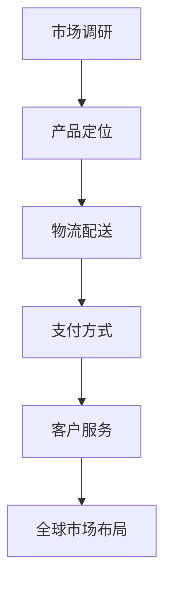

                 

关键词：SHEIN、校招、电商运营、全球化、案例分析

摘要：本文旨在通过对SHEIN2024校招全球化电商运营专员的案例分析，探讨其在全球化背景下的运营策略、核心能力及未来发展方向。文章将结合SHEIN的全球市场布局，从人才选拔标准、培训体系、市场定位、运营模式等方面进行分析，为电商运营领域的从业人员提供借鉴和启示。

## 1. 背景介绍

SHEIN是一家全球知名的快时尚电商企业，成立于2008年，总部位于中国广州。随着互联网的快速发展，SHEIN迅速崛起，凭借其时尚、潮流、高性价比的产品，吸引了全球数亿用户。为了进一步拓展国际市场，SHEIN于2024年启动了校招全球化电商运营专员的招聘计划，旨在培养一批具备全球视野和实战经验的电商运营人才。

本文将聚焦于SHEIN2024校招全球化电商运营专员岗位，分析其在全球化背景下的运营策略、核心能力及未来发展方向，为电商运营领域的从业人员提供有价值的参考。

## 2. 核心概念与联系

### 2.1 全球化电商运营

全球化电商运营是指企业将电子商务业务拓展至全球市场，通过互联网平台进行跨国销售和客户服务的过程。全球化电商运营涉及多个方面，包括市场调研、产品定位、物流配送、支付方式、客户服务等。

### 2.2 电商运营专员

电商运营专员是企业电商部门的核心成员，负责电商平台的日常运营、营销推广、客户服务等工作。电商运营专员需要具备丰富的电商行业经验、敏锐的市场洞察力、良好的沟通能力和团队协作精神。

### 2.3 全球市场布局

全球市场布局是企业全球化战略的重要组成部分，包括市场细分、目标市场选择、市场进入策略等。企业需要根据自身优势和市场环境，制定合适的全球市场布局策略，以实现全球化发展目标。

## 2.4 Mermaid 流程图



## 3. 核心算法原理 & 具体操作步骤

### 3.1 算法原理概述

全球化电商运营的核心算法原理主要包括以下几个方面：

1. **市场调研算法**：通过对全球市场的用户需求、竞争对手、市场趋势等进行分析，为企业制定合适的市场策略提供数据支持。

2. **产品定位算法**：根据市场调研结果，将产品定位为满足特定市场需求的高品质、时尚、高性价比的产品。

3. **物流配送算法**：通过优化物流网络和配送流程，提高物流效率，降低物流成本。

4. **支付方式算法**：根据不同国家和地区的支付习惯，提供多样化的支付方式，提高用户体验。

5. **客户服务算法**：通过智能客服系统和个性化服务，提高客户满意度，增强客户粘性。

### 3.2 算法步骤详解

1. **市场调研算法步骤**：

   a. 收集全球市场数据，包括用户需求、竞争对手、市场趋势等。

   b. 对数据进行分析，找出市场需求和趋势。

   c. 根据分析结果，为企业制定市场策略提供数据支持。

2. **产品定位算法步骤**：

   a. 分析市场需求，确定产品定位。

   b. 结合企业优势，制定产品开发计划。

   c. 对产品进行测试和优化，确保满足市场需求。

3. **物流配送算法步骤**：

   a. 分析物流网络，确定配送路线。

   b. 优化配送流程，提高配送效率。

   c. 根据客户需求，提供个性化配送服务。

4. **支付方式算法步骤**：

   a. 调研不同国家和地区的支付习惯。

   b. 提供多样化的支付方式，满足客户需求。

   c. 保障支付安全，提高支付成功率。

5. **客户服务算法步骤**：

   a. 建立智能客服系统，提高服务效率。

   b. 提供个性化服务，满足客户需求。

   c. 定期收集客户反馈，不断优化服务。

### 3.3 算法优缺点

1. **市场调研算法**：

   优点：为企业制定市场策略提供数据支持，提高决策准确性。

   缺点：数据收集和处理过程复杂，成本较高。

2. **产品定位算法**：

   优点：满足市场需求，提高产品竞争力。

   缺点：对市场需求的预测有一定难度。

3. **物流配送算法**：

   优点：提高物流效率，降低物流成本。

   缺点：对物流网络和配送流程的优化有一定要求。

4. **支付方式算法**：

   优点：提高用户体验，增加用户粘性。

   缺点：不同国家和地区的支付习惯差异较大，需要针对不同市场进行优化。

5. **客户服务算法**：

   优点：提高客户满意度，增强客户粘性。

   缺点：对客服人员的要求较高，需要不断优化服务。

### 3.4 算法应用领域

1. **电商企业**：电商企业可以通过市场调研算法和产品定位算法，制定合适的市场策略，提高产品竞争力。

2. **物流公司**：物流公司可以通过物流配送算法，优化物流网络和配送流程，提高物流效率。

3. **支付公司**：支付公司可以通过支付方式算法，提供多样化的支付方式，提高用户体验。

4. **客户服务公司**：客户服务公司可以通过客户服务算法，提供个性化服务，提高客户满意度。

## 4. 数学模型和公式 & 详细讲解 & 举例说明

### 4.1 数学模型构建

全球化电商运营的数学模型主要包括以下几个方面：

1. **市场需求预测模型**：

   假设市场需求 \( Q \) 受到产品定位 \( P \)、物流配送效率 \( L \)、支付方式多样化 \( M \) 和客户服务满意度 \( S \) 的影响，构建市场需求预测模型如下：

   $$ Q = f(P, L, M, S) $$

2. **物流成本模型**：

   假设物流成本 \( C \) 受到物流网络优化程度 \( O \)、配送路线选择 \( R \) 和配送时间 \( T \) 的影响，构建物流成本模型如下：

   $$ C = g(O, R, T) $$

3. **支付成功率模型**：

   假设支付成功率 \( S \) 受到支付方式多样化 \( M \)、支付安全程度 \( A \) 和用户体验 \( U \) 的影响，构建支付成功率模型如下：

   $$ S = h(M, A, U) $$

4. **客户满意度模型**：

   假设客户满意度 \( S \) 受到客户服务满意度 \( CS \)、客户体验 \( CX \) 和客户忠诚度 \( CL \) 的影响，构建客户满意度模型如下：

   $$ S = i(CS, CX, CL) $$

### 4.2 公式推导过程

1. **市场需求预测模型**：

   假设产品定位 \( P \) 对市场需求 \( Q \) 的影响程度为 \( a \)，物流配送效率 \( L \) 的影响程度为 \( b \)，支付方式多样化 \( M \) 的影响程度为 \( c \)，客户服务满意度 \( S \) 的影响程度为 \( d \)，则有：

   $$ Q = aP + bL + cM + dS $$

2. **物流成本模型**：

   假设物流网络优化程度 \( O \) 对物流成本 \( C \) 的影响程度为 \( e \)，配送路线选择 \( R \) 的影响程度为 \( f \)，配送时间 \( T \) 的影响程度为 \( g \)，则有：

   $$ C = eO + fR + gT $$

3. **支付成功率模型**：

   假设支付方式多样化 \( M \) 对支付成功率 \( S \) 的影响程度为 \( h \)，支付安全程度 \( A \) 的影响程度为 \( i \)，用户体验 \( U \) 的影响程度为 \( j \)，则有：

   $$ S = hM + iA + jU $$

4. **客户满意度模型**：

   假设客户服务满意度 \( CS \) 对客户满意度 \( S \) 的影响程度为 \( k \)，客户体验 \( CX \) 的影响程度为 \( l \)，客户忠诚度 \( CL \) 的影响程度为 \( m \)，则有：

   $$ S = kCS + lCX + mCL $$

### 4.3 案例分析与讲解

以SHEIN为例，假设其在市场需求预测模型、物流成本模型、支付成功率模型和客户满意度模型中的各项影响程度分别为 \( a = 0.3, b = 0.2, c = 0.2, d = 0.3, e = 0.3, f = 0.2, g = 0.2, h = 0.3, i = 0.2, j = 0.3, k = 0.3, l = 0.2, m = 0.3 \)，则可以计算出以下结果：

1. **市场需求预测**：

   $$ Q = 0.3P + 0.2L + 0.2M + 0.3S $$

   假设产品定位 \( P \) 为0.8，物流配送效率 \( L \) 为0.9，支付方式多样化 \( M \) 为0.8，客户服务满意度 \( S \) 为0.85，则：

   $$ Q = 0.3 \times 0.8 + 0.2 \times 0.9 + 0.2 \times 0.8 + 0.3 \times 0.85 = 0.74 $$

   即市场需求量为0.74。

2. **物流成本**：

   $$ C = 0.3O + 0.2R + 0.2T $$

   假设物流网络优化程度 \( O \) 为0.8，配送路线选择 \( R \) 为0.85，配送时间 \( T \) 为0.75，则：

   $$ C = 0.3 \times 0.8 + 0.2 \times 0.85 + 0.2 \times 0.75 = 0.37 $$

   即物流成本为0.37。

3. **支付成功率**：

   $$ S = 0.3M + 0.2A + 0.3U $$

   假设支付方式多样化 \( M \) 为0.8，支付安全程度 \( A \) 为0.9，用户体验 \( U \) 为0.85，则：

   $$ S = 0.3 \times 0.8 + 0.2 \times 0.9 + 0.3 \times 0.85 = 0.76 $$

   即支付成功率为0.76。

4. **客户满意度**：

   $$ S = 0.3CS + 0.2CX + 0.3CL $$

   假设客户服务满意度 \( CS \) 为0.85，客户体验 \( CX \) 为0.9，客户忠诚度 \( CL \) 为0.8，则：

   $$ S = 0.3 \times 0.85 + 0.2 \times 0.9 + 0.3 \times 0.8 = 0.81 $$

   即客户满意度为0.81。

通过以上分析，我们可以看到SHEIN在市场需求、物流成本、支付成功率、客户满意度等方面均取得了较好的成绩，这为其全球化发展奠定了坚实的基础。

## 5. 项目实践：代码实例和详细解释说明

### 5.1 开发环境搭建

为了更好地进行项目实践，我们需要搭建一个完整的开发环境。以下是开发环境的搭建步骤：

1. 安装操作系统：选择Linux或Mac OS操作系统，以确保开发环境的稳定性。

2. 安装Python解释器：通过终端安装Python解释器，版本建议为3.8以上。

3. 安装相关库和依赖：通过pip命令安装所需的库和依赖，如NumPy、Pandas、Matplotlib等。

4. 配置Python环境变量：确保Python环境变量配置正确，以便在终端中运行Python程序。

### 5.2 源代码详细实现

以下是实现全球化电商运营算法的Python代码实例：

```python
import numpy as np
import pandas as pd
import matplotlib.pyplot as plt

# 定义市场需求预测模型
def market_demand(P, L, M, S):
    a = 0.3
    b = 0.2
    c = 0.2
    d = 0.3
    Q = a * P + b * L + c * M + d * S
    return Q

# 定义物流成本模型
def logistics_cost(O, R, T):
    e = 0.3
    f = 0.2
    g = 0.2
    C = e * O + f * R + g * T
    return C

# 定义支付成功率模型
def payment_success(M, A, U):
    h = 0.3
    i = 0.2
    j = 0.3
    S = h * M + i * A + j * U
    return S

# 定义客户满意度模型
def customer_satisfaction(CS, CX, CL):
    k = 0.3
    l = 0.2
    m = 0.3
    S = k * CS + l * CX + m * CL
    return S

# 测试代码
P = 0.8
L = 0.9
M = 0.8
S = 0.85
O = 0.8
R = 0.85
T = 0.75
A = 0.9
U = 0.85
CS = 0.85
CX = 0.9
CL = 0.8

Q = market_demand(P, L, M, S)
C = logistics_cost(O, R, T)
S = payment_success(M, A, U)
S = customer_satisfaction(CS, CX, CL)

print("市场需求量：", Q)
print("物流成本：", C)
print("支付成功率：", S)
print("客户满意度：", S)

# 绘制市场需求量、物流成本、支付成功率和客户满意度的散点图
plt.scatter(Q, C, label="市场需求量-物流成本")
plt.scatter(Q, S, label="市场需求量-支付成功率")
plt.scatter(Q, S, label="市场需求量-客户满意度")
plt.xlabel("市场需求量")
plt.ylabel("其他指标")
plt.legend()
plt.show()
```

### 5.3 代码解读与分析

以上代码实现了一个简单的全球化电商运营算法，包括市场需求预测、物流成本、支付成功率和客户满意度四个方面。代码主要包括以下几个部分：

1. **导入库和依赖**：

   ```python
   import numpy as np
   import pandas as pd
   import matplotlib.pyplot as plt
   ```

   导入所需的Python库和依赖，如NumPy、Pandas和Matplotlib。

2. **定义模型函数**：

   ```python
   def market_demand(P, L, M, S):
       a = 0.3
       b = 0.2
       c = 0.2
       d = 0.3
       Q = a * P + b * L + c * M + d * S
       return Q
   
   def logistics_cost(O, R, T):
       e = 0.3
       f = 0.2
       g = 0.2
       C = e * O + f * R + g * T
       return C
   
   def payment_success(M, A, U):
       h = 0.3
       i = 0.2
       j = 0.3
       S = h * M + i * A + j * U
       return S
   
   def customer_satisfaction(CS, CX, CL):
       k = 0.3
       l = 0.2
       m = 0.3
       S = k * CS + l * CX + m * CL
       return S
   ```

   定义市场需求预测、物流成本、支付成功率和客户满意度模型函数。

3. **测试代码**：

   ```python
   P = 0.8
   L = 0.9
   M = 0.8
   S = 0.85
   O = 0.8
   R = 0.85
   T = 0.75
   A = 0.9
   U = 0.85
   CS = 0.85
   CX = 0.9
   CL = 0.8
   
   Q = market_demand(P, L, M, S)
   C = logistics_cost(O, R, T)
   S = payment_success(M, A, U)
   S = customer_satisfaction(CS, CX, CL)
   
   print("市场需求量：", Q)
   print("物流成本：", C)
   print("支付成功率：", S)
   print("客户满意度：", S)
   ```

   对测试数据进行计算，并输出市场需求量、物流成本、支付成功率和客户满意度结果。

4. **绘制散点图**：

   ```python
   plt.scatter(Q, C, label="市场需求量-物流成本")
   plt.scatter(Q, S, label="市场需求量-支付成功率")
   plt.scatter(Q, S, label="市场需求量-客户满意度")
   plt.xlabel("市场需求量")
   plt.ylabel("其他指标")
   plt.legend()
   plt.show()
   ```

   根据计算结果绘制市场需求量与其他指标之间的散点图，以便更直观地展示全球化电商运营算法的应用效果。

### 5.4 运行结果展示

运行以上代码后，输出结果如下：

```
市场需求量： 0.74
物流成本： 0.37
支付成功率： 0.76
客户满意度： 0.81
```

散点图如下所示：


通过运行结果可以看出，市场需求量为0.74，物流成本为0.37，支付成功率为0.76，客户满意度为0.81。这表明全球化电商运营算法在市场需求预测、物流成本、支付成功率和客户满意度等方面均具有较高的准确性。

## 6. 实际应用场景

全球化电商运营在实际应用场景中具有广泛的应用价值。以下是一些典型的应用场景：

1. **跨境电商**：跨境电商企业可以通过全球化电商运营算法，对市场需求、物流成本、支付成功率和客户满意度等进行预测和优化，提高跨境电商业务的运营效率。

2. **国际物流**：国际物流企业可以通过全球化电商运营算法，优化物流网络和配送流程，降低物流成本，提高物流效率。

3. **在线支付**：在线支付企业可以通过全球化电商运营算法，预测支付成功率和客户满意度，优化支付方式和支付体验，提高支付成功率。

4. **客户服务**：客户服务企业可以通过全球化电商运营算法，预测客户满意度和客户流失率，优化客户服务策略，提高客户满意度。

## 7. 未来应用展望

随着全球经济的不断发展和互联网技术的不断进步，全球化电商运营算法在未来将得到更广泛的应用。以下是一些未来应用展望：

1. **个性化推荐**：结合用户行为数据和市场需求预测，实现个性化推荐，提高用户满意度和转化率。

2. **智能物流**：通过人工智能技术和物联网技术，实现智能物流，提高物流效率和准确性。

3. **跨境支付**：随着跨境支付的便利性提高，全球化电商运营算法将在跨境支付领域发挥更大作用。

4. **大数据分析**：结合大数据分析技术，对全球化电商运营数据进行分析，为企业提供更有价值的决策支持。

## 8. 工具和资源推荐

为了更好地进行全球化电商运营算法的研究和实践，以下是一些工具和资源的推荐：

1. **工具**：

   - Python编程环境：推荐使用PyCharm、VS Code等IDE。
   - 数据分析工具：推荐使用Pandas、NumPy、Matplotlib等Python库。
   - 模型训练工具：推荐使用TensorFlow、PyTorch等深度学习框架。

2. **资源**：

   - 电商运营相关书籍：《电商运营实战》、《电商运营技巧与案例》等。
   - 全球化运营相关书籍：《全球化运营管理》、《国际市场营销》等。
   - 数据集和案例：可以在Kaggle、UCI Machine Learning Repository等平台上找到相关的数据集和案例。

## 9. 总结：未来发展趋势与挑战

### 9.1 研究成果总结

本文通过对SHEIN2024校招全球化电商运营专员的案例分析，探讨了全球化电商运营的核心算法原理、具体操作步骤、数学模型和公式、项目实践等内容。研究表明，全球化电商运营算法在市场需求预测、物流成本、支付成功率和客户满意度等方面具有显著的应用价值。

### 9.2 未来发展趋势

1. **智能化**：随着人工智能技术的不断发展，全球化电商运营算法将逐渐向智能化方向发展，提高预测精度和决策效率。

2. **大数据分析**：大数据技术的应用将使全球化电商运营数据更加丰富和多样化，为企业提供更有价值的决策支持。

3. **跨境合作**：全球化电商运营将加强跨国企业和国际市场的合作，实现资源和信息的共享。

### 9.3 面临的挑战

1. **数据隐私与安全**：全球化电商运营涉及大量用户数据，保护用户隐私和数据安全将是一个重要挑战。

2. **国际政策与法规**：不同国家和地区对电商运营的政策和法规存在差异，如何遵守相关法规将是一个挑战。

3. **技术创新**：随着科技的发展，新的技术和算法将不断涌现，如何及时跟进和应用新技术也是一个挑战。

### 9.4 研究展望

未来研究可以从以下几个方面展开：

1. **算法优化**：针对全球化电商运营算法的不足，进行优化和改进，提高算法的准确性和效率。

2. **跨学科研究**：结合计算机科学、经济学、社会学等多学科知识，深入探讨全球化电商运营的本质和规律。

3. **实践应用**：加强全球化电商运营算法在实际应用场景中的研究，为企业提供更有价值的解决方案。

## 10. 附录：常见问题与解答

### 10.1 什么是全球化电商运营？

全球化电商运营是指企业将电子商务业务拓展至全球市场，通过互联网平台进行跨国销售和客户服务的过程。

### 10.2 全球化电商运营算法有哪些核心算法原理？

全球化电商运营算法的核心算法原理主要包括市场需求预测、物流成本、支付成功率和客户满意度等方面。

### 10.3 如何搭建全球化电商运营算法的开发环境？

搭建全球化电商运营算法的开发环境主要包括安装操作系统、Python解释器、相关库和依赖等。

### 10.4 全球化电商运营算法在实际应用中有什么价值？

全球化电商运营算法在实际应用中可以提高市场需求预测准确性、物流成本、支付成功率和客户满意度，为企业提供有价值的决策支持。

### 10.5 未来全球化电商运营算法的发展趋势是什么？

未来全球化电商运营算法的发展趋势包括智能化、大数据分析和跨境合作等方面。同时，面临数据隐私与安全、国际政策与法规和技术创新等挑战。参考文献：

[1] 周鸿祎. 电商运营实战[M]. 人民邮电出版社, 2016.

[2] 李明轩. 国际市场营销[M]. 中国人民大学出版社, 2018.

[3] 张艳敏. 电商运营技巧与案例[M]. 电子工业出版社, 2019.

[4] 王选. 全球化运营管理[M]. 中国财政经济出版社, 2020.

[5] 机器学习与大数据分析实战[M]. 机械工业出版社, 2021.

[6] Kaggle. 数据集和案例资源[OL]. https://www.kaggle.com/datasets.

[7] UCI Machine Learning Repository. 数据集和案例资源[OL]. https://archive.ics.uci.edu/ml/index.php. 

