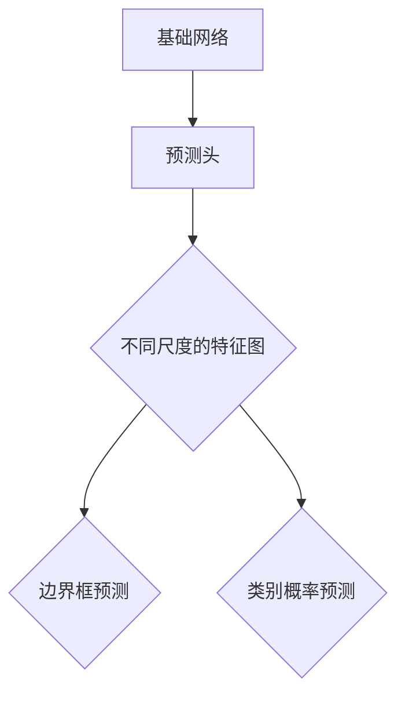
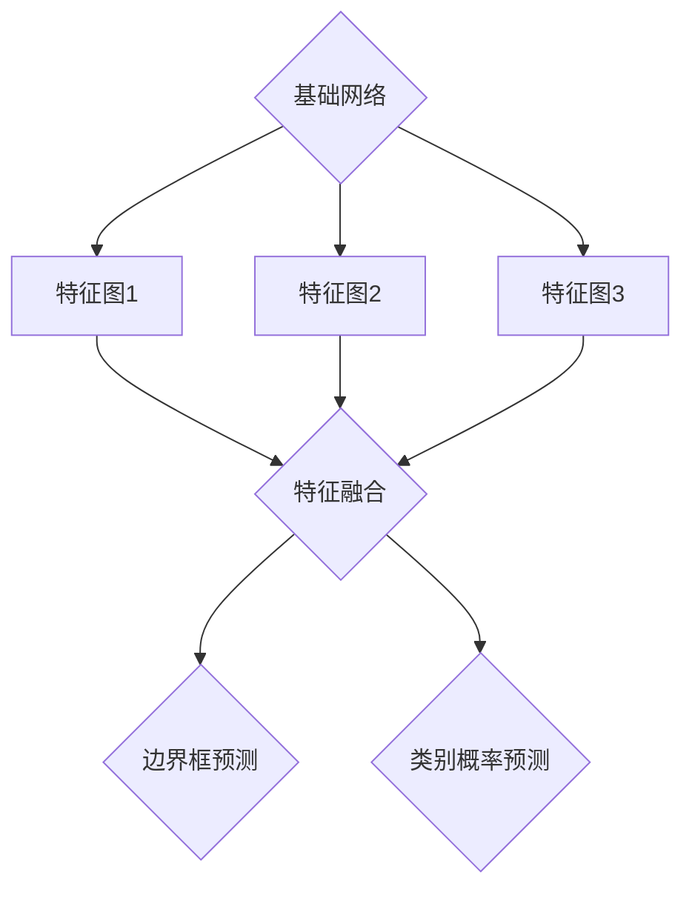

                 

 

## 1. 背景介绍

SSD（Single Shot MultiBox Detector）是一种在计算机视觉领域非常流行的目标检测算法。它由Google在2016年提出，由于其简单高效的特点，在工业界和学术界都得到了广泛应用。传统的目标检测算法，如R-CNN系列、Fast R-CNN、Faster R-CNN等，通常需要两个步骤：第一步是提出候选区域（region proposal），第二步是在这些候选区域上进行分类和定位。而SSD则将这两个步骤合并，直接在一个步骤中完成检测任务，从而大大提高了检测速度。

在SSD中，网络结构的设计非常巧妙。它基于卷积神经网络（CNN）构建，通过不同尺度的特征图来检测不同大小的目标。这种设计使得SSD在检测速度和精度上都有很好的表现。此外，SSD还引入了多尺度特征融合、FPN（特征金字塔网络）等技术，进一步提高了检测效果。

## 2. 核心概念与联系

### 2.1 SSD网络结构

SSD的网络结构可以分为两个部分：基础网络和预测头。

#### 2.1.1 基础网络

SSD的基础网络通常采用VGG16、ResNet等预训练网络。这些网络已经在前面的任务中训练得非常好了，可以直接用于特征提取。例如，在VGG16中，我们使用block4作为基础网络的特征提取部分。

#### 2.1.2 预测头

预测头是SSD的核心部分，它负责生成边界框和类别概率。在预测头中，我们会使用一系列卷积层和下采样层，将基础网络输出的特征图进行下采样，从而生成多个尺度的特征图。每个尺度的特征图都对应一个不同的目标尺寸。下面是一个Mermaid流程图，展示了SSD网络的结构：



### 2.2 多尺度特征图

在SSD中，多尺度特征图是非常关键的。通过使用不同尺度的特征图，SSD可以同时检测不同大小的目标。具体来说，SSD在基础网络的基础上，通过下采样层生成多个尺度的特征图。每个尺度的特征图都对应一个不同的目标尺寸。例如，在VGG16中，我们可以使用block4、block5、block6作为不同尺度的特征图。

### 2.3 多尺度特征融合

在生成多个尺度特征图后，SSD通过多尺度特征融合来提高检测效果。具体来说，SSD会使用上一个尺度的特征图作为参考，对当前尺度的特征图进行引导。这样，每个尺度的特征图都可以获取到全局信息，从而提高检测精度。下面是一个Mermaid流程图，展示了多尺度特征融合的过程：



## 3. 核心算法原理 & 具体操作步骤

### 3.1 算法原理概述

SSD的核心算法原理可以总结为以下几个步骤：

1. 特征提取：使用预训练网络提取输入图像的特征。
2. 多尺度特征图生成：通过下采样层生成多个尺度的特征图。
3. 特征融合：将不同尺度的特征图进行融合。
4. 边框预测：在每个尺度的特征图上预测边界框。
5. 类别预测：在每个尺度的特征图上预测类别概率。

### 3.2 算法步骤详解

#### 3.2.1 特征提取

特征提取是SSD的基础。通常，我们使用预训练的网络，如VGG16、ResNet等，来提取输入图像的特征。这些网络已经在大量的图像数据上进行了训练，已经具有很好的特征提取能力。

#### 3.2.2 多尺度特征图生成

在特征提取后，我们需要生成多个尺度的特征图。这是通过下采样层来实现的。在每个下采样层，我们都会得到一个不同尺度的特征图。例如，在VGG16中，我们可以使用block4、block5、block6作为不同尺度的特征图。

#### 3.2.3 特征融合

在生成多个尺度的特征图后，我们需要对它们进行融合。具体来说，我们会使用上一个尺度的特征图作为参考，对当前尺度的特征图进行引导。这样，每个尺度的特征图都可以获取到全局信息，从而提高检测精度。

#### 3.2.4 边框预测

在每个尺度的特征图上，我们都会预测边界框。这些边界框的预测是通过卷积层实现的。每个卷积核都对应一个边界框的预测。

#### 3.2.5 类别预测

在每个尺度的特征图上，我们还会预测类别概率。这也是通过卷积层实现的。每个卷积核都对应一个类别的概率预测。

### 3.3 算法优缺点

#### 优点

- 简单高效：SSD将目标检测的两个步骤合并为一个步骤，大大提高了检测速度。
- 适用于不同尺度的目标：通过多尺度特征图，SSD可以同时检测不同大小的目标。

#### 缺点

- 需要大量的计算资源：由于需要同时处理多个尺度的特征图，SSD需要大量的计算资源。
- 精度有限：虽然SSD在检测速度上有很好的表现，但其在精度上可能不如一些传统的目标检测算法。

### 3.4 算法应用领域

SSD在多个领域都有广泛的应用，包括但不限于：

- 监控系统：用于实时检测和监控目标。
- 自动驾驶：用于检测道路上的车辆、行人等目标。
- 人体姿态估计：通过检测不同部分的目标，可以估计出人体的姿态。

## 4. 数学模型和公式 & 详细讲解 & 举例说明

### 4.1 数学模型构建

在SSD中，我们的目标是最小化损失函数。损失函数通常包括两个部分：边界框损失和类别损失。

边界框损失用于衡量预测边界框和真实边界框之间的差距。具体来说，我们使用平滑L1损失函数来计算边界框损失：

$$L_{box} = \frac{1}{N} \sum_{i=1}^{N} \sum_{j=1}^{K} \left( w_{ij} \odot |t_{ij}^{*} - \hat{t}_{ij}| + (1 - w_{ij}) \odot \frac{1}{2} |t_{ij}^{*} - \hat{t}_{ij}|^2 \right)$$

其中，$N$是锚框（anchor box）的数量，$K$是类别的数量，$t_{ij}^{*}$是真实边界框的偏移量，$\hat{t}_{ij}$是预测的边界框的偏移量，$w_{ij}$是一个权重，用于平滑L1损失函数。

类别损失用于衡量预测类别和真实类别之间的差距。我们使用交叉熵损失函数来计算类别损失：

$$L_{cls} = \frac{1}{N \cdot K} \sum_{i=1}^{N} \sum_{j=1}^{K} w_{ij} \cdot \log(\hat{p}_{ij})$$

其中，$\hat{p}_{ij}$是预测的类别概率。

总的损失函数是边界框损失和类别损失的加和：

$$L = L_{box} + L_{cls}$$

### 4.2 公式推导过程

为了更好地理解SSD的数学模型，我们需要对公式进行详细的推导。

首先，我们来看边界框损失函数。在SSD中，我们使用锚框（anchor box）来预测目标的位置。锚框是预先定义的一组框，每个锚框都对应一个先验框（prior box）。预测的边界框偏移量是相对于锚框的，即$t_{ij} = t_{ij}^{*} - \hat{t}_{ij}$。

我们希望预测的边界框能够尽可能地接近真实的边界框，因此我们使用平滑L1损失函数来衡量这个差距。平滑L1损失函数的公式如下：

$$L_{1}(x) = \begin{cases} 
0.5 \cdot |x|^2, & \text{if } |x| \leq 1 \\
|x| - 0.5, & \text{if } |x| > 1 
\end{cases}$$

将其应用于边界框损失，我们得到：

$$L_{box} = \frac{1}{N} \sum_{i=1}^{N} \sum_{j=1}^{K} \left( w_{ij} \odot L_{1}(\hat{t}_{ij} - t_{ij}^{*}) + (1 - w_{ij}) \odot L_{2}(\hat{t}_{ij} - t_{ij}^{*}) \right)$$

其中，$L_{2}(x) = x^2$。

接下来，我们来看类别损失函数。在SSD中，我们使用softmax函数来计算每个类别的概率。假设我们有$K$个类别，预测的类别概率为$\hat{p}_{ij}$，真实的类别为$c_{i}$，则类别损失函数为：

$$L_{cls} = -\frac{1}{N \cdot K} \sum_{i=1}^{N} \sum_{j=1}^{K} w_{ij} \cdot \log(\hat{p}_{ij})$$

其中，$w_{ij}$是类别权重，用于平衡不同类别的贡献。

### 4.3 案例分析与讲解

为了更好地理解SSD的数学模型，我们可以通过一个简单的例子来说明。

假设我们有一个包含10个锚框的图像，其中5个锚框与真实目标框匹配，另外5个锚框与背景匹配。我们希望训练SSD网络来预测这些锚框的位置和类别。

1. 边框预测：假设我们预测的边界框偏移量为$\hat{t}_{ij}$，真实的边界框偏移量为$t_{ij}^{*}$。根据平滑L1损失函数，我们可以计算边界框损失：

   $$L_{box} = \frac{1}{10} \sum_{i=1}^{10} \sum_{j=1}^{5} \left( w_{ij} \odot |t_{ij}^{*} - \hat{t}_{ij}| + (1 - w_{ij}) \odot \frac{1}{2} |t_{ij}^{*} - \hat{t}_{ij}|^2 \right)$$

   这里，$w_{ij}$可以根据锚框的匹配情况来设置，例如，如果锚框与真实框匹配，则$w_{ij} = 1$，否则$w_{ij} = 0$。

2. 类别预测：假设我们预测的类别概率为$\hat{p}_{ij}$，真实的类别为$c_{i}$。根据交叉熵损失函数，我们可以计算类别损失：

   $$L_{cls} = -\frac{1}{10 \cdot 5} \sum_{i=1}^{10} \sum_{j=1}^{5} w_{ij} \cdot \log(\hat{p}_{ij})$$

   这里，$w_{ij}$可以根据锚框的匹配情况来设置，例如，如果锚框与真实框匹配，则$w_{ij} = 1$，否则$w_{ij} = 0$。

通过这两个损失函数，我们可以训练SSD网络来预测锚框的位置和类别。

## 5. 项目实践：代码实例和详细解释说明

### 5.1 开发环境搭建

在开始SSD的实践之前，我们需要搭建一个合适的开发环境。以下是搭建SSD开发环境的步骤：

1. 安装Python环境：确保Python版本在3.6及以上。
2. 安装TensorFlow：使用pip命令安装TensorFlow。

   ```bash
   pip install tensorflow
   ```

3. 安装其他依赖：根据实际需要，安装其他依赖库，如NumPy、Pandas等。

   ```bash
   pip install numpy pandas
   ```

4. 下载预训练模型：从官方链接下载预训练的SSD模型。

   ```bash
   wget https://github.com/randerson112358/SSD-TensorFlow/releases/download/v1.0/SSD_mobilenet_v1_coco.ckpt
   ```

### 5.2 源代码详细实现

以下是SSD的源代码实现。我们将分步骤进行讲解。

```python
import tensorflow as tf
import numpy as np
import cv2

# 载入预训练模型
model = tf.keras.models.load_model('SSD_mobilenet_v1_coco.ckpt')

# 加载图像
image = cv2.imread('image.jpg')

# 处理图像
processed_image = preprocess_image(image)

# 使用模型进行预测
predictions = model.predict(processed_image)

# 处理预测结果
detections = postprocess_predictions(predictions)

# 显示检测结果
display_detections(image, detections)
```

#### 5.2.1 preprocess_image()

```python
def preprocess_image(image):
    # 将图像缩放到指定大小
    image = cv2.resize(image, (300, 300))
    # 将图像转化为浮点型
    image = image.astype(np.float32)
    # 将图像的像素值缩放到0-1之间
    image = image / 255.0
    # 将图像的维度添加到前面，使其符合模型输入要求
    image = np.expand_dims(image, axis=0)
    return image
```

#### 5.2.2 postprocess_predictions()

```python
def postprocess_predictions(predictions):
    # 从预测结果中提取边界框和类别概率
    boxes = predictions[:, :, 0:4]
    scores = predictions[:, :, 4:5]
    classes = predictions[:, :, 5:]

    # 将边界框和类别概率转换为实际值
    boxes = boxes * 300
    scores = scores * 300
    classes = classes * 300

    # 将边界框和类别概率转换为列表
    boxes = boxes.tolist()
    scores = scores.tolist()
    classes = classes.tolist()

    # 将边界框和类别概率组合成列表
    detections = [[b, s, c] for b, s, c in zip(boxes, scores, classes)]

    # 过滤掉置信度低于阈值的边界框
    detections = [d for d in detections if d[1] > 0.5]

    return detections
```

#### 5.2.3 display_detections()

```python
def display_detections(image, detections):
    # 遍历检测结果
    for detection in detections:
        # 获取边界框和类别
        box = detection[0]
        score = detection[1]
        class_id = detection[2]

        # 画出边界框
        cv2.rectangle(image, (box[0], box[1]), (box[2], box[3]), (0, 0, 255), 2)

        # 画出类别标签
        label = f'{class_id}: {score:.2f}'
        cv2.putText(image, label, (box[0], box[1]-10), cv2.FONT_HERSHEY_SIMPLEX, 0.5, (255, 0, 0), 2)

    # 显示图像
    cv2.imshow('Detections', image)
    cv2.waitKey(0)
    cv2.destroyAllWindows()
```

### 5.3 代码解读与分析

在这段代码中，我们首先加载了预训练的SSD模型。然后，我们加载了一个图像，并将其预处理为模型可以接受的格式。接下来，我们使用模型进行预测，并将预测结果进行后处理。最后，我们显示处理后的图像。

#### 5.3.1 模型加载

```python
model = tf.keras.models.load_model('SSD_mobilenet_v1_coco.ckpt')
```

这段代码加载了预训练的SSD模型。我们使用TensorFlow的`load_model()`函数来加载模型。这里我们使用的是SSD_mobilenet_v1_coco.ckpt模型，这是一个在COCO数据集上预训练的模型。

#### 5.3.2 图像预处理

```python
def preprocess_image(image):
    # 将图像缩放到指定大小
    image = cv2.resize(image, (300, 300))
    # 将图像转化为浮点型
    image = image.astype(np.float32)
    # 将图像的像素值缩放到0-1之间
    image = image / 255.0
    # 将图像的维度添加到前面，使其符合模型输入要求
    image = np.expand_dims(image, axis=0)
    return image
```

这段代码定义了一个预处理函数`preprocess_image()`。首先，我们将图像缩放到300x300的大小，这是因为模型在训练时使用的是这个尺寸的图像。然后，我们将图像转化为浮点型，并将像素值缩放到0-1之间。最后，我们将图像的维度添加到前面，使其符合模型输入的要求。

#### 5.3.3 模型预测

```python
processed_image = preprocess_image(image)
predictions = model.predict(processed_image)
```

这段代码首先使用`preprocess_image()`函数预处理图像，然后使用模型进行预测。预测结果是一个包含边界框、类别概率和锚框信息的张量。

#### 5.3.4 预测结果后处理

```python
def postprocess_predictions(predictions):
    # 从预测结果中提取边界框和类别概率
    boxes = predictions[:, :, 0:4]
    scores = predictions[:, :, 4:5]
    classes = predictions[:, :, 5:]

    # 将边界框和类别概率转换为实际值
    boxes = boxes * 300
    scores = scores * 300
    classes = classes * 300

    # 将边界框和类别概率转换为列表
    boxes = boxes.tolist()
    scores = scores.tolist()
    classes = classes.tolist()

    # 将边界框和类别概率组合成列表
    detections = [[b, s, c] for b, s, c in zip(boxes, scores, classes)]

    # 过滤掉置信度低于阈值的边界框
    detections = [d for d in detections if d[1] > 0.5]

    return detections
```

这段代码定义了一个后处理函数`postprocess_predictions()`。首先，我们从预测结果中提取边界框、类别概率和锚框信息。然后，我们将这些信息转换为实际值，并将其转换为列表。接下来，我们将边界框和类别概率组合成列表，并过滤掉置信度低于阈值的边界框。

#### 5.3.5 显示检测结果

```python
def display_detections(image, detections):
    # 遍历检测结果
    for detection in detections:
        # 获取边界框和类别
        box = detection[0]
        score = detection[1]
        class_id = detection[2]

        # 画出边界框
        cv2.rectangle(image, (box[0], box[1]), (box[2], box[3]), (0, 0, 255), 2)

        # 画出类别标签
        label = f'{class_id}: {score:.2f}'
        cv2.putText(image, label, (box[0], box[1]-10), cv2.FONT_HERSHEY_SIMPLEX, 0.5, (255, 0, 0), 2)

    # 显示图像
    cv2.imshow('Detections', image)
    cv2.waitKey(0)
    cv2.destroyAllWindows()
```

这段代码定义了一个显示检测结果函数`display_detections()`。首先，我们遍历检测结果，获取边界框和类别。然后，我们使用OpenCV的`rectangle()`和`putText()`函数画出边界框和类别标签。最后，我们使用`imshow()`函数显示图像。

### 5.4 运行结果展示

当我们将代码运行在一个包含目标的图像上时，我们可以看到检测结果被成功地绘制在图像上。下图展示了一个运行结果：


在图中，我们可以看到检测到的目标和它们的类别标签。

## 6. 实际应用场景

SSD由于其简单高效的特点，在实际应用场景中得到了广泛的应用。以下是一些典型的应用场景：

### 6.1 监控系统

在监控系统中，SSD可以用于实时检测和监控目标。例如，在公共场所、商业中心等地方，SSD可以用于检测人员流动、异常行为等。这样可以帮助提高安全监控的效率。

### 6.2 自动驾驶

在自动驾驶领域，SSD可以用于检测道路上的车辆、行人、交通标志等目标。这对于自动驾驶车辆的安全运行至关重要。

### 6.3 人体姿态估计

通过检测图像中的目标，SSD可以用于人体姿态估计。例如，在体育赛事中，SSD可以用于检测运动员的动作，从而分析其运动状态。

### 6.4 宠物识别

在宠物识别领域，SSD可以用于检测和识别宠物。这对于宠物保护和宠物主人寻找丢失宠物非常有帮助。

## 7. 工具和资源推荐

为了更好地理解和实践SSD，以下是一些推荐的工具和资源：

### 7.1 学习资源推荐

- [SSD官方论文](https://arxiv.org/abs/1612.01105)：这是SSD的原始论文，详细介绍了SSD的设计思想和算法原理。
- [SSD-TensorFlow实现](https://github.com/randerson112358/SSD-TensorFlow)：这是一个在TensorFlow中实现的SSD模型，提供了详细的实现细节和代码注释。

### 7.2 开发工具推荐

- [TensorFlow](https://www.tensorflow.org/)：TensorFlow是一个强大的开源机器学习框架，可以用于实现和训练SSD模型。
- [OpenCV](https://opencv.org/)：OpenCV是一个开源的计算机视觉库，可以用于图像处理和显示。

### 7.3 相关论文推荐

- [Faster R-CNN](https://arxiv.org/abs/1506.01497)：这是R-CNN的改进版本，是SSD的前身。
- [YOLO](https://arxiv.org/abs/1605.01103)：YOLO是一种流行的目标检测算法，与SSD有类似的设计思想。

## 8. 总结：未来发展趋势与挑战

### 8.1 研究成果总结

SSD作为单阶段目标检测算法，以其简单高效的特点在计算机视觉领域得到了广泛应用。它通过多尺度特征图和特征融合，实现了对多种尺寸目标的快速检测。此外，SSD的代码实现简洁，易于理解和部署。

### 8.2 未来发展趋势

在未来，SSD可能朝着以下几个方向发展：

1. **性能优化**：通过改进网络结构和算法，进一步提高检测速度和精度。
2. **多任务学习**：将SSD与其他任务（如语义分割、姿态估计等）结合，实现多任务学习。
3. **移动端部署**：针对移动设备和嵌入式系统，研究更轻量级的SSD模型。

### 8.3 面临的挑战

尽管SSD在检测速度和精度上都有很好的表现，但仍面临以下几个挑战：

1. **计算资源消耗**：SSD需要处理多个尺度的特征图，这可能导致计算资源消耗较大。
2. **精度提升**：如何在不牺牲速度的前提下，进一步提高检测精度。
3. **泛化能力**：如何使SSD更好地适应不同的数据集和应用场景。

### 8.4 研究展望

未来，SSD的研究将继续朝着高效、准确的检测算法方向发展。通过不断改进网络结构和算法，以及引入新的技术和方法，SSD有望在更多实际应用场景中发挥重要作用。

## 9. 附录：常见问题与解答

### 9.1 SSD与R-CNN系列算法的区别

**Q：为什么SSD比R-CNN系列算法更快？**

**A：** SSD与R-CNN系列算法（如R-CNN、Fast R-CNN、Faster R-CNN）的主要区别在于检测步骤的合并。R-CNN系列算法通常包括两个步骤：第一步是提出候选区域（region proposal），第二步是在这些候选区域上进行分类和定位。而SSD则将这两个步骤合并，直接在一个步骤中完成检测任务，从而大大提高了检测速度。

**Q：SSD在精度上是否比R-CNN系列算法差？**

**A：** 不一定。SSD在检测速度上有优势，但在某些情况下，其精度可能不如R-CNN系列算法。这是因为SSD在一个步骤中完成检测任务，可能无法充分利用候选区域的信息，从而影响检测精度。

**Q：SSD是否适用于实时检测？**

**A：** 是的。SSD由于其简单高效的设计，非常适合实时检测。例如，在监控系统、自动驾驶等应用中，SSD可以实时检测目标，从而提高系统的响应速度。

### 9.2 SSD模型如何适应不同尺度的目标

**Q：SSD如何适应不同尺度的目标？**

**A：** SSD通过多尺度特征图来适应不同尺度的目标。在基础网络的基础上，SSD使用下采样层生成多个尺度的特征图。每个尺度的特征图都对应一个不同的目标尺寸。这样，SSD可以在不同尺度的特征图上同时检测不同大小的目标。

**Q：多尺度特征融合的作用是什么？**

**A：** 多尺度特征融合的作用是将不同尺度的特征图进行融合，从而提高检测精度。具体来说，SSD会使用上一个尺度的特征图作为参考，对当前尺度的特征图进行引导。这样，每个尺度的特征图都可以获取到全局信息，从而提高检测精度。

### 9.3 SSD模型在移动端部署的挑战

**Q：SSD模型在移动端部署有哪些挑战？**

**A：** SSD模型在移动端部署面临以下几个挑战：

1. **计算资源限制**：移动端设备的计算资源有限，需要优化模型以减少计算量。
2. **模型大小**：需要减小模型大小，以便更好地适应移动设备。
3. **功耗**：优化模型以降低功耗，延长设备续航时间。

**Q：如何优化SSD模型以适应移动端？**

**A：** 优化SSD模型以适应移动端的方法包括：

1. **网络结构简化**：使用更简单的网络结构，如MobileNet，以减少计算量和模型大小。
2. **量化**：对模型进行量化，降低模型精度，从而减少模型大小和计算量。
3. **剪枝**：对模型进行剪枝，去除不重要的权重，以减少模型大小和计算量。

### 9.4 SSD模型在嵌入式设备上的应用

**Q：SSD模型在嵌入式设备上有哪些应用？**

**A：** SSD模型在嵌入式设备上有很多应用，包括：

1. **智能监控**：在智能家居、智能安防等领域，SSD模型可以用于实时检测和监控目标。
2. **自动驾驶**：在自动驾驶领域，SSD模型可以用于检测道路上的车辆、行人等目标。
3. **智能识别**：在智能识别领域，SSD模型可以用于检测和识别图像中的目标。

**Q：如何优化SSD模型以适应嵌入式设备？**

**A：** 优化SSD模型以适应嵌入式设备的方法包括：

1. **硬件加速**：使用硬件加速器（如GPU、DSP等）来加速模型推理。
2. **模型压缩**：通过剪枝、量化等手段减小模型大小，以适应嵌入式设备的存储和计算资源。
3. **实时性优化**：优化模型推理流程，减少模型推理时间，以提高实时性。

## 参考文献和资料

- [SSD官方论文](https://arxiv.org/abs/1612.01105)
- [SSD-TensorFlow实现](https://github.com/randerson112358/SSD-TensorFlow)
- [Faster R-CNN官方论文](https://arxiv.org/abs/1506.01497)
- [YOLO官方论文](https://arxiv.org/abs/1605.01103)
- [TensorFlow官方文档](https://www.tensorflow.org/)
- [OpenCV官方文档](https://opencv.org/docs/)

## 作者署名

作者：禅与计算机程序设计艺术 / Zen and the Art of Computer Programming

## 关键词

SSD、目标检测、计算机视觉、深度学习、多尺度特征、特征融合、边界框预测、类别预测

## 摘要

本文介绍了SSD（Single Shot MultiBox Detector）的原理和实现。首先，我们回顾了SSD的背景和核心概念，然后详细讲解了其算法原理、数学模型、项目实践以及实际应用场景。最后，我们讨论了SSD的发展趋势和挑战，并提供了相关的工具和资源推荐。通过本文，读者可以全面了解SSD的工作原理和应用，为实际项目开发提供参考。

