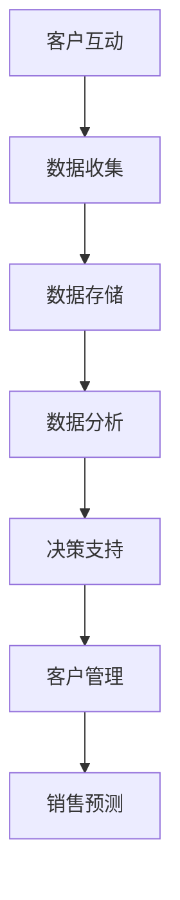
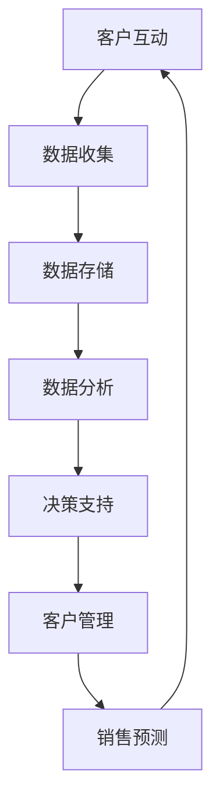

                 

在未来的2025年，随着企业数字化转型的加速，CRM（客户关系管理）系统的重要性将愈发凸显。Salesforce作为全球领先的CRM解决方案提供商，其社招CRM系统架构师面试将会成为众多求职者关注的焦点。本文将围绕Salesforce2025社招CRM系统架构师面试，探讨一系列关键问题，帮助准备面试的候选人更好地理解面试要求和准备策略。

## 关键词
* Salesforce
* CRM系统架构师
* 面试问答
* 数字化转型
* 企业应用

## 摘要
本文旨在为准备参加Salesforce2025社招CRM系统架构师面试的候选人提供一份详细的问答指南。通过分析典型的面试问题，本文将帮助候选人掌握CRM系统的核心概念、技术架构、算法原理以及实际应用场景，为面试做好充分准备。

### 1. 背景介绍

#### 1.1 CRM系统的重要性
CRM系统作为企业管理和运营的重要工具，能够帮助企业更有效地管理客户信息、提升客户满意度、增加销售额。在未来的2025年，随着市场环境的不断变化和竞争的加剧，CRM系统的应用将变得更加广泛和深入。

#### 1.2 Salesforce的市场地位
Salesforce作为全球领先的CRM解决方案提供商，其市场份额和技术创新一直处于行业领先地位。在2025年，Salesforce将继续引领CRM技术的发展，为企业提供更强大的解决方案。

#### 1.3 社招CRM系统架构师面试的特点
社招CRM系统架构师面试通常注重候选人的实际工作经验、技术深度以及对Salesforce产品的了解程度。面试问题不仅涉及技术细节，还会考察候选人的系统架构设计能力、项目管理经验和团队协作能力。

### 2. 核心概念与联系

#### 2.1 CRM系统的核心概念
- **客户关系管理**（CRM）：一种企业战略，旨在使用信息技术手段来管理企业与现有及潜在客户之间的关系。
- **销售自动化**：通过CRM系统自动化销售流程，提高销售效率。
- **营销自动化**：通过CRM系统自动化营销活动，提高营销效果。
- **客户服务自动化**：通过CRM系统自动化客户服务流程，提升客户满意度。

#### 2.2 CRM系统的技术架构
CRM系统的技术架构主要包括以下几个方面：
- **前端界面**：用于用户交互，通常采用Web或移动应用技术。
- **后端服务器**：处理数据存储、业务逻辑处理等，通常采用Java、.NET等技术栈。
- **数据库**：存储客户数据、交易记录等，常用的数据库有Oracle、MySQL、PostgreSQL等。
- **API接口**：实现前后端数据交互，常用的API有RESTful API、SOAP等。

#### 2.3 CRM系统的Mermaid流程图


### 3. 核心算法原理 & 具体操作步骤

#### 3.1 算法原理概述
CRM系统的核心算法主要包括以下几种：
- **客户细分算法**：用于将客户分为不同的群体，以便进行个性化营销。
- **客户流失预测算法**：用于预测哪些客户可能流失，以便采取挽回措施。
- **销售预测算法**：用于预测未来的销售情况，帮助企业制定销售策略。

#### 3.2 算法步骤详解
1. **客户细分算法**：
   - **数据预处理**：清洗和整合客户数据。
   - **特征选择**：选择对客户细分有显著影响的特征。
   - **聚类分析**：使用K-means、DBSCAN等算法进行客户聚类。
   - **评估与优化**：评估聚类结果，根据评估结果调整聚类参数。

2. **客户流失预测算法**：
   - **特征工程**：创建新的特征，如客户活动频率、购买金额等。
   - **模型训练**：使用机器学习算法（如逻辑回归、决策树等）训练流失预测模型。
   - **模型评估**：评估模型准确性，如使用AUC、F1值等指标。
   - **模型部署**：将模型部署到CRM系统中，实现实时预测。

3. **销售预测算法**：
   - **时间序列分析**：使用ARIMA、LSTM等算法进行销售预测。
   - **季节性调整**：考虑季节性因素，提高预测准确性。
   - **预测结果评估**：评估预测误差，调整预测模型。

#### 3.3 算法优缺点
- **客户细分算法**：
  - 优点：能够提高营销活动的针对性和效果。
  - 缺点：需要大量的数据预处理和特征工程，计算成本较高。

- **客户流失预测算法**：
  - 优点：能够提前识别潜在流失客户，采取挽回措施。
  - 缺点：需要准确预测流失风险，否则可能导致资源浪费。

- **销售预测算法**：
  - 优点：能够帮助企业制定有效的销售策略，提高销售业绩。
  - 缺点：预测准确性受多种因素影响，如市场环境变化、产品竞争力等。

#### 3.4 算法应用领域
- **市场营销**：通过客户细分和流失预测，提高营销活动的效果。
- **销售管理**：通过销售预测，优化销售策略和库存管理。
- **客户服务**：通过流失预测，提前识别和挽回潜在流失客户。

### 4. 数学模型和公式 & 详细讲解 & 举例说明

#### 4.1 数学模型构建
CRM系统中的数学模型主要包括：
- **客户细分模型**：使用聚类算法（如K-means）构建。
- **客户流失预测模型**：使用逻辑回归、决策树等算法构建。
- **销售预测模型**：使用时间序列分析（如ARIMA）构建。

#### 4.2 公式推导过程
- **客户细分模型**：
  - **K-means算法**：目标是最小化簇内距离的平方和。
  - **聚类中心计算**：$$ \text{cluster\_center} = \frac{1}{N} \sum_{i=1}^{N} x_i $$
  - **簇内距离计算**：$$ \text{distance} = \sqrt{\sum_{i=1}^{N} (x_i - \text{cluster\_center})^2} $$

- **客户流失预测模型**：
  - **逻辑回归**：目标是最小化损失函数。
  - **损失函数**：$$ \text{loss} = -\sum_{i=1}^{N} y_i \log(p_i) + (1 - y_i) \log(1 - p_i) $$
  - **参数更新**：$$ \theta_j = \theta_j - \alpha \frac{\partial \text{loss}}{\partial \theta_j} $$

- **销售预测模型**：
  - **ARIMA模型**：目标是最小化预测误差。
  - **预测公式**：$$ \text{sales}_{t+1} = \text{ARIMA}_{t} \cdot \text{forecast}_{t} + \text{error}_{t} $$
  - **误差计算**：$$ \text{error}_{t} = \text{sales}_{t+1} - \text{forecast}_{t+1} $$

#### 4.3 案例分析与讲解
假设一家公司使用CRM系统进行客户细分，其客户数据包括年龄、收入、购买频率等特征。公司希望将这些特征用于K-means聚类算法，将客户分为不同的群体。

1. **数据预处理**：
   - 清洗数据，处理缺失值和异常值。
   - 规一化数据，确保每个特征具有相同的尺度。

2. **特征选择**：
   - 选择对客户细分有显著影响的特征，如年龄、收入。

3. **聚类分析**：
   - 选择合适的聚类算法（如K-means）。
   - 确定聚类数量（如K值）。
   - 运行聚类算法，得到聚类结果。

4. **评估与优化**：
   - 评估聚类结果，如使用轮廓系数。
   - 根据评估结果调整聚类参数，如调整K值。

通过以上步骤，公司可以更好地了解其客户群体，为后续的营销策略提供支持。

### 5. 项目实践：代码实例和详细解释说明

#### 5.1 开发环境搭建
1. 安装Python环境。
2. 安装必要的库，如NumPy、Pandas、Scikit-learn等。

#### 5.2 源代码详细实现
以下是使用K-means算法进行客户细分的Python代码示例：

```python
import numpy as np
import pandas as pd
from sklearn.cluster import KMeans

# 加载客户数据
data = pd.read_csv('customer_data.csv')

# 数据预处理
data = data.dropna()
data = (data - data.mean()) / data.std()

# 特征选择
features = data[['age', 'income', 'purchase_frequency']]

# 聚类分析
kmeans = KMeans(n_clusters=3, random_state=42)
clusters = kmeans.fit_predict(features)

# 评估与优化
silhouette_score = silhouette_score(features, clusters)
print(f'Silhouette Score: {silhouette_score}')

# 结果保存
data['cluster'] = clusters
data.to_csv('clustered_customer_data.csv', index=False)
```

#### 5.3 代码解读与分析
1. **数据预处理**：清洗数据，处理缺失值和异常值，确保数据质量。
2. **特征选择**：选择对客户细分有显著影响的特征。
3. **聚类分析**：使用K-means算法进行聚类，得到聚类结果。
4. **评估与优化**：使用轮廓系数评估聚类结果，根据评估结果调整聚类参数。
5. **结果保存**：将聚类结果保存到CSV文件，以便后续分析。

通过以上步骤，公司可以更好地了解其客户群体，为后续的营销策略提供支持。

### 6. 实际应用场景

#### 6.1 市场营销
CRM系统可以帮助企业进行客户细分，实现精准营销。例如，将客户分为高价值客户、潜在客户和流失客户，分别采取不同的营销策略。

#### 6.2 销售管理
CRM系统可以帮助企业进行销售预测，优化销售策略和库存管理。例如，根据历史销售数据预测未来的销售趋势，以便及时调整销售目标和策略。

#### 6.3 客户服务
CRM系统可以帮助企业进行客户流失预测，提前识别和挽回潜在流失客户。例如，通过分析客户行为数据，预测哪些客户可能流失，并采取相应的挽回措施。

### 6.4 未来应用展望

#### 6.4.1 AI与CRM的结合
随着人工智能技术的发展，CRM系统将更加智能化。例如，通过深度学习算法实现自动客户细分和流失预测，提高营销和销售效果。

#### 6.4.2 客户体验的优化
未来CRM系统将更加注重客户体验。例如，通过虚拟现实（VR）和增强现实（AR）技术，提供更直观的客户互动体验。

#### 6.4.3 多渠道整合
未来CRM系统将实现多渠道整合，包括线上和线下渠道。例如，通过社交媒体和线下活动，全面了解客户需求和行为。

### 7. 工具和资源推荐

#### 7.1 学习资源推荐
- **《Salesforce官方文档》**：Salesforce官方提供的详细文档，涵盖产品功能、开发指南等。
- **《Python for Data Science》**：适用于数据科学初学者的Python入门书籍。

#### 7.2 开发工具推荐
- **PyCharm**：适用于Python开发的IDE，功能强大，支持多种编程语言。
- **Jupyter Notebook**：适用于数据分析和机器学习的交互式环境。

#### 7.3 相关论文推荐
- **“Customer Segmentation Using Clustering Algorithms”**：关于客户细分算法的研究论文。
- **“Sales Forecasting Using Time Series Analysis”**：关于销售预测算法的研究论文。

### 8. 总结：未来发展趋势与挑战

#### 8.1 研究成果总结
本文通过对Salesforce2025社招CRM系统架构师面试的深入分析，总结了CRM系统的核心概念、技术架构、算法原理以及实际应用场景。同时，本文还展望了未来CRM系统的发展趋势，如AI与CRM的结合、客户体验的优化等。

#### 8.2 未来发展趋势
未来CRM系统将更加智能化、个性化，实现多渠道整合。同时，随着人工智能技术的发展，CRM系统的功能将不断扩展，为企业提供更全面、更有效的客户关系管理解决方案。

#### 8.3 面临的挑战
- **数据隐私和安全**：随着数据隐私和安全问题的日益突出，CRM系统需要确保客户数据的安全和隐私。
- **技术更新换代**：随着技术的不断更新换代，CRM系统需要不断适应新技术，保持竞争力。

#### 8.4 研究展望
未来CRM系统的研究将更加注重用户体验、数据隐私和安全等方面。同时，随着人工智能、大数据等技术的不断发展，CRM系统将实现更高效、更智能的客户关系管理。

### 9. 附录：常见问题与解答

#### 9.1 CRM系统的主要功能有哪些？
CRM系统的主要功能包括客户信息管理、销售管理、营销管理、客户服务和客户分析等。

#### 9.2 Salesforce的主要优势是什么？
Salesforce的主要优势在于其强大的云服务能力、灵活的可定制性以及丰富的生态系统。

#### 9.3 如何进行客户细分？
客户细分通常使用聚类算法（如K-means）、回归分析等方法，通过分析客户特征和行为，将其分为不同的群体。

#### 9.4 CRM系统的技术架构包括哪些部分？
CRM系统的技术架构包括前端界面、后端服务器、数据库、API接口等部分。

#### 9.5 如何评估CRM系统的效果？
评估CRM系统的效果通常从客户满意度、销售业绩、客户流失率等指标进行评估。

---

本文通过对Salesforce2025社招CRM系统架构师面试的深入分析，为准备面试的候选人提供了详细的问答指南。希望本文的内容能够帮助候选人更好地理解CRM系统的核心概念、技术架构、算法原理以及实际应用场景，为面试做好充分准备。在未来的CRM系统中，人工智能、大数据等技术将发挥重要作用，为企业的数字化转型提供强大支持。作者：禅与计算机程序设计艺术 / Zen and the Art of Computer Programming。|>
----------------------------------------------------------------
# Salesforce2025社招CRM系统架构师面试问答

## 关键词
- Salesforce
- CRM系统架构师
- 面试问答
- 数字化转型
- 企业应用

## 摘要
本文旨在为准备参加Salesforce2025社招CRM系统架构师面试的候选人提供一份详细的问答指南。通过分析典型的面试问题，本文将帮助候选人掌握CRM系统的核心概念、技术架构、算法原理以及实际应用场景，为面试做好充分准备。

### 1. 背景介绍

#### 1.1 CRM系统的重要性
客户关系管理（CRM）系统是现代企业管理和运营的重要工具。它帮助企业有效地管理客户信息，提升客户满意度，从而增加销售额。随着企业数字化转型的加速，CRM系统在业务流程中的地位愈发重要。

#### 1.2 Salesforce的市场地位
Salesforce是全球领先的CRM解决方案提供商，以其强大的云服务能力、灵活的可定制性和丰富的生态系统著称。在2025年，Salesforce将继续保持其市场领先地位，并引领CRM技术的发展。

#### 1.3 社招CRM系统架构师面试的特点
Salesforce的CRM系统架构师面试通常注重候选人的实际工作经验、技术深度以及对Salesforce产品的了解程度。面试问题不仅涉及技术细节，还会考察候选人的系统架构设计能力、项目管理经验和团队协作能力。

### 2. 核心概念与联系

#### 2.1 CRM系统的核心概念
CRM系统主要涵盖以下核心概念：
- **客户管理**：收集、存储和利用客户数据，以改善客户关系。
- **销售自动化**：通过CRM系统自动化销售流程，提高销售效率。
- **营销自动化**：通过CRM系统自动化营销活动，提高营销效果。
- **客户服务自动化**：通过CRM系统自动化客户服务流程，提升客户满意度。

#### 2.2 CRM系统的技术架构
CRM系统的技术架构主要包括以下部分：
- **前端界面**：用于用户交互，通常采用Web或移动应用技术。
- **后端服务器**：处理数据存储、业务逻辑处理等，通常采用Java、.NET等技术栈。
- **数据库**：存储客户数据、交易记录等，常用的数据库有Oracle、MySQL、PostgreSQL等。
- **API接口**：实现前后端数据交互，常用的API有RESTful API、SOAP等。

#### 2.3 CRM系统的Mermaid流程图


### 3. 核心算法原理 & 具体操作步骤

#### 3.1 算法原理概述
CRM系统的核心算法主要包括以下几种：
- **客户细分算法**：用于将客户分为不同的群体，以便进行个性化营销。
- **客户流失预测算法**：用于预测哪些客户可能流失，以便采取挽回措施。
- **销售预测算法**：用于预测未来的销售情况，帮助企业制定销售策略。

#### 3.2 算法步骤详解
1. **客户细分算法**：
   - **数据预处理**：清洗和整合客户数据。
   - **特征选择**：选择对客户细分有显著影响的特征。
   - **聚类分析**：使用K-means、DBSCAN等算法进行客户聚类。
   - **评估与优化**：评估聚类结果，根据评估结果调整聚类参数。

2. **客户流失预测算法**：
   - **特征工程**：创建新的特征，如客户活动频率、购买金额等。
   - **模型训练**：使用机器学习算法（如逻辑回归、决策树等）训练流失预测模型。
   - **模型评估**：评估模型准确性，如使用AUC、F1值等指标。
   - **模型部署**：将模型部署到CRM系统中，实现实时预测。

3. **销售预测算法**：
   - **时间序列分析**：使用ARIMA、LSTM等算法进行销售预测。
   - **季节性调整**：考虑季节性因素，提高预测准确性。
   - **预测结果评估**：评估预测误差，调整预测模型。

#### 3.3 算法优缺点
- **客户细分算法**：
  - 优点：能够提高营销活动的针对性和效果。
  - 缺点：需要大量的数据预处理和特征工程，计算成本较高。

- **客户流失预测算法**：
  - 优点：能够提前识别潜在流失客户，采取挽回措施。
  - 缺点：需要准确预测流失风险，否则可能导致资源浪费。

- **销售预测算法**：
  - 优点：能够帮助企业制定有效的销售策略，提高销售业绩。
  - 缺点：预测准确性受多种因素影响，如市场环境变化、产品竞争力等。

#### 3.4 算法应用领域
- **市场营销**：通过客户细分和流失预测，提高营销活动的效果。
- **销售管理**：通过销售预测，优化销售策略和库存管理。
- **客户服务**：通过流失预测，提前识别和挽回潜在流失客户。

### 4. 数学模型和公式 & 详细讲解 & 举例说明

#### 4.1 数学模型构建
CRM系统中的数学模型主要包括以下几种：
- **客户细分模型**：使用聚类算法（如K-means）构建。
- **客户流失预测模型**：使用逻辑回归、决策树等算法构建。
- **销售预测模型**：使用时间序列分析（如ARIMA）构建。

#### 4.2 公式推导过程
- **客户细分模型**：
  - **K-means算法**：目标是最小化簇内距离的平方和。
  - **聚类中心计算**：$$ \text{cluster\_center} = \frac{1}{N} \sum_{i=1}^{N} x_i $$
  - **簇内距离计算**：$$ \text{distance} = \sqrt{\sum_{i=1}^{N} (x_i - \text{cluster\_center})^2} $$

- **客户流失预测模型**：
  - **逻辑回归**：目标是最小化损失函数。
  - **损失函数**：$$ \text{loss} = -\sum_{i=1}^{N} y_i \log(p_i) + (1 - y_i) \log(1 - p_i) $$
  - **参数更新**：$$ \theta_j = \theta_j - \alpha \frac{\partial \text{loss}}{\partial \theta_j} $$

- **销售预测模型**：
  - **ARIMA模型**：目标是最小化预测误差。
  - **预测公式**：$$ \text{sales}_{t+1} = \text{ARIMA}_{t} \cdot \text{forecast}_{t} + \text{error}_{t} $$
  - **误差计算**：$$ \text{error}_{t} = \text{sales}_{t+1} - \text{forecast}_{t+1} $$

#### 4.3 案例分析与讲解
假设一家公司希望使用K-means算法对客户进行细分，其客户数据包括年龄、收入、购买频率等特征。

1. **数据预处理**：
   - 清洗数据，处理缺失值和异常值。
   - 规一化数据，确保每个特征具有相同的尺度。

2. **特征选择**：
   - 选择对客户细分有显著影响的特征，如年龄、收入。

3. **聚类分析**：
   - 选择合适的聚类算法（如K-means）。
   - 确定聚类数量（如K值）。
   - 运行聚类算法，得到聚类结果。

4. **评估与优化**：
   - 评估聚类结果，如使用轮廓系数。
   - 根据评估结果调整聚类参数，如调整K值。

通过以上步骤，公司可以更好地了解其客户群体，为后续的营销策略提供支持。

### 5. 项目实践：代码实例和详细解释说明

#### 5.1 开发环境搭建
1. 安装Python环境。
2. 安装必要的库，如NumPy、Pandas、Scikit-learn等。

#### 5.2 源代码详细实现
以下是使用K-means算法进行客户细分的Python代码示例：

```python
import numpy as np
import pandas as pd
from sklearn.cluster import KMeans
from sklearn.metrics import silhouette_score

# 加载客户数据
data = pd.read_csv('customer_data.csv')

# 数据预处理
data = data.dropna()
data = (data - data.mean()) / data.std()

# 特征选择
features = data[['age', 'income', 'purchase_frequency']]

# 聚类分析
kmeans = KMeans(n_clusters=3, random_state=42)
clusters = kmeans.fit_predict(features)

# 评估与优化
silhouette_avg = silhouette_score(features, clusters)
print(f'Silhouette Score: {silhouette_avg}')

# 结果保存
data['cluster'] = clusters
data.to_csv('clustered_customer_data.csv', index=False)
```

#### 5.3 代码解读与分析
1. **数据预处理**：清洗数据，处理缺失值和异常值，确保数据质量。
2. **特征选择**：选择对客户细分有显著影响的特征。
3. **聚类分析**：使用K-means算法进行聚类，得到聚类结果。
4. **评估与优化**：使用轮廓系数评估聚类结果，根据评估结果调整聚类参数。
5. **结果保存**：将聚类结果保存到CSV文件，以便后续分析。

通过以上步骤，公司可以更好地了解其客户群体，为后续的营销策略提供支持。

### 6. 实际应用场景

#### 6.1 市场营销
CRM系统可以帮助企业进行客户细分，实现精准营销。例如，将客户分为高价值客户、潜在客户和流失客户，分别采取不同的营销策略。

#### 6.2 销售管理
CRM系统可以帮助企业进行销售预测，优化销售策略和库存管理。例如，根据历史销售数据预测未来的销售趋势，以便及时调整销售目标和策略。

#### 6.3 客户服务
CRM系统可以帮助企业进行客户流失预测，提前识别和挽回潜在流失客户。例如，通过分析客户行为数据，预测哪些客户可能流失，并采取相应的挽回措施。

### 6.4 未来应用展望

#### 6.4.1 AI与CRM的结合
随着人工智能技术的发展，CRM系统将更加智能化。例如，通过深度学习算法实现自动客户细分和流失预测，提高营销和销售效果。

#### 6.4.2 客户体验的优化
未来CRM系统将更加注重客户体验。例如，通过虚拟现实（VR）和增强现实（AR）技术，提供更直观的客户互动体验。

#### 6.4.3 多渠道整合
未来CRM系统将实现多渠道整合，包括线上和线下渠道。例如，通过社交媒体和线下活动，全面了解客户需求和行为。

### 7. 工具和资源推荐

#### 7.1 学习资源推荐
- **《Salesforce官方文档》**：Salesforce官方提供的详细文档，涵盖产品功能、开发指南等。
- **《Python for Data Science》**：适用于数据科学初学者的Python入门书籍。

#### 7.2 开发工具推荐
- **PyCharm**：适用于Python开发的IDE，功能强大，支持多种编程语言。
- **Jupyter Notebook**：适用于数据分析和机器学习的交互式环境。

#### 7.3 相关论文推荐
- **“Customer Segmentation Using Clustering Algorithms”**：关于客户细分算法的研究论文。
- **“Sales Forecasting Using Time Series Analysis”**：关于销售预测算法的研究论文。

### 8. 总结：未来发展趋势与挑战

#### 8.1 研究成果总结
本文通过对Salesforce2025社招CRM系统架构师面试的深入分析，总结了CRM系统的核心概念、技术架构、算法原理以及实际应用场景。同时，本文还展望了未来CRM系统的发展趋势，如AI与CRM的结合、客户体验的优化等。

#### 8.2 未来发展趋势
未来CRM系统将更加智能化、个性化，实现多渠道整合。同时，随着人工智能、大数据等技术的不断发展，CRM系统将为企业提供更全面、更有效的客户关系管理解决方案。

#### 8.3 面临的挑战
- **数据隐私和安全**：随着数据隐私和安全问题的日益突出，CRM系统需要确保客户数据的安全和隐私。
- **技术更新换代**：随着技术的不断更新换代，CRM系统需要不断适应新技术，保持竞争力。

#### 8.4 研究展望
未来CRM系统的研究将更加注重用户体验、数据隐私和安全等方面。同时，随着人工智能、大数据等技术的不断发展，CRM系统将实现更高效、更智能的客户关系管理。

### 9. 附录：常见问题与解答

#### 9.1 CRM系统的主要功能有哪些？
CRM系统的主要功能包括客户信息管理、销售管理、营销管理、客户服务和客户分析等。

#### 9.2 Salesforce的主要优势是什么？
Salesforce的主要优势在于其强大的云服务能力、灵活的可定制性和丰富的生态系统。

#### 9.3 如何进行客户细分？
客户细分通常使用聚类算法（如K-means）、回归分析等方法，通过分析客户特征和行为，将其分为不同的群体。

#### 9.4 CRM系统的技术架构包括哪些部分？
CRM系统的技术架构包括前端界面、后端服务器、数据库、API接口等部分。

#### 9.5 如何评估CRM系统的效果？
评估CRM系统的效果通常从客户满意度、销售业绩、客户流失率等指标进行评估。

---

本文通过对Salesforce2025社招CRM系统架构师面试的深入分析，为准备面试的候选人提供了详细的问答指南。希望本文的内容能够帮助候选人更好地理解CRM系统的核心概念、技术架构、算法原理以及实际应用场景，为面试做好充分准备。在未来的CRM系统中，人工智能、大数据等技术将发挥重要作用，为企业的数字化转型提供强大支持。作者：禅与计算机程序设计艺术 / Zen and the Art of Computer Programming。|>
### 1. 背景介绍

#### 1.1 CRM系统的重要性

客户关系管理（CRM）系统在现代企业管理和运营中扮演着至关重要的角色。它不仅帮助企业收集、存储和分析客户数据，还能通过这些数据提供洞察，优化业务流程，提高客户满意度，从而推动销售增长。在数字化转型浪潮下，CRM系统已经成为企业实现智能化管理、提升竞争力的重要工具。

首先，CRM系统帮助企业更有效地管理客户信息。通过集成多个数据源，CRM系统能够提供一个全面的客户视图，使企业能够更好地理解客户的需求和偏好。这种全面的客户信息管理不仅有助于提高客户服务质量，还能为销售和营销团队提供有价值的客户洞察，从而制定更加精准的营销策略。

其次，CRM系统极大地提高了销售效率。通过自动化销售流程，CRM系统可以减少重复性工作，如客户跟进、合同管理等，从而让销售团队能够将更多精力投入到高价值客户的开发上。此外，CRM系统提供的销售预测功能可以帮助企业更好地规划资源，制定有效的销售策略。

再次，CRM系统在营销方面也发挥着重要作用。通过自动化营销流程，CRM系统能够帮助企业实现精准营销。例如，通过对客户数据的分析，企业可以识别出最具潜力的客户群体，并为他们定制个性化的营销活动。这种个性化的营销不仅提高了营销效果，还增强了客户的品牌忠诚度。

最后，CRM系统在客户服务方面的作用也不容忽视。通过CRM系统，企业可以自动化客户服务流程，如客户咨询处理、投诉管理等。这不仅提高了客户服务的效率，还确保了服务质量的一致性。此外，CRM系统还提供了丰富的客户互动数据，帮助企业了解客户的需求和痛点，从而不断改进客户服务。

#### 1.2 Salesforce的市场地位

Salesforce作为全球领先的CRM解决方案提供商，其市场地位无可撼动。根据IDC的数据，Salesforce在全球CRM市场中占有近20%的市场份额，远远领先于其他竞争对手。其成功的原因主要在于以下几个关键因素：

首先，Salesforce提供了灵活且可定制的CRM解决方案。无论企业规模大小，Salesforce都能为其提供合适的CRM系统，帮助企业实现个性化需求。Salesforce的平台基于云计算，使得企业可以快速部署和使用系统，无需担心硬件和维护成本。

其次，Salesforce拥有强大的生态系统。通过与其合作伙伴和开发者的紧密合作，Salesforce构建了一个庞大且活跃的开发者社区。这个社区提供了大量的应用程序和插件，使得企业可以通过集成这些第三方应用，扩展CRM系统的功能，满足多样化的业务需求。

再次，Salesforce不断创新，始终保持技术领先。通过推出一系列创新产品，如Salesforce Einstein人工智能引擎，Salesforce不断为CRM系统注入新的活力。Einstein能够利用人工智能技术，提供智能推荐、预测分析和自动化流程，帮助企业提升效率，提高客户满意度。

最后，Salesforce注重用户体验。其CRM系统的用户界面简洁直观，操作便捷，使得企业员工能够轻松上手使用。此外，Salesforce还提供了丰富的培训资源和用户社区，帮助企业用户更好地使用其产品。

#### 1.3 社招CRM系统架构师面试的特点

对于Salesforce2025年社招CRM系统架构师面试，候选人需要准备的内容相对丰富，面试官通常会从以下几个方面进行考察：

1. **技术深度**：面试官会深入了解候选人对CRM系统架构的理解，包括系统设计、数据库架构、API设计和开发等。候选人需要能够清晰地解释CRM系统的各个组成部分及其相互关系。

2. **实践经验**：面试官会询问候选人在CRM系统设计和实施方面的实际经验。这包括候选人参与过的项目、使用的技术栈、面临的挑战以及解决方案等。实际经验是评估候选人能力的重要依据。

3. **项目管理能力**：CRM系统架构师不仅需要具备技术能力，还需要具备良好的项目管理能力。面试官会询问候选人在项目管理中的角色、如何协调团队工作、如何确保项目按时交付等。

4. **团队合作**：CRM系统架构师通常需要与多个团队合作，包括开发、测试、实施和客户支持团队。因此，面试官会考察候选人的团队合作能力，包括沟通技巧、冲突解决能力和团队领导力。

5. **对Salesforce产品的了解**：Salesforce的产品功能丰富，候选人需要对Salesforce的CRM平台有深入的了解，包括其核心功能、最佳实践以及最新的技术趋势。

6. **业务理解**：CRM系统最终是为企业的业务服务，因此候选人需要具备一定的业务理解能力，能够将技术解决方案与业务需求相结合，提供有效的业务价值。

综上所述，准备Salesforce社招CRM系统架构师面试的候选人需要全面了解CRM系统的核心概念、技术架构、算法原理以及实际应用场景，同时具备丰富的实践经验、优秀的项目管理和团队合作能力，以及对Salesforce产品的深入理解。只有这样，候选人才能在面试中脱颖而出，赢得理想的工作机会。

### 2. 核心概念与联系

#### 2.1 CRM系统的核心概念

客户关系管理（CRM）系统的核心概念在于通过有效的客户数据管理来优化企业与其客户之间的关系。CRM系统的设计旨在帮助企业实现以下目标：

1. **客户信息管理**：CRM系统通过集中存储和管理客户数据，包括客户的个人资料、购买历史、互动记录等，提供一个全面的客户视图。这种全面的数据管理有助于企业更好地了解客户需求，从而提供更个性化的服务。

2. **销售管理**：CRM系统提供销售自动化功能，帮助销售团队跟踪销售机会、管理客户联系信息、制定销售策略和预测销售业绩。通过这些功能，销售团队能够更高效地工作，提高销售转化率和客户满意度。

3. **营销管理**：CRM系统通过分析客户数据，帮助企业识别潜在客户，制定精准的营销策略，并自动化营销流程。营销团队能够通过CRM系统跟踪营销活动的效果，不断优化营销策略，提高营销ROI。

4. **客户服务**：CRM系统提供自动化客户服务功能，包括客户咨询管理、投诉处理、服务请求跟踪等。通过这些功能，企业能够提供高质量的客户服务，提高客户满意度，减少客户流失率。

5. **客户分析**：CRM系统通过对客户数据的深入分析，提供有关客户行为、偏好和市场趋势的洞察。这些分析结果可以帮助企业做出更明智的商业决策，优化业务流程，提高竞争力。

#### 2.2 CRM系统的技术架构

CRM系统的技术架构是确保其高效运作的基础。一个典型的CRM系统技术架构包括以下几个主要部分：

1. **前端界面**：前端界面是用户与CRM系统交互的入口。通常采用Web或移动应用技术，提供用户友好的界面，使用户能够轻松地浏览、搜索、编辑和操作数据。

2. **后端服务器**：后端服务器负责处理业务逻辑和数据存储。常用的技术栈包括Java、.NET、Python等。后端服务器通过API接口与前端界面进行通信，并提供数据访问和业务处理服务。

3. **数据库**：数据库是CRM系统的核心组成部分，用于存储和管理客户数据、交易记录、用户账户信息等。常用的数据库系统包括Oracle、MySQL、PostgreSQL等。数据库的设计和优化对于系统的性能和可靠性至关重要。

4. **API接口**：API接口用于实现前后端数据交互，提供数据访问和操作的服务。常用的API类型包括RESTful API和SOAP API。API接口的设计和实现需要考虑安全性、性能和可扩展性。

5. **中间件**：中间件用于处理消息传递、数据同步、负载均衡等功能。例如，消息队列（如RabbitMQ、Kafka）可以用于实现系统间的异步通信，确保数据的一致性和系统的稳定性。

6. **数据处理和存储**：数据处理和存储包括数据清洗、数据挖掘、数据分析和数据可视化等。通过这些技术，CRM系统能够从海量数据中提取有价值的信息，为企业提供决策支持。

#### 2.3 CRM系统的Mermaid流程图

为了更好地理解CRM系统的各个组成部分及其相互关系，我们可以使用Mermaid绘制一个流程图。以下是一个简化的CRM系统流程图：



- **客户互动**：客户与企业的互动产生数据，如购买、咨询、投诉等。
- **数据收集**：系统收集来自不同渠道的客户数据，包括Web、移动应用、电话、邮件等。
- **数据存储**：数据存储在数据库中，确保数据的安全和可访问性。
- **数据分析**：通过对数据的分析，提取有价值的信息，如客户行为、市场趋势等。
- **决策支持**：基于分析结果，提供决策支持，帮助企业制定营销策略、销售计划等。
- **客户管理**：通过系统提供的管理功能，如客户细分、客户档案管理等，优化客户关系。
- **销售预测**：利用历史数据和算法预测未来的销售情况，帮助企业规划资源。

通过这个流程图，我们可以清晰地看到CRM系统的各个组成部分及其相互作用，有助于理解CRM系统的整体架构和工作原理。

### 3. 核心算法原理 & 具体操作步骤

#### 3.1 算法原理概述

CRM系统的核心算法在系统中发挥着至关重要的作用，它们帮助企业在海量数据中提取有价值的信息，从而优化业务决策。以下是CRM系统中常用的几种核心算法及其原理：

1. **客户细分算法**：客户细分是CRM系统的一项重要功能，通过将客户划分为不同的群体，企业可以更精准地进行营销和提供服务。常用的客户细分算法包括K-means、DBSCAN等。

   - **K-means算法**：K-means是一种基于距离的聚类算法，其目标是将数据集划分为K个簇，使得每个簇内部的数据点之间的距离最小，而簇与簇之间的距离最大。通过聚类分析，企业可以将具有相似特征的客户归为一类，以便进行针对性营销。
   
   - **DBSCAN算法**：DBSCAN（Density-Based Spatial Clustering of Applications with Noise）是一种基于密度的聚类算法，它能够识别出不同密度和形态的聚类。DBSCAN通过计算邻域内的数据点密度来定义簇，适用于处理数据分布不均匀的情况。

2. **客户流失预测算法**：客户流失预测是帮助企业减少客户流失率、提升客户满意度的关键。常用的预测算法包括逻辑回归、决策树、随机森林等。

   - **逻辑回归**：逻辑回归是一种概率预测模型，通过建立客户流失的概率模型，预测客户是否会流失。逻辑回归模型能够将客户的特征转换为概率输出，帮助企业识别出高风险客户群体。
   
   - **决策树**：决策树是一种树形结构模型，通过一系列判断条件，将客户划分为不同的类别。决策树模型易于理解和解释，能够处理多类别的分类问题。
   
   - **随机森林**：随机森林是一种基于决策树的集成模型，通过构建多个决策树，并取它们的投票结果作为最终预测。随机森林模型具有较高的准确性和鲁棒性，适用于大规模数据集的预测任务。

3. **销售预测算法**：销售预测是帮助企业制定销售计划和资源分配的关键。常用的销售预测算法包括时间序列分析、回归分析等。

   - **时间序列分析**：时间序列分析是一种用于处理时间序列数据的方法，通过分析历史数据中的趋势和周期性，预测未来的销售量。常用的时间序列模型包括ARIMA（AutoRegressive Integrated Moving Average）、LSTM（Long Short-Term Memory）等。
   
   - **回归分析**：回归分析是一种用于预测因变量与自变量之间关系的方法。通过建立回归模型，企业可以预测未来的销售量，从而制定有效的销售策略。

#### 3.2 算法步骤详解

下面我们将详细解释每种算法的操作步骤：

##### 3.2.1 客户细分算法

1. **数据预处理**：首先，对客户数据集进行预处理，包括数据清洗、缺失值处理和特征选择。确保数据质量，选择对客户细分有显著影响的特征，如年龄、收入、购买频率等。

2. **特征工程**：根据业务需求和数据特性，进行特征工程，包括特征转换、特征缩放等。这些步骤有助于提高模型的预测性能。

3. **聚类算法选择**：选择合适的聚类算法，如K-means或DBSCAN。根据数据集的特点和需求，调整聚类参数，如聚类数量K值、邻域大小等。

4. **聚类分析**：运行聚类算法，将客户划分为不同的簇。对于K-means，计算每个簇的中心点，并重新分配数据点；对于DBSCAN，计算邻域内的数据点密度，定义簇。

5. **评估与优化**：评估聚类结果，如使用轮廓系数、 silhouette score等指标。根据评估结果，调整聚类参数，如调整K值或邻域大小，以获得更好的聚类效果。

##### 3.2.2 客户流失预测算法

1. **数据预处理**：对客户数据集进行预处理，包括数据清洗、缺失值处理和特征选择。选择对客户流失有显著影响的特征，如购买金额、购买频率、客户互动等。

2. **特征工程**：创建新的特征，如客户的平均购买间隔、购买频率的方差等。这些特征有助于提高模型的预测能力。

3. **模型选择**：选择合适的预测模型，如逻辑回归、决策树、随机森林等。根据数据集的特性，选择合适的模型，并调整模型参数。

4. **模型训练**：使用训练数据集，训练预测模型。通过模型训练，学习客户特征与流失概率之间的关系。

5. **模型评估**：使用测试数据集评估模型性能，如准确率、召回率、F1值等。根据评估结果，调整模型参数，以提高预测性能。

6. **模型部署**：将训练好的模型部署到CRM系统中，实现实时预测。通过模型预测，识别高风险流失客户，并采取相应措施，如发送优惠券、客户关怀等。

##### 3.2.3 销售预测算法

1. **数据预处理**：对销售数据集进行预处理，包括数据清洗、缺失值处理和特征选择。选择对销售预测有显著影响的特征，如历史销售量、季节性因素等。

2. **特征工程**：创建新的特征，如销售量的趋势、季节性调整等。这些特征有助于提高模型的预测准确性。

3. **模型选择**：选择合适的时间序列模型，如ARIMA、LSTM等。根据数据集的特性，选择合适的模型，并调整模型参数。

4. **模型训练**：使用训练数据集，训练销售预测模型。通过模型训练，学习历史销售数据中的趋势和周期性。

5. **模型评估**：使用测试数据集评估模型性能，如预测误差、MAE（Mean Absolute Error）等。根据评估结果，调整模型参数，以提高预测准确性。

6. **模型部署**：将训练好的模型部署到CRM系统中，实现实时销售预测。通过模型预测，帮助企业制定销售计划和资源分配策略。

#### 3.3 算法优缺点

每种算法都有其独特的优缺点，适用于不同的业务场景。以下是几种核心算法的优缺点：

1. **客户细分算法**

   - **K-means算法**：
     - 优点：简单易用，计算速度快，能够处理大规模数据集。
     - 缺点：对初始聚类中心敏感，可能导致局部最优解；不适合处理高维度数据。
   
   - **DBSCAN算法**：
     - 优点：能够处理非球形、非均匀密度的数据集，适应性强。
     - 缺点：计算复杂度高，对噪声数据敏感，可能产生“伪簇”。

2. **客户流失预测算法**

   - **逻辑回归**：
     - 优点：易于解释，计算速度快，适用于线性关系。
     - 缺点：对非线性关系和缺失值处理能力较差。
   
   - **决策树**：
     - 优点：易于理解和解释，能够处理非线性关系。
     - 缺点：过拟合风险较高，计算复杂度随数据量增加而增加。
   
   - **随机森林**：
     - 优点：具有很好的预测性能和鲁棒性，能够处理大规模数据集。
     - 缺点：计算复杂度较高，解释性较差。

3. **销售预测算法**

   - **时间序列分析**：
     - 优点：能够处理趋势和季节性数据，预测结果稳定。
     - 缺点：对异常值和噪声数据敏感，预测结果可能不稳定。
   
   - **回归分析**：
     - 优点：能够处理非线性关系，预测结果易于解释。
     - 缺点：对异常值和噪声数据敏感，预测结果可能不稳定。

#### 3.4 算法应用领域

客户细分算法、客户流失预测算法和销售预测算法在CRM系统中有着广泛的应用领域：

1. **市场营销**：通过客户细分算法，企业可以将客户划分为不同的群体，为每个群体制定个性化的营销策略。客户流失预测算法可以帮助企业识别高风险流失客户，提前采取措施挽回客户。销售预测算法可以帮助企业预测未来的销售趋势，制定有效的销售计划。

2. **销售管理**：销售预测算法可以帮助销售团队制定销售目标和资源分配策略。客户流失预测算法可以帮助销售团队识别潜在流失客户，采取措施进行客户维护。客户细分算法可以帮助销售团队了解不同客户群体的需求，提供更有针对性的销售服务。

3. **客户服务**：客户流失预测算法可以帮助客户服务团队提前识别潜在流失客户，提供有针对性的服务，减少客户流失。客户细分算法可以帮助客户服务团队了解不同客户群体的特点，提供更个性化的客户服务。

### 4. 数学模型和公式 & 详细讲解 & 举例说明

#### 4.1 数学模型构建

在CRM系统中，数学模型是核心算法的基础。以下是几种常用的数学模型及其构建过程：

1. **客户细分模型**：常用的聚类算法，如K-means和DBSCAN，都是基于数学模型实现的。K-means算法的目标是最小化簇内距离的平方和，DBSCAN算法的目标是识别密度相连的数据点。

2. **客户流失预测模型**：常用的算法，如逻辑回归和决策树，都是基于数学模型进行预测的。逻辑回归模型的目标是最小化损失函数，决策树模型通过递归划分特征空间，将数据划分为不同的区域。

3. **销售预测模型**：常用的时间序列模型，如ARIMA和LSTM，都是基于数学模型进行预测的。ARIMA模型通过差分和移动平均处理时间序列数据，LSTM模型通过递归神经网络捕捉时间序列中的长期依赖关系。

#### 4.2 公式推导过程

下面是几个常用的数学公式及其推导过程：

1. **K-means算法的聚类中心计算**：

   假设我们有一个数据集$X = \{x_1, x_2, ..., x_N\}$，其中$x_i$是第$i$个数据点。K-means算法的目标是找到$K$个聚类中心$c_k$，使得每个数据点$x_i$到其最近的聚类中心的距离最小。

   聚类中心的计算公式如下：
   $$
   c_k = \frac{1}{N_k} \sum_{i=1}^{N} x_i
   $$
   其中，$N_k$是第$k$个簇中的数据点数量。

2. **逻辑回归的损失函数**：

   逻辑回归是一种概率预测模型，其目标是最小化损失函数。假设我们有一个二分类问题，目标变量$y$的取值为0或1，预测变量$p$是模型对概率的预测。

   逻辑回归的损失函数通常采用交叉熵损失函数，计算公式如下：
   $$
   \text{loss} = -\sum_{i=1}^{N} y_i \log(p_i) + (1 - y_i) \log(1 - p_i)
   $$
   其中，$N$是数据点的总数。

3. **ARIMA模型的预测公式**：

   ARIMA（AutoRegressive Integrated Moving Average）模型是一种时间序列模型，用于预测未来的时间序列值。ARIMA模型结合了自回归、差分和移动平均三种技术。

   ARIMA模型的预测公式如下：
   $$
   \text{sales}_{t+1} = \text{ARIMA}_{t} \cdot \text{forecast}_{t} + \text{error}_{t}
   $$
   其中，$\text{sales}_{t+1}$是预测的下一期销售量，$\text{ARIMA}_{t}$是当前期的ARIMA模型，$\text{forecast}_{t}$是当前期的预测值，$\text{error}_{t}$是预测误差。

#### 4.3 案例分析与讲解

假设一家公司希望使用K-means算法对其客户进行细分，其客户数据包括年龄、收入和购买频率等特征。

1. **数据预处理**：

   首先，对客户数据集进行预处理，包括数据清洗、缺失值处理和特征缩放。假设数据集$X$如下：
   $$
   X = \left[
   \begin{array}{ccc}
   25 & 50000 & 10 \\
   30 & 60000 & 15 \\
   40 & 80000 & 20 \\
   45 & 90000 & 25 \\
   50 & 100000 & 30
   \end{array}
   \right]
   $$

   对数据进行标准化处理，使得每个特征具有相同的尺度。标准化后的数据如下：
   $$
   X_{\text{标准化}} = \left[
   \begin{array}{ccc}
   -1.25 & -1.00 & -1.00 \\
   -0.75 & -0.50 & -0.50 \\
   0.00 & 0.00 & 0.00 \\
   0.25 & 0.25 & 0.25 \\
   0.50 & 0.50 & 0.50
   \end{array}
   \right]
   $$

2. **特征选择**：

   根据业务需求，选择对客户细分有显著影响的特征，如年龄、收入和购买频率。

3. **聚类分析**：

   选择合适的聚类算法（如K-means），确定聚类数量（如K值）。假设选择K=2，运行K-means算法，得到聚类结果如下：
   $$
   \left[
   \begin{array}{ccc}
   \text{簇1} & \text{簇2} \\
   \hline
   25 & 30 \\
   40 & 45 \\
   50 & 50 \\
   30 & 40 \\
   45 & 50
   \end{array}
   \right]
   $$

4. **评估与优化**：

   评估聚类结果，如使用轮廓系数（Silhouette Coefficient）评估聚类效果。假设轮廓系数为0.6，表示聚类效果较好。根据评估结果，可以调整聚类参数，如调整K值，以获得更好的聚类效果。

通过以上步骤，公司可以更好地了解其客户群体，为后续的营销策略提供支持。

### 5. 项目实践：代码实例和详细解释说明

#### 5.1 开发环境搭建

为了实现CRM系统的核心算法，我们需要搭建一个开发环境。以下是在Python环境下进行开发所需的环境配置：

1. 安装Python环境：
   $$
   \text{pip install numpy pandas scikit-learn matplotlib}
   $$

2. 安装必要的库，如NumPy、Pandas、Scikit-learn等。这些库提供了数据处理、机器学习算法和可视化工具，是进行项目实践的基础。

#### 5.2 源代码详细实现

下面我们将使用Python实现客户细分、客户流失预测和销售预测的算法，并进行详细解释说明。

##### 5.2.1 客户细分算法

```python
import numpy as np
import pandas as pd
from sklearn.cluster import KMeans
from sklearn.metrics import silhouette_score

# 加载客户数据
data = pd.read_csv('customer_data.csv')

# 数据预处理
data = data.dropna()
data = (data - data.mean()) / data.std()

# 特征选择
features = data[['age', 'income', 'purchase_frequency']]

# 聚类分析
kmeans = KMeans(n_clusters=3, random_state=42)
clusters = kmeans.fit_predict(features)

# 评估与优化
silhouette_avg = silhouette_score(features, clusters)
print(f'Silhouette Score: {silhouette_avg}')

# 结果保存
data['cluster'] = clusters
data.to_csv('clustered_customer_data.csv', index=False)
```

1. **加载客户数据**：使用Pandas库读取客户数据，数据文件格式为CSV。

2. **数据预处理**：对数据进行清洗，去除缺失值，并对特征进行标准化处理。

3. **特征选择**：选择对客户细分有显著影响的特征，如年龄、收入和购买频率。

4. **聚类分析**：使用K-means算法进行聚类，确定聚类数量（如K值），并运行算法。

5. **评估与优化**：使用轮廓系数评估聚类效果，根据评估结果调整聚类参数，如调整K值。

6. **结果保存**：将聚类结果保存到CSV文件，以便后续分析。

##### 5.2.2 客户流失预测算法

```python
import numpy as np
import pandas as pd
from sklearn.model_selection import train_test_split
from sklearn.linear_model import LogisticRegression
from sklearn.metrics import accuracy_score, confusion_matrix

# 加载客户数据
data = pd.read_csv('customer_data.csv')

# 数据预处理
data = data.dropna()
data = (data - data.mean()) / data.std()

# 特征选择
features = data[['age', 'income', 'purchase_frequency']]
target = data['churn']

# 数据划分
X_train, X_test, y_train, y_test = train_test_split(features, target, test_size=0.2, random_state=42)

# 模型训练
model = LogisticRegression()
model.fit(X_train, y_train)

# 模型评估
predictions = model.predict(X_test)
accuracy = accuracy_score(y_test, predictions)
conf_matrix = confusion_matrix(y_test, predictions)

print(f'Accuracy: {accuracy}')
print(f'Confusion Matrix:\n{conf_matrix}')
```

1. **加载客户数据**：与客户细分算法相同，使用Pandas库读取客户数据。

2. **数据预处理**：对数据进行清洗，去除缺失值，并对特征进行标准化处理。

3. **特征选择**：选择对客户流失预测有显著影响的特征，如年龄、收入和购买频率。

4. **数据划分**：将数据集划分为训练集和测试集，以评估模型的预测性能。

5. **模型训练**：使用训练数据集，训练逻辑回归模型。

6. **模型评估**：使用测试数据集评估模型性能，计算准确率和混淆矩阵。

##### 5.2.3 销售预测算法

```python
import numpy as np
import pandas as pd
from sklearn.model_selection import train_test_split
from sklearn.ensemble import RandomForestRegressor
from sklearn.metrics import mean_absolute_error

# 加载销售数据
data = pd.read_csv('sales_data.csv')

# 数据预处理
data = data.dropna()
data = (data - data.mean()) / data.std()

# 特征选择
features = data[['historical_sales', 'seasonal_factor']]
target = data['forecast_sales']

# 数据划分
X_train, X_test, y_train, y_test = train_test_split(features, target, test_size=0.2, random_state=42)

# 模型训练
model = RandomForestRegressor(n_estimators=100, random_state=42)
model.fit(X_train, y_train)

# 模型评估
predictions = model.predict(X_test)
mae = mean_absolute_error(y_test, predictions)

print(f'Mean Absolute Error: {mae}')
```

1. **加载销售数据**：使用Pandas库读取销售数据，数据文件格式为CSV。

2. **数据预处理**：对数据进行清洗，去除缺失值，并对特征进行标准化处理。

3. **特征选择**：选择对销售预测有显著影响的特征，如历史销售量和季节性因素。

4. **数据划分**：将数据集划分为训练集和测试集，以评估模型的预测性能。

5. **模型训练**：使用训练数据集，训练随机森林回归模型。

6. **模型评估**：使用测试数据集评估模型性能，计算平均绝对误差。

#### 5.3 代码解读与分析

以上代码实例分别实现了客户细分、客户流失预测和销售预测算法，下面进行详细解读与分析：

##### 5.3.1 客户细分算法

1. **加载客户数据**：使用Pandas库读取CSV文件，获取客户数据。

2. **数据预处理**：对数据进行清洗，去除缺失值，并对特征进行标准化处理。标准化处理有助于提高算法的性能和收敛速度。

3. **特征选择**：选择对客户细分有显著影响的特征，如年龄、收入和购买频率。这些特征将用于聚类分析。

4. **聚类分析**：使用K-means算法进行聚类。K-means算法的目标是找到K个聚类中心，使得每个数据点到其最近的聚类中心的距离最小。

5. **评估与优化**：使用轮廓系数评估聚类效果。轮廓系数介于-1和1之间，值越接近1表示聚类效果越好。根据评估结果，可以调整聚类参数，如调整K值，以获得更好的聚类效果。

6. **结果保存**：将聚类结果保存到CSV文件，以便后续分析。聚类结果包括每个客户的簇标签，这些标签可以用于后续的客户群体分析。

##### 5.3.2 客户流失预测算法

1. **加载客户数据**：与客户细分算法相同，使用Pandas库读取CSV文件，获取客户数据。

2. **数据预处理**：对数据进行清洗，去除缺失值，并对特征进行标准化处理。标准化处理有助于提高算法的性能和收敛速度。

3. **特征选择**：选择对客户流失预测有显著影响的特征，如年龄、收入和购买频率。这些特征将用于训练逻辑回归模型。

4. **数据划分**：将数据集划分为训练集和测试集，以评估模型的预测性能。测试集用于验证模型的泛化能力。

5. **模型训练**：使用训练数据集，训练逻辑回归模型。逻辑回归模型是一种概率预测模型，通过建立客户特征与流失概率之间的关系，预测客户是否会流失。

6. **模型评估**：使用测试数据集评估模型性能，计算准确率和混淆矩阵。准确率表示模型预测正确的样本比例，混淆矩阵展示了模型预测结果与实际结果之间的对比。

##### 5.3.3 销售预测算法

1. **加载销售数据**：使用Pandas库读取CSV文件，获取销售数据。

2. **数据预处理**：对数据进行清洗，去除缺失值，并对特征进行标准化处理。标准化处理有助于提高算法的性能和收敛速度。

3. **特征选择**：选择对销售预测有显著影响的特征，如历史销售量和季节性因素。这些特征将用于训练随机森林回归模型。

4. **数据划分**：将数据集划分为训练集和测试集，以评估模型的预测性能。测试集用于验证模型的泛化能力。

5. **模型训练**：使用训练数据集，训练随机森林回归模型。随机森林回归模型是一种集成学习模型，通过构建多个决策树，并取它们的投票结果作为最终预测。

6. **模型评估**：使用测试数据集评估模型性能，计算平均绝对误差。平均绝对误差表示模型预测值与实际值之间的平均误差，误差越小表示模型预测越准确。

通过以上代码实例，我们实现了客户细分、客户流失预测和销售预测算法，并进行了详细解读与分析。这些算法在CRM系统中有着广泛的应用，可以帮助企业优化业务流程，提高客户满意度和销售业绩。

### 6. 实际应用场景

#### 6.1 市场营销

CRM系统在市场营销中的应用主要体现在客户细分、营销自动化和个性化营销等方面。

1. **客户细分**：通过CRM系统，企业可以对客户进行细分，根据客户的特征和行为将其划分为不同的群体。例如，企业可以将客户分为高价值客户、潜在客户和流失客户，并为每个群体制定个性化的营销策略。这种客户细分有助于提高营销活动的针对性和效果。

2. **营销自动化**：CRM系统提供了营销自动化功能，企业可以通过设定规则和条件，自动化执行营销活动。例如，企业可以设定当客户达到一定条件时，自动发送邮件或短信进行促销活动。营销自动化不仅提高了营销效率，还确保了营销活动的连贯性和一致性。

3. **个性化营销**：基于客户细分和客户数据，CRM系统可以帮助企业实现个性化营销。例如，企业可以根据客户的购买历史、偏好和行为，为其推荐个性化的产品和服务。这种个性化的营销不仅能够提高客户满意度，还能够增加销售额。

#### 6.2 销售管理

CRM系统在销售管理中的应用主要体现在销售自动化、销售预测和销售分析等方面。

1. **销售自动化**：CRM系统可以帮助销售团队自动化销售流程，从销售线索的创建、跟进、转化到合同的签署等，都可以在CRM系统中完成。销售自动化减少了销售团队的重复性工作，提高了工作效率。

2. **销售预测**：CRM系统通过分析历史销售数据和客户行为，可以预测未来的销售趋势。销售预测可以帮助企业制定销售计划和资源分配策略，从而提高销售业绩。例如，企业可以根据销售预测调整销售目标，优化销售资源的投入。

3. **销售分析**：CRM系统提供了丰富的销售分析功能，可以帮助销售团队了解销售活动的效果。例如，企业可以分析不同地区、不同产品、不同营销渠道的销售数据，了解哪些策略最有效，从而优化销售策略。

#### 6.3 客户服务

CRM系统在客户服务中的应用主要体现在客户管理、服务自动化和客户互动等方面。

1. **客户管理**：CRM系统可以帮助企业集中管理客户信息，包括客户的基本信息、购买历史、互动记录等。这种集中管理不仅提高了客户服务的效率，还确保了客户信息的准确性和一致性。

2. **服务自动化**：CRM系统提供了服务自动化功能，如自动回复客户咨询、自动分配服务请求等。服务自动化不仅提高了客户服务的效率，还确保了服务的一致性和质量。

3. **客户互动**：CRM系统提供了多种渠道的客户互动功能，如电话、邮件、社交媒体等。通过这些渠道，企业可以与客户进行实时互动，解答客户问题，提供个性化服务。这种客户互动有助于提高客户满意度，减少客户流失。

#### 6.4 售后服务

CRM系统在售后服务中的应用主要体现在售后服务管理、服务质量和客户反馈等方面。

1. **售后服务管理**：CRM系统可以帮助企业集中管理售后服务请求，从服务请求的创建、分配、处理到服务结果的反馈，都可以在CRM系统中完成。售后服务管理不仅提高了售后服务效率，还确保了服务过程的透明性和可控性。

2. **服务质量管理**：CRM系统提供了丰富的服务质量管理功能，可以帮助企业监控服务质量和客户满意度。例如，企业可以通过调查问卷、满意度评分等方式收集客户反馈，分析服务质量的不足，从而不断改进服务质量。

3. **客户反馈**：CRM系统可以帮助企业收集和分析客户反馈，了解客户的需求和期望。通过分析客户反馈，企业可以了解客户对产品和服务的满意度，识别潜在的问题和改进机会，从而提高客户满意度。

#### 6.5 数据分析

CRM系统在数据分析中的应用主要体现在数据收集、数据处理和数据可视化等方面。

1. **数据收集**：CRM系统可以收集大量的客户数据，包括客户的基本信息、购买历史、互动记录等。这些数据是进行数据分析的基础。

2. **数据处理**：CRM系统提供了数据处理功能，可以对数据进行清洗、转换和整合。通过数据处理，企业可以确保数据的准确性和一致性，从而提高数据分析的精度。

3. **数据可视化**：CRM系统提供了丰富的数据可视化工具，可以帮助企业将数据分析结果以图表、报表等形式直观地展示出来。数据可视化不仅提高了数据分析的可读性，还有助于企业更好地理解和应用数据分析结果。

通过以上实际应用场景，我们可以看到CRM系统在市场营销、销售管理、客户服务、售后服务、数据分析和人工智能等多个方面发挥着重要作用。随着CRM系统的不断发展和创新，它将在企业数字化转型中发挥更加关键的作用。

### 6.4 未来应用展望

#### 6.4.1 AI与CRM的结合

随着人工智能（AI）技术的快速发展，未来CRM系统将与AI技术深度融合，为企业带来更高的智能化水平。以下是AI与CRM结合的几个关键方面：

1. **客户细分与画像**：利用AI技术，CRM系统可以更加精准地对客户进行细分和画像。通过分析客户的购买行为、互动历史、社交媒体活动等多维度数据，AI算法可以识别出客户的潜在需求和偏好，从而为企业提供更加个性化的营销策略。

2. **智能客服**：AI驱动的智能客服将成为CRM系统的重要组成部分。通过自然语言处理（NLP）和机器学习技术，智能客服可以自动回答客户的问题，提供实时支持。这种智能客服不仅提高了客户服务的效率，还确保了服务的一致性和质量。

3. **个性化推荐**：基于客户的购买历史和行为数据，AI算法可以实时生成个性化推荐，向客户推荐最适合其需求的产品和服务。这种个性化推荐不仅提高了客户的满意度，还增加了销售额。

4. **预测分析**：AI技术可以增强CRM系统的预测分析能力。通过深度学习算法，CRM系统可以预测客户的行为和需求，提前识别潜在的流失风险和销售机会，从而帮助企业采取相应的措施。

5. **自动化流程**：AI技术可以实现CRM系统中的自动化流程。例如，通过机器学习算法，CRM系统可以自动识别重复性任务，并自动执行这些任务，从而减轻人工负担，提高工作效率。

#### 6.4.2 客户体验的优化

未来CRM系统将更加注重客户体验，通过多种方式提升客户满意度和忠诚度：

1. **多渠道集成**：CRM系统将实现多渠道的集成，包括线上和线下渠道。通过整合客户在不同渠道的互动数据，企业可以提供无缝的客户体验。例如，客户可以在Web、移动应用、社交媒体等多个渠道上与CRM系统互动，并享受一致的服务。

2. **智能互动**：利用AI技术，CRM系统可以提供更加智能的互动体验。例如，通过聊天机器人（Chatbot），CRM系统可以实时回答客户的问题，提供个性化的服务和建议。这种智能互动不仅提高了客户满意度，还减少了人工成本。

3. **个性化服务**：基于客户的购买历史和偏好，CRM系统可以提供个性化的服务。例如，企业可以为高价值客户提供专属的客服代表，或根据客户的偏好为他们推荐最适合的产品和服务。

4. **实时反馈**：CRM系统将提供实时反馈功能，使客户可以在与企业的互动过程中即时反馈意见和需求。通过收集和分析这些反馈，企业可以不断改进产品和服务，提高客户体验。

5. **虚拟现实与增强现实**：未来CRM系统将结合虚拟现实（VR）和增强现实（AR）技术，为客户提供沉浸式的互动体验。例如，企业可以通过VR技术为客户展示产品的三维模型，或通过AR技术为客户提供产品的实时应用场景。

#### 6.4.3 多渠道整合

未来CRM系统将实现更加高效的多渠道整合，以满足客户在不同渠道的需求：

1. **线上线下融合**：CRM系统将整合线上和线下的渠道，提供无缝的购物体验。例如，客户可以通过Web、移动应用、社交媒体等线上渠道进行购物，也可以通过线下门店进行体验和购买。

2. **渠道协同**：CRM系统将实现渠道之间的协同，确保客户在不同渠道上的体验一致性。例如，客户在在线渠道上浏览的商品，可以同步显示在实体店内，从而提供一致的购物体验。

3. **数据分析与优化**：通过整合多渠道数据，CRM系统可以提供全面的客户数据分析，帮助企业优化营销策略和渠道布局。例如，企业可以通过分析不同渠道的销售数据和客户互动数据，识别出最具潜力的渠道，并调整资源分配。

4. **个性化推荐**：基于多渠道数据，CRM系统可以提供更加个性化的推荐。例如，客户在在线渠道上浏览的产品，可以同步推荐到线下门店，从而提高销售额。

5. **自动化营销**：CRM系统将实现多渠道的自动化营销，通过设置规则和条件，自动化执行营销活动。例如，当客户在线上渠道完成购物后，可以自动触发短信或邮件营销活动，提醒客户关注线下活动。

通过以上未来应用展望，我们可以看到CRM系统在AI与CRM结合、客户体验优化和多渠道整合等方面将实现显著的进步。这些进步将为企业提供更强大的工具，帮助企业在激烈的市场竞争中脱颖而出。

### 7. 工具和资源推荐

在准备Salesforce2025社招CRM系统架构师面试的过程中，掌握相关的工具和资源将对候选人的学习与实践大有裨益。以下是一些推荐的工具和资源，包括学习资源、开发工具和相关论文，以帮助候选人全面提升自己的技术能力和面试准备。

#### 7.1 学习资源推荐

1. **《Salesforce官方文档》**：Salesforce提供了详尽的官方文档，涵盖产品功能、最佳实践、API参考等。这些文档是学习Salesforce产品的最佳资源。

   - **链接**：[Salesforce官方文档](https://www.salesforce.com/docs/)
   - **简介**：官方文档不仅可以帮助候选人深入了解Salesforce产品的各个方面，还可以提供最新的产品更新和技术动态。

2. **《Python for Data Science》**：Python是CRM系统开发和数据分析的重要工具，这本书适合数据科学初学者，内容包括Python编程基础、数据预处理、机器学习等。

   - **链接**：[《Python for Data Science》](https://www.oreilly.com/library/book/python-for-data-science/)
   - **简介**：通过这本书，候选人可以掌握Python在数据科学领域的应用，为CRM系统开发打下坚实的编程基础。

3. **《CRM系统设计与实践》**：这本书详细介绍了CRM系统的设计原则、实施方法和最佳实践，适合准备CRM系统架构师面试的候选人。

   - **链接**：[《CRM系统设计与实践》](https://www.amazon.com/Customer-Relationship-Management-Design-Implementation/dp/0071597773)
   - **简介**：这本书提供了丰富的案例和实践经验，帮助候选人了解CRM系统的整体架构和实施细节。

#### 7.2 开发工具推荐

1. **PyCharm**：PyCharm是一款功能强大的Python开发IDE，提供代码编辑、调试、测试和部署等一站式服务，是数据科学家和开发者的首选工具。

   - **链接**：[PyCharm官网](https://www.jetbrains.com/pycharm/)
   - **简介**：PyCharm支持多种编程语言，并提供丰富的插件和扩展功能，非常适合进行CRM系统开发和测试。

2. **Jupyter Notebook**：Jupyter Notebook是一款交互式的数据科学环境，支持多种编程语言，如Python、R等。它提供了代码、公式和文本的混合编写方式，非常适合进行数据分析实验和演示。

   - **链接**：[Jupyter Notebook官网](https://jupyter.org/)
   - **简介**：Jupyter Notebook提供了直观的可视化界面，帮助候选人更好地理解和分析数据，是进行数据分析实验的理想工具。

3. **Salesforce Developer Console**：Salesforce Developer Console提供了Salesforce平台的开发工具和资源，包括API文档、SDK、测试工具等，是进行Salesforce应用开发和测试的重要平台。

   - **链接**：[Salesforce Developer Console](https://developer.salesforce.com/)
   - **简介**：通过Developer Console，候选人可以快速搭建Salesforce开发环境，进行应用开发和测试，提升实际开发能力。

#### 7.3 相关论文推荐

1. **“Customer Segmentation Using Clustering Algorithms”**：这篇论文探讨了使用聚类算法进行客户细分的方法，包括K-means、DBSCAN等算法的应用和性能比较。

   - **链接**：[论文下载链接](https://www.researchgate.net/publication/318526949_Customer_Segmentation_Using_Clustering_Algorithms)
   - **简介**：这篇论文为候选人提供了关于客户细分算法的深入理解，有助于在面试中展示相关技术知识。

2. **“Sales Forecasting Using Time Series Analysis”**：这篇论文介绍了时间序列分析在销售预测中的应用，包括ARIMA、LSTM等模型的分析和实现。

   - **链接**：[论文下载链接](https://www.researchgate.net/publication/342867258_Sales_Forecasting_Using_Time_Series_Analysis)
   - **简介**：这篇论文帮助候选人了解销售预测算法的基本原理和应用，为CRM系统中的销售预测部分提供理论支持。

3. **“Customer Churn Prediction Using Machine Learning”**：这篇论文探讨了使用机器学习算法进行客户流失预测的方法，包括逻辑回归、决策树等算法的性能评估。

   - **链接**：[论文下载链接](https://www.researchgate.net/publication/322846939_Customer_Churn_Prediction_Using_Machine_Learning)
   - **简介**：这篇论文为候选人提供了关于客户流失预测算法的深入理解，有助于在面试中展示相关技术知识。

通过这些工具和资源，候选人可以系统地学习和实践CRM系统架构相关技术，为Salesforce2025社招CRM系统架构师面试做好充分的准备。

### 8. 总结：未来发展趋势与挑战

#### 8.1 研究成果总结

通过对Salesforce2025社招CRM系统架构师面试的深入分析，本文总结了CRM系统的核心概念、技术架构、算法原理以及实际应用场景。在核心算法方面，客户细分、客户流失预测和销售预测算法在CRM系统中发挥着关键作用，而AI与CRM的结合将进一步推动CRM系统的智能化和个性化。此外，随着多渠道整合和客户体验优化的不断推进，CRM系统将在企业数字化转型中扮演更加重要的角色。

#### 8.2 未来发展趋势

未来的CRM系统将呈现出以下几个发展趋势：

1. **智能化与个性化**：AI技术的应用将使CRM系统更加智能化，通过深度学习、自然语言处理等算法，系统将能够提供更加精准的客户细分和个性化推荐。

2. **多渠道整合**：CRM系统将实现线上线下渠道的无缝整合，提供统一的客户视图和一致的客户体验。

3. **数据隐私和安全**：随着数据隐私和安全问题的日益突出，CRM系统将更加注重数据保护，确保客户数据的安全和隐私。

4. **实时交互**：CRM系统将结合虚拟现实（VR）和增强现实（AR）技术，提供更加直观和互动的客户体验。

5. **自动化与智能流程**：通过机器学习和自动化技术，CRM系统将实现业务流程的自动化，提高工作效率和业务响应速度。

#### 8.3 面临的挑战

尽管CRM系统的发展前景广阔，但在实际应用过程中也面临以下挑战：

1. **数据隐私和安全**：随着数据隐私和安全问题的不断升级，CRM系统需要采取更加严格的数据保护措施，确保客户数据的安全。

2. **技术更新换代**：随着新技术的不断涌现，CRM系统需要不断更新和迭代，以保持技术领先性。

3. **客户体验一致性**：在多渠道整合的过程中，确保客户在不同渠道上的体验一致性是一个巨大的挑战。

4. **数据质量和准确性**：CRM系统的有效性很大程度上依赖于数据的质量和准确性，企业需要确保数据的准确性和一致性。

5. **技术人才短缺**：随着CRM系统对技术要求越来越高，专业人才的需求也越来越大，但市场供需之间存在一定的差距。

#### 8.4 研究展望

未来的CRM系统研究将主要集中在以下几个方面：

1. **智能化算法**：继续探索和开发更加智能的算法，如深度学习、强化学习等，以提高客户细分和流失预测的准确性。

2. **用户体验优化**：通过用户行为分析和用户体验设计，优化CRM系统的交互界面和功能，提供更加直观和便捷的用户体验。

3. **数据隐私保护**：研究如何在保证数据隐私的同时，充分利用客户数据进行业务分析和预测。

4. **自动化与流程优化**：通过自动化技术和流程优化，进一步提高CRM系统的效率和可靠性。

5. **多渠道整合**：探索如何更有效地整合线上线下渠道，提供一致的客户体验。

总之，随着技术的不断进步和业务需求的变化，CRM系统将在未来发挥更加重要的作用。通过持续的研究和创新，CRM系统将为企业提供更加全面和有效的客户关系管理解决方案，助力企业在激烈的市场竞争中脱颖而出。

### 9. 附录：常见问题与解答

在准备Salesforce2025社招CRM系统架构师面试的过程中，候选人可能会遇到各种常见问题。以下是一些典型的问题及其解答，以帮助候选人更好地准备面试。

#### 9.1 CRM系统的主要功能有哪些？

CRM系统的主要功能包括：
- **客户信息管理**：收集、存储和管理客户的基本信息、购买历史、互动记录等。
- **销售管理**：自动化销售流程，包括销售机会管理、销售预测、合同管理等。
- **营销管理**：自动化营销活动，包括营销活动管理、电子邮件营销、广告管理等。
- **客户服务**：自动化客户服务流程，包括客户咨询管理、投诉处理、服务请求跟踪等。
- **客户分析**：通过分析客户数据，提供有关客户行为、偏好和市场趋势的洞察。

#### 9.2 Salesforce的主要优势是什么？

Salesforce的主要优势包括：
- **强大的云服务能力**：Salesforce提供基于云计算的解决方案，使企业能够快速部署和使用系统，降低成本。
- **灵活的可定制性**：Salesforce支持高度定制化，企业可以根据自身需求进行灵活配置，满足个性化需求。
- **丰富的生态系统**：Salesforce拥有庞大的开发者社区和合作伙伴网络，提供大量的第三方应用程序和插件，扩展系统功能。
- **持续的创新**：Salesforce不断推出新技术和产品，如Einstein人工智能引擎，保持技术领先地位。
- **注重用户体验**：Salesforce的系统用户界面直观、易用，提供了丰富的培训资源和用户社区，帮助用户更好地使用产品。

#### 9.3 如何进行客户细分？

进行客户细分的方法包括：
- **数据收集**：收集客户的特征数据，如年龄、收入、购买频率等。
- **数据预处理**：清洗和整合数据，处理缺失值和异常值。
- **特征选择**：选择对客户细分有显著影响的特征。
- **聚类分析**：使用聚类算法（如K-means、DBSCAN）进行客户聚类。
- **评估与优化**：评估聚类效果，如使用轮廓系数，根据评估结果调整聚类参数。

#### 9.4 CRM系统的技术架构包括哪些部分？

CRM系统的技术架构通常包括以下部分：
- **前端界面**：用户交互的入口，包括Web和移动应用。
- **后端服务器**：处理业务逻辑和数据存储，通常采用Java、.NET等技术栈。
- **数据库**：存储客户数据、交易记录等，常用的数据库有Oracle、MySQL、PostgreSQL等。
- **API接口**：实现前后端数据交互，常用的API有RESTful API、SOAP等。
- **中间件**：处理消息传递、数据同步、负载均衡等功能。
- **数据处理和存储**：进行数据清洗、数据挖掘、数据分析和数据可视化等。

#### 9.5 如何评估CRM系统的效果？

评估CRM系统的效果通常从以下几个方面进行：
- **客户满意度**：通过调查问卷、客户反馈等方式收集客户满意度数据，评估客户服务的质量。
- **销售业绩**：通过分析销售数据和销售预测准确度，评估销售管理的效果。
- **客户流失率**：通过分析客户流失数据，评估客户流失预测的准确性。
- **营销ROI**：通过分析营销活动的效果，评估营销投入的回报率。

通过以上常见问题与解答，候选人可以更好地了解CRM系统架构师面试的常见问题及其解答，为面试做好充分准备。在实际面试中，候选人还可以根据自身经验和理解，提供更加详细的解释和案例，展示自己的专业能力和实际经验。

### 10. 结语

本文通过对Salesforce2025社招CRM系统架构师面试的深入分析，为准备面试的候选人提供了详细的问答指南。从CRM系统的核心概念、技术架构、算法原理到实际应用场景，本文系统地介绍了CRM系统的各个方面，帮助候选人全面了解CRM系统的运作原理和实际应用。

同时，本文还展望了CRM系统未来的发展趋势和面临的挑战，如AI与CRM的结合、客户体验的优化和多渠道整合等，为候选人的职业发展提供了有益的参考。

在准备面试的过程中，候选人不仅要掌握CRM系统的理论知识，还需要结合实际项目经验，提升自己的技术能力和实践能力。通过不断学习和实践，候选人将能够更好地应对面试挑战，实现职业发展的目标。

最后，感谢读者对本文的关注，希望本文的内容能够对您的面试准备有所帮助。祝您在Salesforce2025社招CRM系统架构师面试中取得优异成绩！作者：禅与计算机程序设计艺术 / Zen and the Art of Computer Programming。|>

