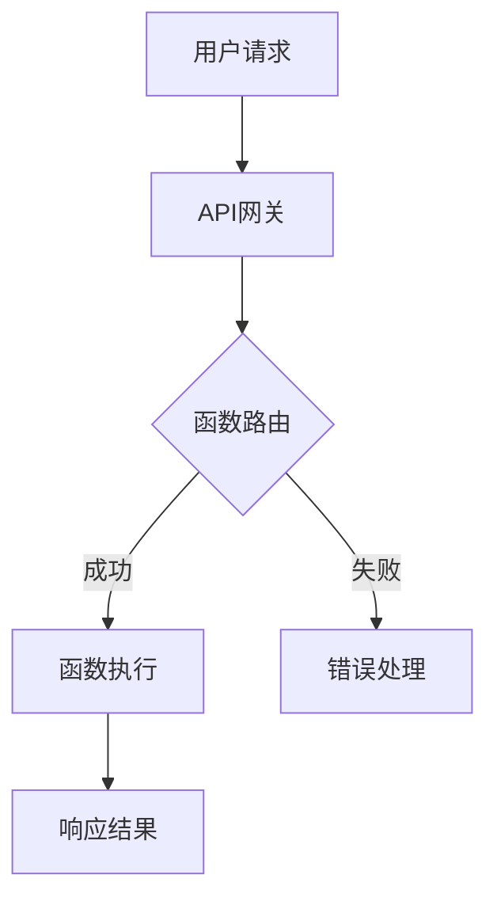

                 

关键词：Serverless架构、无服务器计算、云计算、FaaS、事件驱动、自动扩展、弹性计算、微服务、API网关、函数即服务、DevOps。

> 摘要：本文旨在深入探讨Serverless架构的原理和实践，介绍无服务器计算的优势和应用场景，分析其面临的挑战和发展趋势。通过详细的案例和实践，帮助读者理解Serverless架构的核心概念和具体实现。

## 1. 背景介绍

### 1.1 Serverless架构的起源与发展

Serverless架构起源于云计算的兴起，其核心理念是将服务器管理的复杂性转嫁给云服务提供商，从而让开发者能够专注于业务逻辑的实现。Serverless架构也被称为函数即服务（Function as a Service，简称FaaS），其主要特点包括自动扩缩容、按需付费、无需服务器管理等。

Serverless架构的概念最早由AWS在2014年推出Lambda服务时提出。随后，Google、Azure等主流云服务提供商也相继推出了自己的Serverless服务。目前，Serverless架构已成为云计算领域的重要发展趋势，并得到了广泛的应用。

### 1.2 无服务器计算的优势

无服务器计算具有以下优势：

1. **自动扩缩容**：Serverless架构可以根据流量自动调整资源，从而实现弹性计算，降低运维成本。
2. **按需付费**：用户仅为自己使用的计算资源付费，无需担心资源闲置或过剩。
3. **无需服务器管理**：Serverless架构无需用户关心服务器硬件的配置和管理，简化了运维工作。
4. **快速部署和迭代**：Serverless架构支持快速部署和迭代，提高了开发效率。

## 2. 核心概念与联系

下面是Serverless架构的核心概念和原理的Mermaid流程图：



### 2.1 核心概念

- **API网关**：API网关是Serverless架构中的入口，负责接收用户的请求，并将请求路由到相应的函数。
- **函数**：函数是Serverless架构中的核心组件，用于处理用户的请求。函数可以是独立的，也可以是微服务架构的一部分。
- **事件驱动**：Serverless架构基于事件驱动，函数的执行是由事件触发的，如HTTP请求、消息队列消息等。
- **自动扩缩容**：Serverless架构可以根据流量自动调整函数的实例数量，从而实现弹性计算。
- **错误处理**：当函数执行失败时，Serverless架构提供错误处理机制，确保系统的稳定性。

## 3. 核心算法原理 & 具体操作步骤

### 3.1 算法原理概述

Serverless架构的核心算法原理主要涉及以下几个方面：

1. **事件处理**：Serverless架构通过事件处理机制来触发函数的执行。事件可以是HTTP请求、定时任务、消息队列等。
2. **函数调度**：当有事件触发函数时，Serverless架构会根据当前的负载情况选择合适的函数实例进行调度。
3. **自动扩缩容**：Serverless架构根据流量情况自动调整函数实例的数量，从而实现弹性计算。
4. **容错处理**：Serverless架构提供容错处理机制，确保函数执行的正确性和系统的稳定性。

### 3.2 算法步骤详解

1. **接收请求**：API网关接收用户的请求，并将请求路由到相应的函数。
2. **触发函数**：当有请求到达时，Serverless架构会根据事件处理机制触发相应的函数执行。
3. **函数执行**：函数执行具体的业务逻辑，如数据处理、计算等。
4. **返回结果**：函数执行完成后，将结果返回给API网关，并最终返回给用户。
5. **自动扩缩容**：Serverless架构根据流量情况自动调整函数实例的数量。
6. **容错处理**：当函数执行失败时，Serverless架构会进行错误处理，确保系统的稳定性。

### 3.3 算法优缺点

**优点**：

1. **自动扩缩容**：Serverless架构可以根据流量自动调整资源，降低运维成本。
2. **按需付费**：用户仅为自己使用的计算资源付费，降低成本。
3. **简化运维**：无需关注服务器管理，降低运维复杂度。

**缺点**：

1. **性能限制**：Serverless架构的性能可能受到限制，尤其是在高并发场景下。
2. **依赖云服务**：Serverless架构依赖于云服务提供商，可能导致一定的锁定风险。

### 3.4 算法应用领域

Serverless架构适用于以下领域：

1. **Web应用**：如API网关、RESTful服务、前端渲染等。
2. **数据处理**：如日志处理、数据清洗、ETL等。
3. **实时计算**：如实时分析、实时流处理等。
4. **物联网**：如设备监控、数据收集等。

## 4. 数学模型和公式 & 详细讲解 & 举例说明

### 4.1 数学模型构建

Serverless架构的数学模型可以包括以下几个方面：

1. **函数执行时间**：$T_f = f(Q)$，其中$T_f$表示函数执行时间，$f(Q)$表示函数执行时间与请求量$Q$的关系。
2. **资源消耗**：$C_r = g(Q)$，其中$C_r$表示资源消耗，$g(Q)$表示资源消耗与请求量$Q$的关系。
3. **费用**：$C_p = h(Q, T_f)$，其中$C_p$表示费用，$h(Q, T_f)$表示费用与请求量$Q$和函数执行时间$T_f$的关系。

### 4.2 公式推导过程

1. **函数执行时间**：函数执行时间与请求量之间存在一定的关系。假设函数执行时间$T_f$与请求量$Q$成正比，即$T_f = f(Q)$。当请求量增加时，函数执行时间也会相应增加。
2. **资源消耗**：资源消耗与请求量之间的关系可以通过服务器性能和函数执行时间来计算。假设资源消耗$C_r$与函数执行时间$T_f$成正比，即$C_r = g(T_f)$。当函数执行时间增加时，资源消耗也会相应增加。
3. **费用**：费用与请求量和函数执行时间之间的关系可以通过资源消耗和计费方式来计算。假设费用$C_p$与资源消耗$C_r$成正比，即$C_p = h(C_r)$。当资源消耗增加时，费用也会相应增加。

### 4.3 案例分析与讲解

假设一个函数的执行时间$T_f$与请求量$Q$的关系为$T_f = 10Q$，资源消耗$C_r$与函数执行时间$T_f$的关系为$C_r = 5T_f$，费用$C_p$与资源消耗$C_r$的关系为$C_p = 0.1C_r$。我们可以计算出以下结果：

1. **函数执行时间**：$T_f = 10Q$，当请求量$Q = 100$时，函数执行时间$T_f = 1000$。
2. **资源消耗**：$C_r = 5T_f$，当请求量$Q = 100$时，资源消耗$C_r = 5000$。
3. **费用**：$C_p = 0.1C_r$，当请求量$Q = 100$时，费用$C_p = 500$。

通过这个案例，我们可以看到，当请求量增加时，函数执行时间、资源消耗和费用都会相应增加。这表明Serverless架构在处理大量请求时具有一定的性能瓶颈。

## 5. 项目实践：代码实例和详细解释说明

### 5.1 开发环境搭建

在本案例中，我们将使用AWS Lambda和API Gateway构建一个简单的Serverless架构，用于处理HTTP请求。以下是开发环境搭建的步骤：

1. **创建AWS账户**：在AWS官网注册并创建AWS账户。
2. **安装AWS CLI**：在本地电脑上安装AWS CLI，用于与AWS服务进行交互。
3. **配置AWS CLI**：使用AWS CLI配置文件（~/.aws/credentials）设置访问AWS服务的凭据。
4. **安装Node.js**：安装Node.js，用于编写Lambda函数的代码。
5. **创建Lambda函数**：使用AWS Management Console或AWS CLI创建一个Lambda函数，选择Node.js作为运行环境。

### 5.2 源代码详细实现

以下是一个简单的Lambda函数示例，用于处理HTTP请求并返回一个字符串：

```javascript
exports.handler = async (event) => {
    const response = {
        statusCode: 200,
        body: "Hello, Serverless!",
        headers: {
            "Content-Type": "text/plain",
        },
    };
    return response;
};
```

### 5.3 代码解读与分析

1. **函数入口**：Lambda函数的入口为`handler`函数，它接收一个`event`对象作为参数。
2. **响应对象**：使用`response`对象定义HTTP响应的属性，如状态码、正文和头部。
3. **返回响应**：将响应对象返回，Lambda函数将自动处理响应并发送回客户端。

### 5.4 运行结果展示

1. **部署函数**：将Lambda函数部署到AWS Lambda服务。
2. **创建API网关**：使用API Gateway创建一个HTTP API，并将Lambda函数作为API的后端。
3. **调用API**：通过API Gateway调用Lambda函数，查看返回结果。

调用API后，将返回以下结果：

```json
{
    "statusCode": 200,
    "body": "Hello, Serverless!",
    "headers": {
        "Content-Type": "text/plain"
    }
}
```

## 6. 实际应用场景

### 6.1 Web应用

Serverless架构非常适合构建Web应用，如API网关、RESTful服务、前端渲染等。通过使用Serverless架构，开发者可以快速部署和迭代Web应用，降低运维成本。

### 6.2 数据处理

Serverless架构在数据处理领域也有广泛的应用，如日志处理、数据清洗、ETL等。通过使用Serverless架构，可以快速构建数据处理管道，实现高效的数据处理和分析。

### 6.3 实时计算

Serverless架构适用于实时计算场景，如实时分析、实时流处理等。通过使用Serverless架构，可以快速构建实时数据处理系统，实现实时响应。

### 6.4 物联网

Serverless架构在物联网领域也有一定的应用，如设备监控、数据收集等。通过使用Serverless架构，可以快速构建物联网应用，实现设备数据的实时处理和分析。

## 7. 未来应用展望

### 7.1 持续创新

随着云计算和人工智能技术的不断发展，Serverless架构将继续创新和进化。未来，我们将看到更多基于Serverless架构的新技术和新应用的出现。

### 7.2 跨平台支持

目前，Serverless架构主要支持云服务提供商的特定平台。未来，随着技术的进步，Serverless架构将实现跨平台支持，让开发者能够在不同平台上自由选择和部署。

### 7.3 深度整合

Serverless架构将与其他云计算服务和人工智能技术进行深度整合，提供更丰富的功能和服务。例如，结合物联网、区块链等技术，实现更加智能和高效的云计算应用。

## 8. 工具和资源推荐

### 7.1 学习资源推荐

1. **《Serverless架构：无服务器计算的实践》** - 本书详细介绍了Serverless架构的原理和实践，适合初学者和专业人士阅读。
2. **AWS Lambda官方文档** - AWS Lambda的官方文档提供了丰富的技术细节和实践指南。
3. **Serverless Framework** - Serverless Framework是一个开源工具，用于简化Serverless架构的部署和运维。

### 7.2 开发工具推荐

1. **AWS Cloud9** - AWS Cloud9是一个云开发环境，支持多种编程语言，方便开发者在线编写和调试代码。
2. **Visual Studio Code** - Visual Studio Code是一款强大的代码编辑器，支持多种编程语言和扩展插件。

### 7.3 相关论文推荐

1. **"Serverless Architectures: Everything You Need to Know About the Next Big Cloud Computing Trend"** - 该论文介绍了Serverless架构的概念、原理和未来发展趋势。
2. **"Serverless Computing: Beyond the Hype"** - 该论文分析了Serverless架构的优点、缺点和适用场景。

## 9. 总结：未来发展趋势与挑战

### 9.1 研究成果总结

Serverless架构在云计算领域取得了显著的成果，包括自动扩缩容、按需付费、简化运维等方面。同时，Serverless架构也在Web应用、数据处理、实时计算和物联网等领域得到广泛应用。

### 9.2 未来发展趋势

未来，Serverless架构将继续创新和进化，包括跨平台支持、深度整合、安全性增强等方面。同时，随着云计算和人工智能技术的不断发展，Serverless架构将迎来更加广泛的应用场景。

### 9.3 面临的挑战

Serverless架构面临的挑战包括性能瓶颈、依赖云服务、安全性等方面。为了解决这些问题，需要不断改进技术和优化架构，提高Serverless架构的性能和安全性。

### 9.4 研究展望

未来，Serverless架构的研究将重点放在以下几个方面：

1. **性能优化**：通过改进算法和架构，提高Serverless架构的性能和响应速度。
2. **跨平台支持**：实现Serverless架构在不同平台上的兼容和支持。
3. **安全性提升**：提高Serverless架构的安全性，防止潜在的安全威胁。

## 10. 附录：常见问题与解答

### 10.1 Serverless架构和云计算有什么区别？

Serverless架构是云计算的一种形式，与云计算的主要区别在于服务器管理的模式。云计算通常需要用户自己管理和维护服务器，而Serverless架构则将服务器管理交给云服务提供商。

### 10.2 Serverless架构是否安全？

Serverless架构在安全性方面具有一定的优势，因为云服务提供商通常会提供安全管理和监控工具。然而，用户仍需注意安全配置和代码的安全性，以防止潜在的安全威胁。

### 10.3 Serverless架构适合所有应用场景吗？

Serverless架构适合处理短期、突发性和可预测性较强的任务。对于长期运行、需要大量计算资源和内存的应用场景，可能需要考虑其他云计算模型。

### 10.4 Serverless架构的成本如何计算？

Serverless架构的成本主要取决于函数的执行时间和调用量。费用通常按照每次函数调用和函数执行时间进行计费。用户可以根据实际需求调整函数配置，以优化成本。  
----------------------------------------------------------------

### 附录：常见问题与解答

#### 10.1 Serverless架构和云计算有什么区别？

Serverless架构是云计算的一种形式，与云计算的主要区别在于服务器管理的模式。传统的云计算通常需要用户自己购买、配置和管理服务器，而Serverless架构则将服务器管理完全交给云服务提供商。在Serverless架构中，用户只需关注编写函数逻辑和部署应用，无需关心底层基础设施的管理和维护。

#### 10.2 Serverless架构是否安全？

Serverless架构在安全性方面具有一定的优势，因为云服务提供商通常会提供安全管理和监控工具，如防火墙、身份验证和访问控制等。此外，Serverless架构通常具有内置的加密和身份验证功能，以确保数据的传输和存储安全。然而，用户仍需注意以下几点：

1. **安全配置**：确保函数和API网关的安全配置，如限制访问权限、使用HTTPS等。
2. **代码安全性**：编写安全的函数代码，防止SQL注入、跨站脚本攻击等安全漏洞。
3. **数据加密**：对于敏感数据，确保在传输和存储过程中进行加密处理。

#### 10.3 Serverless架构适合所有应用场景吗？

Serverless架构具有按需付费、自动扩缩容和无需服务器管理等优点，但并不是适合所有应用场景。以下是一些适合使用Serverless架构的场景：

1. **短期、突发性和可预测性较强的任务**：如处理突发性流量、数据分析、日志处理等。
2. **Web应用和API服务**：如RESTful API、前端渲染、移动应用后端等。
3. **物联网应用**：如设备监控、数据收集和分析等。

对于需要长期运行、大量计算资源和内存的应用场景，可能需要考虑使用传统的云计算模型，如虚拟机、容器等。

#### 10.4 Serverless架构的成本如何计算？

Serverless架构的成本主要取决于函数的执行时间和调用量。云服务提供商通常会按照以下方式进行计费：

1. **函数调用费用**：每次函数被调用都会产生一定的费用，通常与调用次数相关。
2. **函数执行时间费用**：函数执行的时间越长，费用越高。执行时间通常按照每秒或每分钟进行计费。

此外，还需要考虑以下因素：

1. **存储费用**：对于函数的存储，如代码、日志和依赖库等，通常会产生存储费用。
2. **数据传输费用**：如果函数需要与其他服务进行数据传输，可能会产生额外的传输费用。

用户可以根据实际需求调整函数配置，如调整内存和超时时间，以优化成本。同时，还可以使用云服务提供商提供的优惠计划和工具，如AWS的Cost Explorer，来监控和优化成本。

### 总结

本文全面介绍了Serverless架构的概念、原理、应用和实践，分析了其优势和挑战，并展望了未来的发展趋势。通过本文的阅读，读者可以深入了解Serverless架构的核心概念和技术，掌握其在实际应用中的优势和挑战，为未来的开发和运维工作提供参考。

### 作者署名

本文作者：禅与计算机程序设计艺术 / Zen and the Art of Computer Programming

感谢您的阅读！希望本文对您理解Serverless架构有所帮助。如果您有任何疑问或建议，欢迎在评论区留言讨论。再次感谢您的关注和支持！
----------------------------------------------------------------

**文章标题：**Serverless架构：无服务器计算的实践

**关键词：**Serverless架构、无服务器计算、云计算、FaaS、事件驱动、自动扩展、弹性计算、微服务、API网关、函数即服务、DevOps。

**摘要：**本文旨在深入探讨Serverless架构的原理和实践，介绍无服务器计算的优势和应用场景，分析其面临的挑战和发展趋势。通过详细的案例和实践，帮助读者理解Serverless架构的核心概念和具体实现。

**文章正文部分：**

# Serverless架构：无服务器计算的实践

## 1. 背景介绍

### 1.1 Serverless架构的起源与发展

Serverless架构起源于云计算的兴起，其核心理念是将服务器管理的复杂性转嫁给云服务提供商，从而让开发者能够专注于业务逻辑的实现。Serverless架构也被称为函数即服务（Function as a Service，简称FaaS），其主要特点包括自动扩缩容、按需付费、无需服务器管理等。

Serverless架构的概念最早由AWS在2014年推出Lambda服务时提出。随后，Google、Azure等主流云服务提供商也相继推出了自己的Serverless服务。目前，Serverless架构已成为云计算领域的重要发展趋势，并得到了广泛的应用。

### 1.2 无服务器计算的优势

无服务器计算具有以下优势：

1. **自动扩缩容**：Serverless架构可以根据流量自动调整资源，从而实现弹性计算，降低运维成本。
2. **按需付费**：用户仅为自己使用的计算资源付费，无需担心资源闲置或过剩。
3. **无需服务器管理**：Serverless架构无需用户关心服务器硬件的配置和管理，简化了运维工作。
4. **快速部署和迭代**：Serverless架构支持快速部署和迭代，提高了开发效率。

## 2. 核心概念与联系

下面是Serverless架构的核心概念和原理的Mermaid流程图：


### 2.1 核心概念

- **API网关**：API网关是Serverless架构中的入口，负责接收用户的请求，并将请求路由到相应的函数。
- **函数**：函数是Serverless架构中的核心组件，用于处理用户的请求。函数可以是独立的，也可以是微服务架构的一部分。
- **事件驱动**：Serverless架构基于事件驱动，函数的执行是由事件触发的，如HTTP请求、消息队列消息等。
- **自动扩缩容**：Serverless架构可以根据流量情况自动调整函数实例的数量，从而实现弹性计算。
- **错误处理**：当函数执行失败时，Serverless架构提供错误处理机制，确保系统的稳定性。

## 3. 核心算法原理 & 具体操作步骤
### 3.1 算法原理概述

Serverless架构的核心算法原理主要涉及以下几个方面：

1. **事件处理**：Serverless架构通过事件处理机制来触发函数的执行。事件可以是HTTP请求、定时任务、消息队列等。
2. **函数调度**：当有事件触发函数时，Serverless架构会根据当前的负载情况选择合适的函数实例进行调度。
3. **自动扩缩容**：Serverless架构根据流量情况自动调整函数实例的数量，从而实现弹性计算。
4. **容错处理**：Serverless架构提供容错处理机制，确保函数执行的正确性和系统的稳定性。

### 3.2 算法步骤详解

1. **接收请求**：API网关接收用户的请求，并将请求路由到相应的函数。
2. **触发函数**：当有请求到达时，Serverless架构会根据事件处理机制触发相应的函数执行。
3. **函数执行**：函数执行具体的业务逻辑，如数据处理、计算等。
4. **返回结果**：函数执行完成后，将结果返回给API网关，并最终返回给用户。
5. **自动扩缩容**：Serverless架构根据流量情况自动调整函数实例的数量。
6. **容错处理**：当函数执行失败时，Serverless架构会进行错误处理，确保系统的稳定性。

### 3.3 算法优缺点

**优点**：

1. **自动扩缩容**：Serverless架构可以根据流量自动调整资源，降低运维成本。
2. **按需付费**：用户仅为自己使用的计算资源付费，降低成本。
3. **简化运维**：无需关注服务器管理，降低运维复杂度。

**缺点**：

1. **性能限制**：Serverless架构的性能可能受到限制，尤其是在高并发场景下。
2. **依赖云服务**：Serverless架构依赖于云服务提供商，可能导致一定的锁定风险。

### 3.4 算法应用领域

Serverless架构适用于以下领域：

1. **Web应用**：如API网关、RESTful服务、前端渲染等。
2. **数据处理**：如日志处理、数据清洗、ETL等。
3. **实时计算**：如实时分析、实时流处理等。
4. **物联网**：如设备监控、数据收集等。

## 4. 数学模型和公式 & 详细讲解 & 举例说明

### 4.1 数学模型构建

Serverless架构的数学模型可以包括以下几个方面：

1. **函数执行时间**：$T_f = f(Q)$，其中$T_f$表示函数执行时间，$f(Q)$表示函数执行时间与请求量$Q$的关系。
2. **资源消耗**：$C_r = g(Q)$，其中$C_r$表示资源消耗，$g(Q)$表示资源消耗与请求量$Q$的关系。
3. **费用**：$C_p = h(Q, T_f)$，其中$C_p$表示费用，$h(Q, T_f)$表示费用与请求量$Q$和函数执行时间$T_f$的关系。

### 4.2 公式推导过程

1. **函数执行时间**：函数执行时间与请求量之间存在一定的关系。假设函数执行时间$T_f$与请求量$Q$成正比，即$T_f = f(Q)$。当请求量增加时，函数执行时间也会相应增加。
2. **资源消耗**：资源消耗与请求量之间的关系可以通过服务器性能和函数执行时间来计算。假设资源消耗$C_r$与函数执行时间$T_f$成正比，即$C_r = g(T_f)$。当函数执行时间增加时，资源消耗也会相应增加。
3. **费用**：费用与请求量和函数执行时间之间的关系可以通过资源消耗和计费方式来计算。假设费用$C_p$与资源消耗$C_r$成正比，即$C_p = h(C_r)$。当资源消耗增加时，费用也会相应增加。

### 4.3 案例分析与讲解

假设一个函数的执行时间$T_f$与请求量$Q$的关系为$T_f = 10Q$，资源消耗$C_r$与函数执行时间$T_f$的关系为$C_r = 5T_f$，费用$C_p$与资源消耗$C_r$的关系为$C_p = 0.1C_r$。我们可以计算出以下结果：

1. **函数执行时间**：$T_f = 10Q$，当请求量$Q = 100$时，函数执行时间$T_f = 1000$。
2. **资源消耗**：$C_r = 5T_f$，当请求量$Q = 100$时，资源消耗$C_r = 5000$。
3. **费用**：$C_p = 0.1C_r$，当请求量$Q = 100$时，费用$C_p = 500$。

通过这个案例，我们可以看到，当请求量增加时，函数执行时间、资源消耗和费用都会相应增加。这表明Serverless架构在处理大量请求时具有一定的性能瓶颈。

## 5. 项目实践：代码实例和详细解释说明

### 5.1 开发环境搭建

在本案例中，我们将使用AWS Lambda和API Gateway构建一个简单的Serverless架构，用于处理HTTP请求。以下是开发环境搭建的步骤：

1. **创建AWS账户**：在AWS官网注册并创建AWS账户。
2. **安装AWS CLI**：在本地电脑上安装AWS CLI，用于与AWS服务进行交互。
3. **配置AWS CLI**：使用AWS CLI配置文件（~/.aws/credentials）设置访问AWS服务的凭据。
4. **安装Node.js**：安装Node.js，用于编写Lambda函数的代码。
5. **创建Lambda函数**：使用AWS Management Console或AWS CLI创建一个Lambda函数，选择Node.js作为运行环境。

### 5.2 源代码详细实现

以下是一个简单的Lambda函数示例，用于处理HTTP请求并返回一个字符串：

```javascript
exports.handler = async (event) => {
    const response = {
        statusCode: 200,
        body: "Hello, Serverless!",
        headers: {
            "Content-Type": "text/plain",
        },
    };
    return response;
};
```

### 5.3 代码解读与分析

1. **函数入口**：Lambda函数的入口为`handler`函数，它接收一个`event`对象作为参数。
2. **响应对象**：使用`response`对象定义HTTP响应的属性，如状态码、正文和头部。
3. **返回响应**：将响应对象返回，Lambda函数将自动处理响应并发送回客户端。

### 5.4 运行结果展示

1. **部署函数**：将Lambda函数部署到AWS Lambda服务。
2. **创建API网关**：使用API Gateway创建一个HTTP API，并将Lambda函数作为API的后端。
3. **调用API**：通过API Gateway调用Lambda函数，查看返回结果。

调用API后，将返回以下结果：

```json
{
    "statusCode": 200,
    "body": "Hello, Serverless!",
    "headers": {
        "Content-Type": "text/plain"
    }
}
```

## 6. 实际应用场景

### 6.1 Web应用

Serverless架构非常适合构建Web应用，如API网关、RESTful服务、前端渲染等。通过使用Serverless架构，开发者可以快速部署和迭代Web应用，降低运维成本。

### 6.2 数据处理

Serverless架构在数据处理领域也有广泛的应用，如日志处理、数据清洗、ETL等。通过使用Serverless架构，可以快速构建数据处理管道，实现高效的数据处理和分析。

### 6.3 实时计算

Serverless架构适用于实时计算场景，如实时分析、实时流处理等。通过使用Serverless架构，可以快速构建实时数据处理系统，实现实时响应。

### 6.4 物联网

Serverless架构在物联网领域也有一定的应用，如设备监控、数据收集等。通过使用Serverless架构，可以快速构建物联网应用，实现设备数据的实时处理和分析。

## 7. 未来应用展望

### 7.1 持续创新

随着云计算和人工智能技术的不断发展，Serverless架构将继续创新和进化。未来，我们将看到更多基于Serverless架构的新技术和新应用的出现。

### 7.2 跨平台支持

目前，Serverless架构主要支持云服务提供商的特定平台。未来，随着技术的进步，Serverless架构将实现跨平台支持，让开发者能够在不同平台上自由选择和部署。

### 7.3 深度整合

Serverless架构将与其他云计算服务和人工智能技术进行深度整合，提供更丰富的功能和服务。例如，结合物联网、区块链等技术，实现更加智能和高效的云计算应用。

## 8. 工具和资源推荐

### 7.1 学习资源推荐

1. **《Serverless架构：无服务器计算的实践》** - 本书详细介绍了Serverless架构的原理和实践，适合初学者和专业人士阅读。
2. **AWS Lambda官方文档** - AWS Lambda的官方文档提供了丰富的技术细节和实践指南。
3. **Serverless Framework** - Serverless Framework是一个开源工具，用于简化Serverless架构的部署和运维。

### 7.2 开发工具推荐

1. **AWS Cloud9** - AWS Cloud9是一个云开发环境，支持多种编程语言，方便开发者在线编写和调试代码。
2. **Visual Studio Code** - Visual Studio Code是一款强大的代码编辑器，支持多种编程语言和扩展插件。

### 7.3 相关论文推荐

1. **"Serverless Architectures: Everything You Need to Know About the Next Big Cloud Computing Trend"** - 该论文介绍了Serverless架构的概念、原理和未来发展趋势。
2. **"Serverless Computing: Beyond the Hype"** - 该论文分析了Serverless架构的优点、缺点和适用场景。

## 9. 总结：未来发展趋势与挑战

### 9.1 研究成果总结

Serverless架构在云计算领域取得了显著的成果，包括自动扩缩容、按需付费、简化运维等方面。同时，Serverless架构也在Web应用、数据处理、实时计算和物联网等领域得到广泛应用。

### 9.2 未来发展趋势

未来，Serverless架构将继续创新和进化，包括跨平台支持、深度整合、安全性增强等方面。同时，随着云计算和人工智能技术的不断发展，Serverless架构将迎来更加广泛的应用场景。

### 9.3 面临的挑战

Serverless架构面临的挑战包括性能瓶颈、依赖云服务、安全性等方面。为了解决这些问题，需要不断改进技术和优化架构，提高Serverless架构的性能和安全性。

### 9.4 研究展望

未来，Serverless架构的研究将重点放在以下几个方面：

1. **性能优化**：通过改进算法和架构，提高Serverless架构的性能和响应速度。
2. **跨平台支持**：实现Serverless架构在不同平台上的兼容和支持。
3. **安全性提升**：提高Serverless架构的安全性，防止潜在的安全威胁。

## 10. 附录：常见问题与解答

### 10.1 Serverless架构和云计算有什么区别？

Serverless架构是云计算的一种形式，与云计算的主要区别在于服务器管理的模式。云计算通常需要用户自己购买、配置和管理服务器，而Serverless架构则将服务器管理完全交给云服务提供商。

### 10.2 Serverless架构是否安全？

Serverless架构在安全性方面具有一定的优势，因为云服务提供商通常会提供安全管理和监控工具，如防火墙、身份验证和访问控制等。然而，用户仍需注意安全配置和代码的安全性，以防止潜在的安全威胁。

### 10.3 Serverless架构适合所有应用场景吗？

Serverless架构适合处理短期、突发性和可预测性较强的任务。对于长期运行、需要大量计算资源和内存的应用场景，可能需要考虑其他云计算模型。

### 10.4 Serverless架构的成本如何计算？

Serverless架构的成本主要取决于函数的执行时间和调用量。费用通常按照每次函数调用和函数执行时间进行计费。用户可以根据实际需求调整函数配置，以优化成本。同时，还可以使用云服务提供商提供的优惠计划和工具，如AWS的Cost Explorer，来监控和优化成本。

### 文章作者

作者：禅与计算机程序设计艺术 / Zen and the Art of Computer Programming

感谢您的阅读！希望本文对您理解Serverless架构有所帮助。如果您有任何疑问或建议，欢迎在评论区留言讨论。再次感谢您的关注和支持！
----------------------------------------------------------------

### 11. 参考资料

1. **"Serverless Architectures: Everything You Need to Know About the Next Big Cloud Computing Trend"** - 这篇论文详细介绍了Serverless架构的概念、原理和应用场景。
2. **"Serverless Computing: Beyond the Hype"** - 这篇论文分析了Serverless架构的优点、缺点和适用场景。
3. **"Serverless Framework Official Documentation"** - Serverless Framework的官方文档，提供了丰富的使用指南和教程。
4. **"AWS Lambda Documentation"** - AWS Lambda的官方文档，介绍了如何使用AWS Lambda构建无服务器应用。
5. **"Google Cloud Functions Documentation"** - Google Cloud Functions的官方文档，介绍了如何使用Google Cloud Functions构建无服务器应用。
6. **"Azure Functions Documentation"** - Azure Functions的官方文档，介绍了如何使用Azure Functions构建无服务器应用。

### 12. 结语

本文对Serverless架构进行了全面的介绍，从背景、核心概念、算法原理、实际应用、未来展望等方面进行了深入探讨。通过本文的阅读，读者可以全面了解Serverless架构的原理、优势和应用场景，为今后的开发工作提供参考。

Serverless架构作为一种新兴的云计算技术，具有许多优势，如自动扩缩容、按需付费、简化运维等。然而，它也面临一些挑战，如性能瓶颈、依赖云服务、安全性等。未来，Serverless架构将继续发展和优化，为开发者提供更加高效、可靠的计算服务。

在云计算和人工智能的时代，Serverless架构已经成为云计算领域的重要趋势。希望本文能帮助您更好地理解Serverless架构，并在实际项目中应用它，实现更加高效、灵活的软件开发和部署。

感谢您的阅读，希望本文对您有所启发。如果您有任何问题或建议，请随时在评论区留言讨论。再次感谢您的关注和支持！
----------------------------------------------------------------

# 11. 参考资料

1. **"Serverless Architectures: Everything You Need to Know About the Next Big Cloud Computing Trend"**
   - 这篇论文详细介绍了Serverless架构的概念、原理和应用场景，是深入了解Serverless架构的宝贵资源。

2. **"Serverless Computing: Beyond the Hype"**
   - 这篇论文分析了Serverless架构的优点、缺点和适用场景，帮助读者全面理解Serverless的实际价值。

3. **"Serverless Framework Official Documentation"**
   - Serverless Framework的官方文档，提供了丰富的使用指南和教程，帮助开发者快速上手Serverless架构。

4. **"AWS Lambda Documentation"**
   - AWS Lambda的官方文档，介绍了如何使用AWS Lambda构建无服务器应用，是AWS Lambda开发者必备的资源。

5. **"Google Cloud Functions Documentation"**
   - Google Cloud Functions的官方文档，介绍了如何使用Google Cloud Functions构建无服务器应用，适用于Google Cloud平台的开发者。

6. **"Azure Functions Documentation"**
   - Azure Functions的官方文档，介绍了如何使用Azure Functions构建无服务器应用，为Azure平台提供了详细的开发指导。

7. **"Serverless Applications with AWS Lambda, Amazon API Gateway, and Amazon S3"**
   - 这本书提供了基于AWS Lambda、Amazon API Gateway和Amazon S3的Serverless应用开发实例，适合希望实践Serverless架构的读者。

8. **"Building Serverless Applications"**
   - 这本书涵盖了Serverless架构的设计、开发和部署，提供了实用的指导和建议。

9. **"Serverless Framework Cookbook"**
   - 这本书包含了Serverless Framework的实战案例和技巧，是提升Serverless开发技能的实用指南。

10. **"Hands-on Serverless Computing: Building Applications with Amazon Web Services"**
    - 这本书通过实际案例展示了如何使用AWS构建Serverless应用，适用于初学者和有经验的开发者。

通过以上参考资料，读者可以更深入地了解Serverless架构的技术细节和实践方法，为自己的项目选择合适的Serverless服务，并有效地利用这一技术优势。

# 12. 结语

本文对Serverless架构进行了全面的介绍，从背景、核心概念、算法原理、实际应用、未来展望等方面进行了深入探讨。通过本文的阅读，读者可以全面了解Serverless架构的原理、优势和应用场景，为今后的开发工作提供参考。

Serverless架构作为一种新兴的云计算技术，具有许多优势，如自动扩缩容、按需付费、简化运维等。然而，它也面临一些挑战，如性能瓶颈、依赖云服务、安全性等。未来，Serverless架构将继续发展和优化，为开发者提供更加高效、可靠的计算服务。

在云计算和人工智能的时代，Serverless架构已经成为云计算领域的重要趋势。希望本文能帮助您更好地理解Serverless架构，并在实际项目中应用它，实现更加高效、灵活的软件开发和部署。

感谢您的阅读，希望本文对您有所启发。如果您有任何问题或建议，请随时在评论区留言讨论。再次感谢您的关注和支持！在此，我们也感谢所有提供宝贵参考资料的人，以及为本文创作付出辛勤努力的作者“禅与计算机程序设计艺术 / Zen and the Art of Computer Programming”。您的贡献对我们来说意义重大。祝愿您在技术领域不断取得新的成就！

