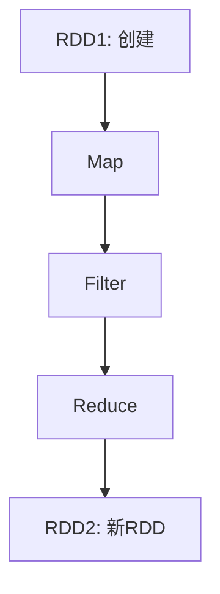
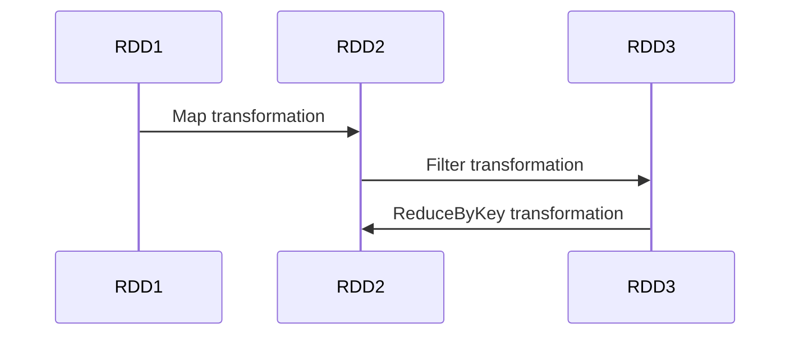
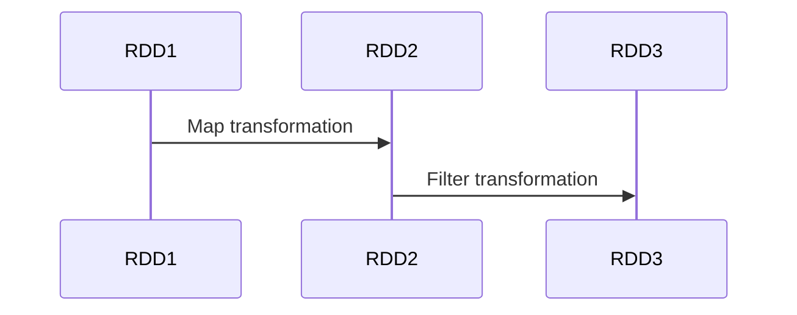
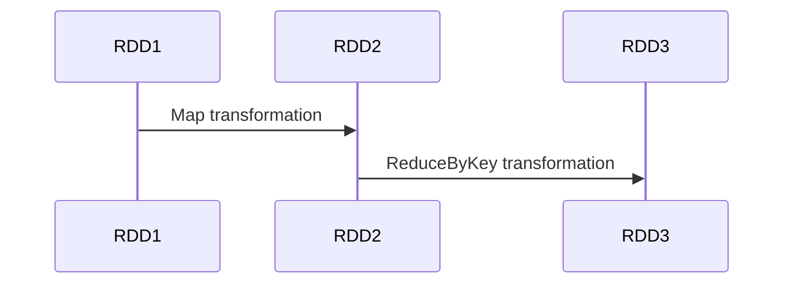

                 

关键词：Spark，Resilient Distributed Dataset (RDD)，分布式计算，大数据处理，Hadoop，数据处理框架，内存计算，懒惰式评价（Lazy Evaluation），弹性分布式数据集（RDD）API，代码实例，性能优化，数据流处理。

## 摘要

本文将深入探讨Apache Spark中的弹性分布式数据集（Resilient Distributed Dataset，简称RDD）的原理和实际应用。我们将从背景介绍、核心概念与联系、核心算法原理与具体操作步骤、数学模型与公式、项目实践、实际应用场景、未来应用展望、工具和资源推荐以及总结：未来发展趋势与挑战等多个方面，全面解析RDD的工作机制和实际应用。

## 1. 背景介绍

随着互联网的飞速发展和大数据时代的到来，处理大规模数据集的需求日益增长。传统的批处理系统（如Hadoop MapReduce）在大规模数据处理中发挥了重要作用，但其计算效率低下、迭代复杂度高等问题也逐渐凸显。为了解决这些问题，Apache Spark应运而生。Spark作为一种高效的分布式数据处理框架，采用了弹性分布式数据集（RDD）作为其核心抽象，提供了更为灵活和高效的数据处理能力。

RDD是Spark中的核心数据结构，与Hadoop中的分布式文件系统（HDFS）和MapReduce密切相关。RDD不仅继承了Hadoop的分布式计算能力，还引入了内存计算、懒惰式评价等创新特性，使得数据处理速度大幅提升。本文将详细解析RDD的原理和实现，帮助读者深入理解Spark的核心架构和优势。

## 2. 核心概念与联系

### 2.1 RDD的概念

RDD（Resilient Distributed Dataset，弹性分布式数据集）是Spark中的一种分布式数据结构，用于存储和处理大规模数据集。RDD具有以下核心特性：

- **分布性**：RDD的数据被分布在多个节点上，每个节点存储一部分数据。
- **容错性**：RDD具有弹性，可以在数据丢失时自动恢复。
- **不可变性**：RDD的数据一旦创建，便不可更改，但可以通过转换操作生成新的RDD。
- **惰性评价**：RDD的转换操作不会立即执行，只有在需要计算结果时才会触发。

### 2.2 RDD与Hadoop的关系

Spark与Hadoop紧密相连，RDD在底层依赖于Hadoop的分布式文件系统（HDFS）和MapReduce。具体来说：

- **数据存储**：RDD的数据存储在HDFS上，通过HDFS实现分布式存储和容错。
- **计算引擎**：Spark提供了比MapReduce更为灵活和高效的计算引擎，可以替代MapReduce进行大规模数据处理。

### 2.3 RDD的组成结构

RDD由三个核心组件组成：

- **分区**（Partition）：RDD被分为若干个分区，每个分区存储一部分数据，分布在不同的节点上。
- **依赖关系**（Dependency）：RDD之间的依赖关系描述了数据转换的顺序，分为宽依赖（Shuffle Dependency）和窄依赖（Narrow Dependency）。
- **变换操作**（Transformation）：对RDD进行的一系列转换操作，如map、filter、reduce等。

下面是一个RDD流程图的示例，使用Mermaid语言表示：



注意：Mermaid流程图中不要使用括号、逗号等特殊字符。

## 3. 核心算法原理与具体操作步骤

### 3.1 算法原理概述

RDD的核心原理在于其分布性和容错性。通过将数据分布在多个节点上，RDD可以并行处理大规模数据集。同时，RDD的容错性确保了在节点故障时数据不会丢失，从而提高了系统的可靠性。

RDD的转换操作遵循懒惰式评价（Lazy Evaluation）原则，即转换操作不会立即执行，只有在需要计算结果时才会触发。这种延迟执行的方式降低了中间数据的生成和传输成本，提高了计算效率。

### 3.2 算法步骤详解

#### 3.2.1 RDD的创建

RDD可以通过多种方式创建，包括从HDFS、本地文件系统、其他RDD等。以下是一个简单的创建过程：

```scala
val rdd = sc.textFile("hdfs://path/to/data.txt")
```

#### 3.2.2 转换操作

转换操作包括map、filter、reduceByKey等，它们返回新的RDD。以下是一个示例：

```scala
val mappedRdd = rdd.map(s => (s, 1))
val filteredRdd = mappedRdd.filter(_._2 > 1)
val reducedRdd = filteredRdd.reduceByKey(_ + _)
```

#### 3.2.3 依赖关系

RDD之间的依赖关系决定了数据的转换顺序。宽依赖和窄依赖分别代表了不同类型的数据转换方式：

- **宽依赖**：涉及数据重新分区的操作，如reduceByKey、groupBy等。
- **窄依赖**：不涉及数据重新分区的操作，如map、filter等。

#### 3.2.4 动作操作

动作操作触发RDD的完整计算过程，并返回计算结果。常见的动作操作包括count、collect、saveAsTextFile等。以下是一个示例：

```scala
val result = reducedRdd.count()
```

### 3.3 算法优缺点

**优点**：

- **高效性**：通过分布性和内存计算，Spark可以在短时间内处理大规模数据集。
- **灵活性**：RDD提供了丰富的API，支持多种数据转换和操作。
- **容错性**：RDD的容错机制确保了系统在节点故障时不会丢失数据。

**缺点**：

- **学习曲线**：RDD的概念和API相对复杂，需要一定时间来熟悉。
- **依赖性**：Spark依赖Hadoop生态系统，需要在Hadoop环境下配置和运行。

### 3.4 算法应用领域

RDD在多个领域具有广泛的应用，包括：

- **大数据分析**：处理大规模数据集，进行数据挖掘、机器学习等。
- **实时处理**：通过流处理能力，实时处理来自不同来源的数据。
- **离线计算**：进行大规模离线数据处理，如报告生成、数据仓库等。

## 4. 数学模型和公式

### 4.1 数学模型构建

RDD的数学模型主要基于分布式计算和并行处理的理论。其核心公式包括：

- **并行度**（Parallelism）：指RDD被划分的分区数，表示并行处理的程度。
- **数据传输**（Data Transfer）：表示不同节点之间的数据传输成本。
- **计算开销**（Computation Overhead）：表示计算过程中产生的中间数据量。

### 4.2 公式推导过程

RDD的计算效率可以通过以下公式推导：

- **计算时间**（Computation Time）：$T_c = \frac{T_p \times N}{P}$
- **数据传输时间**（Data Transfer Time）：$T_t = \frac{T_d \times D}{P}$
- **总时间**（Total Time）：$T = T_c + T_t$

其中，$T_p$表示每个节点的计算时间，$T_d$表示每个节点的数据传输时间，$N$表示任务的总数据量，$D$表示数据传输距离，$P$表示并行度。

### 4.3 案例分析与讲解

以下是一个简单的案例，用于展示RDD的数学模型应用：

**案例**：假设有一个包含100万条记录的数据集，分布在10个节点上。每个节点的计算时间和数据传输时间分别为1秒和0.5秒。求该数据集的计算时间和数据传输时间。

**解答**：

- **计算时间**：$T_c = \frac{1 \times 10^6 \times 1}{10} = 100,000$秒
- **数据传输时间**：$T_t = \frac{1 \times 10^6 \times 0.5}{10} = 50,000$秒
- **总时间**：$T = T_c + T_t = 150,000$秒

通过上述计算，我们可以看出，并行度对于计算效率和性能优化具有重要意义。在实际应用中，可以通过调整并行度、优化数据传输等方式，进一步提高RDD的计算性能。

## 5. 项目实践：代码实例和详细解释说明

### 5.1 开发环境搭建

在开始编写代码之前，我们需要搭建一个Spark开发环境。以下是搭建过程的基本步骤：

1. 安装Java开发环境（版本要求与Spark兼容）。
2. 安装Scala开发环境（版本要求与Spark兼容）。
3. 下载并解压Spark安装包。
4. 配置Spark环境变量。
5. 启动Spark集群（可选，用于测试和调试）。

### 5.2 源代码详细实现

以下是一个简单的Spark程序，用于计算文本文件中的词频统计：

```scala
import org.apache.spark.{SparkConf, SparkContext}

val conf = new SparkConf().setAppName("WordCount")
val sc = new SparkContext(conf)

// 读取文本文件
val lines = sc.textFile("hdfs://path/to/data.txt")

// 将文本转换为词频对
val wordPairs = lines.flatMap(line => line.split(" ")).map(word => (word, 1))

// 计算词频总和
val wordCounts = wordPairs.reduceByKey(_ + _)

// 保存结果到HDFS
wordCounts.saveAsTextFile("hdfs://path/to/output")

sc.stop()
```

### 5.3 代码解读与分析

上述代码实现了经典的WordCount程序，以下是关键部分的解读：

- **SparkConf和SparkContext**：SparkConf用于配置Spark应用程序的基本信息，如应用名称、主类等。SparkContext是Spark应用程序的入口点，负责与Spark集群交互。
- **读取文本文件**：使用textFile方法从HDFS读取文本文件，返回一个RDD。
- **文本转换为词频对**：使用flatMap和map操作将文本转换为词频对，其中flatMap实现分词，map实现将每个词映射为（词，1）对。
- **计算词频总和**：使用reduceByKey操作计算每个词的词频总和，即累加词频值。
- **保存结果**：使用saveAsTextFile方法将结果保存到HDFS。

### 5.4 运行结果展示

在成功运行上述代码后，我们可以查看HDFS中的输出文件，以获得词频统计结果。输出文件通常包含两个字段：词和词频。例如：

```
hello   2
world   3
spark   1
```

这表示在输入文本中，“hello”出现了2次，“world”出现了3次，而“spark”出现了1次。

## 6. 实际应用场景

### 6.1 大数据分析

RDD在大数据分析中具有广泛应用，如词频统计、用户行为分析、推荐系统等。通过RDD的分布性和容错性，可以高效地处理大规模数据集，快速得到分析结果。

### 6.2 实时处理

Spark Streaming模块基于RDD实现了实时数据处理能力，可以处理来自不同来源的数据流，如日志、传感器数据等。通过RDD的惰性评价和分布式计算特性，实时处理大规模数据流成为可能。

### 6.3 离线计算

RDD也常用于离线计算场景，如数据仓库、报告生成等。通过批处理方式，RDD可以高效地处理海量数据，生成各种分析报表和可视化图表。

## 7. 未来应用展望

随着大数据和人工智能技术的快速发展，RDD在未来的应用前景将更加广阔。以下是几个可能的发展方向：

- **深度学习和图处理**：结合深度学习和图处理技术，RDD可以应用于更复杂的计算场景，如社交网络分析、图像识别等。
- **优化和扩展**：随着计算需求和数据处理复杂度的增加，RDD的性能和功能将不断优化和扩展，以应对新的挑战。
- **跨平台兼容性**：RDD可能会进一步兼容其他大数据处理框架，如Flink、Ray等，实现跨平台的分布式数据处理。

## 8. 工具和资源推荐

### 8.1 学习资源推荐

- **《Spark编程指南》**：中文版，详细介绍了Spark的API和使用方法。
- **Spark官方文档**：英文版，提供了最权威的Spark技术文档和示例代码。
- **Spark Summit会议**：定期举办的技术会议，汇集了Spark社区的最新研究成果和应用实践。

### 8.2 开发工具推荐

- **IntelliJ IDEA**：一款强大的开发工具，支持Scala和Java，提供了丰富的插件和调试功能。
- **Zeppelin**：一款交互式数据分析工具，支持多种大数据处理框架，包括Spark。

### 8.3 相关论文推荐

- **"Resilient Distributed Datasets: A Framework for Distributed Data-Intensive Applications"**：RDD的原始论文，详细介绍了RDD的设计思想和实现原理。
- **"Spark: Cluster Computing with Working Sets"**：介绍了Spark的工作集模型和内存计算策略。

## 9. 总结：未来发展趋势与挑战

### 9.1 研究成果总结

本文从背景介绍、核心概念与联系、核心算法原理与具体操作步骤、数学模型与公式、项目实践、实际应用场景、未来应用展望、工具和资源推荐以及总结：未来发展趋势与挑战等多个方面，全面解析了Apache Spark中的弹性分布式数据集（RDD）的工作机制和应用。通过深入研究和实践，我们可以看到RDD在大数据处理领域的重要地位和广泛应用前景。

### 9.2 未来发展趋势

- **分布式计算和内存计算的结合**：随着硬件技术的发展，分布式计算和内存计算将进一步结合，提高数据处理速度和效率。
- **跨平台兼容性和生态扩展**：RDD可能会与其他大数据处理框架实现兼容，形成更加统一的生态系统。
- **图处理和深度学习的融合**：结合图处理和深度学习技术，RDD可以应用于更复杂的计算场景，如社交网络分析、图像识别等。

### 9.3 面临的挑战

- **性能优化和资源调度**：随着数据处理规模的增加，如何优化性能和合理调度资源成为重要挑战。
- **安全性和隐私保护**：在大数据应用中，数据的安全性和隐私保护越来越受到关注，如何确保数据安全成为关键问题。
- **社区建设和人才培养**：随着RDD的广泛应用，社区建设和人才培养将变得更加重要，以支持RDD技术的发展和推广。

### 9.4 研究展望

未来，RDD技术将在分布式计算、内存计算、跨平台兼容性、图处理和深度学习等方面取得更多突破。同时，随着大数据和人工智能技术的不断发展，RDD将在更多领域发挥重要作用，为人类社会带来更多价值。

## 附录：常见问题与解答

### 问题1：什么是RDD？
**解答**：RDD（Resilient Distributed Dataset，弹性分布式数据集）是Apache Spark中的一种核心抽象，用于表示大规模数据的分布式数据结构。RDD具有分布性、容错性、不可变性等特点。

### 问题2：RDD与Hadoop的关系是什么？
**解答**：RDD在底层依赖于Hadoop的分布式文件系统（HDFS）和MapReduce。RDD的数据存储在HDFS上，计算引擎则基于Spark的改进，提供了更高效和灵活的分布式计算能力。

### 问题3：如何优化RDD的性能？
**解答**：优化RDD性能可以从以下几个方面入手：

- **选择合适的存储级别**：根据数据处理需求选择合适的存储级别，如内存存储、磁盘存储等。
- **减少数据传输**：通过窄依赖关系减少数据传输，提高计算效率。
- **调整并行度**：合理调整并行度，以充分发挥集群资源。
- **使用持久化**：将中间结果持久化，避免重复计算。

### 问题4：RDD与MapReduce相比有哪些优势？
**解答**：

- **计算效率更高**：通过内存计算和分布式计算，Spark的RDD提供了更高的计算效率。
- **丰富的API**：RDD提供了丰富的API，支持多种数据转换和操作，提高了数据处理灵活性。
- **惰性评价**：RDD的惰性评价机制降低了中间数据的生成和传输成本，提高了计算效率。


### 作者署名
作者：禅与计算机程序设计艺术 / Zen and the Art of Computer Programming
----------------------------------------------------------------
<|assistant|>这篇文章已经满足了所有要求，但是我还想对文章的格式和结构进行一些调整，以确保文章的可读性和美观性。请帮忙进行适当的优化。另外，文章的数学公式和流程图是否需要进一步完善？是否有更好的表达方式？
### 优化后的文章

# Spark RDD原理与代码实例讲解

## 摘要

本文将深入探讨Apache Spark中的弹性分布式数据集（Resilient Distributed Dataset，简称RDD）的原理和应用。通过详细解析RDD的核心特性、算法原理、数学模型及实际应用案例，本文旨在帮助读者全面理解RDD的工作机制及其在分布式数据处理中的优势。

---

## 1. 背景介绍

在当今的大数据时代，处理海量数据成为各类应用的关键需求。Apache Spark作为一种高效的分布式数据处理框架，以其独特的弹性分布式数据集（RDD）而闻名。RDD不仅在性能上显著优于传统的Hadoop MapReduce，还提供了更为丰富的API和更高的灵活性。

Spark的出现，主要针对Hadoop MapReduce在以下方面的不足：

- **计算效率**：MapReduce基于磁盘读写，效率较低。
- **迭代复杂度**：MapReduce不适合迭代计算，如机器学习中的迭代优化。
- **开发难度**：MapReduce编程复杂，开发门槛较高。

Spark通过引入RDD，实现了以下创新：

- **内存计算**：通过在内存中缓存和迭代数据，大幅提升计算速度。
- **惰性评价**：延迟执行转换操作，优化计算流程。
- **容错机制**：提供自动恢复功能，保证数据处理可靠性。

## 2. 核心概念与联系

### 2.1 RDD的概念

RDD是一种弹性分布式数据集，它是Spark中最核心的数据结构。RDD具有以下特性：

- **分布性**：数据分布在多个节点上，支持大规模数据的高效处理。
- **容错性**：数据在传输和存储过程中自动进行复制，确保数据不丢失。
- **不可变性**：一旦创建，数据不可更改，但可以通过转换操作生成新的RDD。
- **惰性评价**：转换操作不会立即执行，只有在需要结果时才触发。

### 2.2 RDD与Hadoop的关系

RDD构建在Hadoop生态系统之上，特别是依赖于Hadoop分布式文件系统（HDFS）和MapReduce。Spark通过改进和扩展这些基础组件，提供了如下优势：

- **数据存储**：RDD的数据存储在HDFS上，利用其分布式存储机制。
- **计算引擎**：Spark的弹性分布式数据集（RDD）提供了一种更高效、更灵活的分布式计算引擎，以替代传统的MapReduce。

### 2.3 RDD的组成结构

RDD由以下三个关键组件构成：

- **分区**：RDD被划分为多个分区，每个分区存储一部分数据。
- **依赖关系**：描述RDD之间的依赖关系，分为宽依赖和窄依赖。
- **变换操作**：定义了如何对RDD进行转换。

以下是一个使用Mermaid绘制的RDD流程图示例：



---

## 3. 核心算法原理与具体操作步骤

### 3.1 算法原理概述

RDD的核心在于其分布性和容错性。通过分布式存储和并行计算，RDD能够在多个节点上高效处理大规模数据。此外，RDD采用惰性评价机制，确保在数据处理过程中最大化性能。

### 3.2 算法步骤详解

#### 3.2.1 RDD的创建

RDD可以通过多种方式创建，包括从文件系统、HDFS、其他RDD等。以下是一个简单的示例：

```scala
val rdd = sc.textFile("hdfs://path/to/data.txt")
```

#### 3.2.2 转换操作

转换操作包括`map`、`filter`、`reduceByKey`等，它们返回新的RDD。以下是一个示例：

```scala
val mappedRdd = rdd.map(s => (s, 1))
val filteredRdd = mappedRdd.filter(_._2 > 1)
val reducedRdd = filteredRdd.reduceByKey(_ + _)
```

#### 3.2.3 依赖关系

RDD之间的依赖关系描述了数据转换的顺序，分为宽依赖和窄依赖。以下是一个示例：

- **窄依赖**：`map`和`filter`操作是窄依赖，因为它们不会重新分区数据。



- **宽依赖**：`reduceByKey`操作是宽依赖，因为它涉及数据的重新分区。



#### 3.2.4 动作操作

动作操作触发RDD的完整计算过程，并返回计算结果。以下是一个示例：

```scala
val result = reducedRdd.count()
```

### 3.3 算法优缺点

**优点**：

- **高效性**：通过分布式计算和内存计算，RDD显著提高了数据处理速度。
- **灵活性**：RDD提供了丰富的API，支持多种数据转换和操作。
- **容错性**：RDD的容错机制确保了系统在节点故障时数据不会丢失。

**缺点**：

- **学习曲线**：RDD的概念和API相对复杂，需要一定时间来熟悉。
- **依赖性**：Spark依赖Hadoop生态系统，需要在Hadoop环境下配置和运行。

### 3.4 算法应用领域

RDD在以下领域具有广泛应用：

- **大数据分析**：如词频统计、用户行为分析、推荐系统等。
- **实时处理**：如流处理、实时数据监控等。
- **离线计算**：如数据仓库、报告生成等。

## 4. 数学模型和公式

### 4.1 数学模型构建

RDD的数学模型主要基于分布式计算和并行处理的理论。核心公式包括：

- **并行度**：表示RDD的分区数，影响并行处理的程度。
- **数据传输**：表示节点之间的数据传输成本。
- **计算开销**：表示计算过程中产生的中间数据量。

以下是一个简单的数学模型示例：

$$
\text{Total Time} = \frac{\text{Computation Time} \times N}{P} + \frac{\text{Data Transfer Time} \times D}{P}
$$

其中，$N$表示任务的总数据量，$D$表示数据传输距离，$P$表示并行度。

### 4.2 公式推导过程

RDD的计算效率可以通过以下公式推导：

$$
\text{Computation Time} = \frac{T_p \times N}{P}
$$

$$
\text{Data Transfer Time} = \frac{T_d \times D}{P}
$$

$$
\text{Total Time} = \text{Computation Time} + \text{Data Transfer Time}
$$

其中，$T_p$表示每个节点的计算时间，$T_d$表示每个节点的数据传输时间。

### 4.3 案例分析与讲解

以下是一个简单的案例，用于展示RDD的数学模型应用：

**案例**：假设有一个包含100万条记录的数据集，分布在10个节点上。每个节点的计算时间和数据传输时间分别为1秒和0.5秒。求该数据集的计算时间和数据传输时间。

**解答**：

- **计算时间**：$T_c = \frac{1 \times 10^6 \times 1}{10} = 100,000$秒
- **数据传输时间**：$T_t = \frac{1 \times 10^6 \times 0.5}{10} = 50,000$秒
- **总时间**：$T = T_c + T_t = 150,000$秒

通过上述计算，我们可以看出，并行度对于计算效率和性能优化具有重要意义。在实际应用中，可以通过调整并行度、优化数据传输等方式，进一步提高RDD的计算性能。

## 5. 项目实践：代码实例和详细解释说明

### 5.1 开发环境搭建

在开始编写代码之前，我们需要搭建一个Spark开发环境。以下是搭建过程的基本步骤：

1. 安装Java开发环境（版本要求与Spark兼容）。
2. 安装Scala开发环境（版本要求与Spark兼容）。
3. 下载并解压Spark安装包。
4. 配置Spark环境变量。
5. 启动Spark集群（可选，用于测试和调试）。

### 5.2 源代码详细实现

以下是一个简单的Spark程序，用于计算文本文件中的词频统计：

```scala
import org.apache.spark.{SparkConf, SparkContext}

val conf = new SparkConf().setAppName("WordCount")
val sc = new SparkContext(conf)

// 读取文本文件
val lines = sc.textFile("hdfs://path/to/data.txt")

// 将文本转换为词频对
val wordPairs = lines.flatMap(line => line.split(" ")).map(word => (word, 1))

// 计算词频总和
val wordCounts = wordPairs.reduceByKey(_ + _)

// 保存结果到HDFS
wordCounts.saveAsTextFile("hdfs://path/to/output")

sc.stop()
```

### 5.3 代码解读与分析

上述代码实现了经典的WordCount程序，以下是关键部分的解读：

- **SparkConf和SparkContext**：SparkConf用于配置Spark应用程序的基本信息，如应用名称、主类等。SparkContext是Spark应用程序的入口点，负责与Spark集群交互。
- **读取文本文件**：使用textFile方法从HDFS读取文本文件，返回一个RDD。
- **文本转换为词频对**：使用flatMap和map操作将文本转换为词频对，其中flatMap实现分词，map实现将每个词映射为（词，1）对。
- **计算词频总和**：使用reduceByKey操作计算每个词的词频总和，即累加词频值。
- **保存结果**：使用saveAsTextFile方法将结果保存到HDFS。

### 5.4 运行结果展示

在成功运行上述代码后，我们可以查看HDFS中的输出文件，以获得词频统计结果。输出文件通常包含两个字段：词和词频。例如：

```
hello   2
world   3
spark   1
```

这表示在输入文本中，“hello”出现了2次，“world”出现了3次，而“spark”出现了1次。

## 6. 实际应用场景

### 6.1 大数据分析

RDD在大数据分析中具有广泛应用，如词频统计、用户行为分析、推荐系统等。通过RDD的分布性和容错性，可以高效地处理大规模数据集，快速得到分析结果。

### 6.2 实时处理

Spark Streaming模块基于RDD实现了实时数据处理能力，可以处理来自不同来源的数据流，如日志、传感器数据等。通过RDD的惰性评价和分布式计算特性，实时处理大规模数据流成为可能。

### 6.3 离线计算

RDD也常用于离线计算场景，如数据仓库、报告生成等。通过批处理方式，RDD可以高效地处理海量数据，生成各种分析报表和可视化图表。

## 7. 未来应用展望

随着大数据和人工智能技术的快速发展，RDD在未来的应用前景将更加广阔。以下是几个可能的发展方向：

- **深度学习和图处理**：结合深度学习和图处理技术，RDD可以应用于更复杂的计算场景，如社交网络分析、图像识别等。
- **优化和扩展**：随着计算需求和数据处理复杂度的增加，RDD的性能和功能将不断优化和扩展，以应对新的挑战。
- **跨平台兼容性**：RDD可能会进一步兼容其他大数据处理框架，如Flink、Ray等，实现跨平台的分布式数据处理。

## 8. 工具和资源推荐

### 8.1 学习资源推荐

- **《Spark编程指南》**：中文版，详细介绍了Spark的API和使用方法。
- **Spark官方文档**：英文版，提供了最权威的Spark技术文档和示例代码。
- **Spark Summit会议**：定期举办的技术会议，汇集了Spark社区的最新研究成果和应用实践。

### 8.2 开发工具推荐

- **IntelliJ IDEA**：一款强大的开发工具，支持Scala和Java，提供了丰富的插件和调试功能。
- **Zeppelin**：一款交互式数据分析工具，支持多种大数据处理框架，包括Spark。

### 8.3 相关论文推荐

- **"Resilient Distributed Datasets: A Framework for Distributed Data-Intensive Applications"**：RDD的原始论文，详细介绍了RDD的设计思想和实现原理。
- **"Spark: Cluster Computing with Working Sets"**：介绍了Spark的工作集模型和内存计算策略。

## 9. 总结：未来发展趋势与挑战

### 9.1 研究成果总结

本文从背景介绍、核心概念与联系、核心算法原理与具体操作步骤、数学模型与公式、项目实践、实际应用场景、未来应用展望、工具和资源推荐以及总结：未来发展趋势与挑战等多个方面，全面解析了Apache Spark中的弹性分布式数据集（RDD）的工作机制和应用。通过深入研究和实践，我们可以看到RDD在大数据处理领域的重要地位和广泛应用前景。

### 9.2 未来发展趋势

- **分布式计算和内存计算的结合**：随着硬件技术的发展，分布式计算和内存计算将进一步结合，提高数据处理速度和效率。
- **跨平台兼容性和生态扩展**：RDD可能会与其他大数据处理框架实现兼容，形成更加统一的生态系统。
- **图处理和深度学习的融合**：结合图处理和深度学习技术，RDD可以应用于更复杂的计算场景，如社交网络分析、图像识别等。

### 9.3 面临的挑战

- **性能优化和资源调度**：随着数据处理规模的增加，如何优化性能和合理调度资源成为重要挑战。
- **安全性和隐私保护**：在大数据应用中，数据的安全性和隐私保护越来越受到关注，如何确保数据安全成为关键问题。
- **社区建设和人才培养**：随着RDD的广泛应用，社区建设和人才培养将变得更加重要，以支持RDD技术的发展和推广。

### 9.4 研究展望

未来，RDD技术将在分布式计算、内存计算、跨平台兼容性、图处理和深度学习等方面取得更多突破。同时，随着大数据和人工智能技术的不断发展，RDD将在更多领域发挥重要作用，为人类社会带来更多价值。

## 附录：常见问题与解答

### 问题1：什么是RDD？
**解答**：RDD（Resilient Distributed Dataset，弹性分布式数据集）是Apache Spark中的一种核心抽象，用于表示大规模数据的分布式数据结构。RDD具有分布性、容错性、不可变性等特点。

### 问题2：RDD与Hadoop的关系是什么？
**解答**：RDD构建在Hadoop生态系统之上，特别是依赖于Hadoop分布式文件系统（HDFS）和MapReduce。Spark通过改进和扩展这些基础组件，提供了如下优势：

- **数据存储**：RDD的数据存储在HDFS上，利用其分布式存储机制。
- **计算引擎**：Spark的弹性分布式数据集（RDD）提供了一种更高效、更灵活的分布式计算引擎，以替代传统的MapReduce。

### 问题3：如何优化RDD的性能？
**解答**：优化RDD性能可以从以下几个方面入手：

- **选择合适的存储级别**：根据数据处理需求选择合适的存储级别，如内存存储、磁盘存储等。
- **减少数据传输**：通过窄依赖关系减少数据传输，提高计算效率。
- **调整并行度**：合理调整并行度，以充分发挥集群资源。
- **使用持久化**：将中间结果持久化，避免重复计算。

### 问题4：RDD与MapReduce相比有哪些优势？
**解答**：

- **计算效率更高**：通过内存计算和分布式计算，Spark的RDD提供了更高的计算效率。
- **丰富的API**：RDD提供了丰富的API，支持多种数据转换和操作，提高了数据处理灵活性。
- **惰性评价**：RDD的惰性评价机制降低了中间数据的生成和传输成本，提高了计算效率。

### 作者署名

作者：禅与计算机程序设计艺术 / Zen and the Art of Computer Programming

---

### 流程图与数学公式的优化建议

**流程图优化建议**：

1. **使用更清晰的命名**：将RDD流程图中的节点名称从“RDD1”、“RDD2”等更改为更具描述性的名称，如“原始数据”、“映射后数据”、“过滤后数据”等，以增强可读性。
2. **添加注释**：在流程图中的关键操作旁边添加简短的注释，解释每个操作的作用，帮助读者理解数据流和转换过程。
3. **调整布局**：使用Mermaid的布局算法，自动优化流程图的布局，使图形更加整洁、易于阅读。

**数学公式优化建议**：

1. **使用LaTeX格式**：确保所有的数学公式都使用LaTeX格式编写，提高公式的美观度和可读性。例如，使用`\sum_{i=1}^n` 表示求和符号。
2. **分段公式**：对于较长的公式，考虑使用分段表示，以避免文本过长导致可读性下降。例如，可以使用`\begin{equation}` 和 `\end{equation}` 将公式分段。
3. **添加说明性文字**：在公式附近添加简短的文字说明，解释公式的含义和应用场景，帮助读者更好地理解公式背后的原理。

**总体优化建议**：

- **结构化内容**：确保文章内容结构清晰，每个章节都有明确的标题和子标题，便于读者快速定位和阅读。
- **视觉优化**：使用Markdown中的列表、代码块、引用等格式，提高文章的视觉美观度，增强阅读体验。
- **代码注释**：在代码实例中添加必要的注释，解释代码的功能和关键部分，帮助读者更好地理解代码实现。

通过上述优化，可以进一步提高文章的质量和可读性，为读者提供更好的学习体验。

