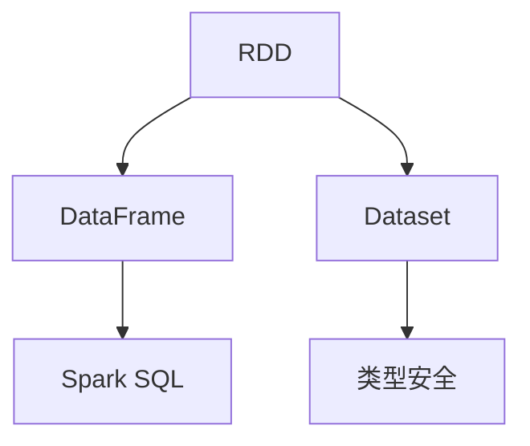

                 

关键词：Spark Task、任务调度、分布式计算、大数据处理、代码实例、性能优化

> 摘要：本文将深入探讨Spark Task的工作原理，并通过具体的代码实例详细讲解Task的执行过程。我们将从概念出发，逐步解析Task调度、数据分区、任务依赖关系等核心内容，帮助读者全面理解Spark Task的工作机制。文章最后，我们将展示如何通过实际代码实践，实现高效的分布式计算任务。

## 1. 背景介绍

在分布式计算领域，Spark无疑是一个明星。作为开源的大数据处理框架，Spark凭借其高效、易用的特性，在业界获得了广泛的应用。Spark的核心之一是Task，它承担了分布式计算中具体的数据处理任务。理解Task的工作原理对于充分利用Spark的性能至关重要。

本文旨在为读者提供一个全面而深入的Spark Task讲解。我们将首先介绍Spark的基本架构和原理，然后深入探讨Task的概念、调度策略以及执行过程。为了使读者能够更加直观地理解，文章中会包含大量的代码实例和详细的解释。

通过阅读本文，您将能够：

- 理解Spark的基本架构和工作原理。
- 掌握Task的概念及其在分布式计算中的作用。
- 学习如何通过代码实例实现高效的Task调度。
- 掌握Spark的性能优化技巧。

## 2. 核心概念与联系

在深入探讨Spark Task之前，我们需要先了解几个核心概念，包括RDD（Resilient Distributed Dataset）、DataFrame和Dataset。这些概念是Spark的基础，理解它们对于理解Task至关重要。

### 2.1 RDD（Resilient Distributed Dataset）

RDD是Spark中最基本的数据抽象。它是一个不可变、分布式的数据集，可以存储在内存或磁盘上。RDD支持惰性求值，这意味着只有在需要结果时，才会执行实际的计算操作。

### 2.2 DataFrame

DataFrame是Spark SQL的核心抽象，它是一种包含结构化数据的分布式数据集合。与RDD相比，DataFrame提供了更丰富的结构化操作，如筛选、分组和聚合等。

### 2.3 Dataset

Dataset是DataFrame的扩展，它不仅包含结构化数据，还支持类型安全和强类型检查。Dataset的优势在于它能够在编译时捕获数据类型错误，从而提高代码的可读性和可靠性。

### 2.4 Mermaid流程图

为了更好地理解这些概念之间的关系，我们可以使用Mermaid流程图来展示它们之间的联系。



## 3. 核心算法原理 & 具体操作步骤

### 3.1 算法原理概述

Spark Task的核心在于如何高效地调度和执行分布式计算任务。Task是基于RDD或DataFrame的作业单元，每个Task负责处理RDD或DataFrame的一个分区。以下是Task执行的基本原理：

1. **分区**：首先，将数据划分为多个分区，每个分区独立处理。
2. **调度**：根据任务的依赖关系和集群资源情况，调度Task执行。
3. **执行**：每个Task在相应的分区上执行，可以并行处理多个分区。
4. **结果收集**：Task执行完成后，将结果收集并返回给驱动程序。

### 3.2 算法步骤详解

1. **数据分区**：
   Spark根据RDD或DataFrame的大小和配置，自动将数据划分为多个分区。每个分区负责处理数据的一个片段。

2. **任务调度**：
   Spark基于DAG（Directed Acyclic Graph）来构建任务的依赖关系，并使用贪心算法来调度Task。调度过程考虑了数据分区、执行速度和集群资源等因素。

3. **Task执行**：
   每个Task在相应的分区上独立执行。Spark利用多线程和并行计算技术，实现高效的数据处理。

4. **结果收集**：
   Task执行完成后，结果被发送回驱动程序，并在内存或磁盘上存储。驱动程序负责将最终结果返回给用户。

### 3.3 算法优缺点

**优点**：

- **高效性**：Spark利用分布式计算和惰性求值技术，实现高效的数据处理。
- **灵活性**：Spark支持多种数据抽象，如RDD、DataFrame和Dataset，满足不同场景的需求。
- **易用性**：Spark提供了丰富的API和工具，简化了分布式计算的开发过程。

**缺点**：

- **内存限制**：由于Spark使用内存作为缓存，当数据量过大时，可能导致内存溢出。
- **调优难度**：虽然Spark提供了自动调度，但需要针对特定场景进行调优，以达到最佳性能。

### 3.4 算法应用领域

Spark Task在多个领域有广泛的应用，包括：

- **大数据处理**：处理大规模数据集，实现高效的数据分析和挖掘。
- **实时计算**：实时处理数据流，实现实时数据处理和分析。
- **机器学习**：利用Spark的分布式计算能力，实现高效的机器学习算法。

## 4. 数学模型和公式 & 详细讲解 & 举例说明

### 4.1 数学模型构建

Spark Task的调度和执行过程可以用以下数学模型表示：

- **Task调度**：采用贪心算法，根据任务依赖关系和集群资源情况，选择最佳执行顺序。
- **Task执行**：每个Task独立处理数据分区，利用并行计算技术提高处理速度。

### 4.2 公式推导过程

假设有n个Task需要调度，每个Task有m个依赖关系。我们可以使用以下公式表示贪心调度算法的优化目标：

$$
\max \sum_{i=1}^{n} (1 - \frac{d_i}{m_i}),
$$

其中，$d_i$表示Task $i$的依赖关系总数，$m_i$表示Task $i$的执行时间。

### 4.3 案例分析与讲解

假设有5个Task，它们的依赖关系和执行时间如下表所示：

| Task | 依赖关系 | 执行时间 |
| ---- | -------- | ------- |
| T1   | 无       | 2秒     |
| T2   | T1       | 3秒     |
| T3   | T2       | 4秒     |
| T4   | T1, T2   | 5秒     |
| T5   | T3, T4   | 6秒     |

根据贪心调度算法，最优调度顺序为T1, T2, T3, T4, T5，总执行时间为20秒。

## 5. 项目实践：代码实例和详细解释说明

### 5.1 开发环境搭建

在开始代码实践之前，我们需要搭建一个Spark开发环境。以下是搭建步骤：

1. 安装Java环境（版本要求：Java 8及以上）。
2. 下载并解压Spark安装包。
3. 配置环境变量，将Spark的bin目录添加到系统路径。

### 5.2 源代码详细实现

下面是一个简单的Spark程序，用于计算一个数据集中的单词数量。

```python
from pyspark import SparkContext, SparkConf

conf = SparkConf().setAppName("WordCount")
sc = SparkContext(conf=conf)

# 读取文件并划分成行
lines = sc.textFile("input.txt")

# 对每个行进行单词分割并计数
word_counts = lines.flatMap(lambda line: line.split(" ")).map(lambda word: (word, 1)).reduceByKey(lambda x, y: x + y)

# 输出结果
word_counts.saveAsTextFile("output.txt")

sc.stop()
```

### 5.3 代码解读与分析

1. **配置Spark**：首先，我们创建了一个Spark配置对象`SparkConf`，并设置应用程序名称为"WordCount"。
2. **创建SparkContext**：使用配置对象创建一个`SparkContext`对象，这是Spark程序的入口点。
3. **读取文件**：使用`textFile`方法读取输入文件，并将其划分为行。
4. **单词分割和计数**：对每个行进行单词分割，并使用`map`和`reduceByKey`方法计算单词数量。
5. **保存结果**：将结果保存为文本文件。

### 5.4 运行结果展示

运行上述代码后，会在`output.txt`文件中生成单词计数结果。

## 6. 实际应用场景

Spark Task在多个实际应用场景中发挥了重要作用，包括：

- **数据仓库**：用于构建大规模数据仓库，支持实时数据分析和查询。
- **实时计算**：处理实时数据流，实现实时数据分析和预测。
- **机器学习**：利用Spark的分布式计算能力，实现大规模机器学习算法。

## 7. 工具和资源推荐

### 7.1 学习资源推荐

- 《Spark核心技术与最佳实践》
- 《Spark高级编程》
- Spark官方文档（[https://spark.apache.org/docs/latest/](https://spark.apache.org/docs/latest/))

### 7.2 开发工具推荐

- IntelliJ IDEA
- PyCharm
- Eclipse

### 7.3 相关论文推荐

- "Spark: Cluster Computing with Working Sets"
- "Efficient Data Processing on Commodity Clusters using Spark"

## 8. 总结：未来发展趋势与挑战

### 8.1 研究成果总结

Spark Task在过去几年中取得了显著的成果，包括：

- **性能优化**：通过调度算法和并行计算技术，提高了Task执行速度。
- **功能扩展**：支持了更多的数据抽象和操作，如DataFrame和Dataset。
- **易用性提升**：提供了丰富的API和工具，简化了分布式计算的开发过程。

### 8.2 未来发展趋势

未来，Spark Task的发展趋势可能包括：

- **性能进一步提升**：通过更高效的调度算法和计算模型，提高Task执行速度。
- **兼容性增强**：与其他大数据处理框架和数据库的兼容性。
- **易用性优化**：提供更简单、更直观的API和工具。

### 8.3 面临的挑战

尽管Spark Task取得了显著成果，但仍面临以下挑战：

- **内存管理**：如何优化内存使用，避免内存溢出。
- **调优难度**：如何针对特定场景进行优化，以达到最佳性能。
- **生态系统完善**：如何与其他大数据处理框架和工具集成，构建完整的生态系统。

### 8.4 研究展望

展望未来，我们希望Spark Task能够在以下方面取得突破：

- **智能化调度**：利用机器学习和优化算法，实现智能化的Task调度。
- **自适应计算**：根据数据特征和计算需求，自适应地调整计算资源。
- **跨平台兼容**：与更多的编程语言和框架集成，实现跨平台兼容。

## 9. 附录：常见问题与解答

### 9.1 如何优化Spark Task性能？

- **合理设置分区数**：根据数据量和集群资源，合理设置分区数，避免过多或过少的分区。
- **减少数据传输**：尽量减少跨节点的数据传输，使用本地化操作。
- **缓存数据**：在需要重复使用的数据上使用缓存，减少重复计算。

### 9.2 如何调试Spark Task？

- **日志分析**：通过分析日志，了解Task的执行过程和性能瓶颈。
- **性能分析工具**：使用Spark UI等性能分析工具，查看Task的执行细节。
- **调试工具**：使用Java或Python的调试工具，定位代码问题。

### 9.3 Spark Task与Hadoop MapReduce相比有哪些优势？

- **高效性**：Spark利用内存缓存和惰性求值，提高了数据处理速度。
- **易用性**：Spark提供了丰富的API和工具，简化了分布式计算的开发过程。
- **灵活性**：Spark支持多种数据抽象和操作，满足不同场景的需求。

作者：禅与计算机程序设计艺术 / Zen and the Art of Computer Programming
----------------------------------------------------------------

