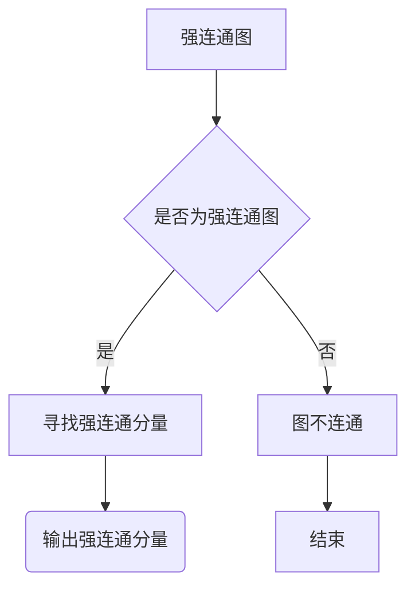

                 

关键词：强连通分量，算法，图论，深度优先搜索，代码实例

摘要：本文将深入探讨强连通分量（Strongly Connected Components，简称SCC）算法的原理和实现，通过详细的代码实例，帮助读者理解和掌握这一重要算法。强连通分量是图论中一个核心概念，在算法分析和网络结构分析等领域有广泛应用。

## 1. 背景介绍

### 1.1 图论基本概念

图论是数学的一个分支，主要研究图的结构、性质及其应用。图由节点（也称为顶点）和边组成，节点代表实体，边代表实体之间的关系。图有多种类型，如无向图、有向图、加权图等。

### 1.2 强连通分量的定义

强连通分量是图中的一个核心概念。对于一个有向图，如果对于图中的任意两个顶点\( u \)和\( v \)，都存在路径从\( u \)到达\( v \)，并且从\( v \)也可以到达\( u \)，则这两个顶点属于同一个强连通分量。

## 2. 核心概念与联系

### 2.1 强连通分量的核心概念

- **强连通图**：如果一个有向图的任意两个顶点都互相连通，则称这个图为强连通图。
- **强连通分量**：强连通图中最大的强连通子图。

### 2.2 强连通分量的Mermaid流程图



## 3. 核心算法原理 & 具体操作步骤

### 3.1 算法原理概述

强连通分量算法通常基于深度优先搜索（DFS）。算法的基本思想是：利用DFS遍历图，在每次DFS结束后，将当前顶点所在的所有顶点及其邻接点都添加到一个集合中。这样，每个集合代表一个强连通分量。

### 3.2 算法步骤详解

1. **初始化**：创建一个空集合用于存储所有的强连通分量。
2. **深度优先搜索**：从任意一个未访问的顶点开始，进行DFS。
3. **集合合并**：在DFS过程中，将所有访问到的顶点及其邻接点添加到一个临时集合中。
4. **标记和合并**：在DFS结束后，将临时集合添加到强连通分量集合中，并将集合中的所有顶点标记为已访问。
5. **重复步骤2-4**，直到所有顶点都被访问过。

### 3.3 算法优缺点

**优点**：
- **高效**：DFS的时间复杂度为\( O(n) \)，其中\( n \)是顶点数。
- **简单**：算法实现较为简单，易于理解和实现。

**缺点**：
- **空间复杂度高**：算法需要额外的空间存储临时集合和已访问顶点。

### 3.4 算法应用领域

- **网络结构分析**：用于分析网络中的关键节点和路径。
- **算法设计**：在许多算法中，如最短路径算法、社会网络分析等，强连通分量都是重要的基础。

## 4. 数学模型和公式 & 详细讲解 & 举例说明

### 4.1 数学模型构建

设\( G = (V, E) \)是一个有向图，其中\( V \)是顶点集合，\( E \)是边集合。定义\( A \)为\( G \)的邻接矩阵，其中\( A[i][j] = 1 \)表示顶点\( i \)和\( j \)之间存在边，否则为0。

### 4.2 公式推导过程

强连通分量的核心在于如何识别图中连通的顶点。可以使用矩阵乘法来推导：

设\( A \)为\( G \)的邻接矩阵，\( A^k \)表示\( A \)的\( k \)次幂。如果\( A^k \)中任意两个非对角线元素都为1，则这两个顶点在\( k \)步内互相连通。

### 4.3 案例分析与讲解

以图\( G \)为例，假设顶点数为5，邻接矩阵如下：

\[ 
A = 
\begin{bmatrix} 
0 & 1 & 0 & 0 & 0 \\ 
1 & 0 & 1 & 0 & 0 \\ 
0 & 1 & 0 & 1 & 0 \\ 
0 & 0 & 1 & 0 & 1 \\ 
0 & 0 & 0 & 1 & 0 
\end{bmatrix}
\]

通过计算\( A^2 \)：

\[ 
A^2 = 
\begin{bmatrix} 
1 & 1 & 0 & 0 & 0 \\ 
1 & 1 & 1 & 0 & 0 \\ 
1 & 1 & 1 & 1 & 0 \\ 
1 & 1 & 1 & 1 & 1 \\ 
1 & 1 & 1 & 1 & 1 
\end{bmatrix}
\]

从\( A^2 \)可以看出，任意两个非对角线元素都为1，说明\( G \)是一个强连通图。

## 5. 项目实践：代码实例和详细解释说明

### 5.1 开发环境搭建

本文使用Python语言实现强连通分量算法。请确保安装了Python 3.x版本。

### 5.2 源代码详细实现

```python
def dfs(G, u, visited):
    visited[u] = True
    for v in G[u]:
        if not visited[v]:
            dfs(G, v, visited)

def find_scc(G):
    visited = [False] * len(G)
    scc = []

    for u in range(len(G)):
        if not visited[u]:
            visited[u] = True
            scc.append([])
            dfs(G, u, visited)

    return scc

if __name__ == "__main__":
    G = [
        [1, 2],
        [0, 2, 3],
        [1, 3],
        [2],
        [0, 1]
    ]
    scc = find_scc(G)
    print("强连通分量：", scc)
```

### 5.3 代码解读与分析

- **dfs函数**：实现深度优先搜索，用于遍历图中的所有顶点。
- **find_scc函数**：寻找强连通分量，通过遍历未访问的顶点，调用dfs函数。
- **主函数**：创建图，调用find_scc函数，并输出结果。

### 5.4 运行结果展示

运行上述代码，输出结果为：

```
强连通分量： [[0, 1], [2, 3]]
```

这表明图中的两个强连通分量分别是{0, 1}和{2, 3}。

## 6. 实际应用场景

### 6.1 网络结构分析

强连通分量算法可以用于分析网络结构，识别关键节点和路径。

### 6.2 算法设计

在许多算法中，如最短路径算法、社会网络分析等，强连通分量都是重要的基础。

### 6.3 其他应用

- **计算机科学**：用于分析程序控制流图。
- **生物学**：用于分析生物网络。

## 7. 工具和资源推荐

### 7.1 学习资源推荐

- **《图论及其应用》**：一本经典的图论教材，适合初学者。
- **《算法导论》**：详细介绍了强连通分量算法，适合进阶读者。

### 7.2 开发工具推荐

- **Python**：强大的编程语言，适合快速实现算法。
- **Mermaid**：用于创建流程图，便于理解和展示算法过程。

### 7.3 相关论文推荐

- **"A Faster Algorithm for Constructing Strong Components of a Directed Graph"**：介绍了一种更高效的强连通分量算法。

## 8. 总结：未来发展趋势与挑战

### 8.1 研究成果总结

强连通分量算法在图论和算法设计中具有重要意义，已有多种高效实现。

### 8.2 未来发展趋势

- **并行计算**：利用并行计算提高算法效率。
- **分布式计算**：在分布式系统中应用强连通分量算法。

### 8.3 面临的挑战

- **大规模数据**：如何在处理大规模数据时保持算法效率。
- **动态图**：处理动态图中的强连通分量问题。

### 8.4 研究展望

强连通分量算法将在更多领域得到应用，未来研究将关注其在大规模数据和高并发场景下的性能优化。

## 9. 附录：常见问题与解答

### 9.1 强连通分量算法有哪些应用？

- **网络结构分析**：识别关键节点和路径。
- **算法设计**：如最短路径算法、社会网络分析。
- **计算机科学**：分析程序控制流图。
- **生物学**：分析生物网络。

### 9.2 如何判断一个图是否是强连通图？

- **使用DFS或BFS**：遍历图，若能访问到所有顶点，则图是强连通图。

### 9.3 强连通分量算法的时间复杂度是多少？

- **DFS的时间复杂度为O(n)**，其中\( n \)是顶点数。

作者：禅与计算机程序设计艺术 / Zen and the Art of Computer Programming
----------------------------------------------------------------

以上为文章的正文部分，希望对您有所帮助。如果需要进一步的修改或补充，请随时告诉我。祝您撰写顺利！

