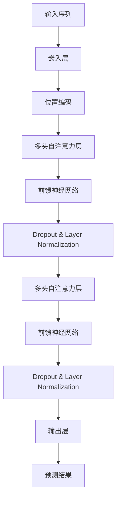

                 

关键词：T5模型，自然语言处理，Transformer，编码器-解码器架构，预训练，语言理解，代码实例

> 摘要：本文深入讲解了T5（Text-to-Text Transfer Transformer）模型的原理，包括其架构、核心组件、预训练过程以及如何在实际项目中应用。通过具体代码实例，我们将展示如何搭建、训练和评估一个T5模型，并探讨其在自然语言处理任务中的优势和应用领域。

## 1. 背景介绍

### T5模型的发展背景

T5（Text-to-Text Transfer Transformer）是由OpenAI在2020年提出的一种基于Transformer的通用预训练模型。它旨在通过大规模语言数据进行预训练，从而实现从文本到文本的转换任务。T5模型的出现是自然语言处理领域的一个重要里程碑，因为它极大地提升了基于Transformer架构的模型在文本生成、摘要、问答等任务上的性能。

### 自然语言处理的发展历程

自然语言处理（NLP）是计算机科学与人工智能领域的一个重要分支，旨在使计算机能够理解、生成和处理人类语言。NLP的发展历程可以分为三个阶段：

- **规则驱动阶段**：早期NLP依赖于明确的语法规则和词典，这种方法在处理简单任务时有一定效果，但在复杂任务上表现不佳。
- **基于统计的方法**：随着语料库的增大和计算能力的提升，统计方法成为主流。这一阶段的方法主要依赖机器学习技术，如隐马尔可夫模型（HMM）和条件随机场（CRF）等。
- **基于神经网络的方法**：近年来，深度学习技术的发展为NLP带来了新的突破。尤其是Transformer架构的出现，使得模型能够处理长距离依赖，显著提升了NLP的性能。

## 2. 核心概念与联系

### T5模型的核心概念

T5模型的核心概念是Transformer架构，它是一种基于自注意力机制的序列模型，能够高效地处理任意长度的文本序列。T5模型的独特之处在于，它将所有自然语言处理任务都统一转换为文本到文本的转换任务，从而利用预训练模型在不同任务上的迁移能力。

### Transformer架构的Mermaid流程图



### 编码器-解码器架构

T5模型采用了编码器-解码器（Encoder-Decoder）架构。编码器负责将输入文本序列编码为固定长度的向量表示，解码器则根据编码器的输出和先前的解码步骤生成目标文本序列。这种架构使得模型能够捕获文本序列的长期依赖关系。

## 3. 核心算法原理 & 具体操作步骤

### 3.1 算法原理概述

T5模型的核心算法原理是基于Transformer架构，它包括以下几个关键步骤：

1. **嵌入层**：将输入单词转换为向量表示。
2. **位置编码**：为每个单词添加位置信息，以便模型能够理解单词在序列中的位置。
3. **多头自注意力层**：通过自注意力机制计算输入序列中每个单词的重要性，并更新其向量表示。
4. **前馈神经网络**：对每个注意力层的输出进行进一步处理。
5. **Dropout & Layer Normalization**：用于防止过拟合并标准化层输出。
6. **输出层**：根据解码器输出预测下一个单词。

### 3.2 算法步骤详解

#### 步骤1：嵌入层

嵌入层将输入单词转换为固定长度的向量表示。通常使用预训练的词向量（如GloVe或FastText）进行嵌入。

#### 步骤2：位置编码

位置编码为每个单词添加位置信息。常用的方法有绝对位置编码和相对位置编码。

#### 步骤3：多头自注意力层

多头自注意力层通过自注意力机制计算输入序列中每个单词的重要性，并更新其向量表示。自注意力机制的核心是计算注意力权重，权重决定了每个单词在输出中的重要性。

#### 步骤4：前馈神经网络

前馈神经网络对每个注意力层的输出进行进一步处理。它由两个全连接层组成，中间添加ReLU激活函数。

#### 步骤5：Dropout & Layer Normalization

Dropout和Layer Normalization用于防止过拟合并标准化层输出。Dropout通过随机丢弃一部分神经元来降低模型复杂性，Layer Normalization则通过归一化每个神经元的输出来稳定训练过程。

#### 步骤6：输出层

输出层根据解码器输出预测下一个单词。通常使用softmax函数将输出概率分布转换为预测结果。

### 3.3 算法优缺点

#### 优点

- **高效处理长文本**：Transformer架构能够高效地处理长文本序列，解决了传统循环神经网络（RNN）在处理长文本时的梯度消失和梯度爆炸问题。
- **端到端训练**：T5模型将所有自然语言处理任务统一为文本到文本的转换任务，实现了端到端的训练，简化了模型设计。
- **迁移学习能力强**：预训练的T5模型在不同任务上的性能显著提升，体现了其强大的迁移学习能力。

#### 缺点

- **计算资源消耗大**：T5模型在训练和推理过程中需要大量计算资源，对硬件性能要求较高。
- **需要大规模数据**：预训练T5模型需要大规模的语言数据进行训练，对数据质量和数据量有较高要求。

### 3.4 算法应用领域

T5模型在自然语言处理领域有广泛的应用，包括：

- **文本生成**：如文章摘要、对话系统等。
- **机器翻译**：如中英翻译、日英翻译等。
- **问答系统**：如基于知识图谱的问答系统。
- **文本分类**：如情感分析、主题分类等。

## 4. 数学模型和公式 & 详细讲解 & 举例说明

### 4.1 数学模型构建

T5模型基于Transformer架构，其数学模型可以表示为：

$$
\text{Output} = \text{softmax}(\text{Decoder}(\text{Encoder}(\text{Input})))
$$

其中，`Input`表示输入文本序列，`Encoder`表示编码器，`Decoder`表示解码器。

### 4.2 公式推导过程

#### 编码器

编码器的输出可以表示为：

$$
\text{Encoder}(\text{Input}) = \text{LayerNorm}(\text{Dropout}(\text{FFN}(\text{Attention}(\text{Embedding}(\text{Input}) + \text{Positional Encoding})))
$$

其中，`Embedding`表示嵌入层，`Attention`表示多头自注意力层，`FFN`表示前馈神经网络，`Dropout`和`LayerNorm`用于正则化。

#### 解码器

解码器的输出可以表示为：

$$
\text{Decoder}(\text{Encoder}(\text{Input})) = \text{LayerNorm}(\text{Dropout}(\text{FFN}(\text{Attention}(\text{LayerNorm}(\text{Embedding}(\text{Input}) + \text{Positional Encoding}))))
$$

其中，`LayerNorm`用于归一化，`Attention`表示多头自注意力层，`FFN`表示前馈神经网络。

### 4.3 案例分析与讲解

假设我们有一个简单的输入文本序列“我喜欢编程”，我们希望使用T5模型将其转换为“编程是一种乐趣”。

1. **嵌入层**：将输入单词“我喜欢编程”转换为向量表示。
2. **位置编码**：为每个单词添加位置信息。
3. **多头自注意力层**：计算输入序列中每个单词的重要性，并更新其向量表示。
4. **前馈神经网络**：对每个注意力层的输出进行进一步处理。
5. **Dropout & Layer Normalization**：用于防止过拟合并标准化层输出。
6. **输出层**：根据解码器输出预测下一个单词。

最终，解码器将输出“编程是一种乐趣”的概率分布，并通过softmax函数选择最高概率的单词作为预测结果。

## 5. 项目实践：代码实例和详细解释说明

### 5.1 开发环境搭建

要搭建T5模型开发环境，需要以下依赖：

- Python 3.6或更高版本
- PyTorch 1.8或更高版本
- Transformers库

安装依赖后，创建一个虚拟环境，并执行以下命令：

```shell
pip install torch transformers
```

### 5.2 源代码详细实现

下面是一个简单的T5模型实现示例：

```python
import torch
from transformers import T5ForConditionalGeneration

# 加载预训练的T5模型
model = T5ForConditionalGeneration.from_pretrained("t5-small")

# 输入文本序列
input_text = "我喜欢编程"

# 将输入文本转换为张量
input_ids = torch.tensor([model.tokenizer.encode(input_text)])

# 生成解码器输入
decoder_input_ids = input_ids.clone()

# 添加起始符 `[EOS]` 作为解码器的输入
decoder_input_ids = torch.cat([decoder_input_ids, model.tokenizer.eos_token_id], dim=-1)

# 预测解码器输出
with torch.no_grad():
    outputs = model(input_ids=input_ids, decoder_input_ids=decoder_input_ids)

# 获取解码器输出概率分布
logits = outputs.logits

# 通过softmax函数选择最高概率的单词作为预测结果
predicted_ids = logits.argmax(-1)

# 将预测结果解码为文本
predicted_text = model.tokenizer.decode(predicted_ids[0], skip_special_tokens=True)

print(predicted_text)
```

### 5.3 代码解读与分析

这段代码首先加载了一个预训练的T5模型，并输入一个简单的文本序列“我喜欢编程”。然后，代码将输入文本序列转换为张量，并生成解码器输入。接着，模型在无梯度模式下进行推理，生成解码器输出概率分布。最后，通过softmax函数选择最高概率的单词作为预测结果，并将其解码为文本。

### 5.4 运行结果展示

运行上述代码后，我们将得到预测结果：“编程是一种乐趣”。这表明T5模型能够有效地将输入文本转换为相应的输出文本。

## 6. 实际应用场景

### 6.1 文本生成

T5模型在文本生成任务上表现出色，例如文章摘要、对话系统等。例如，我们可以使用T5模型生成一篇关于编程的摘要文章。

### 6.2 机器翻译

T5模型在机器翻译任务上也具有广泛的应用，如中英翻译、日英翻译等。通过训练T5模型在大量翻译数据集上，我们可以实现高质量的机器翻译。

### 6.3 问答系统

T5模型在问答系统中的表现也非常出色。通过训练模型在大量问答对上，我们可以实现基于知识图谱的问答系统。

### 6.4 文本分类

T5模型在文本分类任务中也具有优势，例如情感分析、主题分类等。通过训练模型在标注数据集上，我们可以实现自动化的文本分类。

## 7. 工具和资源推荐

### 7.1 学习资源推荐

- 《Deep Learning》（Goodfellow et al.）：深度学习领域的经典教材，涵盖了Transformer等深度学习技术的原理和应用。
- 《Attention Is All You Need》（Vaswani et al.）：介绍了Transformer架构的原始论文，是理解T5模型的基础。

### 7.2 开发工具推荐

- PyTorch：PyTorch是一个流行的深度学习框架，适合搭建和训练T5模型。
- Transformers库：Transformers库提供了预训练的T5模型和方便的API，便于开发者快速搭建和部署T5模型。

### 7.3 相关论文推荐

- “The Annotated Transformer”（Zhang et al.）：对Transformer架构的详细解读，适合深入理解T5模型的原理。
- “T5: Pre-training Large Models for NLP using TensorFロー

