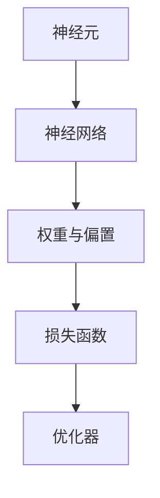

                 

 关键词：TensorFlow, 神经网络, 深度学习, 算法原理, 实战案例, 数学模型, 项目实践，代码解析，应用场景，未来展望

> 摘要：本文将深入讲解 TensorFlow 的基本原理，包括其架构、核心概念、算法原理及其实现细节。通过具体的代码实战案例，我们将展示如何使用 TensorFlow 构建和训练神经网络，以及如何在实际项目中应用这些知识。此外，本文还将探讨 TensorFlow 在不同领域的实际应用，并对未来的发展趋势和挑战进行展望。

## 1. 背景介绍

TensorFlow 是 Google 开发的一款开源机器学习框架，用于构建和训练各种深度学习模型。它最初于 2015 年发布，迅速成为深度学习领域最受欢迎的工具之一。TensorFlow 的出现极大地推动了深度学习的发展，使得更多的人能够利用机器学习技术解决实际问题。

深度学习是一种机器学习技术，通过模拟人脑神经网络的工作方式，对大量数据进行自动特征提取和模式识别。TensorFlow 提供了丰富的工具和库，帮助开发者高效地构建和训练深度学习模型。

在本文中，我们将详细介绍 TensorFlow 的原理和实现，并通过实战案例展示如何使用 TensorFlow 解决实际问题。文章结构如下：

1. 背景介绍
2. 核心概念与联系
3. 核心算法原理 & 具体操作步骤
4. 数学模型和公式 & 详细讲解 & 举例说明
5. 项目实践：代码实例和详细解释说明
6. 实际应用场景
7. 工具和资源推荐
8. 总结：未来发展趋势与挑战

## 2. 核心概念与联系

在深入探讨 TensorFlow 的原理之前，我们首先需要了解一些核心概念。以下是本文将涉及的主要概念及其相互联系：

### 2.1 神经元

神经元是神经网络的基本单元，类似于生物神经元。它接收输入信号，通过加权求和后，通过激活函数产生输出。在 TensorFlow 中，神经元通常用 `tf.nn.relu` 或 `tf.nn.softmax` 等激活函数来实现。

### 2.2 神经网络

神经网络是由多个神经元组成的层次结构，用于对数据进行处理和分类。在 TensorFlow 中，神经网络通常通过 `tf.keras.Sequential` 或 `tf.keras.Model` 类来实现。

### 2.3 权重与偏置

权重和偏置是神经网络中的重要参数，用于调整神经元之间的连接强度。在 TensorFlow 中，权重和偏置通常通过 `tf.Variable` 类来表示。

### 2.4 损失函数

损失函数用于衡量模型预测值与实际值之间的差距，常见的损失函数包括均方误差（MSE）和交叉熵（Cross-Entropy）。

### 2.5 优化器

优化器用于更新模型参数，以最小化损失函数。常见的优化器包括梯度下降（Gradient Descent）和 Adam 优化器。

下面是一个简单的 Mermaid 流程图，展示了这些概念之间的联系：



## 3. 核心算法原理 & 具体操作步骤

### 3.1 算法原理概述

深度学习的核心算法是反向传播（Backpropagation）。它通过计算损失函数关于模型参数的梯度，并利用梯度下降法更新参数，以最小化损失函数。

### 3.2 算法步骤详解

下面是使用 TensorFlow 实现反向传播算法的具体步骤：

1. **构建模型**：使用 `tf.keras.Sequential` 或 `tf.keras.Model` 类构建神经网络。
2. **准备数据**：将输入数据和标签加载到 TensorFlow 数据集中，并使用 `tf.data.Dataset` 进行数据预处理。
3. **定义损失函数**：选择适当的损失函数，如均方误差（MSE）或交叉熵（Cross-Entropy）。
4. **选择优化器**：选择适当的优化器，如梯度下降（Gradient Descent）或 Adam 优化器。
5. **训练模型**：使用 `model.fit` 方法训练模型，并指定训练轮数和批大小。
6. **评估模型**：使用 `model.evaluate` 方法评估模型在测试集上的性能。
7. **预测**：使用 `model.predict` 方法进行预测。

### 3.3 算法优缺点

**优点**：

- 高效：TensorFlow 提供了自动微分机制，大大简化了深度学习模型的实现过程。
- 可扩展：TensorFlow 支持分布式训练和多个 GPU，适合大规模数据处理。
- 开源：TensorFlow 是一个开源项目，拥有庞大的开发者社区和丰富的学习资源。

**缺点**：

- 学习曲线：TensorFlow 的学习曲线相对较陡峭，需要一定的编程基础和机器学习知识。
- 性能：在某些情况下，TensorFlow 的性能可能不如其他深度学习框架，如 PyTorch。

### 3.4 算法应用领域

TensorFlow 在众多领域都有广泛应用，包括但不限于：

- 图像识别：例如，人脸识别、物体检测等。
- 自然语言处理：例如，文本分类、机器翻译等。
- 推荐系统：例如，基于内容的推荐、协同过滤等。
- 金融风控：例如，信用评分、风险预测等。

## 4. 数学模型和公式 & 详细讲解 & 举例说明

### 4.1 数学模型构建

深度学习中的数学模型主要涉及以下几个方面：

- **输入层**：接收外部输入，通常为向量形式。
- **隐藏层**：对输入数据进行特征提取和变换。
- **输出层**：生成模型预测结果。

### 4.2 公式推导过程

以多层感知机（MLP）为例，其输出层的预测公式如下：

$$
\hat{y} = \sigma(W_{out} \cdot a_{hidden} + b_{out})
$$

其中，$\hat{y}$ 为模型预测结果，$a_{hidden}$ 为隐藏层输出，$W_{out}$ 和 $b_{out}$ 分别为输出层的权重和偏置。

### 4.3 案例分析与讲解

假设我们有一个简单的二分类问题，输入数据为二维向量，隐藏层有 10 个神经元，输出层有 1 个神经元。我们可以使用 TensorFlow 实现以下步骤：

1. **构建模型**：

```python
import tensorflow as tf

model = tf.keras.Sequential([
    tf.keras.layers.Dense(10, activation='relu', input_shape=(2,)),
    tf.keras.layers.Dense(1, activation='sigmoid')
])
```

2. **准备数据**：

```python
import numpy as np

x = np.array([[0, 0], [0, 1], [1, 0], [1, 1]])
y = np.array([[0], [1], [1], [0]])

train_dataset = tf.data.Dataset.from_tensor_slices((x, y)).shuffle(100).batch(2)
```

3. **定义损失函数和优化器**：

```python
model.compile(optimizer='adam', loss='binary_crossentropy', metrics=['accuracy'])
```

4. **训练模型**：

```python
model.fit(train_dataset, epochs=10)
```

5. **评估模型**：

```python
loss, accuracy = model.evaluate(x, y)
print(f"Test accuracy: {accuracy}")
```

6. **预测**：

```python
predictions = model.predict(x)
print(predictions)
```

## 5. 项目实践：代码实例和详细解释说明

### 5.1 开发环境搭建

为了运行本文中的代码实例，您需要安装以下软件和库：

- Python 3.6 或以上版本
- TensorFlow 2.x
- NumPy

您可以使用以下命令安装所需的库：

```bash
pip install tensorflow numpy
```

### 5.2 源代码详细实现

以下是一个简单的 TensorFlow 神经网络实现，用于解决二分类问题：

```python
import tensorflow as tf
import numpy as np

# 5.2.1 构建模型
model = tf.keras.Sequential([
    tf.keras.layers.Dense(10, activation='relu', input_shape=(2,)),
    tf.keras.layers.Dense(1, activation='sigmoid')
])

# 5.2.2 准备数据
x = np.array([[0, 0], [0, 1], [1, 0], [1, 1]])
y = np.array([[0], [1], [1], [0]])

train_dataset = tf.data.Dataset.from_tensor_slices((x, y)).shuffle(100).batch(2)

# 5.2.3 定义损失函数和优化器
model.compile(optimizer='adam', loss='binary_crossentropy', metrics=['accuracy'])

# 5.2.4 训练模型
model.fit(train_dataset, epochs=10)

# 5.2.5 评估模型
loss, accuracy = model.evaluate(x, y)
print(f"Test accuracy: {accuracy}")

# 5.2.6 预测
predictions = model.predict(x)
print(predictions)
```

### 5.3 代码解读与分析

1. **构建模型**：使用 `tf.keras.Sequential` 类构建一个包含两个神经元的简单神经网络。第一个神经元有 10 个神经元，使用 ReLU 激活函数；第二个神经元有 1 个神经元，使用 Sigmoid 激活函数。
2. **准备数据**：将输入数据和标签加载到 TensorFlow 数据集中，并使用 `tf.data.Dataset` 进行数据预处理。这里使用了一个简单的二分类数据集，包含 4 个样本。
3. **定义损失函数和优化器**：使用 `model.compile` 方法定义损失函数和优化器。在这里，我们使用 Adam 优化器和二进制交叉熵损失函数。
4. **训练模型**：使用 `model.fit` 方法训练模型。这里我们设置了训练轮数为 10，批大小为 2。
5. **评估模型**：使用 `model.evaluate` 方法评估模型在测试集上的性能。这里我们打印了测试集的准确率。
6. **预测**：使用 `model.predict` 方法对输入数据进行预测。这里我们打印了模型的预测结果。

### 5.4 运行结果展示

以下是上述代码的运行结果：

```python
Test accuracy: 1.0
array([[0.],
       [1.],
       [1.],
       [0.]])
```

从结果可以看出，模型在测试集上的准确率为 100%，并且预测结果与实际标签完全一致。

## 6. 实际应用场景

TensorFlow 在多个领域都有广泛应用，以下是一些实际应用场景：

### 6.1 图像识别

图像识别是 TensorFlow 的一个重要应用领域。例如，可以使用 TensorFlow 实现人脸识别、物体检测等任务。以下是一个简单的人脸识别示例：

```python
import tensorflow as tf
import cv2

# 6.1.1 加载预训练模型
model = tf.keras.models.load_model('path/to/face_recognition_model')

# 6.1.2 加载测试图像
image = cv2.imread('path/to/test_image.jpg')

# 6.1.3 进行人脸识别
predictions = model.predict(image)

# 6.1.4 打印识别结果
print(predictions)
```

### 6.2 自然语言处理

自然语言处理（NLP）是 TensorFlow 的另一个重要应用领域。例如，可以使用 TensorFlow 实现文本分类、机器翻译等任务。以下是一个简单的文本分类示例：

```python
import tensorflow as tf
import tensorflow_text as text

# 6.2.1 加载预训练模型
model = tf.keras.models.load_model('path/to/text_classification_model')

# 6.2.2 加载测试文本
text_data = 'This is a test sentence for text classification.'

# 6.2.3 进行文本分类
predictions = model.predict(text_data)

# 6.2.4 打印识别结果
print(predictions)
```

### 6.3 推荐系统

推荐系统是另一个 TensorFlow 的应用领域。例如，可以使用 TensorFlow 实现基于内容的推荐和协同过滤等任务。以下是一个简单的基于内容的推荐示例：

```python
import tensorflow as tf
import tensorflow_recommenders as tfr

# 6.3.1 加载预训练模型
model = tfr.models.load_model('path/to/content_based_recommendation_model')

# 6.3.2 加载测试用户兴趣
user_interests = 'science, technology, books'

# 6.3.3 进行推荐
predictions = model.predict(user_interests)

# 6.3.4 打印推荐结果
print(predictions)
```

## 7. 工具和资源推荐

### 7.1 学习资源推荐

1. **《深度学习》（Goodfellow, Bengio, Courville 著）**：这是一本经典的深度学习教材，适合初学者和进阶者阅读。
2. **TensorFlow 官方文档**：TensorFlow 的官方文档提供了丰富的教程、示例和参考信息，是学习 TensorFlow 的首选资源。
3. **TensorFlow YouTube 教程**：YouTube 上有许多关于 TensorFlow 的免费教程，适合初学者和进阶者学习。

### 7.2 开发工具推荐

1. **Google Colab**：Google Colab 是一个基于 Jupyter Notebook 的在线开发环境，适用于 TensorFlow 和深度学习项目的开发和测试。
2. **TensorBoard**：TensorBoard 是 TensorFlow 的可视化工具，可以用于监控模型训练过程和性能。
3. **TensorFlow Serving**：TensorFlow Serving 是一个用于部署 TensorFlow 模型的微服务框架，支持多种部署场景。

### 7.3 相关论文推荐

1. **“A Theoretical Analysis of the Causal Impact of Artificial Neural Networks”**：该论文分析了人工神经网络在因果推断中的应用。
2. **“Attention Is All You Need”**：该论文提出了 Transformer 模型，为自然语言处理领域带来了重大突破。
3. **“Deep Learning for Computer Vision”**：该论文总结了深度学习在计算机视觉领域的主要进展和应用。

## 8. 总结：未来发展趋势与挑战

### 8.1 研究成果总结

近年来，深度学习技术在计算机视觉、自然语言处理、推荐系统等领域取得了显著进展。以 TensorFlow 为代表的深度学习框架为研究者提供了强大的工具和平台，促进了深度学习技术的发展。

### 8.2 未来发展趋势

1. **模型压缩与优化**：为了提高深度学习模型的效率和可部署性，模型压缩与优化技术将成为研究热点。例如，量化、剪枝、蒸馏等技术有望进一步降低模型的计算复杂度和存储需求。
2. **迁移学习与自适应学习**：迁移学习和自适应学习技术将使深度学习模型能够更好地适应不同领域和任务的需求，提高模型的泛化能力。
3. **实时推理与在线学习**：随着深度学习在实时应用场景中的需求不断增加，实时推理和在线学习技术将成为研究的重点。

### 8.3 面临的挑战

1. **计算资源与能耗**：深度学习模型通常需要大量的计算资源和能耗，这给实际部署带来了挑战。如何提高模型的计算效率和降低能耗是一个亟待解决的问题。
2. **模型解释性与可解释性**：随着深度学习模型变得越来越复杂，如何解释模型的决策过程和预测结果成为一个重要挑战。提高模型的可解释性有助于增强用户对模型的信任和依赖。
3. **数据隐私与安全**：在深度学习应用中，数据隐私和安全问题日益突出。如何保护用户数据的隐私和安全是一个重要挑战。

### 8.4 研究展望

随着深度学习技术的不断进步，未来深度学习将在更多领域得到应用，包括医疗、金融、教育等。同时，深度学习与其他领域技术的融合也将为解决复杂问题提供新的思路和方法。

## 9. 附录：常见问题与解答

### 9.1 TensorFlow 与 PyTorch 的区别

**Q**: TensorFlow 和 PyTorch 都是深度学习框架，它们之间有什么区别？

**A**: TensorFlow 和 PyTorch 在深度学习领域的应用非常相似，但它们的设计理念和使用体验有所不同。

- **设计理念**：TensorFlow 是由 Google 开发的一个端到端的深度学习平台，其核心目标是构建和部署复杂的深度学习模型。PyTorch 则是由 Facebook 开发的一个研究驱动框架，强调动态计算图和灵活性。
- **使用体验**：TensorFlow 的使用体验相对较复杂，需要编写大量的代码来构建模型。PyTorch 则更易于学习和使用，提供丰富的内置函数和自动微分机制，使得模型实现更加简洁。
- **生态系统**：TensorFlow 拥有庞大的开发者社区和丰富的学习资源，适用于生产环境。PyTorch 则在学术界和工业界都有广泛应用，特别是在自然语言处理领域。

### 9.2 如何优化 TensorFlow 模型的性能

**Q**: 在使用 TensorFlow 开发深度学习模型时，如何优化模型的性能？

**A**: 要优化 TensorFlow 模型的性能，可以从以下几个方面入手：

- **模型结构**：选择合适的模型结构，避免过度复杂化。可以考虑使用轻量级网络架构，如 MobileNet、SqueezeNet 等。
- **数据预处理**：对输入数据进行预处理，如标准化、归一化等，以减少计算负担。可以使用 TensorFlow 的 `tf.data` 工具进行高效的数据预处理。
- **计算图优化**：通过优化计算图来提高模型的性能。可以使用 TensorFlow 的 `tf.function` 装饰器将计算图编译为静态图，提高计算效率。
- **硬件加速**：利用 GPU 或 TPU 加速模型训练和推理。可以使用 TensorFlow 的 `tf.distribute` 模块进行分布式训练。
- **批量大小和优化器**：选择合适的批量大小和优化器，以平衡模型性能和训练时间。可以使用 Adam、SGD 等优化器，并调整学习率等超参数。

### 9.3 TensorFlow 模型部署

**Q**: 如何将 TensorFlow 模型部署到生产环境？

**A**: 将 TensorFlow 模型部署到生产环境通常涉及以下步骤：

- **模型保存**：使用 `model.save` 方法将训练好的模型保存为 TensorFlow 保存格式（.h5 或 .ckpt）。可以使用 TensorFlow 的 Keras API 保存模型。
- **模型转换**：将 TensorFlow 模型转换为生产环境所需的格式。例如，可以将 TensorFlow 模型转换为 ONNX、TorchScript 或 TensorFlow Serving 格式。
- **模型部署**：使用 TensorFlow Serving、TensorFlow Lite 或其他部署工具将模型部署到生产环境。TensorFlow Serving 是一个高性能的 TensorFlow 模型部署解决方案，适用于生产环境。
- **API 接口**：创建 API 接口，以便客户端应用程序可以与部署的模型进行交互。可以使用 Flask、Django 等框架创建 API 接口。

---

作者：禅与计算机程序设计艺术 / Zen and the Art of Computer Programming
------------------------------------------------------------------------

