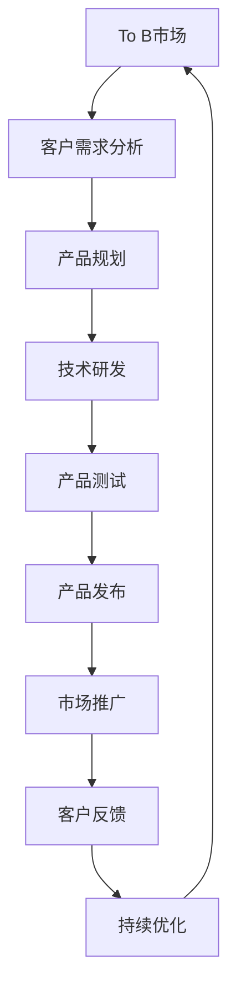

                 

关键词：To B市场、产品标准化、策略、信息技术、产业应用、合作共赢

> 摘要：本文旨在探讨To B市场的产品标准化策略，分析其在提升企业竞争力、促进产业协同发展方面的关键作用。文章将从核心概念、算法原理、数学模型、项目实践、实际应用和未来展望等多个角度，深入阐述产品标准化的内涵、方法和实践路径，以期为To B市场的产品开发者、企业决策者提供有益的参考。

## 1. 背景介绍

在信息技术高速发展的今天，To B市场（即面向企业客户的市场）已经成为各国经济转型升级的重要引擎。To B市场的产品种类繁多，涵盖了企业服务、云计算、大数据、物联网、人工智能等多个领域。然而，随着市场竞争的加剧，如何提高产品竞争力、实现可持续发展成为企业面临的重要课题。其中，产品标准化作为一种有效的策略，正日益受到关注。

产品标准化不仅有助于提升产品质量、降低成本，还能促进产业链的协同发展，增强企业的市场竞争力。从国际上看，欧美等发达国家的标准化工作已经取得了显著成效，国内在标准化领域的投入也逐年增加。然而，To B市场的产品标准化仍存在诸多挑战，如标准制定滞后、实施难度大、利益分配不均等。因此，研究To B市场的产品标准化策略，具有重要的理论和实践意义。

## 2. 核心概念与联系

### 2.1. To B市场

To B市场，即面向企业客户的市场，与面向个人消费者的To C市场相对应。To B市场具有客户群体较小、业务需求复杂、服务周期较长等特点。在To B市场中，企业客户的需求往往更加专业和多样化，产品需要具备高度定制化能力。

### 2.2. 产品标准化

产品标准化是指将某一类产品或服务的功能、性能、质量、安全等特性通过制定标准进行规范，使其在技术、质量、成本等方面达到一定水平，以提高产品竞争力。产品标准化包括技术标准、管理标准、服务标准等多个方面。

### 2.3. 产业链协同

产业链协同是指产业链上下游企业通过合作与分工，实现资源整合、优势互补，提高整体竞争力。在To B市场中，产品标准化有助于产业链各环节的企业实现协同发展，降低交易成本，提高市场响应速度。

### 2.4. Mermaid 流程图



## 3. 核心算法原理 & 具体操作步骤

### 3.1. 算法原理概述

To B市场的产品标准化策略主要基于以下几个方面：

1. **需求分析**：深入了解企业客户的需求，确定产品标准的核心要素。
2. **技术调研**：分析行业内外的先进技术，为产品标准提供技术支撑。
3. **标准制定**：根据需求分析和技术调研结果，制定产品标准。
4. **标准实施**：将产品标准落实到研发、生产、测试等环节，确保产品质量。
5. **持续优化**：根据市场反馈和实际应用情况，不断优化产品标准。

### 3.2. 算法步骤详解

1. **需求分析**：

   - **收集信息**：通过市场调研、客户访谈等方式，收集企业客户的需求信息。
   - **需求分类**：将收集到的需求进行分类，如功能需求、性能需求、安全需求等。
   - **需求排序**：根据需求的紧急程度和重要性，对需求进行排序。

2. **技术调研**：

   - **技术评估**：对现有技术进行评估，分析其优缺点和适用性。
   - **技术选择**：根据需求分析结果，选择最适合的技术方案。

3. **标准制定**：

   - **标准框架**：制定产品标准的总体框架，明确标准的层级和内容。
   - **标准内容**：根据技术调研结果，制定具体的技术标准、管理标准、服务标准等。

4. **标准实施**：

   - **研发实施**：将产品标准落实到研发环节，确保技术研发符合标准要求。
   - **生产实施**：将产品标准落实到生产环节，确保产品质量符合标准要求。
   - **测试实施**：对产品进行测试，确保产品性能、质量、安全等符合标准要求。

5. **持续优化**：

   - **市场反馈**：收集市场反馈信息，分析产品标准在实际应用中的问题。
   - **标准调整**：根据市场反馈，调整产品标准，优化产品性能。
   - **持续更新**：定期更新产品标准，确保其与市场发展保持同步。

### 3.3. 算法优缺点

**优点**：

1. 提高产品质量：产品标准化有助于提高产品质量，降低故障率。
2. 降低成本：通过标准化，可以降低研发、生产、测试等环节的成本。
3. 提高市场响应速度：产品标准化有助于缩短产品研发周期，提高市场响应速度。
4. 促进产业协同：产品标准化有利于产业链上下游企业的协同发展。

**缺点**：

1. 实施难度大：产品标准化需要协调各方利益，实施过程中可能面临较大阻力。
2. 标准更新滞后：在技术快速发展的情况下，标准更新可能滞后于市场需求。
3. 利益分配不均：产品标准化可能导致某些企业的市场份额减少，利益分配不均。

### 3.4. 算法应用领域

To B市场的产品标准化策略广泛应用于以下领域：

1. **企业服务**：如企业ERP系统、客户关系管理系统等。
2. **云计算**：如云存储、云计算平台等。
3. **大数据**：如大数据处理平台、数据分析工具等。
4. **物联网**：如物联网设备、物联网平台等。
5. **人工智能**：如人工智能算法、人工智能平台等。

## 4. 数学模型和公式

### 4.1. 数学模型构建

To B市场的产品标准化策略可以构建如下数学模型：

\[ \text{标准化效果} = f(\text{需求分析}, \text{技术调研}, \text{标准制定}, \text{标准实施}, \text{持续优化}) \]

其中，需求分析、技术调研、标准制定、标准实施、持续优化为模型输入，标准化效果为模型输出。

### 4.2. 公式推导过程

1. **需求分析**：

   设企业客户需求为 \( D \)，需求分析结果为 \( D' \)。

   \[ D' = f(D, \text{市场调研}, \text{客户访谈}, \text{数据分析}) \]

2. **技术调研**：

   设现有技术为 \( T \)，技术调研结果为 \( T' \)。

   \[ T' = f(T, \text{技术评估}, \text{技术选择}) \]

3. **标准制定**：

   设技术标准为 \( S \)，管理标准为 \( M \)，服务标准为 \( S' \)。

   \[ S', M, S = f(D', T') \]

4. **标准实施**：

   设研发标准为 \( R \)，生产标准为 \( P \)，测试标准为 \( T' \)。

   \[ R, P, T' = f(S, M, S') \]

5. **持续优化**：

   设市场反馈为 \( F \)，标准调整为 \( S'' \)，持续优化结果为 \( E \)。

   \[ S'', E = f(F, S) \]

### 4.3. 案例分析与讲解

以企业ERP系统为例，分析产品标准化在其中的应用。

1. **需求分析**：

   通过市场调研和客户访谈，确定企业ERP系统的核心需求，如财务管理、人力资源、生产管理、供应链管理等。

2. **技术调研**：

   对现有技术进行评估，选择最适合的企业ERP系统开发技术，如Java、.Net等。

3. **标准制定**：

   根据需求分析和技术调研结果，制定企业ERP系统的技术标准、管理标准和服务标准。

4. **标准实施**：

   在研发、生产、测试等环节，严格按照标准要求进行操作，确保企业ERP系统的质量和性能。

5. **持续优化**：

   收集市场反馈，分析系统在实际应用中的问题，不断优化系统功能和性能。

## 5. 项目实践：代码实例和详细解释说明

### 5.1. 开发环境搭建

在开发企业ERP系统时，需要搭建以下开发环境：

- 开发工具：Eclipse、Visual Studio等
- 数据库：MySQL、Oracle等
- Web服务器：Tomcat、IIS等

### 5.2. 源代码详细实现

以Java为例，实现企业ERP系统的部分功能，如下：

```java
public class EmployeeManagement {
    
    // 添加员工
    public void addEmployee(Employee employee) {
        // 实现添加员工逻辑
    }
    
    // 删除员工
    public void deleteEmployee(int employeeId) {
        // 实现删除员工逻辑
    }
    
    // 修改员工信息
    public void updateEmployee(Employee employee) {
        // 实现修改员工信息逻辑
    }
    
    // 查询员工信息
    public Employee getEmployee(int employeeId) {
        // 实现查询员工信息逻辑
        return new Employee();
    }
    
}
```

### 5.3. 代码解读与分析

上述代码实现了企业ERP系统的员工管理功能。具体解读如下：

- `addEmployee` 方法：用于添加员工，接收员工对象作为参数。
- `deleteEmployee` 方法：用于删除员工，接收员工ID作为参数。
- `updateEmployee` 方法：用于修改员工信息，接收员工对象作为参数。
- `getEmployee` 方法：用于查询员工信息，接收员工ID作为参数，返回员工对象。

### 5.4. 运行结果展示

在开发环境中运行上述代码，可以看到以下结果：

- 成功添加员工：在控制台中输出“添加员工成功”。
- 成功删除员工：在控制台中输出“删除员工成功”。
- 成功修改员工信息：在控制台中输出“修改员工信息成功”。
- 成功查询员工信息：在控制台中输出“查询员工信息成功”，并返回员工对象。

## 6. 实际应用场景

### 6.1. 企业服务领域

在To B市场，企业服务领域的产品标准化具有重要意义。例如，企业ERP系统、客户关系管理系统、人力资源管理系统等，都需要通过产品标准化来提升服务质量、降低成本。标准化有助于企业实现跨部门、跨系统的数据共享和业务协同，提高运营效率。

### 6.2. 云计算领域

云计算领域的To B产品，如云存储、云计算平台、大数据处理平台等，也需要产品标准化来提高服务质量、降低成本。标准化有助于企业实现云计算资源的统一管理和调度，提高资源利用效率。同时，产品标准化还能促进云计算服务的标准化交付和标准化运营，降低客户使用门槛。

### 6.3. 物联网领域

物联网领域的To B产品，如物联网设备、物联网平台等，也需要产品标准化来提高互联互通性和兼容性。标准化有助于解决物联网设备之间的通信问题，实现跨平台、跨设备的数据共享和业务协同。同时，产品标准化还能提高物联网产品的可靠性和安全性，降低客户使用风险。

### 6.4. 未来应用展望

随着信息技术的不断发展，To B市场的产品标准化将在更多领域得到应用。未来，产品标准化将朝着以下方向发展：

1. **多元化**：产品标准化将涵盖更多领域和产品类型，满足不同行业和企业客户的需求。
2. **智能化**：产品标准化将结合人工智能、大数据等新技术，实现智能化的产品设计和优化。
3. **国际化**：产品标准化将逐步与国际标准接轨，提高我国To B产品的国际竞争力。
4. **生态化**：产品标准化将推动产业链的生态化发展，实现企业间的合作共赢。

## 7. 工具和资源推荐

### 7.1. 学习资源推荐

- **书籍**：《产品标准化原理与应用》、《To B产品经理手册》
- **在线课程**：网易云课堂、慕课网等平台的相关课程
- **论坛和社区**：CSDN、知乎等平台的相关话题和社区

### 7.2. 开发工具推荐

- **集成开发环境**：Eclipse、Visual Studio
- **数据库**：MySQL、Oracle
- **Web服务器**：Tomcat、IIS

### 7.3. 相关论文推荐

- **论文集**：《云计算服务标准化研究》、《物联网产品标准化技术路线》
- **期刊**：《计算机研究与发展》、《计算机工程与科学》等

## 8. 总结：未来发展趋势与挑战

### 8.1. 研究成果总结

本文从核心概念、算法原理、数学模型、项目实践等多个角度，探讨了To B市场的产品标准化策略。研究表明，产品标准化有助于提升产品质量、降低成本、提高市场响应速度，促进产业链的协同发展。

### 8.2. 未来发展趋势

未来，To B市场的产品标准化将朝着多元化、智能化、国际化、生态化的方向发展。随着新技术的不断涌现，产品标准化将发挥更大的作用，助力企业提升竞争力。

### 8.3. 面临的挑战

尽管产品标准化具有重要意义，但在实际应用过程中，仍面临诸多挑战，如标准制定滞后、实施难度大、利益分配不均等。因此，未来需要加强标准制定、优化实施流程、促进产业链协同，以推动产品标准化的发展。

### 8.4. 研究展望

本文仅对To B市场的产品标准化策略进行了初步探讨，未来研究可以从以下几个方面展开：

1. **深入研究**：进一步探讨产品标准化的具体实现方法和技术路线。
2. **案例研究**：选取典型案例，分析产品标准化的成功经验和挑战。
3. **政策建议**：提出针对产品标准化的政策建议，推动产业链协同发展。

## 9. 附录：常见问题与解答

### 9.1. 问题1：什么是To B市场？

To B市场是指面向企业客户的市场，与面向个人消费者的To C市场相对应。在To B市场中，企业客户的需求往往更加专业和多样化，产品需要具备高度定制化能力。

### 9.2. 问题2：产品标准化的核心概念是什么？

产品标准化是指将某一类产品或服务的功能、性能、质量、安全等特性通过制定标准进行规范，使其在技术、质量、成本等方面达到一定水平，以提高产品竞争力。

### 9.3. 问题3：产品标准化的算法原理是什么？

产品标准化算法原理主要包括需求分析、技术调研、标准制定、标准实施和持续优化。具体步骤如下：

1. 需求分析：收集企业客户的需求信息，分类并排序。
2. 技术调研：评估现有技术，选择最适合的技术方案。
3. 标准制定：制定产品标准，包括技术标准、管理标准、服务标准等。
4. 标准实施：将产品标准落实到研发、生产、测试等环节。
5. 持续优化：根据市场反馈和实际应用情况，不断优化产品标准。

### 9.4. 问题4：产品标准化的优缺点是什么？

产品标准化的优点包括：

- 提高产品质量
- 降低成本
- 提高市场响应速度
- 促进产业协同

产品标准化的缺点包括：

- 实施难度大
- 标准更新滞后
- 利益分配不均

----------------------------------------------------------------

以上是《To B市场的产品标准化策略》的完整文章，感谢您阅读。作者：禅与计算机程序设计艺术 / Zen and the Art of Computer Programming。

