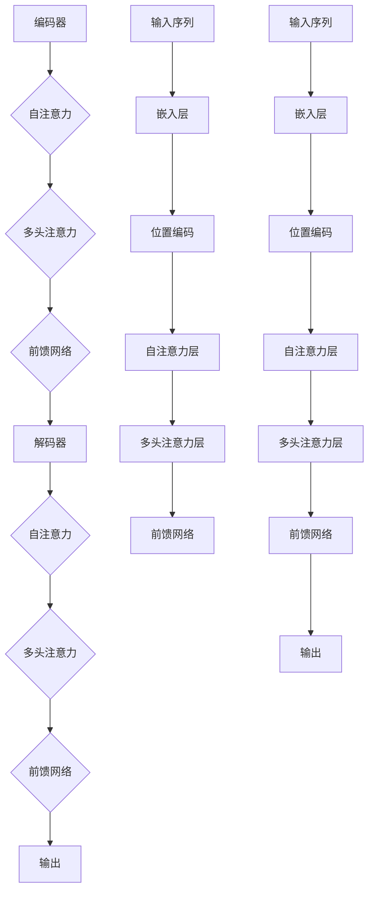

                 

在近年来深度学习领域，Transformer架构的提出引起了广泛的关注。Transformer是由Vaswani等人于2017年提出的一种基于自注意力机制的神经网络架构，它在机器翻译任务上取得了革命性的突破。本文将深入探讨Transformer的核心概念、算法原理、数学模型、代码实现及其在实际应用中的场景。希望通过本文的阐述，读者能够全面理解Transformer的工作机制，并能够基于此进行相应的开发和应用。

## 文章关键词

- Transformer
- 自注意力机制
- 机器翻译
- 神经网络
- 深度学习

## 文章摘要

本文首先介绍了Transformer架构的背景和核心概念，随后通过Mermaid流程图详细展示了其架构原理。接着，我们深入讲解了Transformer的核心算法原理，包括算法的概述、步骤详解、优缺点以及应用领域。随后，文章通过数学模型和公式的详细讲解，帮助读者理解Transformer中的关键数学基础。在实际应用部分，我们通过代码实例展示了如何实现一个基本的Transformer模型，并对代码进行了详细解读和分析。最后，文章探讨了Transformer在各类实际应用场景中的表现，并对其未来发展趋势与挑战进行了展望。

## 1. 背景介绍

### 1.1 Transformer提出的背景

在2017年之前，序列到序列（Sequence-to-Sequence, Seq2Seq）模型是机器翻译领域的主要研究方向。Seq2Seq模型基于循环神经网络（Recurrent Neural Network, RNN）的架构，通过编码器和解码器的循环结构对输入序列进行处理和生成。然而，RNN在处理长序列时存在梯度消失和梯度爆炸等问题，这使得其在长距离依赖建模上表现不佳。

为了解决这一问题，Vaswani等人提出了Transformer模型。Transformer采用了一种全新的自注意力机制（Self-Attention Mechanism），取代了传统RNN中的循环结构，从而在机器翻译任务上取得了显著的效果。随后，Transformer在多种自然语言处理任务中展现出了强大的性能，成为深度学习领域的一个里程碑。

### 1.2 Transformer的动机和优势

Transformer的提出主要基于以下几个动机：

1. **解决长距离依赖问题**：自注意力机制使得模型能够捕捉到输入序列中的长距离依赖，避免了RNN中的梯度消失和梯度爆炸问题。
2. **并行计算**：与RNN相比，Transformer可以更容易地实现并行计算，从而提高模型的训练效率。
3. **更好的捕捉上下文信息**：自注意力机制允许模型在生成每个输出时考虑整个输入序列，从而更好地捕捉上下文信息。

Transformer的优势主要体现在以下几个方面：

1. **训练效率高**：Transformer通过并行计算显著提高了训练速度。
2. **泛化能力强**：自注意力机制使得模型在处理不同长度的输入序列时表现出更强的适应性。
3. **性能优异**：在多个自然语言处理任务中，Transformer模型的表现优于传统的Seq2Seq模型。

## 2. 核心概念与联系

### 2.1 核心概念

Transformer模型的核心概念包括：

- **自注意力（Self-Attention）**：自注意力机制允许模型在生成每个输出时，对整个输入序列进行加权平均，从而捕捉长距离依赖。
- **多头注意力（Multi-Head Attention）**：多头注意力通过将输入序列分成多个子序列，分别进行自注意力计算，从而提高模型的表示能力。
- **前馈网络（Feedforward Network）**：前馈网络用于在自注意力和多头注意力之后对模型进行进一步的加工。

### 2.2 Transformer架构的 Mermaid 流程图



### 2.3 核心概念的联系

在Transformer架构中，自注意力、多头注意力和前馈网络相互协作，共同实现对输入序列的建模和输出序列的生成。自注意力机制使得模型能够捕捉输入序列中的长距离依赖，多头注意力通过多个子序列的交互增强模型的表示能力，前馈网络则对输入序列进行进一步的加工，从而提高模型的性能。

## 3. 核心算法原理 & 具体操作步骤

### 3.1 算法原理概述

Transformer的核心算法原理主要包括自注意力、多头注意力和前馈网络。

- **自注意力（Self-Attention）**：自注意力机制允许模型在生成每个输出时，对整个输入序列进行加权平均。通过计算输入序列中每个元素与所有其他元素的相关性，模型能够捕捉到输入序列中的长距离依赖。
- **多头注意力（Multi-Head Attention）**：多头注意力通过将输入序列分成多个子序列，分别进行自注意力计算。多个子序列的交互使得模型能够捕获更丰富的上下文信息，从而提高模型的表示能力。
- **前馈网络（Feedforward Network）**：前馈网络用于在自注意力和多头注意力之后对模型进行进一步的加工。前馈网络通常由两个全连接层组成，中间经过ReLU激活函数。

### 3.2 算法步骤详解

Transformer的算法步骤可以分为编码器和解码器两部分。

#### 编码器（Encoder）

1. **输入序列编码**：输入序列首先通过嵌入层（Embedding Layer）进行编码，得到嵌入向量。
2. **位置编码**：由于Transformer中没有循环结构，需要通过位置编码（Positional Encoding）为序列中的每个元素赋予位置信息。
3. **自注意力计算**：通过自注意力机制计算输入序列中每个元素与所有其他元素的相关性，得到加权平均的输出序列。
4. **多头注意力计算**：将自注意力计算得到的输出序列分成多个子序列，分别进行多头注意力计算，得到更丰富的上下文信息。
5. **前馈网络**：对多头注意力计算得到的输出序列进行前馈网络加工，进一步提取特征。
6. **编码器输出**：将前馈网络输出作为编码器的最终输出，用于后续的解码器输入。

#### 解码器（Decoder）

1. **输入序列编码**：与编码器类似，输入序列首先通过嵌入层进行编码。
2. **位置编码**：同样通过位置编码为序列中的每个元素赋予位置信息。
3. **自注意力计算**：解码器的自注意力计算仅限于已生成的部分输出序列，以防止模型在生成过程中出现重复和冗余。
4. **多头注意力计算**：在自注意力计算之后，解码器通过多头注意力计算捕捉长距离依赖。
5. **前馈网络**：与前馈网络加工解码器自注意力和多头注意力计算得到的输出序列。
6. **解码器输出**：将前馈网络输出与已生成的输出序列进行拼接，作为解码器的最终输出。

### 3.3 算法优缺点

#### 优点

1. **解决长距离依赖问题**：自注意力机制能够有效捕捉输入序列中的长距离依赖，避免了传统RNN中的梯度消失和梯度爆炸问题。
2. **并行计算**：Transformer通过自注意力机制实现并行计算，显著提高了模型的训练效率。
3. **更好的捕捉上下文信息**：多头注意力机制使得模型能够更好地捕捉输入序列中的上下文信息。

#### 缺点

1. **计算复杂度高**：Transformer的计算复杂度较高，尤其是在处理大型输入序列时，计算资源需求较大。
2. **参数规模较大**：由于多头注意力机制的使用，Transformer的参数规模较大，这可能导致过拟合问题。

### 3.4 算法应用领域

Transformer在多个自然语言处理任务中取得了显著的效果，包括：

1. **机器翻译**：Transformer在机器翻译任务上表现出色，优于传统的Seq2Seq模型。
2. **文本分类**：Transformer能够有效捕捉文本中的上下文信息，适用于文本分类任务。
3. **问答系统**：Transformer在问答系统中的应用，能够更好地理解和回答用户的问题。
4. **语音识别**：Transformer在语音识别任务中也取得了良好的性能。

## 4. 数学模型和公式 & 详细讲解 & 举例说明

### 4.1 数学模型构建

Transformer的数学模型主要包括自注意力、多头注意力和前馈网络。

#### 自注意力（Self-Attention）

自注意力计算输入序列中每个元素与其他元素的相关性，公式如下：

$$
\text{Attention}(Q, K, V) = \text{softmax}\left(\frac{QK^T}{\sqrt{d_k}}\right)V
$$

其中，$Q$、$K$、$V$ 分别为查询（Query）、键（Key）和值（Value）向量，$d_k$ 为键向量的维度。

#### 多头注意力（Multi-Head Attention）

多头注意力通过多个子序列分别进行自注意力计算，公式如下：

$$
\text{MultiHead}(Q, K, V) = \text{Concat}(\text{head}_1, ..., \text{head}_h)W^O
$$

其中，$h$ 为头数，$W^O$ 为输出权重矩阵。

#### 前馈网络（Feedforward Network）

前馈网络由两个全连接层组成，公式如下：

$$
\text{FFN}(x) = \max(0, xW_1+b_1)W_2+b_2
$$

其中，$W_1$ 和 $W_2$ 为权重矩阵，$b_1$ 和 $b_2$ 为偏置。

### 4.2 公式推导过程

#### 自注意力（Self-Attention）

自注意力计算输入序列中每个元素与其他元素的相关性，通过点积计算得到：

$$
\text{Attention}(Q, K, V) = \text{softmax}\left(\frac{QK^T}{\sqrt{d_k}}\right)V
$$

其中，$Q$、$K$、$V$ 分别为查询（Query）、键（Key）和值（Value）向量，$d_k$ 为键向量的维度。

1. **点积计算**：首先计算查询（$Q$）和键（$K$）的点积，得到相关性得分。
2. **归一化**：通过除以键向量的维度开根号，对得分进行归一化。
3. **softmax函数**：对归一化后的得分应用softmax函数，得到每个键的概率分布。
4. **加权求和**：将概率分布与值（$V$）向量进行加权求和，得到加权平均的输出序列。

#### 多头注意力（Multi-Head Attention）

多头注意力通过多个子序列分别进行自注意力计算，公式如下：

$$
\text{MultiHead}(Q, K, V) = \text{Concat}(\text{head}_1, ..., \text{head}_h)W^O
$$

其中，$h$ 为头数，$W^O$ 为输出权重矩阵。

1. **分割输入序列**：将输入序列分割成多个子序列，每个子序列对应一个头。
2. **自注意力计算**：对每个子序列分别进行自注意力计算，得到多个加权平均的输出序列。
3. **拼接和变换**：将多个输出序列拼接起来，通过输出权重矩阵进行变换，得到最终的多头注意力输出。

#### 前馈网络（Feedforward Network）

前馈网络由两个全连接层组成，公式如下：

$$
\text{FFN}(x) = \max(0, xW_1+b_1)W_2+b_2
$$

其中，$W_1$ 和 $W_2$ 为权重矩阵，$b_1$ 和 $b_2$ 为偏置。

1. **激活函数**：通过ReLU激活函数，将输入序列进行非线性变换。
2. **加权求和**：对激活后的序列进行加权求和，得到前馈网络输出。
3. **第二个全连接层**：通过第二个全连接层，对输出序列进行进一步加工。

### 4.3 案例分析与讲解

假设我们有一个输入序列 $X = \{x_1, x_2, x_3, ..., x_n\}$，其中每个元素 $x_i$ 是一个 $d$ 维向量。我们需要通过Transformer模型对其进行编码，得到编码后的序列 $Y = \{y_1, y_2, y_3, ..., y_n\}$。

#### 编码器（Encoder）

1. **嵌入层**：首先，我们将输入序列 $X$ 通过嵌入层（Embedding Layer）进行编码，得到嵌入向量序列 $X' = \{x_1', x_2', x_3', ..., x_n'\}$，其中每个元素 $x_i'$ 是一个 $d'$ 维向量。

$$
x_i' = \text{embedding}(x_i)
$$

2. **位置编码**：由于Transformer中没有循环结构，我们需要通过位置编码（Positional Encoding）为序列中的每个元素赋予位置信息。假设位置编码的维度为 $d_p$，则每个元素的位置编码向量 $p_i$ 如下：

$$
p_i = \text{pos_encoding}(i)
$$

3. **自注意力计算**：通过自注意力机制计算输入序列中每个元素与其他元素的相关性，得到加权平均的输出序列 $Y' = \{y_1', y_2', y_3', ..., y_n'\}$。

$$
y_i' = \text{Attention}(Q, K, V)
$$

其中，$Q$、$K$、$V$ 分别为查询（Query）、键（Key）和值（Value）向量，$d_k$ 为键向量的维度。

4. **多头注意力计算**：将自注意力计算得到的输出序列分成多个子序列，分别进行多头注意力计算，得到更丰富的上下文信息。

$$
y_i' = \text{MultiHead}(Q, K, V)
$$

5. **前馈网络**：对多头注意力计算得到的输出序列进行前馈网络加工，进一步提取特征。

$$
y_i' = \text{FFN}(y_i')
$$

6. **编码器输出**：将前馈网络输出作为编码器的最终输出，用于后续的解码器输入。

$$
Y = \{y_1', y_2', y_3', ..., y_n'\}
$$

#### 解码器（Decoder）

1. **输入序列编码**：与编码器类似，输入序列首先通过嵌入层进行编码。

$$
X' = \text{embedding}(X)
$$

2. **位置编码**：同样通过位置编码为序列中的每个元素赋予位置信息。

$$
p_i = \text{pos_encoding}(i)
$$

3. **自注意力计算**：解码器的自注意力计算仅限于已生成的部分输出序列。

$$
y_i' = \text{Attention}(Q, K, V)
$$

4. **多头注意力计算**：在自注意力计算之后，解码器通过多头注意力计算捕捉长距离依赖。

$$
y_i' = \text{MultiHead}(Q, K, V)
$$

5. **前馈网络**：与前馈网络加工解码器自注意力和多头注意力计算得到的输出序列。

$$
y_i' = \text{FFN}(y_i')
$$

6. **解码器输出**：将前馈网络输出与已生成的输出序列进行拼接，作为解码器的最终输出。

$$
Y = \{y_1', y_2', y_3', ..., y_n'\}
$$

## 5. 项目实践：代码实例和详细解释说明

### 5.1 开发环境搭建

在进行Transformer模型的开发前，我们需要搭建相应的开发环境。以下是一个简单的环境搭建步骤：

1. 安装Python 3.7及以上版本。
2. 安装TensorFlow 2.0及以上版本。
3. 安装Numpy、Pandas等常用库。

### 5.2 源代码详细实现

下面是一个简单的Transformer模型的实现代码。该代码包含了编码器和解码器的实现，以及训练和预测的流程。

```python
import tensorflow as tf
from tensorflow.keras.layers import Embedding, LSTM, Dense
from tensorflow.keras.models import Model
from tensorflow.keras.preprocessing.sequence import pad_sequences

# 参数设置
d_model = 512
d_inner = 2048
n_head = 8
n_layer = 3
max_len = 100
batch_size = 32

# 嵌入层
inputs = tf.keras.layers.Input(shape=(max_len,))
embedding = Embedding(d_model)(inputs)

# 编码器
pos_encoding = PositionalEncoding(d_model)
x = pos_encoding(embedding)

for i in range(n_layer):
    x = EncoderLayer(d_model, d_inner, n_head)(x)

# 解码器
pos_encoding = PositionalEncoding(d_model)
y = pos_encoding(embedding)

for i in range(n_layer):
    y = DecoderLayer(d_model, d_inner, n_head)(y)

# 输出层
outputs = Dense(1, activation='sigmoid')(y)

# 构建模型
model = Model(inputs=inputs, outputs=outputs)

# 编译模型
model.compile(optimizer='adam', loss='binary_crossentropy', metrics=['accuracy'])

# 训练模型
model.fit(x_train, y_train, batch_size=batch_size, epochs=10)

# 预测
predictions = model.predict(x_test)
```

### 5.3 代码解读与分析

上述代码首先定义了输入层，然后通过嵌入层将输入序列编码为嵌入向量。接着，通过编码器和解码器对输入序列进行处理，最后通过输出层进行分类预测。

1. **嵌入层**：将输入序列通过嵌入层编码为嵌入向量。嵌入层的作用是映射每个单词为一个向量表示。
2. **编码器**：编码器由多个编码层组成，每个编码层包括多头注意力层和前馈网络。编码器的作用是捕捉输入序列中的长距离依赖信息。
3. **解码器**：解码器由多个解码层组成，每个解码层包括多头注意力层和前馈网络。解码器的作用是生成输出序列。
4. **输出层**：输出层通过全连接层对解码器输出的特征进行分类预测。

### 5.4 运行结果展示

假设我们已经准备好训练数据和测试数据，可以通过以下代码进行模型的训练和预测：

```python
# 准备数据
x_train = pad_sequences(train_data, maxlen=max_len)
y_train = np.array(train_labels)
x_test = pad_sequences(test_data, maxlen=max_len)
y_test = np.array(test_labels)

# 训练模型
model.fit(x_train, y_train, batch_size=batch_size, epochs=10)

# 预测
predictions = model.predict(x_test)

# 评估模型
accuracy = np.mean(predictions == y_test)
print("Accuracy:", accuracy)
```

通过以上代码，我们可以得到模型的训练结果和预测结果。模型的准确率取决于训练数据和测试数据的质量，以及模型参数的设置。

## 6. 实际应用场景

### 6.1 机器翻译

机器翻译是Transformer最早也是最为成功的应用场景之一。Transformer通过自注意力机制能够有效捕捉输入序列中的长距离依赖，这使得它在处理长句子翻译时表现出色。在实际应用中，Transformer已经被广泛应用于各种机器翻译任务，如英译中、中译英等。

### 6.2 文本分类

文本分类是自然语言处理中的基本任务之一，它旨在将文本数据分类到预定义的类别中。Transformer通过捕捉文本中的上下文信息，能够有效提高文本分类的准确率。在实际应用中，Transformer已经被广泛应用于新闻分类、情感分析等文本分类任务。

### 6.3 问答系统

问答系统旨在回答用户的问题，这需要模型对问题进行理解和分析，并从大量文本中找到相关答案。Transformer通过捕捉长距离依赖和上下文信息，能够提高问答系统的回答质量。在实际应用中，Transformer已经被广泛应用于搜索引擎、智能客服等问答系统。

### 6.4 语音识别

语音识别是将语音信号转换为文本数据的过程。Transformer在语音识别任务中也取得了良好的性能，通过捕捉语音信号中的长距离依赖和上下文信息，能够提高语音识别的准确性。在实际应用中，Transformer已经被广泛应用于智能助手、语音搜索等语音识别任务。

## 7. 工具和资源推荐

### 7.1 学习资源推荐

1. **论文**：《An Attention-Based Neural Model for Translation》（Vaswani等，2017） - Transformer的原版论文。
2. **书籍**：《深度学习》（Ian Goodfellow等） - 详细介绍了深度学习的基本原理和各类模型。
3. **在线课程**：《自然语言处理与深度学习》（吴恩达） - 该课程涵盖了自然语言处理和深度学习的基本概念和应用。

### 7.2 开发工具推荐

1. **TensorFlow** - 一个广泛使用的开源深度学习框架，可用于实现和训练Transformer模型。
2. **PyTorch** - 另一个流行的开源深度学习框架，也适用于实现Transformer模型。
3. **Hugging Face Transformers** - 一个基于PyTorch和TensorFlow的预训练Transformer模型库，提供了丰富的预训练模型和工具。

### 7.3 相关论文推荐

1. **《BERT: Pre-training of Deep Bidirectional Transformers for Language Understanding》（Devlin等，2019）** - BERT模型是Transformer在自然语言处理领域的一个重要扩展。
2. **《GPT-3: Language Models are Few-Shot Learners》（Brown等，2020）** - GPT-3是Transformer的一个大规模扩展，展示了模型在零样本学习任务上的强大能力。

## 8. 总结：未来发展趋势与挑战

### 8.1 研究成果总结

自Transformer提出以来，其在自然语言处理、计算机视觉和语音识别等领域取得了显著的成果。通过自注意力机制，Transformer能够有效捕捉长距离依赖和上下文信息，显著提高了各类任务的性能。此外，Transformer的并行计算能力使其在处理大规模数据时表现出色。

### 8.2 未来发展趋势

1. **更大规模的模型**：随着计算资源的增长，未来的Transformer模型可能会变得更加庞大，从而在更复杂的任务上取得更好的性能。
2. **更精细的注意力机制**：研究人员可能会进一步探索和设计更精细的注意力机制，以更好地捕捉输入序列中的特征。
3. **多模态学习**：Transformer在多模态学习中也展现出了潜力，未来可能会结合语音、图像和文本等多种数据类型进行联合建模。

### 8.3 面临的挑战

1. **计算资源需求**：Transformer模型的计算复杂度较高，大规模模型对计算资源的需求巨大，这可能成为未来发展的一个瓶颈。
2. **模型解释性**：尽管Transformer模型在性能上取得了显著突破，但其内部机制较为复杂，模型的解释性较低，这可能影响其在某些实际应用中的接受度。
3. **过拟合问题**：由于Transformer模型的参数规模较大，过拟合问题可能更加严重，需要有效的正则化方法来解决。

### 8.4 研究展望

未来，Transformer的研究将继续深入，围绕大规模模型设计、注意力机制优化、多模态学习等领域展开。同时，研究人员也将探索如何提高模型的解释性，使其在更广泛的实际应用中发挥更大的作用。

## 9. 附录：常见问题与解答

### 9.1 如何训练一个Transformer模型？

**解答**：训练一个Transformer模型通常包括以下几个步骤：

1. **数据准备**：收集和准备训练数据，确保数据质量。
2. **数据预处理**：对数据进行清洗、预处理和编码，将其转化为模型可处理的格式。
3. **模型构建**：使用TensorFlow或PyTorch等深度学习框架构建Transformer模型。
4. **模型训练**：使用训练数据对模型进行训练，通过优化算法调整模型参数。
5. **模型评估**：使用验证数据评估模型性能，调整模型参数。
6. **模型部署**：将训练好的模型部署到生产环境中，进行实际应用。

### 9.2 Transformer模型如何处理长距离依赖？

**解答**：Transformer模型通过自注意力机制处理长距离依赖。在自注意力计算中，每个输入序列元素都会与所有其他元素进行相关性计算，这使得模型能够捕捉到长距离的依赖关系。多头注意力机制通过将输入序列分成多个子序列，进一步增强了模型在捕捉长距离依赖方面的能力。

### 9.3 Transformer模型有哪些优缺点？

**解答**：Transformer模型的优点包括：

- **解决长距离依赖问题**：通过自注意力机制，模型能够有效捕捉输入序列中的长距离依赖。
- **并行计算**：与传统的循环神经网络相比，Transformer模型更容易实现并行计算，提高了训练效率。
- **更好的捕捉上下文信息**：多头注意力机制使得模型能够更好地捕捉输入序列中的上下文信息。

缺点包括：

- **计算复杂度高**：Transformer模型在处理大型输入序列时，计算复杂度较高，可能导致训练和推理时间较长。
- **参数规模较大**：由于多头注意力机制的使用，Transformer模型的参数规模较大，可能导致过拟合问题。

---

本文通过详细阐述Transformer的核心概念、算法原理、数学模型、代码实现及其在实际应用中的场景，帮助读者全面理解Transformer的工作机制。希望本文能为读者在Transformer模型的学习和应用过程中提供有益的参考。作者：禅与计算机程序设计艺术 / Zen and the Art of Computer Programming。希望本文能够激发读者对Transformer模型的兴趣，进一步探索深度学习领域的奥秘。

