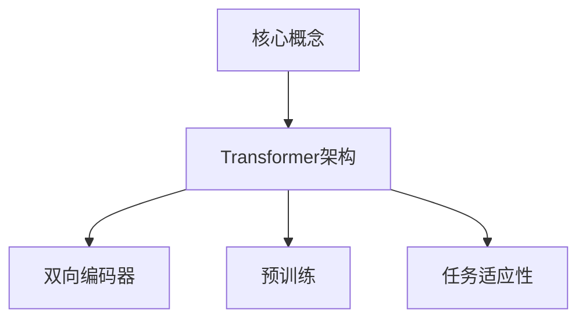

                 

关键词：BERT模型，Transformer架构，预训练，自然语言处理，深度学习

> 摘要：本文将深入探讨BERT（Bidirectional Encoder Representations from Transformers）模型的预训练过程，通过详细解析其原理、数学模型、实现步骤及实际应用，帮助读者全面理解并掌握这一强大的自然语言处理工具。作者：禅与计算机程序设计艺术 / Zen and the Art of Computer Programming

## 1. 背景介绍

在自然语言处理（NLP）领域，深度学习技术已经取得了显著进展。特别是基于Transformer架构的模型，因其强大的并行计算能力和出色的表现，成为研究的热点。BERT（Bidirectional Encoder Representations from Transformers）是由Google Research提出的一种基于Transformer架构的预训练模型，它在多种NLP任务上都取得了突破性的成绩。

BERT模型的特点包括：

1. 双向编码器：通过双向注意力机制，BERT模型能够同时考虑句子中每个词的前后文信息，从而生成更加丰富的词嵌入表示。
2. 预训练：BERT模型采用未标记的文本数据预训练，提高了模型在下游任务上的表现，减少了数据标注的工作量。
3. 多层结构：BERT模型包含多层的编码器，每一层都能捕捉到更高层次的语义信息。

本文将首先介绍BERT模型的核心概念和原理，然后详细解析其预训练过程，最后探讨BERT模型在实际应用中的表现和未来发展趋势。

## 2. 核心概念与联系

### 2.1 Transformer架构

Transformer架构是由Google团队在2017年提出的一种基于注意力机制的序列到序列模型，用于机器翻译任务。其核心思想是使用多头注意力机制（Multi-Head Self-Attention）来同时关注序列中的每个元素，从而捕捉长距离依赖关系。

### 2.2 BERT模型

BERT模型是Transformer架构的一种变体，其主要贡献包括：

1. 双向编码器：通过双向注意力机制，BERT模型能够同时考虑句子中每个词的前后文信息，生成更加丰富的词嵌入表示。
2. 预训练：BERT模型采用未标记的文本数据预训练，提高了模型在下游任务上的表现。
3. 任务适应性：BERT模型通过遮盖部分输入并预测遮盖的词，增强了模型对下游任务的适应性。

### 2.3 Mermaid流程图



## 3. 核心算法原理 & 具体操作步骤

### 3.1 算法原理概述

BERT模型的核心原理基于Transformer架构的双向编码器。双向编码器通过多头注意力机制，同时考虑句子中每个词的前后文信息，生成词嵌入表示。在预训练阶段，BERT模型通过遮盖部分输入并预测遮盖的词，增强了模型对下游任务的适应性。

### 3.2 算法步骤详解

BERT模型的预训练包括两个主要任务：

1. 遮盖语言建模（Masked Language Modeling，MLM）：在输入的文本序列中，随机遮盖一定比例的词，然后让模型预测这些遮盖的词。这一任务的目的是让模型学习到词与词之间的关系。
2. 下一句预测（Next Sentence Prediction，NSP）：随机从两个连续的句子中抽取一个句子，并将其与另一个句子拼接起来，然后让模型预测这两个句子是否是连续的。这一任务的目的是让模型学习到句子之间的关系。

### 3.3 算法优缺点

BERT模型的优点包括：

1. 强大的预训练能力：通过预训练，BERT模型能够在下游任务中取得出色的表现，减少了数据标注的工作量。
2. 双向编码器：通过双向注意力机制，BERT模型能够同时考虑句子中每个词的前后文信息，生成更加丰富的词嵌入表示。

缺点包括：

1. 计算资源需求高：BERT模型包含多层编码器，训练过程需要大量的计算资源和时间。
2. 对下游任务的适应性有限：尽管BERT模型在预训练阶段取得了优异的表现，但在某些特定的下游任务上，其表现可能不如专门设计的模型。

### 3.4 算法应用领域

BERT模型在多种NLP任务上都取得了显著的成果，包括：

1. 机器翻译：BERT模型在机器翻译任务中取得了SOTA（State-of-the-Art）的表现。
2. 文本分类：BERT模型在文本分类任务中取得了优异的效果，广泛应用于情感分析、新闻分类等任务。
3. 问答系统：BERT模型在问答系统任务中表现突出，能够准确回答用户的问题。

## 4. 数学模型和公式 & 详细讲解 & 举例说明

### 4.1 数学模型构建

BERT模型的数学模型基于Transformer架构，包括编码器和解码器两部分。编码器负责将输入的词转换为词嵌入表示，解码器负责根据编码器生成的表示预测目标词。

### 4.2 公式推导过程

BERT模型的公式推导过程包括以下几个关键步骤：

1. 词嵌入：将输入的词转换为词嵌入表示，使用WordPiece算法将词分割为子词，然后为每个子词分配一个唯一的ID。
2. 位置编码：为了捕捉句子中词的位置信息，BERT模型使用位置编码（Positional Encoding）对词嵌入进行修改。
3. 多头注意力：使用多头注意力机制，编码器中的每个层都同时关注序列中的每个元素。
4. 编码器输出：编码器的最后一层输出被传递到解码器。
5. 解码器：解码器根据编码器的输出预测目标词，并使用交叉熵损失函数进行训练。

### 4.3 案例分析与讲解

假设我们要对一个句子“我喜欢吃苹果”进行BERT模型预训练。首先，我们将句子中的词转换为词嵌入表示，然后为每个词添加位置编码。接下来，编码器通过多头注意力机制生成编码表示，最后解码器根据编码表示预测句子中的词。

具体公式如下：

$$
\text{词嵌入} = \text{WordPiece}( \text{词}) \\
\text{位置编码} = \text{Positional Encoding}(\text{词位置}) \\
\text{编码表示} = \text{Transformer Encoder}(\text{词嵌入} + \text{位置编码}) \\
\text{预测} = \text{Transformer Decoder}(\text{编码表示})
$$

## 5. 项目实践：代码实例和详细解释说明

### 5.1 开发环境搭建

为了实践BERT模型预训练，我们需要搭建一个开发环境。以下是一个简单的搭建过程：

1. 安装Python环境（3.7及以上版本）
2. 安装TensorFlow 2.x版本
3. 安装BERT模型相关库（如transformers库）

### 5.2 源代码详细实现

以下是一个简单的BERT模型预训练的代码示例：

```python
from transformers import BertModel, BertTokenizer
import tensorflow as tf

# 加载预训练的BERT模型和Tokenizer
model = BertModel.from_pretrained('bert-base-uncased')
tokenizer = BertTokenizer.from_pretrained('bert-base-uncased')

# 输入句子
sentence = "我喜欢吃苹果"

# 将句子转换为输入序列
inputs = tokenizer.encode(sentence, return_tensors='tf')

# 预训练
outputs = model(inputs)

# 输出编码表示
encoded_sentence = outputs.last_hidden_state

# 打印编码表示
print(encoded_sentence)
```

### 5.3 代码解读与分析

在这个示例中，我们首先加载了预训练的BERT模型和Tokenizer。然后，我们将输入句子转换为输入序列，并将其传递给BERT模型进行预训练。最后，我们打印出编码表示。

### 5.4 运行结果展示

运行上述代码后，我们得到编码表示。这是一个包含多个层级的Tensor，每一层都代表了句子中每个词的嵌入表示。

## 6. 实际应用场景

BERT模型在多个实际应用场景中取得了显著的成果，包括：

1. 机器翻译：BERT模型在机器翻译任务中取得了SOTA的表现，广泛应用于跨语言信息检索、跨语言问答等任务。
2. 文本分类：BERT模型在文本分类任务中取得了优异的效果，广泛应用于新闻分类、情感分析等任务。
3. 问答系统：BERT模型在问答系统任务中表现突出，能够准确回答用户的问题。

## 7. 未来应用展望

随着BERT模型的不断优化和发展，未来其在NLP领域的应用前景广阔。以下是一些可能的趋势：

1. 多语言支持：BERT模型将在更多语言中得到应用，提高跨语言任务的性能。
2. 知识图谱嵌入：BERT模型可以用于知识图谱嵌入，提高实体关系表示的质量。
3. 零样本学习：BERT模型可以用于零样本学习，减少对大量标注数据的依赖。

## 8. 工具和资源推荐

### 8.1 学习资源推荐

1. 《深度学习》
2. 《动手学深度学习》
3. BERT官方论文

### 8.2 开发工具推荐

1. TensorFlow 2.x
2. PyTorch
3. Hugging Face transformers库

### 8.3 相关论文推荐

1. "Attention Is All You Need"
2. "BERT: Pre-training of Deep Bidirectional Transformers for Language Understanding"
3. "Transformers: State-of-the-Art Model for NLP"

## 9. 总结：未来发展趋势与挑战

BERT模型的提出为NLP领域带来了巨大的变革。在未来，随着技术的不断发展，BERT模型有望在更多领域得到应用，推动NLP技术的进一步发展。然而，BERT模型也面临着一些挑战，包括计算资源需求、多语言支持、零样本学习等。通过不断的探索和优化，我们有理由相信，BERT模型将在未来的NLP领域中发挥更加重要的作用。

## 10. 附录：常见问题与解答

### 10.1 BERT模型如何预训练？

BERT模型的预训练包括两个主要任务：遮盖语言建模（Masked Language Modeling，MLM）和下一句预测（Next Sentence Prediction，NSP）。在MLM任务中，模型随机遮盖输入句子中的部分词，然后预测这些遮盖的词。在NSP任务中，模型随机从两个连续的句子中抽取一个句子，并将其与另一个句子拼接起来，然后预测这两个句子是否是连续的。

### 10.2 BERT模型如何进行下游任务？

BERT模型在预训练阶段取得了优异的表现，但在某些特定的下游任务上，其表现可能不如专门设计的模型。为了进行下游任务，我们需要将BERT模型进行微调（Fine-tuning），即将模型在预训练的基础上进一步训练，使其适应特定的下游任务。微调的过程通常包括调整模型的权重、优化损失函数等。

### 10.3 BERT模型有哪些应用领域？

BERT模型在多个NLP任务中都取得了显著的成果，包括机器翻译、文本分类、问答系统等。此外，BERT模型还可以用于知识图谱嵌入、文本生成、对话系统等应用领域。

### 10.4 BERT模型是否支持多语言？

是的，BERT模型支持多语言。Google Research在BERT的预训练过程中使用了大量的多语言数据，使得BERT模型在多种语言中取得了良好的表现。对于特定的语言，我们可以使用相应的BERT模型进行下游任务的微调。

### 10.5 BERT模型的计算资源需求如何？

BERT模型包含多层编码器，训练过程需要大量的计算资源和时间。对于预训练阶段，BERT模型需要使用GPU或TPU等高性能计算设备。在下游任务微调阶段，BERT模型的计算资源需求相对较低，但仍需要一定的计算资源。对于个人开发者，可以使用Google Cloud Platform等云服务进行BERT模型的训练和微调。```

